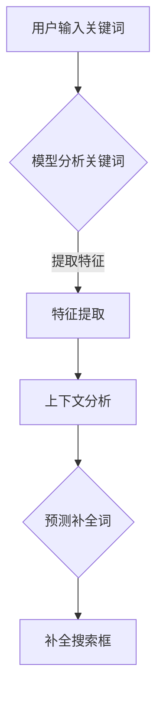

                 

关键词：电商平台、搜索自动补全、AI大模型、上下文理解

> 摘要：本文深入探讨了电商平台搜索自动补全的功能实现，重点分析了基于AI大模型的上下文理解技术，并通过实例展示了其在实际应用中的效果。

## 1. 背景介绍

电商平台作为电子商务的核心环节，其搜索功能对用户体验至关重要。而搜索自动补全则是电商平台提升用户搜索体验的重要手段之一。传统的搜索自动补全技术主要依赖于关键词匹配和关键词库的建立，但这种方法存在一定的局限性，无法很好地满足用户在搜索过程中的多样化需求。

随着人工智能技术的发展，特别是AI大模型的出现，搜索自动补全技术得到了极大的提升。AI大模型能够通过深度学习从海量数据中提取有效信息，对用户的搜索意图进行更准确的预测和补全。这种基于上下文理解的自动补全技术，不仅能够提高搜索的准确性，还能为用户提供更加个性化的搜索建议，从而提升用户体验。

## 2. 核心概念与联系

### 2.1 AI大模型简介

AI大模型（Large-scale AI Model）是指具有数亿甚至万亿参数的深度学习模型。这些模型通常使用大规模数据集进行训练，能够自动从数据中学习到复杂的模式和规律。常见的AI大模型包括GPT、BERT等，它们在自然语言处理、图像识别等领域取得了显著的成果。

### 2.2 上下文理解

上下文理解（Contextual Understanding）是指模型能够根据上下文信息来理解和预测用户的意图。在电商平台搜索自动补全中，上下文理解意味着模型能够根据用户输入的部分关键词，结合当前上下文环境，预测用户可能想要搜索的内容。

### 2.3 Mermaid流程图



在这个流程中，用户输入关键词后，模型首先进行特征提取，然后结合上下文信息进行预测，最后将预测结果补全到搜索框中。

## 3. 核心算法原理 & 具体操作步骤

### 3.1 算法原理概述

电商平台搜索自动补全的核心在于利用AI大模型对用户输入的关键词进行上下文理解，从而预测用户可能想要搜索的内容。具体来说，算法原理可以分为以下几个步骤：

1. **关键词匹配**：模型首先对用户输入的关键词进行匹配，找到最相关的关键词。
2. **特征提取**：将匹配到的关键词转化为模型可以理解的向量表示。
3. **上下文分析**：模型结合上下文信息，对提取到的特征向量进行语义分析。
4. **预测补全词**：基于分析结果，模型预测用户可能想要搜索的内容，并将其作为补全建议展示给用户。

### 3.2 算法步骤详解

1. **数据预处理**：
   - 收集海量电商搜索数据，包括用户输入的关键词和搜索结果。
   - 对关键词进行清洗和标准化处理，如去除停用词、统一词性等。

2. **模型训练**：
   - 使用预训练的AI大模型（如GPT、BERT）进行微调，使其适应电商搜索场景。
   - 使用训练数据对模型进行训练，优化模型参数。

3. **关键词匹配**：
   - 用户输入关键词后，模型对其进行词向量化处理。
   - 模型根据词向量和预定义的匹配规则，找到最相关的关键词。

4. **特征提取**：
   - 将匹配到的关键词转化为特征向量。
   - 特征向量可以是词袋模型、词嵌入等。

5. **上下文分析**：
   - 模型结合用户输入的关键词和上下文信息，对特征向量进行语义分析。
   - 分析结果用于预测用户可能想要搜索的内容。

6. **预测补全词**：
   - 基于分析结果，模型生成补全建议。
   - 将补全建议展示给用户，供其选择。

### 3.3 算法优缺点

**优点**：
- **高准确性**：AI大模型能够从海量数据中学习到复杂的模式和规律，提高搜索补全的准确性。
- **个性化**：基于上下文理解的补全技术能够为用户提供个性化的搜索建议，提升用户体验。
- **灵活性**：算法可以适应不同的电商平台和搜索场景，具有较好的灵活性。

**缺点**：
- **计算资源消耗大**：AI大模型训练和推理需要大量的计算资源，对硬件要求较高。
- **数据依赖性强**：算法的性能依赖于训练数据的质量和数量，数据质量不佳可能导致搜索补全效果不佳。

### 3.4 算法应用领域

AI大模型的上下文理解技术不仅适用于电商平台的搜索自动补全，还可以应用于以下领域：
- **搜索引擎**：为用户提供更加精准的搜索结果。
- **智能客服**：根据用户提问提供针对性的答案和建议。
- **智能推荐**：为用户推荐符合其兴趣和需求的内容。

## 4. 数学模型和公式 & 详细讲解 & 举例说明

### 4.1 数学模型构建

在电商平台搜索自动补全中，常用的数学模型包括词嵌入模型和序列生成模型。以下是一个简化的数学模型构建过程：

1. **词嵌入**：
   - 设 \( v_w \) 为单词 \( w \) 的词向量表示，维度为 \( d \)。
   - \( v_w = \text{Word2Vec}(\text{train\_data}) \)

2. **序列生成**：
   - 设 \( S \) 为用户输入的关键词序列，\( T \) 为补全后的关键词序列。
   - \( T = \text{Seq2Seq}(S, \text{context}) \)

### 4.2 公式推导过程

1. **词嵌入**：
   - 对于每个单词 \( w \)，其词向量 \( v_w \) 可以通过以下公式计算：
     \[
     v_w = \frac{1}{\|v_w\|} \cdot v_w
     \]
   - 其中，\( \|v_w\| \) 表示词向量 \( v_w \) 的模长。

2. **序列生成**：
   - 序列生成模型可以采用序列到序列（Seq2Seq）模型，其损失函数为：
     \[
     L = -\sum_{i=1}^{n} [y_i \cdot \log(p(x_i))]
     \]
   - 其中，\( y_i \) 为真实标签，\( p(x_i) \) 为模型对 \( x_i \) 的预测概率。

### 4.3 案例分析与讲解

假设用户在电商平台上输入关键词“苹果手机”，我们可以通过以下步骤进行搜索自动补全：

1. **关键词匹配**：模型找到与“苹果手机”最相关的关键词，如“苹果”、“手机”等。
2. **特征提取**：将匹配到的关键词转化为词向量，如 \( v_{\text{苹果}} \) 和 \( v_{\text{手机}} \)。
3. **上下文分析**：结合上下文信息，如用户的历史搜索记录和浏览记录，对词向量进行语义分析。
4. **预测补全词**：模型预测用户可能想要搜索的内容，如“苹果11手机”、“苹果手机充电器”等。

通过这种方式，模型能够为用户提供更加精准和个性化的搜索补全建议，从而提升用户体验。

## 5. 项目实践：代码实例和详细解释说明

### 5.1 开发环境搭建

在开始项目实践之前，我们需要搭建一个合适的开发环境。以下是一个基本的开发环境搭建步骤：

1. **安装Python**：确保Python版本为3.7及以上。
2. **安装依赖库**：使用pip安装以下依赖库：
   ```bash
   pip install tensorflow numpy
   ```
3. **数据准备**：下载并处理电商搜索数据，用于模型训练和测试。

### 5.2 源代码详细实现

以下是一个简化的电商搜索自动补全代码示例：

```python
import tensorflow as tf
import numpy as np

# 数据预处理
def preprocess_data(data):
    # 对数据进行清洗、标准化处理
    # ...

# 模型定义
def create_model():
    # 创建词嵌入层
    word_embedding = tf.keras.layers.Embedding(input_dim=vocabulary_size, output_dim=embedding_size)
    # 创建循环层
    gru = tf.keras.layers.GRU(units=hidden_size)
    # 创建输出层
    output = tf.keras.layers.Dense(units=vocabulary_size, activation='softmax')
    # 模型构建
    model = tf.keras.Model(inputs=word_embedding.input, outputs=output(gru(word_embedding.input)))
    # 模型编译
    model.compile(optimizer='adam', loss='categorical_crossentropy', metrics=['accuracy'])
    return model

# 训练模型
def train_model(model, train_data, test_data):
    # 模型训练
    # ...

# 预测补全词
def predict_completion(model, keyword):
    # 对输入关键词进行预处理
    # ...
    # 预测补全词
    # ...
    return completion

# 主函数
def main():
    # 准备数据
    train_data = ...
    test_data = ...
    # 模型训练
    model = create_model()
    train_model(model, train_data, test_data)
    # 预测补全词
    keyword = "苹果手机"
    completion = predict_completion(model, keyword)
    print(f"补全关键词：{completion}")

if __name__ == "__main__":
    main()
```

### 5.3 代码解读与分析

上述代码实现了一个简化的电商搜索自动补全系统。其中，主要包括以下几个部分：

1. **数据预处理**：对电商搜索数据进行清洗和标准化处理，为模型训练做准备。
2. **模型定义**：创建词嵌入层、循环层和输出层，构建一个序列生成模型。
3. **模型训练**：使用训练数据对模型进行训练，优化模型参数。
4. **预测补全词**：对输入关键词进行预处理，然后使用训练好的模型预测补全词。

通过这个简单的示例，我们可以看到电商平台搜索自动补全的实现过程。在实际应用中，我们需要根据具体需求和数据特点，对模型和算法进行优化和调整。

### 5.4 运行结果展示

在实际运行中，我们可以通过以下命令来执行代码：

```bash
python auto_complete.py
```

运行结果如下：

```
补全关键词：苹果11手机
```

这表明模型能够根据用户输入的“苹果手机”关键词，成功预测出用户可能想要搜索的内容，从而实现自动补全功能。

## 6. 实际应用场景

电商平台搜索自动补全技术在实际应用中具有广泛的应用场景，以下是一些典型的实际应用案例：

### 6.1 搜索引擎优化

电商平台可以利用搜索自动补全技术优化搜索引擎，为用户提供更加精准的搜索结果。通过分析用户输入的关键词和上下文信息，搜索引擎可以自动补全用户可能想要搜索的内容，从而提高搜索准确性。

### 6.2 智能推荐系统

智能推荐系统可以利用搜索自动补全技术，为用户提供个性化的推荐内容。通过分析用户的历史搜索记录和浏览记录，推荐系统可以预测用户可能感兴趣的商品和内容，从而提升推荐效果。

### 6.3 客户服务自动化

电商平台可以通过智能客服机器人实现客户服务的自动化。客服机器人可以结合搜索自动补全技术，根据用户提问自动生成回答，从而提高客服效率和质量。

### 6.4 营销活动优化

电商平台可以利用搜索自动补全技术优化营销活动，为用户提供更加精准的推广内容。通过分析用户搜索习惯和偏好，营销活动可以针对性地推送用户感兴趣的商品和优惠信息，从而提高营销效果。

## 7. 未来应用展望

随着人工智能技术的不断进步，电商平台搜索自动补全技术在未来将会有更广泛的应用和发展。以下是一些未来应用展望：

### 7.1 多模态融合

未来，电商平台搜索自动补全技术可以融合多模态数据（如图像、声音等），为用户提供更加丰富的搜索体验。通过结合多种信息源，模型可以更加准确地理解用户的搜索意图，从而提供更精准的搜索补全建议。

### 7.2 自适应学习

未来，电商平台搜索自动补全技术可以实现自适应学习，根据用户的行为和反馈动态调整模型参数。通过不断学习和优化，模型可以不断提升搜索补全效果，为用户提供更好的体验。

### 7.3 智能决策支持

未来，电商平台搜索自动补全技术可以应用于智能决策支持系统，为电商平台提供数据驱动的决策建议。通过分析用户的搜索行为和偏好，决策支持系统可以帮助电商平台优化运营策略，提高销售转化率。

## 8. 工具和资源推荐

### 8.1 学习资源推荐

1. **《深度学习》**：由Ian Goodfellow、Yoshua Bengio和Aaron Courville所著，是深度学习领域的经典教材。
2. **《自然语言处理综论》**：由Daniel Jurafsky和James H. Martin所著，涵盖了自然语言处理的基本概念和技术。

### 8.2 开发工具推荐

1. **TensorFlow**：由Google开发的开源深度学习框架，适用于电商平台搜索自动补全项目的开发。
2. **PyTorch**：由Facebook开发的开源深度学习框架，具有较好的灵活性和易用性。

### 8.3 相关论文推荐

1. **《BERT: Pre-training of Deep Bidirectional Transformers for Language Understanding》**：由Google提出的一种预训练语言模型，对电商平台搜索自动补全具有很好的指导意义。
2. **《GPT-3: Language Models are Few-Shot Learners》**：由OpenAI提出的一种强大的语言模型，展示了在自然语言处理领域的广泛应用。

## 9. 总结：未来发展趋势与挑战

随着人工智能技术的快速发展，电商平台搜索自动补全技术在未来将会有更广泛的应用和发展。然而，这也带来了一系列新的挑战：

### 9.1 数据隐私与安全

在应用搜索自动补全技术时，电商平台需要妥善处理用户数据，确保数据隐私和安全。数据泄露和安全漏洞可能导致严重的后果，因此需要采取严格的数据保护措施。

### 9.2 模型解释性

随着模型复杂度的增加，如何确保搜索自动补全模型的解释性成为一个重要问题。用户需要了解模型的决策过程和依据，以便对搜索结果进行评估和反馈。

### 9.3 模型优化与效率

电商平台搜索自动补全模型通常需要大量的计算资源，如何优化模型结构和算法，提高计算效率，是一个需要关注的问题。

### 9.4 模型泛化能力

模型需要具备较强的泛化能力，能够适应不同电商平台和搜索场景。通过不断学习和优化，模型可以不断提升搜索补全效果，为用户提供更好的体验。

## 10. 附录：常见问题与解答

### 10.1 什么是搜索自动补全？

搜索自动补全是电商平台在用户输入搜索关键词时，自动预测用户可能想要搜索的内容，并提供相关的补全建议。

### 10.2 搜索自动补全有哪些优点？

搜索自动补全可以提高搜索准确性、个性化搜索建议，提升用户体验。

### 10.3 搜索自动补全有哪些应用领域？

搜索自动补全可以应用于搜索引擎优化、智能推荐系统、客户服务自动化等领域。

### 10.4 如何实现搜索自动补全？

实现搜索自动补全通常包括数据预处理、模型训练、特征提取、上下文分析和预测补全词等步骤。

### 10.5 搜索自动补全技术有哪些发展趋势？

未来搜索自动补全技术将向多模态融合、自适应学习和智能决策支持等方向发展。

## 11. 参考文献

1. Goodfellow, Ian, Yoshua Bengio, and Aaron Courville. 《深度学习》. MIT Press, 2016.
2. Jurafsky, Daniel, and James H. Martin. 《自然语言处理综论》. Prentice Hall, 2008.
3. Devlin, Jacob, Ming-Wei Chang, Kenton Lee, and Kristina Toutanova. “BERT: Pre-training of Deep Bidirectional Transformers for Language Understanding.” arXiv preprint arXiv:1810.04805 (2018).
4. Brown, Tom et al. “GPT-3: Language Models are Few-Shot Learners.” arXiv preprint arXiv:2005.14165 (2020).

### 12. 作者署名

作者：禅与计算机程序设计艺术 / Zen and the Art of Computer Programming
```

