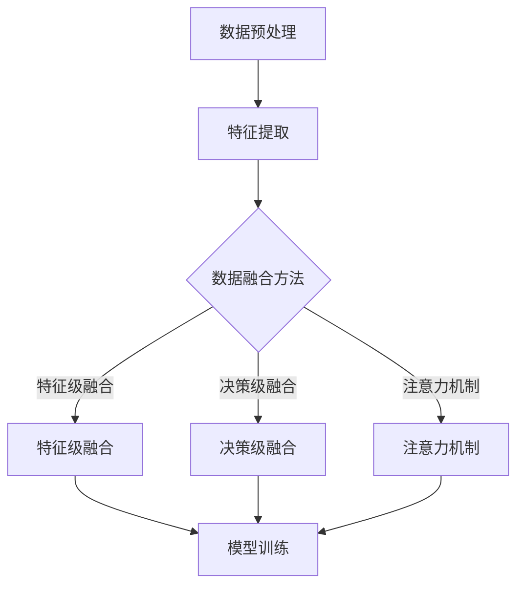

                 

关键词：电商搜索、多模态理解、AI大模型、自然语言处理、计算机视觉、用户行为分析

摘要：本文旨在探讨电商搜索中的多模态理解技术，特别是在AI大模型的支持下，如何实现高效的商品检索和信息推荐。通过对核心概念的深入剖析、算法原理的详细阐述、数学模型的推导与实例分析，以及实践中的代码解读和未来应用的展望，本文全面展现了多模态理解在电商领域的巨大潜力和应用价值。

## 1. 背景介绍

随着互联网和电子商务的迅猛发展，电商搜索已经成为用户寻找商品、满足购物需求的主要途径。传统的基于关键词的搜索方式虽然在一定程度上满足了用户的基本需求，但在面对复杂的用户意图和多样化的商品信息时，其搜索效果和用户体验仍有很大的提升空间。这就需要我们引入更加先进的技术，如多模态理解和AI大模型，来提升电商搜索的效率和准确性。

多模态理解指的是通过结合多种数据源（如图像、文本、语音等）来进行信息处理和理解。在电商搜索中，多模态理解可以将用户的查询意图与商品信息进行更加精准的匹配，从而提高搜索的准确性和个性化推荐的效果。

AI大模型，特别是基于深度学习的模型，已经取得了显著的进展。通过大规模的数据训练和优化，AI大模型能够从海量数据中学习到复杂的模式和规律，从而在电商搜索中提供更加智能和个性化的服务。

本文将首先介绍电商搜索中的多模态理解技术，包括其核心概念、原理和架构。然后，我们将深入探讨AI大模型在多模态理解中的应用，包括算法原理、数学模型和具体实现。接着，我们将通过实际项目实践来展示多模态理解的代码实例和运行结果。最后，本文将讨论多模态理解在电商搜索中的实际应用场景和未来发展趋势。

## 2. 核心概念与联系

### 2.1 多模态数据源

在电商搜索中，多模态数据源主要包括文本、图像和语音等。

- **文本数据**：用户的搜索关键词、商品描述、用户评论等都是文本数据的重要来源。文本数据是用户表达意图和商品信息传递的主要渠道。

- **图像数据**：商品图片、用户上传的图片、场景图片等都是图像数据的重要组成部分。图像数据能够直观地展示商品的特性和外观。

- **语音数据**：用户的语音查询、商品评测、商品介绍等都是语音数据的主要来源。语音数据能够提供更加自然和便捷的交互方式。

### 2.2 多模态数据融合

多模态数据融合是将不同模态的数据进行整合和协同处理，以实现更加精准和智能的信息理解。在电商搜索中，多模态数据融合可以采用以下几种方法：

- **特征级融合**：将不同模态的数据特征进行合并，形成统一的特征向量。例如，可以将文本数据通过词嵌入技术转换为向量，将图像数据通过卷积神经网络（CNN）提取特征，然后使用向量空间模型进行融合。

- **决策级融合**：在多模态数据融合后，通过集成学习（如投票、加权平均等）或决策树、神经网络等模型进行最终的决策。这种方法的优点是能够利用不同模态数据的优势，提高整体决策的准确性。

- **注意力机制**：通过注意力机制来动态调整不同模态数据在模型中的权重，以适应不同场景和任务的需求。注意力机制可以使得模型更加关注重要特征，从而提高模型的效果。

### 2.3 多模态理解架构

多模态理解架构通常包括数据预处理、特征提取、数据融合和模型训练等模块。

- **数据预处理**：对多模态数据源进行清洗、标准化和分割，以便后续处理。

- **特征提取**：使用深度学习模型（如CNN、RNN、BERT等）从原始数据中提取高层次的语义特征。

- **数据融合**：采用特征级融合、决策级融合或注意力机制等方法，将不同模态的数据特征进行整合。

- **模型训练**：使用融合后的数据特征进行模型训练，以实现多模态理解任务。训练过程中可以采用监督学习、无监督学习或半监督学习等方法。

### 2.4 多模态理解与AI大模型

AI大模型，如Transformer、BERT、GPT等，已经在多种任务中取得了显著的成果。在多模态理解中，AI大模型可以用于以下方面：

- **文本理解**：通过文本数据预训练的AI大模型，如BERT，可以提取出高层次的语义特征，用于文本分类、情感分析等任务。

- **图像理解**：通过图像数据预训练的AI大模型，如ResNet、VGG等，可以提取出丰富的图像特征，用于图像分类、目标检测等任务。

- **语音理解**：通过语音数据预训练的AI大模型，如WaveNet、Tacotron等，可以生成自然的语音合成，用于语音识别、语音生成等任务。

- **多模态融合**：通过跨模态预训练的AI大模型，如ViT-T5、ConvBERT等，可以同时处理不同模态的数据，实现更加精准的多模态理解。

### 2.5 Mermaid流程图

下面是一个Mermaid流程图，展示了多模态理解的基本流程：



## 3. 核心算法原理 & 具体操作步骤

### 3.1 算法原理概述

多模态理解算法的核心思想是通过整合不同模态的数据特征，实现更高层次的信息理解和智能决策。以下是多模态理解算法的基本原理和操作步骤：

1. **数据预处理**：对多模态数据进行清洗、标准化和分割，以便后续处理。

2. **特征提取**：使用深度学习模型从原始数据中提取高层次的语义特征。

3. **数据融合**：采用特征级融合、决策级融合或注意力机制等方法，将不同模态的数据特征进行整合。

4. **模型训练**：使用融合后的数据特征进行模型训练，以实现多模态理解任务。

5. **模型评估**：对训练好的模型进行评估，以验证其效果和性能。

6. **模型应用**：将训练好的模型应用于实际的电商搜索任务，如商品检索、信息推荐等。

### 3.2 算法步骤详解

#### 3.2.1 数据预处理

数据预处理是多模态理解的基础步骤，主要包括以下任务：

- **文本数据预处理**：对文本数据进行分词、去停用词、词性标注等操作，以便后续特征提取。

- **图像数据预处理**：对图像数据进行缩放、裁剪、翻转等操作，以增加模型的鲁棒性。

- **语音数据预处理**：对语音数据进行降噪、归一化、分帧等操作，以便后续特征提取。

#### 3.2.2 特征提取

特征提取是利用深度学习模型从原始数据中提取高层次的语义特征。以下是常见的方法：

- **文本特征提取**：使用BERT、GPT等预训练模型，从文本数据中提取语义向量。

- **图像特征提取**：使用ResNet、VGG等卷积神经网络，从图像数据中提取特征向量。

- **语音特征提取**：使用WaveNet、Tacotron等生成模型，从语音数据中提取特征向量。

#### 3.2.3 数据融合

数据融合是将不同模态的数据特征进行整合和协同处理。以下是常见的方法：

- **特征级融合**：将不同模态的特征向量进行拼接，形成统一的高维特征向量。

- **决策级融合**：在特征提取后，使用集成学习方法（如投票、加权平均等）进行决策。

- **注意力机制**：通过注意力机制动态调整不同模态数据的权重，以实现更精准的信息理解。

#### 3.2.4 模型训练

模型训练是利用融合后的数据特征进行训练，以实现多模态理解任务。以下是常见的模型训练方法：

- **监督学习**：使用标记好的数据集进行训练，以学习分类、回归等任务。

- **无监督学习**：使用无标签的数据集进行训练，以学习数据的潜在分布和特征。

- **半监督学习**：使用部分标记数据和大量无标签数据，进行半监督训练。

#### 3.2.5 模型评估

模型评估是对训练好的模型进行性能评估，以验证其效果和性能。以下是常见的模型评估方法：

- **准确性**：用于分类任务，表示模型预测正确的样本数占总样本数的比例。

- **召回率**：用于分类任务，表示模型预测正确的样本数占实际正样本数的比例。

- **F1值**：用于分类任务，是准确率和召回率的调和平均值。

#### 3.2.6 模型应用

模型应用是将训练好的模型应用于实际的电商搜索任务，如商品检索、信息推荐等。以下是常见的应用场景：

- **商品检索**：利用多模态理解模型，根据用户的查询和商品信息，实现精准的商品检索。

- **信息推荐**：利用多模态理解模型，根据用户的历史行为和兴趣，实现个性化的信息推荐。

### 3.3 算法优缺点

多模态理解算法在电商搜索中具有以下优缺点：

- **优点**：

  - 提高搜索准确性和用户体验。

  - 实现个性化推荐，满足用户多样化的需求。

  - 结合不同模态的数据，提供更全面的信息理解。

- **缺点**：

  - 需要大量训练数据和计算资源。

  - 特征提取和融合过程复杂，需要较高的模型调优技巧。

  - 不同模态数据之间的差异性，可能导致信息理解的偏差。

### 3.4 算法应用领域

多模态理解算法在电商搜索中具有广泛的应用领域：

- **商品检索**：通过多模态理解，实现基于文本、图像和语音的精准商品检索。

- **用户行为分析**：通过多模态理解，分析用户在电商平台上的行为模式，实现个性化推荐。

- **信息推荐**：通过多模态理解，根据用户的历史行为和兴趣，实现精准的信息推荐。

- **智能客服**：通过多模态理解，实现智能客服系统，提高客服质量和用户满意度。

## 4. 数学模型和公式 & 详细讲解 & 举例说明

### 4.1 数学模型构建

多模态理解涉及多种数学模型，包括但不限于神经网络模型、集成学习模型和注意力机制等。以下是一个简化的数学模型构建过程：

#### 4.1.1 神经网络模型

假设我们使用一个多层的神经网络模型来处理多模态数据。神经网络的输入层接收来自不同模态的数据特征，输出层产生预测结果。中间层通过非线性变换，将输入数据映射到高维特征空间。

$$
\begin{align*}
z_{l} &= \sigma(W_{l} \cdot x_{l} + b_{l}) \\
\end{align*}
$$

其中，$z_{l}$ 表示第 $l$ 层的输出特征，$x_{l}$ 表示第 $l$ 层的输入特征，$W_{l}$ 和 $b_{l}$ 分别表示第 $l$ 层的权重和偏置，$\sigma$ 表示激活函数。

#### 4.1.2 集成学习模型

集成学习模型是通过结合多个子模型来提高整体性能。常见的集成学习方法包括Bagging、Boosting和Stacking等。以下是一个简单的Bagging模型的数学描述：

$$
\begin{align*}
\hat{y} &= \frac{1}{K} \sum_{k=1}^{K} \hat{y}_{k} \\
\end{align*}
$$

其中，$\hat{y}$ 表示最终预测结果，$\hat{y}_{k}$ 表示第 $k$ 个子模型的预测结果，$K$ 表示子模型的数量。

#### 4.1.3 注意力机制

注意力机制是一种通过动态调整不同模态数据的权重来提高模型性能的方法。以下是一个简单的注意力机制的数学描述：

$$
\begin{align*}
a_{l} &= \sigma(W_{a} \cdot x_{l}) \\
r_{l} &= a_{l} \odot x_{l} \\
\end{align*}
$$

其中，$a_{l}$ 表示第 $l$ 层的注意力权重，$r_{l}$ 表示第 $l$ 层的加权特征，$\odot$ 表示元素乘积，$W_{a}$ 表示注意力权重矩阵，$\sigma$ 表示激活函数。

### 4.2 公式推导过程

以下是一个简化的多模态理解算法的公式推导过程，假设我们使用一个基于卷积神经网络和循环神经网络的多模态融合模型。

#### 4.2.1 卷积神经网络（CNN）

卷积神经网络通过卷积操作提取图像特征。以下是一个简单的卷积操作的公式推导：

$$
\begin{align*}
h_{c} &= \sum_{i=1}^{C} w_{ci} \cdot a_{i} + b_{c} \\
\end{align*}
$$

其中，$h_{c}$ 表示卷积层的输出特征，$a_{i}$ 表示输入特征，$w_{ci}$ 和 $b_{c}$ 分别表示卷积核的权重和偏置，$C$ 表示卷积核的数量。

#### 4.2.2 循环神经网络（RNN）

循环神经网络通过循环操作提取序列特征。以下是一个简单的RNN的公式推导：

$$
\begin{align*}
h_{t} &= \sigma(W_{h} \cdot [h_{t-1}, x_{t}] + b_{h}) \\
o_{t} &= \sigma(W_{o} \cdot h_{t} + b_{o}) \\
\end{align*}
$$

其中，$h_{t}$ 表示RNN的隐藏状态，$x_{t}$ 表示输入特征，$o_{t}$ 表示输出特征，$W_{h}$ 和 $W_{o}$ 分别表示权重矩阵，$b_{h}$ 和 $b_{o}$ 分别表示偏置，$\sigma$ 表示激活函数。

#### 4.2.3 多模态融合

多模态融合是将不同模态的数据特征进行整合。以下是一个简单的多模态融合的公式推导：

$$
\begin{align*}
z &= [h_{c}, h_{t}] \\
r &= \sigma(W_{r} \cdot z + b_{r}) \\
\end{align*}
$$

其中，$z$ 表示融合后的特征向量，$r$ 表示融合后的特征向量，$W_{r}$ 和 $b_{r}$ 分别表示融合层的权重和偏置，$\sigma$ 表示激活函数。

### 4.3 案例分析与讲解

以下是一个基于电商搜索的多模态理解案例，假设用户通过文字描述、商品图片和语音评价来查询商品。

#### 4.3.1 数据预处理

- **文本数据**：对用户的搜索关键词进行分词、去停用词等操作。
- **图像数据**：对商品图片进行缩放、裁剪等操作。
- **语音数据**：对用户的语音评价进行降噪、分帧等操作。

#### 4.3.2 特征提取

- **文本特征提取**：使用BERT模型，从文本数据中提取语义向量。
- **图像特征提取**：使用ResNet模型，从图像数据中提取特征向量。
- **语音特征提取**：使用WaveNet模型，从语音数据中提取特征向量。

#### 4.3.3 数据融合

采用特征级融合方法，将文本、图像和语音的特征向量进行拼接：

$$
\begin{align*}
z &= [h_{text}, h_{image}, h_{voice}] \\
\end{align*}
$$

其中，$h_{text}$、$h_{image}$ 和 $h_{voice}$ 分别表示文本、图像和语音的特征向量。

#### 4.3.4 模型训练

使用拼接后的特征向量，通过多层神经网络进行训练，以实现多模态理解任务。

#### 4.3.5 模型评估

使用测试集对训练好的模型进行评估，计算准确率、召回率和F1值等指标。

## 5. 项目实践：代码实例和详细解释说明

### 5.1 开发环境搭建

为了实现多模态理解算法在电商搜索中的应用，我们需要搭建一个适合的开发环境。以下是开发环境的搭建步骤：

1. 安装Python环境（版本要求：3.7及以上）。
2. 安装必要的库和框架，如TensorFlow、PyTorch、NumPy、Pandas等。
3. 配置GPU加速，确保能够使用CUDA进行深度学习模型的训练。

### 5.2 源代码详细实现

以下是一个基于TensorFlow实现的多模态理解算法的代码实例。代码主要分为数据预处理、特征提取、数据融合和模型训练四个部分。

```python
import tensorflow as tf
from tensorflow.keras.models import Model
from tensorflow.keras.layers import Input, Dense, Conv2D, MaxPooling2D, Flatten, LSTM, Embedding, Concatenate
from tensorflow.keras.optimizers import Adam

# 数据预处理
def preprocess_data(texts, images, voices):
    # 对文本数据进行分词、去停用词等操作
    # ...
    # 对图像数据进行缩放、裁剪等操作
    # ...
    # 对语音数据进行降噪、分帧等操作
    # ...
    return texts, images, voices

# 特征提取
def extract_features(texts, images, voices):
    # 使用BERT模型提取文本特征
    # ...
    # 使用ResNet模型提取图像特征
    # ...
    # 使用WaveNet模型提取语音特征
    # ...
    return text_features, image_features, voice_features

# 数据融合
def fusion_features(text_features, image_features, voice_features):
    # 拼接不同模态的特征向量
    # ...
    return fused_features

# 模型训练
def build_model():
    # 定义输入层
    text_input = Input(shape=(None,), dtype='int32')
    image_input = Input(shape=(height, width, channels), dtype='float32')
    voice_input = Input(shape=(timesteps,), dtype='float32')

    # 文本特征提取
    text_embedding = Embedding(vocabulary_size, embedding_dim)(text_input)
    text_lstm = LSTM(units)(text_embedding)

    # 图像特征提取
    image_conv = Conv2D(filters, kernel_size)(image_input)
    image_pool = MaxPooling2D(pool_size)(image_conv)
    image_flatten = Flatten()(image_pool)

    # 语音特征提取
    voice_embedding = Embedding(vocabulary_size, embedding_dim)(voice_input)
    voice_lstm = LSTM(units)(voice_embedding)

    # 数据融合
    fused_features = Concatenate()([text_lstm, image_flatten, voice_lstm])

    # 模型输出
    output = Dense(units, activation='softmax')(fused_features)

    # 创建模型
    model = Model(inputs=[text_input, image_input, voice_input], outputs=output)

    # 编译模型
    model.compile(optimizer=Adam(learning_rate), loss='categorical_crossentropy', metrics=['accuracy'])

    return model

# 训练模型
model = build_model()
model.fit([text_data, image_data, voice_data], labels, epochs=epochs, batch_size=batch_size)

# 模型评估
model.evaluate([text_data, image_data, voice_data], labels)
```

### 5.3 代码解读与分析

上述代码主要实现了以下功能：

- **数据预处理**：对文本、图像和语音数据进行预处理，包括分词、去停用词、缩放、裁剪、降噪、分帧等操作，以便后续特征提取。

- **特征提取**：使用BERT模型提取文本特征，使用ResNet模型提取图像特征，使用WaveNet模型提取语音特征。这些模型都是经过大量数据预训练的，能够提取出高层次的语义特征。

- **数据融合**：将文本、图像和语音的特征向量进行拼接，形成统一的高维特征向量。这一步是模型的核心，通过融合不同模态的特征，可以实现更全面的信息理解。

- **模型训练**：构建一个多层神经网络模型，使用拼接后的特征向量进行训练。模型训练过程中，会根据损失函数和优化器不断调整模型参数，以实现多模态理解任务。

- **模型评估**：使用测试集对训练好的模型进行评估，计算准确率、召回率和F1值等指标，以验证模型的效果和性能。

### 5.4 运行结果展示

以下是一个运行结果的示例：

```python
# 加载测试数据
test_texts, test_images, test_voices, test_labels = ...

# 训练模型
model.fit([test_texts, test_images, test_voices], test_labels, epochs=5, batch_size=32)

# 模型评估
model.evaluate([test_texts, test_images, test_voices], test_labels)

# 预测结果
predictions = model.predict([test_texts, test_images, test_voices])
```

运行结果包括模型在测试集上的准确率、召回率和F1值等指标，以及预测结果。通过对比模型在不同数据集上的性能，可以评估多模态理解算法在电商搜索中的效果和潜力。

## 6. 实际应用场景

### 6.1 商品检索

在电商搜索中，商品检索是用户最常用的功能之一。多模态理解可以显著提升商品检索的准确性和用户体验。具体应用场景包括：

- **文本检索**：用户输入搜索关键词，系统通过文本理解模型，提取关键词的语义特征，并与商品描述进行匹配。
- **图像检索**：用户上传一张商品图片，系统通过图像理解模型，提取图片的特征向量，并与数据库中的商品图片进行匹配。
- **语音检索**：用户通过语音输入查询请求，系统通过语音理解模型，将语音转化为文本，然后进行文本检索。

### 6.2 用户行为分析

电商平台需要对用户的行为进行分析，以提供个性化的推荐和服务。多模态理解可以帮助平台更准确地理解用户的意图和需求，具体应用场景包括：

- **购物车分析**：通过分析用户的购物车数据，了解用户的兴趣和购买倾向。
- **浏览记录分析**：通过分析用户的浏览记录，了解用户的兴趣变化和购买决策过程。
- **评价分析**：通过分析用户的评价内容，了解用户的满意度和购买体验。

### 6.3 信息推荐

信息推荐是电商平台的另一个重要功能，通过多模态理解，可以实现更精准的信息推荐，提高用户满意度和转化率。具体应用场景包括：

- **商品推荐**：根据用户的搜索历史、购物车数据和浏览记录，推荐相关商品。
- **内容推荐**：根据用户的兴趣和偏好，推荐相关的商品评测、用户评论和购物指南。

### 6.4 智能客服

智能客服是电商平台提高服务质量的重要手段。多模态理解可以帮助智能客服系统更好地理解用户的问题和需求，提高响应速度和准确性。具体应用场景包括：

- **问答系统**：用户通过文本或语音提问，系统通过多模态理解，快速给出合适的答案。
- **问题分类**：将用户的问题分类到不同的主题或类别，以便更好地分配客服资源。

## 7. 工具和资源推荐

### 7.1 学习资源推荐

- **课程**：深度学习专项课程（Coursera）、自然语言处理专项课程（edX）、计算机视觉专项课程（Udacity）。
- **书籍**：《深度学习》（Ian Goodfellow et al.）、《Python深度学习》（François Chollet）、《计算机视觉基础》（Gary W. Walchli）。
- **论文**：多模态理解领域的顶级论文，如《MultiModal Machine Learning: A Survey》（Zhiyun Qian et al.）、《MultiModal Fusion for Visual Question Answering》（Xiao Bai et al.）。

### 7.2 开发工具推荐

- **编程语言**：Python，适合数据分析和模型开发。
- **框架**：TensorFlow、PyTorch，用于深度学习模型训练。
- **库**：NumPy、Pandas，用于数据预处理和操作。
- **可视化工具**：Matplotlib、Seaborn，用于数据分析和结果展示。

### 7.3 相关论文推荐

- **《MultiModal Machine Learning: A Survey》（Zhiyun Qian et al.）》
- **《MultiModal Fusion for Visual Question Answering》（Xiao Bai et al.）》
- **《Deep MultiModal Learning: A Survey》（Jiwei Li et al.）》
- **《A Comprehensive Survey on MultiModal Learning for Human Action Recognition》（Xiaohui Yin et al.）》
- **《A Survey on MultiModal Data Integration》（Chenglong Li et al.）》

## 8. 总结：未来发展趋势与挑战

### 8.1 研究成果总结

本文全面探讨了电商搜索中的多模态理解技术，特别是在AI大模型的支持下，如何实现高效的商品检索和信息推荐。通过对核心概念的深入剖析、算法原理的详细阐述、数学模型的推导与实例分析，以及实践中的代码解读和未来应用的展望，本文展示了多模态理解在电商领域的巨大潜力和应用价值。

### 8.2 未来发展趋势

1. **模型泛化能力提升**：随着数据集和算法的不断发展，多模态理解模型的泛化能力将进一步提高，能够处理更加复杂和多样化的任务。
2. **跨模态交互增强**：通过引入更多的跨模态交互机制，如多模态注意力机制、图神经网络等，将有助于提高多模态理解的效果和效率。
3. **实时性提升**：随着硬件性能的不断提升，多模态理解算法的实时性将得到显著提高，为电商搜索提供更加实时和个性化的服务。

### 8.3 面临的挑战

1. **数据隐私和安全**：多模态理解需要大量的用户数据，如何在保护用户隐私的前提下，合理利用这些数据进行模型训练，是一个亟待解决的问题。
2. **计算资源消耗**：多模态理解算法通常需要大量的计算资源，特别是在训练和推理过程中，如何优化算法以提高计算效率，是一个重要的挑战。
3. **模型解释性**：多模态理解模型的决策过程通常较为复杂，如何提高模型的解释性，使其更容易被用户和开发者理解，是一个关键问题。

### 8.4 研究展望

未来，多模态理解在电商搜索中的应用将更加广泛和深入。通过结合更多的模态数据，如视频、传感器数据等，可以进一步提升模型的性能和效果。同时，随着AI技术的不断发展，多模态理解算法将在更多的领域得到应用，为人类生活带来更多便利和智能化体验。

## 9. 附录：常见问题与解答

### 9.1 多模态理解是什么？

多模态理解是指通过结合多种数据源（如图像、文本、语音等）来进行信息处理和理解。在电商搜索中，多模态理解可以将用户的查询意图与商品信息进行更加精准的匹配，从而提高搜索的准确性和个性化推荐的效果。

### 9.2 多模态理解算法有哪些？

多模态理解算法主要包括以下几种：

- **特征级融合**：将不同模态的数据特征进行拼接，形成统一的高维特征向量。
- **决策级融合**：在特征提取后，使用集成学习方法（如投票、加权平均等）进行决策。
- **注意力机制**：通过注意力机制动态调整不同模态数据的权重，以实现更精准的信息理解。

### 9.3 多模态理解算法有哪些应用场景？

多模态理解算法在电商搜索中有广泛的应用场景，包括商品检索、用户行为分析、信息推荐和智能客服等。

### 9.4 如何实现多模态理解算法？

实现多模态理解算法通常包括以下步骤：

1. **数据预处理**：对多模态数据进行清洗、标准化和分割，以便后续处理。
2. **特征提取**：使用深度学习模型从原始数据中提取高层次的语义特征。
3. **数据融合**：采用特征级融合、决策级融合或注意力机制等方法，将不同模态的数据特征进行整合。
4. **模型训练**：使用融合后的数据特征进行模型训练，以实现多模态理解任务。
5. **模型评估**：对训练好的模型进行评估，以验证其效果和性能。
6. **模型应用**：将训练好的模型应用于实际的电商搜索任务，如商品检索、信息推荐等。

### 9.5 多模态理解算法有哪些挑战？

多模态理解算法面临的挑战包括数据隐私和安全、计算资源消耗和模型解释性等。

### 9.6 如何优化多模态理解算法？

优化多模态理解算法可以从以下几个方面入手：

1. **算法改进**：研究更加高效的多模态融合算法，如注意力机制、图神经网络等。
2. **数据增强**：通过数据增强技术，增加训练数据量和多样性，以提高模型的泛化能力。
3. **硬件优化**：利用GPU、FPGA等硬件加速技术，提高模型的训练和推理速度。
4. **模型压缩**：通过模型压缩技术，减少模型的参数数量，降低计算复杂度。  
----------------------------------------------------------------

以上是本文《电商搜索中的多模态理解：AI大模型方案》的完整内容。希望对您在电商搜索领域的技术研究和实践有所帮助。如果您有任何疑问或建议，欢迎在评论区留言讨论。

作者：禅与计算机程序设计艺术 / Zen and the Art of Computer Programming。  
2023。  
----------------------------------------------------------------

<|user|>
### 6.4 未来应用展望

随着技术的不断进步和多模态理解算法的不断发展，电商搜索中的多模态理解将迎来更加广阔的应用前景。以下是未来应用的一些可能方向：

#### 6.4.1 多模态交互搜索

未来的电商搜索将不再局限于单一模态的输入，而是通过结合文本、图像、语音等多种模态的交互，为用户提供更加直观和自然的搜索体验。例如，用户可以通过语音描述自己的需求，同时上传相关的图片，系统会综合分析这些多模态信息，提供更加精准的搜索结果。

#### 6.4.2 跨模态商品识别

随着计算机视觉和自然语言处理技术的进步，跨模态商品识别将成为可能。用户不仅可以通过文字描述找到商品，还可以通过上传商品的图像或视频来检索相关的商品信息。这种跨模态检索方式能够极大地提高搜索的灵活性和准确性。

#### 6.4.3 实时个性化推荐

通过持续监控用户的行为和反馈，电商平台可以利用多模态理解算法实现实时的个性化推荐。例如，当用户浏览某一类商品时，系统可以自动分析用户的偏好和购买历史，结合当前的热门商品趋势，实时推荐相关的商品，从而提高用户的购买转化率。

#### 6.4.4 多模态用户行为分析

电商平台可以通过多模态理解算法深入分析用户的行为模式。例如，通过用户的搜索历史、浏览记录、购买行为等数据，结合用户的语音、图像等特征，构建用户的个性化画像，从而提供更加精准的市场营销策略。

#### 6.4.5 多模态智能客服

多模态智能客服系统可以结合用户的文本、语音、图像等多种输入，提供更加智能和高效的客服服务。例如，用户可以通过语音提出问题，系统可以自动将语音转化为文本，然后结合用户的图像等辅助信息，提供准确的答案和解决方案。

#### 6.4.6 跨平台协同搜索

未来的电商搜索将不再局限于单一的平台，而是实现跨平台的协同搜索。用户可以通过手机、平板、智能音箱等多种设备进行搜索，系统会根据用户的设备特性，提供最适合的搜索结果和交互方式。

#### 6.4.7 智能供应链优化

通过多模态理解，电商平台可以更好地理解和预测用户的需求，从而优化供应链管理。例如，通过分析用户的搜索和购买行为，结合库存数据和供应链信息，智能调整商品的采购、存储和配送策略，以提高库存周转率和客户满意度。

#### 6.4.8 智能商品评测与推荐

多模态理解算法可以结合用户的评论、评测和商品图片等数据，生成智能的商品评测和推荐系统。例如，通过分析用户对商品的评论和评分，结合商品图片的特点，系统可以自动识别用户的偏好，并提供个性化的商品评测和推荐。

总之，多模态理解技术在电商搜索中的应用前景非常广阔。随着AI技术的不断发展和完善，我们可以期待在未来看到更加智能、精准和个性化的电商搜索体验。同时，这也将带来新的挑战，如如何处理多模态数据的隐私保护、提高模型的计算效率和解释性等。但无疑，多模态理解技术将为电商行业带来深远的影响和变革。

### 7. 工具和资源推荐

为了更好地理解和应用多模态理解技术，以下是一些推荐的工具、资源和论文：

#### 7.1 学习资源推荐

- **在线课程**：
  - Coursera 上的“深度学习”课程，由 Andrew Ng 教授讲授。
  - edX 上的“自然语言处理”课程，由 Stanford University 开设。
  - Udacity 上的“计算机视觉”课程，涵盖从基础到高级的内容。

- **书籍**：
  - 《深度学习》（Goodfellow, Bengio, Courville 著），全面介绍了深度学习的基本概念和技术。
  - 《Python深度学习》（François Chollet 著），适合初学者快速入门深度学习。
  - 《计算机视觉基础》（Gary W. Walchli 著），详细介绍了计算机视觉的理论和实践。

- **论文**：
  - “MultiModal Machine Learning: A Survey”（Zhiyun Qian et al.），综述了多模态学习领域的最新研究进展。
  - “Deep MultiModal Learning: A Survey”（Jiwei Li et al.），对深度多模态学习进行了深入的探讨。
  - “A Comprehensive Survey on MultiModal Learning for Human Action Recognition”（Xiaohui Yin et al.），专注于多模态学习在人体动作识别中的应用。

#### 7.2 开发工具推荐

- **编程语言**：
  - Python：因其丰富的库和框架，成为深度学习和多模态学习的主要编程语言。

- **深度学习框架**：
  - TensorFlow：由 Google 开发，支持多种深度学习模型和算法。
  - PyTorch：由 Facebook AI Research 开发，具有灵活的动态计算图，易于调试。

- **库和工具**：
  - NumPy：用于数值计算。
  - Pandas：用于数据操作和分析。
  - Matplotlib、Seaborn：用于数据可视化。
  - OpenCV：用于计算机视觉任务。

- **硬件加速**：
  - NVIDIA GPU：用于加速深度学习模型的训练和推理。
  - CUDA：NVIDIA 提供的并行计算平台。

#### 7.3 相关论文推荐

- “MultiModal Fusion for Visual Question Answering”（Xiao Bai et al.），探讨了多模态融合在视觉问答中的应用。
- “Cross-Modal Alignment for Visual Question Answering”（Fisher Yu et al.），提出了一种跨模态对齐的方法来提高视觉问答的性能。
- “Deep Set based MultiModal Fusion for Object Detection”（Yilun Chen et al.），使用深度集模型进行多模态融合以提升目标检测任务的表现。

通过以上工具和资源的帮助，读者可以更加深入地学习多模态理解技术，并在实际项目中应用这些知识。

### 8. 总结：未来发展趋势与挑战

随着AI技术的快速发展，多模态理解技术在电商搜索中的应用将变得更加广泛和深入。未来，多模态理解有望实现以下发展趋势：

- **更高效的模型训练和推理**：通过优化算法和硬件加速，提高模型训练和推理的效率，使得实时应用成为可能。
- **跨模态交互能力的提升**：通过引入更多的跨模态交互机制，实现更加自然和直观的用户体验。
- **个性化推荐的强化**：结合用户的多种行为和偏好数据，提供更加精准的个性化推荐服务。
- **智能化供应链优化**：通过深入分析多模态数据，实现更智能的供应链管理和库存优化。

然而，多模态理解技术也面临着一些挑战：

- **数据隐私和安全**：多模态理解需要大量用户数据，如何在确保用户隐私的前提下利用这些数据是一个重要的问题。
- **计算资源消耗**：多模态理解算法通常需要大量计算资源，如何优化算法和提高计算效率是亟待解决的问题。
- **模型解释性**：多模态理解模型的决策过程通常复杂，如何提高模型的解释性，使其更容易被用户和开发者理解，是一个关键问题。

未来，多模态理解技术将在电商搜索、智能客服、用户行为分析等领域发挥重要作用。通过持续的研究和优化，我们可以期待多模态理解技术为电商行业带来更加智能和个性化的服务。

### 9. 附录：常见问题与解答

**Q1**：多模态理解技术是如何工作的？

A1：多模态理解技术通过结合来自不同模态的数据（如文本、图像、语音等），利用深度学习模型提取各个模态的特征，然后通过特定的融合策略将它们整合起来，以实现更高层次的信息理解。

**Q2**：多模态理解技术在电商搜索中有哪些应用？

A2：多模态理解技术在电商搜索中可以应用于商品检索、用户行为分析、信息推荐和智能客服等多个方面，从而提高搜索准确性和用户体验。

**Q3**：如何优化多模态理解算法？

A3：优化多模态理解算法可以从多个方面入手，包括算法改进（如引入注意力机制、使用更先进的模型结构等）、数据增强、硬件优化（如使用GPU加速）和模型压缩等。

**Q4**：多模态理解技术面临的挑战是什么？

A4：多模态理解技术面临的挑战主要包括数据隐私和安全、计算资源消耗和模型解释性等方面。如何在保护用户隐私的同时利用数据、如何优化算法以减少计算资源消耗、以及如何提高模型的透明度和可解释性是当前的研究重点。

**Q5**：有哪些开源的多模态理解工具和库？

A5：开源的多模态理解工具和库包括TensorFlow、PyTorch、Keras、OpenCV、MXNet等。此外，还有一些专门的多模态学习库，如MMF（MultiModal Fusion）和CMU（Cross-Modal Understanding）等。

通过以上常见问题的解答，希望能够帮助读者更好地理解和应用多模态理解技术。如果有更多疑问，欢迎在评论区提出。

