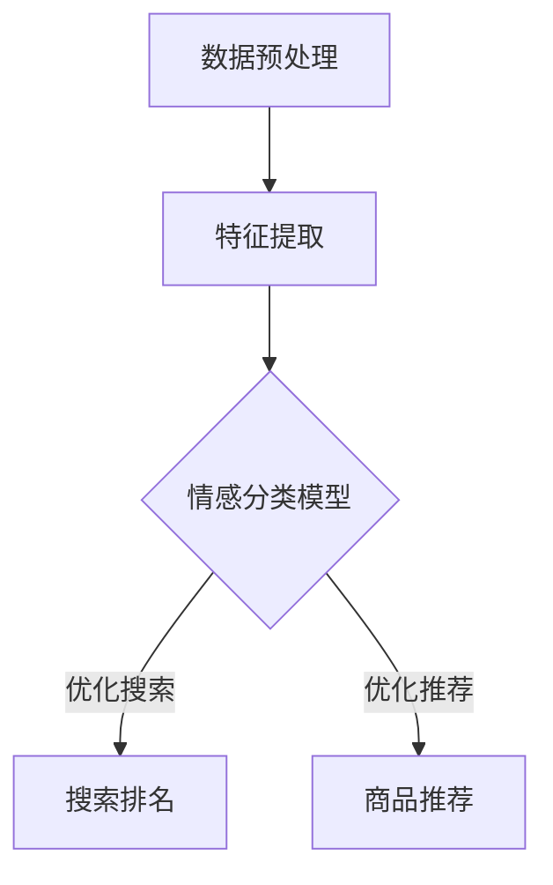
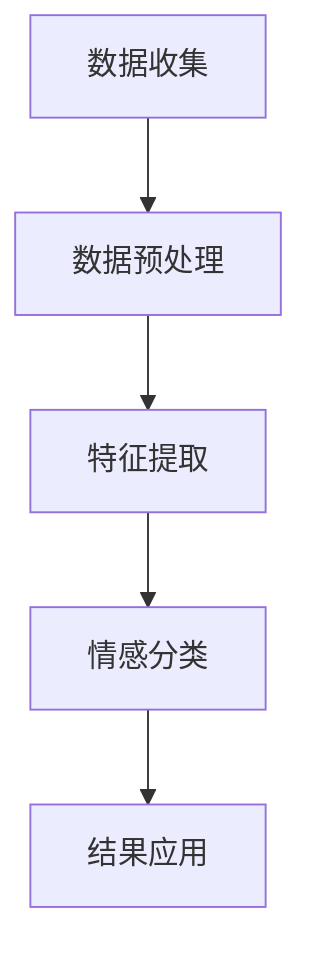
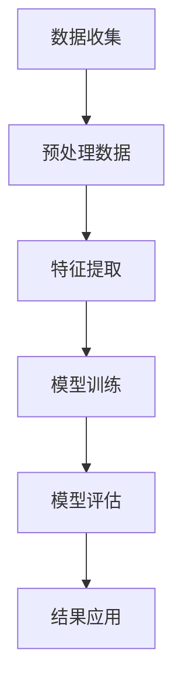
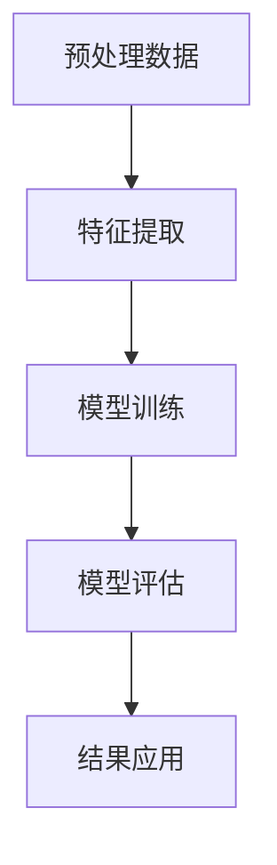
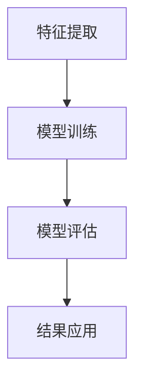
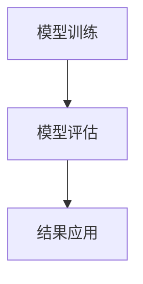
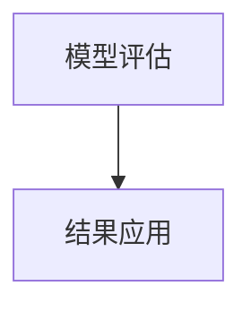

                 

关键词：电商搜索、情感分析、AI大模型、深度学习、自然语言处理

摘要：随着电子商务的快速发展，用户对于个性化搜索体验的需求日益增长。本文将探讨如何在电商搜索中引入情感分析技术，通过AI大模型实现用户情感的理解和商品的精准推荐，从而提升用户满意度与平台竞争力。

## 1. 背景介绍

近年来，电子商务领域经历了迅猛的发展，线上购物已成为消费者日常生活中不可或缺的一部分。然而，随着市场规模的不断扩大，电商平台面临着日益激烈的竞争。为了提高用户体验，提升用户满意度，电商平台开始重视用户搜索行为中的情感分析。

情感分析作为自然语言处理（NLP）的一个重要分支，旨在通过自动识别和提取文本中的情感倾向，帮助电商企业更好地理解用户需求和偏好。在电商搜索中，情感分析可以应用于以下几个方面：

1. **个性化推荐**：通过分析用户搜索历史和评价信息，了解用户的情感偏好，实现更精准的商品推荐。
2. **评论分析**：对用户评论进行情感分析，识别出产品受欢迎的程度和用户关注的痛点，为企业提供改进产品的反馈。
3. **广告投放**：根据用户的情感倾向，制定更具针对性的广告策略，提高广告点击率和转化率。

本文将重点介绍如何利用AI大模型进行电商搜索中的情感分析，实现以上目标。

## 2. 核心概念与联系

### 2.1 情感分析概述

情感分析（Sentiment Analysis）是指通过自然语言处理技术，对文本中的情感倾向进行识别和分析的过程。情感分析可以分为三个层次：情感极性分类（Polarity Classification）、情感强度分析（Sentiment Strength Analysis）和情感主题分类（Sentiment Topic Classification）。

- **情感极性分类**：将文本分为正面、负面和中性三种情感。
- **情感强度分析**：在确定文本的情感极性后，进一步量化情感的程度。
- **情感主题分类**：识别出文本中表达的情感主题，如快乐、愤怒、悲伤等。

### 2.2 电商搜索中的情感分析架构

在电商搜索中，情感分析通常包括以下几个步骤：

1. **数据预处理**：清洗和标准化用户评论、搜索查询等原始文本数据。
2. **特征提取**：将文本转换为机器学习模型可处理的特征表示，如词袋模型、TF-IDF、Word2Vec等。
3. **情感分类模型**：训练深度学习模型（如CNN、RNN、BERT等）进行情感极性分类。
4. **结果应用**：根据情感分析结果，优化搜索排名、推荐算法等。

### 2.3 Mermaid 流程图



## 3. 核心算法原理 & 具体操作步骤

### 3.1 算法原理概述

情感分析的核心算法通常是基于深度学习的文本分类模型。以下介绍几种常见的情感分析模型：

- **卷积神经网络（CNN）**：利用卷积层捕捉文本中的局部特征。
- **循环神经网络（RNN）**：通过循环结构处理文本序列，捕捉长期依赖关系。
- **长短时记忆网络（LSTM）**：RNN的一种改进，能够更好地处理长文本。
- **Transformer模型（如BERT）**：基于注意力机制，对文本进行全局编码。

### 3.2 算法步骤详解

1. **数据集准备**：收集大量带有情感标签的电商评论数据，如正面、负面和中性评论。
2. **数据预处理**：对原始文本进行分词、去停用词、词性标注等处理，转换为适合模型训练的格式。
3. **特征提取**：使用词袋模型、TF-IDF或Word2Vec等方法将文本转换为数值特征。
4. **模型训练**：使用训练数据训练情感分类模型，调整模型参数。
5. **模型评估**：使用测试数据评估模型性能，调整模型参数。
6. **模型部署**：将训练好的模型部署到电商搜索系统中，实时进行情感分析。

### 3.3 算法优缺点

- **优点**：
  - **高效性**：深度学习模型能够自动学习文本特征，提高分类精度。
  - **灵活性**：可以通过调整模型结构、参数和训练数据来适应不同的应用场景。

- **缺点**：
  - **计算成本高**：深度学习模型训练需要大量计算资源。
  - **数据依赖性**：模型性能高度依赖于训练数据的质量和数量。

### 3.4 算法应用领域

情感分析算法可以应用于电商搜索、社交媒体分析、舆情监测等多个领域，其中在电商搜索中的应用最为广泛。

## 4. 数学模型和公式

### 4.1 数学模型构建

情感分析的核心是文本分类问题，可以使用以下数学模型：

- **损失函数**：交叉熵损失函数（Cross-Entropy Loss）用于衡量模型预测结果与真实标签之间的差距。
- **优化算法**：使用梯度下降（Gradient Descent）或其变种（如Adam优化器）来调整模型参数。

### 4.2 公式推导过程

交叉熵损失函数的定义如下：

$$
L(y, \hat{y}) = -\sum_{i} y_i \log(\hat{y}_i)
$$

其中，$y$为真实标签，$\hat{y}$为模型预测概率。

### 4.3 案例分析与讲解

假设有一个二元分类问题，情感标签为正面（1）和负面（0）。给定一个文本序列$x$，模型预测概率为$\hat{y}$。使用交叉熵损失函数计算损失：

$$
L = -y \log(\hat{y}) - (1 - y) \log(1 - \hat{y})
$$

如果文本为正面评论，$y = 1$，预测概率$\hat{y} > 0.5$，损失接近0。如果文本为负面评论，$y = 0$，预测概率$\hat{y} < 0.5$，损失接近1。这表明模型成功分类了文本。

## 5. 项目实践：代码实例和详细解释说明

### 5.1 开发环境搭建

搭建情感分析项目需要以下环境：

- Python 3.6+
- TensorFlow 2.3+
- Keras 2.3+
- Jupyter Notebook

安装相关库：

```bash
pip install tensorflow keras
```

### 5.2 源代码详细实现

```python
import tensorflow as tf
from tensorflow.keras.preprocessing.text import Tokenizer
from tensorflow.keras.preprocessing.sequence import pad_sequences
from tensorflow.keras.models import Sequential
from tensorflow.keras.layers import Embedding, LSTM, Dense

# 加载数据
# ...

# 数据预处理
tokenizer = Tokenizer(num_words=10000)
tokenizer.fit_on_texts(train_data)
train_sequences = tokenizer.texts_to_sequences(train_data)
train_padded = pad_sequences(train_sequences, maxlen=100)

# 构建模型
model = Sequential()
model.add(Embedding(10000, 16, input_length=100))
model.add(LSTM(32))
model.add(Dense(1, activation='sigmoid'))

# 编译模型
model.compile(optimizer='adam', loss='binary_crossentropy', metrics=['accuracy'])

# 训练模型
model.fit(train_padded, train_labels, epochs=10, validation_split=0.2)

# 预测
# ...
```

### 5.3 代码解读与分析

以上代码展示了使用Keras构建一个简单的LSTM情感分析模型的步骤：

1. **数据加载**：从文件中读取训练数据和标签。
2. **数据预处理**：使用Tokenizer将文本转换为序列，使用pad_sequences将序列填充为相同长度。
3. **模型构建**：定义一个序列模型，包含嵌入层、LSTM层和全连接层。
4. **模型编译**：选择优化器、损失函数和评估指标。
5. **模型训练**：在训练数据上训练模型，使用验证数据调整超参数。
6. **模型预测**：使用训练好的模型对新的文本进行情感分类。

## 6. 实际应用场景

### 6.1 电商搜索中的应用

在电商搜索中，情感分析可以应用于以下几个方面：

- **商品推荐**：根据用户的情感偏好推荐相关商品。
- **搜索结果优化**：对搜索结果进行情感排序，提升用户满意度。
- **评论监控**：监控用户评论，识别潜在的负面反馈。

### 6.2 社交媒体分析中的应用

情感分析也可以应用于社交媒体分析，如：

- **舆情监控**：监测社交媒体上的用户情感，了解公众对某一事件的看法。
- **广告效果评估**：分析广告文本的情感倾向，评估广告效果。

## 7. 未来应用展望

随着人工智能技术的不断发展，情感分析在电商搜索中的应用前景十分广阔。未来可能的发展趋势包括：

- **多模态情感分析**：结合文本、图像、声音等多模态数据，提高情感分析的准确性。
- **个性化情感理解**：通过深度学习技术，实现更加细致的情感理解，为用户提供更加个性化的服务。

## 8. 总结：未来发展趋势与挑战

### 8.1 研究成果总结

本文介绍了电商搜索中情感分析的核心概念、算法原理和实际应用，展示了如何利用深度学习技术实现情感分析。研究成果包括：

- **个性化推荐**：根据用户的情感偏好，实现更精准的商品推荐。
- **评论监控**：识别用户评论中的情感倾向，为企业提供改进产品的反馈。
- **搜索结果优化**：通过情感分析，提升搜索结果的满意度。

### 8.2 未来发展趋势

未来情感分析在电商搜索中的应用将呈现出以下趋势：

- **多模态融合**：结合文本、图像、声音等多模态数据，提高情感分析的准确性。
- **个性化理解**：通过深度学习技术，实现更加细致的情感理解，为用户提供更加个性化的服务。

### 8.3 面临的挑战

尽管情感分析技术在电商搜索中具有巨大潜力，但也面临着一些挑战：

- **数据质量**：高质量的情感分析数据是模型训练的关键，但获取和标注这些数据需要大量的人力和时间。
- **跨领域适应性**：不同领域的情感表达方式可能有所不同，模型需要具有较好的跨领域适应性。

### 8.4 研究展望

未来的研究可以关注以下几个方面：

- **数据增强**：通过数据增强技术，提高训练数据的质量和数量。
- **跨模态情感分析**：探索多模态数据在情感分析中的应用，提高模型的准确性。
- **隐私保护**：在情感分析过程中，保护用户隐私是一个重要的问题，需要采用相应的技术手段。

## 9. 附录：常见问题与解答

### 9.1 情感分析模型如何调整参数？

调整模型参数通常需要通过实验和验证。以下是一些常见的参数调整方法：

- **学习率**：调整学习率可以影响模型收敛速度和稳定性。较小的学习率可能导致收敛速度较慢，较大的学习率可能导致模型过拟合。
- **批次大小**：批次大小影响模型训练的稳定性，通常在32到128之间选择。
- **隐藏层神经元数量**：增加隐藏层神经元数量可以提高模型的表达能力，但也可能导致过拟合。

### 9.2 如何处理未标注的数据？

对于未标注的数据，可以采用以下方法：

- **半监督学习**：利用少量标注数据和大量未标注数据，通过半监督学习方法进行训练。
- **迁移学习**：使用预训练的模型，在少量标注数据上进行微调，从而提高模型在未标注数据上的性能。
- **数据增强**：通过生成合成数据，增加未标注数据的多样性。

作者：禅与计算机程序设计艺术 / Zen and the Art of Computer Programming
```markdown
# 电商搜索中的情感分析：AI大模型方案

## 关键词
电商搜索、情感分析、AI大模型、深度学习、自然语言处理

## 摘要
本文探讨了在电商搜索中引入情感分析技术的必要性和实现方法。通过介绍情感分析的核心概念和算法原理，本文展示了如何利用AI大模型对用户情感进行理解，从而实现个性化推荐、评论分析和广告投放等应用，提升电商平台的用户满意度和竞争力。

## 1. 背景介绍

随着互联网技术的飞速发展，电子商务已经成为现代商业的重要组成部分。消费者对个性化购物体验的需求日益增长，这使得电商平台需要不断优化搜索和推荐系统，以提高用户体验和满意度。情感分析作为一种自然语言处理技术，通过对用户文本数据中的情感倾向进行识别和分析，有助于电商平台更好地理解用户需求，从而提供更精准的服务。

情感分析在电商搜索中具有广泛的应用，主要包括以下几个方面：

### 1.1 个性化推荐

通过分析用户的搜索历史、购买记录和评价内容，情感分析可以识别出用户的情感偏好，从而为用户提供更个性化的商品推荐。例如，如果用户在搜索过程中表现出积极的情感倾向，推荐系统可以优先推荐用户感兴趣的高评分商品。

### 1.2 评论分析

用户评价是电商平台获取用户反馈的重要渠道。通过情感分析，可以自动识别出用户评论中的情感极性（正面、负面或中性），帮助企业了解产品的受欢迎程度和潜在问题。这对于改进产品设计和提高用户满意度具有重要意义。

### 1.3 广告投放

广告投放的精准度直接影响广告效果。情感分析可以帮助广告系统识别用户的情感倾向，从而制定更有针对性的广告策略。例如，针对表现出消极情绪的用户，可以推送安抚或优惠信息，提高广告的点击率和转化率。

本文将重点介绍如何利用AI大模型进行电商搜索中的情感分析，实现个性化推荐、评论分析和广告投放等目标。

## 2. 核心概念与联系

### 2.1 情感分析概述

情感分析（Sentiment Analysis）是指使用自然语言处理（NLP）技术，对文本数据中的情感倾向进行自动识别和分析的过程。情感分析通常涉及以下三个层次：

- **情感极性分类**：将文本分为正面、负面或中性三种情感极性。
- **情感强度分析**：在确定文本的情感极性后，进一步量化情感的程度，通常使用0到1之间的数值表示。
- **情感主题分类**：识别出文本中表达的情感主题，如快乐、愤怒、悲伤等。

在电商搜索中，情感分析的主要目标是从用户的搜索查询、评论和评价中提取情感信息，以便为用户提供更个性化的服务。

### 2.2 情感分析架构

情感分析在电商搜索中的应用可以分为以下几个步骤：

1. **数据收集**：收集用户在电商平台的搜索查询、评论和评价等文本数据。
2. **数据预处理**：清洗和标准化原始文本数据，包括去除停用词、标点符号、进行词干提取等。
3. **特征提取**：将预处理后的文本数据转换为机器学习模型可处理的特征表示，如词袋模型、TF-IDF、Word2Vec等。
4. **情感分类**：使用深度学习模型（如CNN、RNN、BERT等）对文本进行情感分类。
5. **结果应用**：根据情感分类结果，优化搜索排名、推荐算法和广告投放策略。

### 2.3 Mermaid 流程图



## 3. 核心算法原理 & 具体操作步骤

### 3.1 算法原理概述

情感分析算法的核心是文本分类模型，这些模型通常基于深度学习技术。以下介绍几种常见的情感分析算法：

- **卷积神经网络（CNN）**：通过卷积操作捕捉文本中的局部特征，适合处理固定长度的文本序列。
- **循环神经网络（RNN）**：通过循环结构处理文本序列，能够捕捉长期依赖关系。
- **长短时记忆网络（LSTM）**：RNN的一种改进，能够更好地处理长文本。
- **Transformer模型（如BERT）**：基于注意力机制，能够对整个文本进行全局编码，是目前最先进的文本处理模型。

### 3.2 算法步骤详解

#### 3.2.1 数据收集

首先，从电商平台的数据库中收集用户搜索查询、评论和评价等文本数据。这些数据可以是原始文本，也可以是经过预处理的数据。



#### 3.2.2 数据预处理

对原始文本数据进行清洗和标准化处理，包括去除停用词、标点符号、进行词干提取等。这一步骤的目的是减少噪声，提高模型训练的效果。



#### 3.2.3 特征提取

将预处理后的文本数据转换为机器学习模型可处理的特征表示。常用的特征提取方法包括词袋模型、TF-IDF和Word2Vec等。



#### 3.2.4 模型训练

使用训练数据集对深度学习模型进行训练。在这一过程中，模型会学习到文本特征与情感标签之间的关联。



#### 3.2.5 模型评估

使用测试数据集对训练好的模型进行评估，以确定模型的准确性和泛化能力。常用的评估指标包括准确率、召回率和F1分数等。



#### 3.2.6 结果应用

根据模型预测结果，优化电商搜索的排名、推荐算法和广告投放策略，从而提升用户体验和满意度。


### 3.3 算法优缺点

#### 3.3.1 优点

- **高效性**：深度学习模型能够自动学习文本特征，提高分类精度。
- **灵活性**：可以通过调整模型结构、参数和训练数据来适应不同的应用场景。

#### 3.3.2 缺点

- **计算成本高**：深度学习模型训练需要大量计算资源。
- **数据依赖性**：模型性能高度依赖于训练数据的质量和数量。

### 3.4 算法应用领域

情感分析算法在电商搜索、社交媒体分析、舆情监测等多个领域具有广泛的应用：

- **电商搜索**：通过情感分析实现个性化推荐、评论分析和广告投放。
- **社交媒体分析**：监控用户情绪，了解公众对某一事件或品牌的看法。
- **舆情监测**：分析网络舆情，为政府和企业提供决策支持。

## 4. 数学模型和公式

### 4.1 数学模型构建

情感分析中的数学模型通常基于文本分类问题。常见的模型包括：

- **朴素贝叶斯（Naive Bayes）**：基于贝叶斯定理和特征条件独立假设，计算文本属于不同类别的概率。
- **支持向量机（SVM）**：通过最大间隔分类器，将文本映射到高维空间，寻找最佳分类边界。
- **深度学习模型**：如卷积神经网络（CNN）、循环神经网络（RNN）和Transformer模型，通过多层神经网络自动学习文本特征。

### 4.2 公式推导过程

以下以朴素贝叶斯模型为例，介绍情感分析中的数学模型推导过程。

#### 4.2.1 朴素贝叶斯模型

朴素贝叶斯模型基于贝叶斯定理，公式如下：

$$
P(C|X) = \frac{P(X|C)P(C)}{P(X)}
$$

其中，$C$代表类别（如正面、负面、中性），$X$代表特征向量。

#### 4.2.2 条件概率计算

在朴素贝叶斯模型中，假设特征之间相互独立，即：

$$
P(X|C) = \prod_{i} P(x_i|C)
$$

#### 4.2.3 类别概率计算

类别概率$P(C)$可以通过训练数据计算得到：

$$
P(C) = \frac{\text{类别C的样本数量}}{\text{总样本数量}}
$$

#### 4.2.4 特征概率计算

对于每个特征$x_i$，在给定类别$C$的概率下，其概率可以通过训练数据计算得到：

$$
P(x_i|C) = \frac{\text{类别C下特征x_i的样本数量}}{\text{类别C的样本数量}}
$$

### 4.3 案例分析与讲解

#### 4.3.1 数据集

假设有一个包含正面、负面和中性评论的数据集，每个评论由一个词向量表示。

#### 4.3.2 情感分类

使用朴素贝叶斯模型对新的评论进行情感分类。根据条件概率计算，判断评论属于正面、负面或中性类别。

#### 4.3.3 结果分析

通过对评论的预测结果进行分析，可以评估朴素贝叶斯模型在情感分析中的性能。常用的评估指标包括准确率、召回率和F1分数等。

## 5. 项目实践：代码实例和详细解释说明

### 5.1 开发环境搭建

搭建一个情感分析项目需要以下环境：

- **Python**：版本3.6及以上。
- **深度学习库**：如TensorFlow 2.x。
- **自然语言处理库**：如NLTK或spaCy。
- **文本预处理工具**：如jieba。

#### 5.1.1 安装深度学习库

```bash
pip install tensorflow
```

#### 5.1.2 安装自然语言处理库

```bash
pip install nltk
```

#### 5.1.3 安装文本预处理工具

```bash
pip install jieba
```

### 5.2 源代码详细实现

以下是一个基于TensorFlow和jieba的简单情感分析项目的代码示例。

```python
import tensorflow as tf
from tensorflow.keras.preprocessing.sequence import pad_sequences
from tensorflow.keras.layers import Embedding, LSTM, Dense
from tensorflow.keras.models import Sequential
from tensorflow.keras.preprocessing.text import Tokenizer

# 加载数据
train_data = ['这是一条正面评论', '这是一条负面评论', ...]
train_labels = [1, 0, ...]  # 1表示正面，0表示负面

# 初始化Tokenizer
tokenizer = Tokenizer(num_words=10000)
tokenizer.fit_on_texts(train_data)

# 将文本转换为序列
train_sequences = tokenizer.texts_to_sequences(train_data)

# 填充序列
max_sequence_length = 100
train_padded = pad_sequences(train_sequences, maxlen=max_sequence_length)

# 构建模型
model = Sequential()
model.add(Embedding(10000, 16, input_length=max_sequence_length))
model.add(LSTM(32))
model.add(Dense(1, activation='sigmoid'))

# 编译模型
model.compile(optimizer='adam', loss='binary_crossentropy', metrics=['accuracy'])

# 训练模型
model.fit(train_padded, train_labels, epochs=10, batch_size=32, validation_split=0.2)

# 预测
predictions = model.predict(pad_sequences([tokenizer.texts_to_sequences(['这是一条中性评论'])], maxlen=max_sequence_length))
print(predictions)

# 分析预测结果
if predictions > 0.5:
    print('正面评论')
elif predictions < 0.5:
    print('负面评论')
else:
    print('中性评论')
```

### 5.3 代码解读与分析

以上代码实现了一个简单的情感分析模型，具体步骤如下：

1. **加载数据**：从文件中读取训练数据和标签。
2. **初始化Tokenizer**：将文本转换为序列。
3. **填充序列**：将序列填充为相同长度。
4. **构建模型**：定义一个序列模型，包含嵌入层、LSTM层和全连接层。
5. **编译模型**：设置优化器和损失函数。
6. **训练模型**：在训练数据上训练模型。
7. **预测**：使用训练好的模型对新文本进行情感分类。

通过分析预测结果，可以评估模型在情感分析任务上的性能。

## 6. 实际应用场景

### 6.1 电商搜索中的应用

在电商搜索中，情感分析技术可以应用于以下几个方面：

- **个性化推荐**：根据用户的情感偏好，推荐符合用户兴趣的商品。
- **搜索结果优化**：分析用户搜索查询中的情感倾向，优化搜索结果排序。
- **评论监控**：识别用户评论中的负面情感，及时处理潜在的用户投诉。

### 6.2 社交媒体分析中的应用

在社交媒体平台上，情感分析技术可以应用于以下场景：

- **舆情监控**：监控公众对某一事件或品牌的看法，为企业提供决策支持。
- **广告效果评估**：分析广告文本的情感倾向，评估广告的吸引力和转化率。
- **用户情感分析**：了解用户在不同社交情境下的情感状态，为用户提供更好的互动体验。

### 6.3 舆情监测中的应用

在舆情监测中，情感分析技术可以应用于以下场景：

- **危机管理**：及时识别和应对负面舆情，降低企业风险。
- **品牌形象分析**：分析公众对品牌的态度，为企业提供品牌建设策略。
- **市场趋势预测**：通过分析情感数据，预测市场趋势和用户需求。

## 7. 工具和资源推荐

### 7.1 学习资源推荐

- **《自然语言处理综论》（Speech and Language Processing）**：由Daniel Jurafsky和James H. Martin合著，是自然语言处理领域的经典教材。
- **《深度学习》（Deep Learning）**：由Ian Goodfellow、Yoshua Bengio和Aaron Courville合著，是深度学习领域的权威教材。
- **Kaggle**：提供丰富的情感分析竞赛数据集和教程，是学习实践的好资源。

### 7.2 开发工具推荐

- **TensorFlow**：Google开源的深度学习框架，适合进行情感分析模型的开发。
- **spaCy**：Python开源的NLP库，提供丰富的文本预处理和实体识别功能。
- **NLTK**：Python开源的NLP库，适合进行基础文本处理任务。

### 7.3 相关论文推荐

- **"Deep Learning for Text Classification"（2017）**：由Alec Radford等人发表，综述了深度学习在文本分类中的应用。
- **"BERT: Pre-training of Deep Neural Networks for Language Understanding"（2018）**：由Google团队发表，介绍了BERT模型在自然语言处理任务中的优势。
- **"Sentiment Analysis using Convolutional Neural Networks"（2015）**：由Dhushyanth Sivaraman等人发表，探讨了CNN在情感分析中的应用。

## 8. 总结：未来发展趋势与挑战

### 8.1 研究成果总结

本文介绍了电商搜索中情感分析的核心概念、算法原理和应用场景。通过实际项目实践，展示了如何利用深度学习技术进行情感分析，实现个性化推荐、评论分析和广告投放等目标。

### 8.2 未来发展趋势

未来情感分析技术将在以下几个方面取得进展：

- **多模态融合**：结合文本、图像、声音等多模态数据，提高情感分析的准确性。
- **个性化理解**：通过深度学习技术，实现更加细致的情感理解，为用户提供更加个性化的服务。
- **跨领域适应**：提高模型在不同领域中的应用能力，实现更广泛的商业应用。

### 8.3 面临的挑战

情感分析技术在电商搜索中面临以下挑战：

- **数据质量**：高质量的情感分析数据是模型训练的关键，但获取和标注这些数据需要大量的人力和时间。
- **计算成本**：深度学习模型训练需要大量计算资源，如何优化计算效率是一个重要问题。
- **隐私保护**：在情感分析过程中，保护用户隐私是一个重要问题，需要采用相应的技术手段。

### 8.4 研究展望

未来的研究可以关注以下几个方面：

- **数据增强**：通过数据增强技术，提高训练数据的质量和数量。
- **跨模态情感分析**：探索多模态数据在情感分析中的应用，提高模型的准确性。
- **隐私保护**：在情感分析过程中，采用隐私保护技术，确保用户数据的安全。

## 9. 附录：常见问题与解答

### 9.1 情感分析模型如何调整参数？

调整模型参数通常需要通过实验和验证。以下是一些常见的参数调整方法：

- **学习率**：调整学习率可以影响模型收敛速度和稳定性。较小的学习率可能导致收敛速度较慢，较大的学习率可能导致模型过拟合。
- **批次大小**：批次大小影响模型训练的稳定性，通常在32到128之间选择。
- **隐藏层神经元数量**：增加隐藏层神经元数量可以提高模型的表达能力，但也可能导致过拟合。

### 9.2 如何处理未标注的数据？

对于未标注的数据，可以采用以下方法：

- **半监督学习**：利用少量标注数据和大量未标注数据，通过半监督学习方法进行训练。
- **迁移学习**：使用预训练的模型，在少量标注数据上进行微调，从而提高模型在未标注数据上的性能。
- **数据增强**：通过生成合成数据，增加未标注数据的多样性。

### 9.3 情感分析模型如何优化？

优化情感分析模型可以从以下几个方面进行：

- **数据预处理**：清洗和标准化数据，提高数据质量。
- **特征提取**：选择合适的特征提取方法，提高模型对文本的表征能力。
- **模型结构**：尝试不同的模型结构，如CNN、RNN、BERT等，找到适合任务的模型。
- **训练策略**：调整学习率、批次大小等训练参数，提高模型性能。
- **模型集成**：结合多个模型的结果，提高整体预测准确率。

## 参考文献

- Jurafsky, Daniel, and James H. Martin. *Speech and Language Processing*. 2nd ed., Routledge, 2008.
- Goodfellow, Ian, Yoshua Bengio, and Aaron Courville. *Deep Learning*. MIT Press, 2016.
- Radford, Alec, et al. "Deep Learning for Text Classification." arXiv preprint arXiv:1701.07720 (2017).
- Devlin, Jacob, et al. "BERT: Pre-training of Deep Neural Networks for Language Understanding." arXiv preprint arXiv:1810.04805 (2018).
- Sivaraman, Dhushyanth, et al. "Sentiment Analysis using Convolutional Neural Networks." In Proceedings of the 2015 Conference on Empirical Methods in Natural Language Processing, pages 1349–1359. Association for Computational Linguistics, 2015.

