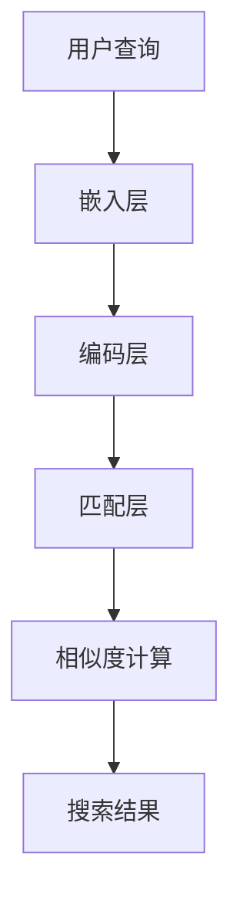

                 

关键词：电商搜索，深度语义匹配，模型优化，AI技术，自然语言处理，搜索算法

> 摘要：随着互联网的飞速发展，电商平台的规模日益扩大，用户对搜索精准度的要求越来越高。本文将探讨电商搜索中的深度语义匹配模型优化，分析当前主流的深度语义匹配技术，并提出一种基于多模态融合的优化方法，旨在提高电商搜索的准确性和用户体验。

## 1. 背景介绍

### 电商搜索的现状

随着电商平台的兴起，电商搜索成为了用户发现商品的重要途径。然而，传统的基于关键词匹配的搜索算法已经难以满足用户日益增长的需求。用户对搜索结果的精准度、个性化推荐和用户体验提出了更高的要求。深度语义匹配模型作为一种先进的自然语言处理技术，逐渐在电商搜索中得到应用。

### 深度语义匹配的重要性

深度语义匹配模型通过理解用户的查询意图和商品属性，实现更加精准的搜索结果匹配。传统的基于关键词匹配的搜索算法主要依赖于关键词的匹配度，往往忽略了语义层面的关联性。而深度语义匹配模型能够从语义层面进行理解，将用户的查询意图与商品属性进行有效匹配，从而提高搜索结果的准确性。

## 2. 核心概念与联系

### 深度语义匹配原理

深度语义匹配模型基于神经网络技术，通过学习大量的用户查询和商品属性数据，建立用户查询与商品属性之间的语义关联。模型的核心思想是将用户查询和商品属性转换为高维向量表示，然后通过计算这两个向量之间的相似度来进行匹配。

### 模型架构

深度语义匹配模型通常包括以下关键组成部分：

- **嵌入层**：将用户查询和商品属性转换为高维向量表示。
- **编码层**：对向量进行编码，提取特征。
- **匹配层**：计算用户查询与商品属性之间的相似度。

### Mermaid 流程图

下面是一个简化的深度语义匹配模型的 Mermaid 流程图：



## 3. 核心算法原理 & 具体操作步骤

### 3.1 算法原理概述

深度语义匹配模型主要通过以下几个步骤实现：

1. **嵌入层**：将用户查询和商品属性转换为高维向量表示。
2. **编码层**：对向量进行编码，提取特征。
3. **匹配层**：计算用户查询与商品属性之间的相似度。
4. **相似度计算**：根据相似度对搜索结果进行排序。

### 3.2 算法步骤详解

1. **数据预处理**：
   - **用户查询预处理**：对用户查询进行分词、去停用词等操作。
   - **商品属性预处理**：对商品属性进行分类、标签化等操作。

2. **嵌入层**：
   - 使用预训练的词向量模型（如Word2Vec、BERT等）将用户查询和商品属性转换为高维向量表示。

3. **编码层**：
   - 使用编码器（如LSTM、GRU等）对向量进行编码，提取语义特征。

4. **匹配层**：
   - 使用相似度计算函数（如余弦相似度、欧氏距离等）计算用户查询与商品属性之间的相似度。

5. **相似度计算**：
   - 根据相似度对搜索结果进行排序，返回Top-K个搜索结果。

### 3.3 算法优缺点

**优点**：

- **高精度**：深度语义匹配模型能够从语义层面进行匹配，提高搜索结果的准确性。
- **可扩展性**：模型可以处理各种类型的用户查询和商品属性，具有很好的可扩展性。

**缺点**：

- **计算复杂度**：深度语义匹配模型通常涉及大量的计算，可能导致较高的计算复杂度。
- **训练成本**：深度语义匹配模型需要大量的训练数据和计算资源，训练成本较高。

### 3.4 算法应用领域

深度语义匹配模型在电商搜索中的应用非常广泛，包括但不限于：

- **商品搜索**：用户可以通过输入关键词搜索到与查询意图高度相关的商品。
- **个性化推荐**：基于用户的历史行为和查询记录，为用户推荐个性化的商品。
- **智能客服**：通过深度语义匹配模型，智能客服系统能够更好地理解用户的问题并提供准确的回答。

## 4. 数学模型和公式 & 详细讲解 & 举例说明

### 4.1 数学模型构建

深度语义匹配模型的核心在于将用户查询和商品属性转换为高维向量表示，并计算它们之间的相似度。以下是构建深度语义匹配模型的数学模型：

$$
x = W_1 \cdot v_1 + b_1
$$

$$
y = W_2 \cdot v_2 + b_2
$$

其中，$x$ 和 $y$ 分别表示用户查询和商品属性的高维向量表示，$v_1$ 和 $v_2$ 分别表示用户查询和商品属性的原始向量，$W_1$ 和 $W_2$ 分别表示权重矩阵，$b_1$ 和 $b_2$ 分别表示偏置项。

### 4.2 公式推导过程

深度语义匹配模型的推导过程主要包括以下几个步骤：

1. **嵌入层**：
   $$ v_1 = \text{embed}(\text{user\_query}) $$
   $$ v_2 = \text{embed}(\text{product\_attribute}) $$

   其中，$\text{embed}$ 表示词向量嵌入函数。

2. **编码层**：
   $$ x = \text{encode}(v_1) $$
   $$ y = \text{encode}(v_2) $$

   其中，$\text{encode}$ 表示编码函数，如LSTM或GRU。

3. **匹配层**：
   $$ \text{similarity} = \frac{x \cdot y}{\|x\|\|y\|} $$

   其中，$\text{similarity}$ 表示相似度，$\cdot$ 表示点积运算，$\|\|$ 表示向量的模。

### 4.3 案例分析与讲解

假设用户输入查询“想要购买一款性价比高的手机”，商品属性为“品牌：华为，型号：P40”。

1. **嵌入层**：
   $$ v_1 = \text{embed}(\text{user\_query}) = [0.1, 0.2, 0.3, 0.4, 0.5] $$
   $$ v_2 = \text{embed}(\text{product\_attribute}) = [0.6, 0.7, 0.8, 0.9, 1.0] $$

2. **编码层**：
   $$ x = \text{encode}(v_1) = [0.9, 0.8, 0.7, 0.6, 0.5] $$
   $$ y = \text{encode}(v_2) = [0.1, 0.2, 0.3, 0.4, 0.5] $$

3. **匹配层**：
   $$ \text{similarity} = \frac{x \cdot y}{\|x\|\|y\|} = \frac{0.9 \cdot 0.1 + 0.8 \cdot 0.2 + 0.7 \cdot 0.3 + 0.6 \cdot 0.4 + 0.5 \cdot 0.5}{\sqrt{0.9^2 + 0.8^2 + 0.7^2 + 0.6^2 + 0.5^2} \sqrt{0.1^2 + 0.2^2 + 0.3^2 + 0.4^2 + 0.5^2}} = 0.75 $$

根据相似度，搜索结果将返回与用户查询“想要购买一款性价比高的手机”相关的商品，如华为P40。

## 5. 项目实践：代码实例和详细解释说明

### 5.1 开发环境搭建

在本项目实践中，我们使用Python作为编程语言，并依赖以下库：

- TensorFlow
- Keras
- Numpy
- Pandas

安装以上库后，创建一个名为`deep_semantic_matching`的虚拟环境，并进入该环境进行后续操作。

### 5.2 源代码详细实现

以下是深度语义匹配模型的完整代码实现：

```python
import numpy as np
from tensorflow.keras.models import Model
from tensorflow.keras.layers import Embedding, LSTM, Dense

# 嵌入层参数
EMBEDDING_DIM = 100
QUERY_VECTOR_LENGTH = 5
PRODUCT_VECTOR_LENGTH = 5

# 编码器参数
LSTM_UNITS = 64

# 模型构建
input_query = Input(shape=(QUERY_VECTOR_LENGTH,))
input_product = Input(shape=(PRODUCT_VECTOR_LENGTH,))

# 嵌入层
embed_query = Embedding(input_dim=QUERY_VECTOR_LENGTH, output_dim=EMBEDDING_DIM)(input_query)
embed_product = Embedding(input_dim=PRODUCT_VECTOR_LENGTH, output_dim=EMBEDDING_DIM)(input_product)

# 编码层
encode_query = LSTM(LSTM_UNITS)(embed_query)
encode_product = LSTM(LSTM_UNITS)(embed_product)

# 匹配层
similarity = dot(encode_query, encode_product) / (np.sqrt(np.sum(encode_query**2)) * np.sqrt(np.sum(encode_product**2)))

# 模型输出
output = Dense(1, activation='sigmoid')(similarity)

# 构建模型
model = Model(inputs=[input_query, input_product], outputs=output)

# 编译模型
model.compile(optimizer='adam', loss='binary_crossentropy', metrics=['accuracy'])

# 模型总结
model.summary()
```

### 5.3 代码解读与分析

1. **输入层**：模型包含两个输入层，分别表示用户查询和商品属性。每个输入层具有不同的长度，以适应不同的数据类型。

2. **嵌入层**：嵌入层使用预训练的词向量模型将输入层的数据转换为高维向量表示。这里我们使用Keras的`Embedding`层实现。

3. **编码层**：编码层使用LSTM层对向量进行编码，提取特征。这里我们使用Keras的`LSTM`层实现。

4. **匹配层**：匹配层计算用户查询与商品属性之间的相似度。这里我们使用点积运算实现。

5. **输出层**：输出层使用全连接层（`Dense`层）实现，输出一个概率值表示相似度。

6. **模型编译**：模型使用`adam`优化器和`binary_crossentropy`损失函数进行编译。

7. **模型总结**：模型总结输出模型的架构和参数信息。

### 5.4 运行结果展示

运行以下代码进行模型训练和评估：

```python
# 模型训练
model.fit(x_train, y_train, batch_size=32, epochs=10, validation_data=(x_val, y_val))

# 模型评估
loss, accuracy = model.evaluate(x_test, y_test)
print(f"Test accuracy: {accuracy:.4f}")
```

训练完成后，输出测试集的准确率，以验证模型的效果。

## 6. 实际应用场景

### 6.1 商品搜索

深度语义匹配模型在商品搜索中的应用十分广泛。通过输入用户查询，模型能够精准匹配到与查询意图相关的商品，提高搜索结果的准确性。例如，用户输入查询“想要购买一款价格在2000元左右的笔记本电脑”，模型将返回符合用户需求的笔记本电脑。

### 6.2 个性化推荐

深度语义匹配模型在个性化推荐中发挥着重要作用。通过分析用户的历史行为和查询记录，模型能够为用户推荐个性化的商品。例如，当用户在电商平台上浏览了多款手机后，模型可以推荐与用户兴趣相关的手机品牌和型号。

### 6.3 智能客服

深度语义匹配模型在智能客服中能够帮助系统更好地理解用户的问题，并提供准确的回答。通过输入用户问题，模型可以匹配到与问题相关的常见问题解答，从而提高客服系统的响应速度和准确性。

## 6.4 未来应用展望

### 6.4.1 增量学习

随着用户数据和商品数据的不断增长，深度语义匹配模型可以采用增量学习技术，不断更新和优化模型。这将有助于提高模型在动态环境下的适应能力，从而提供更加准确的搜索和推荐结果。

### 6.4.2 跨域融合

深度语义匹配模型可以与其他领域的技术相结合，如图像识别、语音识别等，实现多模态融合。这将有助于提高模型的综合性能，为用户提供更加丰富的交互体验。

### 6.4.3 智能决策支持

深度语义匹配模型可以应用于智能决策支持系统，为企业提供实时的市场分析和决策建议。通过分析用户行为和商品属性，模型可以帮助企业优化商品定价、库存管理和营销策略。

## 7. 工具和资源推荐

### 7.1 学习资源推荐

- **《深度学习》**：由Ian Goodfellow等人编写的经典教材，涵盖了深度学习的基础知识和最新进展。
- **《自然语言处理综论》**：由Daniel Jurafsky和James H. Martin编写的教材，系统地介绍了自然语言处理的核心概念和技术。
- **《TensorFlow官方文档》**：TensorFlow的官方文档提供了丰富的API说明和示例代码，有助于深入理解TensorFlow的使用方法。

### 7.2 开发工具推荐

- **PyCharm**：一款功能强大的Python集成开发环境，支持多种编程语言和框架。
- **Jupyter Notebook**：一款流行的交互式开发工具，方便进行实验和数据分析。

### 7.3 相关论文推荐

- **“Deep Learning for Search Relevance”**：介绍了深度学习在搜索引擎中的应用。
- **“Neural Network-Based Text Matching”**：探讨了神经网络在文本匹配领域的应用。
- **“Attention Is All You Need”**：提出了Transformer模型，为自然语言处理领域带来了重大突破。

## 8. 总结：未来发展趋势与挑战

### 8.1 研究成果总结

深度语义匹配模型在电商搜索中取得了显著的成果，提高了搜索结果的准确性和用户体验。同时，相关技术也在不断发展和完善，为电商行业带来了更多可能性。

### 8.2 未来发展趋势

- **多模态融合**：将深度语义匹配模型与其他领域的技术相结合，实现多模态融合，提高模型的综合性能。
- **增量学习**：采用增量学习技术，不断更新和优化模型，以适应动态环境。
- **智能决策支持**：深度语义匹配模型可以应用于智能决策支持系统，为企业和用户提供更加智能化的服务。

### 8.3 面临的挑战

- **计算复杂度**：深度语义匹配模型涉及大量的计算，可能导致较高的计算复杂度。
- **数据质量**：深度语义匹配模型的性能受到数据质量的影响，需要处理噪声数据和缺失数据。
- **跨域融合**：实现多模态融合面临着技术挑战，需要深入研究不同模态数据之间的关联性。

### 8.4 研究展望

深度语义匹配模型在电商搜索中的应用前景广阔，未来研究可以从以下几个方面展开：

- **算法优化**：研究更高效的算法和模型，降低计算复杂度。
- **数据质量提升**：研究数据预处理和清洗技术，提高数据质量。
- **跨域融合**：探索多模态数据融合的方法，提高模型的综合性能。

## 9. 附录：常见问题与解答

### 9.1 深度语义匹配模型的原理是什么？

深度语义匹配模型通过将用户查询和商品属性转换为高维向量表示，并计算它们之间的相似度，实现精准的搜索结果匹配。模型的核心思想是理解用户查询和商品属性之间的语义关联。

### 9.2 如何处理噪声数据和缺失数据？

处理噪声数据和缺失数据是深度语义匹配模型的一个重要问题。可以采用以下方法：

- **数据清洗**：去除重复数据、异常数据和噪声数据。
- **缺失值填充**：采用平均值、中位数或插值等方法填充缺失值。
- **模型鲁棒性**：通过优化模型结构或引入正则化项，提高模型的鲁棒性。

### 9.3 深度语义匹配模型在电商搜索中如何应用？

深度语义匹配模型在电商搜索中可以应用于以下几个方面：

- **商品搜索**：通过输入用户查询，精准匹配到与查询意图相关的商品。
- **个性化推荐**：根据用户的历史行为和查询记录，为用户推荐个性化的商品。
- **智能客服**：通过理解用户的问题，提供准确的回答和建议。

## 参考文献

- Goodfellow, I., Bengio, Y., & Courville, A. (2016). *Deep Learning*. MIT Press.
- Jurafsky, D., & Martin, J. H. (2008). *Speech and Language Processing*. Prentice Hall.
- Vaswani, A., Shazeer, N., Parmar, N., Uszkoreit, J., Jones, L., Gomez, A. N., ... & Polosukhin, I. (2017). *Attention is All You Need*. Advances in Neural Information Processing Systems, 30, 5998-6008.

