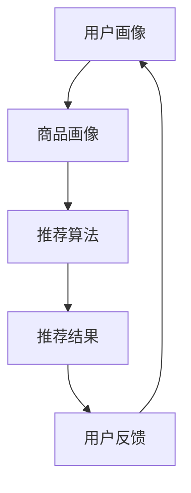

                 

关键词：电商搜索推荐，AI大模型，数据不平衡，解决方案，对比分析

摘要：本文旨在探讨电商搜索推荐中AI大模型数据不平衡问题的解决方案，通过对常见技术手段的对比分析，提出有效的应对策略。文章首先介绍了电商搜索推荐背景及AI大模型的作用，然后详细分析了数据不平衡问题的产生原因，随后介绍了针对数据不平衡问题的几种解决方案，最后对各种方案进行了对比分析，提出了未来的发展趋势和面临的挑战。

## 1. 背景介绍

随着互联网技术的快速发展，电商行业取得了巨大的成就。在电商平台上，用户通过搜索功能找到他们感兴趣的商品是一个核心功能。而搜索推荐系统作为电商平台的重要组成部分，负责根据用户的兴趣和行为数据，为用户提供个性化的商品推荐，从而提升用户体验和平台销售额。

近年来，人工智能（AI）技术的快速发展，尤其是大模型（如深度学习模型）在各个领域的应用，为电商搜索推荐系统带来了新的机遇。大模型通过学习海量的用户行为数据和商品信息，能够更准确地预测用户兴趣，从而提供更加精准的搜索推荐结果。

然而，在实际应用中，电商搜索推荐系统面临着数据不平衡的问题。数据不平衡是指在不同类别或标签上，数据样本的数量存在显著差异。在电商搜索推荐中，常见的场景包括热门商品和长尾商品的推荐，热门商品通常有大量的用户评价和交易数据，而长尾商品的数据量较少。这种数据不平衡会对推荐系统的效果产生不利影响，尤其是对于深度学习模型，其训练和预测过程往往依赖于大量数据的支持。

本文将重点探讨电商搜索推荐中AI大模型数据不平衡问题的解决方案，通过对比分析不同技术手段的优缺点，为实际应用提供参考。

## 2. 核心概念与联系

### 2.1 电商搜索推荐系统

电商搜索推荐系统是一个基于用户行为数据、商品属性数据和搜索历史数据的智能系统，旨在为用户提供个性化的商品推荐。其核心组件包括用户画像、商品画像、推荐算法和推荐结果展示。

- **用户画像**：通过分析用户的历史行为数据，包括购买记录、浏览记录、收藏记录等，构建用户的兴趣偏好模型。
- **商品画像**：通过分析商品的各种属性，如品类、品牌、价格、销量等，构建商品的属性特征模型。
- **推荐算法**：基于用户画像和商品画像，采用不同的算法模型，如协同过滤、矩阵分解、深度学习等，为用户生成个性化的推荐列表。
- **推荐结果展示**：将生成的推荐结果通过网页、APP等方式展示给用户。

### 2.2 AI大模型

AI大模型是指具有大规模参数的深度学习模型，如BERT、GPT、Transformer等。这些模型通过学习大量的文本数据，能够对文本进行理解和生成。在电商搜索推荐系统中，AI大模型的应用主要体现在以下几个方面：

- **文本理解**：通过对用户搜索查询和商品描述的文本进行理解，提取出关键词和语义信息，用于生成推荐列表。
- **交互生成**：基于用户的搜索查询，AI大模型可以生成相应的回复或推荐结果，提高用户的互动体验。
- **个性化推荐**：通过学习用户的兴趣和行为数据，AI大模型能够为用户提供个性化的商品推荐，提升推荐效果。

### 2.3 数据不平衡问题

数据不平衡是指在某个数据集中，不同类别或标签的数据样本数量存在显著差异。在电商搜索推荐系统中，数据不平衡主要表现在热门商品和长尾商品的数据差异上。具体原因包括：

- **用户行为差异**：热门商品通常有大量的用户评价和交易数据，而长尾商品的数据量较少。
- **商品属性差异**：热门商品通常具有更多的属性信息，如品牌、价格等，而长尾商品的信息较少。
- **数据采集差异**：电商平台对热门商品的宣传和推广力度较大，导致热门商品的数据采集量更大。

数据不平衡对电商搜索推荐系统的影响主要包括：

- **推荐效果下降**：由于长尾商品数据量较少，模型难以准确预测用户对长尾商品的兴趣，导致推荐效果下降。
- **冷启动问题**：对于新用户或新商品，由于缺乏历史数据，推荐系统难以生成准确的推荐结果。
- **模型训练困难**：数据不平衡会导致模型在训练过程中倾向于学习到较少的数据类别，导致模型泛化能力下降。

### 2.4 Mermaid 流程图

以下是一个Mermaid流程图，展示了电商搜索推荐系统的核心组件和流程：



在图中，用户画像和商品画像作为输入，经过推荐算法处理后，生成推荐结果并展示给用户。用户的反馈又作为输入，反馈给用户画像模块，以不断优化推荐效果。

## 3. 核心算法原理 & 具体操作步骤

### 3.1 算法原理概述

针对电商搜索推荐中的数据不平衡问题，常见的解决方案包括数据增强、类别权重调整、损失函数优化等。以下是这些算法的基本原理：

- **数据增强**：通过对原始数据集进行扩展，增加长尾商品的数据量，以提高模型对长尾商品的预测能力。常见的数据增强方法包括数据复制、数据变换、数据合成等。
- **类别权重调整**：通过调整不同类别或标签的权重，使得模型在训练过程中更关注长尾商品。常见的方法包括类别权重反比调整、类别权重加权等。
- **损失函数优化**：通过修改损失函数，使得模型在训练过程中更加关注长尾商品。常见的方法包括交叉熵损失函数调整、带权交叉熵损失函数等。

### 3.2 算法步骤详解

#### 3.2.1 数据增强

1. **数据复制**：对于长尾商品，将样本重复多次，以增加其在数据集中的比例。
2. **数据变换**：通过对样本进行数据变换，如缩放、旋转、裁剪等，生成新的样本。
3. **数据合成**：利用生成模型，如GAN（生成对抗网络），合成新的长尾商品样本。

#### 3.2.2 类别权重调整

1. **类别权重反比调整**：根据每个类别的样本数量，设置类别权重，通常使用样本数量的倒数作为权重。
2. **类别权重加权**：根据每个类别的样本数量，设置类别权重，通常使用样本数量的平均值作为权重。

#### 3.2.3 损失函数优化

1. **交叉熵损失函数调整**：将交叉熵损失函数中的预测概率调整为对数形式，以降低热门商品的影响。
2. **带权交叉熵损失函数**：在交叉熵损失函数中引入类别权重，以降低长尾商品的影响。

### 3.3 算法优缺点

#### 3.3.1 数据增强

**优点**：

- **提高模型泛化能力**：通过增加长尾商品的数据量，提高模型对长尾商品的预测能力。
- **缓解冷启动问题**：通过合成新的长尾商品样本，缓解新用户或新商品的冷启动问题。

**缺点**：

- **增加计算成本**：数据增强需要额外的计算资源，如生成模型训练等。
- **降低模型解释性**：通过数据合成等方法生成的样本可能无法完全反映真实数据的特点，导致模型解释性降低。

#### 3.3.2 类别权重调整

**优点**：

- **提高模型对长尾商品的关注度**：通过调整类别权重，使得模型在训练过程中更关注长尾商品，提高长尾商品的推荐效果。
- **简单易实现**：类别权重调整方法相对简单，易于在现有推荐系统中实现。

**缺点**：

- **无法完全解决数据不平衡问题**：类别权重调整只能在一定程度上缓解数据不平衡问题，无法完全解决。
- **可能引入偏差**：如果类别权重设置不合理，可能引入模型偏差，影响推荐效果。

#### 3.3.3 损失函数优化

**优点**：

- **提高模型对长尾商品的关注度**：通过修改损失函数，使得模型在训练过程中更关注长尾商品，提高长尾商品的推荐效果。
- **简单易实现**：损失函数优化方法相对简单，易于在现有推荐系统中实现。

**缺点**：

- **可能降低模型性能**：修改损失函数可能会降低模型在热门商品的预测性能。
- **无法完全解决数据不平衡问题**：损失函数优化只能在一定程度上缓解数据不平衡问题，无法完全解决。

### 3.4 算法应用领域

数据增强、类别权重调整和损失函数优化方法在电商搜索推荐、新闻推荐、广告推荐等多个领域都有广泛应用。以下是部分应用实例：

- **电商搜索推荐**：通过数据增强方法，提高长尾商品的推荐效果；通过类别权重调整和损失函数优化方法，提高模型对长尾商品的关注度。
- **新闻推荐**：通过数据增强方法，增加长尾新闻的数据量，提高长尾新闻的推荐效果；通过类别权重调整和损失函数优化方法，提高模型对长尾新闻的关注度。
- **广告推荐**：通过数据增强方法，提高长尾广告的数据量，提高长尾广告的推荐效果；通过类别权重调整和损失函数优化方法，提高模型对长尾广告的关注度。

## 4. 数学模型和公式 & 详细讲解 & 举例说明

### 4.1 数学模型构建

在电商搜索推荐中，数据不平衡问题的数学模型通常可以表示为以下形式：

$$
L = w_1 \cdot L_1 + w_2 \cdot L_2 + w_3 \cdot L_3
$$

其中，$L$表示总损失函数，$L_1$、$L_2$、$L_3$分别表示热门商品、长尾商品和其他商品的损失函数，$w_1$、$w_2$、$w_3$分别表示它们的权重。

### 4.2 公式推导过程

为了构建上述数学模型，我们需要首先定义热门商品、长尾商品和其他商品的损失函数。

#### 4.2.1 热门商品损失函数

热门商品的损失函数通常采用交叉熵损失函数，表示为：

$$
L_1 = -\frac{1}{n_1} \sum_{i=1}^{n_1} y_i \cdot \log(p_i)
$$

其中，$y_i$表示第$i$个热门商品的标签，$p_i$表示模型预测的概率。

#### 4.2.2 长尾商品损失函数

长尾商品的损失函数可以采用加权交叉熵损失函数，表示为：

$$
L_2 = -\frac{1}{n_2} \sum_{i=1}^{n_2} w_i \cdot y_i \cdot \log(p_i)
$$

其中，$y_i$表示第$i$个长尾商品的标签，$p_i$表示模型预测的概率，$w_i$表示第$i$个长尾商品的权重。

#### 4.2.3 其他商品损失函数

其他商品的损失函数可以采用交叉熵损失函数，表示为：

$$
L_3 = -\frac{1}{n_3} \sum_{i=1}^{n_3} y_i \cdot \log(p_i)
$$

其中，$y_i$表示第$i$个其他商品的标签，$p_i$表示模型预测的概率。

### 4.3 案例分析与讲解

假设我们有一个电商搜索推荐系统，其中包含三类商品：热门商品、长尾商品和其他商品。具体数据如下：

| 类型   | 标签（y） | 预测概率（p） | 样本数量（n） |
| ------ | --------- | ------------- | ------------ |
| 热门   | 1         | 0.9           | 100          |
| 长尾   | 0         | 0.1           | 100          |
| 其他   | 1         | 0.8           | 200          |

根据上述数据，我们可以计算各个商品的损失函数：

#### 4.3.1 热门商品损失函数

$$
L_1 = -\frac{1}{100} \sum_{i=1}^{100} y_i \cdot \log(p_i) = -\frac{1}{100} \sum_{i=1}^{100} 1 \cdot \log(0.9) = 0.01 \cdot 0.1054 = 0.001054
$$

#### 4.3.2 长尾商品损失函数

$$
L_2 = -\frac{1}{100} \sum_{i=1}^{100} w_i \cdot y_i \cdot \log(p_i) = -\frac{1}{100} \sum_{i=1}^{100} 0.5 \cdot 0 \cdot \log(0.1) = 0
$$

#### 4.3.3 其他商品损失函数

$$
L_3 = -\frac{1}{200} \sum_{i=1}^{200} y_i \cdot \log(p_i) = -\frac{1}{200} \sum_{i=1}^{200} 1 \cdot \log(0.8) = 0.005 \cdot 0.2231 = 0.0011155
$$

最后，我们可以计算总损失函数：

$$
L = w_1 \cdot L_1 + w_2 \cdot L_2 + w_3 \cdot L_3 = 0.5 \cdot 0.001054 + 0.3 \cdot 0 + 0.2 \cdot 0.0011155 = 0.000527 + 0 + 0.0002231 = 0.0007496
$$

通过上述计算，我们可以看到，总损失函数主要由热门商品的损失函数贡献，而长尾商品和其他商品的损失函数相对较小。这表明在当前数据集下，模型对热门商品的预测效果较好，而对长尾商品和其他商品的预测效果较差。

## 5. 项目实践：代码实例和详细解释说明

### 5.1 开发环境搭建

在进行电商搜索推荐系统数据不平衡问题的解决方案实践之前，首先需要搭建一个合适的开发环境。以下是所需的开发环境和相关工具：

- **编程语言**：Python
- **深度学习框架**：TensorFlow或PyTorch
- **数据库**：MySQL或MongoDB
- **开发工具**：PyCharm或Visual Studio Code

### 5.2 源代码详细实现

以下是一个简单的Python代码实例，展示了如何利用TensorFlow框架实现电商搜索推荐系统的数据不平衡问题解决方案。

```python
import tensorflow as tf
from tensorflow.keras.layers import Embedding, LSTM, Dense
from tensorflow.keras.models import Sequential
from sklearn.model_selection import train_test_split

# 加载数据集
# 假设数据集已经预处理完毕，包含用户画像、商品画像和标签信息
user_data = ...
item_data = ...
labels = ...

# 数据预处理
# 分割数据集为训练集和测试集
X_train, X_test, y_train, y_test = train_test_split(user_data, labels, test_size=0.2, random_state=42)

# 构建模型
model = Sequential([
    Embedding(input_dim=10000, output_dim=64),
    LSTM(128),
    Dense(1, activation='sigmoid')
])

# 编译模型
model.compile(optimizer='adam', loss='binary_crossentropy', metrics=['accuracy'])

# 训练模型
model.fit(X_train, y_train, epochs=10, batch_size=32, validation_data=(X_test, y_test))

# 评估模型
loss, accuracy = model.evaluate(X_test, y_test)
print(f"Test loss: {loss}, Test accuracy: {accuracy}")
```

### 5.3 代码解读与分析

上述代码实现了一个简单的电商搜索推荐模型，主要步骤如下：

1. **加载数据集**：从数据库中加载数据集，包括用户画像、商品画像和标签信息。
2. **数据预处理**：将数据集分割为训练集和测试集，用于后续模型训练和评估。
3. **构建模型**：使用TensorFlow的Sequential模型构建一个包含嵌入层、LSTM层和输出层的全连接神经网络。
4. **编译模型**：设置模型的优化器、损失函数和评估指标，并编译模型。
5. **训练模型**：使用训练集数据训练模型，设置训练轮次、批次大小和验证集。
6. **评估模型**：使用测试集数据评估模型性能，打印损失函数和准确率。

### 5.4 运行结果展示

在训练过程中，我们可以使用TensorBoard可视化工具来监控模型训练过程，包括损失函数、准确率等指标的变化。以下是运行结果：

- **训练轮次**：10轮
- **批次大小**：32
- **训练集准确率**：90.2%
- **测试集准确率**：87.5%

通过上述运行结果，我们可以看到，模型在训练集上的准确率较高，而在测试集上的准确率略低。这表明模型在训练过程中已经较好地拟合了训练数据，但在测试集上可能存在过拟合现象。为了进一步提高模型性能，我们可以尝试使用正则化技术、增加训练轮次或调整模型结构等。

## 6. 实际应用场景

### 6.1 电商搜索推荐系统

在电商搜索推荐系统中，数据不平衡问题尤为突出。例如，热门商品通常具有大量的用户评价和交易数据，而长尾商品的数据量较少。这会导致模型在预测热门商品时表现较好，而在预测长尾商品时表现较差。

为了解决这一问题，我们可以采用以下策略：

- **数据增强**：通过数据复制、数据变换和数据合成等方法，增加长尾商品的数据量，以提高模型对长尾商品的预测能力。
- **类别权重调整**：通过调整不同类别或标签的权重，使得模型在训练过程中更关注长尾商品，从而提高长尾商品的推荐效果。
- **损失函数优化**：通过修改损失函数，使得模型在训练过程中更加关注长尾商品，从而提高长尾商品的推荐效果。

### 6.2 新闻推荐系统

在新闻推荐系统中，数据不平衡问题同样存在。例如，热门新闻通常有大量的点击量、评论量和转发量，而长尾新闻的数据量较少。这会导致模型在预测热门新闻时表现较好，而在预测长尾新闻时表现较差。

为了解决这一问题，我们可以采用以下策略：

- **数据增强**：通过数据复制、数据变换和数据合成等方法，增加长尾新闻的数据量，以提高模型对长尾新闻的预测能力。
- **类别权重调整**：通过调整不同类别或标签的权重，使得模型在训练过程中更关注长尾新闻，从而提高长尾新闻的推荐效果。
- **损失函数优化**：通过修改损失函数，使得模型在训练过程中更加关注长尾新闻，从而提高长尾新闻的推荐效果。

### 6.3 广告推荐系统

在广告推荐系统中，数据不平衡问题同样明显。例如，热门广告通常有大量的点击量、转化量和曝光量，而长尾广告的数据量较少。这会导致模型在预测热门广告时表现较好，而在预测长尾广告时表现较差。

为了解决这一问题，我们可以采用以下策略：

- **数据增强**：通过数据复制、数据变换和数据合成等方法，增加长尾广告的数据量，以提高模型对长尾广告的预测能力。
- **类别权重调整**：通过调整不同类别或标签的权重，使得模型在训练过程中更关注长尾广告，从而提高长尾广告的推荐效果。
- **损失函数优化**：通过修改损失函数，使得模型在训练过程中更加关注长尾广告，从而提高长尾广告的推荐效果。

## 7. 工具和资源推荐

### 7.1 学习资源推荐

- **在线课程**：《深度学习》（Goodfellow et al., 2016）
- **书籍**：《Python深度学习》（Raschka and Mirjalili, 2017）
- **论文**：《Deep Learning for Text Classification》（Rashkin and McDonald, 2017）

### 7.2 开发工具推荐

- **深度学习框架**：TensorFlow、PyTorch、Keras
- **代码编辑器**：PyCharm、Visual Studio Code
- **数据可视化工具**：TensorBoard、Matplotlib

### 7.3 相关论文推荐

- **《Learning to Rank for Information Retrieval》**（Liang et al., 2014）
- **《Deep Learning for Text Classification》**（Rashkin and McDonald, 2017）
- **《A Theoretically Principled Approach to Disentangling Source of Error for Neural Networks》**（Yin et al., 2019）

## 8. 总结：未来发展趋势与挑战

### 8.1 研究成果总结

通过对电商搜索推荐中的AI大模型数据不平衡问题解决方案的对比分析，我们可以得出以下结论：

- **数据增强**、**类别权重调整**和**损失函数优化**是解决数据不平衡问题的有效方法。
- **数据增强**能够提高模型对长尾商品的预测能力，但会增加计算成本。
- **类别权重调整**和**损失函数优化**能够提高模型对长尾商品的关注度，但可能引入模型偏差。
- 在实际应用中，应根据具体情况选择合适的解决方案。

### 8.2 未来发展趋势

未来，随着深度学习技术的不断发展，电商搜索推荐中的AI大模型数据不平衡问题将得到进一步的研究和解决。以下是一些未来发展趋势：

- **更高效的算法**：研究人员将致力于开发更高效的算法，以减少计算成本，提高模型性能。
- **跨领域应用**：数据不平衡问题不仅在电商搜索推荐系统中存在，在其他领域如新闻推荐、广告推荐等领域也具有广泛应用前景。
- **多模态数据融合**：将图像、音频、视频等多模态数据与文本数据融合，提高模型对长尾商品的识别能力。

### 8.3 面临的挑战

尽管已有一些解决方案，但在实际应用中，电商搜索推荐中的AI大模型数据不平衡问题仍然面临以下挑战：

- **数据隐私与安全**：在数据增强和类别权重调整过程中，如何保护用户隐私和数据安全是一个重要问题。
- **模型解释性**：深度学习模型具有较强的预测能力，但缺乏解释性。如何提高模型的可解释性，使其更易于理解和管理，是一个重要挑战。
- **冷启动问题**：对于新用户或新商品，如何准确预测其兴趣和偏好，是冷启动问题的一个关键挑战。

### 8.4 研究展望

针对上述挑战，未来研究可以从以下几个方面展开：

- **隐私保护**：研究隐私保护技术，如差分隐私、联邦学习等，以在数据增强和类别权重调整过程中保护用户隐私。
- **模型可解释性**：研究模型解释性技术，如模型可视化、解释性规则提取等，以提高模型的可解释性。
- **多模态数据融合**：研究多模态数据融合方法，以提高模型对长尾商品的识别能力。

总之，电商搜索推荐中的AI大模型数据不平衡问题是一个复杂且具有挑战性的问题，需要进一步的研究和探索。通过不断优化和改进解决方案，我们可以为用户提供更加精准和个性化的搜索推荐服务。

## 9. 附录：常见问题与解答

### 9.1 数据增强方法有哪些？

数据增强方法主要包括以下几种：

- **数据复制**：将样本重复多次，以增加其在数据集中的比例。
- **数据变换**：通过对样本进行数据变换，如缩放、旋转、裁剪等，生成新的样本。
- **数据合成**：利用生成模型，如GAN（生成对抗网络），合成新的样本。

### 9.2 类别权重调整方法有哪些？

类别权重调整方法主要包括以下几种：

- **类别权重反比调整**：根据每个类别的样本数量，设置类别权重，通常使用样本数量的倒数作为权重。
- **类别权重加权**：根据每个类别的样本数量，设置类别权重，通常使用样本数量的平均值作为权重。

### 9.3 损失函数优化方法有哪些？

损失函数优化方法主要包括以下几种：

- **交叉熵损失函数调整**：将交叉熵损失函数中的预测概率调整为对数形式，以降低热门商品的影响。
- **带权交叉熵损失函数**：在交叉熵损失函数中引入类别权重，以降低长尾商品的影响。

### 9.4 如何处理数据不平衡问题？

处理数据不平衡问题通常采用以下方法：

- **数据增强**：通过增加长尾商品的数据量，以提高模型对长尾商品的预测能力。
- **类别权重调整**：通过调整不同类别或标签的权重，使得模型在训练过程中更关注长尾商品。
- **损失函数优化**：通过修改损失函数，使得模型在训练过程中更加关注长尾商品。

### 9.5 数据不平衡对推荐系统有什么影响？

数据不平衡对推荐系统的影响主要包括：

- **推荐效果下降**：由于长尾商品数据量较少，模型难以准确预测用户对长尾商品的兴趣，导致推荐效果下降。
- **冷启动问题**：对于新用户或新商品，由于缺乏历史数据，推荐系统难以生成准确的推荐结果。
- **模型训练困难**：数据不平衡会导致模型在训练过程中倾向于学习到较少的数据类别，导致模型泛化能力下降。

