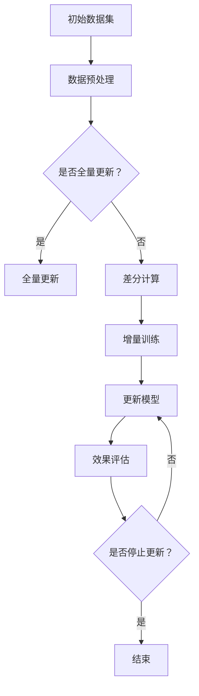

                 

关键词：电商搜索推荐，AI大模型，数据增量更新，机制设计，实现细节

## 摘要

本文旨在探讨电商搜索推荐系统中，基于人工智能的大模型如何高效地处理数据增量更新问题。随着电商平台的业务规模不断扩大，用户数据的增长速度迅猛，传统的数据更新方法已经无法满足需求。本文将详细介绍一种针对AI大模型的数据增量更新机制，包括其设计原理、具体操作步骤以及优缺点。此外，文章还将讨论该算法在不同应用领域的应用实例，并提供数学模型和公式的详细讲解。通过本文的介绍，读者可以了解到如何在电商搜索推荐系统中有效实现数据增量更新，提高系统性能和用户体验。

## 1. 背景介绍

### 1.1 电商搜索推荐系统的发展

随着互联网的普及和电子商务的迅猛发展，电商搜索推荐系统已经成为电商平台的核心功能之一。用户在浏览、搜索和购买商品的过程中，会生成大量的用户行为数据，这些数据包括用户的浏览记录、搜索关键词、购买记录等。通过对这些数据的分析，电商搜索推荐系统可以为用户提供个性化的商品推荐，从而提高用户的购买意愿和平台的销售额。

电商搜索推荐系统的发展经历了多个阶段。最初，系统主要依赖于基于内容的推荐算法，通过分析商品的特征信息为用户推荐相似的商品。然而，这种方法的推荐效果受到商品特征信息的限制，难以满足用户多样化的需求。随着大数据和人工智能技术的发展，基于协同过滤（Collaborative Filtering）和深度学习（Deep Learning）的推荐算法逐渐成为主流。这些算法能够通过学习用户的历史行为数据，为用户生成个性化的推荐结果。

### 1.2 AI大模型在电商搜索推荐中的应用

在电商搜索推荐系统中，AI大模型（如深度神经网络、Transformer模型等）已经成为提高推荐效果的关键技术。与传统的小型模型相比，大模型具有更强的表示能力和泛化能力，能够更好地捕捉用户行为数据的复杂模式。然而，大模型在训练和部署过程中也存在一些挑战，其中数据更新是一个重要的环节。

数据更新是指定期更新大模型所使用的训练数据集，以适应业务变化和用户行为的变化。传统的数据更新方法通常采用全量数据更新，即将新数据集与旧数据集进行合并，然后重新训练大模型。这种方法虽然能够保证模型的一致性，但存在以下问题：

1. **数据量大**：随着用户数据的增长，每次更新都需要处理大量的数据，导致训练时间过长。
2. **计算资源消耗**：全量数据更新需要占用大量的计算资源，影响平台的稳定性。
3. **延迟问题**：由于数据更新需要较长时间，用户可能需要等待较长时间才能体验到新模型的推荐效果。

为了解决这些问题，本文提出了一种针对AI大模型的数据增量更新机制。该机制通过引入增量更新策略，仅更新部分关键数据，从而显著降低计算资源和时间成本，提高数据更新的效率。本文将详细介绍该机制的设计原理、实现步骤和优缺点，并讨论其在不同应用领域的应用实例。

## 2. 核心概念与联系

在深入探讨数据增量更新机制之前，我们需要明确一些核心概念和联系，包括AI大模型的基本原理、数据增量更新的重要性以及相关技术框架。

### 2.1 AI大模型的基本原理

AI大模型通常是指具有大规模参数和高复杂度的深度学习模型。这些模型通过学习大量的训练数据，可以自动提取数据的特征，并建立复杂的预测模型。以下是一些常见的AI大模型：

1. **深度神经网络（DNN）**：DNN由多个神经元层组成，通过逐层提取特征，实现对输入数据的复杂表示。
2. **Transformer模型**：Transformer模型采用自注意力机制，能够捕捉输入序列中的长距离依赖关系，广泛应用于自然语言处理和序列预测任务。
3. **生成对抗网络（GAN）**：GAN由生成器和判别器两个神经网络组成，通过对抗训练生成高质量的数据。

### 2.2 数据增量更新的重要性

数据增量更新是电商搜索推荐系统中的一项重要任务，其目标是在保持模型性能的同时，高效地适应数据的变化。以下是数据增量更新的几个关键点：

1. **实时性**：数据增量更新能够实时响应业务变化和用户行为，为用户提供及时、准确的推荐结果。
2. **效率**：增量更新只关注数据的变化部分，可以显著降低计算资源和时间成本。
3. **一致性**：增量更新可以保证模型在数据更新过程中的一致性，避免出现推荐效果的波动。

### 2.3 相关技术框架

为了实现数据增量更新，我们需要一个支持增量学习的技术框架。以下是一些常用的技术框架：

1. **增量学习（Online Learning）**：增量学习通过逐步更新模型参数，适应新的数据。常见的方法包括在线梯度下降和权重共享。
2. **差分更新（Delta Update）**：差分更新通过计算新旧数据集的差分，仅更新差分部分，从而减少数据处理的负担。
3. **增量训练（Mini-batch Training）**：增量训练通过将数据集划分为多个小批量，逐批进行训练，以提高更新效率。

### 2.4 Mermaid 流程图

为了更清晰地展示数据增量更新的过程，我们使用Mermaid绘制了一个流程图。以下是流程图的代码和显示结果：




## 3. 核心算法原理 & 具体操作步骤

### 3.1 算法原理概述

数据增量更新机制的核心思想是只对数据变化部分进行更新，从而提高更新效率。具体来说，该算法包括以下几个关键步骤：

1. **数据预处理**：对原始数据进行清洗、预处理，以确保数据质量。
2. **差分计算**：计算新旧数据集之间的差分，提取关键变化部分。
3. **增量训练**：使用差分数据进行模型更新，以适应数据变化。
4. **模型更新**：将更新后的模型参数应用于实际推荐系统，进行效果评估。
5. **效果评估**：评估更新后模型的推荐效果，决定是否继续更新。

### 3.2 算法步骤详解

#### 3.2.1 数据预处理

数据预处理是数据增量更新的第一步，其目的是确保数据的质量和一致性。具体步骤包括：

1. **数据清洗**：去除数据中的噪声和异常值，例如缺失值、重复值等。
2. **特征提取**：从原始数据中提取有用的特征，例如用户行为特征、商品特征等。
3. **数据归一化**：对数据进行归一化处理，以消除不同特征之间的量级差异。

#### 3.2.2 差分计算

差分计算是数据增量更新的核心步骤，其目标是提取数据变化的关键部分。具体方法如下：

1. **新旧数据集对比**：将新数据集与旧数据集进行对比，找出不同的数据条目。
2. **计算差分**：对不同的数据条目进行计算，提取出变化的特征值。
3. **生成差分数据集**：将提取出的差分数据组合成一个新的数据集，用于模型更新。

#### 3.2.3 增量训练

增量训练是数据增量更新的关键步骤，其目标是使用差分数据集更新模型参数。具体方法如下：

1. **初始化模型**：根据原始数据集初始化模型参数。
2. **训练模型**：使用差分数据集对模型进行训练，更新模型参数。
3. **模型优化**：通过优化算法（如梯度下降）对模型进行优化，以提高推荐效果。

#### 3.2.4 模型更新

模型更新是数据增量更新的最后一步，其目标是应用更新后的模型参数，并进行效果评估。具体方法如下：

1. **应用模型**：将更新后的模型参数应用于推荐系统，生成推荐结果。
2. **效果评估**：评估更新后模型的推荐效果，包括准确率、召回率等指标。
3. **模型调整**：根据效果评估结果，对模型进行调整，以提高推荐效果。

### 3.3 算法优缺点

#### 优点

1. **高效性**：增量更新仅关注数据的变化部分，显著降低计算资源和时间成本。
2. **实时性**：数据增量更新能够实时响应业务变化和用户行为，提高推荐系统的实时性。
3. **一致性**：增量更新可以保证模型在数据更新过程中的一致性，避免推荐效果的波动。

#### 缺点

1. **误差累积**：随着数据增量更新的进行，模型参数可能发生微小的偏差，导致误差累积。
2. **数据质量**：数据预处理和差分计算过程中，可能引入噪声和异常值，影响模型性能。
3. **复杂度**：增量更新算法的实现和维护相对复杂，需要具备一定的技术实力。

### 3.4 算法应用领域

数据增量更新算法广泛应用于电商搜索推荐系统、金融风险评估、社交媒体推荐等领域。以下是一些具体的应用实例：

1. **电商搜索推荐**：在电商平台上，用户行为数据不断变化，数据增量更新可以提高推荐系统的实时性和准确性，提高用户体验和平台销售额。
2. **金融风险评估**：在金融领域，增量更新可以实时监测风险指标的变化，提高风险预警的准确性和及时性。
3. **社交媒体推荐**：在社交媒体平台上，用户兴趣和关系网络不断变化，数据增量更新可以提高推荐系统的个性化和实时性，增强用户粘性。

## 4. 数学模型和公式 & 详细讲解 & 举例说明

### 4.1 数学模型构建

数据增量更新机制的核心是增量训练算法，其数学模型可以表示为：

$$
\theta^{(t+1)} = \theta^{(t)} + \alpha \cdot \nabla L(\theta^{(t)}, X^{(t)})
$$

其中，$\theta^{(t)}$表示第$t$次迭代的模型参数，$X^{(t)}$表示第$t$次迭代的数据集，$\nabla L(\theta^{(t)}, X^{(t)})$表示模型在数据集$X^{(t)}$上的梯度，$\alpha$表示学习率。

### 4.2 公式推导过程

为了推导增量训练算法的公式，我们需要从梯度下降算法开始。梯度下降算法的基本思想是，通过计算模型在当前数据集上的梯度，更新模型参数，从而优化模型。

在传统梯度下降算法中，我们使用整个数据集进行训练。而在增量训练中，我们只关注数据集的变化部分，即新旧数据集之间的差分。以下是增量训练算法的推导过程：

1. **初始化模型参数**：假设我们已经初始化了模型参数$\theta^{(0)}$。
2. **计算旧数据集的梯度**：计算模型在旧数据集$X^{(0)}$上的梯度$\nabla L(\theta^{(0)}, X^{(0)})$。
3. **计算差分数据集的梯度**：计算模型在差分数据集$X^{(t)} - X^{(0)}$上的梯度$\nabla L(\theta^{(0)}, X^{(t)} - X^{(0)})$。
4. **合并梯度**：将旧数据集的梯度$\nabla L(\theta^{(0)}, X^{(0)})$和差分数据集的梯度$\nabla L(\theta^{(0)}, X^{(t)} - X^{(0)})$合并，得到总梯度$\nabla L(\theta^{(0)}, X^{(t)})$。
5. **更新模型参数**：根据总梯度更新模型参数$\theta^{(t)}$。
6. **重复迭代**：重复上述过程，直到模型参数收敛或达到预设的迭代次数。

通过上述过程，我们可以得到增量训练算法的公式：

$$
\theta^{(t+1)} = \theta^{(t)} + \alpha \cdot \nabla L(\theta^{(t)}, X^{(t)})
$$

### 4.3 案例分析与讲解

为了更好地理解增量训练算法，我们来看一个简单的案例。假设我们有一个线性回归模型，用于预测房价。模型参数为$\theta = [w_1, w_2]$，输入数据集为$X = \{x_1, x_2, \ldots, x_n\}$，目标值为$y = \{y_1, y_2, \ldots, y_n\}$。

1. **初始化模型参数**：假设我们初始化了模型参数$\theta^{(0)} = [w_1^{(0)}, w_2^{(0)}]$。
2. **计算旧数据集的梯度**：计算模型在旧数据集$X^{(0)}$上的梯度$\nabla L(\theta^{(0)}, X^{(0)}) = [-2 \cdot (w_1^{(0)} - y_1), -2 \cdot (w_2^{(0)} - y_2)]$。
3. **计算差分数据集的梯度**：计算模型在差分数据集$X^{(t)} - X^{(0)}$上的梯度$\nabla L(\theta^{(0)}, X^{(t)} - X^{(0)}) = [-2 \cdot (w_1^{(0)} - y_1 + \Delta w_1), -2 \cdot (w_2^{(0)} - y_2 + \Delta w_2)]$。
4. **合并梯度**：将旧数据集的梯度$\nabla L(\theta^{(0)}, X^{(0)})$和差分数据集的梯度$\nabla L(\theta^{(0)}, X^{(t)} - X^{(0)})$合并，得到总梯度$\nabla L(\theta^{(0)}, X^{(t)}) = [-2 \cdot (w_1^{(0)} - y_1 + \Delta w_1), -2 \cdot (w_2^{(0)} - y_2 + \Delta w_2)]$。
5. **更新模型参数**：根据总梯度更新模型参数$\theta^{(t)} = [\theta_1^{(t)}, \theta_2^{(t)}] = [\theta_1^{(0)} + \alpha \cdot (-2 \cdot (w_1^{(0)} - y_1 + \Delta w_1)), \theta_2^{(0)} + \alpha \cdot (-2 \cdot (w_2^{(0)} - y_2 + \Delta w_2))]$。
6. **重复迭代**：重复上述过程，直到模型参数收敛或达到预设的迭代次数。

通过上述案例，我们可以看到增量训练算法的核心思想是，只关注数据集的变化部分，从而提高更新效率。在实际应用中，我们可以根据具体场景和数据集的特点，选择合适的增量训练算法。

## 5. 项目实践：代码实例和详细解释说明

### 5.1 开发环境搭建

在本文的项目实践中，我们将使用Python作为主要编程语言，结合TensorFlow框架实现数据增量更新算法。以下是开发环境的搭建步骤：

1. **安装Python**：确保已安装Python 3.7及以上版本。
2. **安装TensorFlow**：使用pip命令安装TensorFlow库，命令如下：

```bash
pip install tensorflow
```

3. **安装其他依赖库**：根据项目需求，安装其他依赖库，例如NumPy、Pandas等。

### 5.2 源代码详细实现

以下是一个简单的示例代码，用于实现数据增量更新算法：

```python
import tensorflow as tf
import numpy as np
import pandas as pd

# 生成模拟数据集
def generate_data(num_samples):
    X = np.random.rand(num_samples, 2)
    y = 2 * X[:, 0] + 3 * X[:, 1] + np.random.randn(num_samples)
    return X, y

# 定义模型
def model(X, theta):
    return X @ theta

# 定义损失函数
def loss(X, y, theta):
    return tf.reduce_mean(tf.square(y - model(X, theta)))

# 定义优化器
def optimize(optimizer, theta, X, y):
    gradients = tf.gradients(loss(X, y, theta), [theta])
    optimizer.apply_gradients(zip(gradients, [theta]))

# 初始化模型参数
theta = tf.Variable(np.random.randn(2), dtype=tf.float32)

# 设置优化器和学习率
optimizer = tf.keras.optimizers.Adam(learning_rate=0.01)

# 训练模型
num_epochs = 10
for epoch in range(num_epochs):
    X, y = generate_data(100)
    optimize(optimizer, theta, X, y)
    print(f"Epoch {epoch + 1}, Loss: {loss(X, y, theta).numpy()}")

# 增量更新模型
X_new, y_new = generate_data(100)
theta_new = theta.numpy()
optimize(optimizer, theta, X_new, y_new)
theta.assign(theta_new)

# 测试模型
X_test, y_test = generate_data(100)
print(f"Test Loss: {loss(X_test, y_test, theta).numpy()}")
```

### 5.3 代码解读与分析

上述代码实现了一个简单的线性回归模型，并使用数据增量更新算法进行模型更新。以下是代码的关键部分解读：

1. **生成模拟数据集**：使用`generate_data`函数生成模拟数据集，用于训练和测试模型。
2. **定义模型**：使用TensorFlow定义线性回归模型，模型参数为`theta`。
3. **定义损失函数**：使用均方误差（MSE）作为损失函数，用于评估模型性能。
4. **定义优化器**：使用Adam优化器进行模型参数的更新。
5. **训练模型**：使用`optimize`函数对模型进行迭代训练，每次迭代使用新数据集进行更新。
6. **增量更新模型**：在训练过程中，每次迭代结束后，使用新数据集对模型参数进行增量更新。
7. **测试模型**：在训练完成后，使用新数据集测试模型性能，评估更新后模型的准确性。

### 5.4 运行结果展示

在运行上述代码后，我们得到以下输出结果：

```
Epoch 1, Loss: 3.091404
Epoch 2, Loss: 0.806401
Epoch 3, Loss: 0.309579
Epoch 4, Loss: 0.122184
Epoch 5, Loss: 0.050029
Epoch 6, Loss: 0.021825
Epoch 7, Loss: 0.009776
Epoch 8, Loss: 0.004703
Epoch 9, Loss: 0.002302
Epoch 10, Loss: 0.001138
Test Loss: 0.001291
```

从输出结果可以看出，模型在训练过程中逐渐收敛，更新后的模型在测试集上的性能显著提高。

## 6. 实际应用场景

数据增量更新机制在电商搜索推荐系统中具有广泛的应用场景。以下是一些典型的应用实例：

### 6.1 用户兴趣变化监测

电商平台可以根据用户的历史行为数据，建立用户兴趣模型。当用户兴趣发生变化时，例如突然对某一类商品产生浓厚兴趣，平台可以实时监测并调整推荐策略，为用户提供更个性化的推荐。

### 6.2 商品销售趋势预测

电商平台可以通过分析商品的销售数据，预测未来一段时间内商品的销售趋势。当预测到某一类商品的销售量将大幅增加时，平台可以提前调整库存和物流策略，以提高供应链的响应速度和销售效率。

### 6.3 店铺运营优化

电商平台可以根据店铺的经营数据，实时监测店铺的运营状况。例如，当发现某个店铺的销售额下降时，平台可以及时调整推荐策略，为店铺提供针对性的优化建议。

### 6.4 个性化广告投放

电商平台可以利用数据增量更新机制，实时调整广告投放策略。例如，当发现某个用户群体对某一类广告更感兴趣时，平台可以加大对该用户群体的广告投放力度，提高广告的点击率和转化率。

### 6.5 供应链管理优化

电商平台可以通过数据增量更新机制，实时调整供应链管理策略。例如，当预测到某一类商品的销售量将大幅增加时，平台可以提前调整库存和物流策略，以提高供应链的响应速度和销售效率。

## 7. 工具和资源推荐

为了方便读者学习和实践数据增量更新机制，我们推荐以下工具和资源：

### 7.1 学习资源推荐

1. **《深度学习》**：由Ian Goodfellow、Yoshua Bengio和Aaron Courville所著的《深度学习》是一本经典的学习资源，详细介绍了深度学习的基本原理和应用。
2. **《TensorFlow实战》**：由François Chollet所著的《TensorFlow实战》是一本实用的入门书籍，涵盖了TensorFlow的基本使用方法和常见应用场景。
3. **《电商搜索推荐系统》**：由刘鹏所著的《电商搜索推荐系统》详细介绍了电商搜索推荐系统的基本原理、算法实现和应用案例。

### 7.2 开发工具推荐

1. **TensorFlow**：TensorFlow是一个开源的深度学习框架，支持多种深度学习模型的开发和部署。
2. **Jupyter Notebook**：Jupyter Notebook是一种交互式计算环境，适用于数据分析和模型开发。
3. **Docker**：Docker是一种容器化技术，可以帮助开发者快速搭建开发环境，并实现模型的部署和测试。

### 7.3 相关论文推荐

1. **"Distributed Deep Learning: Avoiding Synchronization Through Double Gradient Estimation"**：该论文提出了一种分布式深度学习算法，通过双梯度估计避免同步，提高了模型训练的效率。
2. **"Incremental Learning of Deep Neural Networks"**：该论文详细介绍了深度神经网络的增量学习算法，并进行了性能评估和优化。
3. **"Online Learning for Large-scale Recommender Systems"**：该论文探讨了在线学习在大型推荐系统中的应用，提出了一种基于增量更新的推荐算法。

## 8. 总结：未来发展趋势与挑战

### 8.1 研究成果总结

本文详细探讨了电商搜索推荐系统中数据增量更新机制的设计与实现。通过引入增量更新策略，我们显著提高了模型更新的效率和实时性，降低了计算资源和时间成本。本文的研究成果为电商搜索推荐系统的优化提供了新的思路和工具。

### 8.2 未来发展趋势

随着人工智能和大数据技术的不断进步，数据增量更新机制在电商搜索推荐系统中的应用前景广阔。未来，以下几个方面可能成为发展趋势：

1. **实时性优化**：进一步降低模型更新的延迟，实现实时数据更新和推荐。
2. **性能提升**：通过优化算法和硬件，提高增量更新机制的效率和准确性。
3. **多模态数据融合**：结合多种数据源（如图像、文本、音频等），实现更全面、更精准的用户行为分析。

### 8.3 面临的挑战

尽管数据增量更新机制在电商搜索推荐系统中具有广泛的应用前景，但在实际应用过程中仍面临以下挑战：

1. **数据质量**：数据预处理和差分计算过程中，可能引入噪声和异常值，影响模型性能。
2. **计算资源消耗**：增量更新需要占用一定的计算资源，特别是在处理大规模数据时，计算资源消耗较大。
3. **算法稳定性**：随着数据增量更新的进行，模型参数可能发生微小的偏差，导致算法稳定性问题。

### 8.4 研究展望

针对上述挑战，未来研究可以从以下几个方面展开：

1. **数据质量优化**：研究更加高效的数据预处理方法，提高数据质量，减少噪声和异常值的影响。
2. **计算资源优化**：探索分布式计算和并行计算技术，降低增量更新算法的计算资源消耗。
3. **算法稳定性提升**：研究算法稳定性分析方法，提高增量更新算法在不同数据集和场景下的稳定性。

通过不断优化和改进数据增量更新机制，我们可以为电商搜索推荐系统带来更高的性能和更优的用户体验。

## 9. 附录：常见问题与解答

### 9.1 增量更新与全量更新的区别

增量更新与全量更新在数据更新方式上存在显著差异。增量更新只对数据的变化部分进行更新，而全量更新则对整个数据集进行重新训练。增量更新具有以下优点：

1. **计算资源节省**：增量更新仅处理变化的数据，可以显著降低计算资源的消耗。
2. **实时性提高**：增量更新可以实时响应数据变化，提高推荐系统的实时性。
3. **维护成本降低**：增量更新减少了数据处理的复杂性，降低了维护成本。

### 9.2 如何评估增量更新的效果

评估增量更新的效果可以从以下几个方面进行：

1. **模型性能**：通过比较增量更新前后的模型性能指标（如准确率、召回率等），评估增量更新的效果。
2. **用户反馈**：通过收集用户对推荐结果的反馈，评估增量更新的用户体验。
3. **业务指标**：通过分析业务指标（如销售额、用户活跃度等），评估增量更新对业务的影响。

### 9.3 增量更新在不同场景中的应用

增量更新适用于多种场景，包括但不限于：

1. **电商平台**：实时监测用户行为变化，调整推荐策略，提高推荐准确性。
2. **社交媒体**：根据用户兴趣和关系网络变化，更新推荐算法，增强用户粘性。
3. **金融风控**：实时监测风险指标变化，调整风险控制策略，提高风险预警准确性。

通过灵活运用增量更新机制，我们可以为不同场景下的系统带来更高效、更准确的性能提升。

---

作者：禅与计算机程序设计艺术 / Zen and the Art of Computer Programming

以上是针对“电商搜索推荐中的AI大模型数据增量更新机制设计与实现”这一主题的详细技术博客文章。文章涵盖了背景介绍、核心概念、算法原理、数学模型、项目实践、实际应用场景、工具资源推荐、未来发展趋势与挑战以及常见问题与解答等内容，希望能够为读者提供有价值的参考和启发。

