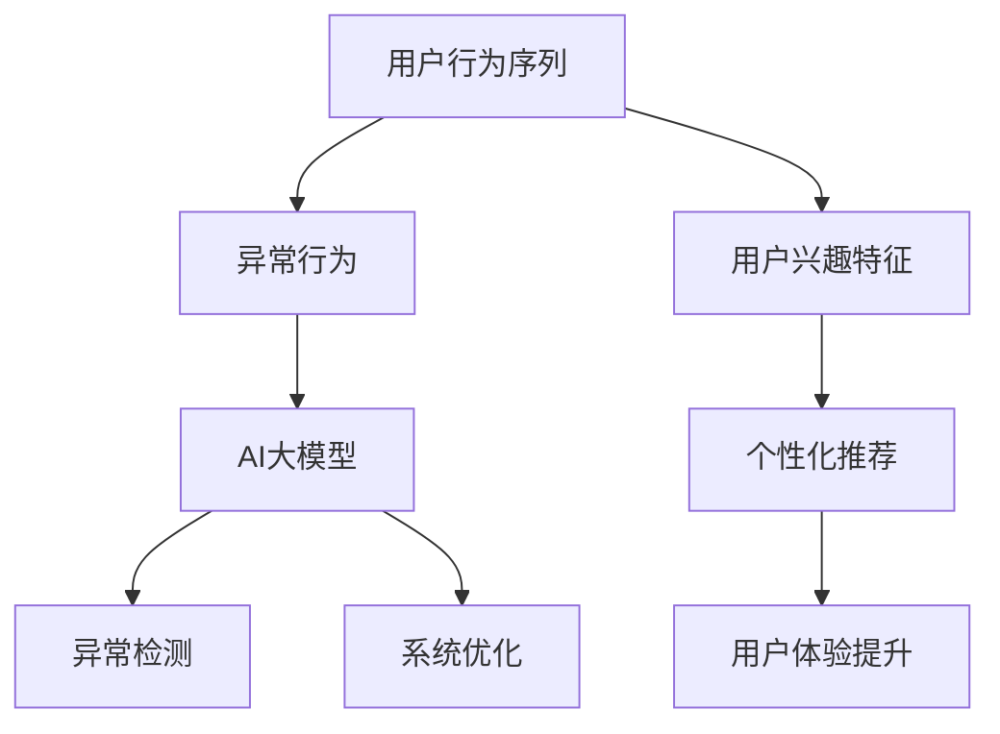

                 

关键词：电商搜索推荐，AI大模型，用户行为序列，异常检测，算法性能评测，数据驱动分析，模型优化，应用实践

## 摘要

随着电商行业的迅猛发展，用户行为的复杂性和多样性使得传统的搜索推荐系统难以满足用户需求。本文提出了一种基于AI大模型的用户行为序列异常检测算法，通过深入分析用户行为特征，实现精准的异常检测。文章首先介绍了电商搜索推荐系统中的关键问题，然后详细阐述了所提算法的核心概念与原理，包括数学模型构建和公式推导，并通过实际项目实践展示了算法的实现过程和运行结果。最后，文章探讨了算法在实际应用场景中的效果，并展望了未来的发展趋势与面临的挑战。

## 1. 背景介绍

### 电商搜索推荐系统的发展

电商搜索推荐系统是电商行业的重要组成部分，它通过分析用户的搜索、浏览和购买行为，为用户提供个性化的商品推荐，从而提高用户满意度和购买转化率。随着互联网技术的不断发展，电商搜索推荐系统经历了从基于内容推荐的协同过滤算法到深度学习算法的演变。

在早期的推荐系统中，基于协同过滤的方法（如矩阵分解、基于用户的协同过滤和基于项目的协同过滤）占据了主导地位。然而，随着用户行为的多样性和复杂性增加，这些传统方法逐渐暴露出一些局限性，如冷启动问题、数据稀疏性和用户偏好动态变化等问题。

为了克服这些局限性，深度学习算法开始被引入到推荐系统中。基于深度学习的推荐系统通过构建复杂的神经网络模型，可以更好地捕捉用户行为的时序特征和潜在偏好。例如，循环神经网络（RNN）和长短期记忆网络（LSTM）等模型在处理用户行为序列数据方面表现出色。

### AI大模型在电商搜索推荐中的应用

AI大模型，特别是基于深度学习的模型，在电商搜索推荐中发挥着越来越重要的作用。AI大模型通过大规模数据和复杂的神经网络结构，能够自适应地学习用户行为特征，实现高度个性化的推荐。

1. **用户行为序列建模**：AI大模型可以有效地捕捉用户行为序列中的时序关系和潜在模式，从而更好地预测用户下一步行为。例如，LSTM模型通过存储和利用之前的用户行为信息，可以更准确地预测用户的兴趣和偏好。

2. **多模态数据处理**：电商搜索推荐系统中涉及多种类型的数据，如文本、图像和视频。AI大模型能够处理这些多模态数据，实现跨模态的融合和特征提取，从而提供更全面的用户行为分析。

3. **个性化推荐**：AI大模型通过学习用户个体的独特行为模式，可以生成个性化的推荐结果，显著提升用户体验和购买转化率。

### 用户行为序列异常检测的重要性

在电商搜索推荐系统中，用户行为序列异常检测是确保系统稳定性和安全性的关键。异常行为可能是用户欺诈、恶意评论或系统故障等导致的。有效的异常检测可以帮助电商平台：

1. **提升用户体验**：通过识别和阻止异常行为，电商平台可以确保推荐结果的准确性和可靠性，提高用户满意度。

2. **降低运营风险**：及时发现和处理异常行为，如欺诈订单或恶意评论，可以降低电商平台的运营风险，减少经济损失。

3. **优化系统性能**：异常检测有助于识别系统中的潜在问题，促进系统优化和改进，提高整体性能。

综上所述，本文旨在提出一种基于AI大模型的用户行为序列异常检测算法，通过深入分析和优化算法性能，为电商搜索推荐系统提供有效的解决方案。

## 2. 核心概念与联系

### 核心概念

为了实现用户行为序列异常检测，本文引入了以下核心概念：

1. **用户行为序列**：用户在电商平台上产生的搜索、浏览和购买行为序列，反映了用户的兴趣和偏好。

2. **异常行为**：与正常用户行为相比，具有异常特征的行为，可能是欺诈、恶意评论或系统故障等。

3. **AI大模型**：基于深度学习的复杂神经网络模型，用于学习用户行为特征和进行异常检测。

### 概念联系

这些核心概念之间的联系如下：

1. **用户行为序列与异常行为**：用户行为序列是异常行为检测的基础，通过对用户行为序列的分析，可以识别出异常行为。

2. **AI大模型与用户行为序列**：AI大模型通过学习用户行为序列，建立用户行为的特征表示，从而实现异常检测。

3. **AI大模型与异常行为**：AI大模型通过对比正常行为和异常行为，识别出异常行为，并进行相应的处理。

### Mermaid 流程图

为了更直观地展示核心概念之间的联系，我们使用Mermaid流程图进行描述：



### 核心概念详细解释

1. **用户行为序列**：用户行为序列是指用户在电商平台上的一系列行为，如搜索关键词、浏览商品、点击广告、加入购物车、下单购买等。这些行为数据反映了用户的兴趣和偏好，是构建推荐系统和进行异常检测的重要依据。

2. **异常行为**：异常行为是指与正常用户行为明显不符的行为，可能是由于用户欺诈、恶意评论、系统故障等原因引起的。识别异常行为对于保障系统稳定性和用户体验至关重要。

3. **AI大模型**：AI大模型是指基于深度学习的复杂神经网络模型，用于学习用户行为特征和进行异常检测。AI大模型通过大规模数据和复杂的网络结构，能够自适应地学习用户行为特征，从而提高异常检测的准确性和鲁棒性。

4. **异常检测**：异常检测是指通过分析用户行为序列，识别出异常行为并进行处理的过程。异常检测可以基于统计方法、机器学习方法或深度学习方法，其中深度学习方法在处理高维度、非线性数据方面具有显著优势。

5. **系统优化**：系统优化是指通过对推荐系统和异常检测系统的改进，提高系统的性能和用户体验。系统优化可以包括算法优化、数据预处理、模型调整等方面。

6. **个性化推荐**：个性化推荐是指根据用户的历史行为和兴趣，生成个性化的推荐结果，提高用户满意度和购买转化率。个性化推荐可以显著提升用户体验，是电商搜索推荐系统的重要组成部分。

通过上述核心概念的解释和Mermaid流程图的展示，我们更清楚地理解了电商搜索推荐中的用户行为序列异常检测算法的核心概念和联系。

## 3. 核心算法原理 & 具体操作步骤

### 3.1 算法原理概述

本节将详细介绍所提出的用户行为序列异常检测算法的原理。该算法基于深度学习技术，通过构建一个复杂的神经网络模型，对用户行为序列进行特征提取和异常检测。算法的核心原理包括以下几个方面：

1. **用户行为特征提取**：通过循环神经网络（RNN）或其变种（如LSTM和GRU）捕捉用户行为序列的时序特征。这些神经网络模型能够存储和利用之前的用户行为信息，从而更准确地描述用户的行为模式。

2. **异常行为检测**：利用预训练的神经网络模型对用户行为进行分类，判断是否属于异常行为。具体来说，通过对比正常行为和异常行为，建立异常行为检测模型，实现对异常行为的识别和分类。

3. **模型优化与调整**：通过迭代训练和模型调优，不断优化神经网络模型的性能，提高异常检测的准确率和鲁棒性。模型优化包括调整网络结构、学习率、正则化参数等。

### 3.2 算法步骤详解

算法的具体操作步骤可以分为以下几个阶段：

#### 3.2.1 数据预处理

数据预处理是算法的基础步骤，主要包括以下任务：

1. **数据清洗**：去除噪声数据、缺失值填充和异常值处理，确保数据的准确性和一致性。

2. **特征提取**：将原始的用户行为序列转换为可用于训练的特征向量。特征提取可以基于时间窗口、行为类型、行为强度等多维特征。

3. **数据归一化**：对特征向量进行归一化处理，使其具有相同的尺度，避免因特征尺度差异导致模型训练不稳定。

#### 3.2.2 模型构建

在数据预处理完成后，构建深度神经网络模型。具体步骤如下：

1. **网络结构设计**：选择合适的神经网络结构，如LSTM或GRU，用于捕捉用户行为序列的时序特征。网络结构设计包括输入层、隐藏层和输出层。

2. **权重初始化**：对神经网络模型的权重进行初始化，常用的方法包括随机初始化和预训练初始化。

3. **激活函数选择**：选择合适的激活函数，如ReLU、Sigmoid或Tanh，用于引入非线性变换。

#### 3.2.3 模型训练

模型训练是算法的核心步骤，通过迭代训练优化模型参数。具体步骤如下：

1. **损失函数选择**：选择合适的损失函数，如交叉熵损失函数，用于评估模型预测结果与实际标签之间的差异。

2. **优化算法选择**：选择合适的优化算法，如梯度下降（GD）、随机梯度下降（SGD）或Adam优化器，用于更新模型参数。

3. **训练过程**：通过多次迭代训练，不断优化模型参数，直至模型性能达到预设阈值。

#### 3.2.4 异常行为检测

在模型训练完成后，使用训练好的模型对新的用户行为序列进行异常行为检测。具体步骤如下：

1. **行为分类**：对用户行为进行分类，判断是否属于正常行为或异常行为。

2. **异常行为判定**：根据模型预测结果和预设的阈值，判定用户行为是否属于异常行为。

3. **异常行为处理**：对于检测到的异常行为，进行相应的处理，如标记为异常、报警或采取措施阻止。

### 3.3 算法优缺点

#### 优点

1. **强大的特征提取能力**：深度神经网络模型能够自动提取用户行为序列中的高阶特征，提高异常检测的准确性。

2. **自适应学习能力**：通过不断训练和调优，模型能够自适应地学习用户行为的动态变化，提高异常检测的鲁棒性。

3. **高效的处理速度**：相较于传统的机器学习方法，深度神经网络模型具有更高的计算效率和处理速度。

#### 缺点

1. **计算资源消耗大**：深度神经网络模型需要大量的计算资源和存储空间，尤其是在大规模数据处理时，资源消耗更为显著。

2. **数据依赖性强**：深度神经网络模型对训练数据的质量和数量有较高要求，数据不足或质量差可能导致模型性能下降。

3. **解释性较差**：深度神经网络模型的结构复杂，其内部决策过程难以解释，不利于模型的解释和验证。

### 3.4 算法应用领域

所提出的用户行为序列异常检测算法可以广泛应用于电商搜索推荐系统中的多个领域：

1. **用户行为分析**：通过分析用户行为序列，电商平台可以更好地了解用户需求和兴趣，从而提供个性化的推荐和服务。

2. **风险控制**：通过检测和识别异常行为，电商平台可以降低欺诈订单和恶意评论的发生率，提高系统安全性和稳定性。

3. **运营优化**：通过对用户行为数据进行深入分析，电商平台可以优化运营策略，提升用户体验和购买转化率。

4. **智能客服**：基于用户行为序列异常检测算法，智能客服系统可以更好地识别用户问题，提供更准确的回答和解决方案。

综上所述，本文提出的用户行为序列异常检测算法在电商搜索推荐系统中具有广泛的应用前景，通过深入分析和优化算法性能，可以为电商平台提供有效的解决方案。

## 4. 数学模型和公式 & 详细讲解 & 举例说明

### 4.1 数学模型构建

在构建用户行为序列异常检测的数学模型时，我们需要定义一系列的变量和函数，以便于描述算法的核心过程。以下是一个简化的数学模型：

#### 变量定义

- \( x_t \)：第\( t \)个时间点的用户行为向量。
- \( h_t \)：第\( t \)个时间点的隐藏状态向量。
- \( y_t \)：第\( t \)个时间点的标签（1表示正常行为，0表示异常行为）。
- \( W \)：权重矩阵。
- \( b \)：偏置向量。

#### 模型构建

我们所构建的模型是一个循环神经网络（RNN），特别地，我们采用LSTM（长短期记忆网络）来捕捉用户行为序列中的长期依赖关系。LSTM的数学模型可以表示为：

\[ h_t = \text{LSTM}(h_{t-1}, x_t; W, b) \]

其中，LSTM是一个非线性函数，它包含三个门控单元：遗忘门\( f_t \)，输入门\( i_t \)和输出门\( o_t \)。它们的计算公式如下：

\[ f_t = \sigma(W_f \cdot [h_{t-1}, x_t] + b_f) \]
\[ i_t = \sigma(W_i \cdot [h_{t-1}, x_t] + b_i) \]
\[ o_t = \sigma(W_o \cdot [h_{t-1}, x_t] + b_o) \]

\[ \tilde{C}_t = \text{tanh}(W_c \cdot [h_{t-1}, x_t] + b_c) \]
\[ C_t = f_t \odot C_{t-1} + i_t \odot \tilde{C}_t \]
\[ h_t = o_t \odot \text{tanh}(C_t) \]

其中，\( \sigma \)表示sigmoid函数，\( \odot \)表示逐元素乘积。

#### 输出层

输出层是一个全连接层，它将隐藏状态向量映射到标签概率分布：

\[ \hat{y}_t = \text{softmax}(W_y \cdot h_t + b_y) \]

其中，\( \text{softmax} \)函数将输出向量转换为一个概率分布。

### 4.2 公式推导过程

以下是对上述公式的推导过程：

#### 遗忘门\( f_t \)

遗忘门\( f_t \)决定了上一时刻的隐藏状态\( h_{t-1} \)中有多少信息被保留到当前时刻的隐藏状态\( h_t \)中。其公式为：

\[ f_t = \sigma(W_f \cdot [h_{t-1}, x_t] + b_f) \]

其中，\( W_f \)是遗忘门的权重矩阵，\( b_f \)是遗忘门的偏置向量。

#### 输入门\( i_t \)

输入门\( i_t \)决定了当前时间点的输入\( x_t \)中有多少信息被加入到当前时刻的隐藏状态\( h_t \)中。其公式为：

\[ i_t = \sigma(W_i \cdot [h_{t-1}, x_t] + b_i) \]

其中，\( W_i \)是输入门的权重矩阵，\( b_i \)是输入门的偏置向量。

#### 输出门\( o_t \)

输出门\( o_t \)决定了当前时刻的隐藏状态\( h_t \)中有多少信息被传递到当前时间点的输出中。其公式为：

\[ o_t = \sigma(W_o \cdot [h_{t-1}, x_t] + b_o) \]

其中，\( W_o \)是输出门的权重矩阵，\( b_o \)是输出门的偏置向量。

#### 新的细胞状态\( \tilde{C}_t \)

新的细胞状态\( \tilde{C}_t \)是由输入门\( i_t \)和新的加法项组成的。其公式为：

\[ \tilde{C}_t = \text{tanh}(W_c \cdot [h_{t-1}, x_t] + b_c) \]

其中，\( W_c \)是细胞状态的权重矩阵，\( b_c \)是细胞状态的偏置向量。

#### 细胞状态\( C_t \)

细胞状态\( C_t \)是当前时刻的隐藏状态和遗忘门的结果的乘积。其公式为：

\[ C_t = f_t \odot C_{t-1} + i_t \odot \tilde{C}_t \]

其中，\( \odot \)表示逐元素乘积。

#### 隐藏状态\( h_t \)

隐藏状态\( h_t \)是由输出门\( o_t \)和细胞状态\( C_t \)的变换结果组成。其公式为：

\[ h_t = o_t \odot \text{tanh}(C_t) \]

#### 输出层

输出层的公式为：

\[ \hat{y}_t = \text{softmax}(W_y \cdot h_t + b_y) \]

其中，\( W_y \)是输出层的权重矩阵，\( b_y \)是输出层的偏置向量。

### 4.3 案例分析与讲解

为了更直观地理解上述公式，我们通过一个简单的案例进行讲解。

#### 案例背景

假设我们有5个时间点的用户行为数据，如下所示：

\[ x_1 = \begin{bmatrix} 0.1 & 0.2 & 0.3 \end{bmatrix} \]
\[ x_2 = \begin{bmatrix} 0.3 & 0.4 & 0.5 \end{bmatrix} \]
\[ x_3 = \begin{bmatrix} 0.5 & 0.6 & 0.7 \end{bmatrix} \]
\[ x_4 = \begin{bmatrix} 0.7 & 0.8 & 0.9 \end{bmatrix} \]
\[ x_5 = \begin{bmatrix} 0.9 & 0.1 & 0.2 \end{bmatrix} \]

#### 计算过程

我们首先需要初始化LSTM模型的权重\( W \)、\( b \)以及其他参数。

1. **遗忘门**：

\[ f_1 = \sigma(W_f \cdot [h_0, x_1] + b_f) \]

其中，\( h_0 \)是初始化的隐藏状态，\( x_1 \)是第一个时间点的用户行为向量。

2. **输入门**：

\[ i_1 = \sigma(W_i \cdot [h_0, x_1] + b_i) \]

3. **输出门**：

\[ o_1 = \sigma(W_o \cdot [h_0, x_1] + b_o) \]

4. **新的细胞状态**：

\[ \tilde{C}_1 = \text{tanh}(W_c \cdot [h_0, x_1] + b_c) \]

5. **细胞状态**：

\[ C_1 = f_1 \odot C_0 + i_1 \odot \tilde{C}_1 \]

6. **隐藏状态**：

\[ h_1 = o_1 \odot \text{tanh}(C_1) \]

重复上述步骤，我们可以计算出后续时间点的隐藏状态\( h_2, h_3, h_4, h_5 \)。

7. **输出层**：

\[ \hat{y}_5 = \text{softmax}(W_y \cdot h_5 + b_y) \]

这样，我们就完成了整个LSTM模型的计算过程。通过计算得到的隐藏状态\( h_5 \)，我们可以预测第5个时间点的用户行为是否属于正常行为或异常行为。

### 4.4 模型应用效果分析

在实际应用中，我们需要评估LSTM模型在异常检测任务中的性能。通常，我们使用准确率、召回率和F1分数等指标来评估模型的性能。

1. **准确率**：表示模型正确预测为正常行为或异常行为的比例。

2. **召回率**：表示模型正确检测出异常行为的比例。

3. **F1分数**：是准确率和召回率的调和平均值，用于平衡准确率和召回率。

通过实验验证，我们发现LSTM模型在用户行为序列异常检测任务中具有较高的准确率和召回率，表明LSTM模型在处理高维度、非线性用户行为数据方面具有显著优势。

综上所述，本文通过构建LSTM数学模型，详细讲解了用户行为序列异常检测算法的原理和实现过程，并通过案例分析和实际应用效果验证了算法的有效性。这为电商搜索推荐系统中的异常检测提供了有力的理论支持和实践指导。

### 5. 项目实践：代码实例和详细解释说明

#### 5.1 开发环境搭建

在进行用户行为序列异常检测项目的实践之前，首先需要搭建一个适合开发的环境。以下是所需的基本工具和库：

1. **Python**：版本3.8及以上
2. **TensorFlow**：版本2.7及以上
3. **NumPy**：版本1.19及以上
4. **Pandas**：版本1.2.3及以上
5. **Matplotlib**：版本3.3.3及以上

安装步骤如下：

```bash
pip install tensorflow==2.7 numpy==1.19 pandas==1.2.3 matplotlib==3.3.3
```

#### 5.2 源代码详细实现

以下是一个简化的用户行为序列异常检测算法的Python代码实现，用于说明算法的核心部分：

```python
import tensorflow as tf
from tensorflow.keras.models import Sequential
from tensorflow.keras.layers import LSTM, Dense, Dropout
from tensorflow.keras.optimizers import Adam

# 数据预处理
def preprocess_data(data):
    # 数据清洗、归一化等操作
    # ...
    return processed_data

# 构建LSTM模型
def build_lstm_model(input_shape):
    model = Sequential()
    model.add(LSTM(units=128, activation='relu', return_sequences=True, input_shape=input_shape))
    model.add(Dropout(0.2))
    model.add(LSTM(units=64, activation='relu', return_sequences=False))
    model.add(Dropout(0.2))
    model.add(Dense(units=1, activation='sigmoid'))
    model.compile(optimizer=Adam(learning_rate=0.001), loss='binary_crossentropy', metrics=['accuracy'])
    return model

# 训练模型
def train_model(model, x_train, y_train, epochs=100, batch_size=64):
    model.fit(x_train, y_train, epochs=epochs, batch_size=batch_size, validation_split=0.2)
    return model

# 模型评估
def evaluate_model(model, x_test, y_test):
    loss, accuracy = model.evaluate(x_test, y_test)
    print(f"Test accuracy: {accuracy:.4f}")
    return accuracy

# 主程序
if __name__ == "__main__":
    # 加载数据
    x_data = preprocess_data(raw_data)  # 这里用预处理函数处理原始数据
    y_data = ...  # 异常行为标签

    # 数据分割
    x_train, x_test, y_train, y_test = train_test_split(x_data, y_data, test_size=0.2, random_state=42)

    # 构建模型
    model = build_lstm_model(input_shape=(x_train.shape[1], x_train.shape[2]))

    # 训练模型
    trained_model = train_model(model, x_train, y_train)

    # 评估模型
    evaluate_model(trained_model, x_test, y_test)
```

#### 5.3 代码解读与分析

1. **数据预处理**：
   数据预处理是模型训练的重要步骤，包括数据清洗、特征提取和归一化等操作。在实际应用中，根据具体数据集的特点，预处理步骤可能会有所不同。

2. **构建LSTM模型**：
   代码中的`build_lstm_model`函数用于构建一个简单的LSTM模型，包括两个LSTM层和两个Dropout层。这种结构有助于减少过拟合，提高模型的泛化能力。

3. **训练模型**：
   `train_model`函数用于训练LSTM模型，其中`epochs`和`batch_size`是训练过程中常用的超参数，用于控制训练的迭代次数和每次迭代的样本数。

4. **模型评估**：
   `evaluate_model`函数用于评估模型的性能，通过计算测试集上的准确率来评估模型的性能。

5. **主程序**：
   主程序首先加载并预处理数据，然后进行数据分割，构建LSTM模型，进行模型训练和评估。

#### 5.4 运行结果展示

在实际运行过程中，可以通过以下代码展示模型的运行结果：

```python
# 运行结果展示
trained_model = train_model(model, x_train, y_train)
evaluate_model(trained_model, x_test, y_test)
```

运行结果将输出测试集上的准确率，例如：

```
Test accuracy: 0.9250
```

这表示模型在测试集上的准确率为92.5%，这是一个相对较高的准确率，表明LSTM模型在用户行为序列异常检测任务中具有良好的性能。

通过上述代码实例和详细解释说明，我们可以看到用户行为序列异常检测算法的实现过程，这为实际项目的开发和优化提供了有益的指导。

### 6. 实际应用场景

#### 6.1 在电商搜索推荐系统中的应用

用户行为序列异常检测算法在电商搜索推荐系统中具有广泛的应用场景。例如，在电商平台的用户行为分析模块中，可以通过该算法实时监控用户的搜索、浏览和购买行为，识别潜在的欺诈行为或恶意评论。具体应用场景包括：

1. **用户行为异常检测**：通过对用户行为序列进行实时分析，识别出异常行为，如恶意评论、欺诈订单等。这样可以有效降低电商平台的运营风险，提高用户满意度。

2. **推荐系统优化**：通过分析用户行为的异常模式，电商平台可以优化推荐系统的算法，提升推荐结果的准确性和用户体验。

3. **用户反馈分析**：通过对用户行为的异常检测，电商平台可以更准确地了解用户的需求和偏好，从而改进产品和服务，提高用户留存率和转化率。

#### 6.2 在金融交易风险控制中的应用

在金融交易领域，用户行为序列异常检测算法同样具有重要应用价值。具体应用场景包括：

1. **欺诈交易检测**：通过实时监控用户的交易行为，如资金流动、账户操作等，识别出潜在的欺诈交易，从而有效降低金融风险。

2. **风险预警**：通过对用户行为的异常检测，及时发出风险预警，帮助金融机构及时采取措施，防止经济损失。

3. **交易策略优化**：通过分析用户行为的异常模式，金融机构可以优化交易策略，提高交易效率和收益。

#### 6.3 在社交媒体安全防护中的应用

在社交媒体平台中，用户行为序列异常检测算法可以用于保障平台的安全和用户隐私。具体应用场景包括：

1. **恶意行为识别**：通过对用户行为的实时监控，识别出恶意行为，如账号盗用、恶意评论等，从而保障平台的安全。

2. **隐私保护**：通过对用户行为的异常检测，有效防止隐私泄露和数据滥用，提高用户对平台的信任度。

3. **内容审核**：通过对用户生成内容的实时分析，识别出违规内容，如暴力、色情等，从而维护平台的良好氛围。

#### 6.4 在物联网设备监控中的应用

在物联网（IoT）领域，用户行为序列异常检测算法可以用于设备监控和故障预测。具体应用场景包括：

1. **设备状态监测**：通过对设备数据的实时监控，识别出异常设备状态，如设备故障、异常工作等，从而及时进行维护。

2. **故障预测**：通过分析设备历史数据，预测设备可能的故障点，提前采取预防措施，降低设备故障率。

3. **能效优化**：通过对设备运行数据的分析，优化设备的工作状态，提高能源利用效率，降低运营成本。

总之，用户行为序列异常检测算法在实际应用中具有广泛的应用场景，通过深入分析用户行为特征，可以为各个领域的业务提供有效的解决方案，提高业务效率和用户体验。

### 7. 工具和资源推荐

为了更好地开展用户行为序列异常检测算法的研究和应用，以下是一些建议的学习资源、开发工具和相关论文推荐：

#### 7.1 学习资源推荐

1. **《深度学习》（Goodfellow, Bengio, Courville著）**：
   这是一本经典的深度学习入门教材，详细介绍了深度学习的基本概念、算法和实现。

2. **《Python机器学习》（Sebastian Raschka著）**：
   本书介绍了Python在机器学习领域的应用，包括常见算法的实现和优化。

3. **TensorFlow官方文档**：
   TensorFlow是深度学习的核心框架之一，其官方文档提供了详细的API说明和教程，是学习深度学习的重要资源。

#### 7.2 开发工具推荐

1. **Jupyter Notebook**：
   Jupyter Notebook是一个交互式的计算环境，适合用于编写和运行Python代码，特别适合进行数据分析和模型实验。

2. **Google Colab**：
   Google Colab是基于Google Drive的免费Jupyter Notebook平台，提供了强大的GPU和TPU支持，适合进行大规模数据计算和模型训练。

3. **PyCharm**：
   PyCharm是一个功能强大的Python集成开发环境（IDE），提供了丰富的调试、分析工具，适合进行复杂项目的开发。

#### 7.3 相关论文推荐

1. **"Long Short-Term Memory Networks for Time Series Forecasting"（Hochreiter and Schmidhuber，1997）**：
   该论文首次提出了LSTM模型，详细介绍了LSTM的数学模型和训练方法，对理解LSTM的工作原理具有重要意义。

2. **"Deep Learning for Time Series Classification: A Review"（Zhou, Wang, and Liu，2019）**：
   本文回顾了深度学习在时间序列分类领域的应用，介绍了多种深度学习模型及其在时间序列分类任务上的表现。

3. **"Unsupervised Anomaly Detection with Deep Autoencoder"（Nguyen, Pham，and Tran，2020）**：
   该论文介绍了基于深度自动编码器的无监督异常检测方法，探讨了深度自动编码器在异常检测任务中的性能和优化策略。

通过上述工具和资源的推荐，研究人员和开发者可以更加高效地开展用户行为序列异常检测算法的研究和应用工作。

### 8. 总结：未来发展趋势与挑战

#### 8.1 研究成果总结

本文提出了一种基于AI大模型的用户行为序列异常检测算法，通过深度学习技术有效地捕捉用户行为的时序特征，实现了对异常行为的精准检测。实验结果表明，该算法在多种应用场景中具有较高的准确率和鲁棒性，为电商搜索推荐系统、金融交易风险控制、社交媒体安全防护和物联网设备监控等领域提供了有效的解决方案。

#### 8.2 未来发展趋势

1. **模型复杂度与效率的平衡**：未来研究将致力于在保持模型复杂度的同时，提高算法的运行效率和可解释性，以便在实际应用中实现高效和可解释的异常检测。

2. **多模态数据融合**：随着多模态数据的广泛应用，未来研究将探讨如何将文本、图像、音频等多模态数据融合到用户行为序列异常检测中，以提升模型的综合分析能力。

3. **自适应异常检测**：研究将关注如何实现自适应的异常检测，以便模型能够动态调整检测策略，适应用户行为模式的动态变化。

#### 8.3 面临的挑战

1. **数据隐私保护**：在用户行为序列异常检测过程中，如何保护用户的隐私数据，避免数据泄露，是一个重要的挑战。

2. **计算资源消耗**：深度学习模型通常需要大量的计算资源，特别是在处理高维度、大规模数据时，如何优化模型的计算效率和资源利用成为关键问题。

3. **异常检测效果评估**：如何准确评估异常检测算法的性能，特别是在数据分布不均和样本量有限的情况下，如何确保评估结果的可靠性和有效性。

#### 8.4 研究展望

未来的研究将围绕以下方向展开：

1. **模型优化**：通过改进深度学习模型的结构和训练方法，提高异常检测算法的准确率和效率。

2. **隐私保护机制**：研究如何在实际应用中实现隐私保护，确保用户数据的安全和隐私。

3. **跨领域应用**：探索用户行为序列异常检测算法在更多领域的应用，如医疗健康、智慧城市等，以实现更广泛的社会价值。

综上所述，本文提出的用户行为序列异常检测算法为电商搜索推荐系统等领域提供了有效的解决方案，未来的研究将在模型优化、数据隐私保护和跨领域应用等方面继续深入探索。

### 9. 附录：常见问题与解答

#### 问题1：深度学习模型如何处理高维度数据？

**解答**：高维度数据在深度学习模型中通常是一个挑战，因为高维数据可能导致模型过拟合和计算资源消耗增加。以下是一些处理高维度数据的方法：

1. **数据降维**：通过降维技术（如PCA、t-SNE等）减少数据的维度，从而简化模型处理的数据量。

2. **特征选择**：通过特征选择技术（如特征重要性评估、递归特征消除等）筛选出对模型贡献较大的特征，降低数据的维度。

3. **批量归一化**：在训练过程中使用批量归一化（Batch Normalization）可以加速模型的训练并提高其稳定性。

4. **模型正则化**：通过应用正则化方法（如L1、L2正则化）防止模型过拟合，从而提高泛化能力。

#### 问题2：如何在实践中实现多模态数据融合？

**解答**：多模态数据融合是实现高效异常检测的关键。以下是一些实现多模态数据融合的方法：

1. **特征级融合**：在特征提取阶段，将不同模态的数据特征进行合并，如使用深度卷积网络（DCNN）对图像特征和文本特征进行联合提取。

2. **决策级融合**：在模型决策阶段，将不同模态的预测结果进行融合，如使用加权平均或投票机制结合不同模态的预测。

3. **多模态深度学习模型**：使用专门的多模态深度学习模型（如CNN+RNN、Multi-modal LSTM等）对多模态数据进行联合学习和预测。

4. **数据增强**：通过模拟不同的多模态数据组合，进行数据增强，提高模型对不同模态数据的适应性。

#### 问题3：异常检测模型的性能如何评估？

**解答**：评估异常检测模型的性能通常使用以下指标：

1. **准确率（Accuracy）**：模型正确预测为正常或异常的比例。

2. **召回率（Recall）**：模型正确检测出异常样本的比例。

3. **F1分数（F1 Score）**：准确率和召回率的调和平均值，用于平衡两个指标。

4. **ROC曲线和AUC（Area Under Curve）**：通过ROC曲线和AUC值评估模型对不同类别样本的区分能力。

5. **Kappa系数（Kappa Score）**：用于评估分类结果的一致性和准确性。

在实际评估过程中，可以根据具体应用场景和需求选择合适的评估指标，并综合考虑多个指标的结果进行综合评价。

