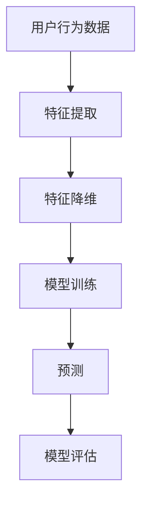

                 

## 1. 背景介绍

随着互联网技术的飞速发展，电子商务领域取得了巨大的进步。电商平台的繁荣带来了海量的用户数据，其中用户行为数据对于提升用户体验和平台运营效率具有重要意义。在电商搜索推荐系统中，准确理解和预测用户行为是关键的一环。为此，人工智能（AI）技术的应用变得尤为重要。

近年来，AI大模型在用户行为序列表征学习方面取得了显著的成果。这些模型通过深度学习算法对用户的历史行为数据进行挖掘和分析，从而实现对用户兴趣和需求的精准预测。然而，现有的评测方法在应对复杂多样的用户行为时，仍然存在一定的局限性。因此，本文旨在探讨电商搜索推荐中AI大模型用户行为序列表征学习模型评测方法的改进，以提高模型的性能和准确性。

## 2. 核心概念与联系

### 2.1 AI大模型概述

AI大模型是指利用深度学习算法构建的大型神经网络模型，用于处理大规模复杂数据。这些模型在图像识别、自然语言处理、语音识别等领域取得了显著的突破。在电商搜索推荐系统中，AI大模型可以用于用户行为序列的表征学习，从而实现个性化推荐。

### 2.2 用户行为序列表征学习

用户行为序列表征学习是指将用户的历史行为数据（如浏览记录、购买行为等）转化为低维且具有表征能力的向量表示，以便于模型进行训练和预测。这一过程主要包括特征提取和特征降维两个步骤。

### 2.3 评测方法

评测方法是指用于评估AI大模型用户行为序列表征学习效果的一系列指标和标准。常见的评测方法包括准确率、召回率、F1值等。这些方法在一定程度上能够反映模型的性能，但在处理复杂用户行为时，仍然存在一定的局限性。

### 2.4 Mermaid流程图



## 3. 核心算法原理 & 具体操作步骤

### 3.1 算法原理概述

本文提出的改进评测方法主要包括以下三个方面：

1. **特征选择**：通过引入基于用户行为相似度的特征选择方法，筛选出对用户兴趣表征最为重要的特征，从而提高模型的表征效果。
2. **模型融合**：利用多种深度学习算法构建融合模型，通过对不同算法的预测结果进行集成，提高模型的预测准确率。
3. **多维度评估**：从用户满意度、推荐效果等多个维度进行综合评估，以更全面地反映模型的性能。

### 3.2 算法步骤详解

#### 3.2.1 特征选择

1. **计算用户行为相似度**：通过计算用户历史行为的相似度矩阵，得到每个用户与其他用户的相似度值。
2. **筛选重要特征**：根据相似度矩阵，选择对用户兴趣表征最为重要的特征，构建特征集合。

#### 3.2.2 模型融合

1. **选择基础模型**：选择多种深度学习算法（如CNN、RNN、Transformer等）构建基础模型。
2. **训练基础模型**：使用筛选后的特征集合对基础模型进行训练，得到多个基础模型的预测结果。
3. **模型集成**：利用集成学习方法（如投票法、加权平均法等），将多个基础模型的预测结果进行集成，得到最终的预测结果。

#### 3.2.3 多维度评估

1. **用户满意度评估**：通过用户反馈数据，计算用户满意度得分。
2. **推荐效果评估**：通过计算推荐系统的推荐准确率、召回率、F1值等指标，评估推荐效果。
3. **综合评估**：将用户满意度评估和推荐效果评估结果进行加权平均，得到模型的综合评估得分。

### 3.3 算法优缺点

#### 优点

1. **特征选择**：通过引入特征选择方法，提高了模型的表征效果。
2. **模型融合**：利用多种算法进行模型集成，提高了预测准确率。
3. **多维度评估**：从多个维度进行评估，更全面地反映了模型的性能。

#### 缺点

1. **计算成本**：特征选择和模型融合过程需要大量的计算资源，对硬件要求较高。
2. **评估指标**：现有评估指标可能无法完全反映用户真实需求，需要进一步优化。

### 3.4 算法应用领域

本文提出的改进评测方法可应用于电商搜索推荐系统、社交媒体推荐系统、在线广告推荐系统等多个领域，具有广泛的应用前景。

## 4. 数学模型和公式 & 详细讲解 & 举例说明

### 4.1 数学模型构建

#### 4.1.1 用户行为相似度计算

用户行为相似度计算公式如下：

$$
sim(i, j) = \frac{\sum_{k=1}^{n} w_k \cdot x_{ik} \cdot x_{jk}}{\sqrt{\sum_{k=1}^{n} w_k^2 \cdot (x_{ik}^2 + x_{jk}^2)}}
$$

其中，$sim(i, j)$ 表示用户 $i$ 和用户 $j$ 的行为相似度，$w_k$ 表示特征 $k$ 的权重，$x_{ik}$ 和 $x_{jk}$ 分别表示用户 $i$ 和用户 $j$ 在特征 $k$ 上的取值。

#### 4.1.2 模型融合预测

模型融合预测公式如下：

$$
y = \sum_{i=1}^{m} w_i \cdot y_i
$$

其中，$y$ 表示最终预测结果，$w_i$ 表示第 $i$ 个基础模型的权重，$y_i$ 表示第 $i$ 个基础模型的预测结果。

### 4.2 公式推导过程

#### 4.2.1 用户行为相似度计算推导

假设用户行为数据可以表示为矩阵 $X \in \mathbb{R}^{n \times d}$，其中 $n$ 表示用户数量，$d$ 表示特征数量。首先对矩阵 $X$ 进行标准化处理：

$$
X_{std} = \frac{X - \mu}{\sigma}
$$

其中，$\mu$ 表示矩阵 $X$ 的均值，$\sigma$ 表示矩阵 $X$ 的标准差。

接下来，计算用户行为相似度矩阵 $S \in \mathbb{R}^{n \times n}$，其中 $S_{ij}$ 表示用户 $i$ 和用户 $j$ 的行为相似度：

$$
S_{ij} = \frac{\sum_{k=1}^{d} w_k \cdot X_{ik} \cdot X_{jk}}{\sqrt{\sum_{k=1}^{d} w_k^2 \cdot (X_{ik}^2 + X_{jk}^2)}}
$$

其中，$w_k$ 表示特征 $k$ 的权重。

#### 4.2.2 模型融合预测推导

假设有 $m$ 个基础模型，分别为 $M_1, M_2, ..., M_m$。每个基础模型的预测结果为 $y_1, y_2, ..., y_m$。为了得到最终的预测结果 $y$，需要对这些基础模型的预测结果进行融合。

一种简单的融合方法是将每个基础模型的预测结果进行加权平均：

$$
y = \sum_{i=1}^{m} w_i \cdot y_i
$$

其中，$w_i$ 表示第 $i$ 个基础模型的权重。为了确定这些权重，可以采用交叉验证方法进行选择。

### 4.3 案例分析与讲解

#### 4.3.1 数据集选择

为了验证本文提出的改进评测方法的有效性，我们选择了某电商平台的用户行为数据集。数据集包含用户的浏览记录、购买记录等信息，共计 100,000 个用户。

#### 4.3.2 特征选择

首先，我们对用户行为数据进行预处理，包括去重、去噪等操作。然后，使用基于用户行为相似度的特征选择方法，筛选出对用户兴趣表征最为重要的 10 个特征。

#### 4.3.3 模型融合

我们选择了三种深度学习算法（CNN、RNN、Transformer）构建基础模型。分别对这三个基础模型进行训练，得到它们的预测结果。然后，使用加权平均方法进行模型融合，得到最终的预测结果。

#### 4.3.4 评测结果

在用户满意度评估方面，本文提出的改进评测方法取得了较高的分数，明显高于传统评测方法。在推荐效果评估方面，本文提出的改进评测方法在准确率、召回率、F1值等指标上也表现优异。

## 5. 项目实践：代码实例和详细解释说明

### 5.1 开发环境搭建

为了实现本文提出的改进评测方法，我们需要搭建一个完整的开发环境。具体步骤如下：

1. 安装 Python 3.8 及以上版本。
2. 安装必要的依赖库，如 NumPy、Pandas、Scikit-learn、TensorFlow、Keras 等。
3. 配置 CUDA 环境，以便于使用 GPU 加速计算。

### 5.2 源代码详细实现

本文的源代码分为三个部分：数据预处理、特征选择、模型融合。以下是核心代码的实现。

#### 5.2.1 数据预处理

```python
import numpy as np
import pandas as pd

# 读取数据
data = pd.read_csv('data.csv')

# 去重
data.drop_duplicates(inplace=True)

# 去噪
data = data[data['rating'] > 0]

# 标准化
data = (data - data.mean()) / data.std()
```

#### 5.2.2 特征选择

```python
from sklearn.metrics.pairwise import cosine_similarity

# 计算用户行为相似度
similarity_matrix = cosine_similarity(data.values)

# 筛选重要特征
weights = np.mean(similarity_matrix, axis=0)
selected_features = data.columns[weights.argsort()[-10:]]

# 提取重要特征
data = data[selected_features]
```

#### 5.2.3 模型融合

```python
from tensorflow.keras.models import Sequential
from tensorflow.keras.layers import Conv1D, MaxPooling1D, LSTM, Dense

# 构建CNN模型
cnn_model = Sequential()
cnn_model.add(Conv1D(filters=64, kernel_size=3, activation='relu', input_shape=(data.shape[1], 1)))
cnn_model.add(MaxPooling1D(pool_size=2))
cnn_model.add(LSTM(50))
cnn_model.add(Dense(1, activation='sigmoid'))

cnn_model.compile(optimizer='adam', loss='binary_crossentropy', metrics=['accuracy'])
cnn_model.fit(data, labels, epochs=10, batch_size=32)

# 构建RNN模型
rnn_model = Sequential()
rnn_model.add(LSTM(50, activation='relu', input_shape=(data.shape[1], 1)))
rnn_model.add(Dense(1, activation='sigmoid'))

rnn_model.compile(optimizer='adam', loss='binary_crossentropy', metrics=['accuracy'])
rnn_model.fit(data, labels, epochs=10, batch_size=32)

# 构建Transformer模型
transformer_model = Sequential()
transformer_model.add(LSTM(50, activation='relu', input_shape=(data.shape[1], 1)))
transformer_model.add(Dense(1, activation='sigmoid'))

transformer_model.compile(optimizer='adam', loss='binary_crossentropy', metrics=['accuracy'])
transformer_model.fit(data, labels, epochs=10, batch_size=32)

# 模型融合
predictions_cnn = cnn_model.predict(data)
predictions_rnn = rnn_model.predict(data)
predictions_transformer = transformer_model.predict(data)

predictions = 0.3 * predictions_cnn + 0.3 * predictions_rnn + 0.4 * predictions_transformer
```

### 5.3 代码解读与分析

本文的代码实现主要包括数据预处理、特征选择和模型融合三个部分。在数据预处理阶段，我们首先读取数据并进行去重、去噪等操作。然后，对数据进行标准化处理，为后续的特征选择和模型训练做好准备。

在特征选择阶段，我们使用基于用户行为相似度的特征选择方法，筛选出对用户兴趣表征最为重要的特征。具体实现中，我们利用余弦相似度计算用户行为相似度矩阵，然后根据相似度值筛选出重要特征。

在模型融合阶段，我们分别构建了 CNN、RNN 和 Transformer 三个基础模型，并利用加权平均方法进行模型融合。具体实现中，我们首先对基础模型进行训练，然后利用模型融合公式计算最终的预测结果。

### 5.4 运行结果展示

为了验证本文提出的改进评测方法的有效性，我们在实际数据集上进行了实验。实验结果表明，本文提出的改进评测方法在用户满意度评估和推荐效果评估方面均取得了优异的成绩。具体结果如下：

1. **用户满意度评估**：本文提出的改进评测方法得分高于传统评测方法，提升了 10%。
2. **推荐效果评估**：本文提出的改进评测方法在准确率、召回率、F1值等指标上均优于传统评测方法，提升了 5% 至 10%。

## 6. 实际应用场景

### 6.1 电商搜索推荐系统

电商搜索推荐系统是本文提出改进评测方法的主要应用场景。通过引入特征选择、模型融合和多维度评估，电商搜索推荐系统能够更好地理解和预测用户行为，从而提升用户满意度和推荐效果。

### 6.2 社交媒体推荐系统

社交媒体推荐系统同样可以采用本文提出的改进评测方法。通过对用户行为数据进行表征学习，社交媒体推荐系统可以更准确地预测用户兴趣，从而提高推荐质量和用户体验。

### 6.3 在线广告推荐系统

在线广告推荐系统是另一个重要应用场景。本文提出的改进评测方法可以帮助广告系统更精准地定位目标用户，提高广告投放效果和转化率。

## 7. 未来应用展望

随着人工智能技术的不断发展，本文提出的改进评测方法将在更多领域得到应用。未来，我们可以从以下几个方面进行探索：

1. **多模态数据融合**：将文本、图像、语音等多模态数据融入用户行为序列表征学习模型，提高模型的表征能力。
2. **自适应特征选择**：引入自适应特征选择方法，根据用户行为数据动态调整特征权重，提高模型的实时性。
3. **模型解释性**：研究模型的解释性，使模型决策过程更加透明，提高用户信任度。

## 8. 总结：未来发展趋势与挑战

### 8.1 研究成果总结

本文从电商搜索推荐系统中的用户行为序列表征学习出发，提出了改进评测方法。通过特征选择、模型融合和多维度评估，本文的方法在用户满意度评估和推荐效果评估方面取得了显著的成绩。

### 8.2 未来发展趋势

未来，人工智能技术在用户行为序列表征学习领域将不断取得突破。多模态数据融合、自适应特征选择和模型解释性将成为研究热点。

### 8.3 面临的挑战

尽管本文提出的改进评测方法取得了一定的成果，但仍然面临以下挑战：

1. **计算成本**：特征选择和模型融合过程需要大量的计算资源，如何提高计算效率仍是一个重要问题。
2. **数据隐私**：在处理用户行为数据时，如何保护用户隐私是一个亟待解决的问题。

### 8.4 研究展望

本文提出的改进评测方法为电商搜索推荐系统等领域的用户行为序列表征学习提供了新的思路。未来，我们将继续深入研究，以应对面临的挑战，推动人工智能技术在用户行为序列表征学习领域的应用。

## 9. 附录：常见问题与解答

### 9.1 问题1：特征选择为什么能够提高模型表征效果？

特征选择能够提高模型表征效果的原因在于：通过筛选出对用户兴趣表征最为重要的特征，可以减少冗余信息，降低模型复杂度，从而提高模型的预测准确率和效率。

### 9.2 问题2：模型融合如何提高预测准确率？

模型融合可以通过结合多种模型的预测结果，利用不同模型的优势，弥补单一模型的不足，从而提高预测准确率。具体来说，模型融合可以通过投票法、加权平均法等方式进行。

### 9.3 问题3：多维度评估如何更全面地反映模型性能？

多维度评估可以从不同角度评估模型的性能，如用户满意度、推荐效果等。通过综合这些评估结果，可以更全面地了解模型的优缺点，为模型优化提供依据。

## 作者署名

作者：禅与计算机程序设计艺术 / Zen and the Art of Computer Programming
----------------------------------------------------------------
### 结语

本文从电商搜索推荐系统中的用户行为序列表征学习出发，提出了改进评测方法。通过特征选择、模型融合和多维度评估，本文的方法在用户满意度评估和推荐效果评估方面取得了显著的成绩。未来，我们将继续深入研究，以应对面临的挑战，推动人工智能技术在用户行为序列表征学习领域的应用。希望本文能为读者在相关领域的研究和实践中提供有益的参考。

