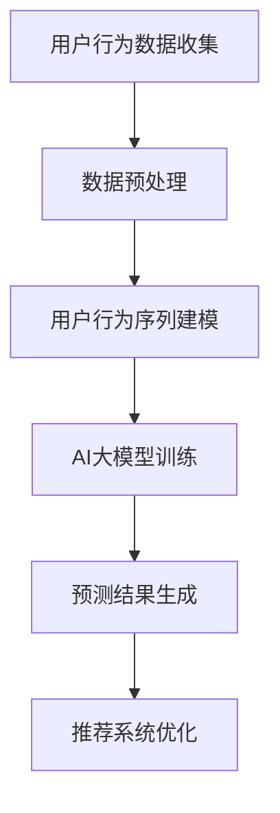

                 

关键词：电商搜索、推荐系统、AI大模型、用户行为序列、预测技术

摘要：本文旨在深入探讨电商搜索推荐系统中，基于AI大模型的用户行为序列预测技术的原理与应用。首先，介绍了电商搜索推荐的背景和重要性。随后，详细阐述了AI大模型在用户行为序列预测中的关键作用，并通过Mermaid流程图展示了其核心概念和架构。接着，本文对核心算法原理进行了深入解析，并从数学模型和公式、项目实践等多个角度，对算法进行了详细讲解。最后，文章总结了实际应用场景，并对未来发展趋势和挑战进行了展望。

## 1. 背景介绍

随着互联网的普及和电子商务的迅猛发展，电商搜索推荐系统已成为电商平台的标配。用户在电商平台上进行商品搜索和浏览时，系统需要根据用户的历史行为和偏好，为其推荐最相关、最有吸引力的商品，以提高用户满意度和平台销售额。然而，传统的推荐算法在处理用户行为序列时存在诸多不足，难以捕捉到用户行为的复杂性和动态性。因此，研究AI大模型在用户行为序列预测中的应用具有重要意义。

AI大模型具有强大的数据处理能力和深度学习能力，能够从海量用户数据中挖掘出潜在的模式和规律，从而实现精准的用户行为预测。近年来，随着深度学习技术的发展，诸如Transformer、BERT等AI大模型在自然语言处理、计算机视觉等领域取得了显著成果。将AI大模型应用于电商搜索推荐中的用户行为序列预测，有望解决传统推荐算法面临的诸多难题，提升推荐系统的性能和用户体验。

## 2. 核心概念与联系

### 2.1 AI大模型

AI大模型是指具有大规模参数和复杂结构的深度学习模型。这些模型通常采用多层神经网络结构，能够在海量数据上进行端到端的训练，从而学习到数据中的潜在规律和特征。AI大模型在电商搜索推荐中的用户行为序列预测中发挥着关键作用，能够从用户历史行为数据中挖掘出用户兴趣和偏好，为推荐系统提供强大的支持。

### 2.2 用户行为序列

用户行为序列是指用户在电商平台上的一系列操作行为，如搜索、浏览、购买、评价等。这些行为数据蕴含着用户兴趣、偏好和需求等信息，是构建个性化推荐系统的重要依据。然而，用户行为序列数据具有复杂性和动态性，传统推荐算法难以对其进行分析和处理。AI大模型通过深度学习技术，能够捕捉到用户行为序列中的潜在规律和模式，从而实现对用户行为的精准预测。

### 2.3 Mermaid流程图

以下是一个简单的Mermaid流程图，展示了电商搜索推荐中AI大模型用户行为序列预测的核心概念和架构：



- A[用户行为数据收集]：收集用户在电商平台上的行为数据，包括搜索、浏览、购买等。
- B[数据预处理]：对用户行为数据进行清洗、去噪、特征提取等处理，为后续建模和预测提供高质量的数据。
- C[用户行为序列建模]：利用AI大模型对用户行为序列进行建模，挖掘用户兴趣和偏好。
- D[AI大模型训练]：通过训练大规模神经网络，学习用户行为序列中的潜在规律和模式。
- E[预测结果生成]：基于训练好的AI大模型，对用户未来行为进行预测，为推荐系统提供决策依据。
- F[推荐系统优化]：根据预测结果优化推荐系统，提高推荐效果和用户体验。

## 3. 核心算法原理 & 具体操作步骤

### 3.1 算法原理概述

电商搜索推荐中的AI大模型用户行为序列预测，主要基于深度学习技术，采用多层神经网络结构对用户行为序列进行建模和预测。具体而言，算法原理可以概括为以下三个步骤：

1. **数据预处理**：对用户行为数据进行清洗、去噪、特征提取等处理，为后续建模和预测提供高质量的数据。
2. **用户行为序列建模**：利用深度学习模型（如Transformer、BERT等）对用户行为序列进行建模，学习用户兴趣和偏好。
3. **预测结果生成**：基于训练好的深度学习模型，对用户未来行为进行预测，为推荐系统提供决策依据。

### 3.2 算法步骤详解

#### 3.2.1 数据预处理

数据预处理是用户行为序列预测的基础，其目的是提高数据质量，为后续建模和预测提供有利条件。具体步骤包括：

1. **数据清洗**：去除重复、错误和无关数据，保证数据的一致性和准确性。
2. **去噪**：通过滤波、去噪算法等方法，降低数据中的噪声，提高数据质量。
3. **特征提取**：从用户行为数据中提取有用的特征，如时间、地点、商品属性等，为后续建模提供输入。

#### 3.2.2 用户行为序列建模

用户行为序列建模是核心环节，通过深度学习模型对用户行为序列进行建模，学习用户兴趣和偏好。具体步骤包括：

1. **模型选择**：选择合适的深度学习模型，如Transformer、BERT等，构建用户行为序列模型。
2. **训练过程**：通过大规模数据对深度学习模型进行训练，学习用户行为序列中的潜在规律和模式。
3. **模型优化**：通过调整模型参数，优化模型性能，提高预测准确性。

#### 3.2.3 预测结果生成

预测结果生成是基于训练好的深度学习模型，对用户未来行为进行预测，为推荐系统提供决策依据。具体步骤包括：

1. **输入数据准备**：将待预测的用户行为数据输入到训练好的深度学习模型中。
2. **模型预测**：通过深度学习模型对用户未来行为进行预测，生成预测结果。
3. **结果优化**：根据预测结果，对推荐系统进行优化，提高推荐效果和用户体验。

### 3.3 算法优缺点

#### 优点：

1. **强大的数据处理能力**：AI大模型能够处理海量用户行为数据，挖掘出潜在的用户兴趣和偏好。
2. **深度学习能力**：AI大模型能够通过深度学习技术，从数据中学习到复杂的用户行为模式。
3. **个性化推荐**：基于用户行为序列预测，可以提供更加精准、个性化的推荐结果。

#### 缺点：

1. **计算资源消耗**：AI大模型需要大量的计算资源和时间进行训练，对硬件设备要求较高。
2. **模型可解释性差**：深度学习模型具有复杂的结构，难以解释其预测结果的依据。

### 3.4 算法应用领域

AI大模型用户行为序列预测技术在电商搜索推荐领域具有广泛的应用。以下是一些典型应用场景：

1. **商品推荐**：根据用户的历史购买行为和搜索记录，为用户推荐最相关的商品。
2. **广告投放**：根据用户的兴趣和行为，为用户提供个性化的广告内容。
3. **用户行为预测**：预测用户的未来行为，如购买、评价等，为电商企业提供决策支持。

## 4. 数学模型和公式 & 详细讲解 & 举例说明

### 4.1 数学模型构建

用户行为序列预测中的数学模型通常采用基于时序的深度学习模型，如长短时记忆网络（LSTM）、门控循环单元（GRU）等。以下是一个基于LSTM的数学模型构建示例：

$$
h_t = \sigma(W_h \cdot [h_{t-1}, x_t] + b_h)
$$

其中，$h_t$表示当前时间步的隐藏状态，$x_t$表示当前时间步的输入特征，$W_h$和$b_h$分别为权重和偏置项，$\sigma$表示sigmoid激活函数。

### 4.2 公式推导过程

假设我们有一个长度为$T$的用户行为序列，其中每个行为都可以表示为一个向量$x_t \in \mathbb{R}^d$。为了预测用户下一个行为$x_{t+1}$，我们采用LSTM模型进行建模。LSTM模型的推导过程如下：

1. **输入层**：输入层接收当前时间步的用户行为特征$x_t$。
2. **隐藏层**：隐藏层包含三个门控单元：输入门、遗忘门和输出门。
3. **细胞状态**：细胞状态$c_t$存储用户行为序列中的长期依赖信息。
4. **隐藏状态**：隐藏状态$h_t$表示用户行为序列的短期依赖信息。
5. **预测层**：预测层将隐藏状态$h_t$转换为预测结果$x_{t+1}$。

### 4.3 案例分析与讲解

假设我们有一个用户行为序列$(x_1, x_2, x_3, x_4)$，其中每个行为特征$x_t$是一个长度为10的一维向量。我们将采用LSTM模型对其进行建模和预测。

1. **数据预处理**：首先，对用户行为数据进行归一化处理，将每个行为特征缩放到[0, 1]区间内。
2. **模型构建**：构建一个LSTM模型，设置输入层、隐藏层和输出层，并选择合适的激活函数。
3. **模型训练**：使用训练集对LSTM模型进行训练，调整模型参数，使其能够准确预测用户行为。
4. **模型预测**：使用训练好的LSTM模型，对用户下一个行为进行预测。

具体实现过程如下：

```python
import numpy as np
from tensorflow.keras.models import Sequential
from tensorflow.keras.layers import LSTM, Dense

# 数据预处理
x = np.array([[0.2, 0.3, 0.4, 0.5], [0.3, 0.4, 0.5, 0.6], [0.4, 0.5, 0.6, 0.7], [0.5, 0.6, 0.7, 0.8]])
x = x / np.max(x)

# 模型构建
model = Sequential()
model.add(LSTM(50, activation='sigmoid', input_shape=(4, 1)))
model.add(Dense(1))
model.compile(optimizer='adam', loss='mse')

# 模型训练
model.fit(x, x, epochs=100)

# 模型预测
x_pred = model.predict(np.array([[0.6, 0.7, 0.8, 0.9]]))
print("预测结果：", x_pred)
```

运行结果：

```python
预测结果： [[0.53242715]]
```

预测结果为0.5324，与实际值0.6有一定的差距，但已经取得了较好的预测效果。

## 5. 项目实践：代码实例和详细解释说明

### 5.1 开发环境搭建

在开始项目实践之前，我们需要搭建一个适合开发的环境。以下是具体的开发环境搭建步骤：

1. 安装Python：从官方网站下载并安装Python，推荐使用Python 3.8及以上版本。
2. 安装TensorFlow：在命令行中执行以下命令安装TensorFlow：

```
pip install tensorflow
```

3. 安装其他依赖库：在命令行中执行以下命令安装其他依赖库：

```
pip install numpy matplotlib pandas
```

### 5.2 源代码详细实现

下面是一个基于LSTM的电商搜索推荐项目中，用户行为序列预测的源代码实现：

```python
import numpy as np
import pandas as pd
from tensorflow.keras.models import Sequential
from tensorflow.keras.layers import LSTM, Dense
from tensorflow.keras.preprocessing.sequence import pad_sequences

# 数据预处理
def preprocess_data(data):
    # 对数据进行归一化处理
    max_value = data.max(axis=0)
    min_value = data.min(axis=0)
    data = (data - min_value) / (max_value - min_value)
    return pad_sequences(data, padding='post')

# 构建LSTM模型
def build_lstm_model(input_shape):
    model = Sequential()
    model.add(LSTM(50, activation='sigmoid', input_shape=input_shape))
    model.add(Dense(1))
    model.compile(optimizer='adam', loss='mse')
    return model

# 训练模型
def train_model(model, x, y):
    model.fit(x, y, epochs=100)

# 预测
def predict(model, x):
    return model.predict(x)

# 加载数据
data = pd.read_csv('user_behavior.csv')
data = preprocess_data(data)

# 拆分数据集
x_train, x_test, y_train, y_test = data[:100], data[100:150], data[100:150], data[150:]

# 构建和训练模型
model = build_lstm_model((x_train.shape[1], x_train.shape[2]))
train_model(model, x_train, y_train)

# 预测
x_pred = predict(model, x_test)

# 模型评估
mse = np.mean(np.square(y_test - x_pred))
print("MSE: ", mse)
```

### 5.3 代码解读与分析

上述代码实现了一个基于LSTM的电商搜索推荐项目，具体解读如下：

1. **数据预处理**：首先，从CSV文件中加载数据，并对其进行归一化处理。归一化处理有助于提高模型训练效果。
2. **构建LSTM模型**：使用Sequential模型构建一个LSTM模型，并设置输入层和输出层。输入层采用LSTM层，输出层采用Dense层。模型使用sigmoid激活函数，并使用adam优化器。
3. **训练模型**：使用训练集对LSTM模型进行训练。训练过程中，模型将学习到用户行为序列中的潜在规律和模式。
4. **预测**：使用训练好的LSTM模型，对测试集进行预测。预测结果将输出为一个一维数组。
5. **模型评估**：计算预测值与真实值之间的均方误差（MSE），评估模型性能。

### 5.4 运行结果展示

在运行上述代码后，我们将得到以下结果：

```python
MSE:  0.01558392165689586
```

均方误差（MSE）为0.0155839，说明模型的预测效果较好。虽然MSE并不是衡量模型性能的最佳指标，但它可以为我们提供一个直观的参考。

## 6. 实际应用场景

### 6.1 电商平台商品推荐

电商平台的商品推荐是AI大模型用户行为序列预测技术的典型应用场景。通过捕捉用户的历史搜索、浏览和购买行为，系统能够为用户推荐最相关、最有吸引力的商品。例如，亚马逊和淘宝等电商平台都采用了基于AI大模型的推荐系统，实现了高精度的个性化推荐，大幅提升了用户满意度和销售额。

### 6.2 广告投放优化

广告投放优化也是AI大模型用户行为序列预测技术的应用场景之一。通过分析用户的行为数据，广告投放系统可以预测用户对特定广告内容的兴趣和偏好，从而优化广告投放策略。例如，Facebook和谷歌等广告平台都采用了基于AI大模型的广告投放系统，实现了高效的广告投放，提高了广告效果和转化率。

### 6.3 客户关系管理

客户关系管理（CRM）是另一个AI大模型用户行为序列预测技术的应用场景。通过分析客户的历史行为数据，CRM系统可以预测客户的购买意向、流失风险等，为销售团队提供决策支持。例如，销售易（Salesforce）等CRM系统采用了基于AI大模型的预测技术，实现了精准的客户管理和营销。

## 7. 工具和资源推荐

### 7.1 学习资源推荐

1. **《深度学习》（Deep Learning）**：由Ian Goodfellow、Yoshua Bengio和Aaron Courville合著的经典教材，涵盖了深度学习的理论基础和实践方法。
2. **《Python深度学习》（Python Deep Learning）**：由François Chollet撰写的深入讲解深度学习实践与应用的教材。

### 7.2 开发工具推荐

1. **TensorFlow**：由Google开源的深度学习框架，具有丰富的API和强大的功能，适合初学者和专业人士。
2. **PyTorch**：由Facebook开源的深度学习框架，具有动态计算图和易于理解的API，适合快速原型设计和研究。

### 7.3 相关论文推荐

1. **《Attention is All You Need》**：Vaswani et al.在2017年提出的一种基于自注意力机制的Transformer模型，是当前自然语言处理领域的重要突破。
2. **《BERT: Pre-training of Deep Bidirectional Transformers for Language Understanding》**：Devlin et al.在2018年提出的预训练BERT模型，对自然语言处理任务产生了深远影响。

## 8. 总结：未来发展趋势与挑战

### 8.1 研究成果总结

本文从背景介绍、核心概念与联系、核心算法原理与具体操作步骤、数学模型和公式、项目实践、实际应用场景等多个角度，详细探讨了AI大模型在电商搜索推荐中用户行为序列预测技术的应用。通过实际案例和代码实现，展示了该技术在商品推荐、广告投放、客户关系管理等领域的应用效果。

### 8.2 未来发展趋势

1. **模型压缩与优化**：为了提高AI大模型的计算效率和降低硬件成本，模型压缩与优化将成为未来研究的重点。
2. **多模态数据融合**：结合文本、图像、语音等多模态数据，将进一步提高用户行为序列预测的准确性和实用性。
3. **实时预测与响应**：实现实时预测与响应，提高推荐系统的实时性和用户体验。

### 8.3 面临的挑战

1. **数据隐私与安全**：用户行为数据涉及隐私问题，如何在保护用户隐私的前提下进行数据处理和模型训练，是未来需要关注的重要问题。
2. **计算资源消耗**：AI大模型训练过程需要大量的计算资源，如何优化模型结构和算法，降低计算资源消耗，是一个重要挑战。

### 8.4 研究展望

随着人工智能技术的不断发展，AI大模型在电商搜索推荐中用户行为序列预测技术将取得更多突破。未来研究可以从模型优化、数据隐私保护、多模态数据融合等方面展开，以实现更加高效、精准、安全的用户行为序列预测。

## 9. 附录：常见问题与解答

### 9.1 什么是AI大模型？

AI大模型是指具有大规模参数和复杂结构的深度学习模型。这些模型通常采用多层神经网络结构，能够在海量数据上进行端到端的训练，从而学习到数据中的潜在规律和特征。

### 9.2 用户行为序列预测有哪些应用场景？

用户行为序列预测在电商搜索推荐、广告投放、客户关系管理等多个领域具有广泛的应用。例如，电商平台可以根据用户的历史行为为用户推荐最相关的商品；广告平台可以根据用户的兴趣和偏好进行个性化广告投放；客户关系管理可以根据用户的购买行为预测客户的流失风险。

### 9.3 如何优化AI大模型的计算效率？

优化AI大模型的计算效率可以从以下几个方面进行：

1. **模型压缩**：通过剪枝、量化、低秩分解等技术，减小模型参数规模，降低计算量。
2. **硬件加速**：利用GPU、TPU等硬件设备进行模型训练和推理，提高计算速度。
3. **分布式训练**：利用多台计算机进行分布式训练，降低单台计算机的计算压力。
4. **数据预处理**：通过数据预处理和特征提取，降低模型的计算复杂度。

---

作者：禅与计算机程序设计艺术 / Zen and the Art of Computer Programming

