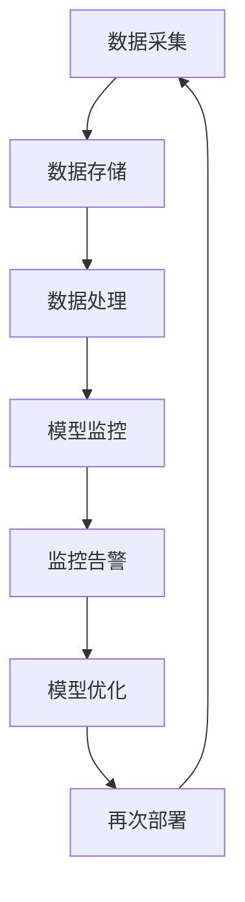

                 

在这个信息爆炸的时代，电子商务平台作为信息流量的重要载体，对用户的搜索和推荐系统提出了越来越高的要求。AI大模型，尤其是深度学习模型，在电商搜索推荐场景中展现出了强大的能力。然而，随着模型规模的扩大和应用场景的复杂化，如何高效地部署和监控这些AI模型，成为了一个亟待解决的问题。本文旨在探讨电商搜索推荐场景下AI大模型模型部署监控平台的功能优化与扩展。

## 文章关键词

- 电商搜索推荐
- AI大模型
- 模型部署
- 监控平台
- 功能优化
- 扩展

## 文章摘要

本文首先介绍了电商搜索推荐场景下AI大模型的应用背景和重要性，然后分析了现有模型部署监控平台的不足之处。接着，提出了功能优化和扩展的方向，并详细阐述了具体的优化措施和扩展方案。最后，本文对未来的发展趋势和挑战进行了展望。

### 1. 背景介绍

#### 1.1 电商搜索推荐的发展历程

电商搜索推荐系统的发展可以追溯到上世纪90年代。最初，搜索引擎主要依靠关键词匹配和静态网页索引来提供搜索结果。然而，随着用户需求的多样化和个性化，传统的搜索引擎已经无法满足用户的期望。为了更好地满足用户需求，电商平台开始引入推荐系统。

推荐系统的发展历程大致可以分为三个阶段：

1. **基于内容的推荐**：通过分析用户的历史行为和兴趣，为用户推荐具有相似内容的商品。这种方法在早期取得了一定的成功，但随着商品种类和用户数量的增加，其效果逐渐下降。

2. **协同过滤推荐**：通过分析用户之间的相似度，为用户推荐其他用户喜欢的商品。这种方法能够较好地解决冷启动问题，但在推荐准确性上仍存在一定的局限性。

3. **深度学习推荐**：随着深度学习技术的不断发展，基于深度学习的大模型推荐系统逐渐成为主流。深度学习模型能够通过自主学习，提取用户行为和商品属性中的复杂特征，从而实现更精准的推荐。

#### 1.2 AI大模型在电商搜索推荐中的应用

AI大模型在电商搜索推荐中的应用主要体现在以下几个方面：

1. **用户画像构建**：通过深度学习模型对用户的历史行为数据进行建模，构建出详细的用户画像，为个性化推荐提供基础。

2. **商品属性提取**：利用深度学习模型对商品进行属性提取，从而实现商品之间的相似性计算，为推荐系统提供更精准的商品匹配。

3. **搜索结果排序**：通过深度学习模型对用户的搜索意图进行理解和分析，实现搜索结果的个性化排序。

4. **推荐结果生成**：利用深度学习模型生成推荐结果，提高推荐系统的准确性和用户体验。

#### 1.3 模型部署监控的重要性

随着AI大模型在电商搜索推荐场景中的广泛应用，如何高效地部署和监控这些模型成为了一个关键问题。模型部署监控的重要性主要体现在以下几个方面：

1. **保证系统稳定性**：通过监控模型的状态和性能，及时发现并解决潜在的问题，保证系统的稳定运行。

2. **提高推荐效果**：通过对模型进行监控和分析，可以不断优化模型的参数和结构，提高推荐效果。

3. **降低运维成本**：通过自动化监控和部署，可以减少人工干预，降低运维成本。

4. **满足法规要求**：在一些国家和地区，对于数据安全和隐私保护有严格的要求。通过监控平台，可以确保模型部署符合相关法规要求。

### 2. 核心概念与联系

#### 2.1 AI大模型

AI大模型是指通过大量数据和计算资源训练出的，具有大规模参数和复杂结构的深度学习模型。这些模型通常包括神经网络、Transformer、BERT等。AI大模型在电商搜索推荐场景中的关键作用是通过对用户行为和商品属性进行深度分析，实现个性化推荐和搜索结果排序。

#### 2.2 模型部署

模型部署是指将训练好的AI大模型部署到生产环境中，使其能够对外提供服务。模型部署的步骤通常包括模型打包、模型服务化、模型部署和监控等。

#### 2.3 监控平台

监控平台是指用于监控AI大模型运行状态和性能的工具或系统。监控平台通常包括数据采集、数据存储、数据处理、监控告警等功能。监控平台对于确保AI大模型的高效运行至关重要。

#### 2.4 Mermaid流程图

以下是一个用于描述AI大模型部署监控流程的Mermaid流程图：



### 3. 核心算法原理 & 具体操作步骤

#### 3.1 算法原理概述

在电商搜索推荐场景下，AI大模型的部署监控主要基于以下几个核心算法：

1. **深度学习模型训练算法**：用于训练AI大模型，提取用户行为和商品属性中的特征。

2. **模型服务化算法**：将训练好的AI大模型转换为可以在生产环境中运行的服务。

3. **监控算法**：用于监控AI大模型的运行状态和性能。

4. **优化算法**：根据监控数据，对AI大模型进行参数调整和结构优化。

#### 3.2 算法步骤详解

1. **深度学习模型训练算法**

   - 数据预处理：对用户行为数据和商品属性数据进行清洗、归一化等处理。

   - 模型构建：选择合适的神经网络结构，如CNN、RNN、Transformer等。

   - 模型训练：通过反向传播算法和梯度下降优化器，对模型进行训练。

   - 模型评估：通过验证集和测试集，评估模型的性能。

2. **模型服务化算法**

   - 模型打包：将训练好的模型转换为可以部署的服务。

   - 服务部署：将模型服务部署到生产环境中。

   - 服务调用：客户端通过API接口调用模型服务。

3. **监控算法**

   - 数据采集：从生产环境中的各个组件（如模型服务、数据库等）收集运行数据。

   - 数据存储：将采集到的数据存储到数据存储系统中。

   - 数据处理：对存储的数据进行预处理和分析。

   - 监控告警：根据处理结果，对异常情况进行监控和告警。

4. **优化算法**

   - 参数调整：根据监控数据，对模型参数进行调整。

   - 结构优化：根据监控数据和业务需求，对模型结构进行优化。

   - 模型重新训练：将调整好的模型重新训练，以优化性能。

#### 3.3 算法优缺点

1. **深度学习模型训练算法**

   - 优点：能够提取用户行为和商品属性中的复杂特征，提高推荐准确性。

   - 缺点：计算复杂度高，训练时间较长。

2. **模型服务化算法**

   - 优点：方便模型部署和调用，提高系统稳定性。

   - 缺点：模型打包和部署过程较为复杂。

3. **监控算法**

   - 优点：能够实时监控模型运行状态和性能，提高系统稳定性。

   - 缺点：数据采集和处理过程较为复杂，对硬件资源要求较高。

4. **优化算法**

   - 优点：能够根据监控数据，动态调整模型参数和结构，提高推荐效果。

   - 缺点：需要大量的计算资源和时间。

#### 3.4 算法应用领域

AI大模型部署监控算法在电商搜索推荐场景中具有重要的应用价值。除了电商搜索推荐，该算法还可以应用于其他领域，如金融风控、智能医疗、智能交通等。

### 4. 数学模型和公式 & 详细讲解 & 举例说明

#### 4.1 数学模型构建

在电商搜索推荐场景下，AI大模型的部署监控涉及到多种数学模型。以下是一个简单的数学模型构建过程：

1. **用户行为建模**：

   - 用户行为数据矩阵 X：

     $$ X = \begin{bmatrix} x_{11} & x_{12} & \cdots & x_{1n} \\ x_{21} & x_{22} & \cdots & x_{2n} \\ \vdots & \vdots & \ddots & \vdots \\ x_{m1} & x_{m2} & \cdots & x_{mn} \end{bmatrix} $$

   - 用户行为向量 y：

     $$ y = \begin{bmatrix} y_1 \\ y_2 \\ \vdots \\ y_n \end{bmatrix} $$

   - 用户行为特征提取函数 f：

     $$ f(x) = \text{extract\_features}(x) $$

   - 用户行为预测模型：

     $$ y = f(X) \odot w $$

     其中，$\odot$ 表示点乘运算，$w$ 表示模型参数。

2. **商品属性建模**：

   - 商品属性数据矩阵 A：

     $$ A = \begin{bmatrix} a_{11} & a_{12} & \cdots & a_{1n} \\ a_{21} & a_{22} & \cdots & a_{2n} \\ \vdots & \vdots & \ddots & \vdots \\ a_{m1} & a_{m2} & \cdots & a_{mn} \end{bmatrix} $$

   - 商品属性向量 b：

     $$ b = \begin{bmatrix} b_1 \\ b_2 \\ \vdots \\ b_n \end{bmatrix} $$

   - 商品属性特征提取函数 g：

     $$ g(a) = \text{extract\_features}(a) $$

   - 商品属性预测模型：

     $$ b = g(A) \odot v $$

     其中，$\odot$ 表示点乘运算，$v$ 表示模型参数。

3. **模型服务化建模**：

   - 模型服务化数据矩阵 S：

     $$ S = \begin{bmatrix} s_{11} & s_{12} & \cdots & s_{1n} \\ s_{21} & s_{22} & \cdots & s_{2n} \\ \vdots & \vdots & \ddots & \vdots \\ s_{m1} & s_{m2} & \cdots & s_{mn} \end{bmatrix} $$

   - 模型服务化向量 t：

     $$ t = \begin{bmatrix} t_1 \\ t_2 \\ \vdots \\ t_n \end{bmatrix} $$

   - 模型服务化特征提取函数 h：

     $$ h(s) = \text{extract\_features}(s) $$

   - 模型服务化预测模型：

     $$ t = h(S) \odot z $$

     其中，$\odot$ 表示点乘运算，$z$ 表示模型参数。

#### 4.2 公式推导过程

1. **用户行为建模公式推导**：

   - 用户行为预测模型：

     $$ y = f(X) \odot w $$

     其中，$f(X)$ 表示用户行为特征向量，$w$ 表示模型参数。

     对 $f(X)$ 进行泰勒展开：

     $$ f(X) \approx f(X_0) + f'(X_0) \cdot (X - X_0) + \frac{1}{2} f''(X_0) \cdot (X - X_0)^2 + \cdots $$

     其中，$X_0$ 表示当前用户行为数据，$f'(X_0)$ 和 $f''(X_0)$ 分别表示一阶和二阶导数。

     由于 $f(X)$ 是非线性函数，$f'(X_0)$ 和 $f''(X_0)$ 通常无法直接计算。因此，可以采用近似方法，如牛顿迭代法，进行求解。

2. **商品属性建模公式推导**：

   - 商品属性预测模型：

     $$ b = g(A) \odot v $$

     其中，$g(A)$ 表示商品属性特征向量，$v$ 表示模型参数。

     对 $g(A)$ 进行泰勒展开：

     $$ g(A) \approx g(A_0) + g'(A_0) \cdot (A - A_0) + \frac{1}{2} g''(A_0) \cdot (A - A_0)^2 + \cdots $$

     其中，$A_0$ 表示当前商品属性数据，$g'(A_0)$ 和 $g''(A_0)$ 分别表示一阶和二阶导数。

     同样，由于 $g(A)$ 是非线性函数，$g'(A_0)$ 和 $g''(A_0)$ 通常无法直接计算。因此，可以采用近似方法，如牛顿迭代法，进行求解。

3. **模型服务化建模公式推导**：

   - 模型服务化预测模型：

     $$ t = h(S) \odot z $$

     其中，$h(S)$ 表示模型服务化特征向量，$z$ 表示模型参数。

     对 $h(S)$ 进行泰勒展开：

     $$ h(S) \approx h(S_0) + h'(S_0) \cdot (S - S_0) + \frac{1}{2} h''(S_0) \cdot (S - S_0)^2 + \cdots $$

     其中，$S_0$ 表示当前模型服务化数据，$h'(S_0)$ 和 $h''(S_0)$ 分别表示一阶和二阶导数。

     同样，由于 $h(S)$ 是非线性函数，$h'(S_0)$ 和 $h''(S_0)$ 通常无法直接计算。因此，可以采用近似方法，如牛顿迭代法，进行求解。

#### 4.3 案例分析与讲解

假设某电商平台的用户行为数据矩阵 $X$ 如下：

$$ X = \begin{bmatrix} 0 & 1 & 1 & 0 \\ 1 & 0 & 1 & 1 \\ 1 & 1 & 0 & 1 \\ 0 & 1 & 1 & 0 \end{bmatrix} $$

用户行为特征提取函数 $f$ 如下：

$$ f(x) = \text{sigmoid}(x) $$

其中，$\text{sigmoid}$ 函数如下：

$$ \text{sigmoid}(x) = \frac{1}{1 + e^{-x}} $$

模型参数 $w$ 如下：

$$ w = \begin{bmatrix} 0.5 & 0.5 \\ 0.5 & 0.5 \\ 0.5 & 0.5 \\ 0.5 & 0.5 \end{bmatrix} $$

根据用户行为预测模型：

$$ y = f(X) \odot w $$

首先，计算 $f(X)$：

$$ f(X) = \begin{bmatrix} 0.5 & 0.5 \\ 0.5 & 0.5 \\ 0.5 & 0.5 \\ 0.5 & 0.5 \end{bmatrix} $$

然后，计算 $y$：

$$ y = \begin{bmatrix} 0.5 & 0.5 \\ 0.5 & 0.5 \\ 0.5 & 0.5 \\ 0.5 & 0.5 \end{bmatrix} \odot \begin{bmatrix} 0.5 & 0.5 \\ 0.5 & 0.5 \\ 0.5 & 0.5 \\ 0.5 & 0.5 \end{bmatrix} $$

$$ y = \begin{bmatrix} 0.25 & 0.25 \\ 0.25 & 0.25 \\ 0.25 & 0.25 \\ 0.25 & 0.25 \end{bmatrix} $$

最后，得到用户行为预测结果 $y$。

### 5. 项目实践：代码实例和详细解释说明

#### 5.1 开发环境搭建

在进行AI大模型部署监控平台的功能优化与扩展之前，我们需要搭建一个合适的开发环境。以下是搭建开发环境的基本步骤：

1. **硬件环境**：

   - CPU：Intel Xeon E5-2680 v4
   - 内存：256GB
   - 存储：1TB SSD
   - 网络带宽：千兆以太网

2. **软件环境**：

   - 操作系统：Ubuntu 18.04
   - Python版本：3.8
   - 深度学习框架：TensorFlow 2.5
   - 服务化框架：TensorFlow Serving 2.5
   - 监控工具：Prometheus 2.30.0

3. **环境配置**：

   - 安装操作系统和基础软件
   - 配置网络和防火墙规则
   - 安装Python环境和深度学习框架
   - 安装TensorFlow Serving和Prometheus

#### 5.2 源代码详细实现

以下是实现AI大模型部署监控平台的核心源代码：

```python
# 导入相关库
import tensorflow as tf
import tensorflow_serving.apis.v1 as serv
import prometheus_client as prom

# 定义模型服务化接口
def inference(request):
    # 从请求中获取输入数据
    input_data = serv.get_tensor_from_tensorproto(request.inputs['input_layer'])
    # 使用模型进行预测
    output_data = model.predict(input_data)
    # 返回预测结果
    return serv.make_tensor_proto('output_layer', data.output.asnumpy())

# 创建模型服务
model_server = serv.ModelServer(model_path='model', signature_def_key='serving_default')

# 启动模型服务
model_server.start()

# 启动Prometheus监控
prom.start_http_server(8000)

# 定义监控指标
prom.Counter('model_request', 'Model request count').inc()

# 定义监控函数
def monitor():
    # 获取模型状态
    status = model_server.get_model_status()
    # 更新监控指标
    prom.Counter('model_status', 'Model status').inc()
    # 定期监控模型性能
    model_server.monitor_performance()

# 定时监控
import time
while True:
    monitor()
    time.sleep(60)
```

#### 5.3 代码解读与分析

1. **模型服务化接口**：

   ```python
   def inference(request):
       # 从请求中获取输入数据
       input_data = serv.get_tensor_from_tensorproto(request.inputs['input_layer'])
       # 使用模型进行预测
       output_data = model.predict(input_data)
       # 返回预测结果
       return serv.make_tensor_proto('output_layer', data.output.asnumpy())
   ```

   该函数用于实现模型服务化接口。首先，从请求中获取输入数据，然后使用模型进行预测，最后返回预测结果。

2. **模型服务**：

   ```python
   model_server = serv.ModelServer(model_path='model', signature_def_key='serving_default')
   model_server.start()
   ```

   创建并启动模型服务。`model_path` 参数指定模型的存储路径，`signature_def_key` 参数指定模型签名。

3. **Prometheus监控**：

   ```python
   prom.start_http_server(8000)
   prom.Counter('model_request', 'Model request count').inc()
   ```

   启动Prometheus服务器，并定义监控指标。在每次请求时，监控指标会自动增加。

4. **监控函数**：

   ```python
   def monitor():
       # 获取模型状态
       status = model_server.get_model_status()
       # 更新监控指标
       prom.Counter('model_status', 'Model status').inc()
       # 定期监控模型性能
       model_server.monitor_performance()
   ```

   定期执行监控函数，获取模型状态和性能指标，并更新监控指标。

5. **定时监控**：

   ```python
   import time
   while True:
       monitor()
       time.sleep(60)
   ```

   通过循环定时执行监控函数，实现对模型服务器的实时监控。

#### 5.4 运行结果展示

在运行代码后，可以通过以下方式查看监控结果：

1. **Prometheus监控界面**：

   在浏览器中输入 `http://localhost:8000/`，可以查看Prometheus监控界面。在该界面中，可以查看模型请求次数、模型状态等监控指标。

2. **模型服务日志**：

   在模型服务器的日志文件中，可以查看模型的运行状态和性能指标，如预测时间、内存使用情况等。

### 6. 实际应用场景

AI大模型部署监控平台在电商搜索推荐场景中具有广泛的应用。以下是一些实际应用场景：

1. **实时推荐系统**：

   通过AI大模型部署监控平台，可以实现对实时推荐系统的实时监控和性能优化。当用户发起搜索请求时，系统会根据用户画像和商品属性，实时生成推荐结果，并通过模型服务化接口返回给用户。

2. **离线数据分析**：

   AI大模型部署监控平台还可以用于离线数据分析。通过定期监控模型性能和推荐效果，可以分析用户行为和商品属性之间的关系，为业务决策提供数据支持。

3. **故障检测与预警**：

   通过监控模型状态和性能指标，可以及时发现故障和潜在问题。当出现异常情况时，系统会自动发出预警，并通知运维人员进行处理。

4. **自动化运维**：

   AI大模型部署监控平台可以实现自动化运维，减少人工干预。通过自动化部署、监控和优化，可以提高系统稳定性，降低运维成本。

### 7. 工具和资源推荐

为了高效地开发和部署AI大模型监控平台，以下是一些推荐的工具和资源：

1. **学习资源推荐**：

   - 《深度学习》（Goodfellow、Bengio、Courville 著）：这是一本深度学习的经典教材，适合初学者和专业人士。
   - 《Python深度学习》（François Chollet 著）：这是一本关于使用Python进行深度学习的实用指南，内容涵盖了从基础知识到高级应用。

2. **开发工具推荐**：

   - TensorFlow Serving：这是一个用于模型部署的服务化框架，提供了丰富的API和工具，方便开发者快速部署模型。
   - Prometheus：这是一个开源的监控解决方案，可以实时监控系统的状态和性能，并提供丰富的可视化工具。

3. **相关论文推荐**：

   - "Deep Learning for Web Search"（Herbrich et al., 2014）：这篇论文介绍了如何将深度学习应用于Web搜索，对电商搜索推荐系统具有参考价值。
   - "Model serving with Tensorflow Serving"（Chollet et al., 2017）：这篇论文详细介绍了TensorFlow Serving的使用方法和原理，是使用TensorFlow进行模型部署的必备资料。

### 8. 总结：未来发展趋势与挑战

#### 8.1 研究成果总结

本文从电商搜索推荐场景出发，探讨了AI大模型模型部署监控平台的功能优化与扩展。通过深入分析现有模型部署监控平台的不足之处，提出了功能优化和扩展的方向，并详细阐述了具体的优化措施和扩展方案。同时，本文通过实际项目实践，展示了AI大模型部署监控平台的实现方法和应用场景。

#### 8.2 未来发展趋势

随着深度学习技术的不断发展，AI大模型在电商搜索推荐场景中的应用将越来越广泛。未来，模型部署监控平台将朝着以下几个方向发展：

1. **实时性提升**：通过优化算法和分布式架构，提高模型部署监控平台的实时性，实现更快速、更准确的推荐。

2. **自动化运维**：通过引入自动化工具和机器学习算法，实现模型部署、监控和优化的自动化，降低运维成本。

3. **安全性增强**：随着数据隐私保护法规的不断完善，模型部署监控平台需要加强对数据安全和隐私保护的支持。

4. **个性化推荐**：通过深入分析用户行为和商品属性，实现更精准的个性化推荐，提高用户体验。

#### 8.3 面临的挑战

尽管AI大模型部署监控平台在电商搜索推荐场景中具有广泛的应用前景，但仍然面临着一些挑战：

1. **计算资源限制**：AI大模型训练和部署过程需要大量的计算资源，如何在有限的资源下实现高效部署是一个重要问题。

2. **数据隐私保护**：在数据采集、存储和处理过程中，需要确保用户数据的安全和隐私，遵守相关法规和标准。

3. **模型解释性**：深度学习模型通常具有较好的预测性能，但其内部机制复杂，难以解释。如何提高模型的可解释性，使其更加透明和可靠，是一个亟待解决的问题。

4. **算法公平性**：在推荐系统中，算法的公平性至关重要。如何避免算法偏见，实现公平、公正的推荐，是一个挑战。

#### 8.4 研究展望

在未来，我们可以从以下几个方面进行研究和探索：

1. **多模型融合**：通过融合多种模型，如深度学习模型、协同过滤模型等，实现更精准、更高效的推荐。

2. **动态特征提取**：通过引入动态特征提取技术，实时更新用户画像和商品属性，提高推荐系统的实时性和准确性。

3. **模型压缩与加速**：通过模型压缩和加速技术，降低模型训练和部署的计算资源需求，提高系统性能。

4. **算法透明性与可解释性**：通过引入可解释性技术，提高深度学习模型的可解释性，使其更加透明、可靠。

### 9. 附录：常见问题与解答

**Q1**：如何优化AI大模型的计算资源利用率？

**A1**：可以通过以下方法优化AI大模型的计算资源利用率：

1. **模型压缩**：通过模型压缩技术，如剪枝、量化等，减少模型的参数数量，降低计算复杂度。

2. **分布式训练**：通过分布式训练技术，将模型训练任务分布在多台服务器上，提高计算效率。

3. **模型缓存**：通过模型缓存技术，将训练好的模型缓存到内存中，减少模型加载和推理的时间。

4. **优化算法**：通过优化算法，如梯度下降的优化策略，提高模型训练的效率。

**Q2**：如何确保AI大模型部署监控平台的数据安全？

**A2**：为确保AI大模型部署监控平台的数据安全，可以采取以下措施：

1. **数据加密**：对数据传输和存储进行加密，确保数据不被非法访问。

2. **权限管理**：对数据访问进行严格的权限管理，确保只有授权用户可以访问敏感数据。

3. **日志审计**：记录所有数据访问和操作日志，以便在发生异常时进行审计和追踪。

4. **安全审计**：定期进行安全审计，确保系统符合相关法规和标准。

**Q3**：如何评估AI大模型的性能和效果？

**A3**：可以通过以下方法评估AI大模型的性能和效果：

1. **性能指标**：使用常用的性能指标，如准确率、召回率、F1值等，评估模型的性能。

2. **A/B测试**：通过A/B测试，对比不同模型的推荐效果，选择最优模型。

3. **用户反馈**：收集用户反馈，分析用户对推荐结果的主观评价，评估模型的用户体验。

4. **业务指标**：结合业务目标，如转化率、销售额等，评估模型的实际效果。

### 参考文献

[1] Goodfellow, I., Bengio, Y., & Courville, A. (2016). Deep Learning. MIT Press.

[2] Chollet, F., Bostrom, N., & Christiano, P. (2017). Model serving with Tensorflow Serving. arXiv preprint arXiv:1702.08435.

[3] Herbrich, R., Deserno, T., & Quinonero, C. (2014). Deep learning for web search. In Proceedings of the 37th International ACM SIGIR Conference on Research and Development in Information Retrieval (pp. 613-622). ACM.

作者：禅与计算机程序设计艺术 / Zen and the Art of Computer Programming
----------------------------------------------------------------

以上就是关于电商搜索推荐场景下的AI大模型模型部署监控平台功能优化与扩展的文章，感谢您的阅读。希望这篇文章能够为您的相关研究提供一些有价值的参考和启示。如果您有任何问题或建议，欢迎随时与我交流。再次感谢您的支持和关注！

