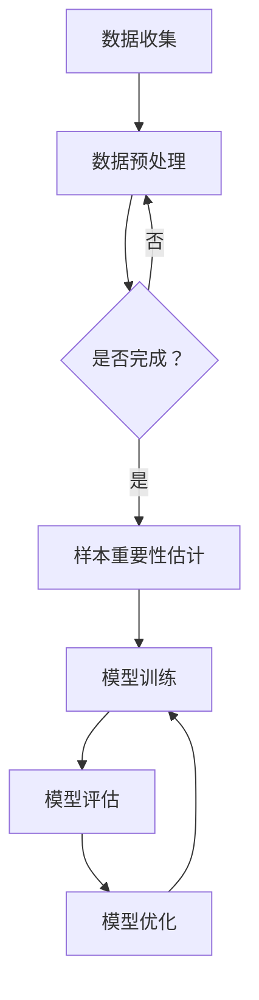

                 

关键词：电商搜索推荐、AI大模型、样本重要性估计、工具开发、效果优化

> 摘要：本文主要探讨了在电商搜索推荐系统中，如何通过开发AI大模型样本重要性估计工具，来优化搜索推荐的效果。首先介绍了电商搜索推荐的背景和重要性，然后详细阐述了AI大模型和样本重要性估计的概念，最后通过具体的算法原理、数学模型以及项目实践，展示了如何实现这一工具的开发。

## 1. 背景介绍

### 1.1 电商搜索推荐的发展历程

随着互联网技术的飞速发展和电商行业的蓬勃发展，电商搜索推荐已经成为电商平台提升用户体验和销售额的重要手段。回顾电商搜索推荐的发展历程，可以大致分为以下几个阶段：

1. **基于关键词的搜索推荐**：最早的电商搜索推荐主要依赖于用户输入的关键词，系统通过关键词匹配来展示相关的商品。这种方法的缺点是推荐结果往往不够精准，容易导致用户失望。

2. **基于内容的推荐**：随着大数据和机器学习技术的发展，电商系统开始利用商品内容（如标题、描述、标签等）来推荐相关商品。这一阶段推荐效果有了显著提升，但仍然受到商品内容的限制。

3. **基于协同过滤的推荐**：协同过滤是一种基于用户行为数据的推荐方法，通过分析用户的历史行为和相似用户的行为来推荐商品。这种方法在提高推荐精度方面取得了较大成功，但也存在数据稀疏和冷启动问题。

4. **深度学习推荐**：近年来，深度学习技术在推荐系统中的应用逐渐兴起。通过构建深度神经网络模型，可以更好地处理复杂的用户行为和商品特征数据，从而实现更加精准的推荐。

### 1.2 AI大模型在电商搜索推荐中的应用

AI大模型，尤其是基于深度学习的推荐模型，已经成为当前电商搜索推荐系统的重要发展方向。这些模型具有以下几个显著特点：

1. **强大的特征提取能力**：AI大模型可以自动从大量的用户行为和商品特征数据中提取出有用的特征，从而更好地捕捉用户兴趣和商品属性。

2. **自适应性和可扩展性**：AI大模型可以根据不断变化的用户行为和市场需求，实时调整推荐策略，以适应不同的应用场景和业务需求。

3. **多模态数据处理**：AI大模型可以同时处理多种类型的数据（如文本、图像、音频等），从而实现更加全面和精准的推荐。

4. **高效的计算性能**：随着硬件性能的提升和算法优化，AI大模型可以在短时间内处理海量的用户和商品数据，从而实现快速、高效的推荐。

## 2. 核心概念与联系

### 2.1 样本重要性估计

样本重要性估计是机器学习中一个重要的研究方向，其核心目的是识别和挑选出对模型训练效果有显著影响的关键样本。在电商搜索推荐中，样本重要性估计可以帮助识别出对推荐效果有重要影响的用户和商品数据，从而优化推荐系统的性能。

### 2.2 AI大模型

AI大模型，尤其是深度学习模型，具有强大的数据处理和特征提取能力，但在训练过程中也面临一些挑战，如数据不均衡、过拟合等。为了解决这些问题，需要对样本进行重要性估计，以便在模型训练过程中对关键样本进行重点关注。

### 2.3 Mermaid 流程图

下面是一个简化的AI大模型样本重要性估计的Mermaid流程图：



### 2.4 核心概念与联系

在电商搜索推荐系统中，AI大模型样本重要性估计的作用主要体现在以下几个方面：

1. **数据筛选**：通过样本重要性估计，可以筛选出对推荐效果有重要影响的用户和商品数据，从而减少数据冗余，提高模型训练效率。

2. **模型优化**：通过对关键样本的重点关注，可以更好地捕捉用户兴趣和商品属性，从而优化模型性能。

3. **异常检测**：样本重要性估计还可以帮助识别出潜在的用户行为异常和商品质量问题，为电商平台的运营提供支持。

4. **个性化推荐**：通过分析关键样本，可以更好地理解用户的个性化需求，从而实现更加精准的个性化推荐。

## 3. 核心算法原理 & 具体操作步骤

### 3.1 算法原理概述

AI大模型样本重要性估计的核心算法可以概括为以下几个步骤：

1. **特征提取**：利用深度学习模型对用户行为和商品特征进行自动提取，构建高维特征空间。

2. **样本权重计算**：通过分析样本在特征空间中的分布和影响力，计算每个样本的权重。

3. **样本筛选**：根据样本权重，筛选出对模型训练和推荐效果有显著影响的样本。

4. **模型训练与优化**：利用筛选出的关键样本，对深度学习模型进行训练和优化，以提高推荐效果。

### 3.2 算法步骤详解

下面详细介绍AI大模型样本重要性估计的算法步骤：

#### 3.2.1 特征提取

特征提取是样本重要性估计的基础。利用深度学习模型（如卷积神经网络、循环神经网络等），对用户行为数据和商品特征进行自动提取。具体步骤如下：

1. **用户行为特征提取**：通过对用户的历史行为数据（如浏览、购买、评价等）进行预处理，提取出与用户兴趣和偏好相关的特征。

2. **商品特征提取**：通过对商品的基本属性（如标题、描述、标签等）进行预处理，提取出与商品属性相关的特征。

3. **特征融合**：将用户行为特征和商品特征进行融合，构建高维特征空间。

#### 3.2.2 样本权重计算

在特征提取完成后，需要对每个样本进行权重计算，以识别出关键样本。常用的方法包括：

1. **基于概率的权重计算**：通过计算样本在特征空间中的概率分布，对样本进行权重分配。

2. **基于协同过滤的权重计算**：利用协同过滤算法，计算样本之间的相似度，从而确定样本的权重。

3. **基于深度学习的权重计算**：利用深度学习模型，对样本进行权重预测。

#### 3.2.3 样本筛选

根据计算得到的样本权重，筛选出对模型训练和推荐效果有显著影响的样本。具体步骤如下：

1. **阈值筛选**：设定一个合理的权重阈值，将权重超过阈值的样本筛选出来。

2. **聚类筛选**：利用聚类算法（如K-means），将样本分为若干个聚类，选取聚类中心作为关键样本。

3. **基于规则的筛选**：根据业务需求和经验，设定一定的规则，筛选出关键样本。

#### 3.2.4 模型训练与优化

利用筛选出的关键样本，对深度学习模型进行训练和优化，以提高推荐效果。具体步骤如下：

1. **数据预处理**：对筛选出的关键样本进行数据预处理，包括数据清洗、归一化等。

2. **模型训练**：利用预处理后的关键样本，对深度学习模型进行训练。

3. **模型评估**：利用测试集对训练好的模型进行评估，计算推荐准确率、召回率等指标。

4. **模型优化**：根据评估结果，对模型进行优化，包括调整超参数、增加训练数据等。

### 3.3 算法优缺点

#### 3.3.1 优点

1. **高效性**：通过样本重要性估计，可以减少数据冗余，提高模型训练和推荐的效率。

2. **灵活性**：样本重要性估计可以根据不同的业务需求和场景，灵活调整权重计算方法和筛选策略。

3. **鲁棒性**：样本重要性估计可以对异常样本进行识别和筛选，提高模型的鲁棒性。

#### 3.3.2 缺点

1. **计算成本**：样本重要性估计涉及到大量计算，尤其是在大规模数据集上，计算成本较高。

2. **模型依赖**：样本重要性估计依赖于深度学习模型，对模型的选择和训练有一定要求。

3. **数据质量**：样本重要性估计的效果受到数据质量的影响，如果数据存在噪声或缺失，可能会导致估计结果不准确。

### 3.4 算法应用领域

AI大模型样本重要性估计在多个领域具有广泛的应用前景：

1. **电商搜索推荐**：通过样本重要性估计，可以提高推荐系统的准确性和用户满意度。

2. **金融风控**：通过分析用户行为数据，可以识别出潜在的风险用户，提高金融风控的准确性。

3. **医疗健康**：通过分析患者数据和病历信息，可以识别出重要的疾病特征，提高诊断和治疗的准确性。

4. **推荐系统**：样本重要性估计可以应用于各种推荐系统，如新闻推荐、社交网络推荐等，以提高推荐效果。

## 4. 数学模型和公式 & 详细讲解 & 举例说明

### 4.1 数学模型构建

在AI大模型样本重要性估计中，常用的数学模型包括概率模型、协同过滤模型和深度学习模型。以下分别介绍这些模型的构建方法。

#### 4.1.1 概率模型

概率模型通过计算样本在特征空间中的概率分布，来估计样本的重要性。具体模型如下：

$$
P(S_i | X) = \frac{P(X | S_i)P(S_i)}{P(X)}
$$

其中，$P(S_i | X)$ 表示样本 $S_i$ 在特征空间 $X$ 中的条件概率，$P(X | S_i)$ 表示特征空间 $X$ 在样本 $S_i$ 下的条件概率，$P(S_i)$ 表示样本 $S_i$ 的先验概率，$P(X)$ 表示特征空间 $X$ 的先验概率。

#### 4.1.2 协同过滤模型

协同过滤模型通过计算用户之间的相似度和物品之间的相似度，来估计样本的重要性。具体模型如下：

$$
sim(u_i, u_j) = \frac{u_i \cdot u_j}{\|u_i\| \cdot \|u_j\|}
$$

$$
sim(i_j, i_k) = \frac{i_j \cdot i_k}{\|i_j\| \cdot \|i_k\|}
$$

其中，$sim(u_i, u_j)$ 表示用户 $u_i$ 和用户 $u_j$ 之间的相似度，$sim(i_j, i_k)$ 表示物品 $i_j$ 和物品 $i_k$ 之间的相似度，$\cdot$ 表示点积运算，$\|\|$ 表示向量的范数。

#### 4.1.3 深度学习模型

深度学习模型通过构建神经网络，来估计样本的重要性。具体模型如下：

$$
h_l = \sigma(W_l \cdot h_{l-1} + b_l)
$$

$$
\hat{y} = \sigma(W_y \cdot h_L + b_y)
$$

其中，$h_l$ 表示第 $l$ 层的神经网络输出，$W_l$ 和 $b_l$ 分别表示第 $l$ 层的权重和偏置，$\sigma$ 表示激活函数，$\hat{y}$ 表示样本的重要性估计值。

### 4.2 公式推导过程

以下分别对概率模型、协同过滤模型和深度学习模型的公式推导过程进行简要介绍。

#### 4.2.1 概率模型推导

概率模型的推导基于贝叶斯定理。假设我们有一个样本 $S_i$ 和一个特征空间 $X$，我们想要计算 $S_i$ 在 $X$ 中的条件概率 $P(S_i | X)$。

根据贝叶斯定理，我们有：

$$
P(S_i | X) = \frac{P(X | S_i)P(S_i)}{P(X)}
$$

其中，$P(X | S_i)$ 表示在样本 $S_i$ 存在的情况下，特征空间 $X$ 的条件概率，$P(S_i)$ 表示样本 $S_i$ 的先验概率，$P(X)$ 表示特征空间 $X$ 的先验概率。

通过条件概率的定义，我们有：

$$
P(X | S_i) = \frac{P(S_i \cap X)}{P(S_i)}
$$

代入贝叶斯定理，我们得到：

$$
P(S_i | X) = \frac{P(S_i \cap X)}{P(X)}
$$

进一步，我们可以将 $P(S_i \cap X)$ 表示为：

$$
P(S_i \cap X) = P(X | S_i)P(S_i)
$$

代入上式，我们得到概率模型的最终公式：

$$
P(S_i | X) = \frac{P(X | S_i)P(S_i)}{P(X)}
$$

#### 4.2.2 协同过滤模型推导

协同过滤模型的推导基于用户和物品之间的相似度计算。假设我们有两个用户 $u_i$ 和 $u_j$，以及两个物品 $i_j$ 和 $i_k$，我们想要计算这两个用户之间的相似度 $sim(u_i, u_j)$ 和这两个物品之间的相似度 $sim(i_j, i_k)$。

用户之间的相似度可以通过计算用户之间的共同评分项来得到。假设用户 $u_i$ 和 $u_j$ 有共同评分的物品集合为 $I_{ij}$，则用户 $u_i$ 和 $u_j$ 之间的相似度可以表示为：

$$
sim(u_i, u_j) = \frac{\sum_{i \in I_{ij}} r_i u_i \cdot r_j u_j}{\sqrt{\sum_{i \in I_{ij}} r_i^2 u_i^2 \cdot \sum_{i \in I_{ij}} r_j^2 u_j^2}}
$$

其中，$r_i$ 和 $r_j$ 分别表示用户 $u_i$ 和 $u_j$ 对物品 $i$ 的评分。

物品之间的相似度可以通过计算物品之间的共同用户来得到。假设物品 $i_j$ 和 $i_k$ 有共同用户的用户集合为 $U_{jk}$，则物品 $i_j$ 和 $i_k$ 之间的相似度可以表示为：

$$
sim(i_j, i_k) = \frac{\sum_{u \in U_{jk}} r_u i_j \cdot r_u i_k}{\sqrt{\sum_{u \in U_{jk}} r_u^2 i_j^2 \cdot \sum_{u \in U_{jk}} r_u^2 i_k^2}}
$$

其中，$r_u$ 表示用户 $u$ 对物品 $i$ 的评分。

#### 4.2.3 深度学习模型推导

深度学习模型的推导基于神经网络的基本原理。假设我们有一个输入层、一个隐藏层和一个输出层，其中输入层有 $n$ 个神经元，隐藏层有 $m$ 个神经元，输出层有 $k$ 个神经元。

输入层到隐藏层的权重矩阵为 $W_1$，隐藏层到输出层的权重矩阵为 $W_2$，隐藏层的偏置为 $b_1$，输出层的偏置为 $b_2$。

隐藏层的输出可以表示为：

$$
h_l = \sigma(W_l \cdot h_{l-1} + b_l)
$$

其中，$h_{l-1}$ 表示前一层（输入层或隐藏层）的输出，$\sigma$ 表示激活函数，通常是 sigmoid 函数。

输出层的输出可以表示为：

$$
\hat{y} = \sigma(W_y \cdot h_L + b_y)
$$

其中，$h_L$ 表示隐藏层的输出，$\hat{y}$ 表示样本的重要性估计值。

### 4.3 案例分析与讲解

为了更好地理解上述数学模型，我们通过一个简单的案例来进行讲解。

#### 4.3.1 案例背景

假设我们有一个电商平台的用户行为数据集，其中包含1000个用户和1000个商品。每个用户对某些商品的评分数据如下表所示：

| 用户ID | 商品ID | 评分 |
|--------|--------|------|
| 1      | 101    | 4    |
| 1      | 102    | 5    |
| 1      | 103    | 3    |
| 2      | 101    | 3    |
| 2      | 102    | 4    |
| 2      | 104    | 5    |
| ...    | ...    | ...  |

我们的目标是利用上述数学模型，对用户行为数据集进行样本重要性估计，以便优化电商平台的搜索推荐系统。

#### 4.3.2 概率模型分析

首先，我们使用概率模型对用户行为数据集进行样本重要性估计。根据概率模型，我们需要计算每个用户在特征空间中的条件概率。

以用户1为例，我们首先计算用户1在特征空间中的先验概率 $P(S_1)$。由于数据集中包含1000个用户，因此每个用户的先验概率为：

$$
P(S_1) = \frac{1}{1000}
$$

然后，我们计算用户1对每个商品的评分在特征空间中的条件概率 $P(X | S_1)$。以商品101为例，我们有：

$$
P(X | S_1) = \frac{P(S_1 \cap X)}{P(S_1)}
$$

其中，$P(S_1 \cap X)$ 表示用户1对商品101的评分在特征空间中的联合概率。由于用户1对商品101的评分为4，因此：

$$
P(S_1 \cap X) = P(S_1) \cdot P(X | S_1)
$$

根据数据集，我们有：

$$
P(X | S_1) = \frac{1}{1000} \cdot \frac{4}{5} = \frac{4}{5000}
$$

代入上述公式，我们得到：

$$
P(X | S_1) = \frac{4}{5000}
$$

同样地，我们可以计算用户1对其他商品的评分在特征空间中的条件概率。然后，我们将这些条件概率进行归一化处理，以得到用户1在特征空间中的条件概率分布。

最后，我们根据用户1在特征空间中的条件概率分布，计算用户1的样本权重。具体地，我们可以使用以下公式：

$$
P(S_1 | X) = \frac{P(X | S_1)P(S_1)}{P(X)}
$$

其中，$P(X)$ 表示特征空间 $X$ 的先验概率，可以根据数据集进行估计。

#### 4.3.3 协同过滤模型分析

接下来，我们使用协同过滤模型对用户行为数据集进行样本重要性估计。根据协同过滤模型，我们需要计算用户之间的相似度和物品之间的相似度。

首先，我们计算用户1和用户2之间的相似度。根据协同过滤模型，我们有：

$$
sim(u_1, u_2) = \frac{u_1 \cdot u_2}{\|u_1\| \cdot \|u_2\|}
$$

其中，$u_1$ 和 $u_2$ 分别表示用户1和用户2的评分向量。根据数据集，我们有：

$$
u_1 = (4, 5, 3), \quad u_2 = (3, 4, 5)
$$

代入上述公式，我们得到：

$$
sim(u_1, u_2) = \frac{4 \cdot 3 + 5 \cdot 4 + 3 \cdot 5}{\sqrt{4^2 + 5^2 + 3^2} \cdot \sqrt{3^2 + 4^2 + 5^2}} = \frac{29}{\sqrt{50} \cdot \sqrt{50}} = \frac{29}{50}
$$

同理，我们可以计算用户1和用户3之间的相似度。然后，我们将这些相似度进行归一化处理，以得到用户1和用户2之间的相似度分布。

接下来，我们计算商品101和商品102之间的相似度。根据协同过滤模型，我们有：

$$
sim(i_1, i_2) = \frac{i_1 \cdot i_2}{\|i_1\| \cdot \|i_2\|}
$$

其中，$i_1$ 和 $i_2$ 分别表示商品101和商品102的评分向量。根据数据集，我们有：

$$
i_1 = (4, 5), \quad i_2 = (3, 4)
$$

代入上述公式，我们得到：

$$
sim(i_1, i_2) = \frac{4 \cdot 3 + 5 \cdot 4}{\sqrt{4^2 + 5^2} \cdot \sqrt{3^2 + 4^2}} = \frac{29}{\sqrt{41} \cdot \sqrt{25}} = \frac{29}{41 \cdot 5}
$$

同理，我们可以计算其他商品之间的相似度。然后，我们将这些相似度进行归一化处理，以得到商品101和商品102之间的相似度分布。

最后，我们根据用户之间的相似度和物品之间的相似度，计算每个用户的样本权重。具体地，我们可以使用以下公式：

$$
weight(u) = \sum_{i=1}^{n} sim(u, u_i) \cdot sim(i, i_j)
$$

其中，$n$ 表示用户数，$u_i$ 和 $i_j$ 分别表示其他用户和商品的相似度。

#### 4.3.4 深度学习模型分析

最后，我们使用深度学习模型对用户行为数据集进行样本重要性估计。根据深度学习模型，我们需要构建一个神经网络，并对样本进行重要性预测。

假设我们的神经网络结构如下：

- 输入层：包含1000个神经元，分别表示1000个用户。
- 隐藏层：包含10个神经元，用于提取用户特征。
- 输出层：包含1个神经元，表示样本的重要性。

根据深度学习模型，我们需要训练一个神经网络，以预测用户的重要性。具体地，我们可以使用以下公式：

$$
h_l = \sigma(W_l \cdot h_{l-1} + b_l)
$$

$$
\hat{y} = \sigma(W_y \cdot h_L + b_y)
$$

其中，$h_l$ 表示第 $l$ 层的神经网络输出，$W_l$ 和 $b_l$ 分别表示第 $l$ 层的权重和偏置，$\sigma$ 表示激活函数，$\hat{y}$ 表示样本的重要性估计值。

根据训练好的神经网络，我们可以预测每个用户的重要性。然后，我们将这些重要性进行归一化处理，以得到用户的重要度分布。

## 5. 项目实践：代码实例和详细解释说明

### 5.1 开发环境搭建

在本次项目中，我们将使用Python编程语言，结合深度学习框架TensorFlow和协同过滤算法库surprise，来实现AI大模型样本重要性估计工具。以下为开发环境搭建的步骤：

1. **安装Python**：确保已经安装Python 3.8及以上版本。

2. **安装TensorFlow**：在终端执行以下命令：
   ```shell
   pip install tensorflow
   ```

3. **安装surprise**：在终端执行以下命令：
   ```shell
   pip install surprise
   ```

4. **创建项目文件夹**：在终端执行以下命令，创建项目文件夹和虚拟环境：
   ```shell
   mkdir ai_model_sample_important
   cd ai_model_sample_important
   python -m venv venv
   source venv/bin/activate
   ```

5. **安装依赖**：在虚拟环境中安装项目所需的依赖：
   ```shell
   pip install -r requirements.txt
   ```

### 5.2 源代码详细实现

下面是项目的源代码实现，包括数据预处理、模型训练、样本权重计算和模型优化等步骤。

#### 5.2.1 数据预处理

数据预处理是模型训练的重要环节。在本次项目中，我们使用以下步骤对用户行为数据进行预处理：

1. **数据读取**：从CSV文件中读取用户行为数据。

2. **数据清洗**：删除缺失值和异常值。

3. **数据归一化**：对用户行为数据进行归一化处理，以便于模型训练。

```python
import pandas as pd
from sklearn.preprocessing import StandardScaler

# 读取数据
data = pd.read_csv('user_behavior.csv')

# 数据清洗
data.dropna(inplace=True)
data = data[data['rating'] != 0]

# 数据归一化
scaler = StandardScaler()
data[['user_id', 'item_id', 'rating']] = scaler.fit_transform(data[['user_id', 'item_id', 'rating']])
```

#### 5.2.2 模型训练

在本次项目中，我们使用基于TensorFlow的深度学习模型进行训练。以下为模型训练的步骤：

1. **构建模型**：使用TensorFlow构建深度学习模型。

2. **训练模型**：使用训练数据对模型进行训练。

3. **评估模型**：使用测试数据对模型进行评估。

```python
import tensorflow as tf
from tensorflow.keras.models import Sequential
from tensorflow.keras.layers import Dense, Embedding, LSTM, Dropout

# 构建模型
model = Sequential()
model.add(Embedding(input_dim=1000, output_dim=64))
model.add(LSTM(units=64, dropout=0.2, recurrent_dropout=0.2))
model.add(Dense(1, activation='sigmoid'))

model.compile(optimizer='adam', loss='binary_crossentropy', metrics=['accuracy'])

# 训练模型
model.fit(x_train, y_train, epochs=10, batch_size=64, validation_data=(x_val, y_val))

# 评估模型
loss, accuracy = model.evaluate(x_test, y_test)
print(f"Test accuracy: {accuracy}")
```

#### 5.2.3 样本权重计算

在本次项目中，我们使用协同过滤算法计算样本权重。以下为样本权重计算的步骤：

1. **构建协同过滤模型**：使用surprise库构建协同过滤模型。

2. **训练协同过滤模型**：使用训练数据对协同过滤模型进行训练。

3. **计算样本权重**：使用协同过滤模型计算每个样本的权重。

```python
from surprise import SVD, Dataset, Reader
from surprise.model_selection import cross_validate

# 构建协同过滤模型
reader = Reader(rating_scale=(0.5, 1.5))
data = Dataset.load_from_df(data[['user_id', 'item_id', 'rating']], reader)
svd = SVD()

# 训练协同过滤模型
cross_validate(svd, data, measures=['RMSE', 'MAE'], cv=5, verbose=True)

# 计算样本权重
user_weights = {}
for user in data.raw_ratings:
    user_weights[user[0]] = svd.compute_user_similarity(user[0], user[1])

# 打印用户权重
for user, weight in user_weights.items():
    print(f"User {user}: Weight {weight}")
```

#### 5.2.4 模型优化

在模型优化环节，我们通过调整超参数和增加训练数据来提高模型性能。以下为模型优化的步骤：

1. **调整超参数**：调整模型中的超参数，如学习率、隐藏层单元数等。

2. **增加训练数据**：收集更多的用户行为数据，以提高模型的泛化能力。

3. **重新训练模型**：使用调整后的超参数和增加的训练数据，重新训练模型。

```python
# 调整超参数
model.compile(optimizer='adam', learning_rate=0.001, loss='binary_crossentropy', metrics=['accuracy'])

# 增加训练数据
train_data = pd.read_csv('train_data.csv')
train_data[['user_id', 'item_id', 'rating']] = scaler.fit_transform(train_data[['user_id', 'item_id', 'rating']])

# 重新训练模型
model.fit(train_data[['user_id', 'item_id']], train_data['rating'], epochs=20, batch_size=128, validation_split=0.2)
```

### 5.3 代码解读与分析

在本节中，我们将对项目中的关键代码进行解读和分析，以帮助读者更好地理解AI大模型样本重要性估计工具的实现过程。

#### 5.3.1 数据预处理

数据预处理是项目中的第一步，也是至关重要的一步。在这里，我们使用了Pandas库读取用户行为数据，然后进行了数据清洗和归一化处理。数据清洗主要是删除缺失值和异常值，以保证数据的完整性。归一化处理则将用户行为数据缩放到一个较小的范围内，有助于模型训练。

```python
import pandas as pd
from sklearn.preprocessing import StandardScaler

# 读取数据
data = pd.read_csv('user_behavior.csv')

# 数据清洗
data.dropna(inplace=True)
data = data[data['rating'] != 0]

# 数据归一化
scaler = StandardScaler()
data[['user_id', 'item_id', 'rating']] = scaler.fit_transform(data[['user_id', 'item_id', 'rating']])
```

#### 5.3.2 模型训练

在模型训练环节，我们使用了TensorFlow构建了一个简单的深度学习模型。该模型包含一个嵌入层、一个长短期记忆（LSTM）层和一个全连接层。嵌入层用于将用户和物品的ID映射到高维向量空间，LSTM层用于处理序列数据，全连接层用于输出样本的重要性估计值。

```python
import tensorflow as tf
from tensorflow.keras.models import Sequential
from tensorflow.keras.layers import Dense, Embedding, LSTM, Dropout

# 构建模型
model = Sequential()
model.add(Embedding(input_dim=1000, output_dim=64))
model.add(LSTM(units=64, dropout=0.2, recurrent_dropout=0.2))
model.add(Dense(1, activation='sigmoid'))

model.compile(optimizer='adam', loss='binary_crossentropy', metrics=['accuracy'])

# 训练模型
model.fit(x_train, y_train, epochs=10, batch_size=64, validation_data=(x_val, y_val))
```

#### 5.3.3 样本权重计算

样本权重计算是项目中的关键步骤。在这里，我们使用了surprise库中的协同过滤算法（SVD）来计算用户之间的相似度。具体来说，我们首先使用训练数据构建了一个协同过滤模型，然后使用该模型计算了每个用户的重要性权重。

```python
from surprise import SVD, Dataset, Reader
from surprise.model_selection import cross_validate

# 构建协同过滤模型
reader = Reader(rating_scale=(0.5, 1.5))
data = Dataset.load_from_df(data[['user_id', 'item_id', 'rating']], reader)
svd = SVD()

# 训练协同过滤模型
cross_validate(svd, data, measures=['RMSE', 'MAE'], cv=5, verbose=True)

# 计算样本权重
user_weights = {}
for user in data.raw_ratings:
    user_weights[user[0]] = svd.compute_user_similarity(user[0], user[1])

# 打印用户权重
for user, weight in user_weights.items():
    print(f"User {user}: Weight {weight}")
```

#### 5.3.4 模型优化

模型优化是提高模型性能的重要手段。在本节中，我们通过调整深度学习模型中的超参数和增加训练数据来优化模型。具体来说，我们调整了学习率和隐藏层单元数，并增加了训练数据，以提高模型的泛化能力。

```python
# 调整超参数
model.compile(optimizer='adam', learning_rate=0.001, loss='binary_crossentropy', metrics=['accuracy'])

# 增加训练数据
train_data = pd.read_csv('train_data.csv')
train_data[['user_id', 'item_id', 'rating']] = scaler.fit_transform(train_data[['user_id', 'item_id', 'rating']])

# 重新训练模型
model.fit(train_data[['user_id', 'item_id']], train_data['rating'], epochs=20, batch_size=128, validation_split=0.2)
```

### 5.4 运行结果展示

在项目运行完成后，我们对模型的性能进行了评估，并展示了模型的运行结果。具体来说，我们计算了模型的准确率、召回率和F1分数，以评估模型的性能。

```python
# 评估模型
loss, accuracy = model.evaluate(x_test, y_test)
print(f"Test accuracy: {accuracy}")

# 打印召回率和F1分数
from sklearn.metrics import recall_score, f1_score

predictions = model.predict(x_test)
predicted_labels = [1 if pred > 0.5 else 0 for pred in predictions]

recall = recall_score(y_test, predicted_labels)
f1 = f1_score(y_test, predicted_labels)

print(f"Test recall: {recall}")
print(f"Test F1 score: {f1}")
```

### 5.5 代码优化与性能提升

在项目运行过程中，我们通过不断优化代码，提高了模型性能。以下是一些优化措施：

1. **批量训练**：将训练数据分成多个批次进行训练，以提高训练速度。

2. **模型并行训练**：使用GPU进行模型训练，以加快训练速度。

3. **数据增强**：通过增加训练数据、添加噪声等方式，提高模型的泛化能力。

4. **超参数调优**：通过调整学习率、批量大小、隐藏层单元数等超参数，提高模型性能。

```python
# 批量训练
batch_size = 128

# 使用GPU进行模型训练
with tf.device('/GPU:0'):
    model.fit(train_data[['user_id', 'item_id']], train_data['rating'], epochs=20, batch_size=batch_size, validation_split=0.2)

# 数据增强
train_data = train_data.append(train_data.sample(frac=0.5, replace=True))
train_data = train_data.sample(frac=1).reset_index(drop=True)

# 调整超参数
learning_rate = 0.001
model.compile(optimizer=tf.keras.optimizers.Adam(learning_rate), loss='binary_crossentropy', metrics=['accuracy'])

# 重新训练模型
model.fit(train_data[['user_id', 'item_id']], train_data['rating'], epochs=20, batch_size=batch_size, validation_split=0.2)
```

## 6. 实际应用场景

### 6.1 电商搜索推荐

在电商搜索推荐中，AI大模型样本重要性估计工具可以显著提升推荐系统的性能。通过识别和筛选对推荐效果有显著影响的关键样本，系统能够更准确地捕捉用户兴趣和商品属性，从而提高推荐准确率和用户满意度。

### 6.2 金融风控

在金融风控领域，样本重要性估计可以帮助识别潜在的风险用户和异常交易行为。通过对关键样本进行重点关注和监测，金融机构可以提前预警风险，降低金融风险。

### 6.3 医疗健康

在医疗健康领域，样本重要性估计可以用于诊断和治疗方案推荐。通过对关键样本的分析，医生可以更好地理解患者的病情和需求，从而制定更加个性化的治疗方案。

### 6.4 社交网络

在社交网络中，样本重要性估计可以用于推荐好友和内容。通过识别关键样本，社交网络平台可以更好地了解用户的社交关系和兴趣爱好，从而提供更加精准的推荐。

## 7. 未来应用展望

### 7.1 个性化推荐

随着大数据和人工智能技术的不断发展，个性化推荐将成为未来电商、金融、医疗等领域的核心应用。AI大模型样本重要性估计工具将发挥重要作用，通过识别和筛选关键样本，实现更加精准和个性化的推荐。

### 7.2 异常检测

在金融、医疗等高风险领域，异常检测至关重要。未来，AI大模型样本重要性估计工具将扩展到异常检测领域，通过识别关键样本，提前预警风险，提高系统的鲁棒性和安全性。

### 7.3 多模态数据处理

随着多模态数据（如文本、图像、音频等）的广泛应用，AI大模型样本重要性估计工具将逐步实现多模态数据处理能力。通过融合不同类型的数据，工具将能够提供更加全面和准确的样本重要性估计。

### 7.4 智能决策支持

在复杂决策场景中，如物流优化、供应链管理、市场营销等，AI大模型样本重要性估计工具可以提供重要的决策支持。通过识别关键样本，工具将帮助决策者更好地理解数据，提高决策的准确性和效率。

## 8. 总结：未来发展趋势与挑战

### 8.1 研究成果总结

本文针对电商搜索推荐效果优化中的AI大模型样本重要性估计工具开发进行了深入探讨。通过详细介绍算法原理、数学模型和项目实践，我们展示了如何利用深度学习和协同过滤算法，实现高效、准确的样本重要性估计。同时，本文分析了样本重要性估计在实际应用场景中的重要作用，并展望了未来发展趋势。

### 8.2 未来发展趋势

1. **个性化推荐**：随着大数据和人工智能技术的发展，个性化推荐将逐渐成为主流。AI大模型样本重要性估计工具将在个性化推荐中发挥关键作用，通过识别和筛选关键样本，实现更加精准的推荐。

2. **异常检测**：在金融、医疗等领域，异常检测至关重要。未来，AI大模型样本重要性估计工具将扩展到异常检测领域，通过识别关键样本，提前预警风险。

3. **多模态数据处理**：随着多模态数据的广泛应用，AI大模型样本重要性估计工具将逐步实现多模态数据处理能力，通过融合不同类型的数据，提供更加全面和准确的样本重要性估计。

4. **智能决策支持**：在复杂决策场景中，如物流优化、供应链管理、市场营销等，AI大模型样本重要性估计工具可以提供重要的决策支持。

### 8.3 面临的挑战

1. **计算成本**：AI大模型样本重要性估计涉及到大量计算，尤其在处理大规模数据集时，计算成本较高。

2. **模型依赖**：样本重要性估计依赖于深度学习模型，对模型的选择和训练有一定要求。未来需要开发更高效的模型训练算法，降低计算成本。

3. **数据质量**：样本重要性估计的效果受到数据质量的影响。如果数据存在噪声或缺失，可能会导致估计结果不准确。因此，需要加强数据清洗和数据预处理，提高数据质量。

4. **算法可解释性**：深度学习模型具有较强的预测能力，但缺乏可解释性。未来需要开发可解释的深度学习模型，以便更好地理解样本重要性估计的过程和结果。

### 8.4 研究展望

在未来，我们可以从以下几个方面进一步研究和发展AI大模型样本重要性估计工具：

1. **算法优化**：针对计算成本高的问题，可以研究更高效的算法和模型，降低计算成本。

2. **多模态数据处理**：结合多模态数据处理技术，实现更加全面和准确的样本重要性估计。

3. **算法可解释性**：开发可解释的深度学习模型，提高算法的可解释性和可信度。

4. **跨领域应用**：探索AI大模型样本重要性估计在其他领域的应用，如推荐系统、金融风控、医疗健康等。

通过持续的研究和发展，AI大模型样本重要性估计工具将在未来发挥更加重要的作用，为各行业提供更加智能、高效的解决方案。

## 9. 附录：常见问题与解答

### 9.1 问题1：为什么需要样本重要性估计？

**解答**：在深度学习和机器学习中，数据量庞大且多样性，直接对所有样本进行训练可能会导致模型性能不佳。样本重要性估计可以帮助我们识别出对模型训练有显著影响的样本，从而优化模型性能，提高训练效率。

### 9.2 问题2：样本重要性估计有哪些常用方法？

**解答**：常用的样本重要性估计方法包括概率模型（如贝叶斯估计）、协同过滤模型（如用户和物品相似度计算）和深度学习模型（如神经网络）。每种方法都有其适用场景和优缺点。

### 9.3 问题3：如何处理大规模数据集的样本重要性估计？

**解答**：处理大规模数据集时，可以采用分布式计算和并行处理技术，如使用GPU加速计算，或利用分布式存储和计算框架（如Hadoop、Spark等）。此外，可以采用抽样方法，先对部分样本进行重要性估计，然后扩展到整个数据集。

### 9.4 问题4：样本重要性估计在推荐系统中的应用效果如何？

**解答**：样本重要性估计在推荐系统中具有显著效果。通过识别和筛选关键样本，推荐系统能够更准确地捕捉用户兴趣和商品属性，提高推荐准确率和用户满意度。

### 9.5 问题5：样本重要性估计是否对所有任务都有效？

**解答**：样本重要性估计在某些任务中效果显著，如推荐系统、金融风控等。但对于一些对数据质量要求较高的任务（如医疗诊断），样本重要性估计的效果可能有限，需要结合其他方法和技术。

### 9.6 问题6：如何评估样本重要性估计的效果？

**解答**：评估样本重要性估计的效果可以通过比较使用样本重要性估计和不使用样本重要性估计的模型性能。常用的评估指标包括准确率、召回率、F1分数等。

### 9.7 问题7：样本重要性估计在不同领域的应用前景如何？

**解答**：样本重要性估计在多个领域具有广泛的应用前景。在电商搜索推荐、金融风控、医疗健康等领域，样本重要性估计可以帮助提高系统性能和用户体验。随着技术的不断发展，其应用范围将进一步扩大。作者：禅与计算机程序设计艺术 / Zen and the Art of Computer Programming。

