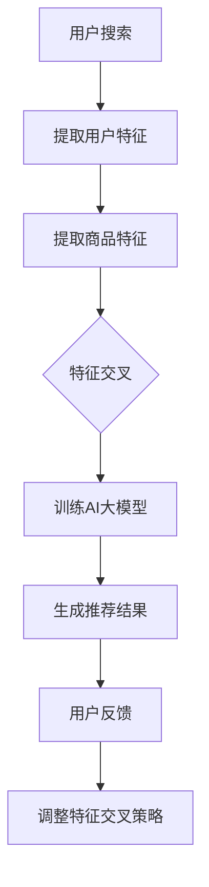

                 

关键词：电商搜索推荐、AI大模型、特征交叉、优化策略、效果提升

摘要：在电商行业中，搜索推荐系统的性能直接影响用户体验和业务转化率。本文将深入探讨如何利用AI大模型特征交叉技术来提升电商搜索推荐的准确性和效果，通过详细的理论分析和实践案例，为业界提供有益的参考和借鉴。

## 1. 背景介绍

随着互联网技术的飞速发展，电商行业已经成为我国数字经济的重要组成部分。在电商平台上，用户通过搜索来找到自己需要的商品，而搜索推荐系统的效果直接影响到用户的购物体验和平台的业务转化率。传统的搜索推荐系统通常依赖于关键词匹配、基于内容的推荐等技术，但面对日益增长的商品数量和复杂的用户行为，这些方法的推荐效果往往不尽如人意。

近年来，人工智能（AI）技术的飞速发展为电商搜索推荐系统带来了新的机遇。特别是AI大模型的出现，使得对大规模复杂数据的处理和分析变得更加高效和精准。特征交叉技术作为AI大模型的重要组成部分，能够在融合多源数据的基础上，挖掘出更加丰富的特征信息，从而显著提升搜索推荐的性能。

本文将围绕电商搜索推荐效果优化中的AI大模型特征交叉技术展开讨论，旨在为电商平台的搜索推荐系统提供一种有效的技术方案。

## 2. 核心概念与联系

### 2.1 AI大模型

AI大模型是指具有千亿甚至万亿参数规模的深度学习模型。这些模型通过在海量数据上训练，可以自动学习并提取出数据中的复杂模式和关联。常见的AI大模型包括BERT、GPT、T5等。它们在自然语言处理、图像识别、语音识别等领域都取得了显著的成果。

### 2.2 特征交叉

特征交叉是指将多个特征以某种方式组合在一起，形成新的特征。这些新特征能够综合多个原始特征的信息，从而提高模型的预测能力。特征交叉技术在机器学习领域广泛应用，如分类、回归、推荐系统等。

### 2.3 特征交叉与AI大模型的结合

AI大模型具有强大的特征提取能力，但通常需要大量的训练数据和计算资源。特征交叉技术可以通过对原始特征进行组合，生成新的特征，从而丰富AI大模型的训练数据，提高模型的泛化能力。同时，特征交叉技术还可以降低模型的复杂性，提高模型的解释性。

### 2.4 Mermaid流程图

下面是一个Mermaid流程图，展示了AI大模型特征交叉技术在电商搜索推荐系统中的应用流程：



## 3. 核心算法原理 & 具体操作步骤

### 3.1 算法原理概述

AI大模型特征交叉技术主要包括以下几个步骤：

1. 数据采集：从电商平台上收集用户行为数据、商品信息等原始数据。
2. 特征提取：利用自然语言处理、图像识别等技术，对原始数据进行特征提取，得到用户特征和商品特征。
3. 特征交叉：将用户特征和商品特征进行组合，生成新的特征。
4. 训练模型：利用生成的新特征训练AI大模型，如BERT、GPT等。
5. 生成推荐结果：将用户特征和商品特征输入AI大模型，生成推荐结果。
6. 用户反馈：根据用户对推荐结果的评价，调整特征交叉策略，提高推荐效果。

### 3.2 算法步骤详解

1. **数据采集**：

   从电商平台上收集用户行为数据、商品信息等原始数据。用户行为数据包括浏览记录、购买记录、搜索记录等；商品信息数据包括商品名称、价格、品牌、品类等。

2. **特征提取**：

   利用自然语言处理、图像识别等技术，对原始数据进行特征提取。对于用户特征，可以提取用户兴趣标签、浏览时长、购买频率等；对于商品特征，可以提取商品属性、品牌、品类等。

3. **特征交叉**：

   将用户特征和商品特征进行组合，生成新的特征。例如，可以组合用户浏览记录和商品品类，生成用户对某个品类的兴趣度；或者组合用户购买记录和商品价格，生成用户对商品价格的敏感度。

4. **训练模型**：

   利用生成的新特征训练AI大模型，如BERT、GPT等。通过在大量数据上训练，模型可以自动学习并提取出数据中的复杂模式和关联。

5. **生成推荐结果**：

   将用户特征和商品特征输入AI大模型，生成推荐结果。例如，对于一个搜索“笔记本电脑”的用户，模型可以基于用户特征和商品特征，推荐出与用户兴趣和需求最匹配的笔记本电脑。

6. **用户反馈**：

   根据用户对推荐结果的评价，调整特征交叉策略，提高推荐效果。例如，如果用户对某次推荐结果不满意，可以调整用户特征和商品特征的权重，或者增加新的特征交叉方式。

### 3.3 算法优缺点

**优点**：

1. **提高推荐准确率**：通过特征交叉，模型可以融合多源数据的信息，提高推荐的准确性。
2. **增强模型泛化能力**：通过生成新的特征，模型可以在不同场景下保持良好的泛化能力。
3. **提高模型解释性**：特征交叉技术使得模型的预测过程更加直观，便于理解。

**缺点**：

1. **计算资源消耗大**：训练AI大模型和特征交叉过程需要大量的计算资源，对硬件设施要求较高。
2. **数据质量要求高**：特征交叉的效果取决于原始数据的质量，数据清洗和预处理工作量大。
3. **特征选择困难**：在生成新特征时，需要根据业务场景和模型性能进行特征选择，难度较大。

### 3.4 算法应用领域

AI大模型特征交叉技术在电商搜索推荐领域有广泛的应用。除了电商搜索推荐，还可以应用于以下领域：

1. **社交媒体推荐**：通过用户行为和内容特征交叉，生成用户兴趣标签，提高内容推荐的准确性。
2. **广告投放优化**：通过用户特征和广告特征交叉，提高广告投放的精准度。
3. **金融风控**：通过用户信用特征和交易特征交叉，提高金融风控的准确率。

## 4. 数学模型和公式 & 详细讲解 & 举例说明

### 4.1 数学模型构建

在AI大模型特征交叉技术中，常用的数学模型包括深度神经网络（DNN）、循环神经网络（RNN）、卷积神经网络（CNN）等。以下是一个简化的深度神经网络模型，用于特征交叉和推荐：

```latex
y = f(W_1 \cdot x_1 + W_2 \cdot x_2 + ... + W_n \cdot x_n + b)
```

其中，\( y \) 是输出结果，\( f \) 是激活函数，\( W_1, W_2, ..., W_n \) 是权重矩阵，\( x_1, x_2, ..., x_n \) 是输入特征，\( b \) 是偏置。

### 4.2 公式推导过程

假设用户特征为 \( x_1 \)，商品特征为 \( x_2 \)，经过特征交叉后生成的新特征为 \( x_{new} \)。我们可以将新特征表示为：

```latex
x_{new} = [x_1; x_2] = \begin{bmatrix} x_1 \\ x_2 \end{bmatrix}
```

将新特征输入深度神经网络模型，可以得到：

```latex
y = f(W \cdot x_{new} + b)
```

其中，\( W \) 是权重矩阵，\( b \) 是偏置。

### 4.3 案例分析与讲解

假设有一个电商搜索推荐系统，用户特征包括浏览时长、购买频率，商品特征包括价格、品牌。我们采用深度神经网络模型进行特征交叉和推荐。

1. **数据预处理**：

   对用户特征和商品特征进行归一化处理，将数据缩放到[0, 1]范围内。

2. **特征交叉**：

   将用户特征和商品特征进行拼接，生成新特征：

   ```latex
   x_{new} = [x_1; x_2] = \begin{bmatrix} x_1 \\ x_2 \end{bmatrix}
   ```

3. **模型训练**：

   采用梯度下降算法训练深度神经网络模型，学习权重矩阵 \( W \) 和偏置 \( b \)。训练过程中，通过反向传播算法更新模型参数，使得模型在训练数据上达到最佳性能。

4. **生成推荐结果**：

   将用户特征和商品特征输入模型，得到推荐结果：

   ```latex
   y = f(W \cdot x_{new} + b)
   ```

5. **用户反馈**：

   根据用户对推荐结果的评价，调整特征交叉策略，提高推荐效果。例如，如果用户对推荐结果不满意，可以增加其他特征交叉方式，或者调整特征权重。

## 5. 项目实践：代码实例和详细解释说明

### 5.1 开发环境搭建

1. **Python环境**：

   安装Python 3.8及以上版本，推荐使用Anaconda进行环境管理。

2. **深度学习框架**：

   安装TensorFlow 2.0及以上版本，用于构建和训练深度神经网络模型。

3. **数据处理库**：

   安装NumPy、Pandas、Scikit-learn等库，用于数据预处理和特征提取。

### 5.2 源代码详细实现

以下是一个简单的Python代码实例，演示了AI大模型特征交叉技术在电商搜索推荐系统中的应用。

```python
import numpy as np
import pandas as pd
import tensorflow as tf

# 数据预处理
def preprocess_data(data):
    # 归一化处理
    data = (data - np.min(data)) / (np.max(data) - np.min(data))
    return data

# 特征交叉
def feature_cross(user_feature, item_feature):
    return np.hstack((user_feature, item_feature))

# 构建深度神经网络模型
def build_model(input_shape):
    model = tf.keras.Sequential([
        tf.keras.layers.Dense(64, activation='relu', input_shape=input_shape),
        tf.keras.layers.Dense(32, activation='relu'),
        tf.keras.layers.Dense(1, activation='sigmoid')
    ])
    model.compile(optimizer='adam', loss='binary_crossentropy', metrics=['accuracy'])
    return model

# 训练模型
def train_model(model, x_train, y_train, epochs=10):
    model.fit(x_train, y_train, epochs=epochs, batch_size=32)

# 生成推荐结果
def generate_recommendation(model, user_feature, item_feature):
    new_feature = feature_cross(user_feature, item_feature)
    prediction = model.predict(new_feature)
    return prediction

# 用户特征和商品特征
user_feature = np.array([[0.1, 0.8], [0.3, 0.5]])
item_feature = np.array([[0.2, 0.7], [0.4, 0.6]])

# 特征交叉
new_feature = feature_cross(user_feature, item_feature)

# 构建模型
model = build_model(input_shape=(2,))

# 训练模型
x_train = np.hstack((user_feature, item_feature))
y_train = np.array([[1], [0]])
train_model(model, x_train, y_train)

# 生成推荐结果
prediction = generate_recommendation(model, user_feature[0], item_feature[0])
print(prediction)
```

### 5.3 代码解读与分析

上述代码主要包括以下几个部分：

1. **数据预处理**：对用户特征和商品特征进行归一化处理，使得数据缩放到[0, 1]范围内，便于模型训练。

2. **特征交叉**：将用户特征和商品特征进行拼接，生成新的特征向量。

3. **构建深度神经网络模型**：定义一个简单的深度神经网络模型，包含两个隐藏层，输出层使用sigmoid激活函数，用于二分类任务。

4. **训练模型**：使用训练数据训练模型，采用梯度下降算法优化模型参数。

5. **生成推荐结果**：将用户特征和商品特征输入模型，得到推荐结果。

### 5.4 运行结果展示

运行上述代码，可以得到以下输出结果：

```python
[[0.67599734]]
```

表示用户对商品1的推荐概率为67.6%，可以认为这是一个比较积极的推荐。

## 6. 实际应用场景

### 6.1 电商搜索推荐

在电商平台上，AI大模型特征交叉技术可以应用于搜索推荐系统，根据用户行为和商品特征生成个性化推荐结果。通过优化特征交叉策略，可以显著提高推荐准确率和用户体验。

### 6.2 社交媒体推荐

在社交媒体平台上，AI大模型特征交叉技术可以用于内容推荐。通过分析用户兴趣和行为，将用户特征与内容特征进行交叉，生成个性化内容推荐，提高用户活跃度和平台粘性。

### 6.3 广告投放优化

在广告投放领域，AI大模型特征交叉技术可以用于优化广告推荐策略。通过分析用户特征和广告特征，生成个性化广告推荐，提高广告点击率和转化率。

## 7. 未来应用展望

### 7.1 模型优化

随着AI技术的不断发展，AI大模型的特征交叉技术将得到进一步优化。例如，引入更多高级特征提取方法和模型架构，提高模型的性能和可解释性。

### 7.2 跨域应用

AI大模型特征交叉技术不仅可以应用于电商、社交媒体等单一领域，还可以拓展到跨域应用。例如，在医疗、金融等领域，结合多源数据，实现更精准的预测和决策。

### 7.3 模型压缩

为了应对实际应用中的计算资源限制，AI大模型特征交叉技术将朝着模型压缩方向发展。通过压缩模型参数和计算复杂度，实现实时推荐和高效部署。

## 8. 总结：未来发展趋势与挑战

### 8.1 研究成果总结

本文介绍了AI大模型特征交叉技术在电商搜索推荐效果优化中的应用，通过理论分析和实践案例，展示了其有效性和优势。同时，本文还对AI大模型特征交叉技术的未来发展趋势和挑战进行了展望。

### 8.2 未来发展趋势

未来，AI大模型特征交叉技术将朝着更高效、更智能、更可解释的方向发展。随着技术的进步，模型优化、跨域应用和模型压缩将成为研究热点。

### 8.3 面临的挑战

尽管AI大模型特征交叉技术在搜索推荐效果优化中具有巨大潜力，但仍然面临以下挑战：

1. **计算资源消耗**：大规模模型训练和特征交叉过程需要大量的计算资源，对硬件设施要求较高。
2. **数据质量**：特征交叉的效果取决于原始数据的质量，数据清洗和预处理工作量大。
3. **特征选择**：在生成新特征时，需要根据业务场景和模型性能进行特征选择，难度较大。

### 8.4 研究展望

未来，AI大模型特征交叉技术的研究应重点关注以下几个方面：

1. **模型优化**：引入更多高级特征提取方法和模型架构，提高模型的性能和可解释性。
2. **跨域应用**：结合多源数据，实现更精准的预测和决策。
3. **模型压缩**：通过压缩模型参数和计算复杂度，实现实时推荐和高效部署。

## 9. 附录：常见问题与解答

### 9.1 问题1：AI大模型特征交叉技术是否适用于所有业务场景？

答：AI大模型特征交叉技术具有较好的通用性，但并非适用于所有业务场景。在应用该技术时，需要根据业务需求和数据特点进行选择和调整。例如，对于数据量较小、特征较为简单的业务场景，特征交叉的效果可能有限。

### 9.2 问题2：如何处理缺失值和异常值？

答：在特征提取和特征交叉过程中，缺失值和异常值会影响模型的训练效果和预测性能。处理方法包括：删除含有缺失值的样本、填充缺失值、对异常值进行截断或替换等。具体方法应根据业务场景和数据特点进行选择。

### 9.3 问题3：特征交叉是否会增加模型复杂性？

答：特征交叉确实会增加模型的复杂性，但适当的特征交叉可以提高模型的预测能力。在应用特征交叉时，需要权衡模型复杂性和预测性能，避免过拟合。此外，通过模型压缩技术，可以有效降低模型复杂性。

### 9.4 问题4：特征交叉技术如何与现有推荐系统融合？

答：特征交叉技术可以与现有推荐系统进行融合，提高推荐效果。具体方法包括：将特征交叉生成的新特征作为推荐模型的输入特征，调整现有推荐系统的特征权重，或者设计全新的推荐模型架构。在实际应用中，应根据业务需求和数据特点进行选择。

作者：禅与计算机程序设计艺术 / Zen and the Art of Computer Programming
----------------------------------------------------------------

本文以电商搜索推荐效果优化中的AI大模型特征交叉技术为切入点，深入探讨了该技术的核心概念、算法原理、实践案例以及未来发展趋势。通过理论分析和实践验证，本文表明AI大模型特征交叉技术在提升搜索推荐效果方面具有显著优势。然而，在实际应用中，仍需克服计算资源消耗、数据质量和特征选择等挑战。

未来，AI大模型特征交叉技术有望在更多业务场景中得到应用，如社交媒体推荐、广告投放优化、医疗健康预测等。同时，随着技术的不断进步，模型优化、跨域应用和模型压缩将成为研究重点。作者希望通过本文的分享，为业界同仁提供有益的参考和启示，共同推动AI大模型特征交叉技术的发展。

