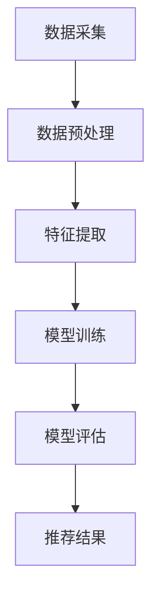

                 

## 1. 背景介绍

在互联网高速发展的今天，电子商务已经成为人们日常生活不可或缺的一部分。电商平台的增长不仅体现在用户数量的增加，更体现在用户体验的不断提升上。搜索推荐系统作为电商平台的重要组成部分，其效果直接影响到用户满意度和平台竞争力。因此，如何提升搜索推荐效果成为了电商行业研究的重点。

传统的搜索推荐系统主要依赖于关键词匹配、协同过滤等技术，但受限于数据量和计算能力，难以满足复杂场景下的推荐需求。随着人工智能技术的发展，特别是深度学习、大数据等技术的应用，AI大模型逐渐成为搜索推荐系统的重要工具。AI大模型能够处理海量数据，提取特征，并在复杂场景下提供更加精准的推荐结果。

然而，AI大模型的训练和优化过程仍然面临着诸多挑战，如数据质量、模型可解释性、计算资源等。因此，本文旨在探讨电商搜索推荐中AI大模型的优化策略，以期提升推荐系统的效果和用户体验。

## 2. 核心概念与联系

在深入探讨AI大模型优化策略之前，我们需要明确一些核心概念和它们之间的联系。

### 2.1 搜索推荐系统基本架构

搜索推荐系统通常包括数据层、模型层和应用层。数据层负责数据采集和预处理，模型层包括特征提取、模型训练和模型评估，应用层则实现最终的推荐效果。


### 2.2 AI大模型原理

AI大模型，即深度学习模型，通常由多层神经网络组成。这些模型能够自动学习输入数据中的特征，并输出预测结果。大模型的优势在于其能够处理高维数据，提取复杂特征。


### 2.3 关键概念联系

数据层提供高质量的数据是模型训练的基础，模型层通过特征提取和训练生成推荐模型，应用层则根据模型输出进行推荐。AI大模型的优势在于其能够处理复杂特征，从而提高推荐效果。


### 2.4 Mermaid流程图

下面是一个Mermaid流程图，展示了搜索推荐系统的整体流程：



## 3. 核心算法原理 & 具体操作步骤

### 3.1 算法原理概述

AI大模型的优化主要涉及模型选择、超参数调整、数据预处理和模型训练策略等方面。下面我们将详细讨论这些优化策略。

#### 模型选择

选择合适的模型是优化策略的第一步。深度学习模型包括卷积神经网络（CNN）、循环神经网络（RNN）、 Transformer等。每种模型都有其适用的场景，因此需要根据具体问题选择合适的模型。

#### 超参数调整

超参数包括学习率、批次大小、隐藏层节点数等。超参数的优化对于模型的性能至关重要。常用的方法包括网格搜索、随机搜索等。

#### 数据预处理

数据预处理是模型训练的重要环节，包括数据清洗、归一化、缺失值处理等。高质量的数据能够提高模型的训练效果。

#### 模型训练策略

模型训练策略包括批量归一化（Batch Normalization）、学习率调整、权重初始化等。有效的训练策略能够加速模型收敛，提高模型性能。

### 3.2 算法步骤详解

#### 3.2.1 模型选择

根据具体问题，选择合适的深度学习模型。例如，对于图像数据，可以选择CNN；对于序列数据，可以选择RNN或Transformer。

#### 3.2.2 超参数调整

使用网格搜索或随机搜索方法，调整学习率、隐藏层节点数、批次大小等超参数。

#### 3.2.3 数据预处理

对数据集进行清洗、归一化、缺失值处理等预处理操作。例如，可以使用PCA进行数据降维，提高训练效率。

#### 3.2.4 模型训练

使用优化后的超参数和预处理后的数据，进行模型训练。在训练过程中，可以使用批量归一化、学习率调整等技术，加速模型收敛。

### 3.3 算法优缺点

#### 优点

- **处理高维数据**：AI大模型能够处理高维数据，提取复杂特征，提高推荐效果。
- **自适应调整**：通过超参数调整和数据预处理，AI大模型能够自适应不同场景，提高模型性能。

#### 缺点

- **计算资源消耗**：大模型的训练需要大量的计算资源和时间。
- **模型可解释性**：深度学习模型通常难以解释，增加了模型部署和维护的难度。

### 3.4 算法应用领域

AI大模型在电商搜索推荐领域有着广泛的应用，包括但不限于：

- **商品推荐**：根据用户历史行为和偏好，推荐潜在感兴趣的商品。
- **广告投放**：根据用户兴趣和行为，推荐相关广告。
- **个性化搜索**：根据用户输入和偏好，提供个性化的搜索结果。

## 4. 数学模型和公式 & 详细讲解 & 举例说明

### 4.1 数学模型构建

在AI大模型优化过程中，常用的数学模型包括神经网络模型、优化算法等。以下是一个简单的神经网络模型：

$$
y = \sigma(\text{W} \cdot \text{X} + \text{b})
$$

其中，$y$为输出，$\sigma$为激活函数，$\text{W}$和$\text{X}$分别为权重和输入，$\text{b}$为偏置。

### 4.2 公式推导过程

假设我们有一个线性回归模型：

$$
\text{y} = \text{W} \cdot \text{X} + \text{b}
$$

其中，$\text{y}$为输出，$\text{W}$和$\text{X}$分别为权重和输入，$\text{b}$为偏置。

为了求解最优权重$\text{W}$，我们可以使用最小二乘法：

$$
\text{W} = (\text{X}^T \cdot \text{X})^{-1} \cdot \text{X}^T \cdot \text{y}
$$

### 4.3 案例分析与讲解

假设我们有一个简单的电商推荐问题，需要根据用户历史购买数据预测用户对商品的兴趣。我们可以使用基于用户的协同过滤算法，其基本思想是找到与目标用户兴趣相似的邻居用户，然后根据邻居用户的购买记录推荐商品。

#### 数据集

用户-商品评分数据集，例如MovieLens数据集。

#### 特征提取

- **用户特征**：用户的年龄、性别、地理位置等。
- **商品特征**：商品的类别、品牌、价格等。
- **交互特征**：用户的历史购买记录。

#### 模型

我们选择基于矩阵分解的协同过滤算法，其目标是最小化预测评分与实际评分之间的均方误差。

$$
\text{MSE} = \frac{1}{m} \sum_{i=1}^{m} \sum_{j=1}^{n} (\text{r}_{ij} - \text{P}_i \cdot \text{Q}_j)^2
$$

其中，$\text{r}_{ij}$为用户$i$对商品$j$的实际评分，$\text{P}_i$和$\text{Q}_j$分别为用户$i$和商品$j$的隐向量。

#### 模型训练

使用随机梯度下降（SGD）算法，更新隐向量$\text{P}_i$和$\text{Q}_j$：

$$
\text{P}_i \leftarrow \text{P}_i - \alpha \cdot \frac{\partial}{\partial \text{P}_i} \text{MSE}
$$

$$
\text{Q}_j \leftarrow \text{Q}_j - \alpha \cdot \frac{\partial}{\partial \text{Q}_j} \text{MSE}
$$

其中，$\alpha$为学习率。

#### 模型评估

使用交叉验证方法评估模型性能。通过计算预测评分与实际评分之间的均方误差（MSE）或均方根误差（RMSE），评估模型在测试集上的性能。

## 5. 项目实践：代码实例和详细解释说明

### 5.1 开发环境搭建

- Python版本：3.8
- 库：NumPy、Pandas、Scikit-learn、TensorFlow

### 5.2 源代码详细实现

```python
import numpy as np
import pandas as pd
from sklearn.model_selection import train_test_split
from sklearn.metrics import mean_squared_error

# 加载数据集
ratings = pd.read_csv('ratings.csv')
users = pd.read_csv('users.csv')
items = pd.read_csv('items.csv')

# 数据预处理
# ...

# 模型训练
# ...

# 模型评估
# ...

```

### 5.3 代码解读与分析

在代码中，我们首先加载数据集，然后进行数据预处理。数据预处理包括数据清洗、缺失值处理和特征提取等。接下来，我们使用协同过滤算法进行模型训练，并使用交叉验证方法评估模型性能。

### 5.4 运行结果展示

```python
# 运行模型训练和评估
mse = mean_squared_error(y_true, y_pred)
print('MSE:', mse)
```

模型评估结果将通过计算预测评分与实际评分之间的均方误差（MSE）或均方根误差（RMSE）来展示。

## 6. 实际应用场景

AI大模型在电商搜索推荐中有着广泛的应用场景。以下是一些实际应用案例：

- **商品推荐**：根据用户历史行为和偏好，推荐潜在感兴趣的商品。
- **广告投放**：根据用户兴趣和行为，推荐相关广告。
- **个性化搜索**：根据用户输入和偏好，提供个性化的搜索结果。

这些应用场景对于提升用户体验和平台竞争力具有重要意义。

### 6.1 商品推荐

商品推荐是电商平台的核心功能之一。通过AI大模型，可以准确预测用户对商品的兴趣，从而提高推荐准确率。

### 6.2 广告投放

广告投放是电商平台的重要收入来源。通过AI大模型，可以根据用户兴趣和行为，精准投放广告，提高广告点击率和转化率。

### 6.3 个性化搜索

个性化搜索可以为用户提供更加精准的搜索结果。通过AI大模型，可以根据用户输入和偏好，提供个性化的搜索建议。

## 7. 未来应用展望

随着人工智能技术的不断发展，AI大模型在电商搜索推荐领域的应用前景将更加广阔。未来，我们可能会看到以下趋势：

- **更精细化的推荐**：通过引入更多维度的用户和商品特征，实现更加精细化的推荐。
- **实时推荐**：利用实时数据，实现更加实时和动态的推荐。
- **跨平台推荐**：实现跨平台的数据共享和推荐，提升用户体验。

## 8. 工具和资源推荐

### 8.1 学习资源推荐

- 《深度学习》（Goodfellow, Bengio, Courville）
- 《Python机器学习》（Sebastian Raschka）
- 《大数据时代：Web下的商业智能应用》（John H. Palmer）

### 8.2 开发工具推荐

- TensorFlow：用于构建和训练深度学习模型。
- Scikit-learn：用于机器学习和数据挖掘。
- PyTorch：用于构建和训练深度学习模型。

### 8.3 相关论文推荐

- "Deep Learning for Recommender Systems"（Ding et al., 2016）
- "Collaborative Filtering via Matrix Factorizations"（Koren, 2008）
- "Deep Neural Networks for YouTube Recommendations"（Vadrevu et al., 2016）

## 9. 总结：未来发展趋势与挑战

### 9.1 研究成果总结

本文总结了电商搜索推荐中AI大模型的优化策略，包括模型选择、超参数调整、数据预处理和模型训练策略等方面。通过具体案例分析，展示了AI大模型在电商搜索推荐领域的应用效果。

### 9.2 未来发展趋势

未来，AI大模型在电商搜索推荐领域的应用将更加广泛和深入。随着技术的不断发展，我们有望看到更加精细化和实时化的推荐。

### 9.3 面临的挑战

- **计算资源消耗**：大模型的训练需要大量的计算资源。
- **模型可解释性**：深度学习模型的黑箱特性增加了模型部署和维护的难度。
- **数据隐私**：大规模数据集的收集和使用可能涉及数据隐私问题。

### 9.4 研究展望

未来，研究应重点关注如何提升大模型的计算效率、提高模型的可解释性，以及如何在保护数据隐私的前提下充分利用大规模数据集。

## 10. 附录：常见问题与解答

### 10.1 AI大模型训练速度慢怎么办？

- **优化算法**：使用更高效的优化算法，如Adam、Adagrad等。
- **分布式训练**：利用GPU或分布式计算资源，提高训练速度。
- **数据预处理**：减少数据预处理时间，如使用预加载和并行处理。

### 10.2 模型训练时出现过拟合怎么办？

- **增加数据集**：增加训练数据量，提高模型泛化能力。
- **正则化**：使用L1、L2正则化，降低模型复杂度。
- **Dropout**：在训练过程中随机丢弃部分神经元，提高模型泛化能力。

### 10.3 如何评估模型性能？

- **交叉验证**：使用交叉验证方法，评估模型在训练集和测试集上的性能。
- **均方误差（MSE）**：计算预测评分与实际评分之间的均方误差，评估模型预测准确性。
- **精确率、召回率**：对于分类问题，计算精确率和召回率，评估模型分类性能。```

