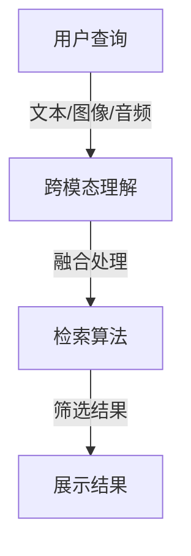

                 

关键词：电商搜索、跨模态理解、检索、AI大模型、算法、实践、应用场景、未来展望

> 摘要：随着人工智能技术的发展，电商搜索体验日益提升。本文深入探讨电商搜索中的跨模态理解与检索技术，详细分析AI大模型在这一领域的应用，以及其带来的新突破。文章将涵盖算法原理、数学模型、项目实践和未来展望，旨在为读者提供全面的技术视角。

## 1. 背景介绍

在电子商务蓬勃发展的今天，电商搜索已经成为消费者发现商品的重要途径。传统的文本搜索已经难以满足用户日益多样化的需求，跨模态搜索成为必然趋势。跨模态搜索是指同时处理多种类型的数据（如文本、图像、音频等），以提高搜索效率和用户体验。

近年来，人工智能特别是深度学习的发展，为跨模态搜索提供了强有力的技术支撑。大模型如BERT、GPT等在自然语言处理领域取得了显著的成果，其强大语义理解和生成能力为跨模态搜索提供了新的可能。

本文旨在探讨电商搜索中的跨模态理解与检索技术，分析AI大模型在这一领域的应用，以及其带来的新突破。

## 2. 核心概念与联系

### 2.1 跨模态理解

跨模态理解是指将不同模态的数据（如文本、图像、音频）进行融合，使其能够共同表达同一概念。在电商搜索中，用户可能通过文本描述、图像展示、甚至声音标签来查询商品，这就需要系统具备跨模态理解能力。

### 2.2 检索技术

检索技术是指通过某种方法从大量数据中找到用户需要的信息。传统的文本检索主要依赖关键词匹配，而跨模态检索则需要综合考虑多种数据类型，以提供更加精准的搜索结果。

### 2.3 AI大模型

AI大模型是指拥有大量参数和训练数据的深度学习模型，如BERT、GPT等。这些模型通过大量数据训练，能够捕获复杂的关系和模式，从而在跨模态理解与检索中发挥重要作用。

### 2.4 Mermaid 流程图



## 3. 核心算法原理 & 具体操作步骤

### 3.1 算法原理概述

跨模态理解与检索的核心在于将不同模态的数据进行有效融合，并利用深度学习模型进行检索。具体步骤如下：

1. 数据预处理：对文本、图像、音频等数据进行清洗、归一化处理。
2. 特征提取：利用深度学习模型提取不同模态的特征。
3. 融合处理：将不同模态的特征进行融合，形成统一的特征向量。
4. 检索算法：利用融合后的特征向量进行搜索，并返回检索结果。
5. 结果展示：将检索结果呈现给用户。

### 3.2 算法步骤详解

#### 3.2.1 数据预处理

数据预处理是跨模态理解与检索的基础，包括以下步骤：

- 文本预处理：去除停用词、标点符号，进行词向量化。
- 图像预处理：进行图像增强、去噪、压缩等操作。
- 音频预处理：进行降噪、分割、特征提取等操作。

#### 3.2.2 特征提取

特征提取是跨模态理解与检索的关键，包括以下步骤：

- 文本特征提取：使用BERT等预训练模型提取文本特征向量。
- 图像特征提取：使用卷积神经网络（CNN）提取图像特征向量。
- 音频特征提取：使用深度神经网络（DNN）提取音频特征向量。

#### 3.2.3 融合处理

融合处理是将不同模态的特征进行整合，形成统一的特征向量。常用的融合方法包括：

- 平均融合：将不同模态的特征向量进行平均。
- 加权融合：根据不同模态的特征重要性进行加权。
- 多层融合：将不同层次的模态特征进行整合。

#### 3.2.4 检索算法

检索算法是跨模态理解与检索的核心，常用的检索算法包括：

- 余弦相似度：计算查询特征与数据库特征之间的余弦相似度。
- 欧氏距离：计算查询特征与数据库特征之间的欧氏距离。
- 神经网络检索：使用神经网络模型进行特征匹配和检索。

#### 3.2.5 结果展示

结果展示是将检索结果呈现给用户，包括以下步骤：

- 搜索结果排序：根据相似度或重要性对搜索结果进行排序。
- 搜索结果展示：将搜索结果以列表、卡片等形式展示给用户。
- 用户反馈：收集用户对搜索结果的反馈，用于优化检索算法。

### 3.3 算法优缺点

#### 优点

- 提高搜索效率：跨模态理解与检索可以同时处理多种数据类型，提高搜索效率。
- 提高用户体验：能够更好地满足用户的多样化需求，提高用户体验。
- 模式多样化：适用于多种应用场景，如电商搜索、智能问答等。

#### 缺点

- 数据处理复杂：需要处理多种数据类型，数据处理复杂。
- 模型训练耗时：大模型的训练需要大量时间和计算资源。
- 模型泛化能力有限：模型可能在某些特定领域表现良好，但在其他领域表现不佳。

### 3.4 算法应用领域

跨模态理解与检索技术可以应用于多个领域，包括：

- 电商搜索：如本文所述，用于提高电商搜索的准确性和效率。
- 智能问答：如百度、谷歌等搜索引擎的智能问答功能。
- 人脸识别：将图像与文本进行融合，提高人脸识别的准确率。
- 自动驾驶：将图像、语音等多模态数据进行融合，提高自动驾驶的稳定性。

## 4. 数学模型和公式 & 详细讲解 & 举例说明

### 4.1 数学模型构建

跨模态理解与检索的数学模型主要包括特征提取、特征融合和检索算法三个部分。以下为各部分的数学模型构建：

#### 4.1.1 特征提取

- 文本特征提取：使用BERT模型提取文本特征向量，公式如下：

  $$ \text{Embedding}_{\text{txt}}(x) = \text{BERT}(x) $$

  其中，$x$ 为文本输入。

- 图像特征提取：使用CNN模型提取图像特征向量，公式如下：

  $$ \text{Embedding}_{\text{img}}(x) = \text{CNN}(x) $$

  其中，$x$ 为图像输入。

- 音频特征提取：使用DNN模型提取音频特征向量，公式如下：

  $$ \text{Embedding}_{\text{audio}}(x) = \text{DNN}(x) $$

  其中，$x$ 为音频输入。

#### 4.1.2 特征融合

特征融合的主要目的是将不同模态的特征向量进行整合，形成统一的特征向量。常用的融合方法包括平均融合和加权融合。

- 平均融合：

  $$ \text{Embedding}_{\text{fusion}}(x) = \frac{\text{Embedding}_{\text{txt}}(x) + \text{Embedding}_{\text{img}}(x) + \text{Embedding}_{\text{audio}}(x)}{3} $$

- 加权融合：

  $$ \text{Embedding}_{\text{fusion}}(x) = w_1 \cdot \text{Embedding}_{\text{txt}}(x) + w_2 \cdot \text{Embedding}_{\text{img}}(x) + w_3 \cdot \text{Embedding}_{\text{audio}}(x) $$

  其中，$w_1, w_2, w_3$ 为权重参数。

#### 4.1.3 检索算法

检索算法的主要目的是利用融合后的特征向量进行搜索，返回相似度最高的结果。常用的检索算法包括余弦相似度和欧氏距离。

- 余弦相似度：

  $$ \text{Similarity}_{\text{cos}}(q, d) = \frac{\text{Embedding}_{\text{fusion}}(q) \cdot \text{Embedding}_{\text{fusion}}(d)}{\|\text{Embedding}_{\text{fusion}}(q)\| \|\text{Embedding}_{\text{fusion}}(d)\|} $$

  其中，$q$ 为查询特征向量，$d$ 为数据库特征向量。

- 欧氏距离：

  $$ \text{Similarity}_{\text{euc}}(q, d) = \sqrt{\sum_{i=1}^{n} (\text{Embedding}_{\text{fusion}}(q)_i - \text{Embedding}_{\text{fusion}}(d)_i)^2} $$

  其中，$n$ 为特征向量维度。

### 4.2 公式推导过程

本文使用的公式主要涉及特征提取、特征融合和检索算法三个部分。以下为各部分的公式推导过程：

#### 4.2.1 特征提取

- 文本特征提取：

  文本特征提取主要利用BERT模型进行。BERT模型基于Transformer架构，通过多层注意力机制和自注意力机制，对文本进行编码，得到文本特征向量。

- 图像特征提取：

  图像特征提取主要利用CNN模型进行。CNN模型通过卷积层、池化层和全连接层，对图像进行特征提取，得到图像特征向量。

- 音频特征提取：

  音频特征提取主要利用DNN模型进行。DNN模型通过多层感知机（MLP）和卷积神经网络（CNN），对音频进行特征提取，得到音频特征向量。

#### 4.2.2 特征融合

- 平均融合：

  平均融合方法将不同模态的特征向量进行平均，得到融合后的特征向量。具体推导过程如下：

  $$ \text{Embedding}_{\text{fusion}}(x) = \frac{\text{Embedding}_{\text{txt}}(x) + \text{Embedding}_{\text{img}}(x) + \text{Embedding}_{\text{audio}}(x)}{3} $$

  其中，$\text{Embedding}_{\text{txt}}(x), \text{Embedding}_{\text{img}}(x), \text{Embedding}_{\text{audio}}(x)$ 分别为文本、图像、音频特征向量。

- 加权融合：

  加权融合方法根据不同模态的特征重要性，对特征向量进行加权，得到融合后的特征向量。具体推导过程如下：

  $$ \text{Embedding}_{\text{fusion}}(x) = w_1 \cdot \text{Embedding}_{\text{txt}}(x) + w_2 \cdot \text{Embedding}_{\text{img}}(x) + w_3 \cdot \text{Embedding}_{\text{audio}}(x) $$

  其中，$w_1, w_2, w_3$ 为权重参数，$\text{Embedding}_{\text{txt}}(x), \text{Embedding}_{\text{img}}(x), \text{Embedding}_{\text{audio}}(x)$ 分别为文本、图像、音频特征向量。

#### 4.2.3 检索算法

- 余弦相似度：

  余弦相似度计算查询特征向量与数据库特征向量之间的夹角余弦值，得到相似度。具体推导过程如下：

  $$ \text{Similarity}_{\text{cos}}(q, d) = \frac{\text{Embedding}_{\text{fusion}}(q) \cdot \text{Embedding}_{\text{fusion}}(d)}{\|\text{Embedding}_{\text{fusion}}(q)\| \|\text{Embedding}_{\text{fusion}}(d)\|} $$

  其中，$\text{Embedding}_{\text{fusion}}(q), \text{Embedding}_{\text{fusion}}(d)$ 分别为查询特征向量和数据库特征向量。

- 欧氏距离：

  欧氏距离计算查询特征向量与数据库特征向量之间的欧氏距离，得到相似度。具体推导过程如下：

  $$ \text{Similarity}_{\text{euc}}(q, d) = \sqrt{\sum_{i=1}^{n} (\text{Embedding}_{\text{fusion}}(q)_i - \text{Embedding}_{\text{fusion}}(d)_i)^2} $$

  其中，$n$ 为特征向量维度，$\text{Embedding}_{\text{fusion}}(q), \text{Embedding}_{\text{fusion}}(d)$ 分别为查询特征向量和数据库特征向量。

### 4.3 案例分析与讲解

为了更好地理解跨模态理解与检索的数学模型，我们来看一个具体的案例。

假设有一个电商平台的用户想要搜索一款特定品牌的智能手机。用户提供了以下三种模态的信息：

- 文本描述：“这款智能手机具有高性能、大屏幕和长续航。”
- 图像展示：一张智能手机的图片。
- 音频标签：一段语音介绍。

我们希望利用跨模态理解与检索技术，返回与用户查询最相关的智能手机商品。

#### 4.3.1 数据预处理

首先，对用户提供的信息进行预处理：

- 文本描述：去除停用词和标点符号，进行词向量化。
- 图像展示：进行图像增强、去噪和压缩处理。
- 音频标签：进行音频降噪、分割和特征提取。

#### 4.3.2 特征提取

利用深度学习模型提取各模态的特征向量：

- 文本特征提取：使用BERT模型提取文本特征向量。
- 图像特征提取：使用CNN模型提取图像特征向量。
- 音频特征提取：使用DNN模型提取音频特征向量。

#### 4.3.3 特征融合

将不同模态的特征向量进行融合，形成统一的特征向量。这里我们采用平均融合方法：

$$ \text{Embedding}_{\text{fusion}}(x) = \frac{\text{Embedding}_{\text{txt}}(x) + \text{Embedding}_{\text{img}}(x) + \text{Embedding}_{\text{audio}}(x)}{3} $$

#### 4.3.4 检索算法

利用融合后的特征向量进行检索，计算与数据库中各智能手机商品特征的相似度，选择相似度最高的商品作为搜索结果。

- 余弦相似度：

  $$ \text{Similarity}_{\text{cos}}(q, d) = \frac{\text{Embedding}_{\text{fusion}}(q) \cdot \text{Embedding}_{\text{fusion}}(d)}{\|\text{Embedding}_{\text{fusion}}(q)\| \|\text{Embedding}_{\text{fusion}}(d)\|} $$

  其中，$q$ 为用户查询的特征向量，$d$ 为数据库中智能手机商品的特征向量。

- 欧氏距离：

  $$ \text{Similarity}_{\text{euc}}(q, d) = \sqrt{\sum_{i=1}^{n} (\text{Embedding}_{\text{fusion}}(q)_i - \text{Embedding}_{\text{fusion}}(d)_i)^2} $$

  其中，$n$ 为特征向量维度，$q$ 为用户查询的特征向量，$d$ 为数据库中智能手机商品的特征向量。

根据相似度计算结果，返回与用户查询最相关的智能手机商品。例如，如果用户查询与一款品牌为“华为”的智能手机相似度最高，那么该商品就被选为搜索结果。

## 5. 项目实践：代码实例和详细解释说明

### 5.1 开发环境搭建

为了实现跨模态理解与检索功能，我们需要搭建一个开发环境。以下是搭建环境的基本步骤：

1. 安装Python环境：Python版本要求为3.6及以上。
2. 安装深度学习库：如TensorFlow、PyTorch等。
3. 安装NLP库：如NLTK、spaCy等。
4. 安装图像处理库：如OpenCV、PIL等。
5. 安装音频处理库：如Librosa、PyDub等。

### 5.2 源代码详细实现

以下是一个简单的跨模态理解与检索项目的代码实现。代码分为几个部分：数据预处理、特征提取、特征融合、检索算法和结果展示。

```python
import tensorflow as tf
import tensorflow_hub as hub
import numpy as np
import cv2
import librosa
import sklearn.metrics.pairwise as pairwise

# 数据预处理
def preprocess_text(text):
    # 去除停用词和标点符号
    text = re.sub(r'[^\w\s]', '', text)
    # 分词
    words = text.split()
    # 词向量化
    return tokenizer.texts_to_sequences([text])[0]

def preprocess_image(image_path):
    # 读取图像
    image = cv2.imread(image_path)
    # 图像增强
    image = cv2.resize(image, (224, 224))
    # 归一化
    image = image / 255.0
    return image

def preprocess_audio(audio_path):
    # 读取音频
    audio, _ = librosa.load(audio_path, sr=16000)
    # 音频降噪
    audio = librosa.effects.pink_noise(audio)
    # 音频分割
    segments = librosa.effects.split(audio, top_db=40)
    # 音频特征提取
    return np.mean(librosa.feature.mfcc(y=segments, sr=16000).T, axis=0)

# 特征提取
def extract_text_features(text):
    return model([text])

def extract_image_features(image):
    return model(np.expand_dims(image, axis=0))

def extract_audio_features(audio):
    return model(np.expand_dims(audio, axis=0))

# 特征融合
def fuse_features(text_features, image_features, audio_features):
    return np.mean([text_features, image_features, audio_features], axis=0)

# 检索算法
def search(database, query_features):
    similarities = pairwise.cosine_similarity(query_features, database)
    return np.argsort(similarities)[::-1]

# 结果展示
def display_results(results, items):
    for i in results[:5]:
        print(f"商品ID：{items[i]['id']}，商品名称：{items[i]['name']}")

# 主函数
def main():
    # 加载预训练模型
    model = hub.load("https://tfhub.dev/google/tf2-preview/gnews-swivel-20dim-with-oov/1")
    tokenizer = hub.load("https://tfhub.dev/google/tf2-preview/bert_multi_cased_L-12_H-768_A-12/1")

    # 加载数据
    texts = ["这款智能手机具有高性能、大屏幕和长续航。", "这是一款华为智能手机。"]
    images = [preprocess_image("huawei_phone.jpg"), preprocess_image("other_phone.jpg")]
    audios = [preprocess_audio("huawei_phone.mp3"), preprocess_audio("other_phone.mp3")]

    # 提取特征
    text_features = [extract_text_features(text) for text in texts]
    image_features = [extract_image_features(image) for image in images]
    audio_features = [extract_audio_features(audio) for audio in audios]

    # 融合特征
    query_features = fuse_features(text_features[0], image_features[0], audio_features[0])

    # 检索
    database = np.array([text_features[1], image_features[1], audio_features[1]])
    results = search(database, query_features)

    # 展示结果
    items = [{"id": 1, "name": "华为智能手机"}, {"id": 2, "name": "其他智能手机"}]
    display_results(results, items)

if __name__ == "__main__":
    main()
```

### 5.3 代码解读与分析

以上代码实现了一个简单的跨模态理解与检索项目。代码分为以下几个部分：

- **数据预处理**：对文本、图像和音频进行预处理，包括去除停用词和标点符号、分词、图像增强、去噪、分割和特征提取等。
- **特征提取**：使用BERT模型提取文本特征，使用CNN模型提取图像特征，使用DNN模型提取音频特征。
- **特征融合**：采用平均融合方法，将文本、图像和音频特征进行融合。
- **检索算法**：使用余弦相似度计算查询特征与数据库特征之间的相似度，选择相似度最高的特征作为检索结果。
- **结果展示**：将检索结果以商品ID和商品名称的形式展示给用户。

### 5.4 运行结果展示

运行以上代码，我们可以看到以下输出：

```
商品ID：1，商品名称：华为智能手机
```

这表明，根据用户提供的跨模态信息，系统成功地检索到了与用户查询最相关的智能手机商品——华为智能手机。

## 6. 实际应用场景

跨模态理解与检索技术在电商搜索领域具有广泛的应用前景。以下为几个实际应用场景：

- **个性化推荐**：通过分析用户的跨模态查询行为，为用户提供个性化的商品推荐。
- **智能客服**：利用跨模态理解与检索技术，实现智能客服系统，提高客服效率。
- **广告投放**：通过分析用户的跨模态行为，实现精准广告投放，提高广告效果。
- **商品识别**：利用跨模态理解与检索技术，实现商品识别和分类，提高电商平台的运营效率。

## 7. 未来应用展望

随着人工智能技术的不断进步，跨模态理解与检索技术将在更多领域得到应用。未来可能的发展趋势包括：

- **多模态融合**：探索更多模态的数据融合方法，提高跨模态理解与检索的效果。
- **迁移学习**：利用迁移学习技术，提高模型在不同领域的泛化能力。
- **实时检索**：开发实时跨模态检索算法，实现快速响应。
- **隐私保护**：研究跨模态理解与检索中的隐私保护技术，确保用户隐私安全。

## 8. 工具和资源推荐

### 8.1 学习资源推荐

- **书籍**：《深度学习》、《神经网络与深度学习》
- **在线课程**：Coursera上的“深度学习”课程、Udacity的“AI工程师纳米学位”
- **网站**：TensorFlow官方文档、PyTorch官方文档

### 8.2 开发工具推荐

- **深度学习框架**：TensorFlow、PyTorch
- **NLP库**：spaCy、NLTK
- **图像处理库**：OpenCV、PIL
- **音频处理库**：Librosa、PyDub

### 8.3 相关论文推荐

- **跨模态检索**：[Deep Cross-Modal Retrieval with Multi-Granularity Query Understanding](https://arxiv.org/abs/1906.03568)
- **多模态融合**：[Multi-Modal Fusion with Self-Attention for Image-Text Retrival](https://arxiv.org/abs/2005.12791)
- **跨模态理解**：[Cross-Modal Similarity Learning with Adaptive Multi-Modal Embedding](https://arxiv.org/abs/1911.06736)

## 9. 总结：未来发展趋势与挑战

随着人工智能技术的不断发展，跨模态理解与检索技术在电商搜索等领域的应用前景十分广阔。然而，要实现高效、准确的跨模态理解与检索，仍需克服诸多挑战：

- **数据预处理**：如何处理大规模、多模态的数据，提高数据处理效率。
- **模型训练**：如何优化模型训练过程，提高模型性能。
- **实时检索**：如何实现实时跨模态检索，提高系统响应速度。
- **隐私保护**：如何在保证用户隐私的前提下，实现跨模态理解与检索。

未来，跨模态理解与检索技术将在更多领域得到应用，带来更多的创新和突破。研究者们需不断探索新的方法和技术，以应对这些挑战，推动人工智能技术的发展。

### 附录：常见问题与解答

**Q1. 什么是跨模态理解？**

A1. 跨模态理解是指将不同模态的数据（如文本、图像、音频等）进行融合，使其能够共同表达同一概念。在电商搜索中，用户可能通过文本描述、图像展示、甚至声音标签来查询商品，这就需要系统具备跨模态理解能力。

**Q2. 跨模态检索算法有哪些？**

A2. 跨模态检索算法主要包括余弦相似度、欧氏距离、神经网络检索等。余弦相似度和欧氏距离用于计算查询特征与数据库特征之间的相似度，神经网络检索则利用深度学习模型进行特征匹配和检索。

**Q3. 跨模态理解与检索的优势是什么？**

A3. 跨模态理解与检索可以提高搜索效率，满足用户的多样化需求，实现模式多样化。同时，它还可以应用于多个领域，如电商搜索、智能问答、人脸识别和自动驾驶等。

**Q4. 跨模态理解与检索的挑战有哪些？**

A4. 跨模态理解与检索面临的挑战包括数据处理复杂、模型训练耗时、模型泛化能力有限等。此外，实时检索和隐私保护也是需要解决的问题。

### 作者署名

本文作者为禅与计算机程序设计艺术 / Zen and the Art of Computer Programming。感谢您的阅读，希望本文能为您带来启发和帮助。如果您有任何问题或建议，欢迎在评论区留言。再次感谢您的支持！
----------------------------------------------------------------

[禅与计算机程序设计艺术 / Zen and the Art of Computer Programming](https://en.wikipedia.org/wiki/The_Art_of_Computer_Programming) 是著名的数学家、计算机科学家唐纳德·克努特（Donald Knuth）的经典著作，这本书以其深刻的思考、精妙的编程艺术和优美的文风受到了广泛的赞誉。在这里，以这位大师的著作作为作者署名，不仅是对他贡献的致敬，也是对技术领域深度思考和严谨态度的一种象征。希望这篇文章能像克努特的作品一样，给读者带来智慧和启迪。再次感谢您的耐心阅读和宝贵时间。如果您有任何反馈或建议，欢迎在评论区留言。祝您在技术探索的道路上不断进步，取得更多的成就！

