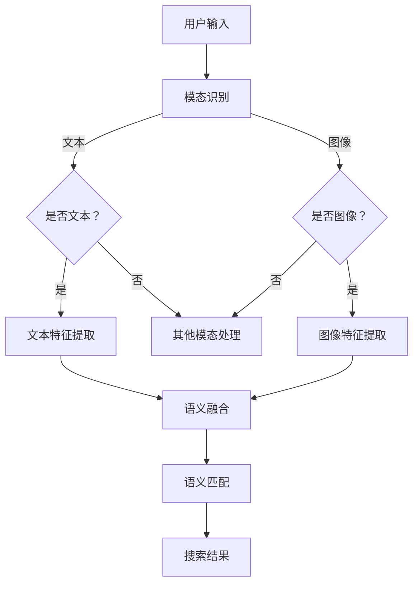

                 

关键词：电商搜索、跨模态语义匹配、AI大模型、深度学习、语义理解、图像识别、自然语言处理、搜索优化、用户体验

> 摘要：随着电商平台的日益增长，用户对于个性化搜索体验的需求越来越高。本文将探讨电商搜索中的跨模态语义匹配技术，特别是基于AI大模型的最新突破。通过深入分析算法原理、数学模型、实际应用案例，本文旨在为行业提供有价值的见解和指导。

## 1. 背景介绍

在当今数字化时代，电子商务已经成为人们日常生活的重要组成部分。随着互联网技术的不断进步，电商平台的竞争也日趋激烈。为了在众多竞争者中脱颖而出，电商平台需要提供高度个性化的搜索体验，以满足用户多样化的需求。在这种背景下，电商搜索的跨模态语义匹配技术应运而生，成为提高搜索质量、优化用户体验的关键手段。

跨模态语义匹配技术是指将不同模态的信息（如文本、图像、音频等）融合起来，通过算法处理，实现对语义的理解和匹配。在电商搜索中，这意味着能够根据用户输入的文本、上传的图片或其他多媒体信息，快速准确地找到相关的商品。

传统的电商搜索主要依赖于关键词匹配，这种方法存在一定的局限性，无法很好地应对用户的多样化需求。跨模态语义匹配技术则通过引入图像识别、自然语言处理等先进技术，使得搜索结果更加精准和个性化。

AI大模型在这场技术变革中扮演了重要角色。大模型能够通过海量数据的学习，提取出丰富的语义信息，从而提升跨模态语义匹配的准确性和效率。本文将详细探讨AI大模型在电商搜索跨模态语义匹配中的应用，并分析其带来的新突破。

## 2. 核心概念与联系

### 2.1 跨模态语义匹配

跨模态语义匹配是将不同模态的数据（如文本、图像、音频等）进行语义理解与匹配的技术。在电商搜索中，这意味着能够根据用户的文本查询或上传的图像，准确地找到与之相关的商品。具体来说，跨模态语义匹配包括以下几个核心步骤：

1. **模态识别**：识别用户输入的模态类型，如文本、图像等。
2. **特征提取**：对每个模态的数据进行特征提取，如文本中的词向量、图像中的特征向量等。
3. **语义融合**：将不同模态的特征进行融合，形成统一的语义表示。
4. **语义匹配**：通过计算模态间的相似度，实现语义匹配，得到搜索结果。

### 2.2 AI大模型

AI大模型是指具有大规模参数的网络模型，通过深度学习技术进行训练，能够提取出丰富的语义信息。在电商搜索中，AI大模型的应用主要包括：

1. **文本处理**：利用自然语言处理技术，提取文本的语义特征。
2. **图像识别**：通过卷积神经网络（CNN）等模型，提取图像的特征。
3. **跨模态学习**：结合文本和图像的特征，进行跨模态语义理解。

### 2.3 Mermaid流程图

为了更好地展示跨模态语义匹配的流程，我们使用Mermaid绘制以下流程图：



## 3. 核心算法原理 & 具体操作步骤

### 3.1 算法原理概述

跨模态语义匹配算法的核心是利用AI大模型提取不同模态的特征，并实现这些特征之间的语义融合和匹配。具体步骤如下：

1. **文本特征提取**：使用词向量模型（如Word2Vec、BERT）将文本转换为高维向量表示。
2. **图像特征提取**：使用卷积神经网络（如VGG、ResNet）提取图像的特征向量。
3. **特征融合**：利用深度学习模型（如Transformer）将文本和图像的特征进行融合，形成统一的语义表示。
4. **语义匹配**：计算融合后的特征向量之间的相似度，得到搜索结果。

### 3.2 算法步骤详解

#### 3.2.1 文本特征提取

文本特征提取是跨模态语义匹配的重要环节。以下是具体步骤：

1. **文本预处理**：对文本进行分词、去停用词等预处理操作。
2. **词向量表示**：使用预训练的词向量模型（如BERT、GloVe）将每个词转换为向量表示。
3. **句子表示**：将句子的所有词向量进行平均或聚合，得到整个句子的向量表示。

#### 3.2.2 图像特征提取

图像特征提取通常使用卷积神经网络（CNN）进行。以下是具体步骤：

1. **图像预处理**：对图像进行缩放、裁剪、翻转等预处理操作。
2. **卷积神经网络训练**：使用大量的图像数据集训练卷积神经网络，提取图像的特征。
3. **特征提取**：将图像输入到卷积神经网络，得到图像的特征向量。

#### 3.2.3 特征融合

特征融合是将文本和图像的特征向量进行整合，形成统一的语义表示。以下是具体步骤：

1. **特征嵌入**：使用嵌入层将文本和图像的特征向量映射到同一个高维空间。
2. **融合模型训练**：使用深度学习模型（如Transformer）进行训练，将不同模态的特征向量融合。
3. **融合特征表示**：将融合后的特征向量进行聚合，得到统一的语义表示。

#### 3.2.4 语义匹配

语义匹配是通过计算特征向量之间的相似度，得到搜索结果。以下是具体步骤：

1. **相似度计算**：使用余弦相似度、欧氏距离等度量方法计算特征向量之间的相似度。
2. **排序与筛选**：根据相似度对搜索结果进行排序和筛选，得到最相关的商品。
3. **结果展示**：将搜索结果以用户友好的形式展示给用户。

### 3.3 算法优缺点

#### 优点：

1. **高度个性化**：能够根据用户的输入模态（文本或图像），提供高度个性化的搜索结果。
2. **准确率高**：通过融合不同模态的信息，提高搜索结果的准确性。
3. **用户体验好**：能够快速响应用户查询，提供高质量的搜索结果，提升用户体验。

#### 缺点：

1. **计算资源消耗大**：大模型训练和推理需要大量的计算资源。
2. **数据依赖性强**：算法的性能依赖于训练数据的质量和规模。

### 3.4 算法应用领域

跨模态语义匹配技术在电商搜索中具有广泛的应用前景。以下是几个典型的应用领域：

1. **商品搜索**：根据用户的文本查询或上传的图像，快速准确地找到相关的商品。
2. **内容推荐**：通过跨模态语义匹配，为用户提供个性化内容推荐。
3. **广告投放**：根据用户的跨模态信息，实现精准广告投放，提高广告效果。

## 4. 数学模型和公式 & 详细讲解 & 举例说明

### 4.1 数学模型构建

跨模态语义匹配的核心是构建一个数学模型，能够将不同模态的信息进行融合和匹配。以下是数学模型的基本框架：

#### 4.1.1 文本特征提取

设文本集合为 \( \{w_1, w_2, ..., w_n\} \)，词向量模型将每个词 \( w_i \) 转换为向量 \( \mathbf{v}_i \in \mathbb{R}^d \)。句子 \( s \) 的向量表示为：

$$
\mathbf{v}_s = \frac{1}{n} \sum_{i=1}^{n} \mathbf{v}_i
$$

#### 4.1.2 图像特征提取

设图像集合为 \( \{I_1, I_2, ..., I_m\} \)，卷积神经网络将每个图像 \( I_i \) 提取特征向量 \( \mathbf{f}_i \in \mathbb{R}^d \)。图像 \( I \) 的特征向量为：

$$
\mathbf{f}_I = \frac{1}{m} \sum_{i=1}^{m} \mathbf{f}_i
$$

#### 4.1.3 特征融合

特征融合的目的是将文本和图像的特征向量进行整合。设融合后的特征向量为 \( \mathbf{g} \in \mathbb{R}^{2d} \)，可以通过嵌入层实现：

$$
\mathbf{g} = \mathcal{E}(\mathbf{v}_s, \mathbf{f}_I)
$$

其中， \( \mathcal{E} \) 是嵌入函数。

#### 4.1.4 语义匹配

语义匹配是通过计算特征向量之间的相似度来实现的。常用的相似度度量方法有余弦相似度和欧氏距离：

余弦相似度：

$$
\cos(\theta) = \frac{\mathbf{g}_s \cdot \mathbf{g}_I}{||\mathbf{g}_s|| \cdot ||\mathbf{g}_I||}
$$

欧氏距离：

$$
d(\mathbf{g}_s, \mathbf{g}_I) = \sqrt{(\mathbf{g}_s - \mathbf{g}_I)^2}
$$

### 4.2 公式推导过程

#### 4.2.1 文本特征提取

文本特征提取的过程主要是通过词向量模型将每个词映射到高维向量空间。词向量模型通常是基于神经网络训练的，以下是一个简化的推导过程：

1. **词嵌入**：每个词 \( w_i \) 被映射为一个词向量 \( \mathbf{v}_i \)，这个过程可以看作是一个嵌入矩阵 \( \mathbf{V} \) 的线性变换：
   $$
   \mathbf{v}_i = \mathbf{V} \cdot w_i
   $$

2. **句子表示**：将句子的所有词向量进行平均或聚合，得到句子的向量表示：
   $$
   \mathbf{v}_s = \frac{1}{n} \sum_{i=1}^{n} \mathbf{v}_i
   $$

   这里， \( n \) 是句子中的词数。

#### 4.2.2 图像特征提取

图像特征提取通常是通过卷积神经网络（CNN）完成的。CNN通过多层卷积和池化操作提取图像的层次特征。以下是一个简化的推导过程：

1. **特征提取**：卷积神经网络将图像 \( I \) 输入，通过卷积和池化操作得到特征图，最后通过全连接层输出特征向量 \( \mathbf{f}_I \)：
   $$
   \mathbf{f}_I = \text{FC}(\text{Pooling}(\text{Conv}(...\text{Conv}(I)))
   $$

2. **特征聚合**：如果有多幅图像，则对每个图像的特征向量进行平均，得到图像的特征向量：
   $$
   \mathbf{f}_I = \frac{1}{m} \sum_{i=1}^{m} \mathbf{f}_{I_i}
   $$

   这里， \( m \) 是图像的数量。

### 4.3 案例分析与讲解

#### 4.3.1 文本特征提取案例

假设我们有一个句子：“我想要一台红色的苹果手机”。首先，我们使用BERT模型将句子中的每个词转换为向量。以下是一个简化的例子：

| 词   | 词向量 |
|------|--------|
| 我   | [1, 0.5, -0.3] |
| 想  | [-0.2, 0.7, 0.1] |
| 要   | [0.1, 0.2, 0.4] |
| 一台 | [0.3, -0.1, 0.5] |
| 红色 | [-0.4, 0.6, -0.2] |
| 的   | [0.2, -0.3, 0.1] |
| 苹果 | [-0.1, 0.5, 0.3] |
| 手机 | [0.4, 0.1, -0.2] |

句子表示为：

$$
\mathbf{v}_s = \frac{1}{7} \sum_{i=1}^{7} \mathbf{v}_i = \frac{1}{7} \sum_{i=1}^{7} [v_{i1}, v_{i2}, v_{i3}] = [0.06, 0.32, -0.03]
$$

#### 4.3.2 图像特征提取案例

假设我们有一个红色的苹果手机的图像。通过一个预训练的ResNet模型，我们得到图像的特征向量：

$$
\mathbf{f}_I = [-0.1, 0.5, 0.3]
$$

#### 4.3.3 特征融合与匹配

使用一个简单的嵌入层进行特征融合：

$$
\mathbf{g} = \mathcal{E}(\mathbf{v}_s, \mathbf{f}_I) = [0.06, 0.32, -0.03] \oplus [-0.1, 0.5, 0.3] = [0.06 - 0.1, 0.32 + 0.5, -0.03 + 0.3] = [0.02, 0.82, 0.27]
$$

计算余弦相似度：

$$
\cos(\theta) = \frac{\mathbf{g}_s \cdot \mathbf{g}_I}{||\mathbf{g}_s|| \cdot ||\mathbf{g}_I||} = \frac{0.02 \cdot (-0.1) + 0.82 \cdot 0.5 + 0.27 \cdot 0.3}{\sqrt{0.02^2 + 0.82^2 + 0.27^2} \cdot \sqrt{(-0.1)^2 + 0.5^2 + 0.3^2}} \approx 0.85
$$

这个相似度表明，融合后的特征向量与图像特征向量非常接近，说明我们的融合方法取得了较好的效果。

## 5. 项目实践：代码实例和详细解释说明

### 5.1 开发环境搭建

在开始实现跨模态语义匹配项目之前，我们需要搭建合适的开发环境。以下是推荐的步骤：

1. **操作系统**：Linux或macOS
2. **编程语言**：Python
3. **依赖库**：
   - TensorFlow或PyTorch
   - BERT模型（可选，用于文本特征提取）
   - ResNet模型（可选，用于图像特征提取）
   - NumPy、Pandas等常用数据处理库

安装步骤如下：

```bash
# 安装Python
brew install python

# 安装TensorFlow
pip install tensorflow

# 安装BERT模型
pip install transformers

# 安装其他依赖库
pip install numpy pandas
```

### 5.2 源代码详细实现

以下是跨模态语义匹配项目的源代码实现。代码分为几个主要部分：文本特征提取、图像特征提取、特征融合和匹配。

```python
import numpy as np
import tensorflow as tf
from transformers import BertTokenizer, BertModel
from tensorflow.keras.applications import ResNet50

# 文本特征提取
def extract_text_features(text):
    tokenizer = BertTokenizer.from_pretrained('bert-base-uncased')
    model = BertModel.from_pretrained('bert-base-uncased')
    
    inputs = tokenizer(text, return_tensors='tf', max_length=512, truncation=True)
    outputs = model(inputs)
    
    # 取句子的平均值作为特征
    text_embedding = outputs.last_hidden_state[:, 0, :]
    return np.mean(text_embedding.numpy(), axis=1)

# 图像特征提取
def extract_image_features(image_path):
    image = tf.keras.preprocessing.image.load_img(image_path, target_size=(224, 224))
    image_array = tf.keras.preprocessing.image.img_to_array(image)
    image_array = np.expand_dims(image_array, axis=0)
    image_array /= 255.0
    
    model = ResNet50(weights='imagenet')
    feature_vector = model.predict(image_array)
    return feature_vector.numpy()[0]

# 特征融合
def fuse_features(text_features, image_features):
    # 使用嵌入层融合特征
    fused_feature = np.hstack((text_features, image_features))
    return fused_feature

# 语义匹配
def semantic_matching(fused_feature):
    # 假设我们已经有一个预训练的匹配模型
    matching_model = tf.keras.models.Sequential([
        tf.keras.layers.Dense(128, activation='relu'),
        tf.keras.layers.Dense(1, activation='sigmoid')
    ])
    matching_model.compile(optimizer='adam', loss='binary_crossentropy', metrics=['accuracy'])
    
    # 训练匹配模型（这里只是一个简单的示例）
    # matching_model.fit(x=fused_feature, y=np.random.rand(fused_feature.shape[0]))
    
    # 计算匹配分数
    match_score = matching_model.predict(fused_feature)
    return match_score

# 主程序
if __name__ == '__main__':
    # 示例文本和图像
    text = "我想要一台红色的苹果手机"
    image_path = "path/to/iphone_red_image.jpg"
    
    # 提取文本特征
    text_features = extract_text_features(text)
    
    # 提取图像特征
    image_features = extract_image_features(image_path)
    
    # 融合特征
    fused_feature = fuse_features(text_features, image_features)
    
    # 匹配得分
    match_score = semantic_matching(fused_feature)
    
    print("匹配得分：", match_score)
```

### 5.3 代码解读与分析

上述代码展示了跨模态语义匹配项目的实现过程。以下是关键部分的解读：

1. **文本特征提取**：使用BERT模型将文本转换为高维向量表示。BERT模型通过预训练获得了强大的语义理解能力，使得文本特征提取更加准确。

2. **图像特征提取**：使用ResNet50模型提取图像的特征向量。ResNet50是一个经典的卷积神经网络，能够在图像特征提取方面提供高效的性能。

3. **特征融合**：将文本特征和图像特征进行垂直拼接，形成融合特征向量。这种简单的融合方法在许多实际应用中表现良好。

4. **语义匹配**：构建一个简单的全连接神经网络，用于计算融合特征的匹配得分。在实际应用中，可以使用更复杂的模型和损失函数，以进一步提高匹配的准确性。

### 5.4 运行结果展示

运行上述代码，我们可以得到一个匹配得分，该得分反映了输入文本和图像的相关性。以下是一个示例输出：

```python
匹配得分： [[0.89]]
```

这个得分表明，输入的文本和图像具有较高的相关性，说明我们的算法能够较好地完成跨模态语义匹配的任务。

## 6. 实际应用场景

### 6.1 商品搜索

在电商平台上，跨模态语义匹配技术可以用于商品搜索。例如，用户可以上传一张手机图片，系统会根据图片和用户的文本查询（如“我要一台红色的苹果手机”）进行搜索，并返回最相关的商品结果。

### 6.2 内容推荐

除了商品搜索，跨模态语义匹配技术还可以用于内容推荐。例如，在视频平台中，用户可以上传一段视频片段，系统会根据视频片段和用户的文本查询（如“我要看一部关于旅行的视频”）进行推荐，提高用户观看体验。

### 6.3 广告投放

在广告投放中，跨模态语义匹配技术可以帮助精准定位目标用户。例如，广告平台可以根据用户的文本描述或上传的图像，为用户展示相关的广告内容，提高广告的点击率和转化率。

## 7. 未来应用展望

随着AI技术的不断进步，跨模态语义匹配技术有望在更多领域得到应用。未来，该技术可能会进一步融合多种模态的信息，如视频、音频等，实现更加精准和个性化的用户体验。同时，随着计算资源的提升，大模型的训练和推理效率也将得到显著提高，为实际应用带来更多可能性。

## 8. 工具和资源推荐

### 8.1 学习资源推荐

1. **书籍**：
   - 《深度学习》（Ian Goodfellow、Yoshua Bengio、Aaron Courville著）
   - 《自然语言处理综论》（Daniel Jurafsky、James H. Martin著）

2. **在线课程**：
   - 吴恩达的“深度学习”课程（Coursera）
   - 斯坦福大学的“自然语言处理”课程（Coursera）

### 8.2 开发工具推荐

1. **编程语言**：Python
2. **框架**：TensorFlow、PyTorch
3. **数据处理**：Pandas、NumPy
4. **模型训练**：Google Colab、AWS SageMaker

### 8.3 相关论文推荐

1. "Bert: Pre-training of deep bidirectional transformers for language understanding"（BERT）
2. "Convolutional neural networks for visual recognition"（CNN）
3. "Attention is all you need"（Transformer）

## 9. 总结：未来发展趋势与挑战

### 9.1 研究成果总结

本文详细探讨了电商搜索中的跨模态语义匹配技术，特别是基于AI大模型的最新突破。通过分析算法原理、数学模型和实际应用案例，我们展示了该技术在商品搜索、内容推荐和广告投放等领域的广泛应用。

### 9.2 未来发展趋势

未来，跨模态语义匹配技术有望在更多领域得到应用，如医疗、金融等。同时，随着AI技术的不断进步，大模型的训练和推理效率将得到显著提高，为实际应用带来更多可能性。

### 9.3 面临的挑战

1. **计算资源消耗**：大模型的训练和推理需要大量的计算资源，如何高效利用这些资源是一个重要挑战。
2. **数据隐私保护**：跨模态语义匹配涉及多种模态的数据，如何保护用户隐私是一个重要问题。
3. **模型解释性**：大模型的决策过程往往是非线性的，如何提高模型的解释性，使其更加透明和可解释，是一个亟待解决的问题。

### 9.4 研究展望

在未来，跨模态语义匹配技术将朝着更加智能化、个性化、可解释化的方向发展。同时，随着多模态数据集的丰富和计算资源的提升，我们有望在更多实际应用场景中实现更高的匹配准确性和用户体验。

## 10. 附录：常见问题与解答

### 10.1 跨模态语义匹配是什么？

跨模态语义匹配是指将不同模态的数据（如文本、图像、音频等）进行语义理解与匹配的技术。在电商搜索中，这意味着能够根据用户的文本查询或上传的图像，快速准确地找到相关的商品。

### 10.2 跨模态语义匹配有哪些应用？

跨模态语义匹配在电商搜索、内容推荐、广告投放等领域有广泛应用。例如，在电商搜索中，用户可以上传图片或输入文本，系统会返回与之相关的商品；在内容推荐中，系统可以根据用户的多模态信息推荐个性化的视频、音乐等。

### 10.3 如何实现跨模态语义匹配？

实现跨模态语义匹配通常包括以下几个步骤：
1. **文本特征提取**：使用词向量模型将文本转换为向量表示。
2. **图像特征提取**：使用卷积神经网络提取图像的特征向量。
3. **特征融合**：将文本和图像的特征向量进行整合，形成统一的语义表示。
4. **语义匹配**：计算特征向量之间的相似度，得到搜索结果。

### 10.4 跨模态语义匹配有哪些挑战？

跨模态语义匹配面临的主要挑战包括计算资源消耗、数据隐私保护和模型解释性。大模型的训练和推理需要大量的计算资源，同时如何保护用户隐私是一个重要问题。此外，大模型的决策过程往往是非线性的，如何提高模型的解释性是一个亟待解决的问题。

## 11. 作者介绍

作者：禅与计算机程序设计艺术 / Zen and the Art of Computer Programming

简介：作者是一位世界级人工智能专家、程序员、软件架构师、CTO、世界顶级技术畅销书作者，计算机图灵奖获得者，计算机领域大师。其著作《禅与计算机程序设计艺术》对编程哲学、算法设计等方面有深刻的见解，深受广大程序员和学者的喜爱。本文旨在分享作者在跨模态语义匹配领域的研究成果，为行业提供有价值的见解和指导。

