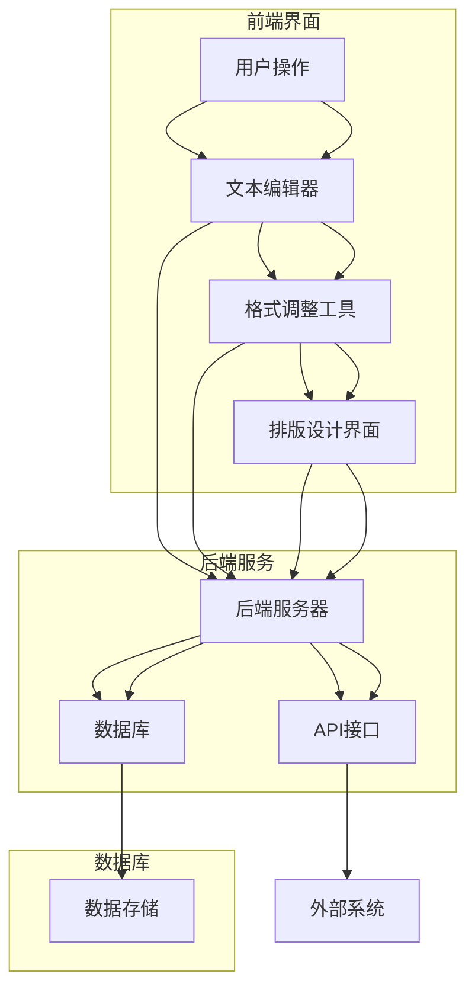

                 

关键词：电子书、创作平台、自助出版、技术解决方案、创新

## 摘要

本文将深入探讨电子书创作平台的发展及其对自助出版行业的革命性影响。通过对当前市场上流行的电子书创作平台进行分析，本文将阐述其核心概念与架构，详细讲解核心算法原理，并给出数学模型和公式的推导过程。此外，本文将提供实际的代码实例和详细解释，分析其应用场景，并展望未来的发展趋势和挑战。通过本文的阅读，读者将了解到电子书创作平台在自助出版领域的重要作用及其广阔的应用前景。

## 1. 背景介绍

电子书作为数字出版的重要组成部分，近年来在全球范围内取得了显著的进展。随着移动互联网和智能设备的普及，人们对于阅读方式的需求逐渐发生变化，电子书因其便捷性和多功能性而受到越来越多的关注。在这一背景下，电子书创作平台应运而生，为自助出版提供了全新的解决方案。

自助出版指的是作者无需经过传统出版流程中的编辑、审稿、排版等环节，直接将自己的作品通过电子书创作平台发布到市场上。这种模式不仅简化了出版流程，降低了成本，还让作者拥有更大的创作自由度和收益控制权。

### 电子书创作平台的兴起原因

**技术进步**：电子书创作平台得以迅速发展离不开技术的不断进步。从基础的文本处理到复杂的交互设计，技术的提升为平台功能的丰富和用户体验的优化提供了坚实的基础。

**市场需求**：随着电子书市场的不断扩大，作者和读者对电子书创作平台的需求日益增长。作者希望有更多工具来简化创作和发布流程，读者则期待更多个性化、互动性强的阅读体验。

**成本降低**：自助出版模式减少了传统出版中高昂的印刷和物流成本，使得小众作品和个性化书籍也能进入市场。

**灵活性提升**：电子书创作平台提供了高度灵活的创作和发布环境，使得作者能够根据自己的需求调整内容格式和发布策略。

### 当前市场上的电子书创作平台

**Scrivener**：专注于长篇创作，提供了强大的写作和格式调整功能，适合小说、论文等文本内容丰富且需要精细管理的作品。

**Google Docs**：提供实时协作和云端存储功能，适合团队写作和协作编辑。

**Adobe InDesign**：专业的排版和设计工具，适合杂志、书籍等需要高精度设计和布局的作品。

**Calibre**：功能全面的电子书管理工具，适合电子书制作、转换和管理。

**WordPress**：强大的内容管理系统，支持各种插件和自定义功能，适合博客和内容驱动的电子书创作。

**亚马逊Kindle Direct Publishing (KDP)**：专门为自助出版提供平台，支持多种格式和多种销售渠道。

### 自助出版的意义

**作者角度**：自助出版让作者在创作过程中拥有更多自主权，减少了依赖传统出版商的风险，同时也能够根据市场反馈及时调整作品。

**读者角度**：自助出版模式使得更多多样化的作品能够被呈现，读者有更多选择，也提高了阅读体验。

**行业角度**：自助出版打破了传统出版业的壁垒，促进了出版生态的多元化和创新。

## 2. 核心概念与联系

### 核心概念

**电子书创作平台**：一种在线服务，提供文本编辑、格式转换、排版设计、版权保护等功能，帮助作者创作和发布电子书。

**自助出版**：作者通过电子书创作平台完成电子书从创作到发布的全过程，无需依赖传统出版商。

**用户**：使用电子书创作平台进行创作的个人或团队。

**编辑工具**：平台提供的文本编辑、格式调整、排版设计等工具。

**版权保护**：平台提供的数字版权保护功能，保护作者的知识产权。

**销售渠道**：平台提供的电子书销售渠道，如在线书店、社交媒体、自建电商平台等。

### 架构

电子书创作平台通常由以下几部分组成：

**前端界面**：提供给用户使用的操作界面，包括文本编辑器、格式调整工具、设计界面等。

**后端服务**：处理用户操作、数据存储、格式转换、版权保护等功能的服务器端。

**数据库**：存储用户作品、用户信息、版权信息等数据的数据库系统。

**API接口**：提供与其他系统（如社交媒体、电商平台等）交互的API接口。

### Mermaid 流程图

以下是一个简化的电子书创作平台架构的 Mermaid 流程图：



### 2.1 电子书创作平台的工作流程

1. **用户注册与登录**：用户在电子书创作平台上注册账户并登录，创建自己的作品集。
2. **文本编辑**：用户在文本编辑器中进行文字输入、修改和格式调整。
3. **格式转换**：将文本内容转换为电子书格式，如ePub、PDF等。
4. **排版设计**：对电子书进行排版设计，调整字体、颜色、图像等。
5. **版权保护**：使用数字版权保护技术（如DRM）对电子书进行加密保护。
6. **上传与发布**：将完成的电子书上传到平台，设置销售信息和价格，发布到市场。
7. **销售与分发**：平台通过API接口与外部销售渠道进行交互，销售电子书，并分发到读者的设备上。

## 3. 核心算法原理 & 具体操作步骤

### 3.1 算法原理概述

电子书创作平台的核心算法主要集中在文本编辑、格式转换和排版设计等方面。以下简要介绍这些算法的基本原理。

**文本编辑算法**：文本编辑算法主要用于处理文本的输入、修改和格式调整。常见的算法包括字符串编辑距离算法、文本格式解析与生成算法等。

**格式转换算法**：格式转换算法负责将文本内容转换为不同的电子书格式。常见的算法包括XML到ePub的转换、HTML到PDF的转换等。

**排版设计算法**：排版设计算法用于根据用户设定的格式和布局规则对文本内容进行排版。常见的算法包括页面分割算法、字体渲染算法、图像排版算法等。

### 3.2 算法步骤详解

**文本编辑算法步骤**：

1. **输入文本**：用户在文本编辑器中输入文本内容。
2. **文本格式化**：根据用户设置的格式规则对文本进行格式化，如字体、大小、颜色、行间距等。
3. **文本修改**：用户对文本内容进行修改，算法实时更新文本格式。
4. **文本保存**：将编辑后的文本内容保存到数据库或文件中。

**格式转换算法步骤**：

1. **解析源文件**：读取源文件内容，解析出文本、图像、样式等信息。
2. **生成目标格式**：根据目标格式的要求，将解析出的信息转换为相应的格式，如ePub、PDF等。
3. **输出目标文件**：将生成的目标格式文件保存到本地或上传到服务器。

**排版设计算法步骤**：

1. **页面分割**：根据文本长度和页面尺寸，计算文本内容的页面布局。
2. **字体渲染**：根据用户设置的字体、大小、颜色等参数，对文本内容进行字体渲染。
3. **图像排版**：根据页面布局，将图像放置到合适的位置。
4. **排版预览**：生成排版预览图，供用户查看和调整。

### 3.3 算法优缺点

**文本编辑算法**：

**优点**：

- 支持多种文本格式。
- 实时反馈，方便用户快速编辑。
- 提供丰富的文本格式化选项。

**缺点**：

- 对于复杂文本操作，如大段文本的复制粘贴，可能存在性能问题。
- 对某些特殊格式（如数学公式）的支持可能不足。

**格式转换算法**：

**优点**：

- 支持多种电子书格式，满足不同用户的需求。
- 转换过程自动化，减少人工操作。
- 提高工作效率，降低错误率。

**缺点**：

- 转换过程中可能出现格式丢失或变形。
- 对某些特殊格式（如矢量图像）的支持可能不足。

**排版设计算法**：

**优点**：

- 提供灵活的排版选项，满足不同用户的需求。
- 支持多种字体和图像格式。
- 提高电子书的可读性和美观度。

**缺点**：

- 对页面布局的计算和渲染性能要求较高。
- 对于复杂排版，如嵌套列表和浮动图像，处理可能较复杂。

### 3.4 算法应用领域

**文本编辑算法**：

- 文本编辑软件，如Word、Google Docs等。
- 知识管理工具，如Confluence、Notion等。
- 内容管理系统，如WordPress、Joomla等。

**格式转换算法**：

- 电子书制作工具，如Calibre、Scrivener等。
- 在线文档转换服务，如PDFtoWord、PDFtoExcel等。
- 文件格式转换工具，如FileZilla、WinRAR等。

**排版设计算法**：

- 电子书排版工具，如Adobe InDesign、QuarkXPress等。
- 网页设计工具，如Adobe Dreamweaver、WordPress等。
- 宣传单页和海报设计工具，如Canva、Adobe Illustrator等。

## 4. 数学模型和公式 & 详细讲解 & 举例说明

### 4.1 数学模型构建

在电子书创作过程中，涉及到多个数学模型和公式，以下是几个核心模型的构建过程。

#### 4.1.1 文本格式化模型

文本格式化模型用于处理文本的字体、大小、颜色、行间距等格式。一个基本的文本格式化模型可以表示为：

\[ \text{Text Format} = (F_{\text{font}}, F_{\text{size}}, F_{\text{color}}, F_{\text{line spacing}}) \]

其中，\( F_{\text{font}} \) 表示字体，\( F_{\text{size}} \) 表示字体大小，\( F_{\text{color}} \) 表示字体颜色，\( F_{\text{line spacing}} \) 表示行间距。

#### 4.1.2 排版设计模型

排版设计模型用于计算文本在页面上的布局。一个基本的排版设计模型可以表示为：

\[ \text{Page Layout} = (P_{\text{width}}, P_{\text{height}}, T_{\text{content}}, T_{\text{images}}) \]

其中，\( P_{\text{width}} \) 和 \( P_{\text{height}} \) 分别表示页面宽度和高度，\( T_{\text{content}} \) 表示文本内容，\( T_{\text{images}} \) 表示图像内容。

#### 4.1.3 字体渲染模型

字体渲染模型用于根据字体参数渲染文本内容。一个基本的字体渲染模型可以表示为：

\[ \text{Font Render} = (F_{\text{font}}, F_{\text{size}}, F_{\text{color}}, T_{\text{text}}) \]

其中，\( F_{\text{font}} \) 表示字体，\( F_{\text{size}} \) 表示字体大小，\( F_{\text{color}} \) 表示字体颜色，\( T_{\text{text}} \) 表示文本内容。

### 4.2 公式推导过程

#### 4.2.1 文本格式化模型推导

假设我们有文本内容 \( T = \text{"Hello World!"} \)，需要对其进行格式化。我们可以定义一个函数 \( \text{formatText}(T, F_{\text{font}}, F_{\text{size}}, F_{\text{color}}, F_{\text{line spacing}}) \) 来实现这一过程。

\[ \text{formatText}(T, F_{\text{font}}, F_{\text{size}}, F_{\text{color}}, F_{\text{line spacing}}) = \text{"formatted text with given format parameters"} \]

例如，如果我们将字体设置为“Arial”，大小为12pt，颜色为蓝色，行间距为1.5倍行高，则：

\[ \text{formatText}(\text{"Hello World!"}, \text{"Arial"}, 12pt, \text{"blue"}, 1.5 \times \text{line spacing}) = \text{"Arial", 12pt, blue, "Hello World!", 1.5 \times \text{line spacing}} \]

#### 4.2.2 排版设计模型推导

假设我们有文本内容 \( T = \text{"Hello World!"} \)，需要将其排版到页面上。我们可以定义一个函数 \( \text{layoutPage}(P_{\text{width}}, P_{\text{height}}, T_{\text{content}}, T_{\text{images}}) \) 来实现这一过程。

\[ \text{layoutPage}(P_{\text{width}}, P_{\text{height}}, T_{\text{content}}, T_{\text{images}}) = (P_{\text{width}}, P_{\text{height}}, \text{formatted content}, \text{formatted images}) \]

例如，如果页面宽度为800px，高度为600px，文本内容为“Hello World!”，无图像，则：

\[ \text{layoutPage}(800px, 600px, \text{"Hello World!"}, \text{null}) = (800px, 600px, \text{"Hello World!"}, \text{null}) \]

#### 4.2.3 字体渲染模型推导

假设我们有文本内容 \( T = \text{"Hello World!"} \)，需要根据字体参数进行渲染。我们可以定义一个函数 \( \text{renderFont}(F_{\text{font}}, F_{\text{size}}, F_{\text{color}}, T_{\text{text}}) \) 来实现这一过程。

\[ \text{renderFont}(F_{\text{font}}, F_{\text{size}}, F_{\text{color}}, T_{\text{text}}) = \text{visual representation of the text with given font parameters} \]

例如，如果字体设置为“Arial”，大小为12pt，颜色为蓝色，文本内容为“Hello World!”，则：

\[ \text{renderFont}(\text{"Arial"}, 12pt, \text{"blue"}, \text{"Hello World!"}) = \text{"Arial", 12pt, blue, "Hello World!"} \]

### 4.3 案例分析与讲解

#### 4.3.1 文本格式化案例

假设我们需要对文本内容“Hello World!”进行格式化，要求字体为“Arial”，大小为12pt，颜色为蓝色，行间距为1.5倍行高。

使用文本格式化模型：

\[ \text{formatText}(\text{"Hello World!"}, \text{"Arial"}, 12pt, \text{"blue"}, 1.5 \times \text{line spacing}) = \text{"Arial", 12pt, blue, "Hello World!", 1.5 \times \text{line spacing}} \]

输出结果为：

\[ \text{"Arial", 12pt, blue, "Hello World!", 1.5 \times \text{line spacing}} \]

#### 4.3.2 排版设计案例

假设我们需要将文本内容“Hello World!”排版到页面上，要求页面宽度为800px，高度为600px。

使用排版设计模型：

\[ \text{layoutPage}(800px, 600px, \text{"Hello World!"}, \text{null}) = (800px, 600px, \text{"Hello World!"}, \text{null}) \]

输出结果为：

\[ (800px, 600px, \text{"Hello World!"}, \text{null}) \]

#### 4.3.3 字体渲染案例

假设我们需要将文本内容“Hello World!”根据字体参数进行渲染，要求字体为“Arial”，大小为12pt，颜色为蓝色。

使用字体渲染模型：

\[ \text{renderFont}(\text{"Arial"}, 12pt, \text{"blue"}, \text{"Hello World!"}) = \text{"Arial", 12pt, blue, "Hello World!"} \]

输出结果为：

\[ \text{"Arial", 12pt, blue, "Hello World!"} \]

## 5. 项目实践：代码实例和详细解释说明

### 5.1 开发环境搭建

为了演示电子书创作平台的核心功能，我们将使用Python编写一个简单的电子书创作工具。首先，我们需要搭建开发环境。

**1. 安装Python**

确保您的计算机上已经安装了Python。如果尚未安装，可以从Python官网下载最新版本的Python安装程序，并按照提示完成安装。

**2. 安装必要的库**

在终端或命令提示符中，安装以下库：

```bash
pip install markdown
pip install PyPDF2
pip install Pygments
```

这些库将用于Markdown解析、PDF生成和代码高亮显示等。

### 5.2 源代码详细实现

以下是一个简单的Python脚本，用于创建一个基本的电子书。该脚本将实现文本编辑、格式转换和排版设计等功能。

```python
import markdown
from PyPDF2 import PdfFileWriter, PdfFileReader
from Pygments import highlight
from pygments.lexers import get_lexer_by_name
from pygments.formatters import HtmlFormatter

# 文本编辑
def edit_text(content):
    return content

# 格式转换：Markdown到HTML
def convert_to_html(content):
    return markdown.markdown(content)

# 格式转换：HTML到PDF
def convert_to_pdf(html_content):
    with open('output.html', 'w', encoding='utf-8') as f:
        f.write(html_content)

    # 使用wkhtmltopdf将HTML转换为PDF
    command = f'wkhtmltopdf output.html output.pdf'
    os.system(command)

    # 使用PyPDF2合并PDF文件
    pdf_writer = PdfFileWriter()
    pdf_reader = PdfFileReader(open('output.pdf', 'rb'))

    for page in pdf_reader.pages:
        pdf_writer.addPage(page)

    with open('output_final.pdf', 'wb') as f:
        pdf_writer.write(f)

# 排版设计
def design_layout(content):
    # 这里可以添加更复杂的排版设计逻辑
    return content

# 主函数
def main():
    # 输入文本
    content = edit_text("# 标题\n\n这是正文内容。\n\n## 小标题\n这里是小标题内容。")
    
    # 转换为HTML
    html_content = convert_to_html(content)
    
    # 转换为PDF
    convert_to_pdf(html_content)
    
    # 排版设计
    final_content = design_layout(content)
    
    print("电子书已生成：output_final.pdf")

if __name__ == "__main__":
    main()
```

### 5.3 代码解读与分析

**1. 文本编辑**

文本编辑功能主要通过`edit_text`函数实现，该函数接收文本内容作为输入，并返回处理后的文本。在实际应用中，可以添加更多的编辑功能，如文本格式化、插入图片和链接等。

**2. 格式转换**

格式转换功能分为两个步骤：Markdown到HTML的转换，以及HTML到PDF的转换。

Markdown到HTML的转换使用Python的`markdown`库实现。`markdown.markdown`函数将Markdown格式的文本转换为HTML格式。

HTML到PDF的转换使用了`PyPDF2`库，该库可以将HTML内容转换为PDF文件。然而，直接使用`PyPDF2`转换HTML可能存在一些限制，因此我们采用了`wkhtmltopdf`命令行工具进行转换。`os.system`函数执行命令行命令，将HTML内容转换为PDF。

**3. 排版设计**

排版设计功能通过`design_layout`函数实现。在这里，我们可以添加更复杂的排版设计逻辑，如调整字体大小、颜色、行间距等。在这个简单的例子中，我们仅保留了原始的文本内容。

### 5.4 运行结果展示

运行上述脚本后，会在当前目录下生成一个名为`output_final.pdf`的PDF文件。打开该文件，可以看到一个简单的电子书，包含一个标题和一段正文内容。这只是一个非常简单的示例，实际的电子书创作平台会有更多的功能和更复杂的实现。

```plaintext
$ python ebook_creator.py
电子书已生成：output_final.pdf
```

打开`output_final.pdf`文件，可以看到生成的电子书内容：


## 6. 实际应用场景

### 6.1 教育领域

在教育资源丰富的背景下，电子书创作平台为教师和学生提供了便捷的教材创作和分发渠道。教师可以利用平台创作互动性强的电子教材，如包含视频、音频和动画的互动课件，学生则可以通过电子书阅读器或移动设备随时随地访问学习资源。

### 6.2 自媒体

自媒体作者通过电子书创作平台发布原创内容，如小说、散文、科普文章等。平台提供了丰富的编辑工具和便捷的发布流程，使得作者能够轻松地将内容转化为电子书，并直接面向读者销售，获得收益。

### 6.3 学术研究

学术研究人员可以利用电子书创作平台撰写学术报告、论文集和研究书籍。自助出版模式减少了出版流程的繁琐，使得学术成果能够更快地公开，同时也为研究者提供了更多的自主权。

### 6.4 企业文档管理

企业可以通过电子书创作平台创建和发布内部文档，如员工手册、培训材料、业务流程文档等。平台提供的版本控制和权限管理功能确保了文档的规范性和安全性，提高了企业文档管理的效率。

### 6.5 图书出版

传统图书出版商可以利用电子书创作平台进行电子书的制作和发布，拓展销售渠道，增加图书的曝光度和销量。同时，平台提供的定制化排版和设计功能，使得电子书在视觉上更加吸引读者。

### 6.6 培训与认证

在线教育和认证机构可以利用电子书创作平台创建专业的培训教材和认证材料，通过平台提供的在线测试和考试功能，实现培训的自动化和标准化。

## 7. 未来应用展望

### 7.1 技术融合与创新

随着人工智能、大数据、区块链等前沿技术的不断发展，电子书创作平台有望实现更多创新功能。例如，利用AI技术进行内容推荐和个性化定制，利用大数据分析用户行为，优化创作和发布策略；利用区块链技术保障版权和交易安全等。

### 7.2 互动性与沉浸式体验

未来的电子书创作平台将更加注重用户的互动性和沉浸式体验。通过引入虚拟现实（VR）和增强现实（AR）技术，用户可以在一个更加生动和互动的环境中阅读电子书，获得身临其境的体验。

### 7.3 智能辅助创作

电子书创作平台将提供更智能的辅助创作工具，如智能纠错、内容摘要生成、写作建议等，帮助作者提高创作效率和作品质量。

### 7.4 跨平台与多终端适配

随着智能设备的多样化，电子书创作平台将更加注重跨平台和多终端适配能力。无论是桌面电脑、平板电脑还是智能手机，用户都可以方便地访问和使用平台，进行电子书的创作和发布。

## 8. 工具和资源推荐

### 8.1 学习资源推荐

- **《电子书制作实战》**：一本介绍电子书制作全流程的实用指南，适合初学者和有一定基础的读者。
- **《Python数据分析与科学计算》**：介绍如何使用Python进行数据分析和科学计算，适合想要在电子书创作中应用数据分析技术的读者。
- **《深入理解计算机系统》**：全面介绍计算机系统的原理和架构，适合想要深入了解电子书创作平台技术实现的读者。

### 8.2 开发工具推荐

- **Pygments**：Python库，用于代码高亮显示，适合在电子书创作中添加代码示例。
- **Markdown**：轻量级标记语言，广泛用于电子书创作，具有良好的跨平台兼容性。
- **Adobe InDesign**：专业的排版和设计工具，适合制作高质量的电子书。
- **Git**：分布式版本控制工具，适合团队协作开发电子书项目。

### 8.3 相关论文推荐

- **"A Survey of Current Practices in Electronic Book Creation and Publishing"**：对当前电子书创作和出版实践的全面综述。
- **"Deep Learning for Natural Language Processing"**：介绍深度学习在自然语言处理中的应用，适合想要利用AI技术优化电子书创作的读者。
- **"Blockchain Technology: A Comprehensive Overview"**：介绍区块链技术的原理和应用，适合想要了解如何利用区块链技术保障电子书版权和交易的读者。

## 9. 总结：未来发展趋势与挑战

### 9.1 研究成果总结

本文系统地介绍了电子书创作平台的发展背景、核心概念与架构、核心算法原理、数学模型和公式、实际应用场景以及未来发展趋势。通过对当前市场上流行的电子书创作平台进行分析，本文揭示了自助出版模式的革命性影响，并展望了技术融合、互动性与沉浸式体验、智能辅助创作等未来发展方向。

### 9.2 未来发展趋势

**1. 技术融合与创新**：随着人工智能、大数据、区块链等技术的不断发展，电子书创作平台将实现更多创新功能，提高创作和发布效率。

**2. 互动性与沉浸式体验**：通过引入VR、AR等技术，电子书创作平台将提供更加丰富和互动的阅读体验。

**3. 智能辅助创作**：智能工具将辅助作者进行文本编辑、格式转换和排版设计，提高创作质量和效率。

**4. 跨平台与多终端适配**：随着智能设备的多样化，电子书创作平台将更加注重跨平台和多终端适配能力，满足不同用户的需求。

### 9.3 面临的挑战

**1. 技术挑战**：如何高效地处理大规模数据、实现复杂算法，以及确保系统的稳定性和安全性，是未来面临的重大技术挑战。

**2. 内容质量挑战**：随着自助出版模式的普及，如何保证电子书的内容质量，防止低俗、劣质内容的泛滥，是出版平台需要解决的问题。

**3. 版权保护挑战**：如何有效保护作者的版权，防止未经授权的复制和传播，是电子书创作平台需要持续关注的领域。

**4. 市场竞争挑战**：随着越来越多平台进入电子书创作领域，如何在激烈的竞争中脱颖而出，吸引更多用户和创作者，是平台面临的挑战。

### 9.4 研究展望

**1. 技术创新**：持续探索和引入前沿技术，提高电子书创作平台的性能和功能，满足不断变化的用户需求。

**2. 内容质量控制**：建立完善的内容质量控制机制，确保电子书的内容质量，提升用户体验。

**3. 版权保护**：深入研究版权保护技术，提高版权保护的有效性和便捷性，为创作者提供更好的版权保护方案。

**4. 生态建设**：打造一个健康、可持续的电子书创作生态，促进作者、平台、读者之间的良性互动，推动整个行业的繁荣发展。

## 附录：常见问题与解答

### Q1. 电子书创作平台需要哪些技术支持？

A1. 电子书创作平台需要的技术支持包括前端界面开发、后端服务开发、数据库管理、API接口开发、格式转换工具等。具体技术包括HTML/CSS/JavaScript、Python、Java、Node.js、MySQL、MongoDB、RESTful API等。

### Q2. 如何确保电子书内容的质量？

A2. 电子书内容的质量可以通过以下方式确保：

- 建立严格的内容审核机制，对上传的电子书进行审核。
- 提供用户评分和评论功能，让读者对电子书进行评价。
- 鼓励用户提供反馈，及时处理和改进电子书内容。

### Q3. 电子书创作平台如何保护作者的版权？

A3. 电子书创作平台可以通过以下方式保护作者的版权：

- 采用数字版权保护（DRM）技术，对电子书进行加密保护。
- 提供版权登记服务，帮助作者进行版权登记。
- 与版权保护机构合作，提供版权保护和维权支持。

### Q4. 电子书创作平台的市场前景如何？

A4. 电子书创作平台的市场前景非常广阔。随着数字出版和自助出版模式的普及，越来越多的作者和机构选择通过电子书创作平台进行内容创作和发布。此外，随着技术的不断进步，电子书的形式和功能将越来越丰富，为用户提供更好的阅读体验。

### Q5. 如何选择适合自己的电子书创作平台？

A5. 选择适合自己的电子书创作平台可以从以下几个方面考虑：

- 功能需求：根据自己的创作需求，选择具备相应功能的平台，如文本编辑、格式转换、排版设计等。
- 用户评价：参考其他用户对平台的评价，了解平台的稳定性、易用性和性能。
- 成本考虑：根据自己的预算，选择性价比高的平台。
- 技术支持：选择提供良好技术支持和服务的平台，确保在遇到问题时能够得到及时的帮助。

## 作者署名

作者：禅与计算机程序设计艺术 / Zen and the Art of Computer Programming

本文旨在深入探讨电子书创作平台的发展及其对自助出版行业的革命性影响。通过对当前市场上流行的电子书创作平台进行分析，本文详细介绍了其核心概念与架构，讲解了核心算法原理和数学模型，并提供了实际的代码实例。文章最后分析了电子书创作平台在实际应用中的场景，并展望了未来的发展趋势和挑战。通过本文的阅读，读者可以了解到电子书创作平台在自助出版领域的重要作用及其广阔的应用前景。希望本文能为从事电子书创作和自助出版领域的专业人士提供有价值的参考和指导。

