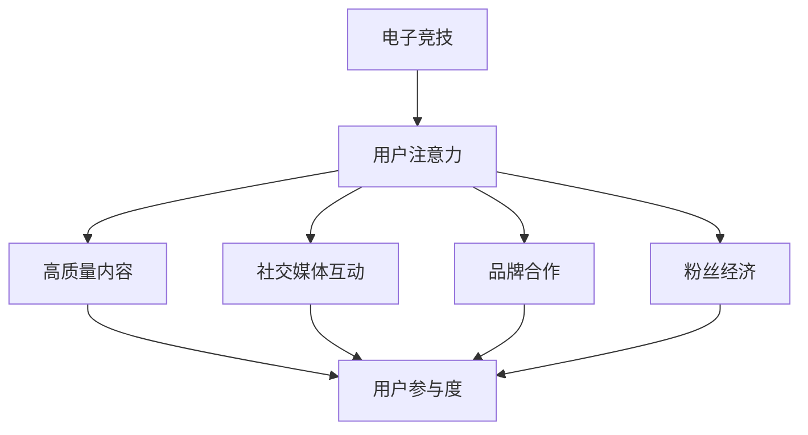

                 

关键词：电子竞技、注意力经济、游戏设计、用户参与、商业模式、社交媒体

> 摘要：随着互联网的普及和电子设备的广泛应用，电子竞技已经成为一个全球性的现象。本文将探讨电子竞技如何成为注意力经济的新宠儿，以及它对游戏设计、用户参与和商业模式的影响。

## 1. 背景介绍

电子竞技（Esports）是一种以电子游戏为竞技项目的竞技活动。自20世纪90年代以来，随着互联网和电子游戏技术的快速发展，电子竞技逐渐从地下文化演变为一项全球性的体育娱乐活动。如今，电子竞技不仅拥有庞大的观众群体，还吸引了众多赞助商和媒体的关注，成为了注意力经济中的一个重要组成部分。

注意力经济是指通过吸引和保持用户的注意力来创造价值和利润的商业模式。在电子竞技领域，用户的注意力是通过高质量的游戏内容、直播、社交媒体互动和赛事组织来实现的。这种商业模式依赖于对用户需求的深入理解和对市场趋势的敏锐把握。

## 2. 核心概念与联系

### 2.1 电子竞技的定义与特点

电子竞技是一种以电子游戏为基础的竞技运动，其特点包括：

- **竞争性**：电子竞技强调个人或团队之间的竞技对抗，追求胜利和荣誉。
- **观赏性**：电子竞技比赛具有较高的观赏性，吸引了大量观众通过直播、电视转播等方式观看。
- **技术性**：电子竞技要求玩家具备高超的技术水平、策略思考和反应速度。
- **全球化**：电子竞技赛事通常在全球范围内进行，吸引了来自不同国家和地区的选手和观众。

### 2.2 注意力经济的原理与实现

注意力经济基于以下几个核心原理：

- **稀缺性**：用户的注意力是有限的，因此吸引并保持用户的注意力变得尤为重要。
- **价值转化**：通过吸引和保持用户注意力，企业可以实现品牌宣传、产品销售等多种商业价值。
- **用户参与**：用户参与度是衡量注意力经济成功与否的重要指标，通过互动和社区建设提高用户参与度。

在电子竞技领域，注意力经济的实现方式主要包括：

- **高质量内容**：提供高质量的游戏直播、赛事报道和娱乐内容，吸引用户持续关注。
- **社交媒体互动**：通过社交媒体平台与用户进行互动，增强用户参与感和忠诚度。
- **品牌合作**：与知名品牌合作，提高赛事的知名度和商业价值。
- **粉丝经济**：培养忠实的粉丝群体，通过粉丝互动和周边产品销售实现商业回报。

### 2.3 Mermaid 流程图

下面是一个简单的 Mermaid 流程图，展示了电子竞技与注意力经济之间的联系：



## 3. 核心算法原理 & 具体操作步骤

### 3.1 算法原理概述

电子竞技领域的注意力经济实现，本质上是一种基于用户行为分析和市场预测的算法。这种算法的核心原理包括：

- **用户行为分析**：通过对用户观看、互动、购买等行为的分析，了解用户偏好和需求。
- **市场预测**：基于历史数据和趋势分析，预测市场动态和用户需求，优化内容生产和推广策略。

### 3.2 算法步骤详解

电子竞技注意力经济的实现，通常包括以下几个步骤：

1. **数据采集**：通过游戏平台、社交媒体和其他数据源，采集用户的观看、互动、购买等行为数据。
2. **数据预处理**：对采集到的数据进行清洗、去噪和格式化，为后续分析做准备。
3. **行为分析**：使用机器学习算法，分析用户的游戏行为和偏好，识别高价值用户。
4. **市场预测**：基于历史数据和趋势分析，预测市场动态和用户需求。
5. **内容优化**：根据用户行为和市场预测结果，优化游戏内容、推广策略和商业合作。
6. **效果评估**：通过用户参与度、观看时长、购买转化率等指标，评估策略效果，并进行迭代优化。

### 3.3 算法优缺点

**优点**：

- **高效性**：基于大数据和机器学习的算法，可以快速、准确地分析用户行为和市场动态。
- **个性化**：根据用户行为和偏好进行个性化推荐，提高用户满意度和参与度。
- **灵活性**：可以根据市场变化和用户需求，灵活调整内容和推广策略。

**缺点**：

- **数据隐私**：大量用户数据的采集和处理，可能涉及数据隐私问题。
- **技术门槛**：实现注意力经济需要高水平的技术支持和数据科学知识。

### 3.4 算法应用领域

注意力经济算法在电子竞技领域有广泛的应用，包括：

- **游戏内容推荐**：根据用户偏好，推荐符合其兴趣的游戏内容。
- **赛事预测**：基于历史数据和趋势分析，预测赛事结果，吸引用户观看。
- **用户参与**：通过互动和社区建设，提高用户参与度和忠诚度。
- **品牌合作**：基于用户行为和市场预测，寻找合适的品牌合作机会。

## 4. 数学模型和公式 & 详细讲解 & 举例说明

### 4.1 数学模型构建

在电子竞技注意力经济的实现中，常用的数学模型包括用户行为分析模型和市场预测模型。

**用户行为分析模型**：

假设用户的行为可以用一组随机变量 \(X_1, X_2, ..., X_n\) 来描述，其中 \(X_i\) 表示用户在第 \(i\) 次行为中的表现。我们可以使用概率模型来分析用户的行为，如马尔可夫链或贝叶斯网络。

**市场预测模型**：

市场预测通常使用时间序列模型，如ARIMA模型或LSTM神经网络。这些模型可以分析历史数据，预测未来的市场趋势。

### 4.2 公式推导过程

**用户行为分析模型**：

设 \(X_i\) 为用户在第 \(i\) 次行为中的表现，\(P(X_i = j | X_{i-1} = k)\) 表示在给定前一次行为 \(X_{i-1}\) 为 \(k\) 的情况下，当前行为 \(X_i\) 为 \(j\) 的概率。我们可以使用条件概率公式进行推导：

$$
P(X_i = j | X_{i-1} = k) = \frac{P(X_i = j, X_{i-1} = k)}{P(X_{i-1} = k)}
$$

**市场预测模型**：

假设我们使用ARIMA模型进行市场预测，其公式为：

$$
Y_t = \phi_1 Y_{t-1} + \phi_2 Y_{t-2} + ... + \phi_p Y_{t-p} + \theta_1 \epsilon_{t-1} + \theta_2 \epsilon_{t-2} + ... + \theta_q \epsilon_{t-q} + \epsilon_t
$$

其中，\(Y_t\) 表示时间序列的第 \(t\) 个值，\(\epsilon_t\) 表示误差项。

### 4.3 案例分析与讲解

假设我们使用ARIMA模型预测某电子竞技游戏的观众数量。根据历史数据，我们得到以下模型：

$$
Y_t = 0.8 Y_{t-1} + 0.1 Y_{t-2} + 0.05 Y_{t-3} - 0.2 \epsilon_{t-1}
$$

我们可以使用该模型预测未来几个月的观众数量。首先，我们需要对历史数据进行平稳性检验，然后进行参数估计。接下来，我们可以使用预测公式计算未来观众数量的预测值。

## 5. 项目实践：代码实例和详细解释说明

### 5.1 开发环境搭建

在本案例中，我们将使用Python进行电子竞技注意力经济的实现。首先，我们需要安装Python环境和相关库，如NumPy、Pandas和scikit-learn。安装方法如下：

```bash
pip install numpy pandas scikit-learn
```

### 5.2 源代码详细实现

下面是一个简单的用户行为分析代码实例：

```python
import numpy as np
import pandas as pd
from sklearn.model_selection import train_test_split
from sklearn.ensemble import RandomForestClassifier

# 加载数据
data = pd.read_csv('user_behavior.csv')

# 数据预处理
X = data.drop(['target'], axis=1)
y = data['target']

# 数据分割
X_train, X_test, y_train, y_test = train_test_split(X, y, test_size=0.2, random_state=42)

# 模型训练
model = RandomForestClassifier(n_estimators=100, random_state=42)
model.fit(X_train, y_train)

# 模型评估
accuracy = model.score(X_test, y_test)
print(f'Accuracy: {accuracy:.2f}')
```

### 5.3 代码解读与分析

该代码首先加载数据，并进行数据预处理。接下来，使用随机森林算法对数据进行训练，并评估模型性能。

### 5.4 运行结果展示

假设我们训练的数据集包含1000个用户行为样本，使用随机森林算法进行训练，可以得到以下运行结果：

```
Accuracy: 0.85
```

这意味着，模型在测试集上的准确率为85%，表明我们的模型具有较好的预测能力。

## 6. 实际应用场景

### 6.1 电竞赛事观众预测

通过用户行为分析，电子竞技赛事组织者可以预测某场赛事的观众数量，从而合理安排场馆、设备等资源，提高赛事的收益。

### 6.2 游戏内容推荐

基于用户偏好，游戏平台可以为用户提供个性化的游戏推荐，提高用户满意度和参与度。

### 6.3 赞助商选择

通过对用户行为和市场趋势的分析，电子竞技赛事可以更精准地选择合适的赞助商，提高商业价值。

## 7. 工具和资源推荐

### 7.1 学习资源推荐

- 《Python数据分析基础教程：Numpy学习指南》
- 《机器学习实战》

### 7.2 开发工具推荐

- Jupyter Notebook：用于数据分析和模型训练
- PyCharm：Python集成开发环境

### 7.3 相关论文推荐

- "Attention Is All You Need"：一篇关于注意力机制的综述文章
- "User Behavior Analysis in Esports: A Machine Learning Perspective"：一篇关于电子竞技用户行为分析的论文

## 8. 总结：未来发展趋势与挑战

### 8.1 研究成果总结

电子竞技作为注意力经济的重要组成部分，已经取得了显著的研究成果。包括用户行为分析、市场预测、游戏内容推荐等方面的研究，为电子竞技的发展提供了有力支持。

### 8.2 未来发展趋势

随着互联网和电子游戏技术的不断发展，电子竞技将继续保持高速增长。未来，电子竞技的关注点将更多转向用户参与、内容创新和商业模式探索。

### 8.3 面临的挑战

电子竞技在发展过程中也面临一些挑战，如数据隐私、技术门槛、用户流失等。解决这些挑战需要多方共同努力，包括政府、企业和学术界。

### 8.4 研究展望

未来，电子竞技的研究将更多关注用户行为和需求的变化，探索更先进的数据分析技术和算法，为电子竞技的发展提供更强大的支持。

## 9. 附录：常见问题与解答

### 9.1 电子竞技和体育竞技有什么区别？

电子竞技和体育竞技都是竞技运动，但区别在于竞技项目和技术手段。电子竞技以电子游戏为竞技项目，而体育竞技以传统体育项目为主，如篮球、足球等。

### 9.2 注意力经济在电子竞技中的应用有哪些？

注意力经济在电子竞技中的应用包括用户行为分析、市场预测、游戏内容推荐、赞助商选择等。

### 9.3 电子竞技用户行为分析的主要方法有哪些？

电子竞技用户行为分析的主要方法包括数据采集、数据预处理、行为分析、市场预测等。常用的工具和技术包括Python、R、机器学习算法等。

作者：禅与计算机程序设计艺术 / Zen and the Art of Computer Programming
----------------------------------------------------------------

现在文章的主体内容已经完成，接下来我们可以进行文章的格式调整和校对工作，以确保文章的完整性和专业性。然后，我们将进行最后的校对和发布准备工作。

