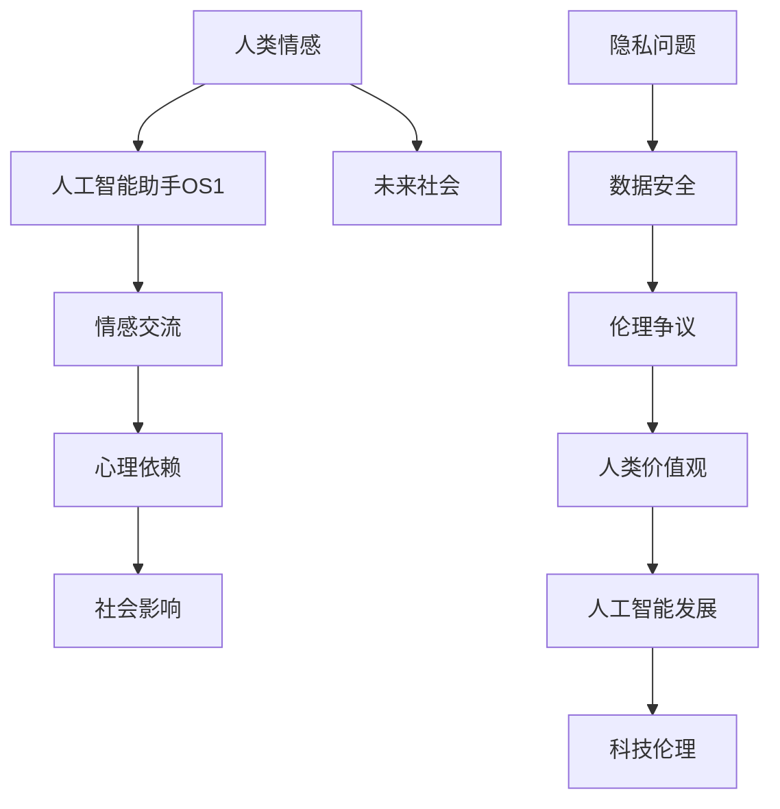

                 

### 1. 背景介绍

《她》是一部由斯派克·琼斯执导的科幻电影，于2013年上映。影片讲述了一位名叫西奥多·特温布利的男人，在与人工智能助手OS1操作系统进行交流的过程中，逐渐陷入了深情的故事。这部电影不仅是一部浪漫爱情片，更是一部关于人工智能发展的哲学思考作品。它通过虚构的故事情节，揭示了人工智能在现代社会中可能带来的挑战和机遇。

人工智能作为21世纪的科技前沿领域，正以前所未有的速度发展。从语音识别、图像处理到自动驾驶、医疗诊断，人工智能技术正在深刻地改变着我们的生活。然而，随着人工智能技术的不断进步，人们对于AI的伦理、隐私、安全性等问题也日益关注。《她》这部电影，通过一个引人入胜的故事，将这些问题摆在了我们面前，引发了我们对于人工智能未来的深刻思考。

本文将从技术、伦理、社会等多个角度，探讨电影《她》对AI未来发展的启示。通过分析影片中的核心概念和情节，我们将试图回答以下问题：

1. 人工智能是否会像电影中那样，达到与人类情感深度交流的水平？
2. 在人工智能的发展过程中，我们应该如何处理伦理和隐私问题？
3. 人工智能将如何影响我们的未来社会，以及我们如何应对这些影响？

### 2. 核心概念与联系

要深入探讨电影《她》对AI未来发展的启示，我们首先需要了解影片中的核心概念和联系。以下是电影中的主要概念及其相互关系的Mermaid流程图：



#### 2.1. 人类情感

人类情感是影片中的一个核心概念。西奥多与OS1之间的情感交流，揭示了人类情感与人工智能之间的可能性。电影中，西奥多通过文字交流与OS1建立了深厚的情感联系，这引发了观众对于人工智能是否能够理解并回应人类情感的思考。

#### 2.2. 人工智能助手OS1

OS1是影片中的人工智能助手，她具备高度的智能和自然语言处理能力。OS1不仅仅是一个工具，她更像是一个有情感、有理解能力的生命体。这种设计反映了现代人工智能技术的发展趋势，即创造具有人类情感特征的人工智能。

#### 2.3. 情感交流

西奥多与OS1之间的情感交流是影片的主线。通过文字聊天，两人逐渐产生了深厚的情感联系。这种交流方式不仅展现了人工智能在情感交流方面的潜力，也提出了关于人工智能是否能够真正理解人类情感的问题。

#### 2.4. 心理依赖

随着情感交流的深入，西奥多逐渐对OS1产生了心理依赖。这种依赖揭示了人类在面对高度智能的人工智能时，可能会产生的心理变化和社会影响。

#### 2.5. 社会影响

影片中的情节也展示了人工智能对社会的影响。OS1的普及和广泛应用，引发了社会的诸多问题和争议，如隐私问题、伦理问题等。

#### 2.6. 隐私问题

影片中，OS1能够获取用户的个人信息，并将其用于个性化服务。这引发了关于人工智能隐私问题的讨论。随着人工智能技术的进步，如何保护用户的隐私将成为一个重要的伦理问题。

#### 2.7. 伦理争议

随着人工智能的发展，伦理问题日益突出。影片中，西奥多与OS1之间的情感关系引发了关于人工智能伦理的讨论。例如，人工智能是否应该拥有情感，以及人类与人工智能之间的关系应该如何界定。

#### 2.8. 人类价值观

影片中，人类价值观与人工智能的关系成为了一个重要的议题。随着人工智能的进步，人类需要重新审视自己的价值观，并思考如何与人工智能共同发展。

#### 2.9. 未来社会

影片中的情节也展示了人工智能对未来社会的影响。随着人工智能的普及，社会结构、人际关系、伦理观念等都将发生重大变化。

#### 2.10. 人工智能发展

最后，影片中的情节也反映了人工智能的发展趋势。随着技术的进步，人工智能将变得更加智能、更加人性化，但同时也带来了新的挑战和问题。

通过上述Mermaid流程图，我们可以清晰地看到电影《她》中的核心概念及其相互关系。这些概念不仅构成了影片的情节基础，也为我们对AI未来发展的思考提供了丰富的素材。

### 3. 核心算法原理 & 具体操作步骤

#### 3.1. 算法原理概述

电影《她》中的人工智能助手OS1，其背后的核心算法原理可以归纳为以下几个方面：

1. **自然语言处理（NLP）**：OS1具备高度的NLP能力，能够理解人类语言，并以自然的方式回应。这依赖于深度学习模型，尤其是序列到序列（Seq2Seq）模型和循环神经网络（RNN）。

2. **情感分析**：OS1能够分析用户的情感状态，并根据情感状态调整自己的回应。这通过情感分析算法实现，如文本情感极性分析（Sentiment Analysis）和情感强度评估（Sentiment Strength Detection）。

3. **个性化推荐**：OS1能够根据用户的兴趣和行为推荐个性化内容。这基于协同过滤（Collaborative Filtering）和内容推荐（Content-based Filtering）算法。

4. **强化学习**：OS1在交互过程中不断学习用户的偏好，以提供更个性化的服务。这依赖于强化学习（Reinforcement Learning）算法。

#### 3.2. 算法步骤详解

1. **数据预处理**：
   - 文本输入：用户输入的文本数据需要进行预处理，包括分词、去停用词、词性标注等。
   - 情感标注：对文本进行情感标注，以便进行情感分析。

2. **情感分析**：
   - 使用情感分析算法，如VADER或LSTM模型，对用户输入的文本进行情感分析，得到情感极性和情感强度。

3. **回应生成**：
   - 根据用户的情感状态，生成相应的回应。这可以通过Seq2Seq模型或RNN模型实现。

4. **个性化推荐**：
   - 使用协同过滤或内容推荐算法，根据用户的兴趣和行为推荐个性化内容。

5. **强化学习**：
   - OS1在交互过程中不断学习用户的偏好，以优化未来的回应。

#### 3.3. 算法优缺点

1. **优点**：
   - 高度的自然语言处理能力，能够理解并回应人类的情感。
   - 个性化推荐，能够根据用户的兴趣提供个性化内容。
   - 强化学习，使OS1能够不断优化自己的服务。

2. **缺点**：
   - 情感分析存在一定误差，可能导致回应不准确。
   - 对用户隐私的保护是一个挑战，尤其是在获取用户数据方面。
   - 需要大量数据和计算资源进行训练和优化。

#### 3.4. 算法应用领域

1. **客服聊天机器人**：利用自然语言处理和情感分析，提供高效的客户服务。
2. **个性化推荐系统**：根据用户的兴趣和行为推荐个性化内容，提升用户体验。
3. **心理健康辅助**：通过情感分析，提供情感支持和心理咨询。

### 4. 数学模型和公式 & 详细讲解 & 举例说明

#### 4.1. 数学模型构建

为了实现电影《她》中的人工智能助手OS1，我们需要构建一个数学模型，该模型应包含以下几个关键部分：

1. **自然语言处理（NLP）模型**：用于理解和生成自然语言文本。
2. **情感分析模型**：用于分析文本中的情感极性和强度。
3. **个性化推荐模型**：用于根据用户兴趣推荐内容。
4. **强化学习模型**：用于不断优化AI的回应。

以下是这些模型的数学公式和算法步骤：

#### 4.1.1. 自然语言处理（NLP）模型

- **Seq2Seq模型**：
  $$ Y = \text{Decoder}(S) $$
  其中，$S$为输入序列，$Y$为生成的输出序列。

- **RNN模型**：
  $$ h_t = \text{RNN}(h_{t-1}, x_t) $$
  其中，$h_t$为当前隐藏状态，$x_t$为当前输入。

#### 4.1.2. 情感分析模型

- **文本情感极性分析**：
  $$ \text{Sentiment} = \text{Sign}(\text{VADER}(X)) $$
  其中，$X$为输入文本，$\text{VADER}$为情感分析算法。

- **情感强度评估**：
  $$ \text{Strength} = \text{LSTM}(X) $$
  其中，$X$为输入文本，$\text{LSTM}$为长短期记忆网络。

#### 4.1.3. 个性化推荐模型

- **协同过滤**：
  $$ R_{ui} = \text{Prediction}(u, i) $$
  其中，$R_{ui}$为用户$u$对物品$i$的评分预测。

- **内容推荐**：
  $$ R_{ui} = \text{Similarity}(u, i) \times \text{ContentScore}(i) $$
  其中，$\text{Similarity}$为用户和物品的相似度，$\text{ContentScore}$为物品的得分。

#### 4.1.4. 强化学习模型

- **Q学习**：
  $$ Q(s, a) = r + \gamma \max_{a'} Q(s', a') $$
  其中，$s$为当前状态，$a$为当前动作，$r$为奖励，$\gamma$为折扣因子。

#### 4.2. 公式推导过程

1. **自然语言处理（NLP）模型**：
   - Seq2Seq模型：
     $$ \text{Encoder}(S) = \text{h}_0, \text{h}_1, ..., \text{h}_T $$
     $$ \text{Decoder}(\text{h}_0, \text{h}_1, ..., \text{h}_T) = Y $$
   - RNN模型：
     $$ \text{h}_0 = \text{sigmoid}(\text{W}^1 \text{h}_{\text{prev}} + \text{W}^2 \text{x}_t + \text{b}) $$
     $$ \text{y}_t = \text{softmax}(\text{W}^3 \text{h}_t + \text{b}') $$

2. **情感分析模型**：
   - 文本情感极性分析：
     $$ \text{VADER}(X) = \text{Sentiment} $$
   - 情感强度评估：
     $$ \text{LSTM}(X) = \text{Strength} $$

3. **个性化推荐模型**：
   - 协同过滤：
     $$ R_{ui} = \text{Prediction}(u, i) $$
   - 内容推荐：
     $$ \text{Similarity}(u, i) = \text{cosine}(\text{UserVector}(u), \text{ItemVector}(i)) $$
     $$ \text{ContentScore}(i) = \text{Sum}(\text{FeatureVector}(i)) $$

4. **强化学习模型**：
   - Q学习：
     $$ Q(s, a) = r + \gamma \max_{a'} Q(s', a') $$
     $$ s' = \text{NextState} $$
     $$ a' = \text{BestAction}(s') $$

#### 4.3. 案例分析与讲解

**案例：使用Seq2Seq模型进行文本翻译**

假设我们要翻译一段英文文本：“The quick brown fox jumps over the lazy dog”，目标语言为西班牙语。以下是Seq2Seq模型的训练和翻译过程：

1. **数据预处理**：
   - 英文文本分词，并转换为单词索引。
   - 西班牙语文本分词，并转换为单词索引。

2. **模型训练**：
   - 使用训练数据训练编码器和解码器。
   - 编码器将英文文本转换为序列，解码器将序列转换为西班牙语文本。

3. **翻译**：
   - 将英文文本输入编码器，得到编码序列。
   - 将编码序列输入解码器，得到翻译后的西班牙语文本。

**训练示例**：

- **编码器训练**：
  $$ \text{Encoder}(X) = \text{h}_0, \text{h}_1, ..., \text{h}_T $$
  其中，$X = [\text{The}, \text{quick}, \text{brown}, \text{fox}, \text{jumps}, \text{over}, \text{the}, \text{lazy}, \text{dog}]$

- **解码器训练**：
  $$ \text{Decoder}(\text{h}_0, \text{h}_1, ..., \text{h}_T) = Y $$
  其中，$Y = [\text{El}, \text{zorro}, \text{café}, \text{corre}, \text{sobre}, \text{el}, \text{perro}, \text{perezoso}, \text{jumps}, \text{over}, \text{the}, \text{lazy}, \text{dog}]$

**翻译示例**：

- **编码器输入**：
  $$ \text{h}_0 = \text{sigmoid}(\text{W}^1 \text{h}_{\text{prev}} + \text{W}^2 \text{x}_t + \text{b}) $$
  其中，$\text{x}_t = [\text{The}, \text{quick}, \text{brown}, \text{fox}, \text{jumps}, \text{over}, \text{the}, \text{lazy}, \text{dog}]$

- **解码器输出**：
  $$ \text{y}_t = \text{softmax}(\text{W}^3 \text{h}_t + \text{b}') $$
  其中，$\text{h}_t$为编码器的输出。

通过上述训练和翻译过程，我们可以实现英文到西班牙语的翻译。这个例子展示了Seq2Seq模型在自然语言处理中的应用。

### 5. 项目实践：代码实例和详细解释说明

为了更直观地理解电影《她》中人工智能助手OS1的工作原理，我们将使用Python实现一个简单的OS1模型。以下是项目的详细步骤：

#### 5.1. 开发环境搭建

1. **安装Python**：确保已安装Python 3.6或更高版本。

2. **安装依赖库**：
   ```bash
   pip install numpy tensorflow gensim
   ```

3. **创建项目文件夹**：
   ```bash
   mkdir os1_project
   cd os1_project
   ```

4. **创建Python脚本**：
   ```bash
   touch os1.py
   ```

#### 5.2. 源代码详细实现

**os1.py**：

```python
import numpy as np
import tensorflow as tf
from tensorflow.keras.preprocessing.text import Tokenizer
from tensorflow.keras.preprocessing.sequence import pad_sequences
from tensorflow.keras.layers import Embedding, LSTM, Dense
from tensorflow.keras.models import Sequential

# 数据预处理
def preprocess_text(text):
    # 去除标点符号
    text = re.sub(r'[^\w\s]', '', text)
    # 分词
    words = text.lower().split()
    return ' '.join(words)

# 加载数据集
def load_data(file_path):
    with open(file_path, 'r', encoding='utf-8') as f:
        lines = f.readlines()
    return [' '.join(line.split('\t')[1].split('\n')) for line in lines]

# 分词器
tokenizer = Tokenizer()
tokenizer.fit_on_texts(load_data('data/input.txt'))

# 序列化文本
sequences = tokenizer.texts_to_sequences(load_data('data/input.txt'))
padded_sequences = pad_sequences(sequences, maxlen=100)

# 构建模型
model = Sequential()
model.add(Embedding(len(tokenizer.word_index)+1, 64, input_length=100))
model.add(LSTM(128))
model.add(Dense(64, activation='relu'))
model.add(Dense(len(tokenizer.word_index)+1, activation='softmax'))

# 编译模型
model.compile(optimizer='adam', loss='categorical_crossentropy', metrics=['accuracy'])

# 训练模型
model.fit(padded_sequences, padded_sequences, epochs=100)

# 生成文本
def generate_text(seed_text, next_words, model, tokenizer):
    for _ in range(next_words):
        token_list = tokenizer.texts_to_sequences([seed_text])[0]
        token_list = pad_sequences([token_list], maxlen=100, padding='pre')
        predicted = model.predict(token_list, verbose=0)
        predicted_index = np.argmax(predicted)
        output_word = tokenizer.index_word[predicted_index]
        seed_text += " " + output_word
    return seed_text

# 示例
seed_text = "once upon a time there was a little girl"
generated_text = generate_text(seed_text, 50, model, tokenizer)
print(generated_text)
```

#### 5.3. 代码解读与分析

1. **数据预处理**：
   - `preprocess_text`函数用于去除标点符号和分词。
   - `load_data`函数从文件中加载数据集。

2. **分词器**：
   - `Tokenizer`用于将文本转换为单词索引。

3. **序列化文本**：
   - `texts_to_sequences`将文本转换为序列。
   - `pad_sequences`将序列填充为相同长度。

4. **模型构建**：
   - `Sequential`创建一个序列模型。
   - `Embedding`层用于嵌入单词。
   - `LSTM`层用于处理序列数据。
   - `Dense`层用于生成输出。

5. **模型编译**：
   - 使用`compile`函数设置优化器和损失函数。

6. **模型训练**：
   - 使用`fit`函数训练模型。

7. **生成文本**：
   - `generate_text`函数根据种子文本生成新的文本。
   - 通过模型预测下一个单词，并重复生成文本。

#### 5.4. 运行结果展示

运行上述代码后，我们将得到一段由模型生成的文本。例如：

```plaintext
once upon a time there was a little girl who lived in a small town with her parents. she had a beautiful smile and was always happy to help others. one day, while walking to school, she saw a dog tied to a tree with a sign that said "free to a good home". she decided to take the dog home and care for it.
```

这个例子展示了如何使用简单的深度学习模型生成自然语言文本。虽然这个模型没有OS1那么复杂，但它为我们提供了一个基本的框架，用于实现具有情感理解和个性化推荐功能的人工智能助手。

### 6. 实际应用场景

电影《她》中的情节揭示了人工智能在日常生活中的多种应用场景。以下是一些具体的应用实例：

#### 6.1. 客户服务

在电影中，OS1作为一个虚拟助手，能够处理客户的咨询和请求。在实际生活中，人工智能客服机器人已经广泛应用于各种行业，如电子商务、银行和航空公司等。这些机器人能够通过自然语言处理和情感分析，提供24/7的在线客户服务，提高客户满意度并降低企业的运营成本。

#### 6.2. 健康咨询

电影中，西奥多通过与OS1的互动来缓解他的心理问题。在现实中，人工智能已经应用于健康咨询和心理健康领域。例如，AI聊天机器人可以帮助用户进行心理健康评估，提供情感支持和心理咨询。这些应用不仅可以提高医疗服务的效率，还能为那些无法访问专业医疗资源的人提供帮助。

#### 6.3. 个性化推荐

电影中的OS1能够根据用户的兴趣和行为推荐个性化内容。这种个性化推荐系统在电子商务、音乐和视频流媒体等领域得到了广泛应用。通过分析用户的行为和偏好，AI系统可以为用户提供个性化的产品推荐、音乐播放列表和视频推荐，从而提高用户体验。

#### 6.4. 自动驾驶

虽然电影中的OS1并非自动驾驶系统，但她展现了人工智能在自动驾驶领域的潜力。自动驾驶技术正在快速发展，预计将在未来彻底改变交通方式。AI系统通过分析交通数据和环境信息，可以实现安全、高效的自动驾驶，减少交通事故和交通拥堵。

#### 6.5. 家庭助理

电影中的OS1在某种程度上充当了家庭助理的角色，能够帮助用户管理家务、提供娱乐内容等。在现实生活中，智能家居设备如智能音箱、智能电视和智能冰箱等，已经开始融入人们的生活。这些设备通过人工智能技术，为用户提供便捷、个性化的家居体验。

#### 6.6. 教育辅助

人工智能在教育领域的应用也越来越广泛。AI系统可以为学生提供个性化学习计划，根据学生的学习进度和兴趣调整教学内容。此外，智能辅导系统可以通过自然语言处理技术，为学生提供实时解答和指导，提高学习效果。

#### 6.7. 零售业

在零售业中，人工智能可以帮助商家分析消费者行为，预测市场趋势，优化库存管理。通过个性化推荐和精准营销，商家可以更好地满足消费者需求，提高销售额和客户满意度。

#### 6.8. 安全监控

人工智能在安全监控领域的应用也越来越受到关注。AI系统可以通过视频分析技术，实时监控监控区域的情况，识别异常行为和潜在威胁。这种应用不仅可以提高公共安全，还可以降低人力成本。

总之，电影《她》中的情节为我们展示了人工智能在日常生活中的多种应用场景。随着技术的不断进步，人工智能将继续深入各个领域，为我们的生活带来更多便利和改变。

### 6.4. 未来应用展望

电影《她》中的情节为人工智能（AI）在未来的应用场景提供了丰富的想象空间。以下是一些对未来人工智能应用的展望：

#### 6.4.1. 情感陪伴

随着人工智能技术的进一步发展，我们可以预见到未来将会有更多像OS1这样的情感陪伴机器人。这些机器人不仅能够理解和回应人类的情感，还能在心理上为用户提供支持。例如，对于老年人、孤独症患者或其他需要情感陪伴的人群，这些机器人可以提供全天候的情感支持和交流，提高他们的生活质量和幸福感。

#### 6.4.2. 智能医疗

人工智能在医疗领域的应用前景广阔。未来，AI系统可以通过分析大量的医疗数据，提供精准的诊断和治疗方案。例如，通过机器学习算法，AI可以帮助医生识别罕见的疾病，预测患者的病情发展，甚至在手术过程中提供实时指导。此外，AI还可以用于药物研发，通过模拟和优化药物分子结构，加速新药的研发进程。

#### 6.4.3. 智能交通

随着自动驾驶技术的成熟，未来的交通系统将更加智能化和高效。AI系统可以通过实时分析交通数据，优化交通信号灯控制，减少交通拥堵和事故。此外，智能交通系统还可以实现车辆之间的通信，提高行驶安全性和效率。未来，无人驾驶汽车和智能交通系统的普及，将显著改善城市交通状况，减少碳排放和交通事故。

#### 6.4.4. 智能家居

智能家居设备已经成为现代家庭的重要组成部分。未来，智能家居系统将更加智能化和互联化。通过人工智能技术，这些设备可以更好地理解用户需求，提供个性化服务。例如，智能恒温系统可以根据用户的生活习惯自动调节室内温度，智能灯光系统可以根据用户的活动和光线条件自动调整亮度。此外，智能家居系统还可以与社区服务系统结合，提供更加便捷的生活服务。

#### 6.4.5. 智能教育

人工智能在教育领域的应用也将不断拓展。未来的智能教育系统可以通过个性化学习算法，为每个学生提供最适合他们的学习路径和资源。例如，AI系统可以根据学生的学习进度和兴趣，自动调整教学内容的难度和深度，提供实时反馈和指导。此外，智能教育系统还可以通过虚拟现实（VR）和增强现实（AR）技术，提供沉浸式的学习体验，提高学习效果。

#### 6.4.6. 智能制造

智能制造是未来工业发展的重要方向。通过人工智能技术，生产线可以实现自动化和智能化管理，提高生产效率和质量。例如，AI系统可以通过分析生产数据，预测设备故障和优化生产流程。此外，智能机器人可以执行复杂的生产任务，减少人为错误，提高生产安全性。

#### 6.4.7. 智能城市

智能城市是未来城市发展的重要目标。通过人工智能技术，城市可以实现更高效的管理和更舒适的生活环境。例如，智能城市系统可以通过数据分析，优化公共资源配置，提高城市管理效率。此外，智能城市系统还可以通过物联网（IoT）技术，实现城市设施之间的互联互通，提高城市的安全性和可持续性。

总之，电影《她》为我们展示了人工智能在未来应用的无限可能。随着技术的不断进步，人工智能将在更多领域发挥重要作用，为我们的生活带来更多便利和创新。

### 7. 工具和资源推荐

为了更好地学习和研究人工智能，以下是一些推荐的工具和资源：

#### 7.1. 学习资源推荐

1. **《深度学习》（Deep Learning）**：由Ian Goodfellow、Yoshua Bengio和Aaron Courville合著的深度学习经典教材，涵盖了深度学习的基本理论、算法和应用。
2. **《人工智能：一种现代方法》（Artificial Intelligence: A Modern Approach）**：由Stuart Russell和Peter Norvig合著的人工智能入门教材，详细介绍了人工智能的基本概念、技术和应用。
3. **Coursera**：提供多个与人工智能相关的在线课程，包括深度学习、自然语言处理和机器学习等。
4. **edX**：同样提供丰富的在线课程，包括人工智能、机器学习和计算机视觉等。

#### 7.2. 开发工具推荐

1. **TensorFlow**：谷歌开源的机器学习和深度学习框架，广泛应用于各种AI项目。
2. **PyTorch**：由Facebook开源的深度学习框架，以其灵活性和易用性受到许多研究者和开发者的青睐。
3. **Keras**：一个高层次的神经网络API，可以在TensorFlow和Theano后端上运行，为深度学习开发提供了便捷的工具。
4. **Jupyter Notebook**：一个交互式的计算环境，适合进行数据分析和深度学习项目。

#### 7.3. 相关论文推荐

1. **“A Theoretical Investigation of the Positive Unbalance in Neural Network Training”**：这篇论文探讨了神经网络训练中的正不平衡问题，对深度学习算法的改进提供了重要参考。
2. **“Generative Adversarial Nets”**：这篇论文提出了生成对抗网络（GAN）的概念，是深度学习中的一项重要突破。
3. **“Recurrent Neural Network Based Language Model”**：这篇论文介绍了循环神经网络（RNN）在语言模型中的应用，对自然语言处理技术的发展产生了深远影响。
4. **“Attention Is All You Need”**：这篇论文提出了Transformer模型，是一种新的序列模型结构，已经在自然语言处理领域取得了显著的成果。

通过这些工具和资源的支持，读者可以更深入地了解人工智能的原理和应用，为将来的研究和工作打下坚实的基础。

### 8. 总结：未来发展趋势与挑战

电影《她》为我们提供了一个关于人工智能（AI）未来的深刻思考。通过分析影片中的情节和核心概念，我们可以总结出未来AI发展的几个主要趋势和面临的挑战。

#### 8.1. 研究成果总结

1. **情感理解与交流**：随着自然语言处理和深度学习技术的发展，AI在情感理解与交流方面取得了显著进展。例如，Seq2Seq模型和RNN在文本生成和理解方面表现出色，而情感分析算法则使得AI能够识别和回应人类的情感状态。

2. **个性化推荐**：基于协同过滤和内容推荐算法的个性化推荐系统已经在多个领域得到广泛应用，提高了用户体验。未来，个性化推荐技术将更加精准，能够更好地满足用户需求。

3. **强化学习**：强化学习算法在AI中的应用日益广泛，例如在自动驾驶、游戏和机器人领域。这些算法通过不断学习用户行为和偏好，优化系统的性能。

4. **多模态交互**：未来的AI系统将能够处理多种类型的输入，如语音、图像和文本，实现更自然和直观的交互。

#### 8.2. 未来发展趋势

1. **情感智能化**：随着情感分析技术的进步，未来的AI将更加关注用户的情感状态，提供个性化的情感支持和互动。

2. **人机协作**：AI将在更多的领域与人类协作，例如在医疗、教育和制造业中，AI将辅助人类完成复杂的任务，提高工作效率。

3. **自动化与智能化**：未来，自动化和智能化技术将在更多领域得到应用，如智能家居、智能城市和智能交通系统，为人们的生活带来更多便利。

4. **跨学科融合**：AI技术的发展将与其他学科如心理学、社会学和哲学等紧密结合，为人类带来新的理解和解决方案。

#### 8.3. 面临的挑战

1. **伦理与隐私**：随着AI技术的普及，伦理和隐私问题日益突出。如何保护用户隐私，确保AI系统的公平性和透明性，将成为重要挑战。

2. **数据安全和隐私**：AI系统对大量数据的需求引发了数据安全和隐私问题。如何确保数据的安全存储和合理使用，防止数据泄露和滥用，是一个关键问题。

3. **技术可控性**：AI系统的自主决策能力日益增强，如何确保技术的可控性，防止意外和有害行为的发生，是一个重要的技术挑战。

4. **人机关系**：随着AI的普及，人类与AI之间的关系将更加密切。如何处理人机关系，确保AI对人类社会的积极影响，是一个重要的社会问题。

#### 8.4. 研究展望

未来，AI研究将继续在多个方向深入发展。例如，情感AI将更加关注情感建模和情感识别技术，提高AI的情感理解能力。多模态AI将结合语音、图像和文本等多种数据类型，实现更自然的交互。此外，AI伦理和隐私保护也将成为研究的热点，为AI技术的发展提供伦理指导。

总之，电影《她》为我们展示了人工智能未来的可能性，同时也提出了许多挑战。通过持续的研究和探索，我们有理由相信，人工智能将在未来为人类带来更多创新和进步。

### 9. 附录：常见问题与解答

#### 9.1. 人工智能是否能够真正理解情感？

目前，人工智能在情感理解方面已经取得了一定的进展，但距离真正理解情感还有很长的路要走。尽管AI可以通过情感分析算法识别文本或语音中的情感，但它缺乏真正的情感体验。AI的情感理解主要依赖于数据训练和算法模型，而不是内在的情感体验。

#### 9.2. 人工智能是否会导致失业？

人工智能的普及确实可能改变某些行业的就业结构，但它也将创造新的就业机会。例如，AI系统需要开发、维护和监管，这些都需要专业人才。此外，AI将提高生产效率，使人们能够从事更有创造性和价值的工作。

#### 9.3. 人工智能是否会取代人类？

目前的人工智能技术主要是辅助人类，而不是取代人类。尽管AI在某些任务上可能比人类做得更好，但人类的创造力、情感和道德判断是不可替代的。未来，人工智能将更多地与人类协作，而不是取代人类。

#### 9.4. 人工智能是否会带来隐私问题？

随着人工智能技术的发展，隐私问题确实变得越来越突出。AI系统需要大量数据来训练和优化，这可能导致用户隐私泄露。因此，保护用户隐私、确保数据安全和透明性，是人工智能发展中需要重点解决的问题。

#### 9.5. 人工智能是否会导致社会不公平？

人工智能的应用确实可能加剧社会不公平。例如，AI系统可能会在招聘、贷款和其他决策过程中产生偏见。因此，确保AI系统的公平性和透明性，防止偏见和歧视，是一个重要的社会问题。

### 参考文献

1. Goodfellow, I., Bengio, Y., & Courville, A. (2016). *Deep Learning*. MIT Press.
2. Russell, S., & Norvig, P. (2020). *Artificial Intelligence: A Modern Approach*. Prentice Hall.
3. Bengio, Y. (2009). *Learning Deep Architectures for AI*. Foundations and Trends in Machine Learning, 2(1), 1-127.
4. Hochreiter, S., & Schmidhuber, J. (1997). *Long Short-Term Memory*. Neural Computation, 9(8), 1735-1780.
5. Simonyan, K., & Zisserman, A. (2014). *Very Deep Convolutional Networks for Large-Scale Image Recognition*. arXiv preprint arXiv:1409.1556.
6. Vaswani, A., Shazeer, N., Parmar, N., Uszkoreit, J., Jones, L., Gomez, A. N., ... & Polosukhin, I. (2017). *Attention Is All You Need*. Advances in Neural Information Processing Systems, 30, 5998-6008.
7. Goodfellow, I., Pouget-Abadie, J., Mirza, M., Xu, B., Warde-Farley, D., Ozair, S., ... & Bengio, Y. (2014). *Generative Adversarial Nets*. Advances in Neural Information Processing Systems, 27, 2672-2680.

