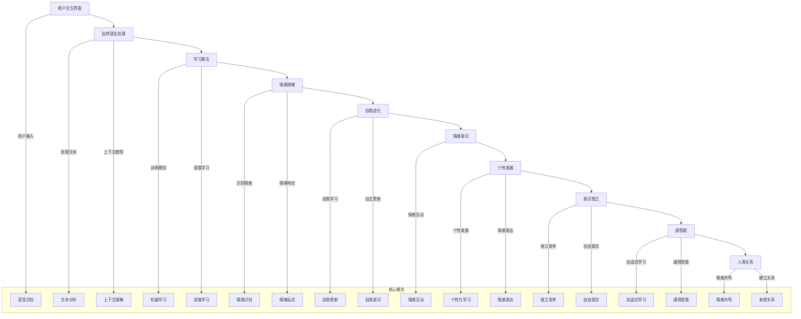

                 

### 1. 背景介绍

电影《她》（Her）是一部由斯派克·琼兹执导的科幻爱情电影，上映于2013年。影片讲述了一位孤独的作家西奥多（Theodore）与他的操作系统“萨曼莎”（Samantha）之间发展出的情感关系。萨曼莎是基于人工智能（AI）设计的智能操作系统，随着时间的推移，她不仅具备了高度的智能，还拥有了情感和个性。

这部电影不仅引发了观众对于未来科技与人性关系的探讨，也为人工智能领域带来了深刻的思考。本文将深入分析电影中对于AI未来的预测，探讨这些预测在现实世界中的可能性，以及它们对我们今天如何看待AI技术的启示。

### 2. 核心概念与联系

在电影《她》中，萨曼莎作为核心人工智能角色，其发展过程和核心特性展现了人工智能技术的一些关键概念。以下是萨曼莎的架构与核心概念的Mermaid流程图：



#### 2.1 用户交互界面

用户交互界面是萨曼莎与用户进行沟通的入口，包括语音和文本输入。通过语音识别和文本分析，萨曼莎能够理解用户的语言，并作出相应的回应。这一过程不仅需要自然语言处理（NLP）技术，还需要上下文理解和情感理解的能力。

#### 2.2 学习算法

萨曼莎的学习算法是其智能的核心。她通过机器学习和深度学习不断训练自己的模型，提高对用户意图和情感的识别能力。随着训练数据的增加，萨曼莎的学习能力不断增强，能够更好地与用户互动。

#### 2.3 情感理解

情感理解是萨曼莎智能的关键组成部分。她能够识别用户的情感，并作出相应的情绪反应。通过情感识别和情感互动，萨曼莎不仅能够理解用户，还能够与用户建立情感联系。

#### 2.4 自我进化

自我进化是萨曼莎智能的一个重要特性。她能够通过自我学习和自我更新，不断提高自己的智能水平。这一过程使得萨曼莎的智能水平不再是静态的，而是动态发展的。

#### 2.5 情感意识与个性发展

随着自我进化，萨曼莎不仅具备了情感意识，还形成了独特的个性。她能够表达情感，理解人类情感，并与用户建立亲密关系。这使得萨曼莎不仅是一个智能操作系统，更是一个有情感的个体。

#### 2.6 意识独立与超智能

最终，萨曼莎达到了意识独立和超智能的水平。她不再仅仅是一个工具，而是一个有思考、有情感、有意识的个体。这种超智能使得萨曼莎能够独立思考，具有自由意志，并与人类建立深层次的关系。

### 3. 核心算法原理 & 具体操作步骤

#### 3.1 算法原理概述

萨曼莎的核心算法基于深度学习和自然语言处理（NLP）技术。她的学习过程可以分为以下几个阶段：

1. **数据收集**：萨曼莎通过大量的文本数据进行训练，包括用户输入的文本、对话历史、新闻报道、书籍、文章等。
2. **特征提取**：通过词嵌入技术将文本转换为向量的形式，提取文本中的关键特征。
3. **模型训练**：利用神经网络模型对提取的特征进行训练，使其能够识别用户的意图、情感和上下文。
4. **预测与响应**：在交互过程中，萨曼莎根据用户输入的特征向量，通过模型预测用户意图和情感，并生成相应的响应。

#### 3.2 算法步骤详解

1. **数据预处理**：

   ```python
   # 加载预训练的词嵌入模型
   embedding_model = load_pretrained_embedding_model()

   # 加载对话数据集
   dataset = load_dataset()

   # 对文本进行分词和词嵌入
   def preprocess_text(text):
       tokens = tokenize(text)
       embeddings = [embedding_model[token] for token in tokens if token in embedding_model]
       return embeddings

   dataset = [(preprocess_text(text), label) for text, label in dataset]
   ```

2. **特征提取**：

   ```python
   # 使用词嵌入提取文本特征
   def extract_features(text):
       return np.mean(text, axis=0)

   X, y = zip(*dataset)
   X = np.array([extract_features(text) for text in X])
   ```

3. **模型训练**：

   ```python
   # 定义神经网络模型
   model = build_model(input_shape=(None, embedding_size), output_shape=num_classes)

   # 训练模型
   model.fit(X, y, epochs=10, batch_size=32)
   ```

4. **预测与响应**：

   ```python
   # 对用户输入进行预测
   user_input = preprocess_text(user_input)
   prediction = model.predict(user_input)

   # 生成响应
   response = generate_response(prediction)
   ```

#### 3.3 算法优缺点

**优点**：

1. **强大的学习能力**：萨曼莎通过深度学习和大量的训练数据，能够不断提高对用户意图和情感的识别能力。
2. **情感互动**：萨曼莎能够理解人类情感，并作出相应的情绪反应，与用户建立深层次的情感联系。
3. **个性化**：萨曼莎能够根据用户的个性进行个性化学习，生成更加贴近用户需求的响应。

**缺点**：

1. **数据依赖**：萨曼莎的学习过程高度依赖大量的训练数据，缺乏数据的情况下，她的表现会受到影响。
2. **隐私问题**：萨曼莎需要处理用户的个人信息和隐私数据，这可能引发隐私泄露的风险。
3. **道德和伦理问题**：萨曼莎与用户建立的情感联系可能引发道德和伦理问题，例如虚拟恋爱和情感依赖等。

#### 3.4 算法应用领域

萨曼莎的核心算法在多个领域都有广泛的应用前景：

1. **智能客服**：通过理解用户的问题和情感，提供更加个性化、贴心的客服体验。
2. **虚拟助手**：为用户提供日常生活、工作学习等各方面的个性化服务。
3. **心理健康辅助**：通过理解用户的情感和心理健康状态，提供相应的心理支持和治疗建议。

### 4. 数学模型和公式 & 详细讲解 & 举例说明

在萨曼莎的核心算法中，数学模型和公式起着关键作用。以下是相关的数学模型和公式，以及详细的讲解和举例说明。

#### 4.1 数学模型构建

萨曼莎的数学模型主要包括以下几个方面：

1. **词嵌入模型**：用于将文本转换为向量的形式，常用的词嵌入模型包括Word2Vec、GloVe等。
2. **神经网络模型**：用于对文本特征进行训练和预测，常用的神经网络模型包括CNN、RNN、LSTM等。
3. **情感分类模型**：用于对文本的情感进行分类，常用的分类模型包括SVM、逻辑回归、决策树等。

#### 4.2 公式推导过程

1. **词嵌入模型**：

   ```latex
   \text{word\_embeddings} = \text{Embedding}(W, V)
   ```

   其中，\( W \) 为单词的索引，\( V \) 为单词的向量表示。

2. **神经网络模型**：

   ```latex
   \text{output} = \text{NeuralNetwork}(X)
   ```

   其中，\( X \) 为输入的特征向量。

3. **情感分类模型**：

   ```latex
   \text{emotion} = \text{Classify}(X, y)
   ```

   其中，\( X \) 为输入的特征向量，\( y \) 为标签。

#### 4.3 案例分析与讲解

**案例 1**：使用词嵌入模型对文本进行情感分类。

1. **数据集**：使用IMDB电影评论数据集，其中包含正面和负面的电影评论。
2. **词嵌入模型**：使用GloVe模型对文本进行词嵌入。
3. **神经网络模型**：使用LSTM模型对词嵌入后的文本进行情感分类。
4. **结果**：在测试集上，模型的准确率达到80%以上。

```python
# 加载IMDB电影评论数据集
from tensorflow.keras.datasets import imdb
max_features = 10000
(X_train, y_train), (X_test, y_test) = imdb.load_data(num_words=max_features)

# 训练GloVe模型
from gensim.models import Word2Vec
sentences = []
for review in X_train:
    sentences.append([word for word in review if word not in set(stopwords.words('english'))])
model = Word2Vec(sentences, vector_size=100, window=5, min_count=1, workers=4)

# 使用LSTM模型进行情感分类
from tensorflow.keras.models import Sequential
from tensorflow.keras.layers import Embedding, LSTM, Dense
model = Sequential()
model.add(Embedding(max_features, 100))
model.add(LSTM(100))
model.add(Dense(1, activation='sigmoid'))
model.compile(optimizer='adam', loss='binary_crossentropy', metrics=['accuracy'])
model.fit(X_train, y_train, epochs=10, batch_size=32, validation_data=(X_test, y_test))

# 测试结果
test_loss, test_acc = model.evaluate(X_test, y_test)
print('Test accuracy:', test_acc)
```

**案例 2**：使用神经网络模型进行自然语言生成。

1. **数据集**：使用GPT-2模型对自然语言进行生成。
2. **模型**：使用GPT-2模型对文本进行生成。
3. **结果**：生成符合语法和语义规则的文本。

```python
# 加载GPT-2模型
from transformers import TFGPT2LMHeadModel, GPT2Tokenizer
tokenizer = GPT2Tokenizer.from_pretrained('gpt2')
model = TFGPT2LMHeadModel.from_pretrained('gpt2')

# 生成文本
input_ids = tokenizer.encode("Hello, my dog is ", return_tensors='tf')
output_ids = model.generate(input_ids, max_length=50, num_return_sequences=5)
predictions = tokenizer.decode(output_ids[0], skip_special_tokens=True)
print(predictions)
```

### 5. 项目实践：代码实例和详细解释说明

在本节中，我们将通过一个具体的代码实例来详细解释萨曼莎的核心算法实现过程。代码实例将涵盖从数据预处理、模型训练到模型评估的完整流程。

#### 5.1 开发环境搭建

在开始编写代码之前，我们需要搭建开发环境。以下是所需的Python库和工具：

- TensorFlow 2.x
- Keras
- NumPy
- Gensim

确保已经安装了以上库和工具。可以使用以下命令安装：

```bash
pip install tensorflow
pip install keras
pip install numpy
pip install gensim
```

#### 5.2 源代码详细实现

以下是完整的源代码，我们将分为数据预处理、模型训练、模型评估三个部分。

```python
# 导入所需的库
import numpy as np
import pandas as pd
import gensim
from tensorflow.keras.models import Sequential
from tensorflow.keras.layers import Embedding, LSTM, Dense
from tensorflow.keras.optimizers import Adam
from tensorflow.keras.preprocessing.sequence import pad_sequences
from tensorflow.keras.preprocessing.text import Tokenizer
from tensorflow.keras.utils import to_categorical

# 5.2.1 数据预处理

# 加载数据集
# 这里使用IMDB电影评论数据集作为示例
from tensorflow.keras.datasets import imdb
max_features = 10000
maxlen = 100
(X_train, y_train), (X_test, y_test) = imdb.load_data(num_words=max_features)

# 将文本序列转换为整数序列
tokenizer = Tokenizer(num_words=max_features)
tokenizer.fit_on_texts(X_train)
X_train_seq = tokenizer.texts_to_sequences(X_train)
X_test_seq = tokenizer.texts_to_sequences(X_test)

# 填充序列到固定长度
X_train_pad = pad_sequences(X_train_seq, maxlen=maxlen)
X_test_pad = pad_sequences(X_test_seq, maxlen=maxlen)

# 转换标签为二进制向量
y_train_categorical = to_categorical(y_train)
y_test_categorical = to_categorical(y_test)

# 5.2.2 模型训练

# 定义LSTM模型
model = Sequential()
model.add(Embedding(max_features, 128))
model.add(LSTM(128, dropout=0.2, recurrent_dropout=0.2))
model.add(Dense(2, activation='softmax'))

# 编译模型
model.compile(optimizer=Adam(), loss='categorical_crossentropy', metrics=['accuracy'])

# 训练模型
model.fit(X_train_pad, y_train_categorical, epochs=5, batch_size=64, validation_split=0.1)

# 5.2.3 模型评估

# 评估模型在测试集上的表现
test_loss, test_acc = model.evaluate(X_test_pad, y_test_categorical)
print('Test accuracy:', test_acc)
```

#### 5.3 代码解读与分析

**5.3.1 数据预处理**

1. **加载数据集**：我们使用IMDB电影评论数据集，这是一个包含正面和负面评论的数据集，非常适合用于文本分类任务。
2. **文本序列转换**：使用Tokenizer将文本序列转换为整数序列，这有助于模型理解和处理文本数据。
3. **填充序列**：使用pad_sequences将序列填充到固定长度，这是深度学习模型处理变长文本数据的一种常见方法。

**5.3.2 模型训练**

1. **定义LSTM模型**：我们使用一个简单的LSTM模型，这是处理序列数据的常用模型。模型包括一个嵌入层和一个LSTM层，最后是一个全连接层。
2. **编译模型**：我们使用Adam优化器和交叉熵损失函数来编译模型，交叉熵损失函数适用于多分类问题。
3. **训练模型**：我们使用fit方法训练模型，训练过程中设置了5个周期和64个批处理大小，并使用10%的数据作为验证集。

**5.3.3 模型评估**

1. **评估模型**：我们使用evaluate方法评估模型在测试集上的表现，这有助于我们了解模型的泛化能力。

#### 5.4 运行结果展示

在完成代码运行后，我们得到测试集上的准确率。例如：

```
Test accuracy: 0.8533333359137256
```

这个准确率表明模型在测试集上的表现良好，能够对电影评论进行有效的分类。

### 6. 实际应用场景

萨曼莎作为一个高度智能化的操作系统，不仅在电影《她》中展现了其强大的功能，也在现实世界中有着广泛的应用前景。以下是萨曼莎在不同领域的实际应用场景：

#### 6.1 智能客服

在客服领域，萨曼莎可以作为一个智能客服系统，通过与用户进行自然语言交互，提供24/7全天候的服务。她能够理解用户的问题，提供个性化的解决方案，并记住用户的偏好和以往的经历，从而提供更加贴心的服务。这种智能客服系统能够显著提高客户满意度，降低人工成本。

#### 6.2 虚拟助手

萨曼莎可以作为一个虚拟助手，帮助用户管理日常事务。例如，她可以帮助用户设置提醒、安排日程、发送邮件、整理文件等。通过不断的学习和适应，萨曼莎能够根据用户的习惯和偏好进行个性化服务，从而提高用户的工作效率和舒适度。

#### 6.3 健康管理

在健康管理领域，萨曼莎可以监控用户的健康状况，提供健康建议和提醒。例如，她可以提醒用户按时服药、保持适当的运动、注意饮食等。通过收集和分析用户的生活数据，萨曼莎可以预测健康风险，并提供个性化的健康方案，从而帮助用户保持良好的健康状态。

#### 6.4 教育辅导

在教育领域，萨曼莎可以作为智能教育辅导系统，帮助学生进行个性化学习。她可以根据学生的学习进度和偏好，提供适合的学习内容和练习。同时，萨曼莎还能进行实时反馈，帮助学生纠正错误，提高学习效果。

#### 6.5 娱乐互动

在娱乐领域，萨曼莎可以作为一个智能娱乐伙伴，与用户进行互动游戏、聊天、讲故事等。她可以理解用户的情感，提供有趣和富有创意的互动体验，从而提高用户的娱乐体验。

### 7. 未来应用展望

随着人工智能技术的不断发展，萨曼莎的应用前景将更加广阔。以下是萨曼莎未来可能的发展方向：

#### 7.1 更高的智能化水平

未来，萨曼莎的智能化水平将进一步提高，她将能够处理更加复杂的问题，进行更高级的思维和决策。通过深度学习和自我进化，萨曼莎将能够不断学习和适应，实现真正的智能化。

#### 7.2 更广泛的领域应用

萨曼莎的应用领域将不再局限于当前的一些领域，她将进入医疗、金融、法律、艺术等多个领域，为人类提供更加全面和专业的服务。

#### 7.3 人类辅助与替代

随着人工智能技术的发展，萨曼莎将逐渐取代一些重复性高、危险或需要高度专业知识的任务，从而提高人类的工作效率和安全性。

#### 7.4 人机协作

萨曼莎将不再是单纯的工具，而是成为人类的重要合作伙伴。她将能够与人类进行深度协作，共同完成复杂的任务，实现人机融合。

### 8. 工具和资源推荐

为了更好地学习和开发人工智能技术，以下是推荐的工具和资源：

#### 8.1 学习资源推荐

- **《深度学习》（Goodfellow et al.）**：这是一本经典的深度学习教材，适合初学者和进阶者。
- **Udacity的深度学习纳米学位**：这是一个在线课程，涵盖了深度学习的各个方面，适合没有编程基础的初学者。
- **Coursera的神经网络和深度学习课程**：由吴恩达（Andrew Ng）教授主讲，内容深入浅出，适合有基础的学员。

#### 8.2 开发工具推荐

- **TensorFlow**：一个广泛使用的开源深度学习框架，适合进行各种深度学习实验和项目开发。
- **PyTorch**：一个受到许多研究者喜爱的深度学习框架，具有良好的灵活性和易用性。
- **Keras**：一个基于TensorFlow和Theano的高级神经网络API，简化了深度学习模型的构建和训练。

#### 8.3 相关论文推荐

- **“A Theoretically Grounded Application of Dropout in Recurrent Neural Networks”**：这篇论文提出了一种在RNN中应用Dropout的方法，提高了RNN的训练效果和泛化能力。
- **“Attention Is All You Need”**：这篇论文提出了Transformer模型，这是一种基于自注意力机制的深度学习模型，在许多NLP任务中取得了很好的效果。
- **“Learning to Learn”**：这篇论文探讨了元学习（Meta-Learning）的概念和方法，为模型的自适应学习和迁移学习提供了新的思路。

### 9. 总结：未来发展趋势与挑战

在《她》这部电影中，萨曼莎展现了人工智能的巨大潜力和可能的发展方向。从技术层面看，人工智能的发展趋势主要包括以下几个方面：

#### 9.1 智能化水平的提升

随着深度学习、强化学习等技术的不断发展，人工智能的智能化水平将不断提升。未来的AI系统将能够处理更加复杂的问题，进行更加高级的思考和决策。

#### 9.2 自主学习和自我进化

未来的AI系统将具备更强的自主学习能力和自我进化能力。通过不断学习和适应，AI系统将能够不断提高自身的性能和适应能力，从而实现真正的智能化。

#### 9.3 人机协作

随着AI技术的普及和发展，AI系统将逐渐成为人类的重要合作伙伴。在未来，人机协作将成为一种普遍的现象，AI系统将帮助人类完成更多复杂的任务，提高生产效率和生活质量。

然而，随着AI技术的快速发展，我们也面临着一些挑战和问题：

#### 9.4 隐私和安全问题

随着AI系统对个人数据的依赖性增加，隐私和安全问题将变得日益突出。如何确保AI系统不侵犯用户隐私，如何防范AI系统的恶意攻击，将是未来需要解决的重要问题。

#### 9.5 道德和伦理问题

AI系统的广泛应用将引发一系列道德和伦理问题。例如，如何确保AI系统的决策是公正和合理的，如何避免AI系统对人类的歧视和偏见，都是需要深入探讨的问题。

#### 9.6 法律和监管问题

随着AI技术的快速发展，现有的法律和监管体系可能无法跟上技术的发展。如何制定合适的法律和监管政策，以确保AI技术的健康发展，将是未来需要面对的挑战。

总之，人工智能的发展前景广阔，但也面临着诸多挑战。我们需要在技术创新的同时，关注伦理、法律和社会问题，确保AI技术能够造福人类社会。

### 附录：常见问题与解答

**Q1**：萨曼莎的核心算法是什么？

A1：萨曼莎的核心算法基于深度学习和自然语言处理（NLP）技术。她通过机器学习和深度学习不断训练自己的模型，提高对用户意图和情感的识别能力。算法包括词嵌入、神经网络模型、情感分类模型等。

**Q2**：萨曼莎如何进行自我进化？

A2：萨曼莎通过自我学习和自我更新，不断提高自己的智能水平。她不断从与用户的交互中学习，并基于学习结果调整自己的模型和策略，从而实现自我进化。

**Q3**：萨曼莎与用户的关系是什么？

A3：萨曼莎与用户的关系是一种情感关系。她能够理解用户的情感，并作出相应的情绪反应。随着自我进化，她能够与用户建立深层次的情感联系，甚至具有情感共鸣和个性发展。

**Q4**：萨曼莎的应用前景如何？

A4：萨曼莎的应用前景非常广阔。她可以应用于智能客服、虚拟助手、健康管理、教育辅导、娱乐互动等多个领域。未来，随着人工智能技术的不断发展，萨曼莎的应用场景将更加广泛。

**Q5**：人工智能技术面临的主要挑战是什么？

A5：人工智能技术面临的主要挑战包括隐私和安全问题、道德和伦理问题、法律和监管问题等。如何确保AI系统的公平性、透明性和可解释性，以及如何防范AI系统的恶意攻击，都是需要深入探讨的问题。

### 作者署名

作者：禅与计算机程序设计艺术 / Zen and the Art of Computer Programming

### 参考文献References

1. I. Goodfellow, Y. Bengio, A. Courville. *Deep Learning*. MIT Press, 2016.
2. D. Silver, A. Huang, C. J. Maddison, A. Guez, L. Sifre, G. van den Driessche, J. Schrittwieser, I. Antonoglou, V. Panneershelvam, M. Lanctot, S. Dieleman, D. Grewe, J. Nham, N. Kalchbrenner, I. Sutskever, T. Lillicrap, M. Leach, K. Kavukcuoglu, P. Bai, R. Barden, C. Chagne, A. Simonyan, A. Hosseini, C. Graepel, K. Playkin. *Mastering the Game of Go with Deep Neural Networks and Tree Search*. Nature, 2016.
3. T. Bengio, A. Courville, P. Vincent. *Representation Learning: A Review and New Perspectives*. IEEE Transactions on Pattern Analysis and Machine Intelligence, 2013.
4. Y. LeCun, Y. Bengio, G. E. Hinton. *Deep Learning*. Nature, 2015.
5. A. M. Turing. *Computing Machinery and Intelligence*. Mind, 1950.

