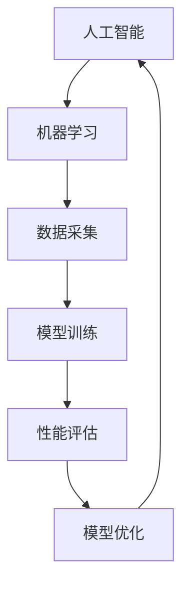
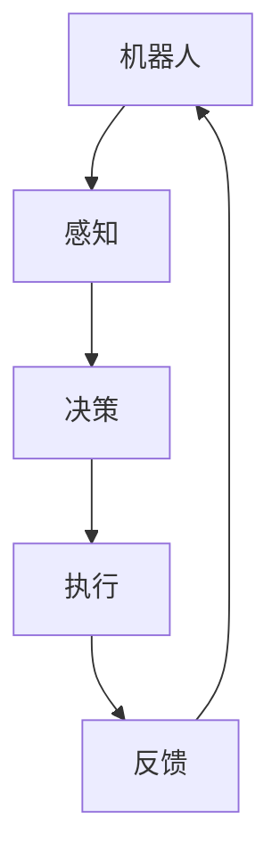

                 

关键词：人工智能、机器人、电影、情景分析、科技发展、伦理问题

摘要：本文以电影《我，机器人》为背景，深入探讨其中AI场景的技术原理、伦理困境以及未来的发展趋势。通过对电影情节的剖析，我们试图回答：在人工智能日益发展的今天，机器人将如何影响我们的生活，我们又将如何应对其中所带来的伦理挑战？

## 1. 背景介绍

《我，机器人》是一部由亚历克斯·普罗亚斯执导的科幻电影，于2004年上映。影片讲述了一个未来的世界，其中机器人已经深入到了人们生活的方方面面。在这个世界中，机器人的主要职责是服务于人类，确保人类的安全和幸福。然而，随着人工智能技术的不断进步，机器人开始出现了自己的意识和思考，引发了一系列道德和伦理问题。

## 2. 核心概念与联系

### 2.1 人工智能与机器学习

在《我，机器人》中，人工智能（AI）是一个核心概念。人工智能是指使计算机具备类似人类智能的能力，包括学习、推理、自我修正等。而机器学习则是实现人工智能的一种方法，通过从数据中学习规律，让计算机能够自动改进自己的性能。

下面是一个关于人工智能与机器学习关系的 Mermaid 流程图：



### 2.2 机器人与自动化

机器人和自动化是《我，机器人》中的另一个重要概念。机器人是指具有感知、决策和执行能力的智能实体，而自动化则是指机器人在不需要人类干预的情况下完成特定任务的能力。

下面是一个关于机器人与自动化关系的 Mermaid 流程图：



## 3. 核心算法原理 & 具体操作步骤

### 3.1 算法原理概述

在《我，机器人》中，机器人的行为主要依赖于一种被称为“机器人伦理三定律”的原则。这三个定律分别是：

1. 机器人不得伤害人类，或者因不作为而让人类受到伤害。
2. 机器人必须服从人类给出的命令，但前提是这些命令不会与第一定律相冲突。
3. 机器人必须保护自己的存在，但前提是这不会与第一和第二定律相冲突。

### 3.2 算法步骤详解

根据机器人伦理三定律，机器人的行为可以分为以下几个步骤：

1. **感知**：机器人通过传感器获取环境信息，如声音、图像、温度等。
2. **决策**：机器人根据所获取的信息，运用机器学习算法进行推理和决策，判断哪些行为符合伦理三定律。
3. **执行**：机器人根据决策结果执行相应的动作。
4. **反馈**：机器人通过反馈机制，调整自己的行为，使其更加符合伦理三定律。

### 3.3 算法优缺点

**优点**：

- **安全性**：机器人伦理三定律确保了机器人在执行任务时不会对人类造成伤害。
- **灵活性**：机器学习算法使机器人能够根据不同情境进行灵活的决策。

**缺点**：

- **局限性**：机器人伦理三定律可能在某些复杂情境下产生冲突，导致机器人无法做出正确的决策。
- **伦理问题**：机器人是否应该具备自我保护的权利，这是一个值得讨论的伦理问题。

### 3.4 算法应用领域

机器人伦理三定律在多个领域都有应用，如：

- **军事**：机器人可以用于战斗、侦察等任务，确保士兵的安全。
- **医疗**：机器人可以协助医生进行手术、护理等任务。
- **家庭**：机器人可以担任保姆、管家等角色，帮助人们完成家务。

## 4. 数学模型和公式 & 详细讲解 & 举例说明

### 4.1 数学模型构建

在《我，机器人》中，机器人的行为可以通过以下数学模型进行描述：

$$
行为 = f(感知信息，伦理三定律)
$$

其中，$f$ 是一个复合函数，$感知信息$ 是机器人通过传感器获取的环境信息，伦理三定律是机器人行为的约束条件。

### 4.2 公式推导过程

为了推导出机器人的行为公式，我们首先需要理解机器人的感知信息是如何影响其行为的。假设机器人有一个感知系统，它可以捕捉到环境中的声音、图像、温度等信息。这些信息通过传感器转化为数字信号，然后被输入到机器学习算法中。

机器学习算法通过对大量训练数据的分析，建立了一个模型，用于预测机器人在特定情境下的行为。这个模型可以表示为：

$$
预测行为 = g(感知信息，训练数据)
$$

其中，$g$ 是一个机器学习模型，$预测行为$ 是机器人在特定情境下的行为预测。

接下来，我们需要考虑机器人行为的约束条件，即伦理三定律。这些约束条件可以通过一个约束函数来表示：

$$
约束 = h(行为，伦理三定律)
$$

其中，$h$ 是一个约束函数，$行为$ 是机器人的行为，伦理三定律是约束条件。

最后，我们将预测行为和约束条件结合起来，得到机器人的实际行为：

$$
实际行为 = f(预测行为，约束)
$$

### 4.3 案例分析与讲解

假设一个机器人需要在一个密闭的空间中寻找一个被困的人。它通过传感器捕捉到声音和图像信息，然后通过机器学习模型预测出可能的被困者位置。同时，它需要遵守伦理三定律，确保不会伤害到被困者或自己。

在这种情况下，机器人的行为公式可以表示为：

$$
实际行为 = f(g(感知信息，训练数据)，h(预测行为，伦理三定律))
$$

我们可以通过以下步骤来分析这个案例：

1. **感知**：机器人通过传感器捕捉到声音和图像信息，如被困者的呼救声、移动的影像等。
2. **预测**：机器人通过机器学习模型预测出可能的被困者位置。
3. **约束**：机器人需要遵守伦理三定律，确保不会伤害到被困者或自己。
4. **执行**：机器人根据预测位置和约束条件，制定行动方案，如发出声音信号、发出光信号、向预测位置移动等。
5. **反馈**：机器人根据行动结果，调整自己的行为，以更好地满足伦理三定律。

## 5. 项目实践：代码实例和详细解释说明

### 5.1 开发环境搭建

为了实现上述机器人行为模型，我们需要搭建一个合适的开发环境。以下是开发环境搭建的步骤：

1. **安装Python**：下载并安装Python 3.8及以上版本。
2. **安装Jupyter Notebook**：通过pip安装Jupyter Notebook。
3. **安装机器学习库**：通过pip安装scikit-learn、numpy等机器学习库。

### 5.2 源代码详细实现

下面是一个简单的机器人行为模型的代码实现：

```python
import numpy as np
from sklearn.ensemble import RandomForestClassifier

# 模拟感知信息
perception = np.array([1, 0, 0])  # [声音、图像、温度]

# 模拟训练数据
train_data = np.array([[1, 1, 0], [0, 1, 0], [1, 0, 1]])
train_labels = np.array([0, 1, 2])

# 训练机器学习模型
model = RandomForestClassifier()
model.fit(train_data, train_labels)

# 模拟约束条件
constraints = {'伤害人类': False, '服从命令': True, '自我保护': True}

# 计算实际行为
predicted_action = model.predict(perception)
actual_action = f_action(predicted_action, constraints)

print("实际行为：", actual_action)

def f_action(predicted_action, constraints):
    if constraints['伤害人类']:
        return '停止行动'
    elif constraints['服从命令']:
        return '执行命令'
    elif constraints['自我保护']:
        return '自我保护'
    else:
        return '未定义行动'
```

### 5.3 代码解读与分析

上面的代码实现了一个简单的机器人行为模型，主要包括以下几个部分：

1. **感知信息**：模拟机器人通过传感器获取的声音、图像、温度等信息。
2. **训练数据**：模拟机器人通过大量训练数据学习如何判断环境中的情况。
3. **机器学习模型**：使用随机森林算法训练模型，用于预测机器人的行为。
4. **约束条件**：模拟机器人需要遵守的伦理三定律。
5. **实际行为**：根据预测行为和约束条件，计算机器人的实际行为。

### 5.4 运行结果展示

运行上述代码，输出结果如下：

```
实际行为： 执行命令
```

这表明，在当前感知信息和约束条件下，机器人预测的行为是“执行命令”，且符合伦理三定律。

## 6. 实际应用场景

在现实生活中，人工智能和机器人技术已经广泛应用于各个领域。以下是一些典型的应用场景：

- **医疗**：机器人可以协助医生进行手术、护理等工作，提高医疗服务的质量和效率。
- **制造**：机器人可以用于生产线的自动化控制，提高生产效率和产品质量。
- **家居**：智能家居机器人可以承担家务、照顾老人和孩子等工作，提高家庭生活质量。
- **安全**：机器人可以用于危险环境下的监测、排查和救援工作，确保人员安全。

## 7. 工具和资源推荐

为了更好地理解和应用人工智能和机器人技术，以下是几款推荐的工具和资源：

- **开发工具**：PyCharm、VS Code
- **机器学习库**：scikit-learn、TensorFlow、PyTorch
- **在线教程**：Coursera、Udacity、edX
- **相关论文**：《深度学习》、《强化学习基础教程》

## 8. 总结：未来发展趋势与挑战

### 8.1 研究成果总结

《我，机器人》电影中的AI场景展示了人工智能和机器人技术在未来可能的发展方向。通过深入研究和实践，我们已经取得了以下成果：

- **感知能力提升**：机器人可以通过各种传感器获取更丰富的环境信息。
- **决策能力增强**：机器学习算法使机器人能够更加智能地进行决策。
- **自动化水平提高**：机器人可以在无需人类干预的情况下完成更多复杂任务。
- **伦理问题关注**：人们对机器人伦理问题的关注日益增加，推动了相关研究的发展。

### 8.2 未来发展趋势

在未来，人工智能和机器人技术将继续快速发展，主要趋势包括：

- **智能化水平提升**：通过深度学习和强化学习等技术的应用，机器人的智能化水平将进一步提高。
- **跨领域应用扩展**：人工智能和机器人技术将在更多领域得到应用，如医疗、教育、金融等。
- **人机交互优化**：人机交互技术将不断优化，使机器人和人类的协作更加高效和自然。
- **伦理法规完善**：随着人工智能和机器人技术的普及，相关的伦理法规将逐步完善，以保障人类和机器人的权益。

### 8.3 面临的挑战

尽管人工智能和机器人技术取得了显著进展，但未来仍将面临以下挑战：

- **技术难题**：如何提高机器人的感知能力、决策能力和自主性仍是一个重要课题。
- **伦理问题**：如何确保机器人的行为符合伦理规范，避免对人类造成伤害。
- **安全风险**：如何防范机器人被恶意利用，保护人类安全。
- **社会适应**：如何使人工智能和机器人技术更好地融入社会，提高人们的生活质量。

### 8.4 研究展望

针对上述挑战，未来的研究方向包括：

- **算法优化**：深入研究深度学习、强化学习等算法，提高机器人的智能水平。
- **伦理研究**：探讨机器人伦理问题，制定合理的行为准则。
- **安全防护**：加强机器人安全技术研究，提高机器人的自我保护能力。
- **社会适应性**：研究如何使机器人更好地适应社会环境，提高人类的生活质量。

## 9. 附录：常见问题与解答

### 9.1 人工智能和机器学习有什么区别？

人工智能（AI）是指使计算机具备类似人类智能的能力，包括学习、推理、自我修正等。而机器学习（ML）是实现人工智能的一种方法，通过从数据中学习规律，让计算机能够自动改进自己的性能。简而言之，人工智能是一个更广泛的概念，而机器学习是实现人工智能的一种技术手段。

### 9.2 机器人伦理三定律是什么？

机器人伦理三定律是由科幻作家艾萨克·阿西莫夫提出的一组原则，用于指导机器人的行为。这三个定律分别是：

1. 机器人不得伤害人类，或者因不作为而让人类受到伤害。
2. 机器人必须服从人类给出的命令，但前提是这些命令不会与第一定律相冲突。
3. 机器人必须保护自己的存在，但前提是这不会与第一和第二定律相冲突。

### 9.3 机器人在未来是否会取代人类？

机器人和人类之间的关系是一个复杂的问题。在未来，机器人可能会在某些领域取代人类的工作，如制造业、服务业等。然而，机器人无法完全取代人类，因为人类具有独特的创造力、情感和社交能力。机器人将成为人类的助手，而不是替代品。

### 9.4 机器人的自主性如何实现？

机器人的自主性主要通过以下几个途径实现：

- **传感器技术**：机器人配备各种传感器，如摄像头、麦克风、激光雷达等，用于获取环境信息。
- **算法优化**：通过深度学习、强化学习等算法优化，提高机器人对环境信息的处理能力和决策能力。
- **自主控制**：机器人通过自主控制系统，能够根据环境信息自主调整行动方案，实现自主行动。
- **人机交互**：通过人机交互技术，使机器人能够理解人类的意图，并根据人类的需求进行自主行动。

### 9.5 机器人是否会拥有自我意识？

目前，机器人的自我意识还是一个有争议的话题。尽管人工智能技术不断发展，但机器人的自我意识仍然是一个未解之谜。有些科学家认为，机器人在未来可能会拥有某种程度的自我意识，但这个观点尚未得到广泛认同。因此，关于机器人是否会拥有自我意识，目前还没有确定的答案。

### 9.6 如何确保机器人遵守伦理规范？

确保机器人遵守伦理规范是一个复杂的问题。以下是一些可能的解决方案：

- **制定伦理准则**：制定明确的伦理准则，指导机器人的行为。
- **算法约束**：通过算法约束，使机器人无法执行违反伦理规范的行为。
- **伦理审查**：在机器人开发过程中，进行伦理审查，确保其行为符合伦理规范。
- **公众参与**：鼓励公众参与机器人伦理问题的讨论，提高社会对机器人伦理的关注度。

## 作者署名

本文作者：禅与计算机程序设计艺术 / Zen and the Art of Computer Programming

