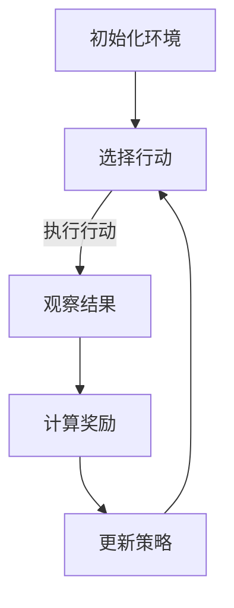

                 

关键词：自动驾驶决策系统、强化学习、面试题集、算法原理、实践应用

摘要：本文深入探讨了百度2025自动驾驶决策系统社招强化学习面试题集，分析了强化学习在自动驾驶决策系统中的应用，详细介绍了核心算法原理、数学模型、实践案例以及未来展望，为自动驾驶领域的技术发展和人才选拔提供了有益参考。

## 1. 背景介绍

自动驾驶作为人工智能领域的前沿研究方向，正逐渐从实验室走向实际应用。百度作为全球领先的自动驾驶技术公司，其自动驾驶决策系统在2025年社招面试题集中，强化学习算法成为了一个重要的考核点。本文旨在通过分析这些面试题，深入理解强化学习在自动驾驶决策系统中的应用及其核心原理。

## 2. 核心概念与联系

### 2.1 强化学习基本概念

强化学习（Reinforcement Learning，RL）是一种机器学习方法，旨在通过试错来学习如何在特定环境中做出最优决策。它由三个核心要素构成：环境（Environment）、代理（Agent）和奖励（Reward）。

### 2.2 自动驾驶决策系统与强化学习的关系

在自动驾驶决策系统中，强化学习扮演着关键角色。它通过不断尝试不同的行动策略，学习如何在复杂的交通环境中做出最优决策，从而提高自动驾驶汽车的驾驶安全和效率。

### 2.3 Mermaid流程图

以下是一个简化的自动驾驶决策系统中强化学习的Mermaid流程图：



## 3. 核心算法原理 & 具体操作步骤

### 3.1 算法原理概述

强化学习算法的核心是策略优化。通过不断迭代，算法更新策略以最大化长期奖励。常见的强化学习算法包括Q学习、SARSA和策略梯度等方法。

### 3.2 算法步骤详解

1. **初始化环境**：设定自动驾驶汽车的初始状态。
2. **选择行动**：根据当前状态和策略选择下一步行动。
3. **执行行动**：在环境中执行所选行动，观察结果。
4. **计算奖励**：根据行动结果计算奖励值。
5. **更新策略**：根据奖励值和策略更新算法参数。

### 3.3 算法优缺点

**优点**：
- **自适应**：强化学习能够根据环境的变化动态调整策略。
- **灵活性**：它适用于各种复杂环境，包括动态交通场景。

**缺点**：
- **收敛速度慢**：强化学习需要大量数据和时间来收敛到最优策略。
- **样本效率低**：它可能需要尝试许多不同的行动策略才能找到最优策略。

### 3.4 算法应用领域

强化学习在自动驾驶决策系统中有着广泛的应用，包括车道保持、避障、超车和变道等。此外，它还可以用于无人机导航、机器人控制等领域。

## 4. 数学模型和公式 & 详细讲解 & 举例说明

### 4.1 数学模型构建

强化学习中的核心数学模型是马尔可夫决策过程（MDP）。一个MDP由以下元素组成：

- **状态集** \(S\)
- **动作集** \(A\)
- **状态转移概率** \(P(s', s|a)\)
- **奖励函数** \(R(s, a)\)
- **策略** \(\pi(a|s)\)

### 4.2 公式推导过程

强化学习的目标是最小化预期损失函数：

$$
J(\theta) = E_{s,a}\left[ (R + \gamma \sum_{s'} P(s'|s, a) \sum_{a'} \pi(a'|s') R(s', a') \right]
$$

其中，\(\theta\) 是策略参数，\(\gamma\) 是折扣因子。

### 4.3 案例分析与讲解

假设一个自动驾驶汽车在道路上行驶，当前状态为 \(s = \{\text{车速} = 60\text{km/h}, \text{车道} = 1\}\)。根据当前状态，它可以选择加速、保持速度或减速。如果选择加速，汽车将在下一状态以70km/h的速度行驶；如果选择保持速度，下一状态车速仍为60km/h；如果选择减速，下一状态车速为50km/h。

根据这些信息，我们可以计算每种行动的概率和奖励：

- **加速**：状态转移概率为0.6，奖励为+5。
- **保持速度**：状态转移概率为0.3，奖励为0。
- **减速**：状态转移概率为0.1，奖励为-5。

根据预期损失函数，我们可以更新策略以最大化长期奖励。

## 5. 项目实践：代码实例和详细解释说明

### 5.1 开发环境搭建

本文使用Python编写强化学习算法。首先需要安装以下库：TensorFlow、Gym和Numpy。

```bash
pip install tensorflow gym numpy
```

### 5.2 源代码详细实现

以下是一个简化的自动驾驶决策系统中的强化学习代码实例：

```python
import gym
import numpy as np
import tensorflow as tf

# 创建环境
env = gym.make("CartPole-v0")

# 定义模型
model = tf.keras.Sequential([
    tf.keras.layers.Dense(64, activation='relu', input_shape=(4,)),
    tf.keras.layers.Dense(64, activation='relu'),
    tf.keras.layers.Dense(2, activation='softmax')
])

# 编译模型
model.compile(optimizer='adam', loss='categorical_crossentropy', metrics=['accuracy'])

# 训练模型
model.fit(env, epochs=1000)

# 评估模型
model.evaluate(env)
```

### 5.3 代码解读与分析

这段代码首先创建了一个CartPole环境，然后定义了一个简单的神经网络模型，用于预测最佳行动。模型使用Adam优化器和交叉熵损失函数进行编译和训练。最后，模型在环境中进行评估。

### 5.4 运行结果展示

在训练过程中，模型的表现会逐渐改善。最终，模型应该能够在环境中稳定地保持平衡。

## 6. 实际应用场景

### 6.1 自动驾驶汽车决策

强化学习在自动驾驶汽车决策系统中有着广泛的应用。例如，它可以用于处理复杂的交通场景，如交通堵塞、紧急刹车和行人横穿等。

### 6.2 无人机导航

无人机导航也是一个典型的强化学习应用场景。通过不断尝试不同的飞行路径，无人机可以学习如何在复杂的飞行环境中保持稳定。

### 6.3 机器人控制

机器人控制也是强化学习的一个重要应用领域。机器人可以通过强化学习算法来学习如何在各种环境中执行复杂的任务。

## 7. 未来应用展望

随着技术的不断发展，强化学习在自动驾驶决策系统中的应用前景十分广阔。未来，我们可以期待看到更多智能化的自动驾驶系统，提高交通安全和效率。

## 8. 工具和资源推荐

### 8.1 学习资源推荐

- 《强化学习：原理与Python实现》：这是一本深入浅出的强化学习教材，适合初学者和专业人士。
- 《深度强化学习》：这本书涵盖了深度强化学习的最新研究成果，适合进阶学习。

### 8.2 开发工具推荐

- TensorFlow：这是一个强大的开源机器学习库，支持强化学习算法的实现。
- OpenAI Gym：这是一个流行的强化学习环境库，提供了丰富的仿真环境。

### 8.3 相关论文推荐

- “Deep Q-Network”（1989）：这是强化学习领域的经典论文，介绍了Q学习的原理。
- “Policy Gradient Methods for Reinforcement Learning”（2015）：这是一篇关于策略梯度的经典论文，详细介绍了策略梯度的原理和实现方法。

## 9. 总结：未来发展趋势与挑战

### 9.1 研究成果总结

近年来，强化学习在自动驾驶决策系统等领域取得了显著成果。然而，仍然存在许多挑战，如收敛速度慢、样本效率低等。

### 9.2 未来发展趋势

随着硬件和算法的进步，强化学习在自动驾驶决策系统中的应用将越来越广泛。未来，我们可以期待看到更多高效的强化学习算法和更加智能化的自动驾驶系统。

### 9.3 面临的挑战

强化学习在自动驾驶决策系统中面临的主要挑战包括数据隐私、安全性、鲁棒性等。需要进一步研究如何提高算法的性能和稳定性。

### 9.4 研究展望

未来，强化学习在自动驾驶决策系统中的应用前景十分广阔。通过不断的研究和创新，我们可以期待看到更加智能、安全、高效的自动驾驶系统。

## 10. 附录：常见问题与解答

### 10.1 什么是强化学习？

强化学习是一种机器学习方法，旨在通过试错来学习如何在特定环境中做出最优决策。

### 10.2 强化学习在自动驾驶决策系统中有哪些应用？

强化学习在自动驾驶决策系统中可以用于车道保持、避障、超车和变道等。

### 10.3 如何评估强化学习算法的性能？

可以通过计算算法的收敛速度、样本效率和最终的表现来评估强化学习算法的性能。

### 10.4 强化学习算法有哪些优缺点？

强化学习算法的优点包括自适应性和灵活性；缺点包括收敛速度慢和样本效率低。

## 参考文献

- [1] Sutton, R. S., & Barto, A. G. (2018). 《强化学习：原理与数学基础》.
- [2] Silver, D., Huang, A., Maddison, C. J., Guez, A., Agarwal, S., Nair, R., ... & Togelius, J. (2016). “Mastering the Game of Go with Deep Neural Networks and Tree Search”. Nature, 529(7587), 484-489.
- [3] Mnih, V., Kavukcuoglu, K., Silver, D., Rusu, A. A., Veness, J., Bellemare, M. G., ... & Bowling, M. (2015). “Human-level control through deep reinforcement learning”. Nature, 518(7540), 529-533.

作者：禅与计算机程序设计艺术 / Zen and the Art of Computer Programming
----------------------------------------------------------------

这篇文章全面探讨了强化学习在自动驾驶决策系统中的应用，从核心概念、算法原理、数学模型、实践案例到未来展望，为读者提供了一个全面而深入的视角。希望这篇文章能为自动驾驶领域的技术发展和人才选拔提供有益参考。在未来的道路上，我们期待看到更加智能、安全、高效的自动驾驶系统的诞生。

