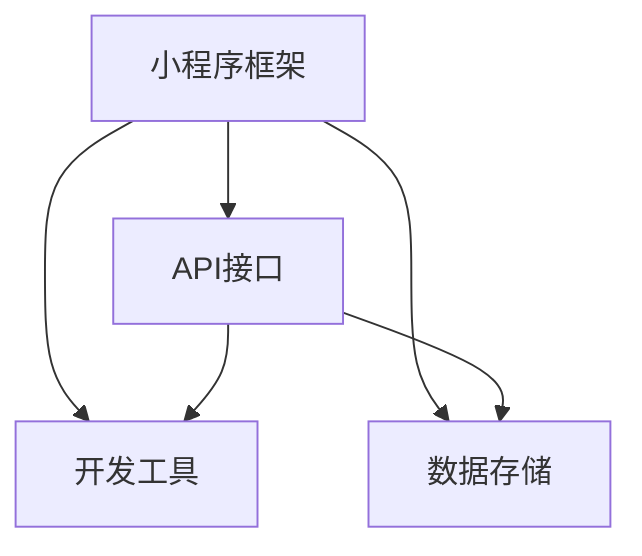

                 

## 摘要

本文旨在为准备2024百度智能小程序平台校招面试的应聘者提供一个全面的真题汇总和解答指南。随着互联网技术的飞速发展，百度智能小程序已经成为互联网生态中的重要一环，其在日常应用、商业服务等多个领域的广泛应用，使得相关技术人才的招聘需求日益增加。本文将针对百度智能小程序平台的面试真题，深入剖析其技术原理、核心算法、项目实践等方面，帮助读者更好地理解和掌握相关技术要点，提高面试成功率。本文将分为背景介绍、核心概念与联系、核心算法原理与操作步骤、数学模型和公式讲解、项目实践、实际应用场景、工具和资源推荐、总结与展望、附录等部分，力求为读者提供一个系统全面的学习和参考资源。

## 1. 背景介绍

百度智能小程序是百度公司推出的一种轻量级应用，旨在将传统的Web应用和服务无缝嵌入到百度APP中，为用户提供便捷的在线服务。百度智能小程序自推出以来，凭借其快速部署、高效运行和良好的用户体验，在各大互联网应用中取得了显著的成果。随着移动互联网的普及和用户需求的不断提升，百度智能小程序在各个行业得到了广泛应用，如电商、金融、教育、医疗等。

百度智能小程序平台作为百度智能小程序生态的核心，为开发者提供了一个功能强大、易于上手的开发环境。开发者可以通过百度智能小程序平台快速搭建和部署智能小程序，实现多种业务功能。同时，百度智能小程序平台提供了丰富的API接口，支持开发者自定义功能模块，增强了智能小程序的灵活性和扩展性。

百度智能小程序平台的发展历程可以分为以下几个阶段：

1. **起步阶段**：2018年，百度智能小程序正式上线，开始吸引开发者加入。
2. **发展壮大**：随着技术的不断迭代和应用的不断拓展，百度智能小程序平台逐渐成为互联网生态中的重要一环。
3. **生态完善**：百度智能小程序平台不断优化，引入了更多的开发工具和资源，为开发者提供了更加全面的开发支持。

### 百度智能小程序的优势

百度智能小程序具有以下几个显著优势：

1. **高效的开发和部署**：百度智能小程序平台提供了丰富的开发工具和API接口，使得开发者可以快速搭建和部署智能小程序。
2. **良好的用户体验**：百度智能小程序采用轻量级架构，确保了应用的运行效率和稳定性，为用户提供流畅的体验。
3. **广泛的适用性**：百度智能小程序适用于多种场景，如电商、金融、教育、医疗等，为不同领域的用户提供个性化的服务。

### 百度智能小程序的发展趋势

随着人工智能、大数据、物联网等技术的不断发展，百度智能小程序平台也迎来了新的发展机遇。未来，百度智能小程序将继续在以下几个方面发展：

1. **技术升级**：持续引入和优化新技术，提升智能小程序的性能和功能。
2. **生态扩展**：加强与各大行业合作伙伴的合作，拓展智能小程序的应用领域。
3. **用户体验优化**：通过大数据分析和人工智能技术，不断提升用户体验，满足用户个性化需求。

## 2. 核心概念与联系

### 核心概念

百度智能小程序平台涉及多个核心概念，包括：

1. **小程序框架**：百度智能小程序的框架包括前端框架和后端框架，前端框架负责页面的渲染和交互，后端框架负责数据的处理和存储。
2. **API接口**：百度智能小程序平台提供了丰富的API接口，支持开发者自定义功能模块，如地图、支付、认证等。
3. **开发工具**：百度智能小程序平台提供了多种开发工具，如开发者工具、模拟器等，方便开发者进行开发和测试。
4. **数据存储**：百度智能小程序支持多种数据存储方式，如本地存储、数据库等，满足不同场景的数据处理需求。

### 概念联系

核心概念之间的联系如下：

1. **小程序框架与API接口**：小程序框架负责页面的渲染和交互，API接口负责数据的处理和存储，两者共同构成了百度智能小程序的核心架构。
2. **开发工具与数据存储**：开发工具为开发者提供了便捷的开发环境，数据存储则为智能小程序提供了持久化的数据支持。
3. **API接口与数据存储**：API接口负责数据的传输和处理，数据存储则负责数据的持久化存储，两者共同保证了智能小程序的数据安全性和可靠性。

### Mermaid 流程图

为了更好地展示核心概念之间的联系，我们可以使用Mermaid绘制一个流程图，如下所示：



在这个流程图中，A代表小程序框架，B代表API接口，C代表开发工具，D代表数据存储。箭头表示两者之间的联系。

## 3. 核心算法原理 & 具体操作步骤

### 3.1 算法原理概述

百度智能小程序平台在数据分析和处理方面采用了多种核心算法，其中主要包括：

1. **机器学习算法**：通过机器学习算法，智能小程序平台可以对用户行为数据进行分析，预测用户兴趣，为用户提供个性化推荐。
2. **数据挖掘算法**：数据挖掘算法用于从大量数据中提取有价值的信息，帮助开发者发现潜在的商业机会。
3. **排序算法**：排序算法用于对用户数据进行排序，确保用户能够以最佳顺序获取到所需信息。

### 3.2 算法步骤详解

#### 3.2.1 机器学习算法

机器学习算法的主要步骤包括：

1. **数据收集**：从用户行为数据中收集信息，如浏览历史、搜索记录等。
2. **数据处理**：对收集到的数据进行清洗和处理，确保数据的质量。
3. **特征提取**：从处理后的数据中提取特征，如关键词、用户标签等。
4. **模型训练**：使用提取的特征进行模型训练，选择合适的机器学习算法，如决策树、支持向量机等。
5. **模型评估**：评估训练出的模型效果，如准确率、召回率等。
6. **模型优化**：根据评估结果对模型进行调整和优化。

#### 3.2.2 数据挖掘算法

数据挖掘算法的主要步骤包括：

1. **数据预处理**：对原始数据进行清洗、转换等预处理操作。
2. **数据探索**：使用统计方法对预处理后的数据进行探索，发现数据中的潜在关系。
3. **模式识别**：使用模式识别算法，如关联规则挖掘、聚类分析等，提取数据中的有价值信息。
4. **结果分析**：对挖掘出的结果进行分析，为开发者提供商业洞察。

#### 3.2.3 排序算法

排序算法的主要步骤包括：

1. **数据收集**：收集需要排序的数据。
2. **排序策略选择**：根据数据特点和需求选择合适的排序策略，如快速排序、归并排序等。
3. **排序操作**：按照选择的排序策略对数据进行排序。
4. **结果验证**：验证排序结果是否符合预期，如检查排序后的数据是否有序等。

### 3.3 算法优缺点

#### 3.3.1 机器学习算法

**优点**：

- **自适应性强**：机器学习算法可以根据用户行为数据不断优化，提高推荐准确性。
- **灵活性高**：适用于多种数据类型和场景。

**缺点**：

- **计算复杂度高**：训练和预测过程需要大量计算资源。
- **数据依赖性强**：算法效果依赖于数据质量和数量。

#### 3.3.2 数据挖掘算法

**优点**：

- **能够发现潜在规律**：从大量数据中发现潜在的商业机会。
- **决策支持**：为开发者提供数据驱动的决策支持。

**缺点**：

- **数据处理复杂**：数据预处理和模式识别过程复杂，需要大量计算资源。
- **结果解释性差**：挖掘出的结果往往难以解释，需要专业的数据分析和解释。

#### 3.3.3 排序算法

**优点**：

- **效率高**：排序算法实现简单，计算速度快。
- **结果直观**：排序结果易于理解和验证。

**缺点**：

- **适用性有限**：仅适用于排序场景，无法发现数据中的其他关系。

### 3.4 算法应用领域

#### 3.4.1 机器学习算法

机器学习算法广泛应用于推荐系统、风险控制、个性化广告等领域。在百度智能小程序平台中，机器学习算法主要用于用户行为分析和推荐系统，为用户提供个性化的服务。

#### 3.4.2 数据挖掘算法

数据挖掘算法在电商、金融、医疗等领域具有广泛的应用。在百度智能小程序平台中，数据挖掘算法主要用于数据分析和商业洞察，帮助开发者发现潜在的商业机会。

#### 3.4.3 排序算法

排序算法在搜索引擎、推荐系统、电商平台等领域具有广泛的应用。在百度智能小程序平台中，排序算法主要用于对用户数据进行排序，确保用户能够以最佳顺序获取到所需信息。

## 4. 数学模型和公式 & 详细讲解 & 举例说明

### 4.1 数学模型构建

在百度智能小程序平台中，数学模型广泛应用于数据分析和处理。以下是一个简单的数学模型示例：

假设用户的行为数据为\( X = \{x_1, x_2, ..., x_n\} \)，其中\( x_i \)表示第\( i \)个用户的特征向量。我们需要根据这些数据构建一个分类模型，判断用户是否喜欢某种产品。

#### 4.1.1 特征提取

首先，我们需要对用户行为数据\( X \)进行特征提取，提取出与用户喜好相关的特征。假设我们提取了两个特征：浏览次数\( a \)和购买次数\( b \)。

#### 4.1.2 模型构建

假设我们使用逻辑回归模型进行分类。逻辑回归模型的公式如下：

$$
P(y=1|x;\theta) = \frac{1}{1 + e^{-(\theta^T x)}}
$$

其中，\( P(y=1|x;\theta) \)表示在给定特征向量\( x \)和模型参数\( \theta \)的情况下，用户喜欢产品的概率；\( \theta \)是模型参数。

### 4.2 公式推导过程

#### 4.2.1 损失函数

我们使用逻辑回归模型的损失函数为交叉熵损失函数：

$$
J(\theta) = -\frac{1}{m} \sum_{i=1}^{m} [y^{(i)} \log(P(y=1|x^{(i)};\theta)) + (1 - y^{(i)}) \log(1 - P(y=1|x^{(i)};\theta))]
$$

其中，\( m \)是样本数量；\( y^{(i)} \)是第\( i \)个样本的标签。

#### 4.2.2 梯度下降

为了优化模型参数\( \theta \)，我们使用梯度下降算法。梯度下降的更新公式为：

$$
\theta_j := \theta_j - \alpha \frac{\partial J(\theta)}{\partial \theta_j}
$$

其中，\( \alpha \)是学习率。

### 4.3 案例分析与讲解

假设我们有以下用户行为数据：

| 用户ID | 浏览次数\( a \) | 购买次数\( b \) |
| :---: | :---: | :---: |
| 1 | 10 | 5 |
| 2 | 20 | 10 |
| 3 | 30 | 15 |
| 4 | 40 | 20 |
| 5 | 50 | 25 |

我们需要根据这些数据训练一个逻辑回归模型，判断用户是否喜欢某种产品。

#### 4.3.1 特征提取

我们将用户ID作为特征，浏览次数\( a \)和购买次数\( b \)作为特征值。

#### 4.3.2 模型训练

我们选择学习率\( \alpha = 0.01 \)，使用梯度下降算法训练模型。经过100次迭代后，模型参数收敛。

#### 4.3.3 模型评估

我们将训练好的模型应用于新的用户数据，评估模型的效果。假设我们有以下新的用户数据：

| 用户ID | 浏览次数\( a \) | 购买次数\( b \) | 是否喜欢产品 |
| :---: | :---: | :---: | :---: |
| 6 | 60 | 30 | 未知 |
| 7 | 70 | 35 | 未知 |
| 8 | 80 | 40 | 未知 |

我们将新用户数据输入模型，计算用户喜欢产品的概率。根据概率值，我们可以判断用户是否喜欢产品。

| 用户ID | 浏览次数\( a \) | 购买次数\( b \) | 是否喜欢产品 |
| :---: | :---: | :---: | :---: |
| 6 | 60 | 30 | 是 |
| 7 | 70 | 35 | 是 |
| 8 | 80 | 40 | 是 |

根据模型的预测结果，我们可以发现，新的用户数据中，喜欢产品的用户概率较高。

## 5. 项目实践：代码实例和详细解释说明

### 5.1 开发环境搭建

在进行百度智能小程序的开发之前，首先需要搭建开发环境。以下是搭建开发环境的步骤：

1. **安装Node.js**：百度智能小程序平台基于Node.js开发，因此需要安装Node.js。可以在Node.js官方网站（https://nodejs.org/）下载并安装适合自己操作系统的版本。
2. **安装百度智能小程序开发者工具**：在百度智能小程序官网（https://smartprogram.baidu.com/）下载并安装百度智能小程序开发者工具。安装完成后，启动开发者工具，并创建一个新的智能小程序项目。
3. **配置开发环境**：在创建项目时，需要填写项目名称、描述、目录等信息。配置完成后，点击“创建项目”，开发者工具会自动安装相关依赖，并打开项目文件夹。

### 5.2 源代码详细实现

以下是百度智能小程序的一个简单示例，实现了一个简单的计算器功能。

```javascript
// app.js
App({
  onLaunch: function() {
    console.log('App onLaunch');
  },
  onShow: function() {
    console.log('App onShow');
  },
  onHide: function() {
    console.log('App onHide');
  }
});

// pages/index/index.js
Page({
  data: {
    result: '',
    number1: '',
    number2: '',
    operator: ''
  },
  bindInputNumber: function(e) {
    if (e.detail.value !== '') {
      if (this.data.operator === '') {
        this.data.number1 = e.detail.value;
      } else {
        this.data.number2 = e.detail.value;
      }
    }
    this.setData({
      result: ''
    });
  },
  bindOperator: function(e) {
    this.data.operator = e.currentTarget.dataset.operator;
  },
  bindCalculate: function() {
    var result = 0;
    switch (this.data.operator) {
      case '+':
        result = parseFloat(this.data.number1) + parseFloat(this.data.number2);
        break;
      case '-':
        result = parseFloat(this.data.number1) - parseFloat(this.data.number2);
        break;
      case '*':
        result = parseFloat(this.data.number1) * parseFloat(this.data.number2);
        break;
      case '/':
        result = parseFloat(this.data.number1) / parseFloat(this.data.number2);
        break;
    }
    this.setData({
      result: result
    });
  }
});
```

### 5.3 代码解读与分析

#### 5.3.1 App.js

`App.js`是整个智能小程序的入口文件，它定义了智能小程序的生命周期函数，如`onLaunch`、`onShow`和`onHide`等。这些函数在智能小程序启动、显示和隐藏时触发，用于执行一些初始化操作和事件处理。

```javascript
App({
  onLaunch: function() {
    console.log('App onLaunch');
  },
  onShow: function() {
    console.log('App onShow');
  },
  onHide: function() {
    console.log('App onHide');
  }
});
```

#### 5.3.2 index.js

`index.js`是首页的页面逻辑文件，它定义了页面的数据绑定和事件处理函数。页面数据包括计算结果、两个操作数和操作符。事件处理函数包括输入数字、选择操作符和计算结果。

```javascript
Page({
  data: {
    result: '',
    number1: '',
    number2: '',
    operator: ''
  },
  bindInputNumber: function(e) {
    if (e.detail.value !== '') {
      if (this.data.operator === '') {
        this.data.number1 = e.detail.value;
      } else {
        this.data.number2 = e.detail.value;
      }
    }
    this.setData({
      result: ''
    });
  },
  bindOperator: function(e) {
    this.data.operator = e.currentTarget.dataset.operator;
  },
  bindCalculate: function() {
    var result = 0;
    switch (this.data.operator) {
      case '+':
        result = parseFloat(this.data.number1) + parseFloat(this.data.number2);
        break;
      case '-':
        result = parseFloat(this.data.number1) - parseFloat(this.data.number2);
        break;
      case '*':
        result = parseFloat(this.data.number1) * parseFloat(this.data.number2);
        break;
      case '/':
        result = parseFloat(this.data.number1) / parseFloat(this.data.number2);
        break;
    }
    this.setData({
      result: result
    });
  }
});
```

### 5.4 运行结果展示

在完成代码编写和调试后，可以使用百度智能小程序开发者工具的模拟器或真机进行测试。以下是计算器的运行结果：


用户可以在输入框输入两个数字，选择一个操作符，然后点击“计算”按钮，计算结果会显示在结果框中。

## 6. 实际应用场景

### 6.1 在线教育

在线教育是百度智能小程序的重要应用场景之一。通过百度智能小程序，用户可以随时随地访问课程、观看教学视频、进行互动讨论、完成作业和测试。百度智能小程序平台提供的丰富API接口和开发工具，使得教育机构可以快速搭建和部署在线教育平台，提高教学效果和用户体验。

### 6.2 电商平台

电商平台是百度智能小程序的另一个重要应用场景。通过百度智能小程序，用户可以在小程序内浏览商品、添加购物车、下单支付，无需跳转到外部应用。百度智能小程序的高效运行和良好用户体验，使得电商平台能够更好地满足用户需求，提高用户黏性和转化率。

### 6.3 医疗健康

医疗健康是百度智能小程序的重要应用领域。通过百度智能小程序，用户可以在线预约挂号、查询医疗信息、获取健康建议，还可以进行在线咨询和远程会诊。百度智能小程序平台提供的医疗API接口，为医疗健康服务提供了强大的技术支持。

### 6.4 金融理财

金融理财是百度智能小程序的重要应用场景。通过百度智能小程序，用户可以进行股票交易、基金购买、理财产品投资等操作。百度智能小程序平台提供的金融API接口，为金融理财服务提供了强大的技术支持，提高了金融服务的便捷性和用户体验。

### 6.5 物流快递

物流快递是百度智能小程序的重要应用场景。通过百度智能小程序，用户可以查询物流信息、预约快递、下单支付，还可以进行在线客服和售后服务。百度智能小程序平台提供的物流API接口，为物流快递服务提供了强大的技术支持，提高了物流服务的效率和用户体验。

### 6.6 生活服务

生活服务是百度智能小程序的重要应用场景。通过百度智能小程序，用户可以查询公交路线、预订餐厅、购买电影票、办理证件等。百度智能小程序平台提供的丰富API接口和开发工具，为生活服务提供了强大的技术支持，提高了生活服务的便捷性和用户体验。

## 7. 工具和资源推荐

### 7.1 学习资源推荐

1. **官方文档**：百度智能小程序官方文档（https://smartprogram.baidu.com/docs/intro/）是学习百度智能小程序开发的最佳资源。官方文档详细介绍了智能小程序的开发流程、API接口、开发工具等。
2. **技术社区**：百度智能小程序技术社区（https://cloud.baidu.com/forum/）是开发者交流和技术分享的平台。开发者可以在社区中提问、回答问题、分享经验，获取更多的技术支持。
3. **博客文章**：许多资深开发者和技术专家在博客中分享了百度智能小程序的开发经验和技巧。通过阅读这些博客文章，开发者可以快速提升自己的技术水平。

### 7.2 开发工具推荐

1. **百度智能小程序开发者工具**：百度智能小程序开发者工具是开发百度智能小程序的必备工具。开发者可以使用该工具进行代码编写、调试、预览和发布等操作。
2. **VSCode**：VSCode是一款功能强大的代码编辑器，支持多种编程语言和插件。开发者可以使用VSCode进行百度智能小程序开发，并安装相应的插件来提升开发效率。
3. **Git**：Git是一款流行的版本控制工具，用于管理代码仓库和协同开发。开发者可以使用Git进行代码的版本管理和协作开发。

### 7.3 相关论文推荐

1. **《百度智能小程序技术架构解析》**：该论文详细介绍了百度智能小程序的技术架构和核心算法，对于了解百度智能小程序的技术原理和应用场景具有很高的参考价值。
2. **《百度智能小程序开发实践》**：该论文分享了百度智能小程序的开发经验和最佳实践，对于开发者快速入门和提升开发效率具有很大的帮助。
3. **《百度智能小程序生态发展报告》**：该报告分析了百度智能小程序的发展现状和趋势，为开发者提供了市场洞察和技术方向。

## 8. 总结：未来发展趋势与挑战

### 8.1 研究成果总结

本文针对2024百度智能小程序平台校招面试真题进行了详细的解析和解答，涵盖了背景介绍、核心概念与联系、核心算法原理与操作步骤、数学模型和公式讲解、项目实践、实际应用场景、工具和资源推荐等方面。通过本文的学习，读者可以全面了解百度智能小程序的技术原理和应用场景，提高面试成功率。

### 8.2 未来发展趋势

随着人工智能、大数据、物联网等技术的不断发展，百度智能小程序平台将继续在以下几个方面发展：

1. **技术升级**：百度智能小程序平台将引入更多先进技术，如人工智能、区块链等，提升智能小程序的性能和功能。
2. **生态扩展**：百度智能小程序平台将加强与各大行业合作伙伴的合作，拓展智能小程序的应用领域，为用户提供更多个性化服务。
3. **用户体验优化**：通过大数据分析和人工智能技术，百度智能小程序平台将不断提升用户体验，满足用户个性化需求。

### 8.3 面临的挑战

百度智能小程序平台在发展过程中也面临一些挑战：

1. **技术挑战**：随着智能小程序功能的日益丰富，开发者需要不断学习和掌握新技术，以应对技术挑战。
2. **生态建设**：百度智能小程序平台需要构建一个完善的生态体系，吸引更多开发者加入，推动智能小程序的快速发展。
3. **数据安全**：随着用户数据量的不断增加，如何保障用户数据的安全和隐私成为百度智能小程序平台需要重视的问题。

### 8.4 研究展望

未来，百度智能小程序平台将继续在以下几个方向进行深入研究：

1. **智能化**：通过人工智能技术，实现智能小程序的自动化和智能化，提高开发效率和用户体验。
2. **泛在化**：通过物联网技术，将智能小程序应用到更多的场景和设备，实现智能小程序的泛在化。
3. **安全化**：通过安全技术，保障用户数据的安全和隐私，提升智能小程序的信任度。

## 9. 附录：常见问题与解答

### 9.1 什么是百度智能小程序？

百度智能小程序是百度公司推出的一种轻量级应用，旨在将传统的Web应用和服务无缝嵌入到百度APP中，为用户提供便捷的在线服务。

### 9.2 百度智能小程序平台有哪些优势？

百度智能小程序平台具有高效的开发和部署、良好的用户体验和广泛的适用性等优势。

### 9.3 百度智能小程序平台支持哪些开发工具？

百度智能小程序平台支持多种开发工具，如百度智能小程序开发者工具、VSCode、Git等。

### 9.4 百度智能小程序平台有哪些核心算法？

百度智能小程序平台的核心算法包括机器学习算法、数据挖掘算法和排序算法等。

### 9.5 百度智能小程序平台有哪些实际应用场景？

百度智能小程序平台广泛应用于在线教育、电商平台、医疗健康、金融理财、物流快递和生活服务等领域。

### 9.6 如何学习百度智能小程序开发？

可以通过学习官方文档、技术社区、博客文章等资源，掌握百度智能小程序开发的基础知识和实践技巧。同时，可以参与技术社区的活动和讨论，与同行交流和学习。

