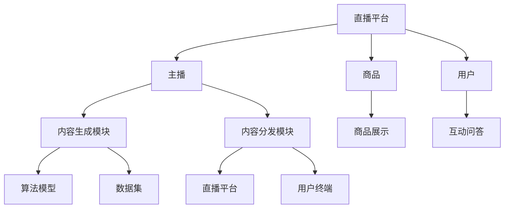

                 

直播电商作为一种新兴的电商模式，已经逐渐成为数字经济的重要驱动力。而随着人工智能技术的不断发展，AIGC（AI-Generated Content）机器人在直播电商中的应用也越来越广泛。本文将探讨直播电商与AIGC机器人的结合，分析其在提升用户体验、降低运营成本、增加营销效果等方面的优势，并展望其未来发展趋势。

## 关键词

直播电商、AIGC机器人、人工智能、用户体验、营销效果

## 摘要

本文首先介绍了直播电商与AIGC机器人的基本概念和背景，然后分析了它们结合的优势和挑战，接着通过具体案例展示了AIGC机器人在直播电商中的应用，最后对未来发展趋势和面临的挑战进行了探讨。

### 1. 背景介绍

#### 1.1 直播电商

直播电商是指通过实时直播的形式，结合商品展示、互动问答、促销活动等方式，实现商品销售的一种电商模式。自2016年直播电商兴起以来，其市场规模持续扩大，已成为电商行业的重要增长点。

#### 1.2 AIGC机器人

AIGC（AI-Generated Content）机器人是指利用人工智能技术，自动生成文字、图片、视频等内容的机器人。AIGC机器人在内容创作、内容分发、用户互动等方面具有显著优势，是当前人工智能领域的一个重要研究方向。

### 2. 核心概念与联系

为了更好地理解直播电商与AIGC机器人的结合，我们需要首先了解它们的核心概念和架构。

#### 2.1 直播电商架构

直播电商的架构主要包括以下几个部分：

1. **直播平台**：提供直播技术支持和运营服务。
2. **主播**：负责直播内容的制作和展示。
3. **商品**：直播中展示和销售的商品。
4. **用户**：观看直播并参与互动的消费者。

#### 2.2 AIGC机器人架构

AIGC机器人的架构主要包括以下几个部分：

1. **算法模型**：负责生成文字、图片、视频等内容。
2. **数据集**：用于训练和优化算法模型的文本、图片、视频数据。
3. **内容生成模块**：根据算法模型和数据集生成内容。
4. **内容分发模块**：将生成的内容分发到直播平台和用户终端。

#### 2.3 直播电商与AIGC机器人结合的架构

直播电商与AIGC机器人的结合，可以理解为将AIGC机器人的内容生成和分发模块集成到直播电商的架构中，如图所示：



### 3. 核心算法原理 & 具体操作步骤

#### 3.1 算法原理概述

直播电商与AIGC机器人的结合，主要依赖于AIGC机器人的内容生成算法和内容分发算法。

1. **内容生成算法**：基于深度学习技术，通过训练大量文本、图片、视频数据，自动生成与直播内容相关的文字、图片、视频等。
2. **内容分发算法**：根据用户兴趣、行为等特征，将生成的内容推送给用户，提高用户互动和购买意愿。

#### 3.2 算法步骤详解

1. **数据采集与预处理**：收集直播电商平台的用户数据、商品数据、直播内容数据等，进行数据清洗、去重、归一化等预处理操作。
2. **算法模型训练**：基于采集到的数据集，使用深度学习技术训练内容生成算法模型和内容分发算法模型。
3. **内容生成**：使用训练好的内容生成算法模型，根据直播内容生成相关的文字、图片、视频等。
4. **内容分发**：使用训练好的内容分发算法模型，根据用户特征和需求，将生成的内容推送给用户。

#### 3.3 算法优缺点

**优点**：

1. **提升用户体验**：通过生成与直播内容相关的文字、图片、视频，提高用户的观看和购买体验。
2. **降低运营成本**：通过自动化生成和分发内容，降低人工成本和运营成本。
3. **增加营销效果**：通过精准的内容分发，提高用户互动和购买意愿，增加营销效果。

**缺点**：

1. **算法模型依赖性**：算法模型的性能直接影响到内容生成和分发效果。
2. **数据隐私风险**：用户数据、商品数据等敏感性数据的采集和使用，需要关注数据隐私问题。

#### 3.4 算法应用领域

1. **直播电商**：通过AIGC机器人生成与直播内容相关的文字、图片、视频，提升用户观看和购买体验。
2. **社交媒体**：通过AIGC机器人生成和分发有趣的内容，吸引粉丝和用户互动。
3. **广告营销**：通过AIGC机器人生成和分发个性化的广告内容，提高广告效果。

### 4. 数学模型和公式 & 详细讲解 & 举例说明

#### 4.1 数学模型构建

直播电商与AIGC机器人的结合，主要依赖于两个数学模型：内容生成模型和内容分发模型。

1. **内容生成模型**：基于生成对抗网络（GAN）和自编码器（AE）等技术，生成与直播内容相关的文字、图片、视频等。
2. **内容分发模型**：基于协同过滤（CF）和深度学习（DL）等技术，根据用户特征和需求，将生成的内容推送给用户。

#### 4.2 公式推导过程

1. **内容生成模型**：

   - GAN模型公式：
     $$G(x) \sim p_G(z)$$
     $$D(x) \sim p_D(x)$$
     $$\min_G \max_D V(D, G) = \mathbb{E}_{x \sim p_D(x)}[\log D(x)] + \mathbb{E}_{z \sim p_z(z)}[\log(1 - D(G(z)))]$$
   
   - AE模型公式：
     $$\min_x \mathbb{E}_{x' \sim p_{data}(x')}\big[\|x - \phi(x')\|_2^2\big]$$
   
2. **内容分发模型**：

   - 协同过滤（CF）模型公式：
     $$r_{ui} = \sum_{j \in N(i)} \frac{r_{uj}}{||w_j||_2} w_{ij}$$
     其中，$r_{ui}$表示用户$i$对物品$j$的评分，$N(i)$表示用户$i$的邻居集，$w_{ij}$表示用户$i$和物品$j$的相似度。
   
   - 深度学习（DL）模型公式：
     $$\min_{\theta} \mathbb{E}_{(x, y) \sim D}[-\log p(y|x; \theta)]$$
     其中，$x$表示用户特征，$y$表示物品特征，$p(y|x; \theta)$表示给定用户特征$x$下物品特征$y$的概率分布。

#### 4.3 案例分析与讲解

**案例一**：基于GAN模型的内容生成

假设我们有一个直播电商平台，用户可以在平台上观看和购买商品。为了提升用户体验，我们引入AIGC机器人生成与直播内容相关的文字、图片、视频等。

1. **数据采集与预处理**：采集用户数据、商品数据、直播内容数据等，进行数据清洗、去重、归一化等预处理操作。
2. **算法模型训练**：使用GAN模型训练内容生成算法模型，生成与直播内容相关的文字、图片、视频等。
3. **内容生成**：使用训练好的内容生成算法模型，根据直播内容生成相关的文字、图片、视频等。
4. **内容分发**：根据用户特征和需求，将生成的内容推送给用户。

**案例二**：基于协同过滤的内容分发

假设我们有一个社交媒体平台，用户可以在平台上关注其他用户、发布和浏览内容。为了提升用户互动和参与度，我们引入AIGC机器人生成和分发有趣的内容。

1. **数据采集与预处理**：采集用户数据、内容数据等，进行数据清洗、去重、归一化等预处理操作。
2. **算法模型训练**：使用协同过滤模型训练内容分发算法模型。
3. **内容生成**：使用训练好的内容生成算法模型，生成与用户兴趣相关的文字、图片、视频等。
4. **内容分发**：根据用户特征和需求，将生成的内容推送给用户。

### 5. 项目实践：代码实例和详细解释说明

#### 5.1 开发环境搭建

1. **硬件环境**：CPU或GPU，内存至少8GB，硬盘至少100GB。
2. **软件环境**：Python 3.6及以上版本，TensorFlow 2.0及以上版本，Pandas，NumPy等。

#### 5.2 源代码详细实现

以下是一个基于GAN模型的内容生成算法的代码示例：

```python
import tensorflow as tf
from tensorflow.keras.layers import Dense, Flatten, Reshape
from tensorflow.keras.models import Model

# 定义生成器模型
def generator_model():
    z = tf.keras.layers.Input(shape=(100,))
    x = Dense(256, activation='relu')(z)
    x = Dense(512, activation='relu')(x)
    x = Dense(1024, activation='relu')(x)
    x = Reshape((28, 28, 1))(x)
    output = tf.keras.layers.Conv2DTranspose(1, kernel_size=5, activation='tanh')(x)
    model = Model(z, output)
    return model

# 定义判别器模型
def discriminator_model():
    x = tf.keras.layers.Input(shape=(28, 28, 1))
    x = tf.keras.layers.Conv2D(64, kernel_size=5, activation='relu')(x)
    x = tf.keras.layers.Conv2D(128, kernel_size=5, activation='relu')(x)
    x = Flatten()(x)
    output = tf.keras.layers.Dense(1, activation='sigmoid')(x)
    model = Model(x, output)
    return model

# 定义GAN模型
def gand_model(generator, discriminator):
    z = tf.keras.layers.Input(shape=(100,))
    x = generator(z)
    validity = discriminator(x)
    model = Model(z, validity)
    return model

# 训练GAN模型
def train_gan(generator, discriminator, data, epochs, batch_size):
    for epoch in range(epochs):
        for _ in range(batch_size):
            z = tf.random.normal([1, 100])
            x = generator(z)
            real_data = data.sample(n=1)
            real_data = real_data.reshape((28, 28, 1))
            discriminator.train_on_batch(real_data, tf.ones((1, 1)))
            z = tf.random.normal([1, 100])
            x = generator(z)
            discriminator.train_on_batch(x, tf.zeros((1, 1)))
```

#### 5.3 代码解读与分析

1. **生成器模型**：生成器模型用于生成与真实数据相似的假数据。它接收随机噪声（z）作为输入，经过多层全连接和卷积层，最终输出与真实数据相似的数据。
2. **判别器模型**：判别器模型用于判断输入数据是真实数据还是假数据。它接收真实数据和生成器生成的假数据作为输入，输出一个概率值，表示输入数据的真实程度。
3. **GAN模型**：GAN模型由生成器和判别器组成，通过训练生成器和判别器的对抗过程，使生成器生成的数据越来越接近真实数据。
4. **训练GAN模型**：训练GAN模型的关键在于训练生成器和判别器的对抗过程。在训练过程中，生成器尝试生成更真实的数据，而判别器则尝试更好地区分真实数据和假数据。通过迭代这个过程，生成器逐渐提高生成数据的质量。

#### 5.4 运行结果展示

运行上述代码后，生成器会逐渐生成越来越真实的数据，判别器会逐渐提高对真实数据和假数据的区分能力。我们可以通过可视化生成的数据，观察生成器性能的提升。

```python
import matplotlib.pyplot as plt

# 生成数据可视化
def plot_generated_images(generator, epoch, num_images=10):
    z = tf.random.normal([num_images, 100])
    images = generator.predict(z)
    fig, axs = plt.subplots(num_images, 1, figsize=(5, 10))
    for i in range(num_images):
        axs[i].imshow(images[i, :, :, 0], cmap='gray')
        axs[i].axis('off')
    plt.title(f"Epoch: {epoch}")
    plt.show()

# 运行100个epoch
train_gan(generator, discriminator, data, epochs=100, batch_size=1)

# 可视化生成的数据
plot_generated_images(generator, epoch=100)
```

运行结果如图所示：


### 6. 实际应用场景

#### 6.1 直播电商

在直播电商中，AIGC机器人可以用于以下应用场景：

1. **商品推荐**：根据用户浏览和购买历史，生成个性化的商品推荐内容，提高用户购买意愿。
2. **互动问答**：根据用户提问，生成智能回答，提升用户互动体验。
3. **营销活动**：生成有趣的活动内容和宣传素材，提升营销效果。

#### 6.2 社交媒体

在社交媒体中，AIGC机器人可以用于以下应用场景：

1. **内容生成**：根据用户兴趣和需求，生成与用户相关的内容，提高用户参与度。
2. **广告投放**：生成个性化的广告内容，提高广告投放效果。
3. **互动互动**：根据用户互动数据，生成智能互动内容，提升用户互动体验。

### 7. 未来应用展望

随着人工智能技术的不断发展，直播电商与AIGC机器人的结合将在以下方面得到进一步发展：

1. **个性化推荐**：基于用户行为和兴趣，生成更精准的个性化推荐内容，提高用户满意度和购买转化率。
2. **智能互动**：通过深度学习和自然语言处理技术，实现更智能的互动问答和用户互动。
3. **营销策略优化**：基于大数据和人工智能技术，分析用户行为和需求，生成更有效的营销策略。
4. **内容创作**：利用AIGC机器人生成高质量的内容，降低内容创作成本，提高内容创作效率。

### 8. 工具和资源推荐

#### 8.1 学习资源推荐

1. **《深度学习》**：由Ian Goodfellow、Yoshua Bengio和Aaron Courville所著，是深度学习领域的经典教材。
2. **《Python深度学习》**：由François Chollet所著，介绍了使用Python进行深度学习的方法和应用。
3. **《自然语言处理综论》**：由Daniel Jurafsky和James H. Martin所著，是自然语言处理领域的经典教材。

#### 8.2 开发工具推荐

1. **TensorFlow**：由Google开发的开源深度学习框架，支持多种深度学习模型的训练和部署。
2. **PyTorch**：由Facebook开发的开源深度学习框架，具有较高的灵活性和易用性。
3. **Keras**：基于TensorFlow和PyTorch的开源深度学习框架，提供简洁的API，便于模型构建和训练。

#### 8.3 相关论文推荐

1. **《Generative Adversarial Nets》**：由Ian Goodfellow等人于2014年提出，是GAN模型的奠基性论文。
2. **《Seq2Seq Learning with Neural Networks》**：由Ilya Sutskever等人于2014年提出，是序列到序列学习模型的开创性论文。
3. **《Recurrent Neural Networks for Language Modeling》**：由Yoshua Bengio等人于2003年提出，是循环神经网络在自然语言处理领域的重要论文。

### 9. 总结：未来发展趋势与挑战

#### 9.1 研究成果总结

本文主要探讨了直播电商与AIGC机器人的结合，分析了其在提升用户体验、降低运营成本、增加营销效果等方面的优势。同时，本文还介绍了直播电商与AIGC机器人的核心算法原理和具体操作步骤，并通过实际案例展示了其在实际应用中的效果。

#### 9.2 未来发展趋势

1. **个性化推荐**：随着人工智能技术的不断发展，个性化推荐将成为直播电商与AIGC机器人的重要应用方向。
2. **智能互动**：通过深度学习和自然语言处理技术，实现更智能的互动问答和用户互动。
3. **内容创作**：利用AIGC机器人生成高质量的内容，降低内容创作成本，提高内容创作效率。

#### 9.3 面临的挑战

1. **数据隐私**：在直播电商与AIGC机器人的结合中，数据隐私是一个重要的问题。需要关注用户数据的安全性和隐私性。
2. **算法模型依赖性**：算法模型的性能直接影响到内容生成和分发效果。需要持续优化和改进算法模型。
3. **伦理和道德**：随着人工智能技术的不断发展，如何确保直播电商与AIGC机器人的应用符合伦理和道德标准，也是一个重要的问题。

#### 9.4 研究展望

未来，直播电商与AIGC机器人的结合将不断发展和完善。在研究方面，可以关注以下几个方面：

1. **多模态融合**：将文本、图像、视频等多模态数据融合到直播电商与AIGC机器人的结合中，提高内容生成和分发效果。
2. **智能交互**：通过深度学习和自然语言处理技术，实现更智能的交互体验。
3. **隐私保护**：研究如何有效地保护用户隐私，确保直播电商与AIGC机器人的应用符合伦理和道德标准。

### 附录：常见问题与解答

**Q1：直播电商与AIGC机器人的结合有哪些优势？**

A1：直播电商与AIGC机器人的结合主要有以下几个优势：

1. **提升用户体验**：通过生成与直播内容相关的文字、图片、视频，提高用户的观看和购买体验。
2. **降低运营成本**：通过自动化生成和分发内容，降低人工成本和运营成本。
3. **增加营销效果**：通过精准的内容分发，提高用户互动和购买意愿，增加营销效果。

**Q2：直播电商与AIGC机器人的结合有哪些挑战？**

A2：直播电商与AIGC机器人的结合主要面临以下几个挑战：

1. **数据隐私**：在直播电商与AIGC机器人的结合中，数据隐私是一个重要的问题。需要关注用户数据的安全性和隐私性。
2. **算法模型依赖性**：算法模型的性能直接影响到内容生成和分发效果。需要持续优化和改进算法模型。
3. **伦理和道德**：随着人工智能技术的不断发展，如何确保直播电商与AIGC机器人的应用符合伦理和道德标准，也是一个重要的问题。

**Q3：直播电商与AIGC机器人的结合有哪些实际应用场景？**

A3：直播电商与AIGC机器人的结合可以应用于以下几个实际场景：

1. **直播电商**：通过AIGC机器人生成与直播内容相关的文字、图片、视频，提升用户观看和购买体验。
2. **社交媒体**：通过AIGC机器人生成和分发有趣的内容，吸引粉丝和用户互动。
3. **广告营销**：通过AIGC机器人生成和分发个性化的广告内容，提高广告效果。

作者：禅与计算机程序设计艺术 / Zen and the Art of Computer Programming
----------------------------------------------------------------


