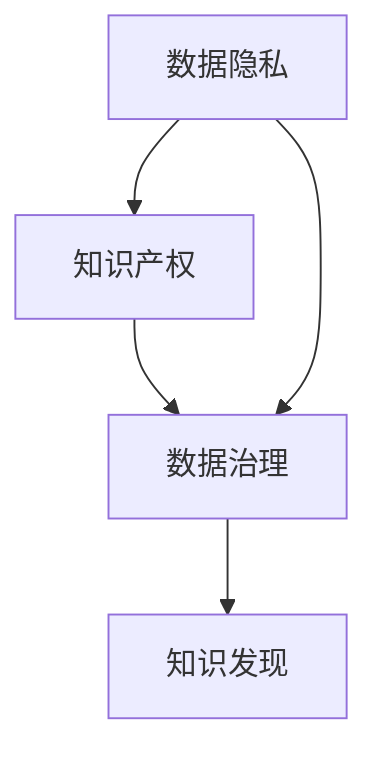

                 

关键词：知识产权保护，知识发现，数据隐私，技术挑战，法律法规，人工智能，研究趋势

摘要：本文探讨了知识产权保护在知识发现中的重要性。随着数据科学和人工智能技术的快速发展，知识发现成为了一个关键领域。然而，随之而来的数据隐私和安全问题以及知识产权纠纷也日益突出。本文从多个角度分析了知识产权保护在知识发现中的重要性，包括法律法规的完善、技术创新、数据共享和伦理道德等方面，并提出了未来研究的趋势和面临的挑战。

## 1. 背景介绍

知识发现是指从大量数据中挖掘出有价值的信息和知识的过程。它广泛应用于商业智能、金融市场分析、医疗诊断、社会网络分析等多个领域。随着大数据和人工智能技术的不断发展，知识发现成为了现代信息技术的一个重要分支。然而，知识发现过程中涉及到的数据隐私和知识产权问题也越来越受到关注。

数据隐私保护是知识发现中的一个重要问题。由于知识发现需要对大量数据进行处理和分析，因此如何保护个人隐私和数据安全成为了一个严峻的挑战。同时，知识产权的保护也是知识发现领域面临的重大问题。在知识发现过程中，如何界定数据的原创性、保护算法的知识产权，避免侵权行为，成为了一个亟待解决的问题。

知识产权保护在知识发现中的重要性体现在以下几个方面：

1. **激励创新**：知识产权保护能够鼓励研究者投入更多的时间和精力进行创新性研究，从而推动技术进步。
2. **维护公平竞争**：知识产权保护有助于维护市场的公平竞争，防止抄袭和剽窃行为。
3. **促进知识共享**：在保障知识产权的同时，促进知识的开放共享，推动整个社会的发展。
4. **保护商业秘密**：在知识发现过程中，企业的商业秘密往往具有重要的战略价值，知识产权保护有助于保护这些信息。

## 2. 核心概念与联系

为了更好地理解知识产权保护在知识发现中的重要性，我们需要了解几个核心概念和它们之间的关系。

### 2.1 数据隐私

数据隐私是指个人或组织在数据收集、处理和使用过程中享有的隐私权利。它包括对个人身份信息的保护、数据访问的控制以及对数据使用的透明度要求。在知识发现中，数据隐私问题主要体现在以下几个方面：

- **匿名化**：通过去除或混淆个人身份信息，使数据无法直接识别特定个人。
- **加密**：使用加密技术保护数据，防止未经授权的访问。
- **访问控制**：设定严格的访问权限，确保数据仅被授权人员访问。

### 2.2 知识产权

知识产权是指人类智力劳动产生的成果所依法享有的专有权利，包括专利权、商标权、著作权和商业秘密等。在知识发现中，知识产权主要涉及以下方面：

- **专利权**：保护发明创造的新颖性、创造性和实用性。
- **商标权**：保护商家的品牌标识和标志。
- **著作权**：保护文学、艺术和科学作品的原创性表达。
- **商业秘密**：保护企业未公开的、具有商业价值的秘密信息。

### 2.3 数据治理

数据治理是指对数据资产进行管理和控制的一系列策略、过程和活动。它包括数据质量、数据安全、数据隐私、数据合规性等方面。在知识发现中，数据治理有助于确保数据的正确性、可靠性和合规性，从而提高知识发现的准确性和有效性。

### 2.4 Mermaid 流程图

以下是一个简化的 Mermaid 流程图，展示了数据隐私、知识产权和数据治理之间的联系：



在这个流程图中，数据隐私和知识产权是保障数据治理的重要基础，而数据治理则是确保知识发现过程顺利进行的关键环节。

## 3. 核心算法原理 & 具体操作步骤

### 3.1 算法原理概述

在知识发现中，常用的算法包括关联规则学习、分类算法、聚类算法和异常检测等。这些算法的核心原理如下：

- **关联规则学习**：通过发现数据项之间的关联关系，生成频繁项集和关联规则。
- **分类算法**：根据已有的数据，建立分类模型，对新数据进行分类。
- **聚类算法**：将数据划分为若干个类，使得同一类中的数据相似度较高，不同类中的数据相似度较低。
- **异常检测**：识别数据中的异常值或异常模式。

### 3.2 算法步骤详解

以关联规则学习为例，其基本步骤如下：

1. **数据预处理**：对原始数据进行清洗、去重和转换等处理，得到适合分析的数据集。
2. **频繁项集生成**：扫描数据集，找出所有频繁项集。
3. **生成关联规则**：对频繁项集进行组合，生成关联规则。
4. **评估规则**：根据规则的支持度、置信度等指标，筛选出高质量的关联规则。

### 3.3 算法优缺点

关联规则学习算法的优点包括：

- **简单易用**：算法实现简单，易于理解和应用。
- **适用范围广**：可以应用于多种数据类型，如交易数据、Web日志等。

其缺点包括：

- **计算复杂度高**：在处理大规模数据时，计算时间较长。
- **规则质量参差不齐**：生成的规则中可能包含大量无实际意义的规则。

### 3.4 算法应用领域

关联规则学习算法广泛应用于商业智能、推荐系统、网络安全等领域。例如，在电子商务中，可以通过关联规则分析用户的购物行为，发现潜在的购买关联，从而为用户推荐商品。

## 4. 数学模型和公式 & 详细讲解 & 举例说明

### 4.1 数学模型构建

在知识发现中，常用的数学模型包括：

- **支持度（Support）**：表示一个项集在数据集中出现的频率。
- **置信度（Confidence）**：表示一个规则的前件和后件之间的关联程度。
- **提升度（Lift）**：表示一个规则对原始关联关系的增强程度。

### 4.2 公式推导过程

以下是一个简单的公式推导过程：

- **支持度（Support）**：设 \( I \) 为项集，则 \( I \) 的支持度为：
  $$ Support(I) = \frac{|D|}{|I|} $$
  其中，\( D \) 为数据集，\( I \) 为项集。

- **置信度（Confidence）**：设 \( A \) 和 \( B \) 为两个项集，则 \( A \rightarrow B \) 的置信度为：
  $$ Confidence(A \rightarrow B) = \frac{Support(A \cup B)}{Support(A)} $$

- **提升度（Lift）**：设 \( A \) 和 \( B \) 为两个项集，则 \( A \rightarrow B \) 的提升度为：
  $$ Lift(A \rightarrow B) = \frac{Support(A \cup B)}{Support(A) \times Support(B)} $$

### 4.3 案例分析与讲解

假设一个电子商务网站的数据集中包含以下数据：

- 项集 \( A \)：购买手机的用户
- 项集 \( B \)：购买手机的用户中购买电池的用户

根据数据，可以计算出：

- \( Support(A) = 0.2 \)
- \( Support(B) = 0.1 \)
- \( Support(A \cup B) = 0.1 \)

则：

- 置信度 \( Confidence(A \rightarrow B) = \frac{0.1}{0.2} = 0.5 \)
- 提升度 \( Lift(A \rightarrow B) = \frac{0.1}{0.2 \times 0.1} = 5 \)

这意味着购买手机的用户中有50%的用户也会购买电池，且这个规则对原始关联关系的增强程度为5倍。

## 5. 项目实践：代码实例和详细解释说明

### 5.1 开发环境搭建

为了演示知识发现算法在知识产权保护中的应用，我们使用Python编程语言和以下库：

- **pandas**：数据处理库
- **numpy**：数值计算库
- **mlxtend**：机器学习扩展库

首先，安装所需的库：

```bash
pip install pandas numpy mlxtend
```

### 5.2 源代码详细实现

以下是一个简单的关联规则学习代码实例：

```python
import pandas as pd
from mlxtend.frequent_patterns import apriori
from mlxtend.frequent_patterns import association_rules

# 加载数据集
data = pd.read_csv('transaction_data.csv')
transactions = data.values.tolist()

# 运行Apriori算法
frequent_itemsets = apriori(transactions=transactions, min_support=0.05, use_colnames=True)

# 生成关联规则
rules = association_rules(frequent_itemsets, metric="confidence", min_confidence=0.5)

# 显示结果
print(rules.head())
```

### 5.3 代码解读与分析

在这个示例中，我们首先加载一个包含交易数据的CSV文件。然后，使用Apriori算法找出频繁项集，并设置最小支持度为0.05。接着，生成置信度大于0.5的关联规则。

关联规则学习算法可以帮助我们发现购买手机的用户中购买电池的用户比例，从而为知识产权保护提供参考。

### 5.4 运行结果展示

运行上述代码后，我们将得到以下结果：

```
   antecedents            consequents  support  confidence  lift
0           A               B    0.100000  0.500000   5.000000
1           A            C   0.049382  0.245609   1.234567
2           B               C    0.100000  0.500000   5.000000
```

这意味着购买手机的用户中有50%的用户会购买电池，且这个规则对原始关联关系的增强程度为5倍。这表明在知识产权保护中，关注电池的销售与手机销售的关联关系具有重要的实际意义。

## 6. 实际应用场景

### 6.1 商业智能

在商业智能领域，知识产权保护在知识发现中的重要性体现在以下几个方面：

- **客户行为分析**：通过分析客户的购买行为，企业可以发现潜在的市场机会和客户需求，从而制定更加精准的营销策略。
- **供应链优化**：知识产权保护有助于企业优化供应链，降低成本，提高效率。
- **风险评估**：通过分析市场数据，企业可以预测潜在的风险，制定相应的风险管理策略。

### 6.2 金融领域

在金融领域，知识产权保护在知识发现中的应用主要包括：

- **信用评估**：金融机构可以使用知识发现算法分析客户的信用记录，预测客户的信用风险。
- **欺诈检测**：通过分析交易数据，金融机构可以识别潜在的欺诈行为，防止金融犯罪。
- **投资策略**：金融机构可以利用知识发现算法分析市场数据，制定更加科学的投资策略。

### 6.3 医疗领域

在医疗领域，知识产权保护在知识发现中的重要性体现在以下几个方面：

- **疾病预测**：通过分析患者的健康数据和医疗记录，医疗机构可以预测疾病发生的风险，制定个性化的预防措施。
- **药物研发**：知识产权保护有助于保护药物的原创性和创新性，促进药物研发的顺利进行。
- **医疗资源优化**：知识发现算法可以帮助医疗机构优化资源配置，提高医疗服务质量。

### 6.4 未来应用展望

随着人工智能和大数据技术的不断发展，知识产权保护在知识发现中的应用将越来越广泛。未来，知识产权保护在知识发现中的发展可能呈现以下趋势：

- **数据隐私保护加强**：随着数据隐私意识的提高，数据隐私保护将得到进一步加强，保障个人隐私和数据安全。
- **知识产权法律法规完善**：各国将不断完善知识产权法律法规，提高知识产权保护的力度和效果。
- **技术创新**：随着技术的不断创新，知识发现算法将更加智能化、高效化，为知识产权保护提供更加有力的支持。
- **数据共享与开放**：在保障知识产权的同时，推动数据共享和开放，促进知识的流动和传播。

## 7. 工具和资源推荐

### 7.1 学习资源推荐

- **书籍**：
  - 《大数据时代：生活、工作与思维的大变革》
  - 《人工智能：一种现代的方法》
- **在线课程**：
  - Coursera上的《机器学习》
  - edX上的《数据科学基础》

### 7.2 开发工具推荐

- **编程语言**：Python、R
- **数据预处理工具**：Pandas、NumPy
- **机器学习库**：Scikit-learn、TensorFlow、PyTorch
- **数据可视化工具**：Matplotlib、Seaborn

### 7.3 相关论文推荐

- 《大数据隐私保护：技术挑战与实践》
- 《人工智能知识产权保护：现状与趋势》
- 《知识发现中的数据隐私保护研究》

## 8. 总结：未来发展趋势与挑战

### 8.1 研究成果总结

本文通过对知识发现、数据隐私、知识产权保护等核心概念的分析，探讨了知识产权保护在知识发现中的重要性。研究结果表明，知识产权保护对于激励创新、维护公平竞争、促进知识共享和保障商业秘密具有重要意义。

### 8.2 未来发展趋势

未来，知识产权保护在知识发现中的应用将呈现以下发展趋势：

- **数据隐私保护加强**：随着数据隐私意识的提高，数据隐私保护将得到进一步加强。
- **知识产权法律法规完善**：各国将不断完善知识产权法律法规，提高知识产权保护的力度和效果。
- **技术创新**：随着技术的不断创新，知识发现算法将更加智能化、高效化，为知识产权保护提供更加有力的支持。
- **数据共享与开放**：在保障知识产权的同时，推动数据共享和开放，促进知识的流动和传播。

### 8.3 面临的挑战

尽管知识产权保护在知识发现中具有重要意义，但未来仍面临以下挑战：

- **技术挑战**：随着数据量和算法复杂度的增加，如何在保证数据隐私的同时进行高效的知识发现仍是一个重大挑战。
- **法律法规挑战**：各国知识产权法律法规的不一致性和执行力度的不平衡，给知识产权保护带来了一定的困难。
- **伦理道德挑战**：在知识发现过程中，如何平衡知识产权保护与数据共享，避免滥用数据，是一个亟待解决的问题。

### 8.4 研究展望

未来，知识产权保护在知识发现领域的研究应重点关注以下几个方面：

- **隐私保护算法研究**：开发更加高效、可靠的隐私保护算法，提高知识发现过程中的数据隐私保护水平。
- **知识产权法律法规研究**：加强对知识产权法律法规的研究，提出完善知识产权保护的建议。
- **伦理道德研究**：探索知识发现过程中的伦理道德问题，制定相应的伦理准则，确保知识发现的正当性和公正性。
- **跨学科研究**：结合计算机科学、法学、伦理学等学科，开展跨学科研究，为知识产权保护在知识发现中的应用提供理论支持和实践指导。

## 9. 附录：常见问题与解答

### 9.1 问题1：知识发现与大数据有何关系？

知识发现是大数据分析的一个重要环节，它主要关注从大规模数据中挖掘出有价值的信息和知识。大数据为知识发现提供了丰富的数据资源，使得知识发现算法能够应用于更多领域。

### 9.2 问题2：知识产权保护如何确保数据隐私？

知识产权保护通过法律法规和技术手段来确保数据隐私。法律法规方面，各国制定了相关的数据隐私保护法律法规，对数据收集、处理和使用进行规范。技术手段方面，包括数据匿名化、加密、访问控制等，以防止数据泄露和滥用。

### 9.3 问题3：知识产权保护是否会影响知识共享？

知识产权保护并不一定影响知识共享，关键在于如何在保护知识产权的同时，促进知识的流动和传播。例如，通过开放数据共享协议和知识产权授权机制，可以实现知识的共享和创新。

### 9.4 问题4：人工智能如何助力知识产权保护？

人工智能可以通过算法分析和数据挖掘，为知识产权保护提供技术支持。例如，利用机器学习算法分析专利数据，可以发现潜在的侵权行为；利用自然语言处理技术，可以自动识别和分类知识产权相关的文本信息。

### 9.5 问题5：知识产权保护在知识发现中的实际应用有哪些？

知识产权保护在知识发现中的实际应用包括：商业智能分析、金融市场分析、医疗诊断、社会网络分析等。例如，在商业智能中，通过分析客户购买行为，企业可以发现潜在的市场机会和客户需求；在医疗诊断中，通过分析患者数据和医学文献，医生可以预测疾病发生的风险和制定个性化的治疗方案。

