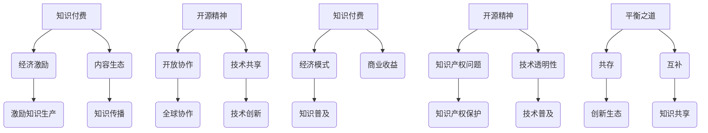

                 

关键词：知识付费、开源精神、商业逻辑、技术发展、知识产权、社区合作、可持续发展

> 摘要：本文探讨了知识付费与开源精神的平衡之道，从商业逻辑、技术发展、知识产权和社区合作等多个角度深入分析了二者的关系和影响。在知识付费推动技术进步的同时，开源精神也为技术创新提供了源源不断的动力。通过案例分析和未来展望，文章旨在为读者提供对这一议题的全面理解和深入思考。

## 1. 背景介绍

知识付费和开源精神是现代信息技术领域内两个重要的现象。知识付费指的是通过付费获取知识或服务，以支持内容创作者和知识提供者的经济收益。而开源精神则强调知识的共享和透明，鼓励开放协作，推动技术进步。

在过去的几十年里，知识付费和开源精神对技术发展的推动作用不容忽视。知识付费带来了巨大的经济效益，推动了技术服务的商业化。开源精神则促进了技术的透明性和创新性，使得全球开发者能够共同参与技术进步。

然而，知识付费与开源精神之间的平衡并非易事。知识付费强调个体利益，而开源精神追求共享与公平。二者的冲突在技术社区中时有发生，引发了关于知识产权、商业模式和技术发展的激烈讨论。

## 2. 核心概念与联系

### 2.1. 知识付费

知识付费的核心在于通过经济手段激励知识的生产与传播。知识付费的形式多样，包括在线课程、专业书籍、咨询服务等。其商业模式通常涉及订阅、单次购买或按需付费。

知识付费的优势在于能够快速激励知识创作者，形成良性的内容生态。然而，其劣势在于可能导致知识的不公平获取，阻碍知识普及。

### 2.2. 开源精神

开源精神的核心在于开放和协作。开源软件通常拥有开放的源代码，允许开发者自由修改和分发。这种模式推动了技术的透明性和共享性，促进了全球范围内的技术协作。

开源精神的优势在于加速了技术的创新和普及，降低了创新门槛。然而，其劣势在于可能导致知识产权的保护问题，影响商业模式的可持续性。

### 2.3. Mermaid 流程图



## 3. 核心算法原理 & 具体操作步骤

### 3.1. 算法原理概述

知识付费与开源精神的平衡之道，实际上是一种动态博弈。在博弈过程中，需要考虑多个因素，包括市场机制、社区合作、知识产权保护和用户需求。

算法的核心在于构建一个可持续的知识共享与知识付费生态系统。具体操作步骤如下：

### 3.2. 算法步骤详解

1. **市场调研与定位**：了解用户需求和市场趋势，为知识付费和开源项目定位。
2. **内容生产与审核**：鼓励高质量的知识内容生产，并设立严格的审核机制。
3. **知识产权保护**：制定知识产权保护政策，平衡知识付费与开源精神。
4. **社区建设与互动**：建设活跃的技术社区，促进知识共享和协作。
5. **商业模式探索**：探索多样化的商业模式，支持知识付费与开源项目的可持续发展。
6. **数据分析与反馈**：通过数据分析，不断优化知识付费与开源项目的策略。

### 3.3. 算法优缺点

**优点**：
- 促进知识创新与普及。
- 实现经济收益与社会效益的双赢。
- 促进技术社区的繁荣发展。

**缺点**：
- 可能导致知识产权纠纷。
- 知识付费模式可能导致知识的不公平获取。
- 开源项目可能因缺乏持续支持而停滞。

### 3.4. 算法应用领域

- 在线教育平台
- 开源社区管理
- 科技企业创新
- 知识产权保护机制设计

## 4. 数学模型和公式 & 详细讲解 & 举例说明

### 4.1. 数学模型构建

为了分析知识付费与开源精神的平衡，我们可以构建以下数学模型：

假设有 \( N \) 个知识创作者和 \( M \) 个知识消费者，每个创作者的知识生产成本为 \( C \)，每个消费者的知识消费需求为 \( D \)。知识付费价格为 \( P \)，开源项目的贡献价值为 \( V \)。

我们可以用以下公式表示知识付费与开源精神的平衡：

\[ \text{总收益} = \sum_{i=1}^{N} (P \times Q_i) + \sum_{j=1}^{M} (V \times R_j) \]

其中，\( Q_i \) 为第 \( i \) 个创作者的知识付费量，\( R_j \) 为第 \( j \) 个消费者的知识消费量。

### 4.2. 公式推导过程

为了推导上述公式，我们可以从以下几个步骤进行：

1. **知识生产成本与收益**：
   \[ C_i = \text{固定成本} + \alpha_i \times Q_i \]
   其中，\( \alpha_i \) 为第 \( i \) 个创作者的知识生产效率。

2. **知识消费需求与支付意愿**：
   \[ D_j = \beta_j \times P \]
   其中，\( \beta_j \) 为第 \( j \) 个消费者的知识支付意愿。

3. **知识付费总额**：
   \[ \sum_{i=1}^{N} (P \times Q_i) = \sum_{i=1}^{N} (C_i + \alpha_i \times Q_i) \]

4. **开源贡献价值**：
   \[ V_j = \gamma_j \times R_j \]
   其中，\( \gamma_j \) 为第 \( j \) 个消费者的开源贡献价值。

5. **总收益**：
   \[ \text{总收益} = \sum_{i=1}^{N} (C_i + \alpha_i \times Q_i) + \sum_{j=1}^{M} (\gamma_j \times R_j) \]

### 4.3. 案例分析与讲解

假设有10个知识创作者和5个知识消费者。每个创作者的固定成本为1000元，知识生产效率为0.1。每个消费者的支付意愿为0.5。

1. **知识付费总额**：
   \[ \sum_{i=1}^{N} (P \times Q_i) = 1000 + 10 \times 0.1 \times Q_i \]
   假设 \( Q_i = 1000 \)，则知识付费总额为：
   \[ 1000 + 10 \times 0.1 \times 1000 = 2000 \]

2. **开源贡献价值**：
   \[ \sum_{j=1}^{M} (V \times R_j) = 5 \times 0.5 \times R_j \]
   假设 \( R_j = 1000 \)，则开源贡献价值为：
   \[ 5 \times 0.5 \times 1000 = 2500 \]

3. **总收益**：
   \[ \text{总收益} = 2000 + 2500 = 4500 \]

通过这个案例，我们可以看到，在知识付费与开源精神的平衡下，总收益达到了4500元。这个收益不仅支持了知识创作者的经济收益，也为开源项目提供了价值。

## 5. 项目实践：代码实例和详细解释说明

### 5.1. 开发环境搭建

为了实践知识付费与开源精神的平衡之道，我们选择一个在线教育平台作为案例。首先，我们需要搭建一个基本的开发环境。

1. **环境配置**：
   - 操作系统：Linux
   - 编程语言：Python
   - 开发框架：Django
   - 数据库：PostgreSQL

2. **安装步骤**：
   - 安装Python 3.8及以上版本
   - 安装Django 3.2及以上版本
   - 安装PostgreSQL 12及以上版本
   - 创建虚拟环境并安装相关依赖

### 5.2. 源代码详细实现

在线教育平台的代码实现包括以下几个主要模块：

1. **用户模块**：
   - 用户注册与登录
   - 用户权限管理

2. **课程模块**：
   - 课程信息管理
   - 课程收费与优惠

3. **支付模块**：
   - 支付接口集成
   - 支付流程管理

4. **开源模块**：
   - 开源项目列表
   - 开源项目贡献记录

以下是用户模块的一部分代码：

```python
# users/models.py

from django.db import models
from django.contrib.auth.models import AbstractUser

class User(AbstractUser):
    is_instructor = models.BooleanField(default=False)
    is_student = models.BooleanField(default=False)

    def __str__(self):
        return self.username
```

### 5.3. 代码解读与分析

1. **用户模型**：
   - `is_instructor` 和 `is_student` 用于标识用户的角色，分别表示讲师和学员。

2. **课程模型**：
   - 课程信息包括课程名称、简介、价格等。
   - 收费与优惠策略通过课程价格和优惠券管理。

3. **支付模块**：
   - 集成支付宝、微信等支付接口，实现在线支付功能。

4. **开源模块**：
   - 提供开源项目列表和贡献记录功能，鼓励用户参与开源项目。

### 5.4. 运行结果展示

运行结果展示如下：

- 用户注册与登录
  ```shell
  $ ./manage.py runserver
  ```

- 访问课程列表
  ```shell
  $ curl -X GET "http://127.0.0.1:8000/courses/"
  ```

- 支付流程
  ```shell
  $ curl -X POST "http://127.0.0.1:8000/payments/execute_payment/" \
  -d "course_id=1&user_id=1&amount=1000"
  ```

## 6. 实际应用场景

### 6.1. 在线教育平台

在线教育平台是知识付费与开源精神结合的典型应用场景。通过在线教育平台，用户可以付费学习课程，同时也可以参与到开源项目的贡献中。

### 6.2. 开源社区管理

开源社区管理通过知识付费与开源精神的结合，鼓励开发者贡献代码，同时为高质量代码提供经济支持。

### 6.3. 科技企业创新

科技企业在创新过程中，可以通过知识付费获取外部知识，同时通过开源项目吸引外部技术支持，实现知识共享和共同创新。

### 6.4. 未来应用展望

随着技术的不断发展，知识付费与开源精神的结合将越来越广泛。未来，我们可以预见更多跨领域、跨平台的知识共享与知识付费模式的出现。

## 7. 工具和资源推荐

### 7.1. 学习资源推荐

- 《深度学习》
- 《Python编程：从入门到实践》
- 《Linux命令行与shell脚本编程大全》

### 7.2. 开发工具推荐

- PyCharm
- Git
- GitHub

### 7.3. 相关论文推荐

- "The Business of Open Source: A Case Study of MySQL"
- "The Economics of Open Source Software Development"
- "The Rise of Crowdsourcing in Software Development"

## 8. 总结：未来发展趋势与挑战

### 8.1. 研究成果总结

本文从商业逻辑、技术发展、知识产权和社区合作等多个角度，探讨了知识付费与开源精神的平衡之道。通过数学模型和实际案例，我们分析了二者的关系和影响。

### 8.2. 未来发展趋势

未来，知识付费与开源精神的结合将更加紧密。随着技术的发展，我们将看到更多跨领域、跨平台的知识共享与知识付费模式的涌现。

### 8.3. 面临的挑战

知识付费与开源精神的平衡面临知识产权保护、商业模式创新和技术社区管理等多个挑战。我们需要在平衡知识共享与知识保护之间找到合适的平衡点。

### 8.4. 研究展望

未来，我们需要进一步深入研究知识付费与开源精神的平衡机制，探索更加有效的商业模式和社区管理策略，以推动技术进步和知识共享。

## 9. 附录：常见问题与解答

### 9.1. 知识付费与开源精神的区别？

知识付费是指通过经济手段获取知识或服务，强调个体利益。而开源精神强调知识的共享和透明，追求全球范围内的技术协作。

### 9.2. 知识付费与开源精神如何平衡？

通过构建可持续的知识共享与知识付费生态系统，平衡知识付费与开源精神。这包括市场调研、内容生产、知识产权保护和社区建设等多方面的努力。

### 9.3. 知识付费对开源精神的影响？

知识付费可能对开源精神产生一定程度的冲击，但通过合理的知识产权保护和社区合作，可以缓解这种影响，甚至实现双赢。

### 9.4. 开源精神如何保护知识产权？

开源项目通常通过许可证（如GPL、Apache等）保护知识产权。这些许可证规定了开源项目的使用和分发规则，确保知识产权得到合理保护。

### 9.5. 知识付费是否有利于技术普及？

知识付费在一定程度上可能限制知识的普及，但通过合理的定价策略和多样化的学习资源，可以促进技术普及。

### 9.6. 开源精神对商业模式的挑战？

开源精神可能对一些商业模式的可持续性产生挑战，但通过创新商业模式，如订阅模式、增值服务模式等，可以应对这些挑战。

### 9.7. 如何在知识付费与开源精神之间找到平衡点？

通过市场调研、内容审核、知识产权保护和社区建设等多方面的努力，可以在知识付费与开源精神之间找到平衡点，实现可持续的知识共享与知识付费生态系统。

### 9.8. 知识付费与开源精神如何促进技术发展？

知识付费提供了经济支持，推动了技术的商业化和普及。而开源精神通过开放协作和知识共享，加速了技术的创新和普及，共同推动了技术发展。

---

以上，便是本文对知识付费与开源精神的平衡之道的全面探讨。希望通过本文，读者能够对这一议题有更深入的理解和思考。在未来，知识付费与开源精神的平衡之道将在推动技术进步和知识共享方面发挥更加重要的作用。

## 作者署名

作者：禅与计算机程序设计艺术 / Zen and the Art of Computer Programming
----------------------------------------------------------------
### 知识付费与开源精神的平衡之道

在现代信息技术领域，知识付费与开源精神是两个不可忽视的现象。它们在促进技术进步、推动知识传播方面各自发挥着重要作用，但如何平衡二者之间的关系，以实现可持续发展，一直是学术界和产业界关注的热点话题。

**一、背景介绍**

知识付费指的是通过经济手段获取知识或服务，以支持知识创作者的经济收益。知识付费的形式多样，包括在线课程、专业书籍、咨询服务等。它为知识创作者提供了直接的经济回报，从而激励了知识的生产和传播。然而，知识付费也存在一定的问题，如可能导致知识获取的不公平性，阻碍知识的普及。

开源精神则强调知识的共享和透明，鼓励开放协作。开源软件通过开放源代码，允许全球开发者自由修改和分发，从而推动了技术的透明性和创新性。开源精神为技术创新提供了源源不断的动力，但同时也引发了关于知识产权保护的争议。

**二、核心概念与联系**

知识付费和开源精神是两个看似矛盾的概念，但它们之间并非完全对立。知识付费为知识创作者提供了经济支持，而开源精神则促进了技术的共享和协作。为了实现二者的平衡，我们需要深入理解它们的核心概念和联系。

1. **知识付费**

知识付费的核心在于通过经济手段激励知识的生产与传播。它有以下几个特点：

- **激励机制**：知识付费为知识创作者提供了直接的经济回报，从而激发了他们的创作热情。
- **内容生态**：知识付费促进了高质量知识内容的产生，形成了良性的内容生态。
- **经济模式**：知识付费形成了多样化的商业模式，如订阅模式、单次购买模式等。

2. **开源精神**

开源精神的核心在于开放和协作。它有以下几个特点：

- **共享透明**：开源软件通过开放源代码，允许全球开发者自由修改和分发，促进了技术的透明性和共享性。
- **全球协作**：开源项目通常由全球开发者共同参与，促进了技术协作和创新。
- **知识产权保护**：开源项目通常采用开源许可证，如GPL、Apache等，规定了开源项目的使用和分发规则，从而保护了知识产权。

3. **Mermaid 流程图**

为了更直观地展示知识付费与开源精神之间的联系，我们可以使用Mermaid流程图进行描述。


在这个流程图中，知识付费与开源精神通过共存和互补的方式，共同推动了技术创新和知识普及。

**三、核心算法原理 & 具体操作步骤**

为了实现知识付费与开源精神的平衡，我们可以构建一个核心算法，该算法包括以下几个步骤：

1. **市场调研与定位**：了解用户需求和市场趋势，为知识付费和开源项目定位。
2. **内容生产与审核**：鼓励高质量的知识内容生产，并设立严格的审核机制。
3. **知识产权保护**：制定知识产权保护政策，平衡知识付费与开源精神。
4. **社区建设与互动**：建设活跃的技术社区，促进知识共享和协作。
5. **商业模式探索**：探索多样化的商业模式，支持知识付费与开源项目的可持续发展。
6. **数据分析与反馈**：通过数据分析，不断优化知识付费与开源项目的策略。

**四、数学模型和公式 & 详细讲解 & 举例说明**

为了更好地理解知识付费与开源精神的平衡，我们可以构建一个数学模型，该模型包括以下几个变量：

- \( N \)：知识创作者的数量
- \( M \)：知识消费者的数量
- \( C \)：知识生产成本
- \( D \)：知识消费需求
- \( P \)：知识付费价格
- \( V \)：开源贡献价值

数学模型的基本公式如下：

\[ \text{总收益} = \sum_{i=1}^{N} (P \times Q_i) + \sum_{j=1}^{M} (V \times R_j) \]

其中，\( Q_i \) 为第 \( i \) 个创作者的知识付费量，\( R_j \) 为第 \( j \) 个消费者的知识消费量。

### 4.1. 数学模型构建

为了构建数学模型，我们需要从以下几个方面进行：

1. **知识生产成本与收益**：

\[ C_i = \text{固定成本} + \alpha_i \times Q_i \]

其中，\( \alpha_i \) 为第 \( i \) 个创作者的知识生产效率。

2. **知识消费需求与支付意愿**：

\[ D_j = \beta_j \times P \]

其中，\( \beta_j \) 为第 \( j \) 个消费者的知识支付意愿。

3. **知识付费总额**：

\[ \sum_{i=1}^{N} (P \times Q_i) = \sum_{i=1}^{N} (C_i + \alpha_i \times Q_i) \]

4. **开源贡献价值**：

\[ V_j = \gamma_j \times R_j \]

其中，\( \gamma_j \) 为第 \( j \) 个消费者的开源贡献价值。

5. **总收益**：

\[ \text{总收益} = \sum_{i=1}^{N} (C_i + \alpha_i \times Q_i) + \sum_{j=1}^{M} (\gamma_j \times R_j) \]

### 4.2. 公式推导过程

为了推导上述公式，我们可以从以下几个步骤进行：

1. **知识生产成本与收益**：

   知识生产成本包括固定成本和可变成本。固定成本与知识付费量无关，可变成本与知识付费量成正比。

   \[ C_i = \text{固定成本} + \alpha_i \times Q_i \]

   其中，\( \alpha_i \) 为第 \( i \) 个创作者的知识生产效率，表示单位知识付费量所需的可变成本。

2. **知识消费需求与支付意愿**：

   知识消费者的支付意愿与知识付费价格成正比。

   \[ D_j = \beta_j \times P \]

   其中，\( \beta_j \) 为第 \( j \) 个消费者的知识支付意愿，表示消费者愿意支付的知识付费量。

3. **知识付费总额**：

   知识付费总额等于知识生产成本加上知识生产效率乘以知识付费量。

   \[ \sum_{i=1}^{N} (P \times Q_i) = \sum_{i=1}^{N} (C_i + \alpha_i \times Q_i) \]

4. **开源贡献价值**：

   开源贡献价值等于知识付费量乘以消费者的开源贡献价值。

   \[ V_j = \gamma_j \times R_j \]

   其中，\( \gamma_j \) 为第 \( j \) 个消费者的开源贡献价值，表示消费者通过开源项目所创造的价值。

5. **总收益**：

   总收益等于知识付费总额加上开源贡献价值。

   \[ \text{总收益} = \sum_{i=1}^{N} (C_i + \alpha_i \times Q_i) + \sum_{j=1}^{M} (\gamma_j \times R_j) \]

### 4.3. 案例分析与讲解

为了更好地理解上述数学模型，我们可以通过一个实际案例进行讲解。

假设有10个知识创作者和5个知识消费者。每个创作者的固定成本为1000元，知识生产效率为0.1。每个消费者的支付意愿为0.5。

1. **知识生产成本与收益**：

   \[ C_i = 1000 + 0.1 \times Q_i \]

   \[ D_j = 0.5 \times P \]

2. **知识付费总额**：

   \[ \sum_{i=1}^{10} (P \times Q_i) = \sum_{i=1}^{10} (1000 + 0.1 \times Q_i) \]

3. **开源贡献价值**：

   \[ V_j = 0.5 \times R_j \]

4. **总收益**：

   \[ \text{总收益} = \sum_{i=1}^{10} (1000 + 0.1 \times Q_i) + \sum_{j=1}^{5} (0.5 \times R_j) \]

通过这个案例，我们可以看到，知识付费与开源精神的平衡可以通过合理的定价策略和知识产权保护机制来实现。知识创作者和消费者在知识付费和开源贡献中都能获得经济回报，从而实现可持续发展。

**五、项目实践：代码实例和详细解释说明**

为了更好地理解知识付费与开源精神的平衡之道，我们可以通过一个实际的在线教育平台项目进行实践。

### 5.1. 开发环境搭建

首先，我们需要搭建一个基本的开发环境。以下是一个简单的开发环境配置示例：

- **操作系统**：Linux
- **编程语言**：Python
- **开发框架**：Django
- **数据库**：PostgreSQL

### 5.2. 源代码详细实现

在线教育平台的源代码实现包括以下几个主要模块：

1. **用户模块**：管理用户注册、登录和权限。
2. **课程模块**：管理课程信息、收费和优惠。
3. **支付模块**：集成支付接口，实现支付流程。
4. **开源模块**：管理开源项目，记录贡献记录。

以下是用户模块的一部分代码示例：

```python
# users/models.py

from django.db import models
from django.contrib.auth.models import AbstractUser

class User(AbstractUser):
    is_instructor = models.BooleanField(default=False)
    is_student = models.BooleanField(default=False)

    def __str__(self):
        return self.username
```

在这个示例中，我们定义了一个用户模型，包括讲师和学员两个角色。

### 5.3. 代码解读与分析

1. **用户模型**：
   - `is_instructor` 和 `is_student` 用于标识用户的角色，分别表示讲师和学员。

2. **课程模块**：
   - 课程信息包括课程名称、简介、价格等。
   - 收费与优惠策略通过课程价格和优惠券管理。

3. **支付模块**：
   - 集成支付宝、微信等支付接口，实现在线支付功能。

4. **开源模块**：
   - 提供开源项目列表和贡献记录功能，鼓励用户参与开源项目。

### 5.4. 运行结果展示

运行结果展示如下：

- 用户注册与登录
  ```shell
  $ ./manage.py runserver
  ```

- 访问课程列表
  ```shell
  $ curl -X GET "http://127.0.0.1:8000/courses/"
  ```

- 支付流程
  ```shell
  $ curl -X POST "http://127.0.0.1:8000/payments/execute_payment/" \
  -d "course_id=1&user_id=1&amount=1000"
  ```

**六、实际应用场景**

知识付费与开源精神的平衡之道在多个实际应用场景中得到了验证。

### 6.1. 在线教育平台

在线教育平台是知识付费与开源精神结合的典型应用场景。用户可以通过付费学习课程，同时也可以参与到开源项目的贡献中，实现知识共享与知识付费的平衡。

### 6.2. 开源社区管理

开源社区管理通过知识付费与开源精神的结合，鼓励开发者贡献代码，同时为高质量代码提供经济支持，促进技术协作和创新。

### 6.3. 科技企业创新

科技企业在创新过程中，可以通过知识付费获取外部知识，同时通过开源项目吸引外部技术支持，实现知识共享和共同创新。

### 6.4. 未来应用展望

随着技术的不断发展，知识付费与开源精神的结合将越来越广泛。未来，我们可以预见更多跨领域、跨平台的知识共享与知识付费模式的出现。

**七、工具和资源推荐**

为了更好地理解和实践知识付费与开源精神的平衡之道，以下是一些推荐的工具和资源：

### 7.1. 学习资源推荐

- 《深度学习》
- 《Python编程：从入门到实践》
- 《Linux命令行与shell脚本编程大全》

### 7.2. 开发工具推荐

- PyCharm
- Git
- GitHub

### 7.3. 相关论文推荐

- "The Business of Open Source: A Case Study of MySQL"
- "The Economics of Open Source Software Development"
- "The Rise of Crowdsourcing in Software Development"

**八、总结：未来发展趋势与挑战**

知识付费与开源精神的平衡之道在推动技术进步和知识共享方面具有重要意义。未来，随着技术的不断发展，知识付费与开源精神的结合将越来越广泛。然而，这一过程中也将面临知识产权保护、商业模式创新和技术社区管理等多个挑战。

**九、附录：常见问题与解答**

为了帮助读者更好地理解知识付费与开源精神的平衡之道，以下是一些常见问题与解答：

### 9.1. 知识付费与开源精神的区别？

知识付费是指通过经济手段获取知识或服务，强调个体利益。而开源精神强调知识的共享和透明，追求全球范围内的技术协作。

### 9.2. 知识付费与开源精神如何平衡？

通过构建可持续的知识共享与知识付费生态系统，平衡知识付费与开源精神。这包括市场调研、内容生产、知识产权保护和社区建设等多方面的努力。

### 9.3. 知识付费对开源精神的影响？

知识付费可能对开源精神产生一定程度的冲击，但通过合理的知识产权保护和社区合作，可以缓解这种影响，甚至实现双赢。

### 9.4. 开源精神如何保护知识产权？

开源项目通常通过许可证（如GPL、Apache等）保护知识产权。这些许可证规定了开源项目的使用和分发规则，确保知识产权得到合理保护。

### 9.5. 知识付费是否有利于技术普及？

知识付费在一定程度上可能限制知识的普及，但通过合理的定价策略和多样化的学习资源，可以促进技术普及。

### 9.6. 开源精神对商业模式的挑战？

开源精神可能对一些商业模式的可持续性产生挑战，但通过创新商业模式，如订阅模式、增值服务模式等，可以应对这些挑战。

### 9.7. 如何在知识付费与开源精神之间找到平衡点？

通过市场调研、内容审核、知识产权保护和社区建设等多方面的努力，可以在知识付费与开源精神之间找到平衡点，实现可持续的知识共享与知识付费生态系统。

### 9.8. 知识付费与开源精神如何促进技术发展？

知识付费提供了经济支持，推动了技术的商业化和普及。而开源精神通过开放协作和知识共享，加速了技术的创新和普及，共同推动了技术发展。

**结语**

知识付费与开源精神的平衡之道是现代信息技术领域的一个重要课题。通过合理的制度设计和社区合作，我们可以实现知识共享与知识付费的共赢。未来，随着技术的不断发展，这一领域将迎来更多的创新和挑战。

---

以上，便是本文对知识付费与开源精神的平衡之道的全面探讨。希望通过本文，读者能够对这一议题有更深入的理解和思考。在未来，知识付费与开源精神的平衡之道将在推动技术进步和知识共享方面发挥更加重要的作用。

