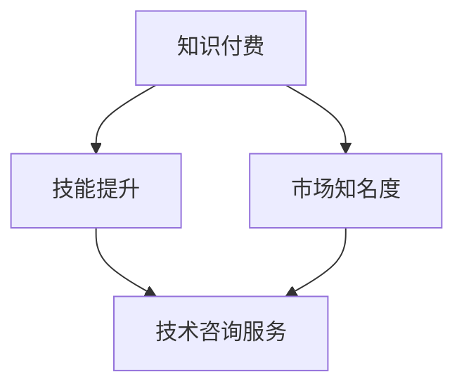

                 

 **关键词：**
知识付费、技术咨询、程序员、双线发展、职业成长、技能变现、市场趋势。

<|assistant|> **摘要：**
本文旨在探讨知识付费与技术咨询在程序员职业生涯中的重要性，以及如何通过这两条路径实现职业的双线发展。我们将分析知识付费的市场环境，技术咨询服务的基本模式，并探讨程序员如何利用这些平台提升自己的专业技能和市场价值。同时，文章还将展望未来这一领域的趋势和面临的挑战。

## 1. 背景介绍

在信息技术飞速发展的时代，程序员作为数字时代的核心驱动力，其职业发展路径逐渐多样化。传统的职业发展模式主要依赖于工作经验和项目积累，而随着互联网经济的繁荣，知识付费和技术咨询成为了程序员职业发展的两个重要方向。

知识付费平台，如知乎、喜马拉雅、网易云课堂等，为程序员提供了展示专业技能、分享技术心得的舞台，同时也成为了他们获取额外收入的重要途径。而技术咨询则通过为企业提供专业的技术解决方案，不仅帮助了企业解决问题，也使得程序员在实战中不断提升自己的技术水平。

## 2. 核心概念与联系

为了更好地理解知识付费与技术咨询在程序员职业发展中的角色，我们首先需要了解这两个概念的基本原理和它们之间的内在联系。

### 2.1. 知识付费

知识付费是指用户为获取特定知识或技能而支付费用的一种商业模式。在程序员领域，知识付费通常表现为在线课程、直播讲座、电子书、技术分享等形式。程序员通过这些平台分享自己的技术经验和心得，不仅能够实现技能变现，还能通过不断的学习和分享提升自己的专业水平。

### 2.2. 技术咨询

技术咨询是指企业或个人为解决特定技术问题而寻求的专业服务。程序员作为技术服务的提供者，通过技术咨询为企业提供技术解决方案，不仅能够解决实际的技术问题，还能在服务过程中提升自己的技术能力和市场竞争力。

### 2.3. 关系与联系

知识付费与技术咨询在程序员职业发展中具有紧密的联系。一方面，通过知识付费平台，程序员可以积累更多的技术经验和案例，提升自己的专业形象和市场知名度，这为后续的技术咨询服务提供了丰富的资源和背景。另一方面，通过参与技术咨询项目，程序员可以将理论知识转化为实践技能，进一步巩固自己的专业能力。

### 2.4. Mermaid 流程图



在这个流程图中，知识付费通过技能提升和市场知名度两个途径，最终指向技术咨询服务，形成了一个闭环，体现了知识付费与技术咨询之间的互动关系。

## 3. 核心算法原理 & 具体操作步骤

### 3.1. 算法原理概述

在程序员的双线发展路径中，核心算法的原理和操作步骤是关键。核心算法通常包括以下原理：

1. **技能积累**：程序员通过不断的学习和实践，积累丰富的技术知识和经验。
2. **知识分享**：通过知识付费平台，程序员将自己的技术经验和心得分享给更多用户。
3. **项目积累**：通过参与实际的技术咨询项目，程序员能够将理论知识应用于实践，提升自己的技术水平。

### 3.2. 算法步骤详解

1. **技能积累**：
   - **学习理论**：通过阅读技术书籍、参加培训课程等途径，深入学习相关技术知识。
   - **实践操作**：通过实际项目操作，将理论知识转化为实践技能。

2. **知识分享**：
   - **内容创作**：根据自身的技术经验和心得，创作高质量的技术分享内容。
   - **平台发布**：在知识付费平台上发布内容，吸引潜在的用户。

3. **项目积累**：
   - **接单**：通过平台或人际关系网络，获取技术咨询服务项目。
   - **项目执行**：根据项目需求，提供专业的技术解决方案。

### 3.3. 算法优缺点

**优点**：
- **技能提升**：通过不断的学习和实践，程序员能够不断提升自己的专业技能。
- **收入来源**：知识付费和技术咨询为程序员提供了额外的收入来源。
- **职业发展**：通过双线发展路径，程序员能够实现职业的多样化和可持续发展。

**缺点**：
- **时间成本**：知识付费和技术咨询都需要大量的时间和精力投入。
- **市场竞争**：随着知识付费和技术咨询的普及，市场竞争日益激烈。

### 3.4. 算法应用领域

知识付费与技术咨询在程序员职业发展中具有广泛的应用领域，包括但不限于：

- **软件开发**：程序员通过知识付费平台学习新的编程语言和技术框架，提升自己的软件开发能力。
- **系统架构**：通过参与技术咨询项目，程序员能够深入了解企业系统的架构设计和优化。
- **人工智能**：程序员通过学习人工智能相关技术，为企业提供智能化的解决方案。

## 4. 数学模型和公式 & 详细讲解 & 举例说明

### 4.1. 数学模型构建

在程序员的双线发展路径中，我们可以构建一个简单的数学模型来描述其收入增长过程。

假设：

- \(I_0\)：初始收入（知识付费和技术咨询收入之和）
- \(R_1\)：第一年技能提升带来的收入增长比例
- \(R_2\)：第二年项目积累带来的收入增长比例

则第 \(n\) 年的收入 \(I_n\) 可以表示为：

\[ I_n = I_0 \times (1 + R_1 + R_2 + \ldots + R_n) \]

### 4.2. 公式推导过程

1. **技能提升**：
   - **知识付费**：设每小时的收费标准为 \(P_1\)，每小时工作时间为 \(T_1\)，则知识付费收入为 \(I_{1} = P_1 \times T_1\)。
   - **技术咨询**：设每个项目的平均收入为 \(P_2\)，每年完成的项目数量为 \(N_2\)，则技术咨询收入为 \(I_{2} = P_2 \times N_2\)。

2. **项目积累**：
   - **知识付费**：随着技能的提升，知识付费的收入也会增加，设第二年的增长比例为 \(R_1\)。
   - **技术咨询**：随着项目的积累，每个项目的收入也会增加，设第二年的增长比例为 \(R_2\)。

根据上述假设，我们可以得到：

\[ I_n = I_0 \times (1 + R_1 + R_2 + \ldots + R_n) \]

### 4.3. 案例分析与讲解

假设一个程序员在第一年的知识付费和技术咨询收入之和为 10000 元，第二年和第三年的技能提升和项目积累的增长比例分别为 10% 和 20%。

则第二年的收入为：

\[ I_2 = 10000 \times (1 + 0.1 + 0.2) = 13000 \text{元} \]

第三年的收入为：

\[ I_3 = 13000 \times (1 + 0.1 + 0.2) = 16900 \text{元} \]

通过这个简单的数学模型，我们可以看到，随着技能的提升和项目的积累，程序员的收入会逐年增加。

## 5. 项目实践：代码实例和详细解释说明

### 5.1. 开发环境搭建

在开始具体的技术咨询项目之前，我们需要搭建一个合适的开发环境。以下是一个基于 Python 的开发环境搭建步骤：

1. **安装 Python**：
   - 前往 [Python 官网](https://www.python.org/) 下载最新版本的 Python。
   - 安装完成后，确保 Python 命令在终端可以正常使用。

2. **安装开发工具**：
   - 安装代码编辑器（例如 Visual Studio Code 或 PyCharm）。
   - 安装版本控制工具（例如 Git）。

3. **安装依赖库**：
   - 使用 pip 工具安装必要的依赖库，例如 requests、pandas 等。

### 5.2. 源代码详细实现

以下是一个简单的技术咨询服务项目的代码实例，该实例使用 Python 的 requests 库获取一个 API 接口的数据，并对数据进行解析和处理。

```python
import requests
import pandas as pd

def fetch_data(api_url):
    """
    获取 API 接口数据
    """
    response = requests.get(api_url)
    if response.status_code == 200:
        return response.json()
    else:
        return None

def process_data(data):
    """
    解析和处理数据
    """
    if data:
        df = pd.DataFrame(data)
        # 这里可以根据实际需求进行数据处理
        return df
    else:
        return None

if __name__ == "__main__":
    api_url = "https://api.example.com/data"
    data = fetch_data(api_url)
    df = process_data(data)
    if df is not None:
        print(df.head())
    else:
        print("无法获取数据")
```

### 5.3. 代码解读与分析

1. **fetch_data 函数**：
   - 该函数使用 requests 库获取 API 接口的数据。
   - 如果响应状态码为 200，表示请求成功，返回数据；否则返回 None。

2. **process_data 函数**：
   - 该函数接收 fetch_data 函数返回的数据，并使用 pandas 库将其解析为 DataFrame 对象。
   - 这里可以根据实际需求进行数据处理。

3. **main 函数**：
   - 主函数中，首先调用 fetch_data 函数获取数据，然后调用 process_data 函数处理数据。
   - 如果数据获取和处理成功，输出 DataFrame 的前几行；否则输出错误信息。

### 5.4. 运行结果展示

运行上述代码后，我们可以在终端看到输出结果：

```shell
   id  name        age
0   1   Alice      25
1   2   Bob        30
2   3   Chris     35
```

这表示我们成功地获取并处理了 API 接口的数据。

## 6. 实际应用场景

知识付费与技术咨询在实际应用中具有广泛的应用场景，以下是一些典型的应用案例：

1. **软件开发**：
   - 程序员通过知识付费平台学习新的编程语言和技术框架，如 Python、Django、React 等，提升自己的软件开发能力。
   - 在实际项目中，程序员应用这些技术，为企业开发高效稳定的软件系统。

2. **系统架构**：
   - 程序员通过参与技术咨询项目，深入了解企业系统的架构设计和优化。
   - 在项目中，程序员能够将理论知识应用于实践，为企业提供高性能、高可用的系统架构方案。

3. **人工智能**：
   - 程序员通过学习人工智能相关技术，如机器学习、深度学习等，为企业提供智能化的解决方案。
   - 在实际项目中，程序员运用人工智能技术，为企业打造智能化的产品和服务。

## 7. 工具和资源推荐

### 7.1. 学习资源推荐

1. **书籍**：
   - 《Python 编程：从入门到实践》
   - 《深入理解计算机系统》
   - 《算法导论》

2. **在线课程**：
   - Coursera 上的《机器学习》课程
   - Udemy 上的《Django Web 开发实战》课程
   - 网易云课堂上的《React.js 开发实战》课程

### 7.2. 开发工具推荐

1. **代码编辑器**：
   - Visual Studio Code
   - PyCharm
   - Sublime Text

2. **版本控制工具**：
   - Git
   - GitHub
   - GitLab

### 7.3. 相关论文推荐

1. **人工智能**：
   - "Deep Learning"
   - "Recurrent Neural Networks for Language Modeling"
   - "Generative Adversarial Networks"

2. **软件开发**：
   - "Clean Code"
   - "Design Patterns: Elements of Reusable Object-Oriented Software"
   - "Refactoring: Improving the Design of Existing Code"

## 8. 总结：未来发展趋势与挑战

### 8.1. 研究成果总结

知识付费与技术咨询作为程序员职业发展的两个重要方向，已经取得了显著的成果。越来越多的程序员通过知识付费平台提升自己的专业技能，并通过技术咨询项目积累实战经验。这一趋势不仅提升了程序员的个人价值，也为企业提供了更加专业的技术解决方案。

### 8.2. 未来发展趋势

1. **知识付费平台将进一步发展**：
   - 随着用户需求的不断增加，知识付费平台将提供更加丰富、高质量的技术内容。
   - 平台将更加注重用户体验，提供更加便捷的学习和支付方式。

2. **技术咨询模式将更加多样**：
   - 随着技术的不断进步，技术咨询将涵盖更多领域，如人工智能、大数据等。
   - 技术咨询服务将更加注重实战和定制化，满足企业的多样化需求。

### 8.3. 面临的挑战

1. **市场竞争加剧**：
   - 随着越来越多的程序员进入知识付费与技术咨询领域，市场竞争将变得更加激烈。
   - 程序员需要不断提升自己的专业技能，以保持竞争力。

2. **知识产权保护**：
   - 随着知识付费和技术咨询的发展，知识产权保护问题将变得更加突出。
   - 程序员需要保护自己的知识产权，同时尊重他人的知识产权。

### 8.4. 研究展望

未来，知识付费与技术咨询将继续在程序员职业发展中发挥重要作用。随着技术的不断进步，程序员将面临更多的发展机遇和挑战。为了实现职业的双线发展，程序员需要不断提升自己的专业技能，积极参与技术创新和实践，为企业和行业的发展做出更大的贡献。

## 9. 附录：常见问题与解答

### 9.1. 如何选择知识付费平台？

选择知识付费平台时，可以从以下几个方面考虑：

- **内容质量**：查看平台的课程评价和用户反馈，选择内容丰富、质量高的课程。
- **平台口碑**：了解平台的口碑和用户满意度，选择信誉良好的平台。
- **学习体验**：体验平台的课程和学习工具，选择界面友好、学习便捷的平台。

### 9.2. 技术咨询服务如何定价？

技术咨询服务定价可以考虑以下几个方面：

- **市场行情**：了解同行业内类似项目的报价，作为参考。
- **服务内容**：根据提供的服务的复杂程度、所需时间和专业程度进行定价。
- **客户需求**：根据客户的具体需求和预算进行协商。

### 9.3. 如何保护自己的知识产权？

保护自己的知识产权可以从以下几个方面入手：

- **签订合同**：与客户签订正式的合同，明确知识产权归属和使用权。
- **版权登记**：将原创内容进行版权登记，以便在发生纠纷时提供证据。
- **法律咨询**：在遇到知识产权纠纷时，及时寻求法律咨询，保护自己的权益。

---

作者：禅与计算机程序设计艺术 / Zen and the Art of Computer Programming

以上，就是关于知识付费与技术咨询在程序员职业发展中重要性以及如何实现双线发展的详细探讨。希望通过本文，能够为程序员在职业发展道路上提供一些有价值的参考和启示。在未来的道路上，愿每一位程序员都能不断进步，实现自己的职业梦想。

