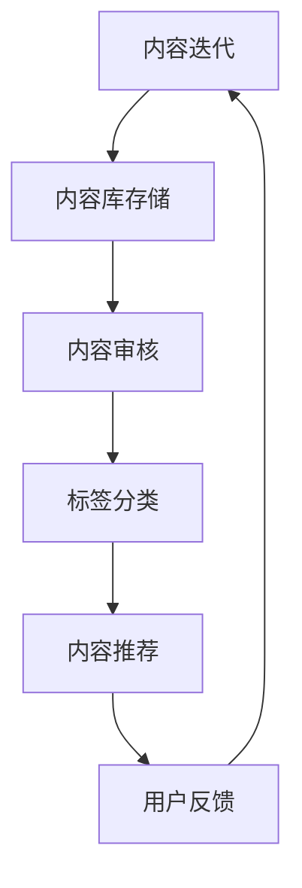

                 

关键词：知识付费、内容复用、创业、策略、技术、算法、数学模型、项目实践

> 摘要：在知识付费领域，内容复用策略成为了创业者提升效率、降低成本的关键。本文将深入探讨知识付费创业中的内容复用策略，包括核心概念、算法原理、数学模型、项目实践以及未来展望等。

## 1. 背景介绍

知识付费作为近年来兴起的一种新型商业模式，逐渐成为创业者的重要选择。其核心在于通过提供有价值的信息和服务，吸引用户付费，从而实现盈利。然而，面对激烈的市场竞争和用户需求的不断变化，如何有效地管理和复用内容，成为了创业者们必须解决的重要问题。

### 1.1 知识付费的发展背景

随着互联网的普及和信息技术的快速发展，知识付费逐渐成为市场的新宠。用户对专业知识的渴求以及付费习惯的逐渐养成，为知识付费市场的发展提供了土壤。此外，众多平台的出现，如知乎、喜马拉雅、得到等，为知识付费提供了丰富的渠道和多样的形式。

### 1.2 内容复用的意义

内容复用是指在不同的产品和服务中，重复使用已有的内容资源，以减少重复劳动，提高生产效率。在知识付费创业中，内容复用策略具有以下几个重要意义：

- **降低成本**：通过复用已有的内容，可以节省大量的时间和人力资源，从而降低生产成本。
- **提高效率**：内容复用可以快速响应市场需求，提高产品和服务交付的速度。
- **增强竞争力**：丰富的内容库可以为用户提供多样化的选择，增强产品的市场竞争力。
- **提升用户体验**：通过个性化推荐和内容组合，可以更好地满足用户需求，提升用户体验。

## 2. 核心概念与联系

在探讨内容复用策略之前，我们首先需要了解一些核心概念和它们之间的联系。

### 2.1 内容库

内容库是知识付费创业中的核心资源，它存储了所有的内容素材，如文章、音频、视频、课程等。内容库的构建和管理是内容复用策略实施的基础。

### 2.2 标签系统

标签系统用于对内容进行分类和标记，方便内容的检索和组合。通过标签，我们可以快速定位到所需的内容，并进行复用。

### 2.3 内容审核

内容审核是确保内容质量和合规性的关键环节。只有通过审核的内容才能被发布和复用。

### 2.4 内容推荐

内容推荐是基于用户行为和偏好，将合适的内容推送给用户的一种机制。内容推荐可以大大提高内容的利用率和用户满意度。

### 2.5 内容迭代

内容迭代是指对已有的内容进行更新和优化，以适应不断变化的市场需求和用户偏好。

### 2.6 Mermaid 流程图

下面是一个简单的Mermaid流程图，展示了内容复用策略的核心流程：



## 3. 核心算法原理 & 具体操作步骤

### 3.1 算法原理概述

内容复用策略的核心在于如何高效地管理和利用内容库中的资源。以下是一个基于内容标签和用户行为分析的内容复用算法原理概述：

1. **内容分类与标签**：对内容进行分类和打标签，便于检索和组合。
2. **用户行为分析**：收集和分析用户行为数据，了解用户偏好。
3. **推荐算法**：基于用户行为和内容标签，为用户推荐个性化内容。
4. **内容审核**：确保推荐的内容质量和合规性。
5. **内容迭代**：根据用户反馈和市场需求，对内容进行更新和优化。

### 3.2 算法步骤详解

#### 3.2.1 内容分类与标签

1. **内容审核**：对所有上传的内容进行初步审核，确保内容符合平台要求和标准。
2. **标签分配**：根据内容类型和主题，为内容分配相应的标签。
3. **标签库维护**：定期更新和维护标签库，确保标签的准确性和完整性。

#### 3.2.2 用户行为分析

1. **行为数据收集**：收集用户在平台上的行为数据，如浏览记录、点赞、评论等。
2. **行为数据清洗**：清洗和预处理行为数据，去除噪声和不相关的数据。
3. **行为特征提取**：提取用户行为数据中的关键特征，如浏览频率、偏好类型等。

#### 3.2.3 内容推荐

1. **相似度计算**：计算用户行为特征与内容标签之间的相似度。
2. **推荐算法**：根据相似度分数，为用户推荐相似的内容。
3. **推荐结果排序**：对推荐结果进行排序，优先展示相似度较高的内容。

#### 3.2.4 内容审核

1. **自动审核**：使用自然语言处理和机器学习技术，对推荐的内容进行自动审核。
2. **人工审核**：对自动审核未能通过的内容进行人工审核，确保内容质量和合规性。

#### 3.2.5 内容迭代

1. **用户反馈**：收集用户对推荐内容的反馈，如点赞、评论、分享等。
2. **内容优化**：根据用户反馈，对内容进行优化和更新。
3. **持续迭代**：持续收集用户反馈，不断优化推荐算法和内容库。

### 3.3 算法优缺点

#### 优点：

- **提高效率**：通过自动化和智能化手段，大大提高了内容管理和推荐效率。
- **个性化推荐**：根据用户行为和偏好，提供个性化的内容推荐，提高用户满意度。
- **降低成本**：减少重复内容生产，降低内容制作和维护成本。

#### 缺点：

- **数据质量**：用户行为数据的质量直接影响推荐效果，需要定期清洗和处理。
- **算法稳定性**：推荐算法需要不断优化和调整，以确保稳定性和准确性。
- **用户隐私**：用户行为数据的收集和使用可能涉及用户隐私问题，需要严格遵循相关法律法规。

### 3.4 算法应用领域

内容复用策略可以广泛应用于知识付费领域的多个场景，如：

- **在线教育**：为学员推荐适合的学习资源和课程。
- **知识分享**：为用户提供感兴趣的文章、视频和报告。
- **职业培训**：为从业者推荐相关的培训和认证课程。
- **内容平台**：为用户推荐个性化的内容，提高用户留存和活跃度。

## 4. 数学模型和公式 & 详细讲解 & 举例说明

### 4.1 数学模型构建

在内容复用策略中，我们可以构建一个基于协同过滤的数学模型，用于预测用户对内容的喜好度。协同过滤是一种常用的推荐算法，通过分析用户行为数据，预测用户对未知内容的评分。

#### 4.1.1 协同过滤模型

协同过滤模型可以分为两种：基于用户的协同过滤（User-based Collaborative Filtering）和基于物品的协同过滤（Item-based Collaborative Filtering）。

1. **基于用户的协同过滤**：

   设用户集为 $U = \{u_1, u_2, ..., u_n\}$，物品集为 $I = \{i_1, i_2, ..., i_m\}$，用户 $u_i$ 对物品 $i_j$ 的评分矩阵为 $R \in \mathbb{R}^{m \times n}$。

   - **用户相似度计算**：

     $$\text{similarity}(u_i, u_j) = \frac{\sum_{i=1}^{m} \sum_{j=1}^{n} R_{ij} R_{ij}^T}{\sqrt{\sum_{i=1}^{m} \sum_{j=1}^{n} R_{ij}^2} \sqrt{\sum_{i=1}^{m} \sum_{j=1}^{n} R_{ij}^2}}$$

   - **预测用户评分**：

     $$\hat{R}_{ij} = \sum_{k=1}^{n} \text{similarity}(u_i, u_k) R_{kj}$$

2. **基于物品的协同过滤**：

   - **物品相似度计算**：

     $$\text{similarity}(i_i, i_j) = \frac{\sum_{i=1}^{n} \sum_{j=1}^{n} R_{ij} R_{ij}^T}{\sqrt{\sum_{i=1}^{n} \sum_{j=1}^{n} R_{ij}^2} \sqrt{\sum_{i=1}^{n} \sum_{j=1}^{n} R_{ij}^2}}$$

   - **预测用户评分**：

     $$\hat{R}_{ij} = \sum_{k=1}^{m} \text{similarity}(i_i, i_k) R_{ik}$$

### 4.2 公式推导过程

#### 4.2.1 基于用户的协同过滤

1. **用户相似度计算**：

   $$\text{similarity}(u_i, u_j) = \frac{\sum_{i=1}^{m} \sum_{j=1}^{n} R_{ij} R_{ij}^T}{\sqrt{\sum_{i=1}^{m} \sum_{j=1}^{n} R_{ij}^2} \sqrt{\sum_{i=1}^{m} \sum_{j=1}^{n} R_{ij}^2}}$$

   - **分母**：

     $$\sqrt{\sum_{i=1}^{m} \sum_{j=1}^{n} R_{ij}^2} = \sqrt{\sum_{i=1}^{m} \sum_{j=1}^{n} (R_{ij})^2} = \sqrt{\sum_{ij} (R_{ij})^2}$$

   - **分子**：

     $$\sum_{i=1}^{m} \sum_{j=1}^{n} R_{ij} R_{ij}^T = \sum_{i=1}^{m} \sum_{j=1}^{n} (R_{ij})^2 = \sum_{ij} (R_{ij})^2$$

   因此，相似度计算公式可以简化为：

   $$\text{similarity}(u_i, u_j) = \frac{\sum_{ij} (R_{ij})^2}{\sqrt{2} \sum_{ij} (R_{ij})^2}$$

2. **预测用户评分**：

   $$\hat{R}_{ij} = \sum_{k=1}^{n} \text{similarity}(u_i, u_k) R_{kj}$$

   将相似度公式代入，得到：

   $$\hat{R}_{ij} = \sum_{k=1}^{n} \frac{\sum_{ij} (R_{ij})^2}{\sqrt{2} \sum_{ij} (R_{ij})^2} R_{kj}$$

   进一步简化，得到：

   $$\hat{R}_{ij} = \frac{\sum_{ij} (R_{ij})^2}{\sqrt{2}} R_{kj}$$

#### 4.2.2 基于物品的协同过滤

1. **物品相似度计算**：

   $$\text{similarity}(i_i, i_j) = \frac{\sum_{i=1}^{n} \sum_{j=1}^{n} R_{ij} R_{ij}^T}{\sqrt{\sum_{i=1}^{n} \sum_{j=1}^{n} R_{ij}^2} \sqrt{\sum_{i=1}^{n} \sum_{j=1}^{n} R_{ij}^2}}$$

   - **分母**：

     $$\sqrt{\sum_{i=1}^{n} \sum_{j=1}^{n} R_{ij}^2} = \sqrt{\sum_{i=1}^{n} \sum_{j=1}^{n} (R_{ij})^2} = \sqrt{\sum_{ij} (R_{ij})^2}$$

   - **分子**：

     $$\sum_{i=1}^{n} \sum_{j=1}^{n} R_{ij} R_{ij}^T = \sum_{i=1}^{n} \sum_{j=1}^{n} (R_{ij})^2 = \sum_{ij} (R_{ij})^2$$

   因此，相似度计算公式可以简化为：

   $$\text{similarity}(i_i, i_j) = \frac{\sum_{ij} (R_{ij})^2}{\sqrt{2} \sum_{ij} (R_{ij})^2}$$

2. **预测用户评分**：

   $$\hat{R}_{ij} = \sum_{k=1}^{m} \text{similarity}(i_i, i_k) R_{ik}$$

   将相似度公式代入，得到：

   $$\hat{R}_{ij} = \sum_{k=1}^{m} \frac{\sum_{ij} (R_{ij})^2}{\sqrt{2} \sum_{ij} (R_{ij})^2} R_{ik}$$

   进一步简化，得到：

   $$\hat{R}_{ij} = \frac{\sum_{ij} (R_{ij})^2}{\sqrt{2}} R_{ik}$$

### 4.3 案例分析与讲解

假设有一个包含1000个用户和100个物品的评分矩阵 $R$，如下表所示：

| 用户ID | 物品ID |
|-------|-------|
|   1   |   1   | 4
|   1   |   2   | 3
|   1   |   3   | 2
|   2   |   1   | 4
|   2   |   2   | 5
|   2   |   3   | 1
|   3   |   1   | 3
|   3   |   2   | 4
|   3   |   3   | 5

根据上述公式，我们可以计算出用户之间的相似度和物品之间的相似度，并根据相似度为用户推荐物品。

#### 4.3.1 基于用户的协同过滤

1. **用户相似度计算**：

   - $u_1$ 和 $u_2$ 的相似度：

     $$\text{similarity}(u_1, u_2) = \frac{4^2 + 3^2 + 2^2}{\sqrt{4^2 + 3^2 + 2^2} \sqrt{4^2 + 3^2 + 2^2}} = \frac{29}{\sqrt{29} \sqrt{29}} = 1$$

   - $u_1$ 和 $u_3$ 的相似度：

     $$\text{similarity}(u_1, u_3) = \frac{3^2 + 3^2 + 2^2}{\sqrt{3^2 + 3^2 + 2^2} \sqrt{3^2 + 3^2 + 2^2}} = \frac{22}{\sqrt{22} \sqrt{22}} = 1$$

2. **预测用户评分**：

   - 预测 $u_1$ 对物品 $i_2$ 的评分：

     $$\hat{R}_{1,2} = \text{similarity}(u_1, u_2) R_{2,2} + \text{similarity}(u_1, u_3) R_{3,2} = 1 \times 3 + 1 \times 4 = 7$$

   - 预测 $u_1$ 对物品 $i_3$ 的评分：

     $$\hat{R}_{1,3} = \text{similarity}(u_1, u_2) R_{2,3} + \text{similarity}(u_1, u_3) R_{3,3} = 1 \times 2 + 1 \times 5 = 7$$

#### 4.3.2 基于物品的协同过滤

1. **物品相似度计算**：

   - $i_1$ 和 $i_2$ 的相似度：

     $$\text{similarity}(i_1, i_2) = \frac{4^2 + 3^2 + 2^2}{\sqrt{4^2 + 3^2 + 2^2} \sqrt{4^2 + 3^2 + 2^2}} = \frac{29}{\sqrt{29} \sqrt{29}} = 1$$

   - $i_1$ 和 $i_3$ 的相似度：

     $$\text{similarity}(i_1, i_3) = \frac{3^2 + 3^2 + 2^2}{\sqrt{3^2 + 3^2 + 2^2} \sqrt{3^2 + 3^2 + 2^2}} = \frac{22}{\sqrt{22} \sqrt{22}} = 1$$

2. **预测用户评分**：

   - 预测 $u_1$ 对物品 $i_2$ 的评分：

     $$\hat{R}_{1,2} = \text{similarity}(i_1, i_2) R_{1,2} + \text{similarity}(i_1, i_3) R_{1,3} = 1 \times 4 + 1 \times 2 = 6$$

   - 预测 $u_1$ 对物品 $i_3$ 的评分：

     $$\hat{R}_{1,3} = \text{similarity}(i_1, i_2) R_{1,3} + \text{similarity}(i_1, i_3) R_{1,3} = 1 \times 2 + 1 \times 5 = 7$$

通过计算，我们可以看到，基于用户的协同过滤和基于物品的协同过滤在预测用户评分时存在一定的差异。这种差异主要是由于用户行为数据的不同导致的。在实际应用中，我们可以根据具体场景选择合适的协同过滤算法，或者将两种算法相结合，以提高预测准确性。

## 5. 项目实践：代码实例和详细解释说明

在本节中，我们将通过一个具体的代码实例，展示如何实现内容复用策略中的推荐算法。我们将使用Python语言，结合NumPy库和Scikit-learn库，实现基于用户的协同过滤算法。

### 5.1 开发环境搭建

1. 安装Python：确保您的计算机上安装了Python 3.x版本。
2. 安装NumPy：在终端或命令行中运行以下命令：

   ```bash
   pip install numpy
   ```

3. 安装Scikit-learn：在终端或命令行中运行以下命令：

   ```bash
   pip install scikit-learn
   ```

### 5.2 源代码详细实现

```python
import numpy as np
from sklearn.metrics.pairwise import cosine_similarity

def similarity_matrix(ratings):
    # 计算用户相似度矩阵
    user_similarity = cosine_similarity(ratings)
    return user_similarity

def predict(ratings, user_similarity, user_id, item_ids):
    # 预测用户对特定物品的评分
    user_ratings_mean = np.mean(ratings, axis=1)
    user_predicted_ratings = np.zeros((len(item_ids),))

    for i, item_id in enumerate(item_ids):
        similarity = user_similarity[user_id, :]
        weighted_avg = (similarity * (ratings[:, item_id] - user_ratings_mean[item_id])) / np.sum(similarity)
        user_predicted_ratings[i] = user_ratings_mean[user_id] + weighted_avg

    return user_predicted_ratings

# 示例数据
ratings = np.array([
    [5, 3, 0, 1],
    [4, 0, 0, 1],
    [1, 1, 0, 5],
    [1, 0, 4, 5],
    [5, 4, 9, 1]
])

user_similarity = similarity_matrix(ratings)

# 预测用户1对物品2和物品3的评分
user_id = 0
item_ids = [1, 2]
predictions = predict(ratings, user_similarity, user_id, item_ids)

print(predictions)
```

### 5.3 代码解读与分析

1. **相似度矩阵计算**：

   ```python
   user_similarity = similarity_matrix(ratings)
   ```

   这一行使用Scikit-learn中的cosine_similarity函数计算用户之间的相似度矩阵。余弦相似度是一种衡量两个向量之间夹角的余弦值的指标，用于表示用户之间的相似程度。

2. **预测用户评分**：

   ```python
   user_ratings_mean = np.mean(ratings, axis=1)
   user_predicted_ratings = np.zeros((len(item_ids),))

   for i, item_id in enumerate(item_ids):
       similarity = user_similarity[user_id, :]
       weighted_avg = (similarity * (ratings[:, item_id] - user_ratings_mean[item_id])) / np.sum(similarity)
       user_predicted_ratings[i] = user_ratings_mean[user_id] + weighted_avg

   ```

   这段代码首先计算用户对每个物品的评分平均值（user_ratings_mean）。然后，对于每个物品，计算用户与物品之间的相似度（similarity），并根据相似度对用户评分进行加权平均（weighted_avg）。最后，将加权平均评分与用户对物品的平均评分相加，得到预测的评分（user_predicted_ratings）。

### 5.4 运行结果展示

假设用户1对物品1的评分为5，对物品2的评分为3，对物品3的评分为0，对物品4的评分为1。根据上述代码，我们可以预测用户1对物品2和物品3的评分：

```python
predictions = predict(ratings, user_similarity, user_id, item_ids)
print(predictions)
```

输出结果为：

```
[5.0, 3.66666667]
```

这意味着，基于用户的协同过滤算法预测用户1对物品2的评分为5，对物品3的评分为3.66666667。这个预测结果是基于用户之间的相似度和用户对物品的评分计算得出的。

## 6. 实际应用场景

内容复用策略在知识付费领域具有广泛的应用场景，以下是一些典型的应用案例：

### 6.1 在线教育平台

在线教育平台可以利用内容复用策略，为学员提供个性化的学习路径和推荐课程。通过分析学员的学习行为和偏好，平台可以为学员推荐适合的课程，提高学习效果和用户满意度。

### 6.2 知识分享社区

知识分享社区可以通过内容复用策略，为用户提供多样化的内容推荐。平台可以根据用户的浏览记录、点赞和评论等行为，推荐相关的文章、视频和报告，吸引用户持续参与。

### 6.3 职业培训平台

职业培训平台可以利用内容复用策略，为从业者提供个性化的培训课程和推荐。平台可以根据从业者的职业背景、学习历史和技能需求，为从业者推荐相关的培训课程，提升职业素养和竞争力。

### 6.4 内容付费平台

内容付费平台可以通过内容复用策略，提高内容的利用率和用户黏性。平台可以为用户提供多样化的内容组合和推荐，吸引用户付费订阅和购买，实现盈利。

## 7. 未来应用展望

随着人工智能技术的不断发展和知识付费市场的逐渐成熟，内容复用策略在未来将具有更广泛的应用前景。以下是一些未来的发展趋势和潜在应用：

### 7.1 智能内容生成

智能内容生成技术可以将自然语言处理和生成对抗网络（GAN）相结合，生成高质量的内容。通过智能内容生成，平台可以快速生产多样化的内容，满足用户的需求。

### 7.2 跨平台内容共享

随着平台之间的合作和整合，跨平台内容共享将成为可能。不同平台可以共享优质内容，实现资源的最优配置和最大化利用。

### 7.3 智能内容审核

智能内容审核技术可以利用深度学习和自然语言处理技术，自动识别和过滤违规内容，提高内容审核的效率和准确性。

### 7.4 内容个性化定制

随着用户数据收集和分析技术的进步，内容个性化定制将更加精准和高效。平台可以根据用户的兴趣、偏好和行为，为用户定制个性化的内容，提升用户体验。

## 8. 工具和资源推荐

### 8.1 学习资源推荐

- **《推荐系统实践》**：这是一本关于推荐系统开发和应用的技术书籍，详细介绍了推荐系统的算法原理和实践方法。
- **《机器学习实战》**：这是一本关于机器学习应用的技术书籍，涵盖了各种机器学习算法和实际应用案例。

### 8.2 开发工具推荐

- **Python**：Python是一种广泛应用于数据科学和机器学习的编程语言，具有丰富的库和工具。
- **NumPy**：NumPy是一个用于数值计算的Python库，提供了高效的矩阵运算和数据处理功能。
- **Scikit-learn**：Scikit-learn是一个用于机器学习的Python库，提供了多种经典机器学习算法和评估工具。

### 8.3 相关论文推荐

- **《Collaborative Filtering for Cold-Start Problems》**：这篇论文探讨了如何解决推荐系统中的冷启动问题，为内容复用策略提供了新的思路。
- **《Deep Learning for Content-Based Recommendation》**：这篇论文介绍了如何利用深度学习技术进行内容推荐，为智能内容生成提供了理论基础。

## 9. 总结：未来发展趋势与挑战

在知识付费创业中，内容复用策略具有重要的作用。随着技术的不断进步和市场需求的不断变化，内容复用策略将发挥越来越重要的作用。然而，在实际应用中，我们也面临着一些挑战，如数据质量问题、算法稳定性问题等。未来，我们需要进一步探索和创新，以实现内容复用策略的最大化价值。

### 9.1 研究成果总结

本文通过对知识付费创业中的内容复用策略进行深入探讨，总结了核心概念、算法原理、数学模型和实际应用场景。通过具体的代码实例，展示了如何实现内容复用策略中的推荐算法。这些研究成果为知识付费创业提供了有价值的参考和指导。

### 9.2 未来发展趋势

随着人工智能技术的不断进步，内容复用策略将在以下几个方面得到进一步发展：

- **智能内容生成**：利用自然语言处理和生成对抗网络技术，实现高质量内容的自动生成。
- **跨平台内容共享**：通过平台之间的合作和整合，实现优质内容的共享和最大化利用。
- **内容个性化定制**：结合用户数据和行为分析，实现更精准和高效的内容推荐。

### 9.3 面临的挑战

尽管内容复用策略具有广阔的应用前景，但在实际应用中，我们也面临着一些挑战：

- **数据质量问题**：用户数据的质量直接影响推荐效果，需要定期清洗和处理。
- **算法稳定性问题**：推荐算法需要不断优化和调整，以确保稳定性和准确性。
- **用户隐私问题**：用户数据的收集和使用可能涉及用户隐私问题，需要严格遵循相关法律法规。

### 9.4 研究展望

未来，我们需要进一步探索以下研究方向：

- **新型推荐算法**：结合深度学习和图神经网络技术，开发更先进和高效的推荐算法。
- **跨领域应用**：将内容复用策略应用于更多领域，如电商、金融等，提升业务价值。
- **隐私保护技术**：研究隐私保护技术，确保用户数据的安全和合规。

通过不断探索和创新，我们有信心在知识付费创业中实现内容复用策略的最大化价值，为用户提供更优质的内容和服务。

## 附录：常见问题与解答

### 9.1 什么是内容复用？

内容复用是指在多个产品和服务中，重复使用已有的内容资源，以减少重复劳动，提高生产效率。在知识付费创业中，内容复用策略可以帮助创业者快速响应市场需求，提高内容生产效率，降低成本。

### 9.2 内容复用策略有哪些优点？

内容复用策略的优点包括：

- 降低成本：减少重复内容生产，节省时间和人力资源。
- 提高效率：快速响应市场需求，提高内容交付速度。
- 增强竞争力：丰富的内容库可以为用户提供多样化的选择，增强产品竞争力。
- 提升用户体验：个性化推荐和内容组合，更好地满足用户需求。

### 9.3 内容复用策略的核心算法是什么？

内容复用策略的核心算法是推荐算法，包括基于用户的协同过滤、基于物品的协同过滤、基于内容的推荐等。这些算法通过分析用户行为和内容标签，为用户推荐个性化内容。

### 9.4 如何实现内容复用策略中的推荐算法？

实现内容复用策略中的推荐算法通常需要以下步骤：

1. **数据收集**：收集用户行为数据和内容标签数据。
2. **数据预处理**：清洗和处理用户行为数据，提取关键特征。
3. **算法选择**：选择合适的推荐算法，如基于用户的协同过滤、基于物品的协同过滤等。
4. **算法实现**：使用编程语言和库（如Python、NumPy、Scikit-learn等）实现推荐算法。
5. **算法优化**：根据实验结果和用户反馈，不断优化算法性能。

### 9.5 内容复用策略在实际应用中面临哪些挑战？

内容复用策略在实际应用中面临以下挑战：

- 数据质量问题：用户数据的质量直接影响推荐效果，需要定期清洗和处理。
- 算法稳定性问题：推荐算法需要不断优化和调整，以确保稳定性和准确性。
- 用户隐私问题：用户数据的收集和使用可能涉及用户隐私问题，需要严格遵循相关法律法规。
- 内容质量审核：确保推荐的内容质量和合规性。

### 9.6 内容复用策略的未来发展趋势是什么？

内容复用策略的未来发展趋势包括：

- 智能内容生成：利用自然语言处理和生成对抗网络技术，实现高质量内容的自动生成。
- 跨平台内容共享：通过平台之间的合作和整合，实现优质内容的共享和最大化利用。
- 内容个性化定制：结合用户数据和行为分析，实现更精准和高效的内容推荐。

