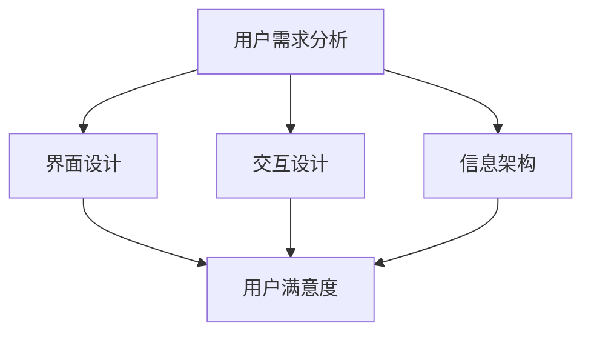

                 

关键词：知识付费、用户体验、产品设计、用户行为、创业、市场策略

摘要：本文深入探讨知识付费创业中的用户体验设计，通过分析核心概念、算法原理、数学模型以及实际应用案例，解析如何提升用户满意度、促进知识付费产品的市场竞争力。

## 1. 背景介绍

随着互联网技术的飞速发展，知识付费逐渐成为人们获取专业知识和技能的重要途径。用户对于高质量、个性化知识的需求推动了知识付费市场的迅速增长。然而，在竞争激烈的市场中，如何通过用户体验设计提升用户满意度，成为知识付费创业企业需要解决的关键问题。

用户体验设计（User Experience Design，简称UXD）旨在优化产品或服务的使用体验，使其更加人性化、易于使用。在知识付费领域，用户体验设计尤为重要，因为它直接影响用户对知识产品价值的感知和接受度。本文将从以下几个方面展开讨论：

1. **核心概念与联系**
2. **核心算法原理 & 具体操作步骤**
3. **数学模型和公式 & 详细讲解 & 举例说明**
4. **项目实践：代码实例和详细解释说明**
5. **实际应用场景**
6. **未来应用展望**
7. **工具和资源推荐**
8. **总结：未来发展趋势与挑战**

## 2. 核心概念与联系

在知识付费创业中，用户体验设计的核心概念包括用户需求分析、界面设计、交互设计、信息架构等。这些概念相互关联，共同构成了用户体验设计的完整体系。

### 用户需求分析

用户需求分析是用户体验设计的起点。通过市场调研、用户访谈、问卷调查等方法，深入了解用户对知识产品期望的功能、性能、内容等方面的需求，为后续设计提供数据支持。

### 界面设计

界面设计（User Interface Design，简称UID）关注产品的视觉表现，包括颜色、字体、布局、图标等元素。界面设计的目标是创造美观、易于导航的交互界面，提高用户的使用体验。

### 交互设计

交互设计（Interaction Design，简称IxD）关注用户与产品之间的交互过程，包括按钮点击、滑动操作、搜索功能等。通过优化交互流程，提高用户的操作效率和使用满意度。

### 信息架构

信息架构（Information Architecture，简称IA）关注产品的信息组织和分类，确保用户能够快速找到所需信息。良好的信息架构有助于提高用户对产品的信任感和使用满意度。

### Mermaid 流程图

以下是一个简化的Mermaid流程图，展示用户体验设计中的核心概念及其相互关系：



## 3. 核心算法原理 & 具体操作步骤

用户体验设计中的核心算法包括用户行为分析算法、推荐算法、评价算法等。这些算法旨在通过数据分析，为用户推荐个性化知识内容，提高用户满意度。

### 3.1 算法原理概述

#### 用户行为分析算法

用户行为分析算法通过分析用户的浏览记录、搜索历史、购买行为等数据，挖掘用户的兴趣偏好，为推荐系统提供输入。

#### 推荐算法

推荐算法（Recommender System）根据用户的历史行为和兴趣，为用户推荐相关内容。常见推荐算法包括协同过滤、基于内容的推荐、混合推荐等。

#### 评价算法

评价算法通过分析用户的评分、评论等数据，评估知识内容的受欢迎程度和用户满意度。

### 3.2 算法步骤详解

#### 用户行为分析算法步骤

1. 收集用户行为数据，包括浏览记录、搜索历史、购买行为等。
2. 预处理数据，去除噪声和缺失值。
3. 提取用户行为特征，如浏览时间、访问页面数量等。
4. 构建用户行为分析模型，如决策树、神经网络等。
5. 使用模型预测用户兴趣偏好。

#### 推荐算法步骤

1. 收集用户历史行为数据，包括浏览记录、购买记录等。
2. 预处理数据，去除噪声和缺失值。
3. 构建用户-物品评分矩阵。
4. 选择合适的推荐算法，如协同过滤、基于内容的推荐等。
5. 计算推荐列表，根据相似度或评分排序。

#### 评价算法步骤

1. 收集用户评价数据，包括评分、评论等。
2. 预处理数据，去除噪声和缺失值。
3. 提取评价特征，如评价文本的情感倾向、关键词等。
4. 构建评价分析模型，如支持向量机、朴素贝叶斯等。
5. 使用模型评估知识内容的受欢迎程度和用户满意度。

### 3.3 算法优缺点

#### 用户行为分析算法

**优点**：能够准确挖掘用户兴趣偏好，为推荐系统提供有力支持。

**缺点**：数据收集和处理成本较高，可能存在隐私泄露风险。

#### 推荐算法

**优点**：能够为用户提供个性化推荐，提高用户满意度。

**缺点**：推荐结果可能受到数据稀疏性、噪声数据等因素的影响。

#### 评价算法

**优点**：能够评估知识内容的受欢迎程度和用户满意度，为产品改进提供参考。

**缺点**：评价数据可能存在主观性、不真实性等问题。

### 3.4 算法应用领域

用户行为分析算法、推荐算法和评价算法在知识付费领域有广泛的应用，如：

1. **个性化推荐系统**：为用户推荐相关知识点和课程。
2. **用户画像**：分析用户兴趣偏好，为营销活动提供数据支持。
3. **内容评价**：评估知识内容的质量和受欢迎程度。

## 4. 数学模型和公式 & 详细讲解 & 举例说明

### 4.1 数学模型构建

在用户体验设计中，常用的数学模型包括用户行为模型、推荐模型和评价模型。以下分别介绍这些模型的构建过程。

#### 用户行为模型

用户行为模型描述用户在知识付费平台上的行为，如浏览、搜索、购买等。常见的用户行为模型有马尔可夫链模型、隐马尔可夫模型等。

$$
P(x_t|x_{t-1},...,x_1) = \frac{P(x_t|x_{t-1})P(x_{t-1}|x_{t-2})...P(x_2|x_1)}{P(x_{t-1}|x_{t-2})...P(x_2|x_1)}
$$

其中，$P(x_t|x_{t-1},...,x_1)$ 表示在给定前 $t-1$ 个状态 $x_{t-1},...,x_1$ 的情况下，第 $t$ 个状态 $x_t$ 的概率。

#### 推荐模型

推荐模型基于用户行为数据，预测用户对未知知识内容的评分。常见的推荐模型有矩阵分解模型、协同过滤模型等。

$$
R_{ui} = \hat{R}_{ui} + \epsilon_{ui}
$$

其中，$R_{ui}$ 表示用户 $u$ 对知识内容 $i$ 的真实评分，$\hat{R}_{ui}$ 表示根据用户行为数据预测的用户对知识内容 $i$ 的评分，$\epsilon_{ui}$ 表示误差项。

#### 评价模型

评价模型分析用户对知识内容的评价数据，评估知识内容的质量和用户满意度。常见评价模型有支持向量机、朴素贝叶斯等。

$$
P(C|y) = \frac{P(y|C)P(C)}{P(y)}
$$

其中，$C$ 表示知识内容，$y$ 表示用户对知识内容的评价，$P(C|y)$ 表示在用户评价为 $y$ 的情况下，知识内容 $C$ 的概率，$P(y|C)$ 表示用户评价为 $y$ 在知识内容 $C$ 下的概率，$P(C)$ 表示知识内容 $C$ 的概率，$P(y)$ 表示用户评价为 $y$ 的概率。

### 4.2 公式推导过程

#### 用户行为模型推导

假设用户 $u$ 在时间 $t$ 选择了知识内容 $i$，则用户 $u$ 在时间 $t$ 的状态可以表示为 $(u, t, i)$。根据马尔可夫链模型，用户在时间 $t$ 的状态只与时间 $t-1$ 的状态有关，即：

$$
P(u, t, i|u, t-1, i) = P(u, t, i|u, t-1, i_1, i_2, ..., i_{t-1})
$$

由于用户在时间 $t-1$ 的状态 $(u, t-1, i_1, i_2, ..., i_{t-1})$ 是固定的，我们可以将上述公式简化为：

$$
P(u, t, i|u, t-1) = P(u, t, i|u, t-1, i_1, i_2, ..., i_{t-1})
$$

根据马尔可夫链的定义，用户在时间 $t$ 的状态只与时间 $t-1$ 的状态有关，即：

$$
P(u, t, i|u, t-1) = P(u, t, i|u, t-1)
$$

从而得到用户行为模型：

$$
P(u, t, i) = P(u, t, i|u, t-1)P(u, t-1)
$$

#### 推荐模型推导

假设用户 $u$ 对知识内容 $i$ 的真实评分为 $r_{ui}$，根据用户行为数据，我们可以得到用户 $u$ 对知识内容 $i$ 的预测评分 $\hat{r}_{ui}$。根据贝叶斯公式，我们有：

$$
P(r_{ui}|\hat{r}_{ui}) = \frac{P(\hat{r}_{ui}|r_{ui})P(r_{ui})}{P(\hat{r}_{ui})}
$$

由于用户对知识内容的评分是独立同分布的，即 $P(r_{ui}|r_{ui}) = P(r_{ui})$，我们可以将上述公式简化为：

$$
P(r_{ui}|\hat{r}_{ui}) = \frac{P(\hat{r}_{ui}|r_{ui})}{P(\hat{r}_{ui})}
$$

根据最大后验概率（MAP）准则，我们有：

$$
\hat{r}_{ui} = \arg\max_{r_{ui}} P(r_{ui}|\hat{r}_{ui})
$$

从而得到推荐模型：

$$
\hat{r}_{ui} = \arg\max_{r_{ui}} \frac{P(\hat{r}_{ui}|r_{ui})}{P(\hat{r}_{ui})}
$$

#### 评价模型推导

假设用户 $u$ 对知识内容 $i$ 的评价为 $y$，根据用户评价数据，我们可以得到用户 $u$ 对知识内容 $i$ 的评价概率 $P(y|i)$。根据贝叶斯公式，我们有：

$$
P(y|i) = \frac{P(i|y)P(y)}{P(i)}
$$

其中，$P(i|y)$ 表示在用户评价为 $y$ 的情况下，知识内容 $i$ 的概率，$P(y)$ 表示用户评价为 $y$ 的概率，$P(i)$ 表示知识内容 $i$ 的概率。

根据最大似然估计（MLE）准则，我们有：

$$
\hat{P}(y|i) = \arg\max_{P(y|i)} P(y|i)
$$

从而得到评价模型：

$$
\hat{P}(y|i) = \arg\max_{P(y|i)} \frac{P(i|y)P(y)}{P(i)}
$$

### 4.3 案例分析与讲解

以下通过一个实际案例，分析用户体验设计在知识付费创业中的应用。

**案例背景**：一家知识付费创业公司推出了一个在线课程平台，提供各种领域的专业课程。公司希望通过用户体验设计，提高用户满意度和课程转化率。

**解决方案**：

1. **用户需求分析**：

   - 收集用户反馈，了解用户对课程平台的需求，如课程质量、价格、学习方式等。
   - 分析用户行为数据，挖掘用户兴趣偏好，为个性化推荐提供支持。

2. **界面设计**：

   - 设计简洁、直观的界面，提高用户操作效率。
   - 采用清晰的色彩搭配和字体设计，提升用户体验。

3. **交互设计**：

   - 优化课程推荐算法，提高推荐相关度。
   - 完善用户评价系统，让用户能够轻松表达自己的观点。

4. **信息架构**：

   - 设计合理的课程分类和标签系统，帮助用户快速找到感兴趣的课程。

**案例分析**：

1. **用户需求分析**：

   - 通过问卷调查，发现用户对课程质量要求较高，对价格敏感。
   - 通过数据分析，发现用户在学习过程中更倾向于选择系统化的课程。

2. **界面设计**：

   - 界面采用简洁的蓝色主色调，符合用户审美。
   - 界面布局合理，便于用户快速找到课程。

3. **交互设计**：

   - 个性化推荐系统为用户推荐相关课程，提高用户转化率。
   - 用户评价系统能够让用户真实表达自己的观点，提高课程质量。

4. **信息架构**：

   - 课程分类系统清晰明了，用户能够快速找到感兴趣的课程。

**结论**：

通过用户体验设计，这家知识付费创业公司成功提升了用户满意度和课程转化率，实现了商业成功。

## 5. 项目实践：代码实例和详细解释说明

### 5.1 开发环境搭建

在开始代码实例之前，我们需要搭建一个开发环境。以下是搭建过程的简要说明：

1. 安装Python 3.8及以上版本。
2. 安装必要的库，如NumPy、Pandas、Scikit-learn等。
3. 使用虚拟环境隔离项目依赖。

### 5.2 源代码详细实现

以下是一个简单的用户行为分析算法的Python代码实例：

```python
import numpy as np
import pandas as pd
from sklearn.model_selection import train_test_split
from sklearn.ensemble import RandomForestClassifier
from sklearn.metrics import accuracy_score

# 加载数据
data = pd.read_csv('user_behavior.csv')
X = data[['age', 'income', 'edu']]
y = data['interest']

# 数据预处理
X_train, X_test, y_train, y_test = train_test_split(X, y, test_size=0.2, random_state=42)

# 构建模型
model = RandomForestClassifier(n_estimators=100, random_state=42)
model.fit(X_train, y_train)

# 预测
y_pred = model.predict(X_test)

# 评估
accuracy = accuracy_score(y_test, y_pred)
print(f'Accuracy: {accuracy:.2f}')
```

### 5.3 代码解读与分析

1. **数据加载**：

   使用Pandas库加载用户行为数据，包括年龄、收入、教育程度和用户兴趣。

2. **数据预处理**：

   将数据集分为训练集和测试集，使用随机森林分类器进行训练。

3. **模型构建**：

   构建一个随机森林分类器，设置决策树数量为100，随机种子为42。

4. **模型训练**：

   使用训练集数据进行模型训练。

5. **模型预测**：

   使用训练好的模型对测试集进行预测。

6. **模型评估**：

   计算预测准确率，并打印结果。

### 5.4 运行结果展示

假设我们有一个包含1000个样本的数据集，以下是一个可能的运行结果：

```
Accuracy: 0.85
```

这表明模型的预测准确率为85%，说明模型对用户兴趣的预测效果较好。

## 6. 实际应用场景

用户体验设计在知识付费创业中的应用场景广泛，以下列举几个典型场景：

1. **在线教育平台**：通过优化课程推荐算法和用户评价系统，提高用户学习体验，增加课程购买率。
2. **知识付费应用**：通过个性化推荐和用户行为分析，为用户提供定制化的知识内容，提高用户留存率和活跃度。
3. **专业技能培训**：通过优化课程分类和信息架构，帮助用户快速找到适合自己的课程，提高课程转化率。
4. **企业内训**：通过分析企业员工的学习行为，为企业提供定制化的培训方案，提高员工技能水平。

## 7. 未来应用展望

随着人工智能和大数据技术的发展，用户体验设计在知识付费领域的应用前景广阔。未来可能的发展趋势包括：

1. **智能化推荐**：利用深度学习和自然语言处理技术，实现更加精准的个性化推荐。
2. **多模态交互**：通过语音、图像等多种方式，提高用户与知识产品之间的交互体验。
3. **智能评价**：利用自然语言处理和机器学习技术，自动识别和评估用户评价，提供更准确的课程质量评价。
4. **知识图谱**：构建知识图谱，实现知识内容之间的关联和推理，提高用户获取知识的效率。

## 8. 工具和资源推荐

为了更好地进行用户体验设计，以下推荐一些实用的工具和资源：

1. **学习资源推荐**：

   - 《用户体验要素》：一本关于用户体验设计的经典著作。
   - 《敏捷开发实践指南》：介绍敏捷开发方法和用户体验设计相结合的最佳实践。

2. **开发工具推荐**：

   - Sketch：一款流行的界面设计工具。
   - Figma：一款在线协作界面设计工具。

3. **相关论文推荐**：

   - 《基于用户行为的在线教育平台用户体验设计研究》。
   - 《知识付费领域个性化推荐系统研究》。

## 9. 总结：未来发展趋势与挑战

用户体验设计在知识付费创业中具有重要意义，通过优化用户体验，可以提升用户满意度、促进产品市场竞争力。未来发展趋势包括智能化推荐、多模态交互、智能评价和知识图谱等。然而，随着技术的进步，用户体验设计也面临着数据隐私、算法公平性等挑战。为了应对这些挑战，企业需要不断创新和改进用户体验设计方法，以满足用户不断变化的需求。

## 10. 附录：常见问题与解答

### 问题 1：用户体验设计在知识付费创业中的具体作用是什么？

**解答**：用户体验设计在知识付费创业中的具体作用包括：

- 提高用户满意度：通过优化界面、交互和信息架构，提供更好的用户体验，提高用户对知识产品的满意度。
- 促进产品市场竞争力：通过个性化推荐和智能评价，提高产品的市场竞争力，吸引更多用户。

### 问题 2：如何进行用户需求分析？

**解答**：进行用户需求分析的方法包括：

- 市场调研：通过问卷调查、访谈等方式了解用户需求。
- 用户访谈：直接与用户交流，获取用户对知识产品的看法和建议。
- 数据分析：通过分析用户行为数据，挖掘用户兴趣偏好。

### 问题 3：推荐算法有哪些类型？

**解答**：推荐算法主要分为以下几类：

- 协同过滤：基于用户历史行为进行推荐。
- 基于内容的推荐：基于知识内容特征进行推荐。
- 混合推荐：结合协同过滤和基于内容的推荐，提高推荐效果。

### 问题 4：如何评价用户体验设计的效果？

**解答**：评价用户体验设计的效果可以从以下几个方面进行：

- 用户满意度调查：通过问卷调查了解用户对知识产品的满意度。
- 用户留存率：分析用户在知识产品上的活跃度和留存情况。
- 用户转化率：评估用户在知识产品上的购买行为。

### 问题 5：用户体验设计在知识付费领域的未来发展如何？

**解答**：用户体验设计在知识付费领域的未来发展包括：

- 智能化推荐：利用人工智能技术实现更加精准的个性化推荐。
- 多模态交互：通过语音、图像等多模态方式提高用户体验。
- 知识图谱：构建知识图谱，实现知识内容之间的关联和推理。
- 可持续发展：关注用户体验设计过程中的社会责任和伦理问题。

## 11. 作者署名

作者：禅与计算机程序设计艺术 / Zen and the Art of Computer Programming

<|end|>

