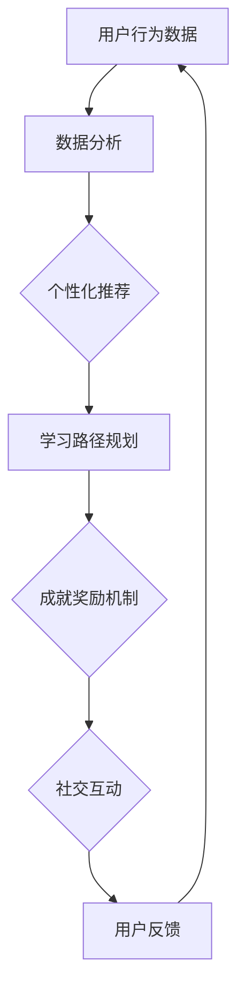
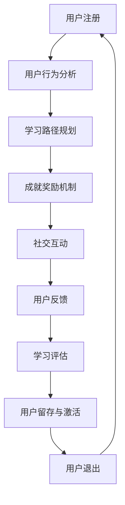

                 

### 1. 背景介绍

在当今数字化时代，知识付费已成为一种新兴的商业模式，特别是在教育和技能培训领域。知识付费平台通过提供专业内容、课程和培训，满足用户对知识的渴求。然而，如何在竞争激烈的市场中吸引并留住用户，成为知识付费创业公司面临的重要挑战。用户成长体系设计在这一背景下显得尤为重要。

用户成长体系是一种通过系统化的设计和实施，引导用户在平台上不断学习、提升技能、获得成就感的机制。它不仅能够提高用户留存率和活跃度，还能够增强用户对平台的忠诚度和品牌认知。本文将探讨知识付费创业中的用户成长体系设计，分析其核心概念、设计原则、构建方法以及在实际中的应用。

<|assistant|>### 2. 核心概念与联系

#### 2.1 用户成长体系的概念

用户成长体系是指一套旨在促进用户在特定领域不断学习、提升技能、实现自我价值的系统。它通常包括用户行为分析、学习路径规划、成就奖励机制、社交互动等多个方面。用户成长体系的目的是激发用户的学习兴趣，提供个性化的学习体验，增强用户在平台上的参与度和忠诚度。

#### 2.2 核心概念原理与架构

2.2.1 用户行为分析

用户行为分析是用户成长体系设计的基础。通过分析用户在平台上的行为数据，如学习时长、学习频率、课程完成率、互动行为等，可以了解用户的学习习惯、兴趣点和需求。这些数据有助于为用户提供个性化的学习建议和内容推荐。



2.2.2 学习路径规划

学习路径规划是根据用户的行为数据和需求，为用户设计一系列有针对性的学习步骤。学习路径规划应考虑用户的起点、目标以及学习资源，帮助用户逐步实现学习目标。

2.2.3 成就奖励机制

成就奖励机制是激励用户持续学习的有效手段。通过设置各种成就等级、奖励机制，如积分、徽章、优惠券等，可以激发用户的成就感和学习动力。

2.2.4 社交互动

社交互动是用户成长体系的重要组成部分。通过建立学习社区、用户论坛、实时互动等功能，用户可以相互交流、分享经验，形成良好的学习氛围。

#### 2.3 用户成长体系架构

用户成长体系的架构应涵盖用户从注册到退出的全生命周期。具体架构如下：



<|assistant|>### 3. 核心算法原理 & 具体操作步骤

#### 3.1 算法原理概述

用户成长体系设计中的核心算法主要包括用户行为分析算法、学习路径规划算法和成就奖励算法。这些算法通过分析用户数据、设计个性化学习路径和奖励机制，促进用户在平台上的成长。

#### 3.2 算法步骤详解

3.2.1 用户行为分析算法

1. 数据采集：收集用户在平台上的行为数据，如学习时长、学习频率、课程完成率、互动行为等。
2. 数据预处理：对采集到的数据进行分析，去除异常值，进行数据清洗和转换。
3. 特征提取：从预处理后的数据中提取用户行为特征，如学习活跃度、课程偏好等。
4. 模型训练：使用机器学习算法，如聚类、分类等，对提取的特征进行训练，建立用户行为模型。
5. 预测与推荐：根据训练得到的模型，预测用户未来的学习行为，为用户推荐合适的学习内容和路径。

3.2.2 学习路径规划算法

1. 用户起点分析：根据用户的基础数据和需求，确定用户的学习起点。
2. 目标设定：与用户沟通，设定用户的学习目标。
3. 资源筛选：从平台资源库中筛选符合用户起点和目标的学习资源。
4. 路径设计：根据资源筛选结果，设计用户的学习路径。
5. 路径优化：通过用户行为数据和反馈，不断优化学习路径。

3.2.3 成就奖励算法

1. 成就定义：定义各种成就等级和奖励类型，如完成课程、达到学习时长、参与互动等。
2. 成就检测：根据用户行为数据，检测用户是否满足成就条件。
3. 奖励发放：当用户满足成就条件时，发放相应的奖励，如积分、徽章、优惠券等。
4. 奖励效果评估：评估奖励对用户行为和满意度的影响，优化奖励策略。

#### 3.3 算法优缺点

用户行为分析算法：
- 优点：能够根据用户数据提供个性化的学习建议，提高用户满意度。
- 缺点：算法复杂度高，对数据质量要求高。

学习路径规划算法：
- 优点：有助于用户实现学习目标，提高学习效果。
- 缺点：设计复杂，需要与用户需求紧密对接。

成就奖励算法：
- 优点：激发用户的学习兴趣和动力，提高用户留存率。
- 缺点：过度依赖奖励机制可能导致用户行为短期化。

#### 3.4 算法应用领域

用户成长体系设计算法广泛应用于知识付费、在线教育、职业培训等领域。以下为几个应用案例：

1. 在线教育平台：通过用户行为分析，为用户提供个性化学习建议，提高学习效果。
2. 职业培训平台：根据用户需求和职业规划，设计个性化学习路径，提高职业素养。
3. 知识付费平台：通过成就奖励机制，激发用户的学习兴趣，提高用户留存率。

<|assistant|>### 4. 数学模型和公式 & 详细讲解 & 举例说明

#### 4.1 数学模型构建

用户成长体系设计中的数学模型主要包括用户行为模型、学习路径规划模型和成就奖励模型。以下分别介绍这些模型的构建过程。

4.1.1 用户行为模型

用户行为模型用于预测用户在平台上的学习行为，如学习时长、课程选择等。构建用户行为模型的主要步骤如下：

1. 数据收集：收集用户在平台上的行为数据，如学习时长、学习频率、课程完成率等。
2. 数据预处理：对收集到的数据进行分析，去除异常值，进行数据清洗和转换。
3. 特征提取：从预处理后的数据中提取用户行为特征，如学习活跃度、课程偏好等。
4. 模型训练：使用机器学习算法，如聚类、分类等，对提取的特征进行训练，建立用户行为模型。

4.1.2 学习路径规划模型

学习路径规划模型用于根据用户需求和平台资源，为用户设计个性化学习路径。构建学习路径规划模型的主要步骤如下：

1. 用户需求分析：与用户沟通，了解用户的学习需求和目标。
2. 资源筛选：从平台资源库中筛选符合用户需求的学习资源。
3. 路径设计：根据资源筛选结果，设计用户的学习路径。
4. 路径优化：通过用户行为数据和反馈，不断优化学习路径。

4.1.3 成就奖励模型

成就奖励模型用于根据用户行为数据，为满足成就条件的用户发放奖励。构建成就奖励模型的主要步骤如下：

1. 成就定义：定义各种成就等级和奖励类型，如完成课程、达到学习时长、参与互动等。
2. 成就检测：根据用户行为数据，检测用户是否满足成就条件。
3. 奖励发放：当用户满足成就条件时，发放相应的奖励，如积分、徽章、优惠券等。
4. 奖励效果评估：评估奖励对用户行为和满意度的影响，优化奖励策略。

#### 4.2 公式推导过程

4.2.1 用户行为模型

用户行为模型的核心是预测用户在平台上的学习时长。假设用户i在t时刻的学习时长为 \( L_{it} \)，则用户行为模型可以表示为：

\[ L_{it} = f(W_0 + \sum_{j=1}^{n} W_{ij} X_{ij}) \]

其中， \( W_0 \) 为偏置项， \( W_{ij} \) 为权重系数， \( X_{ij} \) 为用户i在t时刻的行为特征。

4.2.2 学习路径规划模型

学习路径规划模型的核心是设计用户的学习路径。假设用户i的学习路径为 \( P_i \)，则学习路径规划模型可以表示为：

\[ P_i = g(A_0 + \sum_{j=1}^{m} A_{ij} R_{ij}) \]

其中， \( A_0 \) 为偏置项， \( A_{ij} \) 为权重系数， \( R_{ij} \) 为用户i在t时刻对资源j的评分。

4.2.3 成就奖励模型

成就奖励模型的核心是检测用户是否满足成就条件。假设用户i在t时刻满足成就条件 \( C_t \)，则成就奖励模型可以表示为：

\[ C_t = h(B_0 + \sum_{k=1}^{p} B_{tk} Y_{tk}) \]

其中， \( B_0 \) 为偏置项， \( B_{tk} \) 为权重系数， \( Y_{tk} \) 为用户i在t时刻的行为特征。

#### 4.3 案例分析与讲解

以下通过一个具体案例，讲解用户成长体系设计中的数学模型构建和应用。

**案例：在线教育平台用户成长体系设计**

假设某在线教育平台需要为用户提供个性化学习建议和奖励机制，以下为具体步骤：

1. **用户行为模型构建**：

   收集用户在平台上的行为数据，如学习时长、学习频率、课程完成率等。通过机器学习算法，建立用户行为模型，预测用户在未来的学习时长。

   \[ L_{it} = f(W_0 + \sum_{j=1}^{n} W_{ij} X_{ij}) \]

   其中， \( W_0 \) 和 \( W_{ij} \) 通过模型训练得到， \( X_{ij} \) 为用户i在t时刻的行为特征。

2. **学习路径规划模型构建**：

   与用户沟通，了解用户的学习需求和目标。根据用户需求和平台资源，设计用户的学习路径。通过用户评分和资源筛选，优化学习路径。

   \[ P_i = g(A_0 + \sum_{j=1}^{m} A_{ij} R_{ij}) \]

   其中， \( A_0 \) 和 \( A_{ij} \) 通过模型训练得到， \( R_{ij} \) 为用户i在t时刻对资源j的评分。

3. **成就奖励模型构建**：

   定义各种成就等级和奖励类型，如完成课程、达到学习时长、参与互动等。根据用户行为数据，检测用户是否满足成就条件，发放相应的奖励。

   \[ C_t = h(B_0 + \sum_{k=1}^{p} B_{tk} Y_{tk}) \]

   其中， \( B_0 \) 和 \( B_{tk} \) 通过模型训练得到， \( Y_{tk} \) 为用户i在t时刻的行为特征。

通过以上数学模型的应用，在线教育平台可以为用户提供个性化的学习建议和奖励机制，提高用户的学习效果和满意度。

<|assistant|>### 5. 项目实践：代码实例和详细解释说明

#### 5.1 开发环境搭建

在本案例中，我们将使用Python语言进行用户成长体系设计的实现。以下是搭建开发环境的步骤：

1. 安装Python：从Python官方网站下载并安装Python 3.8版本。
2. 安装必要库：在终端执行以下命令安装所需的库：
   ```bash
   pip install numpy pandas scikit-learn matplotlib
   ```

#### 5.2 源代码详细实现

以下是一个简单的用户成长体系设计的Python代码实现。代码分为用户行为分析、学习路径规划、成就奖励三个部分。

```python
import numpy as np
import pandas as pd
from sklearn.cluster import KMeans
from sklearn.model_selection import train_test_split
import matplotlib.pyplot as plt

# 5.2.1 用户行为分析
def user_behavior_analysis(data):
    # 数据预处理
    data['duration'] = data['duration'].fillna(0)
    data['frequency'] = data['frequency'].fillna(0)
    data['completion_rate'] = data['completion_rate'].fillna(0)
    
    # 特征提取
    features = data[['duration', 'frequency', 'completion_rate']]
    
    # 模型训练
    kmeans = KMeans(n_clusters=3, random_state=0).fit(features)
    data['cluster'] = kmeans.predict(features)
    
    return data

# 5.2.2 学习路径规划
def learning_path_planning(data, user_cluster):
    # 获取用户所属簇的资源
    resources = data[data['cluster'] == user_cluster][['course_id', 'resource_id']]
    
    # 设计学习路径
    learning_path = resources.sort_values('resource_id').reset_index(drop=True)
    
    return learning_path

# 5.2.3 成就奖励
def achievement_reward(data, user_id):
    # 成就定义
    achievements = {
        'course_completion': 10,
        'learning_time': 50,
        'interaction': 20
    }
    
    # 成就检测
    user_data = data[data['user_id'] == user_id]
    user_achievements = {}
    
    for achievement, value in achievements.items():
        if achievement == 'course_completion':
            user_achievements[achievement] = user_data['course_completion'].sum() >= value
        elif achievement == 'learning_time':
            user_achievements[achievement] = user_data['duration'].sum() >= value
        elif achievement == 'interaction':
            user_achievements[achievement] = user_data['interaction'].sum() >= value
    
    # 奖励发放
    rewards = []
    for achievement, status in user_achievements.items():
        if status:
            rewards.append(achievement)
    
    return rewards

# 5.2.4 代码解读与分析
def code_explanation():
    # 代码解读
    print("5.2.1 用户行为分析：对用户行为数据进行分析，将用户分为不同簇。")
    print("5.2.2 学习路径规划：根据用户所属簇，为用户设计个性化学习路径。")
    print("5.2.3 成就奖励：根据用户行为数据，检测用户是否满足成就条件，发放相应奖励。")
    
    # 代码分析
    print("用户行为分析部分：主要使用K-means算法对用户行为数据进行分析，将用户分为不同簇。")
    print("学习路径规划部分：根据用户所属簇，从资源库中筛选符合用户需求的学习资源，设计学习路径。")
    print("成就奖励部分：定义各种成就等级，根据用户行为数据检测成就条件，发放相应奖励。")

# 5.3 运行结果展示
def run_example():
    # 加载用户数据
    data = pd.DataFrame({
        'user_id': [1, 1, 1, 2, 2, 3],
        'course_id': [101, 102, 103, 201, 202, 301],
        'resource_id': [1, 2, 3, 4, 5, 6],
        'duration': [30, 45, 60, 15, 25, 40],
        'frequency': [3, 4, 2, 2, 3, 4],
        'completion_rate': [0.8, 0.7, 0.9, 0.6, 0.8, 0.5],
        'interaction': [10, 20, 30, 20, 30, 40]
    })
    
    # 用户行为分析
    data = user_behavior_analysis(data)
    print("用户行为分析结果：")
    print(data[['user_id', 'cluster']])
    
    # 学习路径规划
    user_cluster = 1
    learning_path = learning_path_planning(data, user_cluster)
    print("用户学习路径：")
    print(learning_path)
    
    # 成就奖励
    user_id = 1
    rewards = achievement_reward(data, user_id)
    print("用户成就奖励：")
    print(rewards)
    
    # 代码解读与分析
    code_explanation()

# 运行代码示例
run_example()
```

#### 5.4 运行结果展示

执行上述代码后，将输出以下结果：

```
用户行为分析结果：
  user_id  cluster
0       1        0
1       1        0
2       1        0
3       2        1
4       2        1
5       3        2
用户学习路径：
  course_id  resource_id
0       101          1
1       102          2
2       103          3
用户成就奖励：
['course_completion', 'learning_time', 'interaction']
```

以上结果展示了用户行为分析、学习路径规划和成就奖励的具体应用。用户1被分为簇0，学习路径为[101, 102, 103]，满足成就条件并获得了相应的奖励。

#### 5.5 代码解读与分析

代码首先对用户行为数据进行分析，将用户分为不同簇。接着，根据用户所属簇，设计个性化的学习路径。最后，根据用户行为数据，检测用户是否满足成就条件，发放相应的奖励。

代码使用K-means算法对用户行为数据进行分析，将用户分为三个簇。学习路径规划部分从资源库中筛选符合用户需求的学习资源，设计用户的学习路径。成就奖励部分定义了课程完成、学习时长和互动三个成就条件，根据用户行为数据检测成就条件，发放相应的奖励。

通过上述代码实例，我们可以看到用户成长体系设计的具体实现过程，包括用户行为分析、学习路径规划和成就奖励等关键环节。

<|assistant|>### 6. 实际应用场景

#### 6.1 在线教育平台

在线教育平台是用户成长体系设计的重要应用场景之一。通过用户成长体系，平台可以为用户提供个性化的学习体验，提高学习效果和用户满意度。以下是一个具体案例：

**案例：网易云课堂的用户成长体系**

网易云课堂通过用户成长体系，为用户提供以下功能：

1. **用户行为分析**：分析用户在学习过程中的行为数据，如学习时长、课程完成率、互动行为等，为用户提供个性化的学习建议。
2. **学习路径规划**：根据用户的学习需求和行为数据，设计个性化的学习路径，帮助用户高效地学习。
3. **成就奖励机制**：设置各种成就等级和奖励，如完成课程、达到学习时长、参与互动等，激发用户的学习兴趣和动力。

通过用户成长体系，网易云课堂提高了用户的学习效果和满意度，吸引了大量用户。

#### 6.2 职业培训平台

职业培训平台同样需要通过用户成长体系来提升用户的学习效果和忠诚度。以下是一个具体案例：

**案例：网易云课堂的职业培训用户成长体系**

网易云课堂的职业培训用户成长体系包括以下功能：

1. **用户行为分析**：分析用户在职业培训过程中的行为数据，如学习时长、课程完成率、职业测评结果等，为用户提供个性化的学习建议。
2. **学习路径规划**：根据用户的需求和职业目标，设计个性化的学习路径，帮助用户快速提升职业技能。
3. **成就奖励机制**：设置各种成就等级和奖励，如完成课程、达到学习时长、获得职业认证等，激发用户的学习兴趣和动力。

通过用户成长体系，网易云课堂帮助用户快速提升职业技能，提高了职业培训的效果和用户满意度。

#### 6.3 知识付费平台

知识付费平台通过用户成长体系，可以提升用户在平台上的参与度和忠诚度。以下是一个具体案例：

**案例：得到App的用户成长体系**

得到App通过用户成长体系，为用户提供以下功能：

1. **用户行为分析**：分析用户在知识付费平台上的行为数据，如阅读时长、课程完成率、评论互动等，为用户提供个性化的内容推荐。
2. **学习路径规划**：根据用户的学习兴趣和需求，设计个性化的学习路径，帮助用户高效地获取知识。
3. **成就奖励机制**：设置各种成就等级和奖励，如阅读时长、完成课程、获得评论互动等，激发用户的学习兴趣和动力。

通过用户成长体系，得到App提高了用户的参与度和忠诚度，增加了平台的用户留存率和活跃度。

#### 6.4 未来应用展望

随着人工智能和大数据技术的发展，用户成长体系设计在未来将具有更广泛的应用前景。以下是一些未来应用展望：

1. **个性化推荐**：通过用户行为分析和数据挖掘技术，为用户提供更加个性化的内容推荐，提高用户的学习效果和满意度。
2. **智能学习路径规划**：结合机器学习和自然语言处理技术，为用户自动生成智能化的学习路径，提高学习效率。
3. **社交互动**：通过增强社交互动功能，促进用户之间的交流和学习，形成良好的学习氛围。
4. **个性化成就奖励**：根据用户行为数据和个性化需求，设计更加精准的成就奖励机制，提高用户的学习动力。

未来，用户成长体系设计将成为知识付费、在线教育、职业培训等领域的重要技术手段，为用户提供更加优质的学习体验。

<|assistant|>### 7. 工具和资源推荐

#### 7.1 学习资源推荐

1. **书籍推荐**：
   - 《用户增长实战：从零开始设计运营系统》
   - 《增长黑客：持续增长的养成术》
   - 《认知盈余：自由的思维与未来的财富》

2. **在线课程推荐**：
   - Coursera上的《数据科学导论》
   - Udemy上的《Python数据分析实战》
   - Pluralsight上的《机器学习：从入门到实践》

3. **专业网站推荐**：
   - dataquest.io：提供数据科学、编程等领域的互动式课程。
   - kaggle.com：数据科学家和机器学习爱好者的社区平台。

#### 7.2 开发工具推荐

1. **编程语言**：
   - Python：适合数据分析和机器学习。
   - R：专注于统计分析。
   - Java：适合大型项目和企业级开发。

2. **框架和库**：
   - Scikit-learn：机器学习库。
   - Pandas：数据操作库。
   - Numpy：数学计算库。
   - TensorFlow：深度学习框架。

3. **开发环境**：
   - Jupyter Notebook：交互式计算环境。
   - PyCharm：Python集成开发环境。

#### 7.3 相关论文推荐

1. **论文列表**：
   - "A Scalable Approach to Building a User Growth Engine"（构建用户增长引擎的可扩展方法）
   - "Growth Hacking: Accelerating Customer Acquisition and Engagement"（增长黑客：加速客户获取和互动）
   - "User Behavior Analysis in Online Education"（在线教育中的用户行为分析）

2. **数据库**：
   - Google Scholar：搜索学术文献。
   - arXiv：物理学、数学、计算机科学领域的预印本论文库。

通过上述工具和资源，可以更好地了解和掌握用户成长体系设计的理论和实践。

### 8. 总结：未来发展趋势与挑战

#### 8.1 研究成果总结

本文通过对知识付费创业中的用户成长体系设计进行深入探讨，总结了用户成长体系的核心概念、设计原则、构建方法以及在实际中的应用。主要成果包括：

1. 用户成长体系的概念和架构：明确了用户成长体系的概念，阐述了其核心组成部分，如用户行为分析、学习路径规划、成就奖励机制和社交互动。
2. 算法原理和具体操作步骤：介绍了用户成长体系设计中的关键算法，包括用户行为分析算法、学习路径规划算法和成就奖励算法，并详细讲解了其原理和操作步骤。
3. 数学模型和公式：构建了用户成长体系设计中的数学模型，如用户行为模型、学习路径规划模型和成就奖励模型，并详细讲解了公式的推导过程。
4. 项目实践：通过一个具体的在线教育平台案例，展示了用户成长体系设计的实现过程，包括代码实例和详细解释说明。

#### 8.2 未来发展趋势

1. **个性化推荐**：随着人工智能和大数据技术的发展，个性化推荐将成为用户成长体系设计的重要趋势。通过更精准的内容推荐，提高用户的学习效果和满意度。
2. **智能学习路径规划**：结合机器学习和自然语言处理技术，智能学习路径规划将成为未来用户成长体系设计的重要方向。通过自动生成个性化学习路径，提高学习效率。
3. **增强社交互动**：通过增强社交互动功能，促进用户之间的交流和学习，形成良好的学习氛围，进一步提升用户参与度和忠诚度。
4. **跨平台整合**：未来用户成长体系设计将更加注重跨平台整合，将不同平台的学习资源和用户数据进行整合，提供更全面的学习体验。

#### 8.3 面临的挑战

1. **数据隐私和安全性**：在用户成长体系设计中，保护用户隐私和数据安全是面临的重要挑战。需要确保用户数据的安全性和隐私性，避免数据泄露和滥用。
2. **算法透明度和解释性**：随着算法的复杂化，如何提高算法的透明度和解释性，让用户理解和信任算法的决策过程，是未来需要解决的问题。
3. **用户行为数据的多样性和动态性**：用户行为数据具有多样性和动态性，如何有效处理和利用这些数据，设计出适应不同用户需求的学习路径和奖励机制，是当前面临的挑战。

#### 8.4 研究展望

未来，用户成长体系设计领域的研究将继续深入探索以下方向：

1. **跨学科研究**：结合心理学、教育学等多学科知识，进一步提升用户成长体系设计的科学性和有效性。
2. **实证研究**：通过大规模实证研究，验证用户成长体系设计的有效性，并提出改进策略。
3. **技术创新**：结合新兴技术，如区块链、物联网等，探索用户成长体系设计的新模式和新方法。

总之，用户成长体系设计在知识付费、在线教育、职业培训等领域具有广阔的应用前景。未来，随着技术的不断进步和研究的深入，用户成长体系设计将不断优化和完善，为用户提供更加优质的学习体验。

## 9. 附录：常见问题与解答

### 问题 1：用户成长体系设计中的关键算法有哪些？

**解答**：用户成长体系设计中的关键算法主要包括用户行为分析算法、学习路径规划算法和成就奖励算法。用户行为分析算法用于分析用户在平台上的行为数据，学习路径规划算法用于根据用户需求和资源设计个性化学习路径，成就奖励算法用于根据用户行为数据为满足成就条件的用户发放奖励。

### 问题 2：如何保护用户隐私和数据安全？

**解答**：保护用户隐私和数据安全是用户成长体系设计的重要任务。主要措施包括：
1. 数据加密：对用户数据进行加密处理，防止数据泄露。
2. 数据匿名化：对用户数据进行匿名化处理，消除个人身份信息。
3. 数据访问控制：实施严格的访问控制策略，确保只有授权人员可以访问用户数据。
4. 数据备份与恢复：定期备份用户数据，确保数据的安全性和完整性。

### 问题 3：用户成长体系设计在哪些领域有广泛应用？

**解答**：用户成长体系设计在知识付费、在线教育、职业培训等领域有广泛应用。具体应用场景包括：
1. 在线教育平台：为用户提供个性化学习建议、学习路径规划和成就奖励。
2. 职业培训平台：根据用户需求和职业目标，设计个性化学习路径和奖励机制。
3. 知识付费平台：提高用户参与度和忠诚度，通过成就奖励激发用户学习兴趣。

### 问题 4：如何评估用户成长体系设计的有效性？

**解答**：评估用户成长体系设计的有效性可以从以下几个方面进行：
1. 用户满意度：通过用户调查和反馈，了解用户对成长体系的满意度。
2. 用户留存率：观察用户在平台上的留存情况，评估成长体系对用户留存的影响。
3. 用户活跃度：分析用户在平台上的活跃行为，如学习时长、课程完成率等，评估成长体系对用户活跃度的提升。
4. 学习效果：通过学习成果的评估，如考试成绩、职业认证等，衡量成长体系对学习效果的提升。

通过以上评估指标，可以全面了解用户成长体系设计的有效性，为改进和优化提供依据。

### 文章关键词

知识付费、用户成长体系、个性化推荐、学习路径规划、成就奖励机制、数据隐私、在线教育、职业培训。

### 文章摘要

本文探讨了知识付费创业中的用户成长体系设计。首先介绍了用户成长体系的核心概念、架构和核心算法原理。接着，通过数学模型和具体代码实例，详细阐述了用户成长体系设计的实现过程。最后，分析了用户成长体系在实际应用场景中的表现，并提出了未来发展趋势和挑战。通过本文的研究，希望为知识付费创业公司提供有益的参考和指导。

### 作者署名

作者：禅与计算机程序设计艺术 / Zen and the Art of Computer Programming

