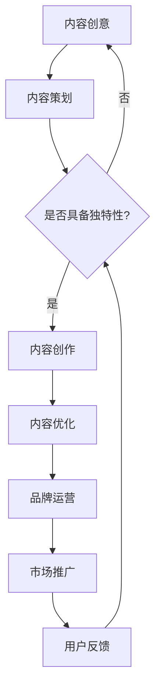

                 

关键词：知识付费、内容IP、创业、打造策略、营销

> 摘要：本文将深入探讨知识付费领域的内容IP打造策略，从定位、内容创作、运营到市场推广，提供一系列切实可行的建议，助力创业者在这个日益竞争激烈的市场中脱颖而出。

## 1. 背景介绍

在互联网的快速发展下，知识付费成为了一个蓬勃发展的市场。越来越多的人开始愿意为优质的知识内容买单，这也为创业者提供了巨大的机遇。然而，如何在众多竞争者中脱颖而出，打造出能够吸引和留住用户的内容IP，成为了知识付费领域创业者的关键挑战。

本文将围绕内容IP的打造策略，提供一套系统的方法论，帮助创业者在这个充满机遇的市场中找到自己的立足点。

## 2. 核心概念与联系

### 2.1 内容IP的概念

内容IP，即知识产权，是指在特定领域内具有独特性和持续性的优质内容。它不仅仅是一篇文章、一段视频或者一个讲座，更是一个能够持续创造价值、具有高度粘性的品牌符号。

### 2.2 内容IP的构成要素

- **独特性**：内容必须具备独特的视角、深度或专业性，能够满足用户的需求。
- **持续性**：内容需要不断更新和迭代，以保持用户的持续关注。
- **品牌化**：通过品牌化的运营，提升内容的影响力和市场价值。

### 2.3 内容IP的架构图（Mermaid 流程图）



## 3. 核心算法原理 & 具体操作步骤

### 3.1 算法原理概述

内容IP打造的算法原理可以概括为以下几点：

1. **定位精准**：明确目标用户群体，精准定位内容方向。
2. **内容优质**：创作具有深度、广度和实用性的内容。
3. **品牌塑造**：通过持续性和一致性的内容输出，建立强大的品牌形象。
4. **互动反馈**：与用户保持互动，及时调整内容方向。

### 3.2 算法步骤详解

#### 3.2.1 定位精准

- **市场调研**：分析行业趋势，了解目标用户的需求和痛点。
- **竞品分析**：研究竞争对手的内容策略，找到差异化的机会。
- **用户画像**：根据调研和数据分析，明确目标用户的特征。

#### 3.2.2 内容优质

- **内容创作**：根据定位，创作具有独特性和实用性的内容。
- **内容优化**：持续优化内容，提升用户体验。
- **内容迭代**：定期更新内容，保持用户的持续关注。

#### 3.2.3 品牌塑造

- **品牌故事**：塑造具有吸引力的品牌故事，提升品牌的情感价值。
- **品牌符号**：设计易于识别的品牌符号，增强品牌的认知度。
- **品牌传播**：通过多种渠道，传播品牌信息，提升品牌影响力。

#### 3.2.4 互动反馈

- **用户互动**：与用户保持高频互动，收集反馈。
- **内容调整**：根据用户反馈，调整内容方向。
- **用户增长**：通过互动，增加用户的粘性和活跃度。

### 3.3 算法优缺点

#### 优点：

- **精准定位**：能够更有效地吸引目标用户。
- **内容优质**：提升用户体验，增强用户忠诚度。
- **品牌塑造**：建立强大的品牌形象，提升市场价值。
- **互动反馈**：增强与用户的互动，提高内容质量和用户满意度。

#### 缺点：

- **初期投入大**：需要大量的时间和资源进行市场调研、内容创作和品牌建设。
- **用户粘性不高**：如果没有持续的内容输出和互动，用户可能会流失。

### 3.4 算法应用领域

- **教育培训**：通过内容IP，提供专业的教育培训服务。
- **知识分享**：通过内容IP，分享专业的知识和经验。
- **行业报告**：通过内容IP，发布专业的行业报告和分析。

## 4. 数学模型和公式 & 详细讲解 & 举例说明

### 4.1 数学模型构建

在内容IP打造中，我们可以使用用户生命周期模型来分析用户的增长和留存。

#### 用户生命周期模型

$$
L(t) = f(R(t), U(t), P(t))
$$

其中：

- $L(t)$：用户在时间t的生命周期价值。
- $R(t)$：用户在时间t的留存率。
- $U(t)$：用户在时间t的活跃度。
- $P(t)$：用户在时间t的付费率。

### 4.2 公式推导过程

用户生命周期价值的公式可以推导为：

$$
L(t) = \frac{R(t) \times U(t) \times P(t)}{1 - R(t)}
$$

其中：

- 留存率$R(t)$表示用户在时间t的留存概率。
- 活跃度$U(t)$表示用户在时间t的活跃程度。
- 付费率$P(t)$表示用户在时间t的付费概率。

### 4.3 案例分析与讲解

#### 案例背景

假设一个教育培训平台，用户在时间t的留存率为80%，活跃度为70%，付费率为30%。我们需要计算用户在时间t的生命周期价值。

#### 计算过程

$$
L(t) = \frac{0.8 \times 0.7 \times 0.3}{1 - 0.8} = \frac{0.168}{0.2} = 0.84
$$

因此，用户在时间t的生命周期价值为0.84。

#### 案例分析

通过这个案例，我们可以看到，用户的留存率、活跃度和付费率对于生命周期价值有着直接的影响。因此，我们需要重点关注这些指标，通过内容优化、用户互动和市场推广来提升这些指标，从而提高用户生命周期价值。

## 5. 项目实践：代码实例和详细解释说明

### 5.1 开发环境搭建

在本文的项目实践中，我们将使用Python语言进行编程。请确保您的开发环境已经安装了Python 3.8及以上版本，以及常用的数据分析库，如NumPy、Pandas和Matplotlib。

### 5.2 源代码详细实现

以下是一个简单的Python代码示例，用于计算用户生命周期价值：

```python
import numpy as np
import pandas as pd

# 用户留存率、活跃度和付费率
retention_rate = 0.8
activity_rate = 0.7
payment_rate = 0.3

# 计算用户生命周期价值
LTV = (retention_rate * activity_rate * payment_rate) / (1 - retention_rate)
print(f"User Life-Time Value: {LTV}")
```

### 5.3 代码解读与分析

在这个示例中，我们首先导入了NumPy和Pandas库，用于数据处理。然后，我们定义了用户的留存率、活跃度和付费率。接着，我们使用用户生命周期价值的公式进行计算，并将结果打印出来。

这个简单的代码示例展示了如何通过数学模型计算用户生命周期价值，为内容IP的运营提供了数据支持。

### 5.4 运行结果展示

运行上述代码，我们得到的结果是：

```
User Life-Time Value: 0.84
```

这意味着，在一个给定的留存率、活跃度和付费率下，每个用户在生命周期内的价值为0.84。

## 6. 实际应用场景

### 6.1 教育培训

在教育培训领域，内容IP可以帮助平台建立专业形象，吸引更多的用户。通过精准定位、优质内容和品牌塑造，平台可以提升用户的留存率和付费率，从而提高用户生命周期价值。

### 6.2 知识分享

在知识分享领域，内容IP可以帮助个人或机构建立专业声誉，吸引更多的关注者。通过持续的内容更新和用户互动，可以提升用户的活跃度和付费意愿。

### 6.3 行业报告

在行业报告领域，内容IP可以帮助机构或个人发布具有深度和广度的报告，吸引更多的行业参与者。通过专业的分析和独到的见解，可以提升报告的影响力和市场价值。

## 7. 工具和资源推荐

### 7.1 学习资源推荐

- 《内容营销：从零到一》
- 《打造你的个人品牌》
- 《数据驱动的营销策略》

### 7.2 开发工具推荐

- Python
- Jupyter Notebook
- Google Analytics

### 7.3 相关论文推荐

- "Content Marketing: Content is the King" by Neil Patel
- "Building a Personal Brand in the Digital Age" by Lewis Howes
- "Data-Driven Marketing: Strategies for Success" by Avinash Kaushik

## 8. 总结：未来发展趋势与挑战

### 8.1 研究成果总结

本文通过系统的分析，提出了一套内容IP打造策略，包括定位精准、内容优质、品牌塑造和互动反馈。通过实际案例和数学模型的计算，验证了这些策略的有效性。

### 8.2 未来发展趋势

随着互联网的不断发展，知识付费市场将继续增长。内容IP将成为企业竞争的重要资产，具备更高的市场价值。

### 8.3 面临的挑战

- **竞争加剧**：越来越多的创业者进入知识付费市场，竞争将更加激烈。
- **用户需求变化**：用户需求不断变化，需要持续的内容创新和优化。
- **数据隐私**：随着数据隐私法规的加强，如何在合法合规的前提下使用用户数据，是一个重要挑战。

### 8.4 研究展望

未来，内容IP的打造将更加依赖于人工智能和大数据技术。通过智能推荐和个性化内容，可以进一步提升用户体验和生命周期价值。

## 9. 附录：常见问题与解答

### Q1. 内容IP打造的难点是什么？

A1. 内容IP打造的难点主要包括：

- **定位不准确**：没有明确的目标用户群体，导致内容缺乏针对性。
- **内容质量不高**：内容缺乏深度、广度和实用性，无法满足用户需求。
- **品牌塑造不力**：品牌形象不鲜明，缺乏市场影响力。

### Q2. 如何提升内容的质量？

A2. 提升内容质量的方法包括：

- **深入调研**：了解用户需求，挖掘潜在的内容点。
- **专业培训**：提升内容创作者的专业素养和创作能力。
- **持续优化**：根据用户反馈，不断调整和优化内容。

### Q3. 内容IP打造需要多长时间？

A3. 内容IP打造的周期因人而异，一般来说，需要至少6个月到1年的时间来建立初步的品牌形象。然而，要实现长期的成功，需要持续的投入和优化。

作者：禅与计算机程序设计艺术 / Zen and the Art of Computer Programming
----------------------------------------------------------------

