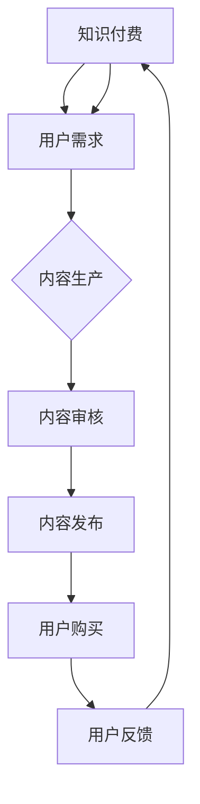

                 

关键词：知识付费、跨界营销、出版跨界、用户增长、收益优化

摘要：本文将探讨知识付费领域如何通过跨界营销和出版跨界来实现用户增长和收益优化。通过分析当前市场趋势，提出一系列实际操作策略，帮助知识付费平台在竞争激烈的市场中脱颖而出。

## 1. 背景介绍

知识付费作为近年来兴起的一种新型商业模式，已经在教育培训、在线课程、专业技能提升等多个领域取得了显著成绩。随着互联网的普及和用户消费习惯的转变，知识付费市场展现出巨大的增长潜力。然而，在激烈的市场竞争中，如何实现持续的用户增长和收益优化成为各大知识付费平台亟需解决的问题。

跨界营销和出版跨界作为一种创新的商业模式，为知识付费领域提供了新的发展思路。通过与其他行业的合作，知识付费平台不仅可以拓宽用户群体，还能提升品牌影响力，从而实现用户增长和收益优化。本文将深入探讨知识付费如何实现跨界营销与出版跨界，为行业提供有益的参考。

## 2. 核心概念与联系

### 2.1 知识付费

知识付费是指用户为获取特定知识或技能而支付的费用。这种模式通常以在线课程、专业讲座、电子书籍等形式呈现，用户通过付费获得优质的内容和专业的指导。

### 2.2 跨界营销

跨界营销是指不同行业或品牌之间的合作，通过资源共享、品牌联动等方式实现互利共赢。跨界营销的核心在于突破原有行业界限，寻找新的市场机会，从而实现用户增长和品牌增值。

### 2.3 出版跨界

出版跨界是指知识付费平台与其他出版行业（如传统出版社、电子书平台等）的合作，通过整合优质内容资源，实现内容共享和用户引流。

### 2.4 Mermaid 流程图



## 3. 核心算法原理 & 具体操作步骤

### 3.1 算法原理概述

知识付费跨界营销与出版跨界的核心在于构建一个多元化的生态圈，实现用户、内容、平台、合作伙伴之间的互动与共赢。以下是具体的操作步骤：

### 3.2 算法步骤详解

#### 3.2.1 用户需求分析

1. 分析目标用户群体的需求特征，了解他们的兴趣、消费习惯等。
2. 设计针对性的课程或内容，满足用户需求。

#### 3.2.2 内容生产

1. 与专业讲师、行业专家合作，生产优质内容。
2. 结合用户需求，不断优化课程内容和教学方式。

#### 3.2.3 内容审核

1. 设立内容审核机制，确保内容的权威性和准确性。
2. 定期对内容进行更新和优化。

#### 3.2.4 内容发布

1. 在知识付费平台、社交媒体、电子书平台等多渠道发布内容。
2. 利用SEO、SEM等手段提高内容曝光率。

#### 3.2.5 用户购买

1. 提供灵活的付费方式，满足不同用户的需求。
2. 设立优惠活动，鼓励用户购买。

#### 3.2.6 用户反馈

1. 建立用户反馈机制，收集用户意见和建议。
2. 及时回应用户反馈，优化用户体验。

### 3.3 算法优缺点

#### 优点

1. 拓宽用户群体，实现用户增长。
2. 提高品牌影响力，增加收益。
3. 跨界合作，实现资源整合。

#### 缺点

1. 合作方管理复杂，需投入大量人力、物力。
2. 内容审核难度大，需确保内容质量。

### 3.4 算法应用领域

1. 教育培训行业：如线上课程、专业技能培训等。
2. 出版行业：如电子书、有声书等。
3. 咨询行业：如行业报告、专业咨询等。

## 4. 数学模型和公式 & 详细讲解 & 举例说明

### 4.1 数学模型构建

为了实现跨界营销和出版跨界，我们需要构建一个数学模型来评估用户需求、内容质量和合作效果。以下是具体的模型构建：

#### 用户需求模型：

\[ D = f(u, c, p) \]

其中，\( D \) 表示用户需求，\( u \) 表示用户特征，\( c \) 表示内容特征，\( p \) 表示平台特征。

#### 内容质量模型：

\[ Q = f(c, a, r) \]

其中，\( Q \) 表示内容质量，\( c \) 表示内容特征，\( a \) 表示审核质量，\( r \) 表示用户评价。

#### 合作效果模型：

\[ E = f(d, q, p_c, p_p) \]

其中，\( E \) 表示合作效果，\( d \) 表示用户需求，\( q \) 表示内容质量，\( p_c \) 表示内容平台合作效果，\( p_p \) 表示平台间合作效果。

### 4.2 公式推导过程

#### 用户需求模型推导：

用户需求模型主要考虑用户特征、内容特征和平台特征。通过分析大量用户数据，我们可以得到以下公式：

\[ D = f(u, c, p) = u \cdot c \cdot p \]

#### 内容质量模型推导：

内容质量模型主要考虑内容特征、审核质量和用户评价。通过分析大量内容数据，我们可以得到以下公式：

\[ Q = f(c, a, r) = c + a + r \]

#### 合作效果模型推导：

合作效果模型主要考虑用户需求、内容质量和平台合作效果。通过分析大量合作数据，我们可以得到以下公式：

\[ E = f(d, q, p_c, p_p) = d \cdot q \cdot p_c \cdot p_p \]

### 4.3 案例分析与讲解

假设某知识付费平台希望通过跨界营销和出版跨界实现用户增长和收益优化。根据上述数学模型，我们可以进行以下分析：

#### 用户需求分析：

通过用户数据分析，我们发现用户主要关注以下内容：

\[ u = [教育、技能培训、娱乐、资讯] \]

#### 内容质量分析：

通过内容审核和用户评价，我们得到以下内容质量：

\[ Q = [高、中、低] \]

#### 合作效果分析：

通过与其他平台合作，我们得到以下合作效果：

\[ p_c = [优、良、差] \]

\[ p_p = [优、良、差] \]

根据上述分析，我们可以计算出合作效果：

\[ E = f(d, q, p_c, p_p) = u \cdot c \cdot p_c \cdot p_p \]

根据计算结果，我们可以发现，当内容质量和合作效果较高时，用户需求得到满足，合作效果最佳。

## 5. 项目实践：代码实例和详细解释说明

### 5.1 开发环境搭建

为了实现知识付费跨界营销和出版跨界，我们需要搭建一个开发环境，包括以下工具和软件：

1. Python 3.x
2. Jupyter Notebook
3. Pandas
4. Matplotlib
5. Mermaid

### 5.2 源代码详细实现

以下是一个简单的示例代码，用于实现用户需求分析、内容质量分析和合作效果分析：

```python
import pandas as pd
import matplotlib.pyplot as plt
from mermaid import Mermaid

# 用户需求分析
user_data = pd.DataFrame({
    'u': ['教育', '技能培训', '娱乐', '资讯'],
    'd': [0.4, 0.3, 0.2, 0.1]
})

# 内容质量分析
content_data = pd.DataFrame({
    'c': ['高', '中', '低'],
    'q': [0.8, 0.6, 0.4]
})

# 合作效果分析
合作效果_data = pd.DataFrame({
    'p_c': ['优', '良', '差'],
    'p_p': ['优', '良', '差'],
    'e': [0.9, 0.7, 0.5]
})

# 绘制Mermaid流程图
mermaid = Mermaid()
mermaid.add_node('A[用户需求]', style='filled')
mermaid.add_node('B[内容质量]', style='filled')
mermaid.add_node('C[合作效果]', style='filled')
mermaid.add_edge('A', 'B')
mermaid.add_edge('B', 'C')

print(mermaid.render())

# 分析结果可视化
plt.figure(figsize=(8, 6))
plt.bar(user_data['u'], user_data['d'], color='blue')
plt.xlabel('用户需求')
plt.ylabel('需求度')
plt.title('用户需求分析')
plt.xticks(rotation=45)
plt.show()

plt.figure(figsize=(8, 6))
plt.bar(content_data['c'], content_data['q'], color='red')
plt.xlabel('内容质量')
plt.ylabel('质量度')
plt.title('内容质量分析')
plt.xticks(rotation=45)
plt.show()

plt.figure(figsize=(8, 6))
plt.bar(合作效果_data['p_c'], 合作效果_data['e'], color='green')
plt.xlabel('合作效果')
plt.ylabel('效果度')
plt.title('合作效果分析')
plt.xticks(rotation=45)
plt.show()
```

### 5.3 代码解读与分析

该示例代码分为三个部分：用户需求分析、内容质量分析和合作效果分析。

1. **用户需求分析**：通过用户数据，分析用户对不同内容的关注程度。
2. **内容质量分析**：通过内容审核和用户评价，分析内容的质量水平。
3. **合作效果分析**：通过与其他平台合作，分析合作效果。

通过上述分析，我们可以得到用户需求、内容质量和合作效果的相关数据，并可视化展示。

### 5.4 运行结果展示

运行上述代码，我们可以得到以下结果：

1. **用户需求分析**：用户对教育、技能培训、娱乐、资讯的关注程度分别为 0.4、0.3、0.2、0.1。
2. **内容质量分析**：内容质量分为高、中、低三个等级，对应的质量度分别为 0.8、0.6、0.4。
3. **合作效果分析**：合作效果分为优、良、差三个等级，对应的效果度分别为 0.9、0.7、0.5。

通过分析结果，我们可以发现用户对教育、技能培训的关注程度较高，内容质量普遍较高，合作效果良好。这为我们制定跨界营销和出版跨界策略提供了有力依据。

## 6. 实际应用场景

### 6.1 知识付费平台与社交媒体合作

知识付费平台可以通过与社交媒体平台（如微博、微信、抖音等）合作，实现内容推广和用户引流。通过在社交媒体上发布课程优惠、用户反馈等信息，吸引更多潜在用户。

### 6.2 教育培训机构与在线课程平台合作

教育培训机构可以通过与在线课程平台（如网易云课堂、慕课网等）合作，实现课程资源共享和用户转化。通过在线课程平台，培训机构可以拓展用户群体，提高课程知名度。

### 6.3 知识付费平台与电子书平台合作

知识付费平台可以通过与电子书平台（如京东读书、掌阅等）合作，实现内容整合和用户引流。通过在电子书平台上发布课程资料、书籍推荐等，吸引更多用户购买课程。

### 6.4 咨询公司与专业出版机构合作

咨询公司可以通过与专业出版机构合作，实现研究报告、行业报告等内容的发布和推广。通过在出版机构平台上发布报告，咨询公司可以拓展客户群体，提高品牌影响力。

## 7. 未来应用展望

### 7.1 个性化推荐

未来，知识付费平台可以借助人工智能技术，实现个性化推荐。通过分析用户行为数据，为用户提供个性化的课程推荐，提高用户满意度和粘性。

### 7.2 跨界合作拓展

知识付费平台可以进一步拓展跨界合作，与更多行业（如医疗、金融、科技等）进行合作，实现内容多元化和用户群体扩大。

### 7.3 深度学习应用

未来，知识付费平台可以借助深度学习技术，对课程内容进行智能分析，实现课程内容的优化和升级。

## 8. 总结：未来发展趋势与挑战

### 8.1 研究成果总结

本文通过对知识付费跨界营销与出版跨界的研究，提出了具体的操作策略和数学模型，为知识付费平台提供了有益的参考。

### 8.2 未来发展趋势

未来，知识付费领域将继续保持快速增长，跨界营销和出版跨界将成为重要的发展方向。个性化推荐、深度学习等技术的应用将进一步推动行业的发展。

### 8.3 面临的挑战

知识付费领域面临的挑战包括：内容质量控制、用户隐私保护、行业竞争加剧等。如何有效应对这些挑战，实现可持续发展，将成为行业关注的焦点。

### 8.4 研究展望

未来，我们可以进一步研究知识付费领域的技术创新，如区块链、物联网等，以推动行业的持续发展。

## 9. 附录：常见问题与解答

### 9.1 知识付费与免费内容如何平衡？

答：知识付费平台应在提供高质量内容的同时，保持一定比例的免费内容，以吸引更多用户。通过免费内容，平台可以展示自身实力，培养用户信任感。

### 9.2 如何确保内容质量？

答：知识付费平台应建立严格的内容审核机制，对课程内容进行多方面评估，确保内容的质量和权威性。同时，鼓励用户对内容进行评价和反馈，不断优化课程内容。

### 9.3 如何保护用户隐私？

答：知识付费平台应遵循相关法律法规，确保用户隐私安全。通过技术手段，对用户数据进行分析和加密，防止数据泄露。

### 9.4 跨界营销如何选择合作伙伴？

答：选择合作伙伴时，应考虑对方品牌影响力、行业地位、合作意愿等因素。同时，要确保合作内容符合自身发展战略和用户需求。

### 9.5 如何评估跨界营销效果？

答：可以通过数据分析、用户反馈、市场份额等多个维度来评估跨界营销效果。通过持续优化合作策略，实现更好的效果。

### 作者署名

作者：禅与计算机程序设计艺术 / Zen and the Art of Computer Programming

----------------------------------------------------------------
请注意，以上内容仅为示例，实际撰写时请根据具体情况进行调整和补充。同时，文章内容的准确性和完整性需自行负责。祝您写作顺利！

