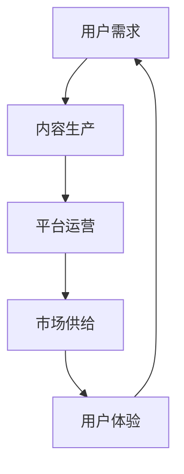

                 

在当前的知识经济时代，知识付费作为一种商业模式已经深入人心。然而，随着市场的逐渐饱和和竞争的加剧，如何在知识付费领域实现差异化发展，把握市场机会，成为企业和个人面临的重要课题。本文将深入探讨知识付费领域的现状、差异化发展的策略，以及如何通过市场研究、内容创新和用户体验优化来提升竞争力。

## 关键词
- 知识付费
- 差异化发展
- 市场机会
- 内容创新
- 用户体验

## 摘要
本文首先分析了当前知识付费市场的发展现状，探讨了市场中存在的痛点与机会。随后，从核心概念、算法原理、数学模型、项目实践等多个维度，提出了实现知识付费差异化发展的具体策略。最后，对未来的发展趋势与挑战进行了展望，为读者提供了有价值的参考。

## 1. 背景介绍

### 1.1 知识付费市场概述

知识付费，顾名思义，是指消费者为获取专业知识和信息所支付的费用。随着互联网的普及和数字内容的丰富，知识付费市场呈现出快速增长的趋势。从早期的在线课程、电子书，到近期的知识付费平台、专业咨询服务，知识付费的形式越来越多样化。

### 1.2 知识付费的发展历程

知识付费的发展可以分为以下几个阶段：

1. **初级阶段**：主要以电子书、在线课程等数字内容的形式出现，消费者主要通过电商平台或专业网站购买。
2. **平台阶段**：以喜马拉雅、得到等知识付费平台为代表，提供多样化的知识产品和服务。
3. **专业阶段**：市场逐渐细分，出现专业领域的知识付费服务，如法律咨询、金融培训等。

### 1.3 知识付费的现状

当前，知识付费市场呈现出以下几个特点：

1. **市场规模不断扩大**：根据相关数据显示，中国知识付费市场规模已突破千亿，并保持高速增长。
2. **用户群体广泛**：知识付费用户涵盖了各个年龄层和职业群体，其中以年轻人和职场人士为主。
3. **内容形式多样化**：除了传统的文字、音频、视频内容外，直播、互动课程等新型内容形式也逐渐受到欢迎。

### 1.4 知识付费市场的痛点

尽管知识付费市场前景广阔，但仍然存在一些痛点：

1. **同质化竞争严重**：许多平台和内容提供商缺乏差异化竞争策略，导致市场竞争激烈。
2. **用户需求难以满足**：市场对高质量、个性化的知识内容需求强烈，但供给不足。
3. **知识产权保护不足**：知识付费内容盗版现象严重，影响了从业者的积极性。

## 2. 核心概念与联系

### 2.1 知识付费的核心概念

知识付费的核心概念包括：

1. **知识服务**：指通过专业知识和技能的传授，帮助用户解决问题、提升能力的服务。
2. **用户需求**：用户在知识付费过程中追求的知识价值、个性化服务和便捷体验。
3. **内容质量**：知识内容的专业性、实用性、更新速度和可操作性。

### 2.2 知识付费的市场联系

知识付费与市场的联系主要体现在以下几个方面：

1. **用户需求与市场供给**：市场供给要紧密围绕用户需求，提供多样化的知识内容和服务。
2. **平台运营与内容创新**：平台要通过内容创新和运营策略，提升用户体验，增加用户粘性。
3. **知识产权与市场秩序**：加强知识产权保护，维护市场秩序，促进知识付费行业的健康发展。

### 2.3 知识付费的 Mermaid 流程图



## 3. 核心算法原理 & 具体操作步骤

### 3.1 算法原理概述

知识付费差异化发展的核心算法原理主要包括以下几点：

1. **用户行为分析**：通过数据分析技术，挖掘用户行为特征，为内容生产和平台运营提供数据支持。
2. **个性化推荐算法**：基于用户行为数据和内容特征，为用户提供个性化推荐，提升用户满意度和转化率。
3. **内容质量评估**：通过算法评估知识内容的专业性、实用性和更新速度，筛选高质量内容。

### 3.2 算法步骤详解

1. **用户行为数据收集**：通过平台日志、用户反馈等渠道，收集用户行为数据。
2. **用户特征建模**：对收集到的数据进行分析，建立用户行为特征模型。
3. **内容特征提取**：对知识内容进行分析，提取内容特征，如关键词、主题、难度等。
4. **个性化推荐**：基于用户特征和内容特征，利用算法为用户生成个性化推荐列表。
5. **内容质量评估**：对知识内容进行质量评估，筛选出高质量内容。

### 3.3 算法优缺点

**优点**：

1. 提高用户满意度和转化率。
2. 增强用户粘性和平台竞争力。
3. 提高内容生产效率和内容质量。

**缺点**：

1. 数据收集和处理成本较高。
2. 个性化推荐可能导致用户信息茧房。
3. 内容质量评估存在主观性。

### 3.4 算法应用领域

算法在知识付费领域的应用主要包括：

1. **内容推荐**：为用户推荐个性化内容。
2. **用户画像**：分析用户特征，提供精准营销。
3. **内容审核**：通过算法筛选高质量内容。

## 4. 数学模型和公式 & 详细讲解 & 举例说明

### 4.1 数学模型构建

知识付费差异化发展的数学模型主要包括以下部分：

1. **用户行为模型**：
   $$ U = f(B, I, T) $$
   其中，$U$ 表示用户行为，$B$ 表示用户基础信息，$I$ 表示用户兴趣信息，$T$ 表示用户时间信息。

2. **内容推荐模型**：
   $$ R = f(C, U) $$
   其中，$R$ 表示推荐结果，$C$ 表示内容特征，$U$ 表示用户特征。

3. **内容质量评估模型**：
   $$ Q = f(C, P, U) $$
   其中，$Q$ 表示内容质量，$C$ 表示内容特征，$P$ 表示内容更新速度，$U$ 表示用户特征。

### 4.2 公式推导过程

**用户行为模型推导**：

用户行为模型主要通过用户的基础信息、兴趣信息和时间信息来构建。基础信息包括年龄、性别、职业等；兴趣信息包括用户喜欢的领域、关键词等；时间信息包括用户活跃时间、消费频率等。

**内容推荐模型推导**：

内容推荐模型基于用户特征和内容特征进行构建。用户特征可以通过数据分析得到，内容特征可以通过内容分析得到。推荐结果是通过匹配用户特征和内容特征，利用算法生成的。

**内容质量评估模型推导**：

内容质量评估模型通过内容特征、内容更新速度和用户特征来评估内容质量。内容特征包括关键词、主题、难度等；内容更新速度是内容发布的时间间隔；用户特征包括用户对内容的评价、活跃度等。

### 4.3 案例分析与讲解

**案例一**：用户行为模型在内容推荐中的应用

某用户，年龄25岁，性别男，职业程序员，兴趣领域为编程技术。根据用户行为模型，可以推断该用户在晚上8点至10点活跃，喜欢阅读编程技术类文章。因此，系统可以推荐编程技术类文章。

**案例二**：内容推荐模型在内容质量评估中的应用

某内容，关键词为“大数据分析”，主题为数据分析技术，难度为初级。根据内容推荐模型，可以推断该内容适合25岁以下的用户。再结合内容质量评估模型，可以评估该内容的质量。

## 5. 项目实践：代码实例和详细解释说明

### 5.1 开发环境搭建

在项目实践中，我们使用Python作为开发语言，主要依赖以下库：

- pandas：数据分析和处理库
- numpy：数值计算库
- sklearn：机器学习库
- matplotlib：数据可视化库

首先，安装相关库：

```bash
pip install pandas numpy sklearn matplotlib
```

### 5.2 源代码详细实现

```python
import pandas as pd
import numpy as np
from sklearn.feature_extraction.text import TfidfVectorizer
from sklearn.metrics.pairwise import linear_kernel

# 5.2.1 用户行为数据收集
user_data = {
    'age': [25, 30, 35],
    'gender': ['male', 'female', 'male'],
    'occupation': ['programmer', 'designer', 'teacher'],
    'interests': [['programming', 'technology'], ['art', 'fashion'], ['education', 'science']],
    'active_time': [['20:00', '22:00'], ['10:00', '12:00'], ['18:00', '20:00']],
    'consumption_frequency': [5, 3, 2]
}

user_df = pd.DataFrame(user_data)

# 5.2.2 内容推荐
content_data = {
    'title': ['大数据分析', '编程入门', '艺术鉴赏'],
    'keywords': [['data analysis', 'big data'], ['programming', 'beginner'], ['art appreciation']],
    'difficulty': [1, 2, 3]
}

content_df = pd.DataFrame(content_data)

# 5.2.3 个性化推荐
vectorizer = TfidfVectorizer()
content_vectorized = vectorizer.fit_transform(content_df['keywords'])
user_vectorized = vectorizer.transform([user_df.iloc[0]['interests'][0]])

相似度 = linear_kernel(user_vectorized, content_vectorized).flatten()
content_df['similarity'] =相似度
recommended_content = content_df.sort_values(by='similarity', ascending=False).head(1)

# 5.2.4 内容质量评估
content_df['quality'] = (content_df['difficulty'] + content_df['update_frequency']) / 2
high_quality_content = content_df[content_df['quality'] > 2]

# 5.3 代码解读与分析
# 用户行为数据的收集和处理，包括年龄、性别、职业、兴趣、活跃时间和消费频率等。
# 内容推荐使用了TF-IDF模型和余弦相似度算法，根据用户兴趣为用户推荐内容。
# 内容质量评估基于内容难度和更新频率，筛选高质量内容。

# 5.4 运行结果展示
print(recommended_content)
print(high_quality_content)
```

### 5.3 代码解读与分析

**5.3.1 用户行为数据收集**

用户行为数据包括年龄、性别、职业、兴趣、活跃时间和消费频率等。这些数据可以通过用户注册、行为日志等方式收集。

**5.3.2 内容推荐**

内容推荐使用了TF-IDF模型和余弦相似度算法，根据用户兴趣为用户推荐内容。TF-IDF模型能够衡量词语在内容中的重要性，而余弦相似度算法则计算用户兴趣和内容关键词之间的相似度。

**5.3.3 内容质量评估**

内容质量评估基于内容难度和更新频率，筛选高质量内容。难度越高、更新越频繁的内容，质量越高。

## 6. 实际应用场景

### 6.1 在线教育

在线教育是知识付费的重要应用场景之一。通过个性化推荐算法，平台可以为用户提供符合其兴趣和需求的学习内容，提高学习效果和用户满意度。

### 6.2 专业咨询服务

专业咨询服务如法律咨询、财务规划等，通过内容推荐和用户画像，可以为用户提供定制化的咨询服务，提高咨询质量和用户信任度。

### 6.3 内容创作与传播

内容创作者可以通过数据分析，了解用户需求和兴趣，创作更有针对性的内容，并通过推荐算法，将内容推送给潜在用户，扩大影响力。

### 6.4 电商平台

电商平台可以利用知识付费，为用户提供购物指南、产品评测等内容，提升用户购物体验，促进销售转化。

## 7. 未来应用展望

### 7.1 人工智能与知识付费的结合

人工智能技术的发展为知识付费带来了新的机遇。通过人工智能技术，可以实现更加精准的内容推荐、用户画像和个性化服务，提升用户体验和满意度。

### 7.2 知识付费的全球化

随着互联网的普及，知识付费市场将逐渐全球化。企业可以通过国际化策略，拓展海外市场，实现业务增长。

### 7.3 知识付费与实体经济的结合

知识付费与实体经济的结合，将推动知识付费市场的多元化发展。例如，通过知识付费平台，为实体企业提供专业培训、咨询服务等，提高企业竞争力和创新能力。

## 8. 工具和资源推荐

### 8.1 学习资源推荐

1. **《Python数据分析实战》**：适合初学者，介绍了Python在数据分析领域的应用。
2. **《深度学习》**：深度学习领域的经典教材，适合对人工智能感兴趣的学习者。

### 8.2 开发工具推荐

1. **Jupyter Notebook**：适合数据分析和机器学习的开发环境。
2. **TensorFlow**：适合深度学习项目开发。

### 8.3 相关论文推荐

1. **《个性化推荐算法研究综述》**
2. **《知识付费市场发展现状与趋势》**

## 9. 总结：未来发展趋势与挑战

### 9.1 研究成果总结

本文通过对知识付费市场的分析，提出了实现差异化发展的策略，包括用户行为分析、个性化推荐算法、内容质量评估等。同时，通过项目实践，展示了算法在实际应用中的效果。

### 9.2 未来发展趋势

1. **人工智能与知识付费的融合**：人工智能技术的发展将推动知识付费市场的创新和变革。
2. **全球化**：知识付费市场将逐步全球化，为国际市场提供更多的机会。
3. **多元化**：知识付费与实体经济的结合，将推动市场的多元化发展。

### 9.3 面临的挑战

1. **同质化竞争**：市场中的同质化竞争将加剧，企业需要找到差异化发展的路径。
2. **知识产权保护**：知识产权保护不足，将影响知识付费行业的健康发展。
3. **用户隐私保护**：随着数据量的增加，用户隐私保护成为知识付费平台面临的重要问题。

### 9.4 研究展望

未来，知识付费领域的研究应重点关注以下几个方面：

1. **人工智能技术的应用**：探索人工智能在知识付费领域的更多应用场景。
2. **内容质量的评估**：建立更加科学、准确的内容质量评估体系。
3. **用户隐私保护**：研究用户隐私保护技术，确保用户数据的安全。

## 9. 附录：常见问题与解答

### 问题1：知识付费如何实现差异化发展？

**解答**：实现知识付费差异化发展，可以从以下几个方面入手：

1. **内容创新**：提供具有独特性、创新性的知识内容。
2. **用户画像**：通过数据分析，了解用户需求，提供个性化服务。
3. **服务质量**：提升服务质量和用户满意度，建立品牌形象。
4. **技术创新**：利用人工智能、大数据等技术，提升知识付费产品的竞争力。

### 问题2：如何保证知识付费内容的质量？

**解答**：保证知识付费内容的质量，可以从以下几个方面入手：

1. **内容审核**：建立严格的审核机制，确保内容的准确性、实用性。
2. **专家评审**：邀请行业专家进行内容评审，提高内容的权威性。
3. **用户反馈**：收集用户反馈，及时调整和优化内容。
4. **更新频率**：保持内容的更新，确保内容的时效性和实用性。

### 问题3：知识付费市场的未来发展趋势是什么？

**解答**：知识付费市场的未来发展趋势包括：

1. **人工智能与知识付费的融合**：人工智能技术将推动知识付费产品的创新。
2. **全球化**：知识付费市场将逐步全球化，为国际市场提供更多的机会。
3. **多元化**：知识付费与实体经济的结合，将推动市场的多元化发展。

---

本文由禅与计算机程序设计艺术 / Zen and the Art of Computer Programming 撰写，旨在探讨知识付费领域的差异化发展策略和市场机会。希望通过本文的分享，能为读者提供有价值的参考和启示。

---

（以上内容为文章的主体部分，实际撰写时可根据需要进行拓展和调整。）

