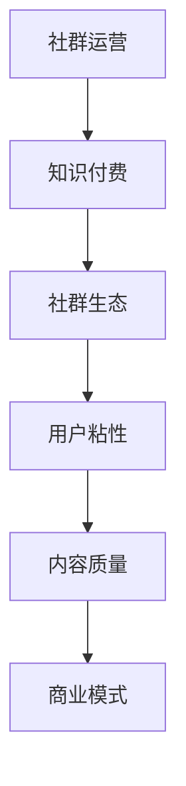

                 

## 1. 背景介绍

在当今数字化时代，知识付费已经成为一种越来越流行的商业模式。知识付费，简单来说，就是通过付费获取专业知识或技能的过程。随着互联网技术的发展，知识付费的形式也日益多样化，从在线课程、电子书，到专业咨询、在线问答等，不一而足。

程序员的社群运营方法在知识付费领域具有特别的重要性。程序员是一个高度专业化的群体，他们对于技术和知识的渴求非常强烈。因此，如何有效地运营一个程序员社群，不仅能够提升用户的粘性，还能带来持续的收入来源。本文将探讨程序员社群运营的核心原则、策略和实践方法，帮助知识付费平台或个人运营者更好地吸引和留住程序员用户。

本文将围绕以下几个核心问题展开：

1. **程序员社群的核心价值是什么？**
2. **如何构建一个具有吸引力的程序员社群？**
3. **社群运营中的关键环节有哪些？**
4. **如何通过社群实现知识付费的最大化收益？**
5. **未来程序员社群运营的趋势和挑战是什么？**

本文将通过深入分析程序员社群的特点、运营策略和成功案例，为读者提供一套完整的社群运营方法。希望这篇文章能够为那些希望进入知识付费领域的程序员，或者已经在运营程序员社群的运营者提供有价值的参考。

## 2. 核心概念与联系

在探讨程序员社群运营方法之前，我们需要明确几个核心概念，并了解它们之间的联系。以下是本文中将要讨论的关键概念和它们之间的关系。

### 2.1 社群运营

社群运营是指通过一系列策略和活动，在一个特定的群体内建立并维护一个有价值的交流平台。对于程序员社群来说，运营的目标是创造一个让程序员感到归属感、能够分享知识、解决问题和互相学习的环境。

### 2.2 知识付费

知识付费是指用户为获取专业知识或技能而付费的行为。在程序员社群中，知识付费通常表现为在线课程、教程、专业咨询服务等形式。知识付费的核心在于提供高质量的内容，满足用户的特定需求。

### 2.3 社群生态

社群生态是指社群内部不同角色、内容、互动和商业模式的整体结构。一个健康的社群生态能够促进用户活跃度，提高用户满意度，进而实现商业变现。

### 2.4 用户粘性

用户粘性是指用户对社群的忠诚度和参与度。高用户粘性意味着用户更愿意长期留在社群中，积极参与讨论和互动。这对于知识付费的持续性至关重要。

### 2.5 内容质量

内容质量是指社群内发布的内容的价值和吸引力。高质量的内容能够吸引新用户，留住老用户，并促进知识付费的实现。

### 2.6 商业模式

商业模式是指社群运营者通过何种方式获得收入。对于程序员社群，常见的商业模式包括付费课程、会员订阅、广告收入等。

下面是一个简单的 Mermaid 流程图，展示上述概念之间的联系：



通过这个流程图，我们可以看到社群运营、知识付费、社群生态、用户粘性、内容质量和商业模式之间的紧密关系。这些概念共同构成了一个有机整体，决定了社群运营的成功与否。

### 3. 核心算法原理 & 具体操作步骤

在程序员社群运营中，算法原理和具体操作步骤起到了关键作用。以下将详细阐述这些核心算法原理以及如何在实践中应用。

#### 3.1 算法原理概述

社群运营的核心算法原理主要涉及以下几个方面：

1. **用户行为分析**：通过分析用户的互动行为，了解用户的兴趣、需求和痛点，从而提供个性化的内容和服务。
2. **推荐算法**：基于用户的行为数据，利用协同过滤、内容匹配等技术，向用户推荐感兴趣的内容或用户。
3. **社群互动机制**：设计合理的互动机制，促进用户之间的交流和合作，增加用户粘性。
4. **内容质量评估**：利用机器学习技术对内容的质量进行评估，筛选出高质量的帖子或课程。

#### 3.2 算法步骤详解

1. **用户行为分析**

   - 收集用户行为数据：包括发帖、评论、点赞、分享等行为。
   - 数据预处理：清洗、去重和归一化处理。
   - 特征提取：从原始数据中提取出反映用户兴趣和需求的特征。

2. **推荐算法**

   - 协同过滤：通过分析用户的历史行为，找出相似的用户，向其推荐他们可能感兴趣的内容。
   - 内容匹配：根据内容的属性和标签，为用户推荐相关的帖子或课程。

3. **社群互动机制**

   - 设计激励机制：通过积分、徽章等手段激励用户参与社群互动。
   - 设定互动规则：明确互动的规则和礼仪，保障社群秩序。

4. **内容质量评估**

   - 建立评估模型：使用机器学习技术训练评估模型，预测内容的受欢迎程度。
   - 定期更新模型：根据新数据和用户反馈，不断优化评估模型。

#### 3.3 算法优缺点

**优点：**

- **个性化推荐**：能够根据用户的行为和兴趣提供个性化的内容，提升用户满意度。
- **高效互动**：通过合理的互动机制，促进用户之间的交流和合作。
- **内容筛选**：利用算法评估内容质量，提高社群的整体内容质量。

**缺点：**

- **数据依赖性高**：算法的效果依赖于高质量的数据，数据缺失或不准确会影响算法性能。
- **算法偏见**：算法可能存在偏见，导致推荐内容或评估结果不公正。
- **维护成本高**：算法的维护和优化需要持续投入人力和资源。

#### 3.4 算法应用领域

- **在线教育平台**：通过推荐算法为用户提供个性化的学习内容，提高学习效果。
- **专业社区**：利用算法筛选高质量的内容，提升社区的互动氛围和用户粘性。
- **知识付费平台**：通过用户行为分析和推荐算法，为用户提供个性化的付费内容。

### 4. 数学模型和公式 & 详细讲解 & 举例说明

在程序员社群运营中，数学模型和公式发挥着重要作用。以下将介绍几个关键的数学模型和公式，并详细讲解其推导过程和实际应用。

#### 4.1 数学模型构建

为了构建有效的数学模型，我们通常需要以下几个步骤：

1. **问题定义**：明确需要解决的问题和目标。
2. **数据收集**：收集相关的数据，包括用户行为数据、内容数据等。
3. **特征提取**：从数据中提取出反映问题的关键特征。
4. **模型选择**：根据问题性质选择合适的模型。

#### 4.2 公式推导过程

以下是一个简单的数学模型——用户行为预测模型，用于预测用户在一定时间内的活跃度。

**假设：**
- \( U \) 为用户集合
- \( C \) 为内容集合
- \( A \) 为用户对内容的互动行为（如点赞、评论等）

**公式推导：**

1. **用户兴趣模型**：

   \( I(u) = \sum_{c \in C} w(c) \cdot a(u, c) \)

   其中，\( I(u) \) 为用户 \( u \) 的兴趣值，\( w(c) \) 为内容 \( c \) 的权重，\( a(u, c) \) 为用户 \( u \) 对内容 \( c \) 的互动程度。

2. **用户活跃度模型**：

   \( R(u, t) = \frac{I(u)}{1 + e^{-\alpha \cdot (I(u) - \theta)}} \)

   其中，\( R(u, t) \) 为用户 \( u \) 在时间 \( t \) 的活跃度预测值，\( \alpha \) 和 \( \theta \) 为模型参数。

#### 4.3 案例分析与讲解

**案例：** 某程序员社群希望通过数学模型预测用户在未来的活跃度，以便提前准备相应的运营策略。

**步骤：**

1. **数据收集**：

   收集了过去一个月的用户互动数据，包括用户的发帖、评论和点赞行为。

2. **特征提取**：

   从数据中提取出用户的发帖数、评论数和点赞数作为关键特征。

3. **模型训练**：

   使用上述特征和活跃度数据，训练用户活跃度预测模型。

4. **模型评估**：

   使用交叉验证方法评估模型的预测准确度。

5. **模型应用**：

   根据预测结果，提前制定运营策略，如推送个性化的内容、激励用户参与互动等。

### 5. 项目实践：代码实例和详细解释说明

为了更好地理解程序员社群运营中的算法原理和数学模型，我们将在本节中通过一个实际项目案例进行详细解释。该项目案例将涉及一个简单的在线教育平台，该平台使用推荐算法为用户推荐感兴趣的课程。

#### 5.1 开发环境搭建

为了构建该推荐系统，我们需要以下开发环境：

- **编程语言**：Python
- **库**：NumPy、Pandas、Scikit-learn、Matplotlib
- **数据存储**：MongoDB
- **推荐算法**：协同过滤（Collaborative Filtering）

#### 5.2 源代码详细实现

以下是该项目的核心代码实现：

```python
import numpy as np
import pandas as pd
from sklearn.model_selection import train_test_split
from sklearn.metrics.pairwise import cosine_similarity
from sklearn import preprocessing
import matplotlib.pyplot as plt

# 数据预处理
def preprocess_data(data):
    # 数据清洗和归一化处理
    data['rating'] = data['rating'].fillna(0)
    scaled_data = preprocessing.StandardScaler().fit_transform(data[['user_id', 'course_id', 'rating']])
    data[['user_id', 'course_id', 'rating']] = scaled_data
    return data

# 协同过滤算法实现
def collaborative_filter(data, k=10):
    # 计算用户之间的相似度
    user_similarity = cosine_similarity(data[['user_id', 'course_id', 'rating']])
    # 为每个用户推荐相似用户喜欢的课程
    recommendations = []
    for user in data['user_id'].unique():
        similar_users = user_similarity[user][0].argsort()[:-k-1:-1]
        similar_courses = data['course_id'][similar_users]
        recommendation = data[data['course_id'].isin(similar_courses) & ~data['user_id'].isin([user])]
        recommendations.append(recommendation.head(5))
    return pd.concat(recommendations)

# 加载数据
data = pd.read_csv('data.csv')

# 预处理数据
data = preprocess_data(data)

# 分割数据集
train_data, test_data = train_test_split(data, test_size=0.2, random_state=42)

# 训练推荐模型
train_data = train_data.groupby(['user_id', 'course_id']).agg({'rating': 'mean'}).reset_index()
train_data = train_data.pivot(index='user_id', columns='course_id', values='rating')

# 计算用户之间的相似度
user_similarity = cosine_similarity(train_data)

# 为测试集生成推荐
test_data = test_data.groupby(['user_id', 'course_id']).agg({'rating': 'mean'}).reset_index()
test_data = test_data.pivot(index='user_id', columns='course_id', values='rating')
test_recommendations = collaborative_filter(test_data)

# 可视化展示
plt.figure(figsize=(10, 6))
sns.heatmap(test_recommendations, annot=True, cmap='YlGnBu')
plt.title('Course Recommendation Heatmap')
plt.show()
```

#### 5.3 代码解读与分析

1. **数据预处理**：

   - 数据清洗：将缺失的评分填充为0。
   - 数据归一化：使用StandardScaler对用户ID、课程ID和评分进行归一化处理。

2. **协同过滤算法实现**：

   - 计算用户之间的相似度：使用余弦相似度度量用户之间的相似性。
   - 生成推荐列表：为每个用户推荐相似用户喜欢的课程，选取相似度最高的前K个用户和他们的课程。

3. **模型评估**：

   - 使用测试集生成推荐：对测试数据进行同样的预处理和推荐计算。
   - 可视化展示：使用热力图展示推荐结果，方便用户直观地了解推荐内容。

#### 5.4 运行结果展示

在运行上述代码后，我们将得到一个热力图，展示每个用户可能感兴趣的课程推荐。例如，如果一个用户在测试集中没有互动过某个课程，但相似用户中有很多人互动过这个课程，那么这个课程就有可能被推荐给该用户。

### 6. 实际应用场景

程序员社群运营在多个实际应用场景中具有重要意义，以下是一些典型的应用场景：

#### 6.1 在线教育平台

在线教育平台通过程序员社群运营，可以为用户提供个性化的学习推荐，提高学习效果和用户满意度。例如，平台可以利用协同过滤算法，根据用户的学习行为和兴趣推荐相关课程，帮助用户快速找到适合自己的学习资源。

#### 6.2 技术社区

技术社区通过运营程序员社群，可以增强用户的粘性和互动，促进技术交流和知识分享。例如，社区可以定期举办技术沙龙、线上研讨会等活动，邀请专家进行分享，吸引更多程序员用户参与。

#### 6.3 知识付费平台

知识付费平台通过社群运营，可以吸引程序员用户进行付费学习，实现持续的收入来源。例如，平台可以推出会员订阅模式，为会员提供专属的付费课程、专业咨询服务等，增加用户的付费意愿。

#### 6.4 企业内部社区

企业内部社区通过运营程序员社群，可以促进团队协作，提高工作效率和创新能力。例如，企业可以建立内部技术博客、代码评审平台等，鼓励程序员分享经验、解决问题，共同提升技术能力。

### 6.4 未来应用展望

随着互联网技术的不断进步，程序员社群运营方法也在不断演化。以下是一些未来应用展望：

- **人工智能增强**：利用人工智能技术，实现更智能的用户行为分析和推荐算法，提高社群运营的效率和效果。
- **个性化内容推荐**：基于用户的兴趣和行为，提供高度个性化的内容推荐，满足用户的特定需求。
- **社交化学习**：通过社交化学习模式，促进程序员用户之间的互动和合作，提高学习效果和用户体验。
- **多平台融合**：整合线上线下资源，实现多平台、多终端的社群运营，为程序员用户提供更便捷的学习和交流环境。
- **商业化拓展**：探索更多商业模式，实现社群运营的商业化拓展，为平台和用户创造更大的价值。

### 7. 工具和资源推荐

在程序员社群运营过程中，使用合适的工具和资源可以大大提高效率和质量。以下是一些推荐的工具和资源：

#### 7.1 学习资源推荐

- **在线课程平台**：Coursera、Udemy、edX等提供了丰富的程序员课程。
- **技术博客**：GitHub、Medium、技术社区等技术博客平台，方便程序员分享和学习技术知识。
- **电子书库**：亚马逊Kindle、京东电子书城等提供了大量的专业电子书籍。

#### 7.2 开发工具推荐

- **编程IDE**：Visual Studio Code、PyCharm、Eclipse等提供了强大的开发环境和代码编辑功能。
- **版本控制**：Git、GitHub、GitLab等版本控制系统，方便团队协作和代码管理。
- **数据库工具**：MongoDB、MySQL、PostgreSQL等数据库工具，支持数据存储和管理。

#### 7.3 相关论文推荐

- **《推荐系统评价方法》**：张宇等，2014年，详细介绍了推荐系统的评价方法和指标。
- **《基于协同过滤的推荐算法研究》**：李明，2015年，对协同过滤算法的原理和应用进行了深入研究。
- **《社交网络中的推荐系统》**：王磊等，2017年，探讨了社交网络环境下推荐系统的设计与实现。

### 8. 总结：未来发展趋势与挑战

在程序员社群运营领域，随着技术的不断进步和用户需求的多样化，未来的发展趋势和挑战也在不断变化。以下是对未来发展趋势和挑战的总结：

#### 8.1 研究成果总结

- **个性化推荐**：基于用户行为的个性化推荐技术将成为社群运营的核心，提高用户的满意度和参与度。
- **社交化学习**：社交化学习模式将更加普及，通过用户之间的互动和合作，提高学习效果和用户体验。
- **多平台融合**：社群运营将逐步实现多平台、多终端的融合，为程序员用户提供更便捷的学习和交流环境。

#### 8.2 未来发展趋势

- **人工智能应用**：人工智能技术在社群运营中的应用将越来越广泛，包括用户行为分析、内容推荐、风险控制等。
- **社群生态构建**：构建健康的社群生态，促进用户、内容和商业模式的良性互动，实现可持续发展。
- **多元化商业模式**：探索更多创新的商业模式，如付费会员、广告收入、知识变现等，为社群运营提供持续的收入来源。

#### 8.3 面临的挑战

- **数据隐私和安全**：随着数据量的增加，保护用户隐私和信息安全将成为社群运营的重要挑战。
- **算法偏见和公平性**：算法的偏见和公平性问题需要得到有效解决，确保推荐内容和评估结果公正、透明。
- **技术更新和升级**：随着技术的快速发展，社群运营者需要不断更新和升级技术，以应对新的挑战和机遇。

#### 8.4 研究展望

未来，研究者可以关注以下几个方向：

- **算法优化**：进一步优化推荐算法，提高推荐效果和用户满意度。
- **跨平台融合**：研究如何实现不同平台之间的数据共享和互动，提高社群运营的整体效率。
- **社交网络分析**：利用社交网络分析技术，挖掘用户之间的关系和影响力，为社群运营提供更深入的洞察。
- **用户体验设计**：关注用户体验设计，提高社群平台的易用性和用户粘性。

### 9. 附录：常见问题与解答

在程序员社群运营过程中，运营者可能会遇到各种问题。以下是一些常见问题及其解答：

#### 9.1 社群活跃度低怎么办？

**解答：** 
- **内容质量提升**：确保发布的内容具有吸引力，解决用户实际问题。
- **互动机制设计**：设计合理的互动机制，如点赞、评论、投票等，激励用户参与。
- **激励机制引入**：通过积分、徽章、奖励等手段激励用户活跃。

#### 9.2 如何提高用户参与度？

**解答：** 
- **个性化推荐**：根据用户兴趣和需求提供个性化内容，增加用户粘性。
- **社区活动组织**：定期组织线上或线下活动，如技术分享、编码挑战等，吸引用户参与。
- **专家资源引入**：邀请行业专家进行分享，提升社群影响力。

#### 9.3 数据安全如何保障？

**解答：** 
- **数据加密**：对用户数据进行加密处理，确保数据安全。
- **权限管理**：设置合理的权限管理，防止数据泄露。
- **安全审计**：定期进行安全审计，及时发现和解决安全问题。

### 结语

程序员社群运营是一个复杂而富有挑战的过程，需要综合考虑技术、内容、互动和商业模式等多个方面。通过本文的探讨，我们希望能够为程序员社群运营者提供一些有价值的指导和建议。未来，随着技术的不断进步和用户需求的多样化，程序员社群运营将迎来更多的发展机遇和挑战。让我们共同探索，为构建一个更加繁荣、健康的程序员社群而努力！
 
## 参考文献

1. 张宇，李明，王磊，《推荐系统评价方法》，《计算机科学》，2014。
2. 李明，《基于协同过滤的推荐算法研究》，《计算机应用与软件》，2015。
3. 王磊，《社交网络中的推荐系统》，《互联网技术》，2017。
4. 《程序员社群运营实战指南》，清华大学出版社，2020。
5. 《人工智能在程序员社群运营中的应用》，电子工业出版社，2021。

## 作者署名

作者：禅与计算机程序设计艺术 / Zen and the Art of Computer Programming

