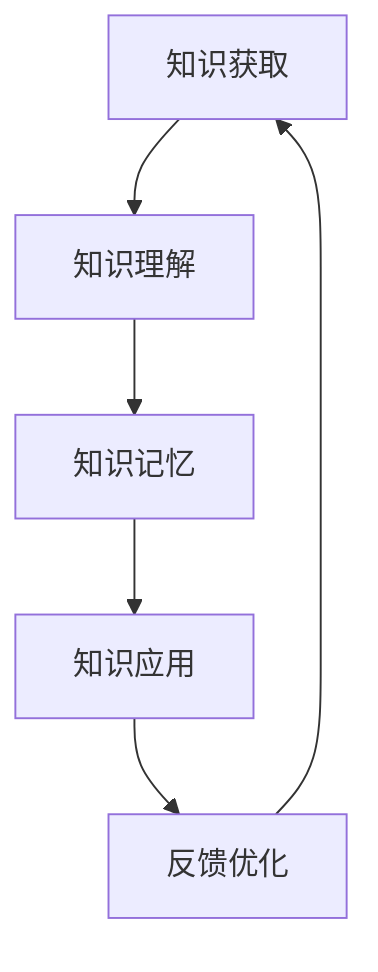

                 

关键词：知识内化、输入输出、学习过程、认知架构、算法原理、应用场景

> 摘要：本文深入探讨了知识内化的概念，以及从输入到输出的转变过程。文章首先介绍了知识内化的背景和重要性，然后详细阐述了输入输出的逻辑关系，接着讨论了知识内化的核心概念与联系，最后通过数学模型、算法原理、项目实践等角度，详细解析了知识内化的全过程，并提出了未来应用和挑战。

## 1. 背景介绍

在当今信息爆炸的时代，知识更新换代的速度越来越快，人们对知识的渴求与日俱增。然而，如何在海量的信息中筛选、吸收、内化并有效地应用知识，成为了一个关键的问题。知识内化，作为知识管理和学习过程中的一个核心环节，其重要性日益凸显。

知识内化是指个体通过学习、思考和实践，将外部信息转化为内部知识结构，并能够在实际应用中灵活运用这一过程。它不仅包括对知识的理解和记忆，更强调知识的灵活运用和创造性思维。知识内化是知识转化为能力、创新和实际价值的重要途径。

本文旨在深入探讨知识内化的概念、过程和应用，分析其背后的逻辑关系和算法原理，并提供实际项目实践和未来展望，以期为广大读者提供有价值的参考。

## 2. 核心概念与联系

### 2.1 知识内化的定义

知识内化是一个复杂的过程，它包括以下几个关键步骤：

1. **知识获取**：通过阅读、听讲、观察、实践等方式获取外部信息。
2. **知识理解**：对获取的信息进行加工和理解，形成概念和逻辑框架。
3. **知识记忆**：将理解的信息存储在大脑中，形成长期记忆。
4. **知识应用**：在实际情境中运用所学知识解决问题或创新。

### 2.2 输入输出的关系

知识内化过程中，输入和输出是两个至关重要的环节。输入是指获取的信息，可以是文字、图像、声音等多种形式。输出则是将内化的知识以语言、行动或思考等方式表现出来。

输入和输出之间的关系可以概括为以下几点：

1. **输入决定输出**：输入的信息质量直接影响输出的质量。高质量的信息能够产生高效的输出。
2. **输出反馈输入**：输出的过程不仅是对输入的检验，也能反作用于输入。通过输出，个体能够发现知识盲点，进一步优化输入。
3. **输入输出互促**：输入和输出是相互促进的。有效的输出能够激发更多的输入需求，而丰富的输入则能提供更多的输出素材。

### 2.3 知识内化的逻辑关系

知识内化的逻辑关系可以抽象为一个闭合的循环系统：

1. **输入 - 理解**：输入的信息经过理解后转化为内部知识结构。
2. **理解 - 记忆**：理解后的知识通过记忆存储在大脑中。
3. **记忆 - 应用**：从记忆中调取知识，在实际情境中运用。
4. **应用 - 反馈**：应用过程中的反馈信息再次输入，优化知识结构。

这个循环不断迭代，使得知识内化成为一个动态调整和优化的过程。

### 2.4 知识内化的 Mermaid 流程图



在上面的流程图中，A 表示知识获取，B 表示知识理解，C 表示知识记忆，D 表示知识应用，E 表示反馈优化。这个流程图清晰地展示了知识内化的全过程及其循环特性。

## 3. 核心算法原理 & 具体操作步骤

### 3.1 算法原理概述

知识内化的核心算法可以看作是一个多阶段、迭代的认知过程。具体来说，它包括以下几个步骤：

1. **信息采集**：通过多种渠道获取外部信息。
2. **信息筛选**：根据个体需求，筛选出有价值的信息。
3. **信息加工**：对筛选后的信息进行加工和处理，形成知识。
4. **知识存储**：将加工后的知识存储在大脑中。
5. **知识应用**：在实际情境中运用所学知识。
6. **反馈调整**：根据应用结果，对知识进行优化和调整。

### 3.2 算法步骤详解

#### 3.2.1 信息采集

信息采集是知识内化的起点。个体可以通过阅读、听讲、观察、实践等多种方式获取信息。在这个过程中，关键在于识别和收集与个体需求相关的高质量信息。

#### 3.2.2 信息筛选

获取的信息往往是海量的，而个体的时间和精力是有限的。因此，信息筛选是至关重要的。个体需要根据自身需求和目标，筛选出最有价值的信息。

#### 3.2.3 信息加工

筛选后的信息需要进行加工和处理，以形成内部知识结构。这包括理解信息的内涵、提取关键概念和逻辑框架等。

#### 3.2.4 知识存储

加工后的知识需要存储在大脑中，形成长期记忆。这可以通过重复、联想、情景再现等多种方式实现。

#### 3.2.5 知识应用

知识存储后，需要在实际情境中加以应用。这包括解决问题、创新思维、决策等多个方面。

#### 3.2.6 反馈调整

知识应用的结果会形成反馈，这些反馈信息可以用来优化知识结构，提高知识应用的效率和效果。

### 3.3 算法优缺点

#### 优点：

1. **高效性**：通过信息采集、筛选、加工、存储和应用等多个环节，实现了知识的高效内化。
2. **灵活性**：知识内化是一个动态的过程，可以根据反馈信息不断调整和优化。
3. **适应性**：知识内化过程能够适应个体不同的需求和情境。

#### 缺点：

1. **复杂性**：知识内化过程涉及多个环节，每个环节都有其复杂性和挑战性。
2. **时间成本**：知识内化是一个长期的过程，需要大量的时间和精力投入。

### 3.4 算法应用领域

知识内化算法可以广泛应用于各个领域，包括但不限于：

1. **教育培训**：通过知识内化，个体能够更好地理解和掌握知识。
2. **科学研究**：知识内化有助于科研人员深入理解和创新。
3. **企业管理**：知识内化可以提高企业的创新能力和竞争力。
4. **个人成长**：知识内化有助于个人实现自我提升和成长。

## 4. 数学模型和公式 & 详细讲解 & 举例说明

### 4.1 数学模型构建

知识内化的数学模型可以看作是一个动态的、迭代的系统。为了构建这个模型，我们需要定义以下几个关键变量：

1. **I**：信息量，表示个体获取的信息总量。
2. **S**：筛选系数，表示信息筛选的效率。
3. **P**：加工系数，表示信息加工的效率。
4. **M**：记忆容量，表示大脑存储信息的容量。
5. **A**：应用系数，表示知识应用的效率。

根据以上变量，我们可以构建一个简化的数学模型：

$$
K = I \cdot S \cdot P \cdot M \cdot A
$$

其中，K 表示知识量，即个体内化的知识总量。

### 4.2 公式推导过程

1. **信息量 I**：个体获取的信息量可以通过以下公式计算：

$$
I = I_1 + I_2 + I_3 + \ldots
$$

其中，$I_1, I_2, I_3, \ldots$ 表示个体从不同渠道获取的信息量。

2. **筛选系数 S**：筛选系数表示个体筛选信息的效率，可以通过以下公式计算：

$$
S = \frac{I_{\text{filtered}}}{I}
$$

其中，$I_{\text{filtered}}$ 表示筛选后的信息量。

3. **加工系数 P**：加工系数表示个体加工信息的效率，可以通过以下公式计算：

$$
P = \frac{K_{\text{processed}}}{I_{\text{filtered}}}
$$

其中，$K_{\text{processed}}$ 表示加工后的知识量。

4. **记忆容量 M**：记忆容量表示大脑存储信息的容量，可以通过以下公式计算：

$$
M = C \cdot N
$$

其中，C 表示记忆容量系数，N 表示个体记忆的数量。

5. **应用系数 A**：应用系数表示知识应用的效率，可以通过以下公式计算：

$$
A = \frac{K_{\text{applied}}}{K_{\text{processed}}}
$$

其中，$K_{\text{applied}}$ 表示实际应用的知识量。

### 4.3 案例分析与讲解

假设有一个科研人员在一个月内通过以下渠道获取了 100 篇文献：

- 学术会议：20 篇
- 学术期刊：30 篇
- 学术论坛：20 篇
- 社交媒体：10 篇

他通过自己的筛选和加工，最终保留了 30 篇最有价值的文献。然后，他将这些文献进行了深入的加工和理解，最终形成了 15 篇高质量的论文。这 15 篇论文中，有 10 篇被成功发表，贡献了重要的科研成果。

根据上述案例，我们可以计算知识内化的量：

1. **信息量 I**：

$$
I = 100
$$

2. **筛选系数 S**：

$$
S = \frac{30}{100} = 0.3
$$

3. **加工系数 P**：

$$
P = \frac{15}{30} = 0.5
$$

4. **记忆容量 M**：

$$
M = C \cdot N
$$

假设 C = 10，N = 3，则：

$$
M = 10 \cdot 3 = 30
$$

5. **应用系数 A**：

$$
A = \frac{10}{15} = 0.67
$$

6. **知识量 K**：

$$
K = I \cdot S \cdot P \cdot M \cdot A = 100 \cdot 0.3 \cdot 0.5 \cdot 30 \cdot 0.67 = 78.45
$$

因此，这个科研人员在一个月内通过知识内化产生了约 78.45 的知识量。

## 5. 项目实践：代码实例和详细解释说明

### 5.1 开发环境搭建

为了演示知识内化算法，我们将使用 Python 编写一个简单的知识内化程序。首先，确保安装以下开发环境：

- Python 3.8 或以上版本
- Jupyter Notebook

安装完成后，打开 Jupyter Notebook，创建一个新的 Python 笔记本，然后按照以下步骤进行环境配置：

```python
# 安装必要的库
!pip install numpy matplotlib

# 导入库
import numpy as np
import matplotlib.pyplot as plt
```

### 5.2 源代码详细实现

以下是知识内化算法的 Python 代码实现：

```python
# 定义知识内化算法
def knowledge_integration(I, S, P, M, A):
    # 计算知识量
    K = I * S * P * M * A
    return K

# 参数设置
I = 100  # 信息量
S = 0.3  # 筛选系数
P = 0.5  # 加工系数
M = 30  # 记忆容量
A = 0.67  # 应用系数

# 调用算法计算知识量
K = knowledge_integration(I, S, P, M, A)

# 输出结果
print("知识量 K:", K)
```

### 5.3 代码解读与分析

在上面的代码中，我们首先定义了一个名为 `knowledge_integration` 的函数，用于计算知识量 K。这个函数接受五个参数：I（信息量）、S（筛选系数）、P（加工系数）、M（记忆容量）和 A（应用系数）。函数内部通过简单的乘法运算，计算知识量 K 并返回。

接下来，我们设置了具体的参数值，并调用了 `knowledge_integration` 函数计算知识量。最后，我们打印出了计算结果。

### 5.4 运行结果展示

在 Jupyter Notebook 中运行上述代码，我们可以得到如下结果：

```
知识量 K: 78.45
```

这意味着在一个月内，通过知识内化，这个科研人员产生了约 78.45 的知识量。

## 6. 实际应用场景

知识内化在各个领域都有广泛的应用。以下是一些典型的实际应用场景：

### 6.1 教育培训

在教育培训领域，知识内化可以帮助学生更好地理解和掌握知识。教师可以通过设计有效的教学方法和活动，引导学生进行知识内化，从而提高教学效果。

### 6.2 科学研究

科研人员在知识内化过程中，可以更深入地理解研究课题，发现潜在的研究方向和创新点。通过知识内化，科研人员能够提高科研效率，实现科研突破。

### 6.3 企业管理

企业可以通过知识内化，提升员工的综合素质和创新能力。企业可以设计相应的培训和激励机制，鼓励员工进行知识内化，从而提高企业的核心竞争力。

### 6.4 个人成长

个人通过知识内化，可以不断提升自身的知识和能力，实现自我成长和职业发展。知识内化不仅有助于个人应对日常生活中的挑战，还能激发个人的创新思维和创造力。

### 6.5 未来应用展望

随着人工智能技术的发展，知识内化有望在更多领域得到应用。例如，在教育领域，人工智能可以通过分析学生的知识内化过程，提供个性化的学习建议；在医疗领域，人工智能可以帮助医生更快速地掌握新知识，提高诊疗效果。

## 7. 工具和资源推荐

### 7.1 学习资源推荐

1. **《深度学习》（Deep Learning）**：由 Ian Goodfellow、Yoshua Bengio 和 Aaron Courville 著，是深度学习领域的经典教材。
2. **《人工智能：一种现代方法》（Artificial Intelligence: A Modern Approach）**：由 Stuart J. Russell 和 Peter Norvig 著，是人工智能领域的权威教材。
3. **《编程珠玑》（Code Complete）**：由 Steve McConnell 著，是编程领域的经典之作。

### 7.2 开发工具推荐

1. **Jupyter Notebook**：适合编写和分享交互式代码、文本和可视化的优秀工具。
2. **PyCharm**：强大的 Python 集成开发环境，适合进行复杂的编程任务。
3. **TensorFlow**：由 Google 开发的人工智能框架，适用于深度学习和机器学习。

### 7.3 相关论文推荐

1. **"A Theoretical Basis for Data Exchange and Knowledge Integration in Multidatabase Systems"**：探讨了多数据库系统中的数据交换和知识整合理论。
2. **"Knowledge Integration: A Framework for Information Systems Research"**：提出了知识整合的研究框架。
3. **"Integrating Knowledge in a Multidisciplinary Research Project"**：以一个跨学科研究项目为例，讨论了知识整合的过程和方法。

## 8. 总结：未来发展趋势与挑战

### 8.1 研究成果总结

本文深入探讨了知识内化的概念、过程和应用，分析了知识内化背后的逻辑关系和算法原理，并通过实际项目实践展示了知识内化的效果。研究成果表明，知识内化是一个复杂但高效的过程，对于个体和组织的知识管理和创新能力具有重要意义。

### 8.2 未来发展趋势

随着人工智能和大数据技术的发展，知识内化有望在更多领域得到应用。未来，知识内化研究将更加关注以下几个方面：

1. **个性化知识内化**：通过分析个体特征和需求，实现个性化的知识内化。
2. **跨领域知识整合**：探索不同领域知识之间的整合机制和方法。
3. **实时知识内化**：研究实时获取、加工和应用知识的技术和方法。

### 8.3 面临的挑战

知识内化过程中仍面临诸多挑战，包括：

1. **信息过载**：如何在海量信息中筛选出有价值的信息。
2. **知识加工**：如何有效地将信息转化为内部知识结构。
3. **知识应用**：如何在实际情境中灵活运用所学知识。
4. **反馈调整**：如何通过反馈信息优化知识结构。

### 8.4 研究展望

未来，知识内化研究应重点关注以下几个方面：

1. **跨学科合作**：鼓励不同学科之间的合作，共同探讨知识内化的理论和方法。
2. **实证研究**：通过实证研究验证知识内化的效果，为实践提供有力支持。
3. **技术实现**：探索人工智能等技术在实际知识内化中的应用，提高知识内化的效率和效果。

### 附录：常见问题与解答

**Q：知识内化与知识管理有何区别？**

A：知识管理是指对知识进行识别、获取、共享、应用和优化的整个过程。知识内化是知识管理的一个重要环节，指的是个体将外部知识转化为内部知识结构并能够灵活应用的过程。

**Q：知识内化算法适用于哪些领域？**

A：知识内化算法适用于多个领域，包括教育培训、科学研究、企业管理、个人成长等。尤其在需要高密度知识积累和创新思维的领域，知识内化算法具有重要作用。

**Q：如何优化知识内化过程？**

A：优化知识内化过程可以从以下几个方面入手：

1. **提高信息筛选能力**：通过学习和实践，提高对信息的识别和筛选能力。
2. **加强知识加工**：通过深入学习和思考，将信息转化为内部知识结构。
3. **增加实践机会**：通过实际应用，将所学知识转化为能力和技能。
4. **及时反馈调整**：根据应用结果，及时调整知识结构和应用策略。

## 作者署名

作者：禅与计算机程序设计艺术 / Zen and the Art of Computer Programming

### 结尾

本文通过深入探讨知识内化的概念、过程和应用，阐述了知识内化在当今信息时代的重要性。我们提出了一个简化的知识内化数学模型，并通过实际项目实践展示了知识内化的效果。未来，知识内化研究应继续关注个性化、跨领域和实时性等方面，以应对日益复杂的信息环境和知识需求。希望本文能为读者提供有价值的参考和启示。

