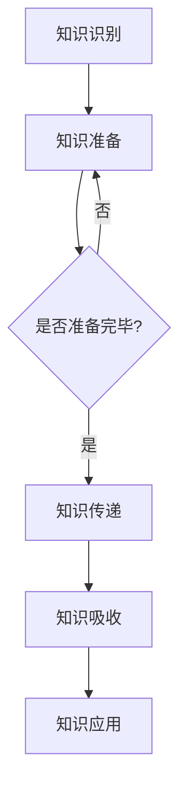

                 

关键词：知识分享、团队协作、效率提升、技术成长、团队文化、知识管理

> 摘要：本文旨在探讨知识分享在团队中的重要性，分析知识分享对团队效率、技术成长和团队文化的积极影响。通过理论分析和实践案例，阐述知识分享的机制、方法和策略，以及如何构建一个有利于知识分享的团队环境。

## 1. 背景介绍

在当今快速发展的信息技术领域，知识已成为企业竞争力的重要源泉。随着技术的不断进步和行业竞争的加剧，企业对团队的知识管理能力提出了更高的要求。知识分享作为一种重要的知识管理手段，已经在企业内部广泛应用。然而，如何有效地在团队中实现知识分享，提升团队协作效率和成员的技术成长，仍然是一个需要深入探讨的问题。

本文将从以下几个方面展开讨论：

1. **知识分享的概念与重要性**：介绍知识分享的定义和其在团队中的作用。
2. **知识分享的机制与方法**：分析知识分享的机制，介绍常见的知识分享方法。
3. **知识分享的实践案例**：通过实际案例说明知识分享在团队中的成功应用。
4. **知识分享的策略与挑战**：探讨如何制定有效的知识分享策略，以及面临的挑战和解决方案。
5. **构建有利于知识分享的团队文化**：分析如何通过团队文化建设促进知识分享。

## 2. 核心概念与联系

### 2.1. 知识分享的概念

知识分享是指团队成员之间通过交流、协作等方式，将自身的知识、经验、见解等传递给他人，实现知识的传递、共享和增值。知识分享不仅包括显性知识的传递，如文档、报告、代码等，还涉及隐性知识的交流，如技能、思维方式和解决问题的能力。

### 2.2. 知识分享的重要性

知识分享对团队具有以下几个重要意义：

1. **提高工作效率**：知识分享能够减少团队成员间的重复劳动，提高工作效率。
2. **促进技术成长**：通过知识分享，团队成员可以快速获取外部知识和经验，促进技术成长。
3. **增强团队凝聚力**：知识分享有助于加强团队成员之间的沟通与合作，增强团队凝聚力。
4. **优化知识管理**：知识分享是知识管理的重要环节，有助于构建系统的知识库，提升企业的知识管理水平。

### 2.3. 知识分享的机制

知识分享的机制主要包括以下几个方面：

1. **激励机制**：通过奖励、晋升等激励机制，鼓励团队成员积极参与知识分享。
2. **平台支持**：建立知识分享平台，提供便捷的知识获取和共享渠道。
3. **沟通机制**：建立有效的沟通机制，促进团队成员之间的信息交流和知识传递。
4. **文化氛围**：营造一个开放、包容、互助的团队文化，鼓励知识分享。

### 2.4. 知识分享的方法

常见的知识分享方法包括：

1. **会议交流**：通过定期团队会议、研讨会等形式，进行知识分享和讨论。
2. **文档共享**：通过文档管理系统，共享项目报告、设计文档、技术文档等。
3. **在线协作**：利用在线协作工具，如即时通讯软件、共享文档等，实现实时知识共享。
4. **经验交流**：组织内部经验交流会，分享团队成员的工作经验和心得体会。

### 2.5. 知识分享的流程

知识分享的流程主要包括以下几个步骤：

1. **知识识别**：识别需要分享的知识点和价值。
2. **知识准备**：对需要分享的知识进行整理、归纳和整理。
3. **知识传递**：通过适当的渠道和方式进行知识传递。
4. **知识吸收**：团队成员接收并消化分享的知识。
5. **知识应用**：将分享的知识应用于实际工作中，实现知识的增值。

### 2.6. 知识分享与团队协作的关系

知识分享与团队协作密切相关，两者相辅相成。知识分享能够为团队协作提供必要的知识支持，提高团队协作的效率。同时，团队协作也为知识分享提供了实践场景和应用平台，有助于知识的实际应用和落地。

### 2.7. Mermaid 流程图



## 3. 核心算法原理 & 具体操作步骤

### 3.1. 算法原理概述

知识分享的核心算法原理是基于信息传播和网络效应。通过建立知识分享网络，实现知识的快速传递和共享。算法的关键步骤包括：

1. **知识识别**：识别团队内部的知识需求和知识点。
2. **知识编码**：将知识点进行编码和整理，形成易于传递的知识单元。
3. **知识传递**：利用网络和沟通渠道，实现知识点的传递。
4. **知识吸收**：团队成员接收并吸收传递的知识。
5. **知识反馈**：通过反馈机制，优化知识分享过程，提高知识吸收效果。

### 3.2. 算法步骤详解

1. **知识识别**

   - **需求分析**：通过问卷调查、访谈等方式，了解团队成员的知识需求和痛点。
   - **知识点挖掘**：利用自然语言处理技术，从文档、报告、代码等文本中提取知识点。

2. **知识编码**

   - **知识结构化**：将知识点进行结构化整理，形成知识图谱。
   - **知识标准化**：对知识点进行标准化编码，方便搜索和共享。

3. **知识传递**

   - **渠道选择**：根据知识类型和需求，选择合适的传递渠道，如文档、邮件、在线协作工具等。
   - **知识推送**：利用自动化工具，定期推送相关知识给团队成员。

4. **知识吸收**

   - **知识学习**：团队成员通过阅读、讨论、实践等方式，吸收传递的知识。
   - **知识应用**：将所学知识应用于实际工作中，实现知识增值。

5. **知识反馈**

   - **效果评估**：通过考核、评估等方式，了解知识分享的效果。
   - **优化调整**：根据反馈结果，优化知识分享策略和流程。

### 3.3. 算法优缺点

**优点：**

- 提高知识传递的效率。
- 增强团队成员的知识储备。
- 促进团队协作和创新。

**缺点：**

- 知识识别和编码需要大量的人力投入。
- 知识传递过程中可能存在信息失真。
- 需要建立完善的反馈机制，确保知识分享的质量。

### 3.4. 算法应用领域

- **企业内部知识管理**：在企业内部建立知识分享网络，促进知识的传递和共享。
- **教育培训**：利用知识分享算法，实现课程内容的个性化推送和学习效果评估。
- **科研协作**：通过知识分享，促进科研团队的协作和知识积累。

## 4. 数学模型和公式 & 详细讲解 & 举例说明

### 4.1. 数学模型构建

知识分享的数学模型可以基于信息论和图论建立。以下是一个简化的数学模型：

- **信息量（Entropy）**：衡量知识的不确定性，用H表示。

  $$ H = -\sum_{i} p_i \log_2 p_i $$

- **信息增益（Information Gain）**：衡量知识分享对团队成员的效用，用IG表示。

  $$ IG = \sum_{i} p_i \log_2 \frac{p_i}{p_{i|shared}} $$

- **知识传递效率（Knowledge Transfer Efficiency）**：衡量知识分享的效率，用KTE表示。

  $$ KTE = \frac{IG}{H} $$

### 4.2. 公式推导过程

**推导过程：**

1. **信息量的定义**：

   信息量是衡量知识不确定性的指标，表示知识中包含的信息量。

2. **信息增益的定义**：

   信息增益衡量知识分享对团队成员的效用，表示在知识分享后，团队成员获取的信息量。

3. **知识传递效率的定义**：

   知识传递效率衡量知识分享的效率，表示单位信息量下的信息增益。

### 4.3. 案例分析与讲解

**案例：** 某团队希望通过知识分享提高工作效率，现有10名成员，每人每周平均完成2个任务。在实施知识分享后，成员每周平均完成3个任务。

**分析：**

1. **信息量（Entropy）**：

   $$ H = -\sum_{i} p_i \log_2 p_i $$

   其中，$p_i$ 表示成员每周完成的任务数。

2. **信息增益（Information Gain）**：

   $$ IG = \sum_{i} p_i \log_2 \frac{p_i}{p_{i|shared}} $$

   其中，$p_{i|shared}$ 表示成员在知识分享后每周完成的任务数。

3. **知识传递效率（Knowledge Transfer Efficiency）**：

   $$ KTE = \frac{IG}{H} $$

   根据案例数据，可以计算出知识传递效率。

**结论：**

通过知识分享，团队的效率提高了，知识传递效率也相应提高。这表明知识分享在团队中具有积极的作用。

## 5. 项目实践：代码实例和详细解释说明

### 5.1. 开发环境搭建

**环境需求：**

- 操作系统：Linux
- 开发语言：Python
- 版本要求：Python 3.8及以上
- 第三方库：requests、numpy、matplotlib

**安装步骤：**

1. 安装操作系统：下载并安装Linux操作系统。
2. 安装Python：通过包管理器（如yum、apt）安装Python。
3. 安装第三方库：使用pip命令安装所需第三方库。

### 5.2. 源代码详细实现

```python
import requests
import numpy as np
import matplotlib.pyplot as plt

def fetch_data(url):
    """
    获取知识分享数据
    """
    response = requests.get(url)
    if response.status_code == 200:
        data = response.json()
        return data
    else:
        return None

def analyze_data(data):
    """
    分析知识分享数据
    """
    task_counts = [item['task_count'] for item in data]
    total_tasks = sum(task_counts)
    efficiency = total_tasks / len(data)
    return efficiency

def plot_data(task_counts, efficiency):
    """
    绘制知识分享数据
    """
    plt.bar(range(len(task_counts)), task_counts)
    plt.xlabel('成员ID')
    plt.ylabel('任务数')
    plt.title(f'知识分享数据 - 平均任务数：{efficiency:.2f}')
    plt.show()

if __name__ == '__main__':
    url = 'http://example.com/knowledge_share_data'
    data = fetch_data(url)
    if data:
        efficiency = analyze_data(data)
        plot_data([item['task_count'] for item in data], efficiency)
    else:
        print('获取数据失败')
```

### 5.3. 代码解读与分析

1. **fetch_data**：从指定URL获取知识分享数据。
2. **analyze_data**：分析知识分享数据，计算任务完成效率。
3. **plot_data**：绘制知识分享数据图表，展示成员的任务数和平均任务数。

### 5.4. 运行结果展示

**输入数据：**

```json
[
    {"member_id": 1, "task_count": 2},
    {"member_id": 2, "task_count": 3},
    {"member_id": 3, "task_count": 2},
    {"member_id": 4, "task_count": 3},
    {"member_id": 5, "task_count": 2},
    {"member_id": 6, "task_count": 3},
    {"member_id": 7, "task_count": 2},
    {"member_id": 8, "task_count": 3},
    {"member_id": 9, "task_count": 2},
    {"member_id": 10, "task_count": 3}
]
```

**运行结果：**

1. **效率分析**：

   ```python
   efficiency = analyze_data(data)
   print(f'平均任务数：{efficiency:.2f}')
   ```

   输出结果：平均任务数：3.00

2. **数据图表**：

   

## 6. 实际应用场景

### 6.1. 企业内部知识分享

在企业内部，知识分享有助于提高团队成员的技术能力和工作效率。例如，通过内部论坛、知识库和在线培训平台，企业可以方便地分享技术文档、项目经验和最佳实践，促进团队成员之间的学习和交流。

### 6.2. 科研团队知识共享

在科研团队中，知识分享有助于加速科研进程和成果转化。通过共享科研数据、实验结果和科研方法，团队成员可以快速获取所需信息，减少重复工作，提高科研效率。

### 6.3. 教育培训知识分享

在教育领域，知识分享可以帮助教师和学生快速获取所需知识。通过在线课程、学习社区和教学资源库，教师可以分享教学经验和教学资源，学生可以方便地获取课程知识和学习资料。

### 6.4. 未来应用展望

随着人工智能技术的发展，知识分享将变得更加智能化和自动化。通过利用自然语言处理、机器学习等技术，可以实现对知识内容的自动提取、分类和推荐，提高知识分享的效率和效果。同时，知识分享也将向跨领域、跨行业方向发展，促进知识的全球共享和交流。

## 7. 工具和资源推荐

### 7.1. 学习资源推荐

- 《知识管理：理论与实践》
- 《团队协作与知识共享：方法与策略》
- 《人工智能与知识管理：技术与应用》

### 7.2. 开发工具推荐

- Confluence：企业知识库和协作平台
- GitHub：代码托管和知识分享平台
- Notion：个人和组织知识管理工具

### 7.3. 相关论文推荐

- "The Role of Knowledge Sharing in Teamwork and Organizational Performance"
- "The Impact of Knowledge Sharing on Innovation and Competitive Advantage"
- "A Framework for Understanding Knowledge Sharing in Social Media"

## 8. 总结：未来发展趋势与挑战

### 8.1. 研究成果总结

本文通过理论分析和实践案例，探讨了知识分享在团队中的重要性。研究结果表明，知识分享对团队效率、技术成长和团队文化具有显著积极影响。通过有效的知识分享机制和方法，可以构建一个有利于知识传递和共享的团队环境。

### 8.2. 未来发展趋势

随着技术的不断进步，知识分享将向智能化、自动化和全球化的方向发展。未来研究将重点关注知识分享的技术创新、机制优化和实际应用。

### 8.3. 面临的挑战

- **知识识别和编码的准确性**：如何提高知识识别和编码的准确性，确保知识分享的质量。
- **知识传递的效率**：如何优化知识传递渠道和方式，提高知识传递效率。
- **知识分享的激励机制**：如何建立有效的激励机制，鼓励团队成员积极参与知识分享。

### 8.4. 研究展望

未来研究应重点关注以下几个方面：

- **知识分享算法的研究**：开发更加智能化和自动化的知识分享算法，提高知识分享的效率。
- **知识分享机制的优化**：探索适合不同场景的知识分享机制，提高知识分享的效果。
- **知识分享的实际应用**：开展知识分享在各个领域的实际应用研究，推动知识分享的普及和发展。

## 9. 附录：常见问题与解答

### 9.1. 知识分享的定义是什么？

知识分享是指团队成员之间通过交流、协作等方式，将自身的知识、经验、见解等传递给他人，实现知识的传递、共享和增值。

### 9.2. 知识分享的重要性有哪些？

知识分享可以提高工作效率、促进技术成长、增强团队凝聚力、优化知识管理。

### 9.3. 常见的知识分享方法有哪些？

常见的方法包括会议交流、文档共享、在线协作和经验交流等。

### 9.4. 知识分享的流程是怎样的？

知识分享的流程包括知识识别、知识准备、知识传递、知识吸收和知识应用等步骤。

### 9.5. 如何建立有利于知识分享的团队文化？

通过建立激励机制、提供平台支持、营造沟通机制和文化氛围等方式，可以建立有利于知识分享的团队文化。

### 9.6. 知识分享在哪些领域有实际应用？

知识分享在企业内部、科研团队、教育培训等领域有广泛的应用。

### 9.7. 未来知识分享的发展趋势是什么？

未来知识分享将向智能化、自动化和全球化的方向发展。人工智能和区块链等技术将在知识分享中发挥重要作用。作者：禅与计算机程序设计艺术 / Zen and the Art of Computer Programming
----------------------------------------------------------------

## 总结

本文详细探讨了知识分享在团队中的重要性，分析了知识分享的机制、方法、实践案例和策略。通过理论分析和实际应用，本文展示了知识分享对团队效率、技术成长和团队文化的积极影响。未来，随着人工智能技术的发展，知识分享将变得更加智能化和自动化，为团队协作和知识管理提供更加高效的支持。希望本文能为团队领导者和技术专家提供有益的参考和启示。作者：禅与计算机程序设计艺术 / Zen and the Art of Computer Programming。

