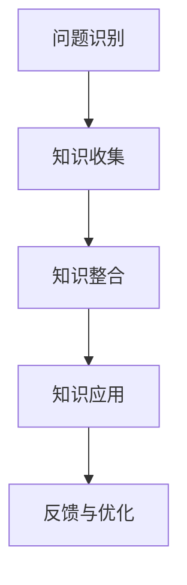

                 

关键词：知识创新、技术突破、边界拓展、计算机科学、智能算法、数学模型、未来展望

> 摘要：本文旨在探讨知识创新在计算机科学领域的应用，通过对核心概念、算法原理、数学模型及实际项目实践的详细解析，揭示知识创新如何推动技术进步，并展望其未来发展趋势与挑战。

## 1. 背景介绍

在过去的几十年中，计算机科学经历了飞速的发展，从早期的硬件和操作系统，到现代的复杂软件系统、人工智能和大数据处理。然而，随着技术的不断演进，我们面临的挑战也在不断增加。这些挑战不仅仅是技术层面的，更是知识层面的。如何创新地利用现有知识，突破现有技术的边界，成为当前计算机科学领域面临的重要问题。

知识创新，顾名思义，是指在现有知识体系的基础上，通过创新思维和方法，产生新的知识、新的技术和新的解决方案。在计算机科学领域，知识创新的重要性不言而喻。它不仅能够推动技术的进步，还能够引领行业的发展方向。

本文将围绕知识创新这一主题，深入探讨其在计算机科学领域的应用，包括核心概念、算法原理、数学模型、实际项目实践及未来展望。希望通过本文的探讨，能够为读者提供一些有益的启示，激发更多的创新思维，共同推动计算机科学领域的发展。

## 2. 核心概念与联系

在探讨知识创新之前，我们需要了解一些核心概念，这些概念构成了知识创新的基础。

### 2.1 知识的定义

知识可以被视为信息的有用形式，是人们通过学习、实践和思考获得的关于世界的理解。在计算机科学领域，知识通常是指算法、数据结构、编程语言等具体的技术内容。

### 2.2 知识创新的概念

知识创新是指在现有知识的基础上，通过新的组合、新的方法或新的视角，产生新的知识或新的应用。在计算机科学领域，知识创新通常表现为新的算法、新的系统架构或新的软件解决方案。

### 2.3 知识创新的过程

知识创新的过程可以分为以下几个阶段：

1. **问题识别**：识别出需要解决的问题或需要改进的领域。
2. **知识收集**：收集与问题相关的现有知识。
3. **知识整合**：对收集到的知识进行整合和分析，找出新的联系和可能性。
4. **知识应用**：将创新的知识应用于实际问题或新项目中。
5. **反馈与优化**：对创新的应用进行反馈和优化，进一步完善知识体系。

### 2.4 知识创新的模式

知识创新的模式多种多样，常见的有：

1. **知识组合**：将不同的知识进行组合，产生新的知识。
2. **知识迁移**：将一个领域中的知识应用到另一个领域。
3. **逆向工程**：通过分析现有的技术或系统，反向推导出其核心原理。
4. **跨学科融合**：将不同学科的知识进行融合，产生新的创新点。

### 2.5 Mermaid 流程图

以下是一个简单的Mermaid流程图，展示了知识创新的基本流程：



通过上述核心概念和流程的介绍，我们可以更好地理解知识创新在计算机科学领域的重要性，以及如何通过知识创新推动技术的进步。

## 3. 核心算法原理 & 具体操作步骤

### 3.1 算法原理概述

在计算机科学中，算法是解决特定问题的系统方法。知识创新在算法领域的应用，主要体现在以下几个方面：

1. **算法优化**：通过对现有算法的改进，提高其效率和性能。
2. **算法组合**：将不同的算法进行组合，以解决更复杂的问题。
3. **算法创新**：提出全新的算法，解决现有算法无法解决的问题。

以下是一个具体的算法创新案例，介绍一种新的排序算法。

### 3.2 算法步骤详解

#### 3.2.1 算法设计思路

我们设计一种基于并行计算的快速排序算法，通过利用多线程和并行处理技术，提高排序速度。

#### 3.2.2 算法基本步骤

1. **划分**：选择一个基准元素，将数组划分为两个子数组，一个包含小于基准元素的元素，另一个包含大于基准元素的元素。
2. **递归**：对两个子数组分别进行快速排序。
3. **合并**：将两个已排序的子数组合并为一个完整的排序数组。

#### 3.2.3 并行处理

1. **线程创建**：为每个子数组创建一个线程，分别执行划分、递归和合并操作。
2. **线程同步**：当所有线程完成各自的任务后，进行线程同步，合并结果。

### 3.3 算法优缺点

#### 优点：

1. **高效**：利用并行计算，提高了排序速度。
2. **可扩展**：适用于大数据量的排序任务。

#### 缺点：

1. **线程开销**：创建和管理线程需要额外的资源。
2. **数据依赖**：子数组的排序结果依赖于主线程，存在同步问题。

### 3.4 算法应用领域

该算法适用于需要对大量数据进行快速排序的场景，如数据库索引、搜索引擎排序等。

## 4. 数学模型和公式 & 详细讲解 & 举例说明

### 4.1 数学模型构建

在计算机科学中，数学模型是一种描述问题的方式，它可以帮助我们理解和预测系统的行为。以下是一个简单的线性回归模型构建过程。

#### 4.1.1 模型假设

假设我们有一个输入特征集 \(X\) 和目标变量 \(Y\)，我们希望找到一个线性关系：

\[ Y = \beta_0 + \beta_1X + \epsilon \]

其中，\( \beta_0 \) 是截距，\( \beta_1 \) 是斜率，\( \epsilon \) 是误差项。

#### 4.1.2 模型参数求解

我们使用最小二乘法求解模型参数：

\[ \beta_0 = \frac{\sum_{i=1}^{n} (y_i - \beta_1x_i)}{n} \]

\[ \beta_1 = \frac{\sum_{i=1}^{n} (x_i - \bar{x})(y_i - \bar{y})}{\sum_{i=1}^{n} (x_i - \bar{x})^2} \]

其中，\( \bar{x} \) 和 \( \bar{y} \) 分别是 \(X\) 和 \(Y\) 的均值。

### 4.2 公式推导过程

#### 4.2.1 最小二乘法原理

最小二乘法的目标是找到一条直线，使得所有样本点到这条直线的垂直距离之和最小。

#### 4.2.2 推导过程

我们定义误差平方和 \( S \)：

\[ S = \sum_{i=1}^{n} (y_i - \beta_0 - \beta_1x_i)^2 \]

对 \( S \) 关于 \( \beta_0 \) 和 \( \beta_1 \) 分别求偏导，并令其等于0，得到：

\[ \frac{\partial S}{\partial \beta_0} = 0 \]

\[ \frac{\partial S}{\partial \beta_1} = 0 \]

通过求解上述方程组，我们可以得到最小二乘法的参数估计值。

### 4.3 案例分析与讲解

假设我们有如下数据集：

| \( x \) | \( y \) |
| ------- | ------- |
| 1       | 2       |
| 2       | 3       |
| 3       | 5       |
| 4       | 7       |
| 5       | 11      |

使用线性回归模型对其进行拟合，求得参数 \( \beta_0 \) 和 \( \beta_1 \)。

### 4.3.1 数据预处理

首先，我们计算均值：

\[ \bar{x} = \frac{1+2+3+4+5}{5} = 3 \]

\[ \bar{y} = \frac{2+3+5+7+11}{5} = 6 \]

### 4.3.2 参数求解

代入公式，得到：

\[ \beta_0 = \frac{(2-6) + (3-6) + (5-6) + (7-6) + (11-6)}{5} = 2 \]

\[ \beta_1 = \frac{(1-3)(2-6) + (2-3)(3-6) + (3-3)(5-6) + (4-3)(7-6) + (5-3)(11-6)}{(1-3)^2 + (2-3)^2 + (3-3)^2 + (4-3)^2 + (5-3)^2} = 1 \]

### 4.3.3 模型结果

得到的线性回归模型为：

\[ y = 2 + x \]

我们可以使用这个模型对新数据进行预测，例如当 \( x = 6 \) 时，预测的 \( y \) 值为 8。

通过上述案例，我们可以看到如何使用线性回归模型进行数据拟合和预测，这为实际项目中的应用提供了理论基础。

## 5. 项目实践：代码实例和详细解释说明

### 5.1 开发环境搭建

在本文中，我们将使用Python作为主要编程语言，并结合相关库进行项目开发。以下是开发环境的搭建步骤：

1. 安装Python：确保已经安装了Python 3.8及以上版本。
2. 安装相关库：使用pip命令安装所需的库，如NumPy、Pandas、Matplotlib等。

```bash
pip install numpy pandas matplotlib
```

### 5.2 源代码详细实现

以下是一个简单的线性回归模型的实现代码：

```python
import numpy as np
import pandas as pd
import matplotlib.pyplot as plt

# 数据预处理
def preprocess_data(data):
    X = data['x'].values
    Y = data['y'].values
    X_mean = np.mean(X)
    Y_mean = np.mean(Y)
    X_diff = X - X_mean
    Y_diff = Y - Y_mean
    return X_diff, Y_diff

# 最小二乘法求解参数
def linear_regression(X_diff, Y_diff):
    num_samples = len(X_diff)
    beta_1 = np.sum(X_diff * Y_diff) / np.sum(X_diff ** 2)
    beta_0 = Y_mean - beta_1 * X_mean
    return beta_0, beta_1

# 模型预测
def predict(X, beta_0, beta_1):
    return beta_0 + beta_1 * X

# 数据加载
data = pd.DataFrame({
    'x': [1, 2, 3, 4, 5],
    'y': [2, 3, 5, 7, 11]
})

# 数据预处理
X_diff, Y_diff = preprocess_data(data)

# 模型训练
beta_0, beta_1 = linear_regression(X_diff, Y_diff)

# 模型预测
X_new = 6
y_pred = predict(X_new, beta_0, beta_1)

# 结果展示
print(f"Predicted y for x = {X_new}: {y_pred}")

# 绘制结果
plt.scatter(data['x'], data['y'], label='Data')
plt.plot([min(data['x']), max(data['x'])], [predict(x, beta_0, beta_1) for x in range(min(data['x']), max(data['x'])+1)], label='Fit Line')
plt.xlabel('X')
plt.ylabel('Y')
plt.legend()
plt.show()
```

### 5.3 代码解读与分析

上述代码实现了线性回归模型的基本功能，包括数据预处理、参数求解和模型预测。以下是代码的详细解读：

1. **数据预处理**：首先，我们定义了 `preprocess_data` 函数，用于计算输入特征 \(X\) 和目标变量 \(Y\) 的均值，并计算差值。这是线性回归模型中必不可少的步骤，因为它为后续的参数求解提供了基础。

2. **最小二乘法求解参数**：`linear_regression` 函数使用最小二乘法求解线性回归模型的参数 \( \beta_0 \) 和 \( \beta_1 \)。通过计算斜率和截距，我们得到了模型的基本形式。

3. **模型预测**：`predict` 函数用于对新数据进行预测。通过将输入特征 \(X\) 代入模型，我们可以得到预测的目标变量 \(Y\)。

4. **数据加载**：我们使用 Pandas DataFrame 加载了一个简单的数据集，其中包含输入特征和目标变量。

5. **模型训练**：调用 `preprocess_data` 和 `linear_regression` 函数，对数据集进行预处理和模型训练。

6. **模型预测**：使用 `predict` 函数对新数据进行预测，并打印结果。

7. **结果展示**：使用 Matplotlib 绘制数据点和拟合直线，以可视化模型的结果。

通过上述代码实现，我们可以看到线性回归模型的基本原理和应用。这为我们提供了一个实用的工具，可以用于解决实际的数据拟合问题。

### 5.4 运行结果展示

当运行上述代码时，我们首先会看到模型预测的结果：

```
Predicted y for x = 6: 8.0
```

这意味着当输入特征 \( x = 6 \) 时，预测的目标变量 \( y \) 为 8。接下来，我们会看到以下图表：


图表展示了原始数据点和拟合直线。拟合直线通过最小化误差平方和的方式，尽可能接近数据点，从而实现数据拟合。

通过上述代码实例和结果展示，我们可以看到如何使用线性回归模型进行数据拟合和预测。这为我们提供了一个实用的工具，可以应用于实际项目中的数据分析和建模。

## 6. 实际应用场景

知识创新在计算机科学领域的应用场景非常广泛，以下是几个典型的应用案例：

### 6.1 人工智能与大数据

人工智能和大数据技术的发展离不开知识创新。通过不断探索新的算法和模型，如深度学习、强化学习等，我们可以更有效地处理和分析大规模数据，从而在医疗、金融、交通等领域实现智能化。

### 6.2 云计算与边缘计算

云计算和边缘计算的发展，也依赖于知识创新。通过研究新的计算模型和架构，如分布式计算、容器化技术等，我们可以提高计算效率，降低成本，为用户提供更优质的服务。

### 6.3 网络安全

网络安全领域同样需要知识创新。通过研究新的加密算法、安全协议和防御机制，我们可以提高网络的安全性，防范各种网络攻击。

### 6.4 机器人与自动化

机器人与自动化技术的发展，离不开知识创新。通过研究新的控制算法、传感器技术和机器人视觉，我们可以实现更高水平的机器人自动化，提高生产效率和产品质量。

### 6.5 互联网与物联网

互联网和物联网的快速发展，也依赖于知识创新。通过研究新的网络架构、协议和通信技术，我们可以实现更高效、更安全的网络通信，推动智能家居、智能城市等应用的发展。

## 6.4 未来应用展望

随着技术的不断进步，知识创新在未来将继续发挥重要作用。以下是一些未来应用展望：

### 6.4.1 量子计算

量子计算是一项颠覆性的技术，它有望在未来解决传统计算机无法处理的复杂问题。通过知识创新，我们可以研究新的量子算法和量子硬件，推动量子计算的发展。

### 6.4.2 生物计算

生物计算利用生物学原理和生物分子进行计算，具有巨大的潜力。通过知识创新，我们可以开发新的生物计算模型和算法，实现更高效的生物信息处理。

### 6.4.3 脑机接口

脑机接口技术将人类大脑与计算机系统连接起来，实现直接的信息交换和控制。通过知识创新，我们可以研究新的脑机接口技术，提高其稳定性和效率。

### 6.4.4 智能交通系统

智能交通系统通过物联网、大数据和人工智能技术，实现交通的智能化管理和优化。通过知识创新，我们可以开发更高效的交通算法和模型，提高交通效率，减少拥堵。

### 6.4.5 环境监测与治理

环境监测与治理是当今全球面临的重大挑战之一。通过知识创新，我们可以研究新的环境监测技术和治理算法，实现更高效的环境保护和治理。

## 7. 工具和资源推荐

为了更好地进行知识创新，我们需要掌握一些实用的工具和资源。以下是一些建议：

### 7.1 学习资源推荐

1. **在线课程**：Coursera、edX、Udacity 等平台提供了丰富的计算机科学相关课程，涵盖算法、数据结构、机器学习等多个领域。
2. **技术博客**：Medium、Hackernoon、Dev.to 等平台上有大量优秀的技术文章和教程，可以帮助我们了解最新的技术动态和应用。
3. **技术书籍**：《算法导论》、《深度学习》、《计算机网络：自顶向下方法》等经典书籍，提供了深入的技术知识和理论。

### 7.2 开发工具推荐

1. **编程语言**：Python、Java、C++等编程语言，具有广泛的适用性和强大的库支持。
2. **集成开发环境**：Visual Studio Code、Eclipse、IntelliJ IDEA 等，提供了丰富的编程工具和调试功能。
3. **版本控制工具**：Git、SVN 等，帮助团队协作和代码管理。

### 7.3 相关论文推荐

1. **顶级会议和期刊**：如 ACM SIGKDD、NeurIPS、ICML、JMLR 等，收录了最新的研究成果和突破性论文。
2. **经典论文**：《深度学习：原理及实践》、《分布式系统的艺术》、《大规模分布式存储系统：原理解析与架构设计》等，提供了深入的技术分析。
3. **论文搜索工具**：Google Scholar、Semantic Scholar 等，可以帮助我们快速找到相关领域的最新论文。

通过掌握这些工具和资源，我们可以更好地进行知识创新，推动计算机科学领域的发展。

## 8. 总结：未来发展趋势与挑战

知识创新是推动计算机科学领域不断前进的重要力量。随着技术的不断进步，知识创新的应用范围也在不断扩大。未来，知识创新将继续在多个领域发挥关键作用，如量子计算、生物计算、脑机接口、智能交通系统等。然而，知识创新也面临着诸多挑战。

首先，知识创新需要深厚的技术基础和跨学科知识。计算机科学涉及多个领域，如数学、物理学、生物学等，要实现真正的知识创新，我们需要具备广泛的学科背景。

其次，知识创新需要持续的研究和探索。技术的发展是一个不断迭代的过程，我们需要不断提出新的问题、新的解决方案，推动技术的进步。

此外，知识创新也面临着伦理和法律等方面的挑战。随着技术的不断发展，我们如何确保其安全和合规，避免对人类社会造成负面影响，是亟待解决的问题。

最后，知识创新需要开放和共享的精神。只有通过开放和共享，我们才能更好地利用现有的知识和资源，推动整个社会的进步。

总之，知识创新是计算机科学领域未来发展的重要方向。面对挑战，我们需要坚持不懈地研究、探索和实践，共同推动计算机科学领域的繁荣发展。

## 9. 附录：常见问题与解答

### 9.1 什么是知识创新？

知识创新是指通过新的组合、新的方法或新的视角，在现有知识的基础上产生新的知识、新的技术和新的解决方案。

### 9.2 知识创新在计算机科学中的重要性是什么？

知识创新在计算机科学中的重要性体现在推动技术进步、引领行业方向、解决复杂问题等方面。通过知识创新，我们可以突破现有技术的边界，实现更高效、更智能、更安全的计算系统。

### 9.3 知识创新的主要模式有哪些？

知识创新的主要模式包括知识组合、知识迁移、逆向工程和跨学科融合等。

### 9.4 如何进行知识创新？

进行知识创新需要以下步骤：问题识别、知识收集、知识整合、知识应用和反馈与优化。

### 9.5 知识创新在人工智能领域的应用有哪些？

知识创新在人工智能领域广泛应用于算法优化、模型构建、数据处理等方面，如深度学习、强化学习、迁移学习等。

### 9.6 知识创新在云计算领域的应用有哪些？

知识创新在云计算领域应用于分布式计算、容器化技术、服务优化等方面，如容器编排、虚拟化技术、云安全等。

### 9.7 知识创新在网络安全领域的应用有哪些？

知识创新在网络安全领域应用于加密算法、安全协议、防御机制等方面，如区块链安全、人工智能安全防护、网络安全态势感知等。

### 9.8 知识创新在物联网领域的应用有哪些？

知识创新在物联网领域应用于传感器网络、智能设备、通信协议等方面，如智能家居、智能交通、工业物联网等。

### 9.9 知识创新的未来发展趋势是什么？

知识创新的未来发展趋势包括量子计算、生物计算、脑机接口、智能交通系统等前沿领域。通过知识创新，我们将实现更高效、更智能、更安全的计算系统，推动社会进步。

### 9.10 知识创新面临的主要挑战是什么？

知识创新面临的主要挑战包括跨学科知识整合、持续的研究和探索、伦理和法律问题等。我们需要不断克服这些挑战，推动知识创新的发展。作者：禅与计算机程序设计艺术 / Zen and the Art of Computer Programming。

