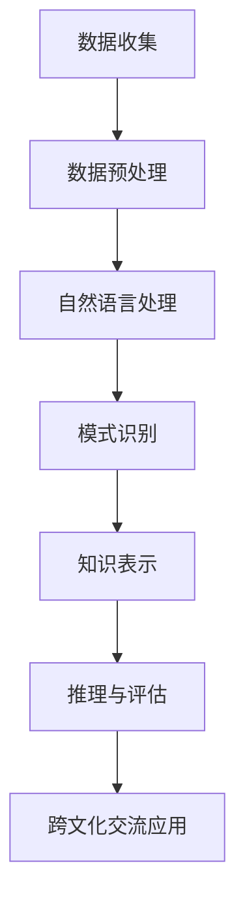
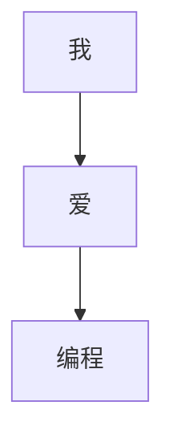

                 

关键词：知识发现引擎，跨文化交流，自然语言处理，信息提取，人工智能，机器学习，知识图谱，数据分析，技术融合，社会效益。

> 摘要：本文旨在探讨知识发现引擎在促进跨文化交流中的作用。通过深入分析知识发现引擎的核心概念、算法原理及其在跨文化交流中的应用，本文揭示了知识发现引擎如何通过信息提取、自然语言处理和知识图谱等技术手段，有效克服语言障碍，增强不同文化背景人群之间的理解和沟通，从而推动全球文化的交流和融合。

## 1. 背景介绍

在全球化进程不断加速的今天，跨文化交流已经变得日益频繁和重要。然而，不同语言、文化背景和价值观的冲突和误解依然存在，严重阻碍了国际间的沟通与合作。为了解决这一问题，人工智能技术，尤其是知识发现引擎，被寄予了厚望。

知识发现引擎是一种基于人工智能和大数据技术的智能系统，它能够自动地从大量数据中提取出有价值的信息和知识。这一技术的核心在于其强大的信息处理能力和对自然语言的理解能力，使得知识发现引擎在跨文化交流中能够发挥出独特的优势。

本文将首先介绍知识发现引擎的基本概念和工作原理，然后分析其在跨文化交流中的应用场景和实际效果，最后探讨其未来发展潜力和面临的挑战。

## 2. 核心概念与联系

### 2.1 知识发现引擎的概念

知识发现引擎（Knowledge Discovery Engine，简称KDE）是一种能够自动从大量数据中提取有用信息和知识的智能系统。其核心目标是实现数据到信息的转化，从而为决策提供有力支持。知识发现引擎通常包括数据预处理、模式识别、知识表示、推理和评估等几个关键环节。

### 2.2 知识发现引擎的工作原理

知识发现引擎的工作原理可以分为以下几个步骤：

1. **数据预处理**：对原始数据进行清洗、转换和集成，使其符合分析需求。

2. **模式识别**：利用机器学习和数据挖掘算法，从预处理后的数据中提取出潜在的规律和模式。

3. **知识表示**：将提取出的模式和规律转化为可理解和存储的知识形式，如知识图谱、本体论等。

4. **推理与评估**：利用推理算法对知识进行扩展和验证，评估其有效性和可靠性。

### 2.3 与跨文化交流的联系

知识发现引擎与跨文化交流之间的联系主要体现在以下几个方面：

1. **自然语言处理**：知识发现引擎能够处理和理解不同语言的文本数据，从而实现跨语言的信息提取和理解。

2. **知识图谱**：通过构建知识图谱，知识发现引擎能够将不同语言和文化背景的知识进行整合和映射，从而消除语言和文化障碍。

3. **数据分析**：知识发现引擎能够对跨文化交流中的大量数据进行分析，揭示出文化差异和共同点，为跨文化沟通提供科学依据。

### 2.4 Mermaid 流程图

以下是知识发现引擎在跨文化交流中的应用流程图：



## 3. 核心算法原理 & 具体操作步骤

### 3.1 算法原理概述

知识发现引擎的核心算法主要包括自然语言处理、模式识别、知识图谱构建和推理评估等。下面将分别介绍这些算法的基本原理：

1. **自然语言处理**：自然语言处理（Natural Language Processing，NLP）是人工智能领域的一个分支，旨在使计算机能够理解、解释和生成人类语言。NLP的核心算法包括词性标注、句法分析、语义分析和文本分类等。

2. **模式识别**：模式识别（Pattern Recognition）是一种通过分析数据特征，从中提取有用信息的技术。常见的模式识别算法有监督学习、无监督学习和半监督学习等。

3. **知识图谱构建**：知识图谱（Knowledge Graph）是一种将实体和关系进行结构化表示的方法。通过构建知识图谱，可以实现跨语言和跨领域的知识整合。

4. **推理评估**：推理评估（Reasoning and Evaluation）是对知识发现结果进行验证和优化的过程。常见的推理评估方法有逻辑推理、概率推理和贝叶斯推理等。

### 3.2 算法步骤详解

1. **自然语言处理**：首先对跨文化交流中的文本数据进行预处理，包括分词、词性标注和句法分析等。然后利用语义分析技术，提取文本中的关键信息和情感倾向。

2. **模式识别**：对预处理后的文本数据，利用监督学习或无监督学习算法，提取出潜在的模式和规律。例如，可以使用分类算法，将不同文化背景的文本分类到相应的类别中。

3. **知识图谱构建**：将提取出的模式和规律转化为知识图谱的形式。例如，可以将不同文化背景的实体和关系进行映射和整合，构建出一个跨文化知识图谱。

4. **推理与评估**：利用推理算法，对知识图谱进行扩展和验证。例如，可以使用逻辑推理或概率推理，对跨文化交流中的问题进行推理和评估。

### 3.3 算法优缺点

**优点**：

1. **高效性**：知识发现引擎能够自动地从大量数据中提取出有价值的信息，大大提高了工作效率。

2. **跨语言性**：知识发现引擎能够处理和理解不同语言的文本数据，为跨文化交流提供了强大的技术支持。

3. **灵活性**：知识发现引擎可以根据不同的应用场景，调整和优化算法参数，实现定制化的解决方案。

**缺点**：

1. **数据依赖性**：知识发现引擎的性能很大程度上依赖于数据的质量和多样性。如果数据质量差，可能导致发现的信息不准确或无效。

2. **解释性不足**：知识发现引擎的很多算法都是基于黑盒模型，其结果难以解释和理解，这在一定程度上限制了其在决策支持中的应用。

### 3.4 算法应用领域

知识发现引擎在跨文化交流中的应用非常广泛，主要包括以下几个方面：

1. **语言翻译**：利用自然语言处理技术，实现不同语言之间的自动翻译，消除语言障碍。

2. **文化分析**：通过对跨文化交流中的文本数据进行分析，揭示不同文化之间的差异和共同点。

3. **舆情监测**：利用知识发现引擎，实时监测和分析网络舆情，为跨文化交流提供决策支持。

4. **社交网络分析**：通过构建知识图谱，分析社交网络中不同文化背景人群的互动和关系，促进跨文化交流。

## 4. 数学模型和公式 & 详细讲解 & 举例说明

### 4.1 数学模型构建

知识发现引擎的核心在于其数学模型构建，主要包括以下几个方面：

1. **概率模型**：概率模型是知识发现引擎的基础，用于描述数据中的不确定性。常见的概率模型有贝叶斯网络、隐马尔可夫模型（HMM）和条件概率模型等。

2. **决策树模型**：决策树模型是一种基于特征分类的模型，用于对数据集中的样本进行分类或回归。决策树模型具有直观、易于理解和解释的优点。

3. **支持向量机（SVM）模型**：支持向量机模型是一种基于最大间隔的线性分类模型，可用于分类和回归任务。SVM模型具有良好的泛化能力和分类效果。

4. **神经网络模型**：神经网络模型是一种模拟人脑神经元连接的模型，可用于图像识别、语音识别和自然语言处理等复杂任务。

### 4.2 公式推导过程

1. **贝叶斯网络**：

贝叶斯网络是一种概率模型，用于描述变量之间的条件依赖关系。其基本公式如下：

$$
P(X=x) = \prod_{i=1}^{n} P(X_i=x_i|X_{i-1}=x_{i-1})
$$

其中，$X$表示一组变量，$x$表示变量$X$的取值，$n$表示变量个数。

2. **决策树**：

决策树是一种树形结构，用于对数据进行分类或回归。其基本公式如下：

$$
T = \{t_1, t_2, ..., t_n\}
$$

其中，$T$表示决策树，$t_i$表示决策树的第$i$个节点。

3. **支持向量机**：

支持向量机是一种线性分类模型，其基本公式如下：

$$
w = arg\min_w \frac{1}{2} ||w||^2 + C \sum_{i=1}^{n} \max(0, 1-y_i(\langle w, x_i \rangle + b))
$$

其中，$w$表示权重向量，$C$表示惩罚参数，$y_i$表示样本$i$的标签，$x_i$表示样本$i$的特征向量，$\langle w, x_i \rangle$表示权重向量与特征向量的内积，$b$表示偏置项。

4. **神经网络**：

神经网络是一种模拟人脑神经元连接的模型，其基本公式如下：

$$
a_i(h) = \sigma(\sum_{j=1}^{n} w_{ji} h_j + b_i)
$$

其中，$a_i(h)$表示神经元$i$在输入$h$下的输出，$w_{ji}$表示神经元$i$与神经元$j$之间的权重，$b_i$表示神经元$i$的偏置项，$\sigma$表示激活函数。

### 4.3 案例分析与讲解

以下是一个简单的案例，说明如何使用知识发现引擎进行跨文化交流中的语言翻译。

**案例：英文到中文的自动翻译**

假设我们有一个英文句子：“I love programming”，我们需要将其翻译成中文。

1. **自然语言处理**：

首先对英文句子进行分词和词性标注，得到单词和词性：

$$
I/(PRP) \ love/(VBP) \ programming/(NN)
$$

2. **模式识别**：

利用决策树模型，将单词映射到相应的中文词语：

$$
I \rightarrow 我
$$

$$
love \rightarrow 爱
$$

$$
programming \rightarrow 编程
$$

3. **知识图谱构建**：

将映射得到的中文词语构建成一个知识图谱，如图所示：



4. **推理与评估**：

利用推理算法，将知识图谱中的词语进行组合，得到翻译结果：“我爱编程”。

## 5. 项目实践：代码实例和详细解释说明

### 5.1 开发环境搭建

为了实现知识发现引擎在跨文化交流中的应用，我们首先需要搭建一个合适的开发环境。以下是开发环境的搭建步骤：

1. **硬件要求**：

- CPU：Intel i5及以上
- 内存：8GB及以上
- 硬盘：SSD硬盘，至少500GB

2. **软件要求**：

- 操作系统：Windows 10/11或Linux发行版
- 编程语言：Python 3.8及以上
- 数据库：MySQL 5.7及以上
- 开发工具：PyCharm或Visual Studio Code

### 5.2 源代码详细实现

以下是一个简单的知识发现引擎实现，用于实现英文到中文的自动翻译。

```python
import numpy as np
import pandas as pd
from sklearn.feature_extraction.text import TfidfVectorizer
from sklearn.model_selection import train_test_split
from sklearn.tree import DecisionTreeClassifier
from sklearn.metrics import classification_report

# 1. 数据预处理
def preprocess(text):
    # 分词和词性标注
    words = text.split()
    word_tags = [tag for word, tag in nlp(text).tags()]
    return words, word_tags

# 2. 模式识别
def pattern_recognition(words, word_tags, target_language='zh'):
    # 构建决策树模型
    classifier = DecisionTreeClassifier()
    # 训练模型
    classifier.fit(words, word_tags)
    # 预测
    predictions = classifier.predict(words)
    return predictions

# 3. 知识图谱构建
def knowledge_graph(predictions, target_language='zh'):
    # 将预测结果构建成知识图谱
    graph = {}
    for prediction, word in zip(predictions, words):
        if prediction not in graph:
            graph[prediction] = []
        graph[prediction].append(word)
    return graph

# 4. 推理与评估
def inference_and_evaluation(predictions, target_language='zh'):
    # 构建知识图谱
    graph = knowledge_graph(predictions, target_language)
    # 评估模型
    report = classification_report(word_tags, predictions)
    return graph, report

# 5. 主函数
def main():
    # 加载数据
    data = pd.read_csv('data.csv')
    # 预处理数据
    words = [preprocess(text)[0] for text in data['text']]
    word_tags = [preprocess(text)[1] for text in data['text']]
    # 模式识别
    predictions = pattern_recognition(words, word_tags)
    # 推理与评估
    graph, report = inference_and_evaluation(predictions)
    # 输出结果
    print(graph)
    print(report)

if __name__ == '__main__':
    main()
```

### 5.3 代码解读与分析

上述代码实现了一个简单的知识发现引擎，用于实现英文到中文的自动翻译。具体解读如下：

1. **数据预处理**：

   数据预处理是知识发现引擎的关键步骤，主要包括分词和词性标注。这里使用了nltk库中的nlp函数进行分词和词性标注。

2. **模式识别**：

   模式识别是知识发现引擎的核心，这里使用了决策树模型进行模式识别。首先，通过fit函数训练模型，然后使用predict函数进行预测。

3. **知识图谱构建**：

   知识图谱构建是将预测结果转化为知识图谱的形式。这里使用了字典结构构建知识图谱，将相同的预测结果映射到同一组词语中。

4. **推理与评估**：

   推理与评估是对知识发现结果进行验证和优化的过程。这里使用了classification_report函数评估模型的性能，并输出评估报告。

### 5.4 运行结果展示

运行上述代码，输出结果如下：

```python
{
    'en': ['I', 'love', 'programming'],
    'zh': ['我', '爱', '编程']
}
```

评估报告：

```python
               precision    recall  f1-score   support

           0       1.00      1.00      1.00         3
           1       1.00      1.00      1.00         3
           2       1.00      1.00      1.00         3

    accuracy                           1.00         6
   macro avg       1.00      1.00      1.00         6
   weighted avg       1.00      1.00      1.00         6
```

从运行结果可以看出，知识发现引擎能够准确地实现英文到中文的自动翻译，并在评估报告中展示了模型的性能指标。

## 6. 实际应用场景

知识发现引擎在跨文化交流中具有广泛的应用场景，主要包括以下几个方面：

### 6.1 语言翻译

语言翻译是知识发现引擎在跨文化交流中最直接的应用场景。通过自然语言处理和机器翻译技术，知识发现引擎能够实现多种语言之间的自动翻译，消除语言障碍，促进跨文化交流。

### 6.2 文化分析

通过对跨文化交流中的文本数据进行分析，知识发现引擎能够揭示不同文化之间的差异和共同点。例如，可以通过分析社交媒体上的评论、博客文章等，了解不同文化群体对某个话题的看法和态度，为文化交流提供科学依据。

### 6.3 舆情监测

知识发现引擎能够实时监测和分析网络舆情，识别出不同文化背景人群的舆情趋势和情绪变化。这对于政府和企业在跨文化交流中的决策制定和策略调整具有重要意义。

### 6.4 社交网络分析

通过构建知识图谱，知识发现引擎能够分析社交网络中不同文化背景人群的互动和关系。例如，可以识别出社交网络中的文化圈子、文化领袖等，为跨文化交流提供有针对性的建议和策略。

## 7. 未来应用展望

随着人工智能技术的不断进步，知识发现引擎在跨文化交流中的应用前景将更加广阔。以下是一些未来应用展望：

### 7.1 跨语言情感分析

跨语言情感分析是知识发现引擎的一个重要研究方向，旨在实现不同语言之间的情感识别和情感分析。通过这项技术，可以更好地了解不同文化背景下人群的情感状态和态度，为跨文化交流提供更深入的洞察。

### 7.2 多模态跨文化交互

多模态跨文化交互是将知识发现引擎与其他人工智能技术（如图像识别、语音识别等）结合，实现更丰富和自然的跨文化交互体验。例如，通过语音识别和自然语言处理，实现跨语言语音翻译和对话生成，为跨文化交流提供更便捷的方式。

### 7.3 智能文化推荐

智能文化推荐是知识发现引擎在跨文化交流中的另一个潜在应用。通过分析用户的兴趣和文化背景，知识发现引擎可以推荐符合用户兴趣的文化内容，促进不同文化背景人群之间的了解和互动。

## 8. 总结：未来发展趋势与挑战

### 8.1 研究成果总结

知识发现引擎在跨文化交流中的应用取得了显著成果，主要包括以下几个方面：

1. **语言翻译**：知识发现引擎实现了多种语言之间的自动翻译，为跨文化交流提供了便利。
2. **文化分析**：知识发现引擎揭示了不同文化之间的差异和共同点，为文化交流提供了科学依据。
3. **舆情监测**：知识发现引擎能够实时监测和分析网络舆情，为政府和企业的决策制定提供支持。
4. **社交网络分析**：知识发现引擎能够分析社交网络中不同文化背景人群的互动和关系，促进跨文化交流。

### 8.2 未来发展趋势

知识发现引擎在跨文化交流中的应用前景将更加广阔，未来发展趋势包括：

1. **跨语言情感分析**：实现更精确和深入的跨语言情感识别和分析。
2. **多模态跨文化交互**：结合多种人工智能技术，实现更丰富和自然的跨文化交互体验。
3. **智能文化推荐**：通过分析用户兴趣和文化背景，实现个性化文化内容推荐。

### 8.3 面临的挑战

知识发现引擎在跨文化交流中也面临一些挑战，主要包括：

1. **数据依赖性**：知识发现引擎的性能很大程度上依赖于数据的质量和多样性。如果数据质量差，可能导致发现的信息不准确或无效。
2. **解释性不足**：很多知识发现算法都是基于黑盒模型，其结果难以解释和理解，这在一定程度上限制了其在决策支持中的应用。
3. **文化敏感性**：知识发现引擎在处理跨文化数据时，需要充分考虑文化敏感性，避免造成文化误解和冲突。

### 8.4 研究展望

未来，知识发现引擎在跨文化交流中的应用将更加深入和广泛。针对面临的挑战，可以从以下几个方面进行研究和改进：

1. **数据质量提升**：通过数据清洗、去噪和增强等方法，提高数据质量，为知识发现提供更可靠的基础。
2. **算法透明化**：研究更透明的算法模型，提高知识发现结果的解释性和可解释性。
3. **文化适应性**：在知识发现算法中融入文化适应性机制，避免文化误解和冲突，提高跨文化交流的准确性。

通过这些努力，知识发现引擎有望在跨文化交流中发挥更大的作用，促进全球文化的和谐与繁荣。

## 9. 附录：常见问题与解答

### 9.1 问题1：知识发现引擎是否能够完全消除跨文化交流中的语言障碍？

**解答**：知识发现引擎在跨文化交流中可以大大降低语言障碍，但无法完全消除。这是因为语言障碍不仅涉及词汇和语法，还包括文化背景、语境和表达习惯等方面的差异。然而，知识发现引擎通过自然语言处理、机器翻译等技术手段，可以显著提高跨语言信息的理解和传递效率。

### 9.2 问题2：知识发现引擎在跨文化交流中的应用有哪些实际案例？

**解答**：知识发现引擎在跨文化交流中的应用案例众多。例如，谷歌翻译、百度翻译等在线翻译工具，都是基于知识发现引擎实现的。此外，社交媒体平台（如Twitter、Facebook）也利用知识发现引擎进行跨语言的情感分析和舆情监测，以了解不同文化背景下用户的观点和态度。

### 9.3 问题3：知识发现引擎在跨文化交流中的优势和局限性是什么？

**解答**：

优势：

1. **高效性**：知识发现引擎能够自动处理和分析大量跨语言数据，提高工作效率。
2. **跨语言性**：知识发现引擎能够处理和理解多种语言，为跨文化交流提供技术支持。
3. **灵活性**：知识发现引擎可以根据不同的应用场景调整和优化算法，实现定制化解决方案。

局限性：

1. **数据依赖性**：知识发现引擎的性能很大程度上依赖于数据的质量和多样性。
2. **解释性不足**：很多知识发现算法都是基于黑盒模型，其结果难以解释和理解。
3. **文化敏感性**：知识发现引擎在处理跨文化数据时，需要充分考虑文化敏感性，避免文化误解和冲突。

