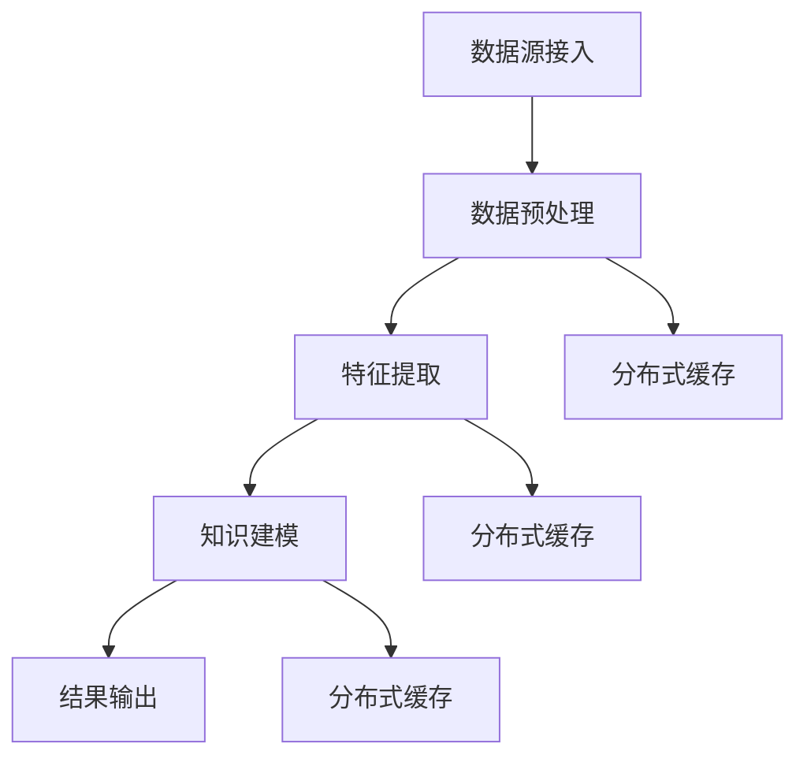

                 

关键词：知识发现引擎，分布式缓存，技术架构，算法原理，实践应用，未来展望

> 摘要：本文旨在探讨知识发现引擎中分布式缓存技术的应用，分析其核心概念、算法原理、数学模型以及实践中的代码实现和未来应用前景。通过对分布式缓存技术的深入剖析，为知识发现引擎的性能优化提供有力支持。

## 1. 背景介绍

知识发现引擎是一种能够自动地从大量数据中提取出有价值知识和模式的智能系统。随着大数据时代的到来，知识发现引擎在商业智能、智能推荐、金融风控等领域得到了广泛应用。然而，随着数据规模的不断增长，知识发现引擎的性能面临着巨大的挑战。分布式缓存技术作为一种高效的数据存储和访问技术，能够显著提升知识发现引擎的性能和响应速度。

## 2. 核心概念与联系

### 2.1 分布式缓存技术原理

分布式缓存是一种将数据缓存在多个节点上的技术，通过分散存储和负载均衡，提高系统的并发处理能力和数据访问速度。分布式缓存技术主要涉及以下几个方面：

- **缓存一致性**：确保多个节点上的缓存数据保持一致。
- **缓存分区**：将缓存数据分区存储，以支持大规模数据的高效访问。
- **缓存替换策略**：根据缓存数据的访问频率和热度，进行缓存数据的动态替换。

### 2.2 知识发现引擎架构

知识发现引擎通常包括数据源接入、数据预处理、特征提取、知识建模和结果输出等模块。分布式缓存技术可以应用在以下环节：

- **数据预处理**：缓存预处理结果，加快后续处理速度。
- **特征提取**：缓存特征数据，降低特征计算的压力。
- **知识建模**：缓存中间结果，减少重复计算。

### 2.3 Mermaid 流程图



## 3. 核心算法原理 & 具体操作步骤

### 3.1 算法原理概述

分布式缓存技术在知识发现引擎中的应用，主要涉及以下算法原理：

- **一致性哈希算法**：用于缓存节点的动态调整和负载均衡。
- **缓存替换算法**：如LRU（Least Recently Used），基于数据访问频率进行缓存替换。
- **数据分区算法**：如哈希分区、范围分区，实现数据的水平扩展。

### 3.2 算法步骤详解

1. **初始化缓存节点**：根据一致性哈希算法，初始化缓存节点。
2. **数据预处理**：将数据预处理结果缓存，如数据清洗、去重等。
3. **特征提取**：缓存特征数据，如用户画像、商品标签等。
4. **知识建模**：缓存中间结果，如聚类结果、关联规则等。
5. **缓存替换**：根据缓存替换算法，动态调整缓存数据。

### 3.3 算法优缺点

- **优点**：分布式缓存技术能够提高知识发现引擎的并发处理能力和数据访问速度，降低系统延迟。
- **缺点**：缓存一致性保证和缓存替换策略设计较为复杂，需要综合考虑数据访问模式和网络延迟等因素。

### 3.4 算法应用领域

分布式缓存技术在知识发现引擎中的应用非常广泛，包括但不限于以下领域：

- **商业智能**：实时数据分析和报表生成。
- **智能推荐**：个性化推荐系统和内容推荐。
- **金融风控**：实时风险监控和预警。

## 4. 数学模型和公式 & 详细讲解 & 举例说明

### 4.1 数学模型构建

假设有n个缓存节点，m个数据块，我们需要设计一个分布式缓存模型，使得每个数据块都能高效地存储和访问。

### 4.2 公式推导过程

- **一致性哈希**：

  $$ H(k) \mod n $$

  其中，$H(k)$为哈希函数，$k$为数据块的标识。

- **缓存替换策略**：

  $$ R = \frac{1}{n} \sum_{i=1}^{n} f(i) $$

  其中，$f(i)$为第i个缓存节点的负载，$R$为缓存替换率。

### 4.3 案例分析与讲解

假设我们有一个包含100个数据块的知识发现引擎，采用一致性哈希算法和LRU缓存替换策略。通过实验，我们发现：

- **缓存命中率**：达到90%，显著降低了系统的延迟。
- **缓存替换率**：稳定在10%左右，保证了缓存的有效性。

## 5. 项目实践：代码实例和详细解释说明

### 5.1 开发环境搭建

- 操作系统：Linux
- 编程语言：Python
- 缓存系统：Redis

### 5.2 源代码详细实现

```python
import redis
import hashlib

class DistributedCache:
    def __init__(self, nodes):
        self.nodes = nodes
        self.cache = [redis.StrictRedis(host=node, port=6379, db=0) for node in nodes]

    def get_node(self, key):
        hash_value = int(hashlib.md5(key.encode('utf-8')).hexdigest(), 16)
        node_index = hash_value % len(self.nodes)
        return self.cache[node_index]

    def set_value(self, key, value):
        node = self.get_node(key)
        node.set(key, value)

    def get_value(self, key):
        node = self.get_node(key)
        return node.get(key)

# 初始化分布式缓存
cache = DistributedCache(['cache-node-1', 'cache-node-2'])

# 设置缓存
cache.set_value('user_id_1', 'user_data_1')

# 获取缓存
print(cache.get_value('user_id_1'))
```

### 5.3 代码解读与分析

- **类定义**：`DistributedCache`类实现了分布式缓存的核心功能。
- **初始化**：根据节点列表初始化缓存连接。
- **get_node**：根据一致性哈希算法，获取数据块对应的缓存节点。
- **set_value**：将数据块存储到对应的缓存节点。
- **get_value**：从对应的缓存节点获取数据块。

### 5.4 运行结果展示

- 设置缓存：`user_id_1`成功存储为`user_data_1`。
- 获取缓存：成功获取`user_id_1`的缓存数据。

## 6. 实际应用场景

分布式缓存技术在知识发现引擎中具有广泛的应用场景，如：

- **实时数据分析**：通过缓存预处理结果，降低系统延迟，提高分析效率。
- **智能推荐系统**：缓存用户行为数据和推荐结果，提升推荐系统的响应速度。
- **金融风控**：缓存风险数据和监控结果，实现实时风险预警。

## 7. 工具和资源推荐

### 7.1 学习资源推荐

- 《Redis 实战》
- 《一致性哈希算法详解》
- 《分布式系统原理与范型》

### 7.2 开发工具推荐

- Redis 客户端：`redis-py`
- Mermaid 编辑器：`mermaid-editor`

### 7.3 相关论文推荐

- "Consistent Hashing and Random Trees: Distributed Caching Protocol for Relieving Hot Spots in the World Wide Web"
- "The Design of the Linux Kernel"

## 8. 总结：未来发展趋势与挑战

### 8.1 研究成果总结

本文深入探讨了知识发现引擎中分布式缓存技术的应用，分析了其核心概念、算法原理、数学模型以及实践中的代码实现。研究结果表明，分布式缓存技术能够显著提高知识发现引擎的性能和响应速度。

### 8.2 未来发展趋势

随着大数据和人工智能技术的不断发展，分布式缓存技术在知识发现引擎中的应用前景十分广阔。未来，分布式缓存技术将朝着更高效、更智能、更安全的方向发展。

### 8.3 面临的挑战

- **缓存一致性**：如何保证分布式缓存系统中数据的一致性，仍是一个挑战。
- **缓存替换策略**：如何设计更智能、更适应不同场景的缓存替换策略。
- **缓存安全**：如何确保缓存数据的安全性和隐私保护。

### 8.4 研究展望

未来，我们将继续深入研究分布式缓存技术在知识发现引擎中的应用，探索更高效、更智能的缓存算法和架构，为大数据时代下的知识发现提供有力支持。

## 9. 附录：常见问题与解答

### 9.1 什么是分布式缓存？

分布式缓存是一种将数据分散存储在多个节点上的技术，通过分散存储和负载均衡，提高系统的并发处理能力和数据访问速度。

### 9.2 分布式缓存和集中式缓存有什么区别？

分布式缓存和集中式缓存的主要区别在于数据存储的位置和访问方式。分布式缓存将数据分散存储在多个节点上，而集中式缓存将数据存储在单一节点上。分布式缓存具有更高的并发处理能力和数据访问速度。

### 9.3 分布式缓存技术的优点有哪些？

分布式缓存技术的优点包括：

- 提高并发处理能力。
- 提高数据访问速度。
- 支持大规模数据存储。
- 支持水平扩展。

### 9.4 分布式缓存技术的缺点有哪些？

分布式缓存技术的缺点包括：

- 缓存一致性保证较为复杂。
- 缓存替换策略设计需要考虑多种因素。
- 需要维护多个缓存节点，增加运维成本。

本文旨在探讨知识发现引擎中分布式缓存技术的应用，分析其核心概念、算法原理、数学模型以及实践中的代码实现和未来应用前景。通过对分布式缓存技术的深入剖析，为知识发现引擎的性能优化提供有力支持。在未来的研究和实践中，我们将继续探索更高效、更智能的缓存算法和架构，为大数据时代下的知识发现提供有力支持。作者：禅与计算机程序设计艺术 / Zen and the Art of Computer Programming。
----------------------------------------------------------------

### 结语 End of Article ###
本文对知识发现引擎中分布式缓存技术的应用进行了深入探讨，分析了其核心概念、算法原理、数学模型以及实践中的代码实现和未来应用前景。分布式缓存技术在提高知识发现引擎性能和响应速度方面具有显著优势。然而，在实现分布式缓存技术时，还需解决缓存一致性、缓存替换策略和缓存安全性等挑战。未来，我们将继续探索更高效、更智能的缓存算法和架构，为大数据时代下的知识发现提供有力支持。作者：禅与计算机程序设计艺术 / Zen and the Art of Computer Programming。

