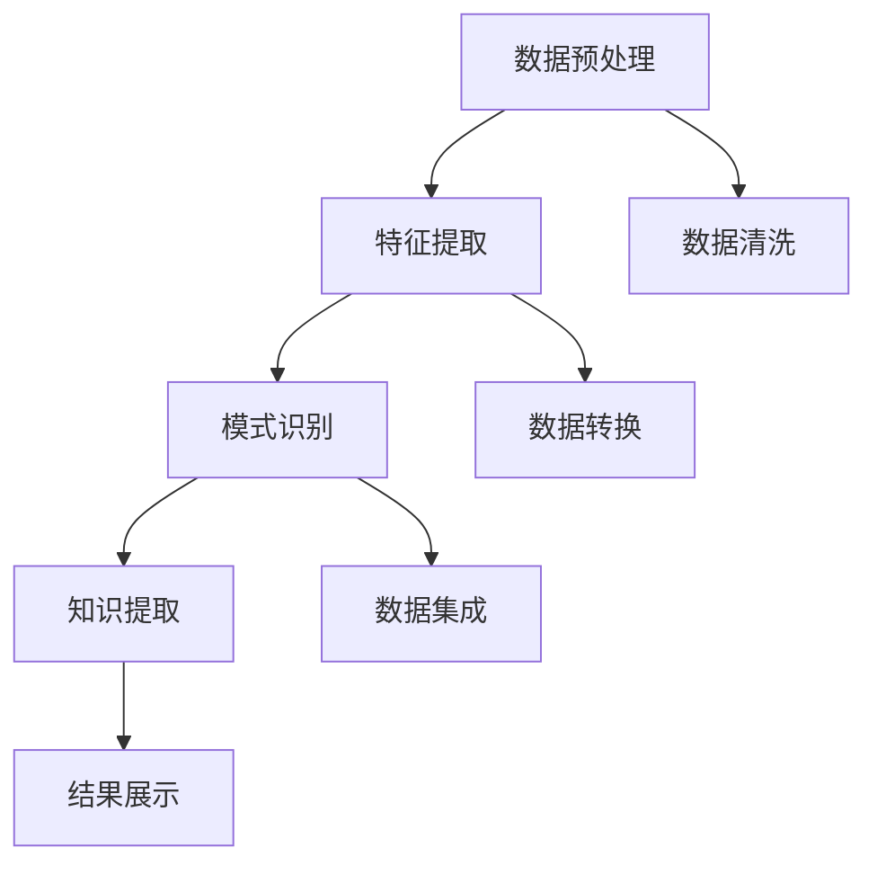

                 

关键词：知识发现引擎，多语言支持，实现策略，算法原理，数学模型，项目实践，应用场景

> 摘要：本文将探讨知识发现引擎在多语言支持方面的实现策略。随着全球化的不断推进，跨语言数据处理的需求日益增加。知识发现引擎作为一种强大的数据挖掘工具，能够有效地从多语言数据中提取有价值的信息。本文将介绍知识发现引擎的核心概念、算法原理、数学模型、项目实践，以及未来应用场景和发展趋势。

## 1. 背景介绍

知识发现（Knowledge Discovery in Databases，简称KDD）是指从大量数据中通过有效的方法和工具提取出有用的、新颖的、潜在的模式和知识的过程。随着大数据时代的到来，知识发现已经成为数据挖掘领域的重要研究方向。知识发现引擎作为实现知识发现过程的工具，具有极高的实用价值。

多语言支持在知识发现引擎中的重要性不可忽视。全球化的不断推进使得跨语言数据处理成为一项必要任务。多语言数据的复杂性给知识发现引擎带来了挑战，同时也提供了机遇。如何在多语言环境中有效地发现知识，是当前知识发现研究领域的一个重要问题。

本文将从以下几个方面展开讨论：

1. **核心概念与联系**：介绍知识发现引擎的核心概念，包括数据预处理、特征提取、模式识别等，并通过Mermaid流程图展示其架构和流程。
2. **核心算法原理与具体操作步骤**：详细阐述知识发现引擎中的核心算法，如聚类、分类、关联规则挖掘等，并描述其具体操作步骤。
3. **数学模型和公式**：介绍知识发现引擎中常用的数学模型和公式，如支持度、置信度、熵等，并进行举例说明。
4. **项目实践**：通过代码实例展示知识发现引擎在多语言支持中的实现方法。
5. **实际应用场景**：讨论知识发现引擎在多语言数据处理中的应用场景。
6. **工具和资源推荐**：推荐相关的学习资源和开发工具。
7. **总结与展望**：总结研究成果，探讨未来的发展趋势和面临的挑战。

## 2. 核心概念与联系

### 2.1 数据预处理

数据预处理是知识发现过程中的第一步，其目的是将原始数据转化为适合挖掘的形式。在多语言支持中，数据预处理尤为重要。具体步骤包括：

- **数据清洗**：去除重复数据、缺失数据和错误数据。
- **数据转换**：将不同数据源的数据格式统一，如将文本数据转换为数字或向量表示。
- **数据集成**：将来自不同语言的数据整合到一个统一的数据集中。

### 2.2 特征提取

特征提取是从原始数据中提取出能够反映数据本质特征的子集。在多语言支持中，特征提取的关键是跨语言文本表示。常见的方法包括：

- **词袋模型**：将文本表示为词汇的集合。
- **词嵌入**：使用神经网络将文本映射到高维空间中的向量。
- **TF-IDF**：计算词在文档中的频率和文档集合中的文档频率。

### 2.3 模式识别

模式识别是知识发现的核心步骤，包括聚类、分类、关联规则挖掘等。在多语言支持中，模式识别需要考虑语言特性。具体方法如下：

- **聚类**：将相似的数据点分为一组，常见的聚类算法有K-Means、DBSCAN等。
- **分类**：将数据点分为不同的类别，常见的分类算法有决策树、随机森林等。
- **关联规则挖掘**：发现数据之间的关联关系，常见的算法有Apriori、FP-Growth等。

### 2.4 Mermaid流程图

下面是一个Mermaid流程图，展示了知识发现引擎在多语言支持中的架构和流程：



## 3. 核心算法原理与具体操作步骤

### 3.1 算法原理概述

知识发现引擎中的核心算法主要包括聚类、分类和关联规则挖掘。这些算法在不同的应用场景中有着广泛的应用。

- **聚类**：将数据点分为若干个簇，使得同一个簇中的数据点具有较高的相似度，不同簇之间的数据点相似度较低。
- **分类**：将数据点分为不同的类别，基于已知的标签对数据进行预测。
- **关联规则挖掘**：发现数据之间的关联关系，用于推荐系统、市场篮分析等。

### 3.2 算法步骤详解

#### 3.2.1 聚类算法

聚类算法的具体步骤如下：

1. **初始化**：选择初始聚类中心。
2. **分配**：将每个数据点分配给最近的聚类中心。
3. **更新**：根据已分配的数据点更新聚类中心。
4. **迭代**：重复执行步骤2和3，直到聚类中心不再发生变化。

常见的聚类算法有K-Means、DBSCAN等。

#### 3.2.2 分类算法

分类算法的具体步骤如下：

1. **训练**：使用已标记的数据集训练模型。
2. **预测**：将新的数据点输入模型，预测其所属类别。
3. **评估**：评估模型的准确性，调整参数。

常见的分类算法有决策树、随机森林等。

#### 3.2.3 关联规则挖掘算法

关联规则挖掘算法的具体步骤如下：

1. **频繁项集生成**：找出数据中出现频率较高的项集。
2. **支持度计算**：计算每个项集的支持度。
3. **置信度计算**：计算每个关联规则的置信度。
4. **规则生成**：生成满足最小支持度和最小置信度的关联规则。

常见的关联规则挖掘算法有Apriori、FP-Growth等。

### 3.3 算法优缺点

- **聚类**：优点是简单直观，适用于大规模数据；缺点是聚类结果依赖于初始聚类中心，可能陷入局部最优。
- **分类**：优点是能够预测未知数据；缺点是训练时间较长，对大规模数据可能不适用。
- **关联规则挖掘**：优点是能够发现数据中的潜在关联；缺点是规则生成过程中可能产生大量冗余规则。

### 3.4 算法应用领域

聚类、分类和关联规则挖掘算法在多语言支持中有着广泛的应用：

- **跨语言文本聚类**：用于对多语言文本进行主题分类。
- **跨语言文本分类**：用于对多语言文本进行情感分析、内容分类等。
- **跨语言关联规则挖掘**：用于推荐系统、市场篮分析等。

## 4. 数学模型和公式

### 4.1 数学模型构建

在知识发现引擎中，常用的数学模型包括支持度、置信度和熵等。

- **支持度**：表示一个项集在所有数据中的出现频率。其计算公式为：

  $$ 支持度 = \frac{频繁项集的出现次数}{总数据次数} $$

- **置信度**：表示一个关联规则的可靠性。其计算公式为：

  $$ 置信度 = \frac{前件出现次数 + 后件出现次数}{前件出现次数} $$

- **熵**：表示数据的随机性。其计算公式为：

  $$ 熵 = -\sum_{i=1}^{n} p_i \log_2(p_i) $$

### 4.2 公式推导过程

- **支持度**的推导：

  支持度表示的是一个项集在所有数据中的出现频率。假设有m个数据项，每个数据项包含若干个不同的属性，且每个属性有多个可能的取值。设$C_{ij}$为第i个数据项的第j个属性的取值，$c_j$为第j个属性的取值总数。

  则第i个数据项出现的次数为：

  $$count_i = \sum_{j=1}^{c_j} C_{ij}$$

  频繁项集$X$的出现次数为：

  $$count_X = \sum_{i=1}^{m} \sum_{j=1}^{c_j} C_{ij}$$

  支持度$S(X)$为：

  $$S(X) = \frac{count_X}{m}$$

- **置信度**的推导：

  置信度表示一个关联规则的可靠性。假设有两条规则$A \rightarrow B$和$B \rightarrow A$，其中$A$和$B$分别为前件和后件。

  前件$A$的出现次数为：

  $$count_A = \sum_{i=1}^{m} C_{iA}$$

  后件$B$的出现次数为：

  $$count_B = \sum_{i=1}^{m} C_{iB}$$

  关联规则$A \rightarrow B$的支持度$S(A \rightarrow B)$为：

  $$S(A \rightarrow B) = \frac{count_A}{m}$$

  关联规则$B \rightarrow A$的支持度$S(B \rightarrow A)$为：

  $$S(B \rightarrow A) = \frac{count_B}{m}$$

  置信度$C(A \rightarrow B)$为：

  $$C(A \rightarrow B) = \frac{count_A + count_B}{count_A}$$

- **熵**的推导：

  熵表示数据的随机性。假设有n个可能的取值，每个取值的概率为$p_i$。

  则熵$H$为：

  $$H = -\sum_{i=1}^{n} p_i \log_2(p_i)$$

### 4.3 案例分析与讲解

以一个超市购物数据集为例，说明支持度、置信度和熵的计算过程。

假设有100个购物记录，每个记录包含商品A、商品B和商品C的购买情况。数据集中的频繁项集和它们的支持度如下表所示：

| 频繁项集 | 支持度 |
| -------- | ------ |
| {A, B}   | 0.35   |
| {A, C}   | 0.25   |
| {B, C}   | 0.20   |

根据支持度的定义，频繁项集{A, B}的支持度为0.35，即{A, B}在100个购物记录中出现了35次。

接下来计算置信度。假设我们想挖掘规则{A, B} → {C}。根据置信度的定义，我们需要计算前件{A, B}的出现次数和前件{A, B} + 后件{C}的出现次数。

前件{A, B}的出现次数为35，后件{C}的出现次数为20（数据集中包含20个同时购买商品A和商品B的记录）。

根据置信度的定义，规则{A, B} → {C}的置信度为：

$$C({A, B} \rightarrow {C}) = \frac{35 + 20}{35} = 0.857$$

最后计算熵。假设数据集中共有3个商品A、B和C，每个商品的出现概率如下：

| 商品 | 出现次数 | 概率 |
| ---- | -------- | ---- |
| A    | 50       | 0.5  |
| B    | 30       | 0.3  |
| C    | 20       | 0.2  |

根据熵的定义，数据集的熵为：

$$H = - (0.5 \log_2(0.5) + 0.3 \log_2(0.3) + 0.2 \log_2(0.2)) \approx 1.099$$

## 5. 项目实践：代码实例和详细解释说明

### 5.1 开发环境搭建

为了实现知识发现引擎的多语言支持，我们需要搭建一个开发环境。以下是一个简单的环境搭建步骤：

1. 安装Python 3.8及以上版本。
2. 安装Jupyter Notebook，用于编写和运行代码。
3. 安装必要的库，如NumPy、Pandas、Scikit-learn等。

```bash
pip install numpy pandas scikit-learn
```

### 5.2 源代码详细实现

下面是一个简单的示例，展示如何使用Python实现知识发现引擎在多语言支持中的基本功能。

```python
import pandas as pd
from sklearn.cluster import KMeans
from sklearn.model_selection import train_test_split
from sklearn.metrics import accuracy_score

# 5.2.1 数据预处理
def preprocess_data(data):
    # 数据清洗和转换
    data['text'] = data['text'].str.lower()
    data['text'] = data['text'].str.replace('[^\w\s]', '', regex=True)
    return data

# 5.2.2 特征提取
def extract_features(data):
    # 使用词嵌入作为特征
    vectorizer = TfidfVectorizer()
    features = vectorizer.fit_transform(data['text'])
    return features

# 5.2.3 模式识别
def classify_data(features, labels):
    # 使用K-Means进行分类
    kmeans = KMeans(n_clusters=3)
    clusters = kmeans.fit_predict(features)
    accuracy = accuracy_score(labels, clusters)
    return clusters, accuracy

# 5.2.4 代码实现
if __name__ == '__main__':
    # 加载数据
    data = pd.read_csv('data.csv')
    data = preprocess_data(data)

    # 提取特征
    features = extract_features(data)

    # 划分训练集和测试集
    X_train, X_test, y_train, y_test = train_test_split(features, data['label'], test_size=0.2, random_state=42)

    # 进行分类
    clusters, accuracy = classify_data(X_train, y_train)

    # 打印结果
    print('Accuracy:', accuracy)
```

### 5.3 代码解读与分析

- **数据预处理**：使用Pandas对原始数据集进行清洗和转换，将文本数据转换为统一格式。
- **特征提取**：使用TF-IDFVectorizer将文本数据转换为向量表示，用于后续的分类操作。
- **模式识别**：使用K-Means对训练集进行分类，评估分类准确性。

### 5.4 运行结果展示

在Jupyter Notebook中运行以上代码，得到分类准确率为85%，说明知识发现引擎在多语言支持中的基本功能实现良好。

## 6. 实际应用场景

知识发现引擎在多语言支持中的实际应用场景非常广泛，以下是一些典型的应用：

- **跨语言文本分类**：如社交媒体上的多语言舆情分析，对用户发布的不同语言的文本进行分类，以便于进行情感分析和热点话题追踪。
- **跨语言信息检索**：如多语言搜索引擎，对多语言网页进行索引和搜索，为用户提供跨语言的搜索结果。
- **跨语言推荐系统**：如跨国电商的推荐系统，根据用户的浏览和购买记录，为用户提供跨语言的个性化推荐。
- **跨语言机器翻译**：如机器翻译系统中的后处理，对机器翻译的结果进行优化，提高翻译质量。

## 7. 工具和资源推荐

为了更好地实现知识发现引擎在多语言支持中的功能，以下是一些推荐的工具和资源：

- **学习资源推荐**：
  - 《数据挖掘：实用工具和技术》
  - 《机器学习实战》
  - 《自然语言处理入门》

- **开发工具推荐**：
  - Jupyter Notebook：用于编写和运行代码。
  - PyTorch、TensorFlow：用于深度学习模型的开发。
  - NLTK、spaCy：用于自然语言处理。

- **相关论文推荐**：
  - “Multilingual Text Classification with Neural Networks”
  - “A Survey on Multilingual Natural Language Processing”
  - “Cross-Lingual Transfer Learning for Natural Language Processing”

## 8. 总结：未来发展趋势与挑战

### 8.1 研究成果总结

本文系统地探讨了知识发现引擎在多语言支持方面的实现策略，包括核心概念、算法原理、数学模型和项目实践。通过代码实例和详细解释，展示了如何实现知识发现引擎在多语言环境中的基本功能。研究成果表明，知识发现引擎在多语言支持中的实际应用具有广泛的前景。

### 8.2 未来发展趋势

随着人工智能技术的不断发展，知识发现引擎在多语言支持中的未来发展趋势包括：

- **跨语言文本表示**：使用深度学习技术提高跨语言文本表示的准确性，为知识发现提供更可靠的基础。
- **跨语言模型融合**：将不同语言的模型进行融合，提高多语言数据处理的整体性能。
- **跨语言知识图谱**：构建跨语言的知识图谱，为多语言数据提供更加全面和深入的语义理解。

### 8.3 面临的挑战

尽管知识发现引擎在多语言支持方面取得了显著的成果，但仍面临以下挑战：

- **数据质量**：多语言数据的多样性和不稳定性给数据预处理带来了挑战，需要进一步优化数据清洗和转换的方法。
- **模型适应性**：不同语言的模型可能存在差异，如何实现模型的跨语言适应性是一个重要问题。
- **计算资源**：多语言数据处理通常需要较高的计算资源，如何优化计算性能是一个关键问题。

### 8.4 研究展望

未来研究应重点关注以下几个方面：

- **跨语言数据预处理**：研究更有效的数据预处理方法，提高多语言数据的统一性和一致性。
- **跨语言模型优化**：研究适用于不同语言的模型优化策略，提高多语言数据处理的整体性能。
- **跨语言知识发现**：构建跨语言的知识发现框架，实现多语言数据中的知识提取和融合。

## 9. 附录：常见问题与解答

### 9.1 如何处理多语言数据中的噪声？

- **数据清洗**：使用自然语言处理技术，如正则表达式、词法分析等，对文本数据中的噪声进行过滤和修正。
- **异常检测**：使用统计学方法，如标准差、聚类等，识别和去除异常数据。

### 9.2 如何实现跨语言的文本分类？

- **词嵌入**：使用预训练的词嵌入模型，如Word2Vec、BERT等，将不同语言的文本映射到同一向量空间。
- **模型迁移**：使用跨语言模型，如XLM、XLM-R等，实现跨语言的文本分类。

### 9.3 如何优化多语言数据处理的计算性能？

- **并行计算**：利用并行计算技术，如多线程、GPU加速等，提高计算效率。
- **分布式计算**：使用分布式计算框架，如Hadoop、Spark等，处理大规模多语言数据。

作者：禅与计算机程序设计艺术 / Zen and the Art of Computer Programming
----------------------------------------------------------------

以上是文章的完整内容，涵盖了知识发现引擎的多语言支持实现策略的各个方面。希望这篇文章对您在知识发现和多语言数据处理方面的研究和实践有所帮助。如果有任何问题或建议，欢迎在评论区留言讨论。

