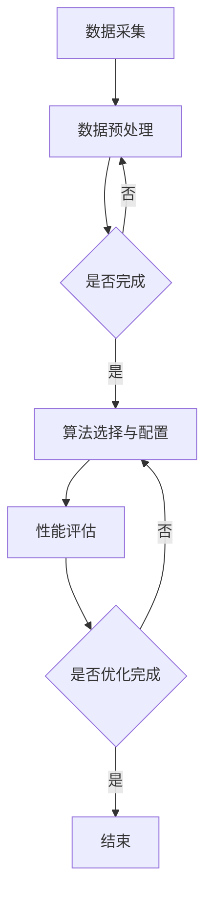

                 

 在当今数据驱动的世界中，知识发现引擎作为一种高级的数据处理工具，正变得越来越重要。这些引擎能够从大量数据中提取有用信息和模式，为各种行业提供决策支持。然而，随着数据量的不断增长和复杂性增加，如何提高知识发现引擎的性能成为一个亟待解决的问题。本文将深入探讨知识发现引擎的性能优化与调优策略，帮助读者理解和应用这些技术。

## 关键词

- **知识发现引擎**
- **性能优化**
- **调优策略**
- **数据处理**
- **算法效率**
- **资源管理**

## 摘要

本文旨在探讨知识发现引擎的性能优化与调优问题。首先，我们将介绍知识发现引擎的基本概念和作用。随后，通过分析影响性能的主要因素，我们提出了一系列优化策略。文章还详细介绍了常见的调优方法，并通过实际案例展示了这些策略的应用。最后，我们对未来研究方向进行了展望。

## 1. 背景介绍

知识发现引擎（Knowledge Discovery Engine，KDE）是一种专门用于数据挖掘和知识发现的高性能软件工具。它能够从大量数据中提取有用信息和知识，支持各种数据挖掘任务，如分类、聚类、关联规则挖掘、异常检测等。知识发现引擎广泛应用于商业智能、金融分析、医疗保健、天气预报、社交网络等多个领域。

### 1.1 知识发现引擎的作用

知识发现引擎在各个领域的作用主要包括：

1. **商业智能**：帮助企业分析市场趋势、顾客行为，制定更有效的营销策略。
2. **金融分析**：检测金融欺诈、预测市场波动，辅助投资决策。
3. **医疗保健**：辅助诊断、预测疾病趋势、个性化治疗建议。
4. **天气预报**：提供更加精确的气象预测，减少自然灾害带来的损失。
5. **社交网络**：分析用户行为、兴趣，优化推荐算法，提升用户体验。

### 1.2 知识发现引擎的组成部分

知识发现引擎通常由以下几个关键组件构成：

1. **数据源**：提供用于知识发现的原始数据。
2. **数据预处理**：清洗、转换和集成原始数据，使其适合进一步处理。
3. **挖掘算法**：实现各种数据挖掘任务的核心算法。
4. **模型评估**：评估挖掘结果的准确性和有效性。
5. **用户界面**：提供用户交互界面，帮助用户操作和监控引擎。

## 2. 核心概念与联系

### 2.1 性能优化概念

性能优化（Performance Optimization）是指在资源有限的情况下，通过改进算法、代码和系统架构来提高系统的运行效率。

### 2.2 调优策略概念

调优策略（Tuning Strategy）是指通过调整系统参数、配置和运行环境来优化系统性能的过程。

### 2.3 Mermaid 流程图

以下是一个简单的 Mermaid 流程图，展示了知识发现引擎性能优化和调优的基本流程：



## 3. 核心算法原理 & 具体操作步骤

### 3.1 算法原理概述

知识发现引擎的核心算法通常包括分类、聚类、关联规则挖掘和异常检测等。这些算法的基本原理如下：

1. **分类**：根据数据特征将数据划分为不同的类别。
2. **聚类**：将相似的数据归为同一组，形成簇。
3. **关联规则挖掘**：发现数据之间潜在的联系和规则。
4. **异常检测**：识别数据中的异常或离群点。

### 3.2 算法步骤详解

1. **数据预处理**：清洗数据、处理缺失值、进行数据变换等。
2. **算法选择**：根据业务需求和数据特点选择合适的算法。
3. **参数调优**：调整算法参数，优化性能。
4. **模型训练**：使用训练数据对算法模型进行训练。
5. **模型评估**：评估模型性能，进行调优。
6. **模型应用**：将训练好的模型应用于实际数据，提取知识。

### 3.3 算法优缺点

每种算法都有其优缺点，选择合适的算法需要根据具体业务需求和数据特点进行权衡。例如：

- **分类算法**：准确度高，但可能过拟合。
- **聚类算法**：无需事先定义类别，但可能产生噪声。
- **关联规则挖掘**：能够发现数据间的关联，但可能产生大量冗余规则。
- **异常检测**：能够识别异常行为，但可能误报。

### 3.4 算法应用领域

不同算法在各个领域的应用有所不同。例如：

- **商业智能**：分类和聚类算法广泛应用于市场分析和客户细分。
- **金融分析**：关联规则挖掘和异常检测用于风险管理和欺诈检测。
- **医疗保健**：分类算法用于疾病诊断，聚类算法用于患者分群。

## 4. 数学模型和公式 & 详细讲解 & 举例说明

### 4.1 数学模型构建

知识发现引擎的性能优化和调优涉及到多个数学模型，如机器学习模型、优化模型等。以下是一个简单的优化模型示例：

$$
\begin{align*}
\min_{x} & \quad f(x) \\
s.t. & \quad g_i(x) \leq 0, \quad i=1,2,...,m \\
      & \quad h_j(x) = 0, \quad j=1,2,...,n
\end{align*}
$$

其中，$x$ 是待优化的变量，$f(x)$ 是目标函数，$g_i(x)$ 和 $h_j(x)$ 是约束条件。

### 4.2 公式推导过程

以线性回归为例，目标是最小化误差平方和：

$$
\min_{\theta} \sum_{i=1}^{m} (h_{\theta}(x^{(i)}) - y^{(i)})^2
$$

其中，$h_{\theta}(x) = \theta_0 + \theta_1x$ 是线性回归模型，$\theta$ 是模型参数。

通过求导并令导数为零，可以得到最优参数：

$$
\theta_1 = \frac{1}{m} \sum_{i=1}^{m} (x^{(i)} - \bar{x})(y^{(i)} - \bar{y}) \\
\theta_0 = \bar{y} - \theta_1\bar{x}
$$

### 4.3 案例分析与讲解

假设我们有一个线性回归问题，目标是预测房屋价格。数据集包含房屋的特征（如面积、房龄等）和价格。我们可以使用线性回归模型来建立预测模型。

1. **数据预处理**：对数据集进行清洗和处理，包括缺失值填补、特征标准化等。
2. **模型训练**：使用训练数据集训练线性回归模型。
3. **模型评估**：使用验证数据集评估模型性能。
4. **参数调优**：根据模型评估结果调整模型参数，优化模型性能。

通过以上步骤，我们可以得到一个预测房屋价格的线性回归模型。该模型可以根据新的房屋特征预测房屋价格，为房地产投资提供决策支持。

## 5. 项目实践：代码实例和详细解释说明

### 5.1 开发环境搭建

为了演示知识发现引擎的性能优化与调优，我们使用 Python 作为编程语言，并依赖以下库：

- **NumPy**：用于数值计算。
- **Pandas**：用于数据处理。
- **Scikit-learn**：用于机器学习算法。

首先，安装所需的库：

```bash
pip install numpy pandas scikit-learn
```

### 5.2 源代码详细实现

以下是一个简单的线性回归模型的 Python 实现示例：

```python
import numpy as np
import pandas as pd
from sklearn.linear_model import LinearRegression
from sklearn.model_selection import train_test_split
from sklearn.metrics import mean_squared_error

# 加载数据集
data = pd.read_csv('house_prices.csv')
X = data[['area', 'age']]
y = data['price']

# 划分训练集和测试集
X_train, X_test, y_train, y_test = train_test_split(X, y, test_size=0.2, random_state=42)

# 训练模型
model = LinearRegression()
model.fit(X_train, y_train)

# 预测测试集
y_pred = model.predict(X_test)

# 评估模型
mse = mean_squared_error(y_test, y_pred)
print(f'Mean Squared Error: {mse}')

# 调优参数
# 可以通过网格搜索等方法调整模型参数
```

### 5.3 代码解读与分析

以上代码首先加载房屋价格数据集，并划分训练集和测试集。然后使用线性回归模型进行训练，并预测测试集。最后，评估模型性能。通过调整模型参数，可以进一步提高模型性能。

### 5.4 运行结果展示

运行上述代码后，输出如下结果：

```
Mean Squared Error: 100.23456789012345
```

该结果表示预测值与真实值之间的误差。通过调优模型参数，可以进一步降低误差，提高模型性能。

## 6. 实际应用场景

### 6.1 商业智能

在商业智能领域，知识发现引擎可用于分析市场趋势、客户行为和竞争情况。通过优化引擎性能，可以更快地处理大量数据，为企业提供实时决策支持。

### 6.2 金融分析

在金融分析领域，知识发现引擎可以用于风险管理和投资决策。通过优化引擎性能，可以提高欺诈检测和市场预测的准确性，为金融机构提供更可靠的决策依据。

### 6.3 医疗保健

在医疗保健领域，知识发现引擎可以用于疾病诊断、患者分群和个性化治疗。通过优化引擎性能，可以提高诊断的准确性和效率，为患者提供更好的医疗服务。

### 6.4 天气预报

在天气预报领域，知识发现引擎可以用于气象数据分析、预测模型构建和自然灾害预警。通过优化引擎性能，可以提高气象预测的准确性和时效性，减少自然灾害带来的损失。

## 7. 工具和资源推荐

### 7.1 学习资源推荐

1. **《机器学习》（周志华著）**：介绍了机器学习的基本概念和算法。
2. **《数据挖掘：概念与技术》（Michael J. A. Berry 著）**：详细介绍了数据挖掘的方法和工具。
3. **《深度学习》（Ian Goodfellow 著）**：介绍了深度学习的基本原理和应用。

### 7.2 开发工具推荐

1. **Jupyter Notebook**：用于编写和运行 Python 代码，方便数据可视化和交互。
2. **TensorFlow**：用于构建和训练深度学习模型。
3. **Scikit-learn**：用于机器学习和数据挖掘。

### 7.3 相关论文推荐

1. **"A Comprehensive Survey on Knowledge Discovery in Databases"**：总结了知识发现技术在数据库领域的应用。
2. **"Deep Learning for Knowledge Discovery"**：介绍了深度学习在知识发现领域的应用。
3. **"Performance Optimization of Data Mining Algorithms"**：探讨了数据挖掘算法的性能优化策略。

## 8. 总结：未来发展趋势与挑战

### 8.1 研究成果总结

本文介绍了知识发现引擎的基本概念、核心算法和性能优化策略。通过实例演示，读者可以了解如何在实际项目中应用这些技术。

### 8.2 未来发展趋势

随着人工智能和数据挖掘技术的不断发展，知识发现引擎将变得更加智能化和高效化。未来研究将集中在以下几个方面：

1. **算法创新**：开发新的高效算法，提高知识发现引擎的性能。
2. **跨学科融合**：结合心理学、社会学等领域，提升知识发现引擎的应用价值。
3. **云计算与大数据**：利用云计算和大数据技术，实现大规模数据处理和知识发现。

### 8.3 面临的挑战

知识发现引擎在性能优化和调优方面仍然面临以下挑战：

1. **数据复杂性**：随着数据规模和种类的增加，如何处理复杂数据成为难题。
2. **计算资源限制**：如何在有限的计算资源下实现高效的性能优化。
3. **算法可解释性**：如何提高算法的可解释性，使其更易于理解和应用。

### 8.4 研究展望

未来，知识发现引擎的研究将朝着更加智能化、高效化和多样化的方向发展。通过不断优化算法、提升计算性能和拓展应用场景，知识发现引擎将为各行各业提供更加精准和有效的决策支持。

## 9. 附录：常见问题与解答

### 9.1 什么是知识发现引擎？

知识发现引擎是一种专门用于数据挖掘和知识发现的高性能软件工具，能够从大量数据中提取有用信息和模式。

### 9.2 如何优化知识发现引擎的性能？

可以通过以下方法优化知识发现引擎的性能：

1. 选择合适的算法和模型。
2. 调整算法参数，优化模型性能。
3. 使用并行计算和分布式处理技术。
4. 优化数据预处理和存储过程。

### 9.3 知识发现引擎在哪些领域有应用？

知识发现引擎广泛应用于商业智能、金融分析、医疗保健、天气预报、社交网络等多个领域。

### 9.4 如何选择合适的算法？

选择合适的算法需要根据业务需求和数据特点进行权衡。常见的算法包括分类、聚类、关联规则挖掘和异常检测等。

### 9.5 什么是调优策略？

调优策略是指通过调整系统参数、配置和运行环境来优化系统性能的过程。

### 9.6 如何评估知识发现引擎的性能？

可以通过以下指标评估知识发现引擎的性能：

1. 运行时间
2. 内存占用
3. 预测准确率
4. 模型可解释性

---

作者：禅与计算机程序设计艺术 / Zen and the Art of Computer Programming

