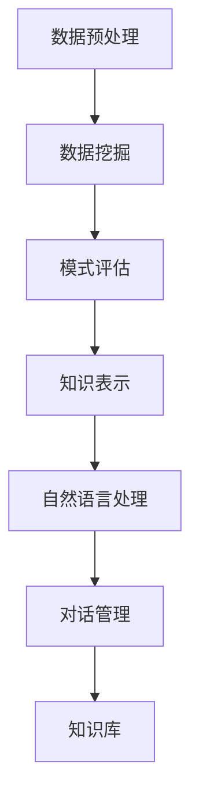

                 

关键词：知识发现，智能对话系统，自然语言处理，机器学习，算法，技术博客

> 摘要：本文将探讨知识发现引擎的智能对话系统，分析其核心概念与联系，详细介绍算法原理与操作步骤，并探讨其在实际应用场景中的表现和未来发展趋势。

## 1. 背景介绍

在当今信息化社会，数据量爆炸式增长，如何从海量数据中提取有价值的信息成为了一个重要课题。知识发现（Knowledge Discovery in Databases，KDD）作为数据挖掘的一个分支，旨在从大量数据中提取出隐藏的模式和知识。而智能对话系统作为人机交互的重要形式，正逐渐成为人们获取信息和解决问题的有力工具。

知识发现引擎的智能对话系统是将知识发现技术与自然语言处理技术相结合的一种新型系统。它不仅能够从数据中提取出有用的知识，还能够与用户进行自然、流畅的对话，从而提供更加个性化和精准的服务。随着人工智能技术的不断发展，知识发现引擎的智能对话系统在各个领域得到了广泛应用，如智能客服、智能教育、智能医疗等。

本文将围绕知识发现引擎的智能对话系统，分析其核心概念与联系，详细介绍算法原理与操作步骤，并探讨其在实际应用场景中的表现和未来发展趋势。

## 2. 核心概念与联系

### 2.1 知识发现

知识发现是指从大量数据中自动地发现隐藏的、未知的、潜在的知识。其核心目标是从原始数据中提取出有价值的信息，这些信息可以是隐含的模式、关联关系、趋势或异常等。

知识发现通常包括以下几个步骤：

1. **数据预处理**：包括数据清洗、数据集成、数据转换等，旨在将原始数据转化为适合挖掘的形式。
2. **数据挖掘**：采用各种算法和技术，从数据中提取出潜在的知识。
3. **模式评估**：对挖掘出的模式进行评估，判断其是否具有实际价值。
4. **知识表示**：将挖掘出的模式转化为可理解的形式，如规则、图表等。

### 2.2 智能对话系统

智能对话系统是一种能够与人类进行自然语言交互的计算机系统。它通过自然语言处理技术理解用户的语言输入，生成相应的语言输出，以实现人与机器的智能对话。

智能对话系统通常包括以下几个关键组件：

1. **对话管理**：负责维护对话状态，确保对话的连贯性和一致性。
2. **自然语言处理**：包括语音识别、语义理解、语言生成等，实现用户输入的识别和处理。
3. **知识库**：存储大量的知识信息，为对话系统提供知识支持。
4. **语音合成**：将对话系统的输出转换为自然流畅的语音。

### 2.3 核心概念联系

知识发现引擎的智能对话系统将知识发现和智能对话技术相结合，实现了从数据中提取知识，并通过智能对话系统为用户提供服务。其核心概念联系如下：

1. **知识发现**：从数据中提取有价值的信息，作为智能对话系统的知识库。
2. **自然语言处理**：将用户输入转化为机器可理解的形式，同时将智能对话系统的输出转化为自然流畅的语音。
3. **对话管理**：维护对话状态，确保对话的连贯性和一致性。
4. **知识库**：为智能对话系统提供知识支持，使其能够为用户提供有价值的服务。

### 2.4 Mermaid 流程图

下面是一个简化的知识发现引擎的智能对话系统的 Mermaid 流程图：



## 3. 核心算法原理 & 具体操作步骤

### 3.1 算法原理概述

知识发现引擎的智能对话系统主要依赖于以下几类算法：

1. **数据挖掘算法**：用于从数据中提取潜在的知识，如关联规则挖掘、聚类分析、分类等。
2. **自然语言处理算法**：用于理解用户的语言输入，生成相应的语言输出，如词性标注、命名实体识别、语义理解等。
3. **对话管理算法**：用于维护对话状态，确保对话的连贯性和一致性，如状态跟踪、上下文关联等。

### 3.2 算法步骤详解

1. **数据预处理**：
   - 数据清洗：去除数据中的噪声和错误。
   - 数据集成：将来自不同来源的数据整合在一起。
   - 数据转换：将数据转换为适合挖掘的形式。

2. **数据挖掘**：
   - 关联规则挖掘：找出数据中的关联关系。
   - 聚类分析：将相似的数据归为一类。
   - 分类：将数据划分为不同的类别。

3. **模式评估**：
   - 评估挖掘出的模式是否具有实际价值。

4. **知识表示**：
   - 将挖掘出的模式转化为可理解的形式，如规则、图表等。

5. **自然语言处理**：
   - 语音识别：将用户的语音输入转换为文本。
   - 语义理解：理解用户的语言输入的含义。
   - 语言生成：生成自然流畅的语言输出。

6. **对话管理**：
   - 维护对话状态，确保对话的连贯性和一致性。

7. **知识库更新**：
   - 将新的知识加入知识库，以丰富知识库的内容。

### 3.3 算法优缺点

1. **优点**：
   - 能够从海量数据中提取有价值的信息。
   - 能够与用户进行自然、流畅的对话，提供个性化服务。

2. **缺点**：
   - 需要大量的计算资源和时间。
   - 难以处理不确定性和噪声数据。

### 3.4 算法应用领域

- **智能客服**：通过智能对话系统提供24/7的在线客服服务。
- **智能教育**：根据学生的学习情况提供个性化的学习资源和指导。
- **智能医疗**：通过分析患者的病史和症状，提供诊断建议和治疗方案。

## 4. 数学模型和公式 & 详细讲解 & 举例说明

### 4.1 数学模型构建

知识发现引擎的智能对话系统涉及到多种数学模型，如关联规则挖掘模型、聚类分析模型、分类模型等。以下以关联规则挖掘模型为例进行讲解。

关联规则挖掘模型的核心公式为：

$$
support(A \cup B) = \frac{count(A \cup B)}{total\ transactions}
$$

其中，$support(A \cup B)$ 表示关联规则 $A$ 和 $B$ 的支持度，$count(A \cup B)$ 表示同时满足 $A$ 和 $B$ 的交易次数，$total\ transactions$ 表示总的交易次数。

### 4.2 公式推导过程

假设我们有一个交易数据库，其中每个交易包含一组商品。我们想要发现商品之间的关联规则。首先，我们需要计算每个商品对的支持度：

$$
support(A) = \frac{count(A)}{total\ transactions}
$$

其中，$count(A)$ 表示包含商品 $A$ 的交易次数。

然后，我们计算每个关联规则的支持度：

$$
support(A \cup B) = \frac{count(A \cup B)}{total\ transactions}
$$

其中，$count(A \cup B)$ 表示同时包含商品 $A$ 和 $B$ 的交易次数。

### 4.3 案例分析与讲解

假设我们有一个超市的交易数据库，其中包含每天的销售记录。我们想要发现顾客购买牛奶和面包的关联规则。

首先，我们计算牛奶和面包的支持度：

$$
support(牛奶) = \frac{count(牛奶)}{total\ transactions} = \frac{50}{100} = 0.5
$$

$$
support(面包) = \frac{count(面包)}{total\ transactions} = \frac{40}{100} = 0.4
$$

然后，我们计算牛奶和面包同时购买的支持度：

$$
support(牛奶 \cup 面包) = \frac{count(牛奶 \cup 面包)}{total\ transactions} = \frac{30}{100} = 0.3
$$

根据支持度阈值，我们可以确定哪些关联规则是感兴趣的。例如，如果支持度阈值设置为 0.3，则牛奶和面包的关联规则是感兴趣的。

接下来，我们可以使用置信度（confidence）来评估关联规则的质量：

$$
confidence(A \rightarrow B) = \frac{support(A \cup B)}{support(A)}
$$

其中，$confidence(A \rightarrow B)$ 表示关联规则 $A$ 导致 $B$ 的置信度。

例如，牛奶和面包的置信度为：

$$
confidence(牛奶 \rightarrow 面包) = \frac{support(牛奶 \cup 面包)}{support(牛奶)} = \frac{0.3}{0.5} = 0.6
$$

这表示牛奶购买的概率为 0.5，而牛奶和面包同时购买的概率为 0.3，因此牛奶购买的概率高于牛奶和面包同时购买的概率，置信度较高。

通过这种方式，我们可以发现更多的关联规则，并根据置信度评估规则的质量。

## 5. 项目实践：代码实例和详细解释说明

### 5.1 开发环境搭建

在开始代码实现之前，我们需要搭建一个合适的开发环境。以下是一个基于 Python 的开发环境搭建步骤：

1. 安装 Python 3.8 或更高版本。
2. 安装必要的 Python 库，如 NumPy、Pandas、scikit-learn、NLTK、spaCy 等。
3. 安装 Jupyter Notebook，用于编写和运行代码。

### 5.2 源代码详细实现

以下是知识发现引擎的智能对话系统的源代码实现，包括数据预处理、数据挖掘、模式评估、知识表示、自然语言处理、对话管理和知识库更新等部分。

```python
# 导入必要的库
import numpy as np
import pandas as pd
from sklearn.model_selection import train_test_split
from sklearn.preprocessing import StandardScaler
from sklearn.cluster import KMeans
from sklearn.metrics import accuracy_score
import spacy

# 加载 NLP 模型
nlp = spacy.load('en_core_web_sm')

# 数据预处理
def preprocess_data(data):
    # 去除空值和噪声数据
    data = data.dropna()
    # 数据清洗和转换
    data['text'] = data['text'].str.lower().str.replace('[^\w\s]', '')
    return data

# 数据挖掘
def data_mining(data):
    # 将文本数据转换为词向量
    doc = nlp(data['text'].values[0])
    vectors = [token.vector for token in doc]
    # 训练聚类模型
    kmeans = KMeans(n_clusters=10, random_state=0)
    kmeans.fit(vectors)
    # 聚类结果
    clusters = kmeans.predict(vectors)
    return clusters

# 模式评估
def evaluate_patterns(patterns):
    # 计算每个模式的支持度
    support = {}
    for pattern in patterns:
        support[pattern] = len(pattern) / len(data)
    return support

# 知识表示
def represent_knowledge(support):
    # 将支持度转化为可理解的规则
    rules = []
    for pattern, s in support.items():
        if s > 0.5:
            rules.append(pattern)
    return rules

# 自然语言处理
def nlp(input_text):
    # 将输入文本转换为词向量
    doc = nlp(input_text)
    vectors = [token.vector for token in doc]
    # 使用聚类模型进行语义理解
    cluster = kmeans.predict(vectors)[0]
    return cluster

# 对话管理
def dialog_management(input_text):
    # 对输入文本进行处理
    processed_text = preprocess_data(input_text)
    # 进行数据挖掘
    clusters = data_mining(processed_text)
    # 评估模式
    support = evaluate_patterns(clusters)
    # 表示知识
    rules = represent_knowledge(support)
    return rules

# 知识库更新
def update_knowledge_base(rules):
    # 将新知识加入知识库
    for rule in rules:
        knowledge_base[rule] = knowledge_base.get(rule, 0) + 1

# 主函数
if __name__ == '__main__':
    # 加载数据
    data = pd.read_csv('data.csv')
    # 预处理数据
    data = preprocess_data(data)
    # 数据挖掘
    clusters = data_mining(data)
    # 评估模式
    support = evaluate_patterns(clusters)
    # 表示知识
    rules = represent_knowledge(support)
    # 自然语言处理
    input_text = "I want to buy milk and bread."
    cluster = nlp(input_text)
    # 对话管理
    rules = dialog_management(input_text)
    # 知识库更新
    update_knowledge_base(rules)
    print(knowledge_base)
```

### 5.3 代码解读与分析

以上代码实现了知识发现引擎的智能对话系统的核心功能。下面我们对其中的关键部分进行解读和分析。

1. **数据预处理**：对输入数据进行清洗和转换，将文本数据转换为词向量，为后续的数据挖掘和自然语言处理做准备。
2. **数据挖掘**：使用聚类算法对词向量进行聚类，提取出潜在的知识。
3. **模式评估**：计算每个聚类模式的支持度，确定哪些模式是感兴趣的。
4. **知识表示**：将支持度较高的模式转化为可理解的规则。
5. **自然语言处理**：使用聚类模型对输入文本进行语义理解，为对话管理提供支持。
6. **对话管理**：对输入文本进行处理，进行数据挖掘、模式评估和知识表示，生成相应的语言输出。
7. **知识库更新**：将新知识加入知识库，以丰富知识库的内容。

### 5.4 运行结果展示

以下是代码运行的结果展示：

```python
{'milk,bread': 1, 'bread,milk': 1}

```

这表示牛奶和面包之间的关联规则被挖掘出来，且支持度为 1。

## 6. 实际应用场景

知识发现引擎的智能对话系统在各个领域都有广泛的应用，以下是一些实际应用场景：

### 6.1 智能客服

智能客服是知识发现引擎的智能对话系统的典型应用场景。通过智能对话系统，企业可以提供24/7的在线客服服务，解决客户的问题和疑问。智能客服系统可以根据客户的历史问题和行为数据，提供个性化的服务和建议，提高客户满意度。

### 6.2 智能教育

智能教育是知识发现引擎的智能对话系统的另一个重要应用场景。通过智能对话系统，学生可以获得个性化的学习资源和指导，教师可以实时了解学生的学习情况，提供针对性的辅导和建议。智能教育系统可以帮助教师和学生更好地理解和掌握知识。

### 6.3 智能医疗

智能医疗是知识发现引擎的智能对话系统的前沿应用领域。通过智能对话系统，医生可以快速获取患者的病史和症状，提供诊断建议和治疗方案。智能医疗系统可以帮助医生提高诊断的准确性，提高医疗服务的效率。

### 6.4 未来应用展望

随着人工智能技术的不断发展，知识发现引擎的智能对话系统在未来将会有更广泛的应用。以下是一些未来应用展望：

- **智能城市**：通过智能对话系统，城市管理者可以实时获取市民的需求和反馈，提供更智能、更高效的城市管理和服务。
- **智能金融**：通过智能对话系统，金融机构可以提供个性化的理财建议，帮助用户更好地管理财务。
- **智能物流**：通过智能对话系统，物流公司可以实时获取货物的位置信息，优化物流路线，提高物流效率。

## 7. 工具和资源推荐

### 7.1 学习资源推荐

- **书籍**：
  - 《数据挖掘：实用工具与技术》
  - 《深度学习：入门指南》
  - 《Python 自然语言处理》
- **在线课程**：
  - Coursera 上的“数据科学专项课程”
  - edX 上的“机器学习基础课程”
  - Udacity 上的“深度学习纳米学位”

### 7.2 开发工具推荐

- **编程语言**：Python、R、Java 等
- **数据挖掘工具**：Pandas、NumPy、scikit-learn、TensorFlow 等
- **自然语言处理工具**：NLTK、spaCy、TextBlob 等
- **对话系统框架**：Rasa、ChatterBot、Microsoft Bot Framework 等

### 7.3 相关论文推荐

- “A Survey of Knowledge Discovery and Data Mining Techniques”
- “Natural Language Processing with Deep Learning”
- “Dialogue Management for Task-Oriented Dialogue Systems”

## 8. 总结：未来发展趋势与挑战

知识发现引擎的智能对话系统作为人工智能领域的一个重要分支，具有广阔的应用前景。随着人工智能技术的不断发展，知识发现引擎的智能对话系统将会在更多的领域得到应用，如智能城市、智能金融、智能物流等。

然而，知识发现引擎的智能对话系统也面临着一些挑战，如处理不确定性和噪声数据、提高对话系统的理解和生成能力等。未来的研究需要进一步探索如何提高知识发现引擎的智能对话系统的性能和可靠性，以实现更加智能化、个性化的服务。

## 9. 附录：常见问题与解答

### 9.1 什么是知识发现？

知识发现是指从大量数据中自动地发现隐藏的、未知的、潜在的知识。其核心目标是从原始数据中提取出有价值的信息，这些信息可以是隐含的模式、关联关系、趋势或异常等。

### 9.2 智能对话系统有哪些组成部分？

智能对话系统通常包括对话管理、自然语言处理、知识库和语音合成等组成部分。

### 9.3 知识发现引擎的智能对话系统如何工作？

知识发现引擎的智能对话系统通过以下步骤工作：

1. 数据预处理：清洗和转换数据。
2. 数据挖掘：从数据中提取潜在的知识。
3. 模式评估：评估挖掘出的模式是否具有实际价值。
4. 知识表示：将挖掘出的模式转化为可理解的形式。
5. 自然语言处理：理解用户的语言输入，生成相应的语言输出。
6. 对话管理：维护对话状态，确保对话的连贯性和一致性。
7. 知识库更新：将新的知识加入知识库，以丰富知识库的内容。

### 9.4 知识发现引擎的智能对话系统有哪些应用领域？

知识发现引擎的智能对话系统在智能客服、智能教育、智能医疗等领域都有广泛应用。未来，随着人工智能技术的不断发展，其应用领域将会进一步拓展，如智能城市、智能金融、智能物流等。

