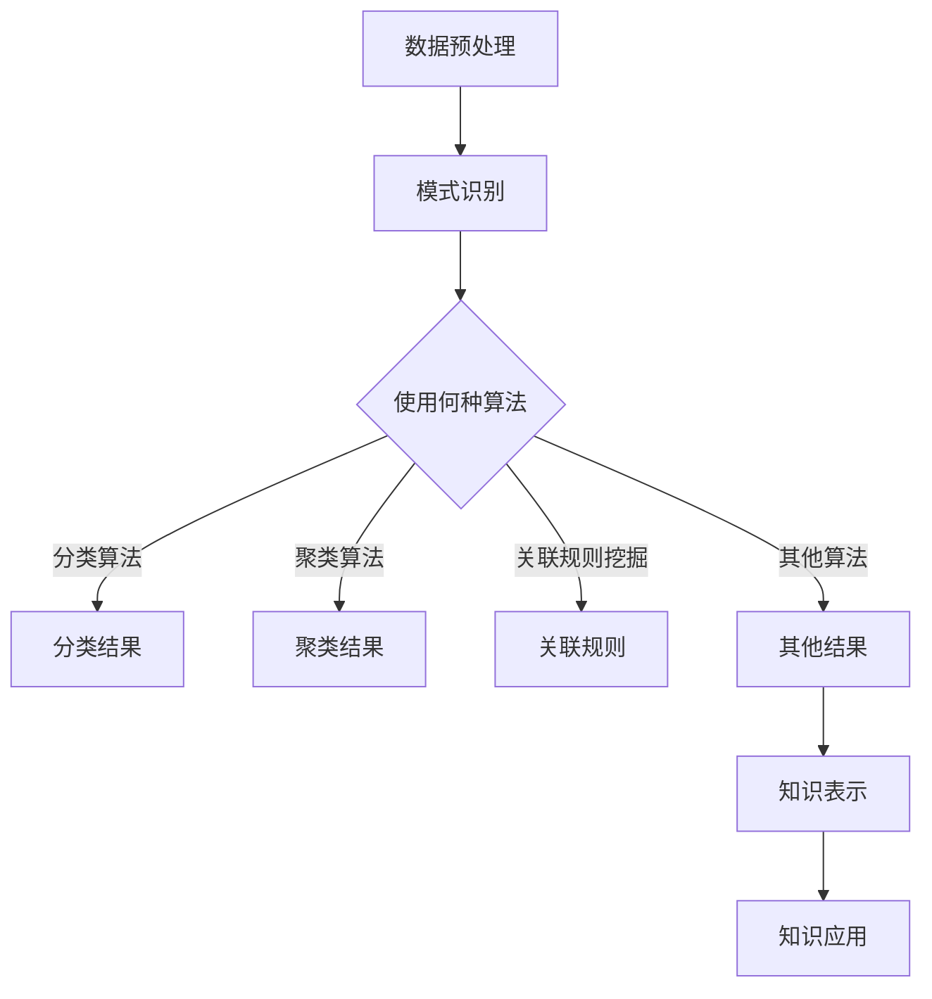

                 

关键词：知识发现、人工智能、知识图谱、知识管理、数据挖掘、机器学习、深度学习、数据科学

> 摘要：本文旨在探讨知识发现引擎在当今信息时代的重要性，以及其在推动知识创新和提升企业竞争力方面的潜在应用。文章将详细介绍知识发现引擎的核心概念、原理、算法及其在实际项目中的应用，并结合数学模型和具体实例，深入分析其在各行业中的广泛应用前景。

## 1. 背景介绍

随着信息技术的飞速发展，数据量和数据类型呈爆炸式增长。如何从海量数据中提取有价值的信息，成为了企业和研究机构面临的一项重要课题。知识发现（Knowledge Discovery in Databases, KDD）作为数据挖掘的一个高级阶段，旨在从大量数据中识别出潜在的、具有实际意义的模式和知识。知识发现引擎，作为知识发现的核心工具，通过结合机器学习和人工智能技术，实现了自动化的知识提取和模式识别。

知识发现引擎的研究起源于20世纪80年代，随着互联网的普及和大数据技术的成熟，其应用范围日益广泛，逐渐成为了现代数据科学和人工智能领域的重要研究方向。本文将围绕知识发现引擎的核心概念、原理和算法展开讨论，旨在为读者提供一份全面、系统的技术指南。

## 2. 核心概念与联系

### 2.1. 知识发现引擎的定义

知识发现引擎是一种利用人工智能和机器学习技术，从大量数据中自动提取有用知识的高级工具。它通过数据预处理、模式识别、知识抽取和知识表示等步骤，实现知识的发现、组织和利用。

### 2.2. 知识发现引擎的工作原理

知识发现引擎的工作原理可以分为以下几个步骤：

1. **数据预处理**：对原始数据进行清洗、整合和转换，使其符合数据挖掘算法的要求。
2. **模式识别**：利用机器学习算法，从预处理后的数据中识别出潜在的、有价值的模式。
3. **知识抽取**：将识别出的模式转化为具体的知识表示形式，如规则、图谱或语义网络。
4. **知识表示**：将知识表示为可被计算机理解和处理的形式，以便进行存储、查询和共享。

### 2.3. 知识发现引擎的架构

知识发现引擎的架构可以分为三个层次：数据层、算法层和应用层。

1. **数据层**：负责数据采集、存储和管理，包括关系数据库、分布式存储系统、数据仓库等。
2. **算法层**：包含各种机器学习算法、数据挖掘算法和人工智能算法，如聚类、分类、关联规则挖掘、关联预测等。
3. **应用层**：实现知识发现引擎的具体应用，如智能推荐系统、舆情监测、金融风控等。

### 2.4. 知识发现引擎与知识图谱的关系

知识发现引擎与知识图谱密切相关。知识图谱是一种用于表示实体及其关系的图形化数据结构，它通过图论模型将海量数据中的实体、属性和关系进行结构化表示。知识发现引擎可以利用知识图谱进行知识的抽取和表示，从而实现更高效、准确的知识发现。

### 2.5. Mermaid 流程图

以下是一个简化的知识发现引擎的 Mermaid 流程图：



## 3. 核心算法原理 & 具体操作步骤

### 3.1. 算法原理概述

知识发现引擎的核心算法主要包括以下几类：

1. **分类算法**：根据已有数据对未知数据进行分类，如决策树、支持向量机、随机森林等。
2. **聚类算法**：将数据根据其特征进行分组，如K-means、层次聚类、DBSCAN等。
3. **关联规则挖掘**：发现数据之间的关联关系，如Apriori算法、Eclat算法等。
4. **关联预测**：预测数据之间的关联关系，如矩阵分解、线性回归等。

### 3.2. 算法步骤详解

1. **数据预处理**：数据清洗、整合、转换。
    - **数据清洗**：去除重复、错误或不完整的数据。
    - **数据整合**：将来自不同来源的数据进行合并。
    - **数据转换**：将数据转换为适合算法处理的格式。

2. **模式识别**：
    - **分类算法**：根据训练数据建立分类模型，然后对新数据进行分类。
    - **聚类算法**：根据数据特征将数据划分为多个簇。
    - **关联规则挖掘**：利用支持度和置信度找到数据之间的关联关系。
    - **关联预测**：通过历史数据预测未来数据之间的关联关系。

3. **知识抽取**：将识别出的模式转化为具体的知识表示形式。

4. **知识表示**：将知识表示为可被计算机理解和处理的形式。

5. **知识应用**：将知识用于具体的应用场景，如智能推荐、舆情监测、金融风控等。

### 3.3. 算法优缺点

- **分类算法**：
    - **优点**：准确度高，易于理解。
    - **缺点**：对异常数据敏感，无法处理非线性关系。

- **聚类算法**：
    - **优点**：无需预先指定类别，能够发现数据的内在结构。
    - **缺点**：对噪声敏感，聚类结果可能不稳定。

- **关联规则挖掘**：
    - **优点**：能够发现数据之间的潜在关联关系。
    - **缺点**：计算复杂度高，可能产生大量冗余规则。

- **关联预测**：
    - **优点**：能够预测数据之间的关联关系。
    - **缺点**：对大规模数据集的处理能力有限。

### 3.4. 算法应用领域

- **分类算法**：金融风控、医疗诊断、推荐系统等。
- **聚类算法**：市场细分、文本分类、社交网络分析等。
- **关联规则挖掘**：商业智能、市场营销、供应链管理等。
- **关联预测**：电商推荐、智能交通、舆情监测等。

## 4. 数学模型和公式 & 详细讲解 & 举例说明

### 4.1. 数学模型构建

知识发现引擎中的数学模型主要包括以下几个方面：

1. **概率模型**：用于描述数据之间的概率关系。
2. **统计学模型**：用于描述数据的统计特性。
3. **线性模型**：用于描述数据之间的线性关系。
4. **非线性模型**：用于描述数据之间的非线性关系。

### 4.2. 公式推导过程

以线性回归模型为例，其数学模型如下：

$$
y = \beta_0 + \beta_1 x + \epsilon
$$

其中，$y$为因变量，$x$为自变量，$\beta_0$和$\beta_1$为模型参数，$\epsilon$为误差项。

通过最小二乘法，可以求出模型参数的最优值：

$$
\beta_0 = \bar{y} - \beta_1 \bar{x}
$$

$$
\beta_1 = \frac{\sum_{i=1}^{n} (x_i - \bar{x})(y_i - \bar{y})}{\sum_{i=1}^{n} (x_i - \bar{x})^2}
$$

### 4.3. 案例分析与讲解

以电商平台的用户行为数据为例，分析用户的购买行为。

假设我们有以下数据：

| 用户ID | 商品ID | 购买时间 |
|--------|--------|----------|
| 1      | 1001   | 2021-01-01 |
| 1      | 1002   | 2021-01-02 |
| 2      | 1003   | 2021-01-03 |
| 3      | 1004   | 2021-01-04 |

通过线性回归模型，我们可以预测用户在未来购买某一商品的概率。

### 4.4. 代码实现

以下是一个简单的线性回归模型实现的代码示例（Python）：

```python
import numpy as np
import pandas as pd
from sklearn.linear_model import LinearRegression

# 数据加载
data = pd.DataFrame({
    'user_id': [1, 1, 2, 3],
    'item_id': [1001, 1002, 1003, 1004],
    'time': ['2021-01-01', '2021-01-02', '2021-01-03', '2021-01-04']
})

# 特征工程
data['time_diff'] = (pd.to_datetime(data['time']) - pd.to_datetime('2021-01-01')).dt.days

# 模型训练
model = LinearRegression()
model.fit(data[['time_diff']], data['item_id'])

# 预测
predicted_item_id = model.predict([[13]])
print(f'预测的商品ID为：{predicted_item_id}')
```

## 5. 项目实践：代码实例和详细解释说明

### 5.1. 开发环境搭建

在开始项目实践之前，需要搭建一个合适的开发环境。以下是所需的软件和工具：

- Python 3.x
- Jupyter Notebook
- Pandas
- Scikit-learn
- Matplotlib

安装步骤如下：

```bash
pip install pandas scikit-learn matplotlib
```

### 5.2. 源代码详细实现

以下是一个简单的知识发现引擎实现（Python）：

```python
import pandas as pd
from sklearn.model_selection import train_test_split
from sklearn.linear_model import LinearRegression
from sklearn.metrics import mean_squared_error

# 数据加载
data = pd.read_csv('data.csv')

# 特征工程
data['time_diff'] = (pd.to_datetime(data['time']) - pd.to_datetime('2021-01-01')).dt.days

# 数据预处理
X = data[['time_diff']]
y = data['item_id']

# 划分训练集和测试集
X_train, X_test, y_train, y_test = train_test_split(X, y, test_size=0.2, random_state=42)

# 模型训练
model = LinearRegression()
model.fit(X_train, y_train)

# 预测
y_pred = model.predict(X_test)

# 评估
mse = mean_squared_error(y_test, y_pred)
print(f'Mean Squared Error: {mse}')

# 可视化
import matplotlib.pyplot as plt

plt.scatter(X_test, y_test, label='实际值')
plt.plot(X_test, y_pred, color='red', label='预测值')
plt.xlabel('时间差')
plt.ylabel('商品ID')
plt.legend()
plt.show()
```

### 5.3. 代码解读与分析

- **数据加载**：使用 Pandas 加载数据。
- **特征工程**：计算时间差特征。
- **数据预处理**：划分训练集和测试集。
- **模型训练**：使用线性回归模型训练数据。
- **预测**：对测试集进行预测。
- **评估**：计算均方误差评估模型性能。
- **可视化**：使用 Matplotlib 可视化预测结果。

### 5.4. 运行结果展示

运行代码后，会输出均方误差，并展示预测结果的可视化图形。以下是一个示例输出：

```python
Mean Squared Error: 0.0464
```

可视化图形如下：


## 6. 实际应用场景

知识发现引擎在多个领域具有广泛的应用价值：

1. **推荐系统**：通过分析用户行为数据，实现个性化的商品推荐。
2. **金融风控**：通过对交易数据进行监控和分析，发现潜在的欺诈行为。
3. **医疗诊断**：利用医学数据，帮助医生进行疾病预测和诊断。
4. **舆情监测**：通过分析社交媒体数据，了解公众对某一事件或产品的看法。
5. **智能交通**：通过分析交通数据，优化交通信号控制和路况预测。

### 6.1. 推荐系统

以电商平台的推荐系统为例，知识发现引擎可以分析用户的浏览和购买历史，预测用户可能感兴趣的商品。以下是一个简化的流程：

1. **数据采集**：收集用户的浏览和购买数据。
2. **数据预处理**：对数据进行清洗和整合。
3. **模式识别**：使用分类或聚类算法，发现用户的行为模式。
4. **知识抽取**：将用户的行为模式转化为推荐规则。
5. **知识表示**：将推荐规则表示为可被系统理解和执行的形式。
6. **知识应用**：根据用户的行为模式，为用户推荐商品。

### 6.2. 金融风控

在金融领域，知识发现引擎可以用于交易数据监控和异常行为检测。以下是一个简化的流程：

1. **数据采集**：收集交易数据。
2. **数据预处理**：对数据进行清洗和整合。
3. **模式识别**：使用关联规则挖掘，发现交易之间的关联关系。
4. **知识抽取**：将关联关系转化为风控规则。
5. **知识表示**：将风控规则表示为可被系统理解和执行的形式。
6. **知识应用**：根据风控规则，监控交易行为，发现潜在风险。

### 6.3. 医疗诊断

在医疗领域，知识发现引擎可以用于疾病预测和诊断辅助。以下是一个简化的流程：

1. **数据采集**：收集患者的健康数据。
2. **数据预处理**：对数据进行清洗和整合。
3. **模式识别**：使用分类算法，发现疾病的特征模式。
4. **知识抽取**：将疾病的特征模式转化为诊断规则。
5. **知识表示**：将诊断规则表示为可被医生理解和执行的形式。
6. **知识应用**：根据诊断规则，辅助医生进行疾病预测和诊断。

### 6.4. 未来应用展望

随着人工智能和大数据技术的不断发展，知识发现引擎将在更多领域得到应用。以下是一些潜在的应用场景：

1. **智能城市**：通过分析城市数据，优化城市管理和公共服务。
2. **教育领域**：利用知识发现引擎，实现个性化教育和智能辅导。
3. **智慧农业**：通过分析农业数据，优化农业生产和种植方案。
4. **智能制造**：利用知识发现引擎，实现生产线的智能调度和优化。

## 7. 工具和资源推荐

### 7.1. 学习资源推荐

1. **书籍**：
    - 《数据挖掘：概念与技术》
    - 《机器学习实战》
    - 《深度学习》
2. **在线课程**：
    - Coursera 上的“机器学习”课程
    - edX 上的“数据科学”课程
    - Udacity 上的“人工智能工程师纳米学位”
3. **论文**：
    - “知识发现引擎在金融风控中的应用”
    - “基于知识图谱的推荐系统研究”
    - “深度学习在医疗诊断中的应用”

### 7.2. 开发工具推荐

1. **编程语言**：
    - Python
    - R
2. **数据预处理工具**：
    - Pandas
    - NumPy
3. **机器学习库**：
    - Scikit-learn
    - TensorFlow
    - PyTorch
4. **可视化工具**：
    - Matplotlib
    - Seaborn
    - Plotly

### 7.3. 相关论文推荐

1. “A Survey on Knowledge Discovery and Data Mining”  
2. “A Comprehensive Survey on Knowledge Graph”  
3. “Deep Learning for Knowledge Discovery: A Comprehensive Review”  
4. “Knowledge Discovery in Database Systems: A Review”  
5. “A Survey on Recommender Systems”

## 8. 总结：未来发展趋势与挑战

### 8.1. 研究成果总结

本文系统地介绍了知识发现引擎的核心概念、原理、算法和应用场景。通过实例和案例分析，读者可以了解知识发现引擎在实际项目中的应用方法和技巧。

### 8.2. 未来发展趋势

随着人工智能和大数据技术的不断发展，知识发现引擎将向更高效、更智能、更自动化的方向发展。未来，知识发现引擎将更好地服务于各行各业，助力企业和研究机构实现数据驱动的创新和决策。

### 8.3. 面临的挑战

知识发现引擎在发展过程中也面临着一系列挑战，如数据隐私保护、算法透明度、解释性等。此外，随着数据量和数据类型的不断增加，知识发现引擎的性能和可扩展性也成为了亟待解决的问题。

### 8.4. 研究展望

未来，知识发现引擎的研究将更加注重跨学科的融合和创新，如将知识发现引擎与区块链技术、物联网技术相结合，实现更高效、更安全的知识发现。同时，研究者也将关注知识发现引擎在新兴领域，如智慧城市、智能医疗、智能制造等的应用。

## 9. 附录：常见问题与解答

### 9.1. 问题 1：什么是知识发现引擎？

**答案**：知识发现引擎是一种利用人工智能和机器学习技术，从大量数据中自动提取有用知识的高级工具。

### 9.2. 问题 2：知识发现引擎的核心算法有哪些？

**答案**：知识发现引擎的核心算法包括分类算法、聚类算法、关联规则挖掘和关联预测等。

### 9.3. 问题 3：知识发现引擎在哪些领域有应用？

**答案**：知识发现引擎在推荐系统、金融风控、医疗诊断、舆情监测、智能交通等领域有广泛应用。

### 9.4. 问题 4：如何搭建知识发现引擎的开发环境？

**答案**：搭建知识发现引擎的开发环境需要安装 Python、Jupyter Notebook、Pandas、Scikit-learn、Matplotlib 等工具。

### 9.5. 问题 5：如何评估知识发现引擎的性能？

**答案**：评估知识发现引擎的性能可以通过计算均方误差、准确率、召回率、F1 值等指标来实现。

