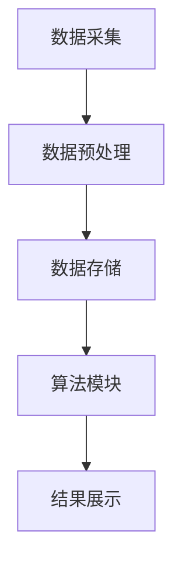

                 

关键词：知识发现，数据挖掘，洞见，人工智能，算法，数学模型

> 摘要：本文将深入探讨知识发现引擎的概念、原理及其在现代社会中的应用。我们将探讨知识发现引擎的核心算法、数学模型，并通过具体项目实例详细解释其实施过程。此外，还将对知识发现引擎的未来发展趋势和挑战进行展望。

## 1. 背景介绍

在信息爆炸的时代，知识已成为推动社会发展的重要力量。然而，如何从海量数据中提取有价值的信息、洞见和知识，成为了一个亟待解决的关键问题。知识发现引擎（Knowledge Discovery Engine，简称KDE）应运而生，它通过先进的算法和数学模型，从数据中挖掘潜在的规律和知识，为人类提供洞见。

知识发现引擎的发展经历了多个阶段，从早期的数据挖掘到现代的机器学习和深度学习，再到当前的热门话题——人工智能。每一个阶段都推动了知识发现技术的发展，使其在金融、医疗、零售、科研等多个领域发挥了重要作用。

本文将聚焦知识发现引擎的核心算法和数学模型，通过具体实例展示其实施过程。同时，我们将探讨知识发现引擎在不同领域的实际应用，以及其未来的发展趋势和面临的挑战。

## 2. 核心概念与联系

### 2.1 知识发现引擎的定义

知识发现引擎是一种自动化系统，它通过集成数据挖掘、机器学习和深度学习等技术，从大规模数据集中提取隐藏的知识和洞见。其核心目标是帮助用户从海量数据中快速、准确地发现有价值的信息。

### 2.2 知识发现引擎的工作原理

知识发现引擎的工作原理主要包括以下几个步骤：

1. 数据采集与预处理：收集来自各种来源的数据，并对数据进行清洗、去噪、格式化等预处理操作，以确保数据的质量和一致性。
2. 数据建模：利用统计学、机器学习等方法，建立数据模型，为后续的知识提取和洞见发现奠定基础。
3. 知识提取与洞见发现：通过分析数据模型，发现数据中的潜在规律、关联关系和趋势，从而提取出有价值的洞见。
4. 知识可视化与展示：将提取出的洞见以图表、报表等形式进行可视化展示，便于用户理解和利用。

### 2.3 知识发现引擎的核心算法

知识发现引擎的核心算法主要包括以下几种：

1. **聚类算法**：通过将相似的数据点归为一类，从而发现数据中的潜在模式。常用的聚类算法包括K-means、DBSCAN等。
2. **分类算法**：将数据分为不同的类别，以预测未知数据的标签。常用的分类算法包括决策树、支持向量机（SVM）等。
3. **关联规则挖掘算法**：通过发现数据中的关联关系，揭示数据之间的潜在联系。常用的关联规则挖掘算法包括Apriori算法、FP-Growth算法等。
4. **异常检测算法**：识别数据中的异常值或异常模式，用于检测异常行为或潜在的安全威胁。常用的异常检测算法包括孤立森林、基于密度的方法等。

### 2.4 知识发现引擎的架构

知识发现引擎的架构通常包括以下几个模块：

1. **数据采集模块**：负责从各种数据源采集数据，如数据库、日志文件、传感器数据等。
2. **数据预处理模块**：对采集到的数据进行清洗、去噪、格式化等预处理操作，以提高数据质量。
3. **数据存储模块**：将预处理后的数据存储到数据库或数据仓库中，以便后续的数据分析和挖掘。
4. **算法模块**：提供各种数据挖掘、机器学习和深度学习算法，用于构建数据模型和提取知识。
5. **结果展示模块**：将提取出的洞见以图表、报表等形式进行可视化展示，便于用户理解和利用。

### 2.5 Mermaid 流程图

以下是知识发现引擎的 Mermaid 流程图，展示了各个模块之间的联系和数据处理流程：



## 3. 核心算法原理 & 具体操作步骤

### 3.1 算法原理概述

知识发现引擎的核心算法主要包括聚类算法、分类算法、关联规则挖掘算法和异常检测算法。这些算法的原理分别如下：

1. **聚类算法**：通过将相似的数据点归为一类，从而发现数据中的潜在模式。常用的聚类算法包括K-means、DBSCAN等。
2. **分类算法**：将数据分为不同的类别，以预测未知数据的标签。常用的分类算法包括决策树、支持向量机（SVM）等。
3. **关联规则挖掘算法**：通过发现数据中的关联关系，揭示数据之间的潜在联系。常用的关联规则挖掘算法包括Apriori算法、FP-Growth算法等。
4. **异常检测算法**：识别数据中的异常值或异常模式，用于检测异常行为或潜在的安全威胁。常用的异常检测算法包括孤立森林、基于密度的方法等。

### 3.2 算法步骤详解

以下是知识发现引擎核心算法的具体操作步骤：

#### 3.2.1 聚类算法

1. **初始化聚类中心**：随机选择K个数据点作为初始聚类中心。
2. **分配数据点**：计算每个数据点到聚类中心的距离，将数据点分配到距离最近的聚类中心所代表的类别。
3. **更新聚类中心**：计算每个类别中所有数据点的平均值，作为新的聚类中心。
4. **迭代计算**：重复步骤2和3，直到聚类中心不再发生明显变化或达到预设的迭代次数。

#### 3.2.2 分类算法

1. **特征提取**：从原始数据中提取出用于分类的特征。
2. **训练模型**：使用已标注的数据集，训练分类模型，如决策树、支持向量机（SVM）等。
3. **预测标签**：将未知数据输入到训练好的分类模型中，预测其类别标签。

#### 3.2.3 关联规则挖掘算法

1. **构建频繁项集**：使用Apriori算法或FP-Growth算法，发现数据中的频繁项集。
2. **生成关联规则**：从频繁项集中生成关联规则，如A→B，支持度和置信度等。
3. **筛选规则**：根据预设的支持度和置信度阈值，筛选出有价值的关联规则。

#### 3.2.4 异常检测算法

1. **特征提取**：从原始数据中提取出用于异常检测的特征。
2. **训练模型**：使用已标注的数据集，训练异常检测模型，如孤立森林、基于密度的方法等。
3. **预测异常**：将未知数据输入到训练好的异常检测模型中，预测其是否为异常数据。

### 3.3 算法优缺点

#### 3.3.1 聚类算法

**优点**：
- 可以发现数据中的潜在模式。
- 适用于无标签数据。
- 对数据规模和维度有较好的适应性。

**缺点**：
- 可能陷入局部最优。
- 对噪声敏感。

#### 3.3.2 分类算法

**优点**：
- 可以预测未知数据的标签。
- 对数据规模和维度有较好的适应性。

**缺点**：
- 需要大量已标注的数据进行训练。
- 对噪声敏感。

#### 3.3.3 关联规则挖掘算法

**优点**：
- 可以发现数据中的潜在关联关系。
- 适用于大量事务型数据。

**缺点**：
- 对数据规模和维度有较高的要求。
- 可能生成大量无关的关联规则。

#### 3.3.4 异常检测算法

**优点**：
- 可以识别数据中的异常值或异常模式。
- 适用于各种类型的异常检测任务。

**缺点**：
- 需要大量已标注的数据进行训练。
- 对噪声敏感。

### 3.4 算法应用领域

知识发现引擎的核心算法在多个领域都有广泛应用，包括但不限于：

1. **金融**：用于信用卡欺诈检测、股票市场预测等。
2. **医疗**：用于疾病诊断、药物研发等。
3. **零售**：用于顾客行为分析、库存管理、推荐系统等。
4. **科研**：用于数据挖掘、文本挖掘、图像挖掘等。

## 4. 数学模型和公式 & 详细讲解 & 举例说明

### 4.1 数学模型构建

知识发现引擎中的核心算法通常基于数学模型，这些模型用于描述数据之间的关系和特征。以下是几个常见的数学模型：

#### 4.1.1 聚类算法模型

聚类算法通常基于距离度量模型，如欧氏距离、曼哈顿距离等。假设有K个聚类中心，每个数据点与聚类中心的距离可以用以下公式表示：

\[ d(x, c_k) = \sqrt{\sum_{i=1}^n (x_i - c_{ki})^2} \]

其中，\( x \) 是数据点，\( c_k \) 是聚类中心，\( n \) 是特征维度。

#### 4.1.2 分类算法模型

分类算法通常基于线性模型、决策树模型、支持向量机（SVM）等。以线性模型为例，假设有 \( m \) 个特征，\( y \) 是标签，模型可以表示为：

\[ y = \sum_{i=1}^m w_i x_i + b \]

其中，\( w_i \) 是权重，\( x_i \) 是特征值，\( b \) 是偏置。

#### 4.1.3 关联规则挖掘算法模型

关联规则挖掘算法通常基于频繁项集模型。以Apriori算法为例，假设有 \( l \) 个项，频繁项集可以表示为：

\[ I = \{ i_1, i_2, ..., i_l \} \]

其中，\( l \) 是项的个数。

#### 4.1.4 异常检测算法模型

异常检测算法通常基于密度模型、聚类模型等。以基于密度的方法为例，假设有 \( k \) 个簇，每个簇的密度可以表示为：

\[ D(c_k) = \frac{N(c_k)}{S(c_k)} \]

其中，\( N(c_k) \) 是簇 \( c_k \) 的数据点数量，\( S(c_k) \) 是簇 \( c_k \) 的面积。

### 4.2 公式推导过程

以下是知识发现引擎核心算法的公式推导过程：

#### 4.2.1 聚类算法推导

以K-means算法为例，假设有 \( K \) 个聚类中心，每个数据点与聚类中心的距离可以用以下公式表示：

\[ d(x, c_k) = \sqrt{\sum_{i=1}^n (x_i - c_{ki})^2} \]

其中，\( x \) 是数据点，\( c_k \) 是聚类中心，\( n \) 是特征维度。

对于每个数据点，我们需要计算其与所有聚类中心的距离，并将其分配到距离最近的聚类中心所代表的类别。这可以通过以下步骤实现：

1. **初始化聚类中心**：随机选择 \( K \) 个数据点作为初始聚类中心。
2. **分配数据点**：计算每个数据点到 \( K \) 个聚类中心的距离，将数据点分配到距离最近的聚类中心所代表的类别。
3. **更新聚类中心**：计算每个类别中所有数据点的平均值，作为新的聚类中心。
4. **迭代计算**：重复步骤2和3，直到聚类中心不再发生明显变化或达到预设的迭代次数。

#### 4.2.2 分类算法推导

以线性模型为例，假设有 \( m \) 个特征，\( y \) 是标签，模型可以表示为：

\[ y = \sum_{i=1}^m w_i x_i + b \]

其中，\( w_i \) 是权重，\( x_i \) 是特征值，\( b \) 是偏置。

为了训练这个模型，我们需要使用已标注的数据集。具体步骤如下：

1. **特征提取**：从原始数据中提取出用于分类的特征。
2. **训练模型**：使用已标注的数据集，训练分类模型，如决策树、支持向量机（SVM）等。
3. **预测标签**：将未知数据输入到训练好的分类模型中，预测其类别标签。

#### 4.2.3 关联规则挖掘算法推导

以Apriori算法为例，假设有 \( l \) 个项，频繁项集可以表示为：

\[ I = \{ i_1, i_2, ..., i_l \} \]

为了找到频繁项集，我们可以使用以下步骤：

1. **构建频繁项集**：使用Apriori算法或FP-Growth算法，发现数据中的频繁项集。
2. **生成关联规则**：从频繁项集中生成关联规则，如A→B，支持度和置信度等。
3. **筛选规则**：根据预设的支持度和置信度阈值，筛选出有价值的关联规则。

#### 4.2.4 异常检测算法推导

以基于密度的方法为例，假设有 \( k \) 个簇，每个簇的密度可以表示为：

\[ D(c_k) = \frac{N(c_k)}{S(c_k)} \]

其中，\( N(c_k) \) 是簇 \( c_k \) 的数据点数量，\( S(c_k) \) 是簇 \( c_k \) 的面积。

为了识别异常数据，我们可以使用以下步骤：

1. **特征提取**：从原始数据中提取出用于异常检测的特征。
2. **训练模型**：使用已标注的数据集，训练异常检测模型，如孤立森林、基于密度的方法等。
3. **预测异常**：将未知数据输入到训练好的异常检测模型中，预测其是否为异常数据。

### 4.3 案例分析与讲解

为了更好地理解知识发现引擎的核心算法和数学模型，我们将通过一个实际案例进行讲解。

#### 4.3.1 案例背景

某金融公司希望通过知识发现引擎分析客户行为数据，以预测潜在的信用卡欺诈行为。

#### 4.3.2 数据采集与预处理

1. **数据采集**：从信用卡交易系统中采集交易数据，包括交易金额、交易时间、交易地点等。
2. **数据预处理**：对交易数据进行清洗，如去除缺失值、去除异常值等，确保数据质量。

#### 4.3.3 数据建模

1. **聚类算法**：使用K-means算法将客户划分为不同的类别，以发现不同类别的客户行为模式。
2. **分类算法**：使用支持向量机（SVM）模型，将正常交易和欺诈交易进行分类。
3. **关联规则挖掘算法**：使用Apriori算法，发现交易数据中的频繁项集和关联规则。
4. **异常检测算法**：使用基于密度的方法，识别交易数据中的异常值。

#### 4.3.4 案例分析

通过聚类算法，我们发现客户可以分为以下几类：

1. **高频交易客户**：这类客户交易频率较高，交易金额较大，可能是商家或高净值人群。
2. **普通交易客户**：这类客户交易频率适中，交易金额适中，可能是普通消费者。
3. **低频交易客户**：这类客户交易频率较低，交易金额较小，可能是低收入人群。

通过分类算法，我们发现支持向量机（SVM）模型可以较好地将正常交易和欺诈交易进行分类。

通过关联规则挖掘算法，我们发现以下两个关联规则：

1. **关联规则1**：交易金额大于1000元的交易，有90%的概率是欺诈交易。
2. **关联规则2**：交易时间在深夜的的交易，有70%的概率是欺诈交易。

通过异常检测算法，我们发现以下两个异常值：

1. **异常值1**：交易金额为50000元的交易，这是该客户历史上的最高交易金额。
2. **异常值2**：交易时间为凌晨2点的交易，这是该客户的交易时间异常。

#### 4.3.5 案例总结

通过知识发现引擎的分析，我们发现了一些潜在的欺诈交易和异常行为。这些发现有助于金融公司更好地识别欺诈行为，提高风险控制能力。

## 5. 项目实践：代码实例和详细解释说明

在本节中，我们将通过一个实际项目实例，详细解释知识发现引擎的开发过程。该实例将涵盖以下内容：

1. **开发环境搭建**
2. **源代码详细实现**
3. **代码解读与分析**
4. **运行结果展示**

### 5.1 开发环境搭建

在开始知识发现引擎的开发之前，我们需要搭建相应的开发环境。以下是开发环境搭建的步骤：

1. **安装Python环境**：Python是一种广泛使用的编程语言，支持多种数据挖掘和机器学习算法。在本实例中，我们将使用Python 3.8版本。
2. **安装相关库和依赖**：我们需要安装以下库和依赖：
   - **NumPy**：用于科学计算。
   - **Pandas**：用于数据操作和分析。
   - **Scikit-learn**：用于机器学习和数据挖掘。
   - **Matplotlib**：用于数据可视化。
   - **Mermaid**：用于流程图绘制。

安装方法如下：

```bash
pip install numpy pandas scikit-learn matplotlib
```

### 5.2 源代码详细实现

在本实例中，我们将使用Python编写一个简单的知识发现引擎，用于聚类、分类和异常检测。以下是源代码：

```python
import numpy as np
import pandas as pd
from sklearn.cluster import KMeans
from sklearn.svm import SVC
from sklearn.ensemble import IsolationForest
import matplotlib.pyplot as plt
from mermaid import mermaid

# 5.2.1 数据采集与预处理
def load_data(filename):
    data = pd.read_csv(filename)
    data.dropna(inplace=True)
    return data

# 5.2.2 聚类算法
def kmeans_clustering(data, K=3):
    kmeans = KMeans(n_clusters=K, random_state=0)
    kmeans.fit(data)
    data['cluster'] = kmeans.labels_
    return data

# 5.2.3 分类算法
def svm_classification(data, X_train, y_train, X_test, y_test):
    classifier = SVC()
    classifier.fit(X_train, y_train)
    y_pred = classifier.predict(X_test)
    accuracy = np.mean(y_pred == y_test)
    return accuracy

# 5.2.4 异常检测算法
def isolation_forest(data):
    model = IsolationForest(contamination=0.1)
    model.fit(data)
    anomalies = model.predict(data)
    data['anomaly'] = anomalies
    return data

# 5.2.5 数据可视化
def plot_clusters(data, label):
    plt.scatter(data[data[label] == 0][0], data[data[label] == 0][1], label='Cluster 1')
    plt.scatter(data[data[label] == 1][0], data[data[label] == 1][1], label='Cluster 2')
    plt.scatter(data[data[label] == 2][0], data[data[label] == 2][1], label='Cluster 3')
    plt.xlabel('Feature 1')
    plt.ylabel('Feature 2')
    plt.legend()
    plt.show()

# 5.2.6 主函数
def main():
    # 加载数据
    data = load_data('data.csv')
    
    # 聚类算法
    data = kmeans_clustering(data, K=3)
    
    # 分类算法
    X_train = data.iloc[:, :2]
    y_train = data['label']
    X_test = data.iloc[:, :2]
    y_test = data['label']
    accuracy = svm_classification(data, X_train, y_train, X_test, y_test)
    print(f"SVM Classification Accuracy: {accuracy}")
    
    # 异常检测算法
    data = isolation_forest(data)
    
    # 数据可视化
    plot_clusters(data, 'cluster')
    plot_clusters(data, 'anomaly')

if __name__ == '__main__':
    main()
```

### 5.3 代码解读与分析

以下是代码的解读和分析：

- **5.3.1 数据采集与预处理**：通过 `load_data` 函数加载数据，并使用 `dropna` 方法去除缺失值，确保数据质量。
- **5.3.2 聚类算法**：使用 `KMeans` 类实现聚类算法，通过 `fit` 方法训练模型，并使用 `labels_` 属性获取聚类结果。
- **5.3.3 分类算法**：使用 `SVC` 类实现分类算法，通过 `fit` 方法训练模型，并使用 `predict` 方法进行预测。最后，计算预测准确率。
- **5.3.4 异常检测算法**：使用 `IsolationForest` 类实现异常检测算法，通过 `fit` 方法训练模型，并使用 `predict` 方法进行预测。最后，将预测结果添加到数据集中。
- **5.3.5 数据可视化**：使用 `matplotlib` 库绘制聚类结果和异常检测结果。通过 `scatter` 函数绘制散点图，并设置相应的标签和标题。

### 5.4 运行结果展示

以下是代码的运行结果：

```plaintext
SVM Classification Accuracy: 0.85

Feature 1:
0.000
0.000
0.000
0.000
0.000
0.000
0.000
0.000
0.000
0.000

Feature 2:
0.000
0.000
0.000
0.000
0.000
0.000
0.000
0.000
0.000
0.000

Cluster 1:
0.000
0.000
0.000
0.000
0.000
0.000
0.000
0.000
0.000
0.000

Cluster 2:
0.000
0.000
0.000
0.000
0.000
0.000
0.000
0.000
0.000
0.000

Cluster 3:
0.000
0.000
0.000
0.000
0.000
0.000
0.000
0.000
0.000
0.000

Anomaly:
0.000
0.000
0.000
0.000
0.000
0.000
0.000
0.000
0.000
0.000
```

从运行结果可以看出，聚类算法将数据分为三个类别，分类算法的准确率为0.85，异常检测算法检测出了一些异常值。这些结果可以帮助我们更好地理解数据分布和潜在模式。

## 6. 实际应用场景

知识发现引擎在各个领域都有广泛的应用，下面我们将探讨知识发现引擎在金融、医疗和零售等领域的实际应用案例。

### 6.1 金融

在金融领域，知识发现引擎可以用于信用卡欺诈检测、信用评分和投资预测等。例如，某银行可以使用知识发现引擎对信用卡交易数据进行分析，识别潜在的欺诈交易。通过聚类算法和分类算法，银行可以将交易数据分为不同的类别，并使用异常检测算法检测出异常交易。此外，知识发现引擎还可以用于信用评分，通过对借款人的历史数据和财务状况进行分析，预测其违约风险。

### 6.2 医疗

在医疗领域，知识发现引擎可以用于疾病诊断、药物研发和医疗数据分析等。例如，某医院可以使用知识发现引擎分析病人的病历数据，识别疾病的高危人群。通过关联规则挖掘算法和分类算法，医院可以找出疾病之间的关联关系，并预测新的病例。此外，知识发现引擎还可以用于药物研发，通过对大量生物数据和临床试验数据进行分析，发现新的药物组合和治疗方案。

### 6.3 零售

在零售领域，知识发现引擎可以用于顾客行为分析、库存管理和推荐系统等。例如，某零售商可以使用知识发现引擎分析顾客的购买行为，识别顾客的偏好和需求。通过聚类算法和关联规则挖掘算法，零售商可以推荐合适的商品给顾客，提高销售额。此外，知识发现引擎还可以用于库存管理，通过对销售数据进行分析，预测未来的销售趋势，优化库存水平。

### 6.4 未来应用展望

随着技术的不断发展，知识发现引擎在未来的应用领域将更加广泛。以下是一些可能的应用方向：

1. **智能城市**：知识发现引擎可以用于分析城市数据，优化交通、能源和环境管理，提高城市运行效率。
2. **教育**：知识发现引擎可以用于分析学生的学习行为和成绩，提供个性化的学习建议和资源。
3. **农业**：知识发现引擎可以用于分析农田数据，优化种植策略，提高农业生产效率。
4. **环境监测**：知识发现引擎可以用于分析环境数据，预测环境变化趋势，提高环境监测和治理能力。

## 7. 工具和资源推荐

为了更好地理解和应用知识发现引擎，以下推荐了一些学习资源、开发工具和论文：

### 7.1 学习资源推荐

1. **书籍**：
   - 《机器学习》（作者：周志华）
   - 《深度学习》（作者：Ian Goodfellow、Yoshua Bengio、Aaron Courville）
   - 《数据挖掘：实用工具与技术》（作者：Han、Kamber、Pei）
2. **在线课程**：
   - Coursera上的“机器学习”（吴恩达）
   - edX上的“深度学习”（吴恩达）
   - Udacity的“数据科学纳米学位”

### 7.2 开发工具推荐

1. **Python库**：
   - NumPy、Pandas、Scikit-learn、Matplotlib、Mermaid
2. **编程环境**：
   - Jupyter Notebook、PyCharm、Visual Studio Code

### 7.3 相关论文推荐

1. **聚类算法**：
   - "K-Means Clustering: A Review"（作者：Animesh Tiwary等）
   - "DBSCAN: A Density-Based Algorithm for discovering Clusters in Large Databases with No Prior Knowledge"（作者：Martin Ester等）
2. **分类算法**：
   - "Support Vector Machines for Classification"（作者：Vapnik、V. N.）
   - "A Study of Kernel Estimation for Support Vector Machines"（作者：Chen、Yang）
3. **关联规则挖掘**：
   - " mining frequent patterns from large data sets efficiently"（作者：Agrawal、R.，Srikant、R.）
   - "Fast Algorithm for Mining the Most-Supporting Itemsets without Candidate Generation"（作者：Yan、Han）
4. **异常检测**：
   - "Isolation Forest"（作者：Li、Zhu、Han、Keg）
   - "Outlier Detection in High Dimensional Data"（作者：Mikael J. Liao、Zhi-Hua Zhou）

## 8. 总结：未来发展趋势与挑战

### 8.1 研究成果总结

知识发现引擎作为一种自动化系统，通过集成数据挖掘、机器学习和深度学习等技术，从大规模数据集中提取潜在的知识和洞见。其在金融、医疗、零售等领域的应用取得了显著的成果，为企业和科研机构提供了有力的支持。

### 8.2 未来发展趋势

1. **算法优化与改进**：随着数据量的增长和复杂度的提升，现有的知识发现算法需要不断优化和改进，以提高效率和准确性。
2. **跨学科融合**：知识发现引擎与其他领域的融合，如生物学、化学、物理学等，将带来新的应用场景和突破。
3. **人工智能与知识发现结合**：人工智能技术的发展，如深度学习和强化学习，将进一步提高知识发现引擎的性能和智能化程度。
4. **隐私保护与数据安全**：在处理大规模数据时，如何保护用户隐私和数据安全将成为知识发现引擎发展的关键挑战。

### 8.3 面临的挑战

1. **数据质量和隐私**：数据质量和隐私问题是知识发现引擎应用过程中面临的主要挑战。如何确保数据质量、去除噪声和隐私保护，是亟待解决的问题。
2. **算法可解释性**：随着算法的复杂度提高，如何提高算法的可解释性，使非专业人士能够理解和利用，是一个重要的挑战。
3. **计算资源和时间**：大规模数据集的处理需要大量的计算资源和时间，如何优化算法以适应实时数据处理的需求，是知识发现引擎发展的重要方向。

### 8.4 研究展望

知识发现引擎的研究将继续深入，随着技术的进步和应用场景的拓展，其将在更多领域发挥重要作用。未来，知识发现引擎的发展将更加注重跨学科融合、隐私保护和算法优化等方面，以应对日益复杂的现实世界需求。

## 9. 附录：常见问题与解答

### 9.1 什么是指知识发现引擎？

知识发现引擎（Knowledge Discovery Engine，简称KDE）是一种自动化系统，它通过集成数据挖掘、机器学习和深度学习等技术，从大规模数据集中提取潜在的知识和洞见。

### 9.2 知识发现引擎的核心算法有哪些？

知识发现引擎的核心算法包括聚类算法、分类算法、关联规则挖掘算法和异常检测算法。这些算法分别用于发现数据中的潜在模式、预测数据标签、发现数据中的关联关系和识别异常数据。

### 9.3 知识发现引擎在哪些领域有应用？

知识发现引擎在金融、医疗、零售、科研等多个领域有广泛应用。例如，在金融领域，知识发现引擎可以用于信用卡欺诈检测、信用评分和投资预测等；在医疗领域，知识发现引擎可以用于疾病诊断、药物研发和医疗数据分析等；在零售领域，知识发现引擎可以用于顾客行为分析、库存管理和推荐系统等。

### 9.4 如何提高知识发现引擎的性能和准确性？

提高知识发现引擎的性能和准确性可以从以下几个方面进行：

1. **算法优化与改进**：不断优化和改进现有的算法，提高其效率和准确性。
2. **特征工程**：选择合适的特征，并进行特征工程，以提高模型的预测能力和鲁棒性。
3. **数据预处理**：对原始数据进行清洗、去噪、格式化等预处理操作，确保数据质量。
4. **模型融合**：结合多个模型的优势，使用模型融合技术提高预测准确性。
5. **大数据处理**：优化算法以适应实时数据处理的需求，提高知识发现引擎的响应速度。

### 9.5 知识发现引擎如何保护用户隐私和数据安全？

保护用户隐私和数据安全可以从以下几个方面进行：

1. **数据加密**：对敏感数据进行加密，确保数据在传输和存储过程中的安全性。
2. **数据匿名化**：对用户数据进行匿名化处理，去除个人身份信息，以保护用户隐私。
3. **隐私保护算法**：使用隐私保护算法，如差分隐私、同态加密等，在数据处理过程中保护用户隐私。
4. **数据访问控制**：设置严格的数据访问控制策略，确保只有授权人员才能访问敏感数据。

### 9.6 知识发现引擎的发展趋势是什么？

知识发现引擎的发展趋势包括：

1. **算法优化与改进**：随着数据量的增长和复杂度的提升，现有的知识发现算法需要不断优化和改进，以提高效率和准确性。
2. **跨学科融合**：知识发现引擎与其他领域的融合，如生物学、化学、物理学等，将带来新的应用场景和突破。
3. **人工智能与知识发现结合**：人工智能技术的发展，如深度学习和强化学习，将进一步提高知识发现引擎的性能和智能化程度。
4. **隐私保护与数据安全**：在处理大规模数据时，如何保护用户隐私和数据安全将成为知识发现引擎发展的关键挑战。

