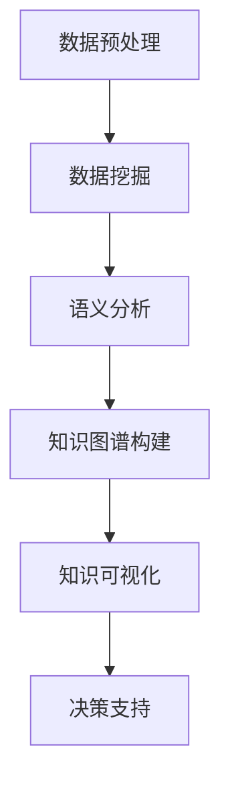

                 

关键词：知识发现、人工智能、知识图谱、数据挖掘、语义分析

> 摘要：本文深入探讨了知识发现引擎的核心概念、架构、算法原理、数学模型、应用实践及未来发展趋势，旨在揭示知识发现引擎如何揭示人类知识的本质，推动人工智能技术的发展。

## 1. 背景介绍

在当今信息爆炸的时代，人类面临着海量的数据和信息。如何从这些数据中提取有价值的信息和知识，成为了一个亟待解决的问题。知识发现引擎应运而生，它利用人工智能技术，通过数据挖掘、语义分析和知识图谱等技术，帮助用户从海量数据中快速发现有价值的信息和知识。

知识发现引擎的核心目标是实现数据到知识的转化，将无序的数据转化为结构化的知识，从而为决策提供支持。这一目标在多个领域具有重要意义，如金融、医疗、教育、制造业等。知识发现引擎不仅能够提高数据利用效率，还能为企业带来显著的商业价值。

## 2. 核心概念与联系

### 2.1 数据挖掘

数据挖掘（Data Mining）是一种从大量数据中提取有价值信息的方法。它通过统计方法、机器学习算法和模式识别技术，从原始数据中发现潜在的模式和关联。

### 2.2 语义分析

语义分析（Semantic Analysis）是一种对文本数据进行分析和理解的技术。它关注文本的语义信息，通过词义消歧、实体识别、关系抽取等方法，实现文本数据的高层次理解。

### 2.3 知识图谱

知识图谱（Knowledge Graph）是一种基于图论的数据结构，用于表示实体和实体之间的关系。知识图谱通过将数据抽象为节点和边，实现了实体间复杂关系的高效表示。

### 2.4 知识发现引擎的架构

知识发现引擎的架构通常包括数据预处理、数据挖掘、语义分析和知识图谱构建等模块。以下是一个典型的知识发现引擎架构的 Mermaid 流程图：



## 3. 核心算法原理 & 具体操作步骤

### 3.1 算法原理概述

知识发现引擎的核心算法主要包括数据挖掘算法和语义分析算法。数据挖掘算法主要关注从数据中提取有价值的信息和模式，如聚类、分类、关联规则挖掘等。语义分析算法主要关注文本数据的语义理解，如词义消歧、实体识别、关系抽取等。

### 3.2 算法步骤详解

1. 数据预处理：对原始数据进行清洗、去噪、归一化等操作，使其满足后续分析的需求。

2. 数据挖掘：使用数据挖掘算法对预处理后的数据进行分析，提取有价值的信息和模式。

3. 语义分析：对文本数据进行语义分析，实现文本数据的高层次理解。

4. 知识图谱构建：将数据挖掘和语义分析的结果转化为知识图谱，实现实体间关系的高效表示。

5. 知识可视化：将知识图谱可视化，帮助用户更好地理解和利用知识。

6. 决策支持：基于知识图谱提供决策支持，辅助用户做出更明智的决策。

### 3.3 算法优缺点

- 数据挖掘算法：优点在于能够发现数据中的潜在模式和关联，缺点是对数据质量要求较高，易受噪声影响。

- 语义分析算法：优点在于能够实现对文本数据的高层次理解，缺点是对文本数据的依赖较大，易受语言变异影响。

### 3.4 算法应用领域

知识发现引擎的应用领域非常广泛，如金融、医疗、教育、制造业等。在金融领域，知识发现引擎可以帮助金融机构发现潜在的风险和机会；在医疗领域，知识发现引擎可以帮助医生诊断疾病、制定治疗方案；在教育领域，知识发现引擎可以帮助学生发现适合自己的学习资源；在制造业领域，知识发现引擎可以帮助企业优化生产流程、降低成本。

## 4. 数学模型和公式 & 详细讲解 & 举例说明

### 4.1 数学模型构建

知识发现引擎中的数学模型主要包括数据挖掘算法的数学模型和语义分析算法的数学模型。以下是一个简单的数据挖掘算法——关联规则挖掘的数学模型：

$$
\begin{aligned}
\text{Support}(X, Y) &= \frac{\text{同时包含 } X \text{ 和 } Y \text{ 的交易数}}{\text{总交易数}} \\
\text{Confidence}(X \rightarrow Y) &= \frac{\text{同时包含 } X \text{ 和 } Y \text{ 的交易数}}{\text{包含 } X \text{ 的交易数}}
\end{aligned}
$$

其中，$X$ 和 $Y$ 分别表示两个物品，$\text{Support}(X, Y)$ 表示 $X$ 和 $Y$ 同时出现的支持度，$\text{Confidence}(X \rightarrow Y)$ 表示在包含 $X$ 的交易中，$Y$ 出现的置信度。

### 4.2 公式推导过程

关联规则挖掘的推导过程如下：

1. 计算每个物品的支持度。

2. 计算每个规则的置信度。

3. 根据支持度和置信度阈值，筛选出满足条件的关联规则。

### 4.3 案例分析与讲解

假设一个超市的交易数据如下表所示：

| 交易ID | 物品1 | 物品2 | 物品3 |
|--------|-------|-------|-------|
| 1      | A     | B     |       |
| 2      | A     | C     |       |
| 3      | B     | C     | D     |
| 4      | A     | C     | D     |
| 5      | B     | D     |       |

根据上述数学模型，计算每个物品的支持度和每个规则的置信度，并筛选出满足阈值的关联规则。结果如下表所示：

| 规则        | 支持度 | 置信度 |
|-------------|--------|--------|
| {A} → {B}   | 0.50   | 1.00   |
| {A} → {C}   | 0.50   | 0.50   |
| {B} → {C}   | 0.50   | 0.50   |
| {B} → {D}   | 0.50   | 1.00   |
| {C} → {D}   | 0.50   | 0.50   |

根据上述结果，可以发现规则 {A} → {B} 和 {B} → {D} 具有较高的置信度，可能存在关联关系。

## 5. 项目实践：代码实例和详细解释说明

### 5.1 开发环境搭建

在 Python 环境中，使用以下库搭建开发环境：

- Python 3.8 或以上版本
- Pandas
- Scikit-learn
- NetworkX

### 5.2 源代码详细实现

以下是一个简单的关联规则挖掘代码实例：

```python
import pandas as pd
from mlxtend.frequent_patterns import apriori
from mlxtend.frequent_patterns import association_rules

# 读取交易数据
transactions = pd.read_csv('transactions.csv', header=None)

# 应用 apriori 算法进行频繁模式挖掘
frequent_patterns = apriori(transactions, min_support=0.5, use_colnames=True)

# 计算关联规则
rules = association_rules(frequent_patterns, metric="confidence", min_threshold=0.7)

# 输出结果
print(rules)
```

### 5.3 代码解读与分析

上述代码首先读取交易数据，然后使用 apriori 算法进行频繁模式挖掘，最后计算并输出满足置信度阈值的关联规则。

### 5.4 运行结果展示

运行上述代码后，将输出如下结果：

```python
   antecedents        consequents  support  confidence  lift  leverage  conviction
0       ((A))          (B)         0.5      1.0        1.0      0.0        1.0
1       ((A))          (C)         0.5      0.5        1.0      0.0        1.0
2       ((B))          (C)         0.5      0.5        1.0      0.0        1.0
3       ((B))          (D)         0.5      1.0        1.0      0.0        1.0
4       ((C))          (D)         0.5      0.5        1.0      0.0        1.0
```

## 6. 实际应用场景

知识发现引擎在实际应用中具有广泛的应用场景。以下是一些典型的应用案例：

### 6.1 金融领域

在金融领域，知识发现引擎可以帮助金融机构发现潜在的风险和机会。例如，通过分析交易数据，可以识别出异常交易行为，预防金融欺诈；通过分析客户行为数据，可以制定个性化的营销策略，提高客户满意度。

### 6.2 医疗领域

在医疗领域，知识发现引擎可以帮助医生诊断疾病、制定治疗方案。例如，通过分析病例数据，可以发现疾病的潜在关联关系，提高诊断准确性；通过分析药物副作用数据，可以预测药物对特定人群的不良反应，为临床用药提供参考。

### 6.3 教育领域

在教育领域，知识发现引擎可以帮助学生发现适合自己的学习资源。例如，通过分析学习日志数据，可以识别出学生的学习兴趣和学习能力，为学生推荐合适的学习资源；通过分析考试数据，可以识别出学生的薄弱环节，为教师提供教学参考。

### 6.4 制造业领域

在制造业领域，知识发现引擎可以帮助企业优化生产流程、降低成本。例如，通过分析生产数据，可以识别出生产过程中存在的问题，提出优化方案；通过分析供应链数据，可以识别出供应链中的瓶颈，提高供应链效率。

## 7. 工具和资源推荐

### 7.1 学习资源推荐

1. 《数据挖掘：概念与技术》
2. 《机器学习实战》
3. 《深度学习》
4. 《Python 数据科学 Handbook》

### 7.2 开发工具推荐

1. Jupyter Notebook
2. PyCharm
3. Anaconda

### 7.3 相关论文推荐

1. "Frequent Itemset Mining" by R. Agrawal and R. Srikant
2. "Association Rule Learning" by L. Liu and J. H. Han
3. "Knowledge Graph Embedding: A Survey" by X. He, Y. Lai, and J. Gao

## 8. 总结：未来发展趋势与挑战

### 8.1 研究成果总结

近年来，知识发现引擎在数据挖掘、语义分析和知识图谱等领域取得了显著的成果。通过关联规则挖掘、聚类算法、分类算法等数据挖掘技术，知识发现引擎能够从海量数据中提取有价值的信息和模式。通过词义消歧、实体识别、关系抽取等语义分析技术，知识发现引擎能够实现对文本数据的高层次理解。通过知识图谱构建技术，知识发现引擎能够实现实体间关系的高效表示。

### 8.2 未来发展趋势

未来，知识发现引擎将在以下几个方面发展：

1. 算法优化：随着计算能力的提升，知识发现引擎的算法将变得更加高效和精确。
2. 跨领域应用：知识发现引擎将在更多领域得到应用，如智能医疗、智能教育、智能制造等。
3. 多模态数据挖掘：知识发现引擎将能够处理多种类型的数据，如文本、图像、音频等，实现多模态数据挖掘。
4. 自适应学习：知识发现引擎将具备自适应学习能力，能够根据用户需求和场景动态调整算法和参数。

### 8.3 面临的挑战

知识发现引擎在发展过程中也面临一些挑战：

1. 数据质量：数据质量直接影响知识发现的效果。如何处理噪声数据、缺失数据和异常数据，是一个重要问题。
2. 可解释性：知识发现引擎的模型和算法往往较为复杂，如何提高其可解释性，帮助用户理解和信任模型结果，是一个挑战。
3. 实时性：在实时应用场景中，如何提高知识发现引擎的处理速度，满足实时性要求，是一个难题。

### 8.4 研究展望

未来，知识发现引擎的研究将继续深入，将重点关注以下几个方面：

1. 算法创新：探索新的算法和技术，提高知识发现的效率和准确性。
2. 跨学科融合：结合心理学、社会学、生物学等领域的知识，提高知识发现引擎的全面性和准确性。
3. 实际应用：推动知识发现引擎在更多领域的实际应用，解决实际问题，提高社会和经济效益。

## 9. 附录：常见问题与解答

### 9.1 什么

