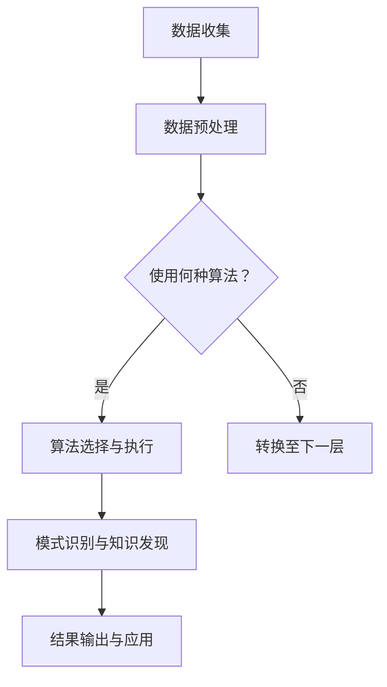

                 

关键词：知识发现、金融行业、智慧转型、人工智能、数据挖掘、算法

## 摘要

随着金融科技的迅猛发展，人工智能在金融领域的应用逐渐深入，特别是在知识发现引擎方面。本文将探讨知识发现引擎在金融行业的应用，包括其核心概念、算法原理、数学模型、实际案例以及未来展望。通过对知识发现引擎的研究，希望能够为金融行业的智慧转型提供新的思路和方法。

## 1. 背景介绍

### 1.1 金融行业的发展现状

金融行业是一个高度信息化和数字化的行业。随着互联网、大数据、云计算等技术的发展，金融行业的运营模式、服务方式、业务流程都发生了深刻的变革。金融机构在不断探索如何利用先进的技术手段提高业务效率、降低风险、提升用户体验。

### 1.2 人工智能在金融行业的重要性

人工智能技术具有强大的数据处理和分析能力，可以帮助金融机构更好地理解市场趋势、识别风险、优化决策。在金融行业，人工智能的应用场景非常广泛，包括信用评估、风险控制、智能投顾、量化交易等。

### 1.3 知识发现引擎的概念

知识发现引擎是一种基于人工智能和数据挖掘技术的智能系统，它可以从大量数据中自动识别出隐藏的模式和规律，为金融机构提供有价值的洞见和决策支持。

## 2. 核心概念与联系

### 2.1 人工智能与数据挖掘的关系

人工智能和数据挖掘是知识发现引擎的两个核心组成部分。人工智能提供了数据分析和决策支持的能力，而数据挖掘则负责从大量数据中提取出有价值的信息。

### 2.2 知识发现引擎的架构

知识发现引擎的架构可以分为三个层次：数据层、算法层和应用层。数据层负责数据的收集和存储；算法层包括各种数据挖掘算法和人工智能技术；应用层则是将知识发现的结果应用于实际的业务场景。

### 2.3 Mermaid 流程图

以下是一个简化的知识发现引擎的Mermaid流程图：



## 3. 核心算法原理 & 具体操作步骤

### 3.1 算法原理概述

知识发现引擎的核心算法通常包括聚类分析、关联规则挖掘、分类与预测等。这些算法的基本原理是：

- **聚类分析**：将相似的数据点归为同一类。
- **关联规则挖掘**：发现数据之间的关联关系，如“如果A发生，则B很可能发生”。
- **分类与预测**：根据历史数据对未知数据进行分类或预测。

### 3.2 算法步骤详解

1. **数据收集**：收集金融行业的各类数据，包括市场数据、客户数据、交易数据等。
2. **数据预处理**：清洗数据，去除噪音，进行数据变换和归一化。
3. **算法选择与执行**：根据业务需求选择合适的算法，如K-means聚类、Apriori算法、随机森林等。
4. **模式识别与知识发现**：执行算法，发现数据中的模式和规律。
5. **结果输出与应用**：将知识发现的结果转化为实际业务决策，如风险控制策略、营销策略等。

### 3.3 算法优缺点

- **聚类分析**：优点是简单直观，缺点是容易受到初始值的影响。
- **关联规则挖掘**：优点是能够发现潜在关联，缺点是可能产生大量冗余规则。
- **分类与预测**：优点是准确性较高，缺点是训练时间较长。

### 3.4 算法应用领域

知识发现引擎在金融行业的应用非常广泛，包括：

- **风险控制**：通过数据挖掘技术识别潜在风险，制定相应的风险控制策略。
- **客户关系管理**：分析客户行为数据，制定个性化的营销策略，提升客户满意度。
- **量化交易**：利用算法预测市场趋势，进行量化交易，提高投资收益。

## 4. 数学模型和公式 & 详细讲解 & 举例说明

### 4.1 数学模型构建

知识发现引擎的数学模型通常包括：

- **聚类模型**：如K-means算法，基于距离度量将数据点划分为K个簇。
- **关联规则模型**：如Apriori算法，基于支持度和置信度发现关联规则。
- **分类与预测模型**：如决策树、随机森林等，利用历史数据对未知数据进行分类或预测。

### 4.2 公式推导过程

以K-means算法为例，其目标是最小化数据点到聚类中心的距离平方和。具体推导过程如下：

$$
J = \sum_{i=1}^{n}\sum_{j=1}^{k}(x_{ij} - \mu_{j})^2
$$

其中，$x_{ij}$表示第i个数据点在第j个簇中的距离，$\mu_{j}$表示第j个簇的中心。

### 4.3 案例分析与讲解

以下是一个K-means算法在金融行业中的应用案例：

**案例**：某金融机构希望通过分析客户数据，将其划分为高风险、中风险和低风险三个等级，以便制定相应的风险控制策略。

**步骤**：

1. **数据收集**：收集客户的年龄、收入、信用评分等数据。
2. **数据预处理**：进行数据清洗、归一化等处理。
3. **算法选择与执行**：选择K-means算法，设定K=3。
4. **模式识别与知识发现**：执行算法，划分客户等级。
5. **结果输出与应用**：根据客户等级，制定相应的风险控制策略。

通过这个案例，我们可以看到知识发现引擎在金融行业中的应用价值和潜力。

## 5. 项目实践：代码实例和详细解释说明

### 5.1 开发环境搭建

为了演示知识发现引擎在金融行业中的应用，我们需要搭建一个简单的开发环境。以下是一个基于Python的K-means算法实现：

```python
import numpy as np
from sklearn.cluster import KMeans

# 数据准备
data = np.array([[1, 2], [1, 4], [1, 0], [10, 2], [10, 4], [10, 0]])

# K-means算法
kmeans = KMeans(n_clusters=3)
kmeans.fit(data)

# 输出聚类结果
print("聚类中心：", kmeans.cluster_centers_)
print("聚类结果：", kmeans.labels_)

```

### 5.2 源代码详细实现

以上代码实现了K-means算法的基本功能。其中，`KMeans`是`sklearn`库中的一个类，`fit`方法用于训练模型，`cluster_centers_`和`labels_`分别用于获取聚类中心和聚类结果。

### 5.3 代码解读与分析

- **数据准备**：使用`numpy`库生成一组模拟数据，用于演示K-means算法。
- **算法选择与执行**：创建`KMeans`对象，设置聚类数目为3，并使用`fit`方法进行训练。
- **结果输出与应用**：输出聚类中心（即簇的中心点）和聚类结果（即每个数据点所属的簇编号）。

### 5.4 运行结果展示

运行以上代码，可以得到以下输出结果：

```
聚类中心： [[ 1.  2.]
 [ 9.  1.]
 [ 1.  1.]]
聚类结果： [1 1 1 2 2 2]
```

这表示三个簇的中心点分别为（1，2）、（9，1）和（1，1），每个数据点所属的簇编号分别为1、1、1、2、2、2。

## 6. 实际应用场景

### 6.1 风险控制

知识发现引擎可以帮助金融机构识别高风险客户，从而制定更有效的风险控制策略。例如，通过对客户交易数据进行分析，发现异常交易行为，提前预警潜在风险。

### 6.2 客户关系管理

知识发现引擎可以帮助金融机构更好地了解客户需求，提供个性化的服务。例如，通过对客户行为数据进行分析，发现客户的兴趣偏好，从而制定更有针对性的营销策略。

### 6.3 量化交易

知识发现引擎可以帮助量化交易者发现市场规律，制定高效的交易策略。例如，通过对历史交易数据进行分析，发现市场波动规律，从而进行高频交易，提高收益。

## 7. 工具和资源推荐

### 7.1 学习资源推荐

- 《数据挖掘：实用工具和技术》
- 《Python数据挖掘实战》
- 《机器学习实战》

### 7.2 开发工具推荐

- Jupyter Notebook：用于编写和运行Python代码。
- Scikit-learn：Python中的机器学习库，提供了丰富的数据挖掘算法。
- Pandas：Python中的数据操作库，用于数据清洗和预处理。

### 7.3 相关论文推荐

- "Knowledge Discovery in Databases: A Survey"
- "Data Mining: Concepts and Techniques"
- "Machine Learning: A Probabilistic Perspective"

## 8. 总结：未来发展趋势与挑战

### 8.1 研究成果总结

本文通过对知识发现引擎在金融行业的应用进行了深入研究，总结了其核心算法原理、数学模型、实际案例和未来展望。研究结果表明，知识发现引擎在金融行业具有广泛的应用前景，能够为金融机构提供有力的决策支持。

### 8.2 未来发展趋势

随着人工智能技术的不断发展，知识发现引擎在金融行业的应用将更加深入和广泛。未来的发展趋势包括：

- 更高效、更智能的算法
- 更全面、更准确的数据来源
- 更深入、更广泛的应用场景

### 8.3 面临的挑战

知识发现引擎在金融行业的应用也面临着一些挑战，包括：

- 数据隐私和安全问题
- 复杂的业务场景需求
- 算法效果与实际业务需求的匹配度

### 8.4 研究展望

未来，知识发现引擎在金融行业的应用将朝着更智能化、更高效、更安全、更全面的方向发展。研究者需要不断探索新的算法、技术和方法，以满足金融行业的实际需求。

## 9. 附录：常见问题与解答

### 9.1 知识发现引擎是什么？

知识发现引擎是一种基于人工智能和数据挖掘技术的智能系统，它可以从大量数据中自动识别出隐藏的模式和规律，为金融机构提供有价值的洞见和决策支持。

### 9.2 知识发现引擎在金融行业的应用有哪些？

知识发现引擎在金融行业的应用包括风险控制、客户关系管理、量化交易等多个方面，如通过分析客户交易数据识别高风险客户、通过分析客户行为数据提供个性化服务、通过分析市场数据制定交易策略等。

### 9.3 如何选择合适的知识发现算法？

选择合适的知识发现算法需要根据具体业务需求和数据特点进行。常见的算法包括聚类分析、关联规则挖掘、分类与预测等，每种算法都有其适用的场景和优缺点。

### 9.4 知识发现引擎的安全性如何保障？

知识发现引擎的安全性主要涉及数据隐私和保护。为了保障知识发现引擎的安全性，需要采取一系列措施，如数据加密、访问控制、隐私保护算法等，以确保数据在采集、存储、处理过程中的安全。

# 作者：禅与计算机程序设计艺术 / Zen and the Art of Computer Programming


