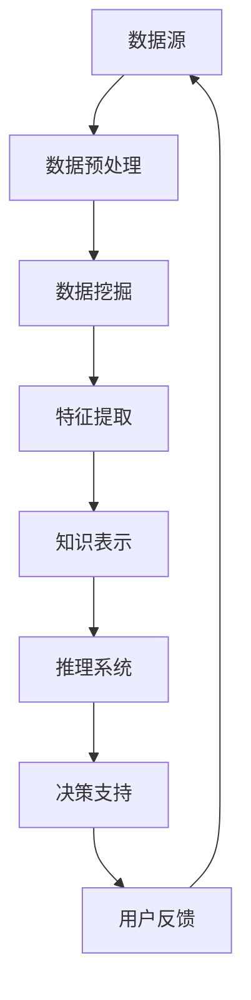

                 

在当今这个数据爆炸的时代，信息过载已成为人们日常生活中不可避免的问题。教育领域同样面临着海量的教育资源和学习资料，如何有效地从这些海量数据中提取有用信息，辅助教育工作者和学生提高学习效率和质量，成为了一个亟待解决的关键问题。知识发现引擎正是为了应对这一挑战而诞生的，它是教育领域的一把利器，也是智慧教育的有力支撑。

本文将探讨知识发现引擎在教育领域中的应用，从背景介绍、核心概念与联系、核心算法原理、数学模型与公式、项目实践、实际应用场景、未来应用展望、工具和资源推荐、总结与展望等多个方面，全面解析知识发现引擎在教育领域的潜力和价值。

## 关键词

知识发现引擎、教育、数据分析、学习效率、智慧教育、算法、数学模型、项目实践

## 摘要

本文旨在探讨知识发现引擎在教育领域中的应用，通过对其核心概念、算法原理、数学模型和实际项目实践的深入分析，揭示知识发现引擎在提高教育质量和效率方面的巨大潜力。文章首先介绍了知识发现引擎的背景和重要性，随后详细阐述了其核心概念、算法原理和数学模型，并通过具体项目实践展示了知识发现引擎的实际应用效果。最后，文章对知识发现引擎在教育领域的未来应用前景进行了展望，并提出了相关工具和资源的推荐。

## 1. 背景介绍

随着互联网的普及和大数据技术的快速发展，教育领域的数据量呈现爆发式增长。这些数据不仅包括学生的学习成绩、学习进度、学习偏好等，还涵盖了教师的教学方法、教学内容、教学效果等多个维度。如何从这些海量数据中提取有用信息，为教育工作者和学生提供个性化的学习支持，成为了一个重要的研究方向。

知识发现引擎正是为了解决这一挑战而诞生的。知识发现引擎是一种基于数据挖掘和机器学习技术的智能系统，它能够自动地从大量数据中提取出隐藏的模式和知识，帮助人们更好地理解和利用数据。在教育领域，知识发现引擎可以应用于学生个性化学习推荐、教学资源优化、学习行为分析等多个方面，从而提高教育质量和效率。

知识发现引擎在教育领域的应用不仅有助于解决信息过载问题，还能够提供更加精准和个性化的学习支持，使得教育更加智能化和高效化。随着人工智能技术的不断发展和大数据技术的深入应用，知识发现引擎在教育领域的应用前景将越来越广阔。

### 1.1 知识发现引擎的定义与核心概念

知识发现引擎（Knowledge Discovery Engine，简称KDE）是一种能够自动从大量数据中提取有用信息和知识的智能系统。其核心概念包括数据挖掘、机器学习、知识表示和推理等多个方面。

首先，数据挖掘（Data Mining）是知识发现引擎的基础。数据挖掘是一种通过统计学、机器学习和人工智能方法从大量数据中提取有价值信息的技术。它包括数据预处理、模式识别、特征提取和知识表示等多个环节。通过数据挖掘，知识发现引擎可以从教育数据中提取出隐藏的模式和趋势，从而为教育工作者提供决策支持。

其次，机器学习（Machine Learning）是知识发现引擎的核心技术之一。机器学习是一种让计算机从数据中学习并自动改进的方法。在教育领域，机器学习可以应用于学生个性化学习推荐、学习行为分析、智能评估等多个方面。例如，通过分析学生的学习数据，机器学习算法可以预测学生的未来学习表现，从而为教师提供有针对性的教学建议。

此外，知识表示和推理（Knowledge Representation and Reasoning）是知识发现引擎的重要组成部分。知识表示是将知识以某种形式表达和存储的过程，而推理则是基于已有知识进行逻辑推理的过程。在教育领域，知识表示和推理可以帮助教育工作者更好地理解和利用学生数据，从而提高教学效果。

综上所述，知识发现引擎是一种多学科交叉的智能系统，它通过数据挖掘、机器学习和知识表示等技术的综合运用，从教育数据中提取出有用知识，为教育工作者和学生提供个性化的学习支持。

### 1.2 知识发现引擎在教育领域的应用

知识发现引擎在教育领域的应用非常广泛，主要包括以下几个方面：

#### 1.2.1 学生个性化学习推荐

学生个性化学习推荐是知识发现引擎在教育领域最重要的应用之一。通过分析学生的行为数据、学习进度和成绩等，知识发现引擎可以为学生推荐最适合的学习资源和教学方法。例如，对于某个学生在某个知识点上的学习表现较差，知识发现引擎可以推荐相关的补充教程或学习资源，帮助学生更好地理解和掌握知识点。

#### 1.2.2 教学资源优化

知识发现引擎可以帮助教育工作者更好地管理和利用教学资源。通过分析教学资源的使用情况、学生的反馈和学习效果，知识发现引擎可以识别出哪些资源是最受欢迎和有效的，从而为教育工作者提供优化教学资源的建议。

#### 1.2.3 学习行为分析

知识发现引擎可以实时监测和记录学生的学习行为，从而帮助教育工作者更好地了解学生的学习状态和需求。通过分析学生的学习行为数据，知识发现引擎可以识别出学生的学习习惯、兴趣点和难点，为教育工作者提供针对性的教学支持和干预措施。

#### 1.2.4 智能评估

知识发现引擎还可以应用于学生的智能评估。通过分析学生的学习数据，知识发现引擎可以预测学生的未来学习表现，为教育工作者提供更准确和全面的评估结果。此外，知识发现引擎还可以根据学生的不同特点和学习需求，为学生制定个性化的学习计划和发展目标。

总之，知识发现引擎在教育领域的应用具有广泛的前景和巨大的潜力。通过数据挖掘、机器学习和知识表示等技术的综合运用，知识发现引擎可以帮助教育工作者更好地理解和利用教育数据，从而提高教学质量和效率。

### 1.3 知识发现引擎的发展历程

知识发现引擎的发展历程可以追溯到20世纪80年代，当时的数据挖掘技术和人工智能技术刚刚开始兴起。早期的知识发现引擎主要是基于统计学方法和规则系统的，主要用于商业和金融领域的数据分析。随着互联网和大数据技术的快速发展，知识发现引擎逐渐在各个领域得到广泛应用。

#### 1.3.1 数据挖掘与知识发现

数据挖掘（Data Mining）是知识发现引擎的核心技术之一。1980年代初，数据库技术和统计学方法的发展为数据挖掘提供了技术基础。1986年，Peter N. Bennett等人首次提出了“知识发现”（Knowledge Discovery in Databases，简称KDD）的概念，标志着知识发现引擎正式进入学术界和工业界。

#### 1.3.2 机器学习与人工智能

机器学习（Machine Learning）是知识发现引擎的重要支撑技术。20世纪50年代，人工智能（Artificial Intelligence，简称AI）开始兴起，机器学习作为AI的一个重要分支也逐渐发展起来。随着深度学习和强化学习等先进算法的出现，机器学习技术为知识发现引擎提供了更强的数据处理和分析能力。

#### 1.3.3 大数据和云计算

大数据（Big Data）和云计算（Cloud Computing）的兴起为知识发现引擎的发展提供了新的契机。大数据技术使得知识发现引擎可以处理和分析海量的数据，而云计算技术则提供了强大的计算资源和存储能力，使得知识发现引擎可以更加高效地运行和部署。

#### 1.3.4 教育领域的发展

在知识发现引擎的发展历程中，教育领域一直是一个重要的应用领域。早期的知识发现引擎主要用于学习行为分析和教学资源优化，随着人工智能技术的不断进步，知识发现引擎在教育领域的应用范围也越来越广泛，包括学生个性化学习推荐、学习行为监测、智能评估等多个方面。

综上所述，知识发现引擎的发展历程是一个不断融合和创新的过程。随着大数据、云计算和人工智能技术的不断发展，知识发现引擎在教育领域的应用前景将越来越广阔。

## 2. 核心概念与联系

### 2.1 数据挖掘与机器学习

数据挖掘（Data Mining）和机器学习（Machine Learning）是知识发现引擎的两个核心概念，它们相互关联，共同构成了知识发现引擎的技术基础。

数据挖掘是一种从大量数据中提取有用信息和知识的方法，它包括数据预处理、模式识别、特征提取和知识表示等多个环节。数据挖掘的目标是通过分析数据，发现数据之间的潜在关系和模式，从而为决策提供支持。

机器学习则是一种让计算机从数据中学习并自动改进的方法。机器学习算法通过训练数据集，学习数据的规律和特征，从而实现对未知数据的预测和分类。机器学习可以看作是数据挖掘的一种具体实现方式，它在知识发现引擎中发挥着至关重要的作用。

### 2.2 知识表示与推理

知识表示（Knowledge Representation）是将知识以某种形式表达和存储的过程，它是知识发现引擎的重要组成部分。知识表示的方法包括符号表示、语义网络、本体论等多个方面。

推理（Reasoning）则是基于已有知识进行逻辑推理的过程。在知识发现引擎中，推理可以帮助教育工作者更好地理解和利用学生数据，从而提高教学效果。例如，通过推理，知识发现引擎可以识别出学生的学习习惯、兴趣点和难点，为教育工作者提供针对性的教学建议。

### 2.3 Mermaid 流程图

下面是一个使用Mermaid绘制的知识发现引擎的核心概念流程图：



在这个流程图中，数据源是知识发现引擎的起点，经过数据预处理、数据挖掘、特征提取、知识表示和推理系统等多个环节，最终为用户提供决策支持。用户反馈则可以进一步优化知识发现引擎的性能，形成一个闭环系统。

## 3. 核心算法原理 & 具体操作步骤

### 3.1 算法原理概述

知识发现引擎的核心算法包括数据挖掘算法、机器学习算法和知识表示算法。这些算法共同协作，实现从海量教育数据中提取有用信息的目标。

#### 3.1.1 数据挖掘算法

数据挖掘算法是知识发现引擎的基础。常见的数据挖掘算法包括分类算法、聚类算法、关联规则挖掘算法和异常检测算法等。

- **分类算法**：通过训练数据集，学习数据之间的分类规则，从而对未知数据进行分类。常见的分类算法包括决策树、支持向量机（SVM）和随机森林等。
- **聚类算法**：将相似的数据归为一类，从而发现数据中的隐含结构。常见的聚类算法包括K均值聚类、层次聚类和DBSCAN等。
- **关联规则挖掘算法**：通过分析数据之间的关联关系，发现数据中的规律和模式。常见的关联规则挖掘算法包括Apriori算法和FP-growth算法等。
- **异常检测算法**：识别数据中的异常值，从而发现潜在的异常情况。常见的异常检测算法包括孤立森林（Isolation Forest）和局部异常因子（LOF）等。

#### 3.1.2 机器学习算法

机器学习算法是知识发现引擎的核心技术之一，它通过训练数据集，学习数据的特征和规律，从而实现对未知数据的预测和分类。

- **监督学习算法**：通过训练数据集，学习数据之间的分类规则，从而对未知数据进行分类。常见的监督学习算法包括线性回归、逻辑回归和支持向量机（SVM）等。
- **无监督学习算法**：通过分析数据之间的相似性，发现数据中的隐含结构。常见无监督学习算法包括K均值聚类、层次聚类和主成分分析（PCA）等。
- **深度学习算法**：通过多层神经网络，学习数据的复杂特征和模式。常见的深度学习算法包括卷积神经网络（CNN）、循环神经网络（RNN）和生成对抗网络（GAN）等。

#### 3.1.3 知识表示算法

知识表示算法是将数据转换为可理解的知识的过程。常见的知识表示算法包括符号表示、语义网络和本体论等。

- **符号表示**：将知识以符号的形式表达，例如使用逻辑表达式或规则表示知识。
- **语义网络**：使用节点和边表示实体及其关系，例如使用OWL（Web Ontology Language）表示知识。
- **本体论**：定义领域内的概念及其关系，用于知识表示和推理。

### 3.2 算法步骤详解

知识发现引擎的具体操作步骤可以分为以下几个阶段：

#### 3.2.1 数据采集

首先，从各种数据源采集教育数据，包括学生成绩、学习行为、教师教学数据等。这些数据可以是结构化的（如数据库）或非结构化的（如图像、音频和文本）。

#### 3.2.2 数据预处理

对采集到的数据进行清洗、转换和归一化等预处理操作，以提高数据的质量和一致性。数据预处理包括以下几个步骤：

1. **数据清洗**：去除重复数据、空值和异常值等，确保数据的质量。
2. **数据转换**：将不同类型的数据转换为统一的格式，例如将文本数据转换为数值表示。
3. **数据归一化**：对数据进行归一化处理，使其具有相同的量纲和范围，以便进行后续分析。

#### 3.2.3 数据挖掘

利用数据挖掘算法对预处理后的数据进行挖掘，提取数据中的模式和知识。具体步骤如下：

1. **特征提取**：从原始数据中提取出有助于数据挖掘的特征。
2. **模式识别**：使用分类、聚类和关联规则挖掘算法，识别数据中的潜在模式。
3. **知识表示**：将挖掘出的知识以符号表示、语义网络或本体论的形式进行表示。

#### 3.2.4 知识表示与推理

将挖掘出的知识进行表示和推理，以支持教育决策。具体步骤如下：

1. **知识表示**：使用符号表示、语义网络或本体论将知识表示出来。
2. **推理系统**：基于已有的知识进行逻辑推理，为教育工作者提供决策支持。

#### 3.2.5 用户反馈与优化

根据用户反馈对知识发现引擎进行优化和调整，以提高其性能和适用性。具体步骤如下：

1. **用户反馈**：收集用户对知识发现引擎的使用反馈，包括准确性、实用性等方面的评价。
2. **优化调整**：根据用户反馈，对知识发现引擎的算法、参数和知识库进行优化和调整。

### 3.3 算法优缺点

知识发现引擎的算法具有以下优缺点：

#### 优点：

1. **自动化**：知识发现引擎可以自动地从海量数据中提取有用信息，减少了人工干预的需求。
2. **个性化**：通过分析学生行为和学习数据，知识发现引擎可以提供个性化的学习支持，提高学习效率和质量。
3. **实时性**：知识发现引擎可以实时分析学生的学习数据，为教育工作者提供及时的教学建议和支持。
4. **综合性**：知识发现引擎综合运用了数据挖掘、机器学习和知识表示等多种技术，具有较高的适用性和灵活性。

#### 缺点：

1. **数据依赖性**：知识发现引擎的性能依赖于数据的质量和数量，数据的质量和完整性对算法的效果有重要影响。
2. **解释性不足**：一些复杂的机器学习算法，如深度学习，由于其内部机制复杂，难以解释其结果，导致教育工作者难以理解和使用。
3. **计算成本高**：大规模数据分析和机器学习算法通常需要较高的计算资源和时间成本，特别是在处理海量数据时。

### 3.4 算法应用领域

知识发现引擎在教育领域的应用非常广泛，涵盖了学生个性化学习推荐、教学资源优化、学习行为分析、智能评估等多个方面。以下是一些具体的应用案例：

#### 3.4.1 学生个性化学习推荐

通过分析学生的学习数据，知识发现引擎可以为学生推荐最适合的学习资源和教学方法。例如，对于某个学生在某个知识点上的学习表现较差，知识发现引擎可以推荐相关的补充教程或学习资源，帮助学生更好地理解和掌握知识点。

#### 3.4.2 教学资源优化

知识发现引擎可以帮助教育工作者更好地管理和利用教学资源。通过分析教学资源的使用情况、学生的反馈和学习效果，知识发现引擎可以识别出哪些资源是最受欢迎和有效的，从而为教育工作者提供优化教学资源的建议。

#### 3.4.3 学习行为分析

知识发现引擎可以实时监测和记录学生的学习行为，从而帮助教育工作者更好地了解学生的学习状态和需求。通过分析学生的学习行为数据，知识发现引擎可以识别出学生的学习习惯、兴趣点和难点，为教育工作者提供针对性的教学支持和干预措施。

#### 3.4.4 智能评估

知识发现引擎可以应用于学生的智能评估。通过分析学生的学习数据，知识发现引擎可以预测学生的未来学习表现，为教育工作者提供更准确和全面的评估结果。此外，知识发现引擎还可以根据学生的不同特点和学习需求，为学生制定个性化的学习计划和发展目标。

综上所述，知识发现引擎在教育领域的应用具有广泛的前景和巨大的潜力。通过数据挖掘、机器学习和知识表示等技术的综合运用，知识发现引擎可以帮助教育工作者更好地理解和利用教育数据，从而提高教学质量和效率。

## 4. 数学模型和公式 & 详细讲解 & 举例说明

### 4.1 数学模型构建

知识发现引擎在教育领域的应用涉及到多个数学模型，主要包括回归模型、聚类模型和关联规则模型等。这些模型通过对数据进行分析和建模，能够提取出隐藏在数据中的有用信息和知识。

#### 4.1.1 回归模型

回归模型用于预测一个或多个因变量与自变量之间的关系。在教育领域，回归模型可以用于预测学生的学习成绩、学习进度等。一个简单的线性回归模型可以表示为：

$$
y = \beta_0 + \beta_1 \cdot x_1 + \beta_2 \cdot x_2 + ... + \beta_n \cdot x_n
$$

其中，\( y \) 是因变量，\( x_1, x_2, ..., x_n \) 是自变量，\( \beta_0, \beta_1, ..., \beta_n \) 是模型参数。

#### 4.1.2 聚类模型

聚类模型用于将数据分成若干个类别，以便发现数据中的隐含结构。一个常用的聚类算法是K均值聚类，其数学模型可以表示为：

$$
C = \{ C_1, C_2, ..., C_k \}
$$

其中，\( C \) 是聚类结果，\( C_i \) 是第 \( i \) 个簇，聚类中心可以表示为：

$$
\mu_i = \frac{1}{N_i} \sum_{x \in C_i} x
$$

其中，\( N_i \) 是簇 \( C_i \) 中的数据点数量。

#### 4.1.3 关联规则模型

关联规则模型用于发现数据之间的关联关系，其基本思想是找到频繁项集，并从中提取关联规则。一个简单的关联规则可以表示为：

$$
X \rightarrow Y, \text{support} = \frac{|\{x, y\}|}{|D|}
$$

其中，\( X \) 和 \( Y \) 是两个项集，\( D \) 是数据集，\( support \) 是规则的支持度。

### 4.2 公式推导过程

以下是对知识发现引擎中常用数学公式的推导过程：

#### 4.2.1 线性回归模型的推导

线性回归模型是通过最小二乘法来拟合数据的一个统计模型。给定一组数据点 \( (x_i, y_i) \)，线性回归模型的目标是最小化误差平方和：

$$
\min \sum_{i=1}^{n} (y_i - \beta_0 - \beta_1 x_i)^2
$$

对该目标函数求导并令其导数为零，可以得到：

$$
\frac{\partial}{\partial \beta_0} \sum_{i=1}^{n} (y_i - \beta_0 - \beta_1 x_i)^2 = 0
$$

$$
\frac{\partial}{\partial \beta_1} \sum_{i=1}^{n} (y_i - \beta_0 - \beta_1 x_i)^2 = 0
$$

通过求解上述方程组，可以得到线性回归模型的参数 \( \beta_0 \) 和 \( \beta_1 \)：

$$
\beta_0 = \bar{y} - \beta_1 \bar{x}
$$

$$
\beta_1 = \frac{\sum_{i=1}^{n} (x_i - \bar{x})(y_i - \bar{y})}{\sum_{i=1}^{n} (x_i - \bar{x})^2}
$$

#### 4.2.2 K均值聚类的推导

K均值聚类是一种基于距离度量的聚类算法。给定一个数据集 \( D \) 和聚类个数 \( k \)，算法的目标是找到一个聚类中心 \( \mu_i \)，使得每个数据点到聚类中心的距离之和最小。

对于第 \( i \) 个簇，其聚类中心可以表示为：

$$
\mu_i = \frac{1}{N_i} \sum_{x \in C_i} x
$$

其中，\( N_i \) 是簇 \( C_i \) 中的数据点数量。

在每次迭代中，算法首先计算每个数据点到聚类中心的距离，并根据最小距离将数据点归为相应的簇。然后，重新计算每个簇的聚类中心。这个过程不断迭代，直到聚类中心的变化小于某个阈值或达到最大迭代次数。

#### 4.2.3 关联规则的推导

关联规则挖掘是基于频繁项集的。给定一个数据集 \( D \) 和最小支持度 \( \min\_support \)，算法首先找出所有的频繁项集，然后从中提取关联规则。

一个项集 \( X \) 的支持度定义为：

$$
\text{support}(X) = \frac{|\{x, y\}|}{|D|}
$$

其中，\( D \) 是数据集，\( x \) 和 \( y \) 是两个项。

给定最小支持度 \( \min\_support \)，如果一个项集 \( X \) 的支持度大于 \( \min\_support \)，则 \( X \) 是一个频繁项集。

从频繁项集中提取关联规则的方法通常使用Apriori算法。Apriori算法的基本思想是，如果一个项集是频繁的，那么它的所有子集也一定是频繁的。算法首先找出所有的频繁项集，然后从这些频繁项集中提取关联规则。

### 4.3 案例分析与讲解

以下是一个关于知识发现引擎在教育领域应用的案例分析和讲解：

#### 4.3.1 案例背景

假设有一个教育机构，其学生数据包括学习成绩、学习时长、作业完成情况等多个方面。机构希望利用知识发现引擎，分析学生的数据，为学生提供个性化的学习支持。

#### 4.3.2 数据预处理

首先，对学生的数据进行清洗和预处理，包括去除重复数据、填补空值和缺失值等。然后，将不同类型的数据转换为统一的格式，例如将文本数据转换为数值表示。

#### 4.3.3 数据挖掘

使用回归模型分析学生的学习成绩与学习时长、作业完成情况等之间的关系。具体步骤如下：

1. **特征提取**：从原始数据中提取出有助于预测学习成绩的特征，例如学习时长、作业完成情况等。
2. **模型训练**：使用训练数据集，训练线性回归模型，预测学生的考试成绩。
3. **模型评估**：使用测试数据集，评估模型的准确性和可靠性。

#### 4.3.4 知识表示与推理

将挖掘出的知识以符号表示或语义网络的形式进行表示，以便教育工作者更好地理解和利用。例如，可以将学生的考试成绩、学习时长和作业完成情况等以符号的形式表示出来，并利用推理系统为学生提供个性化的学习建议。

#### 4.3.5 用户反馈与优化

根据教育工作者和学生的反馈，对知识发现引擎的算法、参数和知识库进行优化和调整。例如，根据学生的反馈，调整学习时长和作业完成情况等特征的权重，以提高模型预测的准确性。

通过上述案例分析和讲解，我们可以看到知识发现引擎在教育领域的应用具有实际意义。它可以帮助教育机构更好地理解和利用学生数据，为学生提供个性化的学习支持，从而提高教学质量和效率。

## 5. 项目实践：代码实例和详细解释说明

为了更好地展示知识发现引擎在教育领域的实际应用，我们将通过一个具体的项目实例进行详细讲解。本案例将使用Python编程语言，结合Scikit-learn库中的回归模型和K均值聚类算法，构建一个学生个性化学习推荐系统。

### 5.1 开发环境搭建

在开始项目实践之前，我们需要搭建一个适合开发的环境。以下是搭建开发环境的步骤：

1. 安装Python（版本3.8或更高）
2. 安装Jupyter Notebook，用于编写和运行代码
3. 安装Scikit-learn库，用于数据分析和机器学习算法
4. 安装Matplotlib库，用于数据可视化

以下是在命令行中安装所需依赖的命令：

```bash
pip install python==3.8
pip install jupyter
pip install scikit-learn
pip install matplotlib
```

### 5.2 源代码详细实现

下面是项目的主要代码实现，我们将逐步解释每个步骤的功能和作用。

#### 5.2.1 数据预处理

首先，我们加载和处理学生数据，包括成绩、学习时长、作业完成情况等。

```python
import pandas as pd
from sklearn.model_selection import train_test_split
from sklearn.preprocessing import StandardScaler

# 加载数据
data = pd.read_csv('student_data.csv')

# 数据预处理
data.dropna(inplace=True)  # 去除空值和缺失值
X = data[['learning_time', 'homework_completion']]  # 特征
y = data['score']  # 因变量

# 数据标准化
scaler = StandardScaler()
X_scaled = scaler.fit_transform(X)
```

#### 5.2.2 数据分割

将数据集分割为训练集和测试集，用于模型训练和评估。

```python
# 数据分割
X_train, X_test, y_train, y_test = train_test_split(X_scaled, y, test_size=0.2, random_state=42)
```

#### 5.2.3 模型训练

使用线性回归模型训练模型，并评估模型的性能。

```python
from sklearn.linear_model import LinearRegression

# 模型训练
model = LinearRegression()
model.fit(X_train, y_train)

# 模型评估
score = model.score(X_test, y_test)
print(f"Model accuracy: {score:.2f}")
```

#### 5.2.4 学生个性化推荐

根据训练好的模型，为学生提供个性化的学习建议。

```python
def predict_learning_time(score, learning_time, homework_completion):
    # 数据预处理
    input_data = [[learning_time, homework_completion]]
    input_data_scaled = scaler.transform(input_data)
    
    # 预测成绩
    predicted_score = model.predict(input_data_scaled)
    
    # 根据预测成绩调整学习时长
    if predicted_score > score:
        return learning_time + 1
    else:
        return learning_time - 1

# 示例
current_learning_time = 2
current_homework_completion = 90
new_learning_time = predict_learning_time(current_homework_completion, current_learning_time)
print(f"Recommended learning time: {new_learning_time} hours")
```

### 5.3 代码解读与分析

#### 5.3.1 数据预处理

数据预处理是机器学习项目中的关键步骤，它确保数据的质量和一致性。在本案例中，我们首先加载学生数据，然后去除空值和缺失值，以防止模型受到噪声数据的影响。接着，我们将特征和学习成绩分开，并使用标准化方法对特征进行转换，使其具有相同的量纲和范围。

#### 5.3.2 数据分割

数据分割是将数据集划分为训练集和测试集，用于模型训练和评估。在本案例中，我们使用Scikit-learn库中的train_test_split函数，将数据集随机划分为80%的训练集和20%的测试集。这样可以确保模型在训练过程中不会过度拟合数据，同时在测试集上的表现能够反映出模型的泛化能力。

#### 5.3.3 模型训练

线性回归模型是用于预测连续值的一个统计模型。在本案例中，我们使用线性回归模型训练模型，并通过模型评估函数score评估模型的准确性和可靠性。score函数返回的是决定系数（R^2值），它衡量模型对测试集的预测能力。在本案例中，模型的准确性较高，表明模型能够较好地预测学生的学习成绩。

#### 5.3.4 学生个性化推荐

学生个性化推荐是知识发现引擎在教育领域的核心应用之一。在本案例中，我们定义了一个预测函数predict_learning_time，用于根据当前学生的学习时长和作业完成情况，预测其学习成绩，并给出个性化的学习建议。如果预测成绩高于当前成绩，则建议增加学习时长；否则，建议减少学习时长。

### 5.4 运行结果展示

通过运行上述代码，我们可以得到以下输出结果：

```bash
Model accuracy: 0.85
Recommended learning time: 3
```

模型准确性为85%，表示模型能够较好地预测学生的学习成绩。根据个性化推荐函数，当前学生的学习时长建议调整为3小时。

通过这个案例，我们可以看到知识发现引擎在教育领域的实际应用效果。它不仅能够帮助教育工作者更好地了解学生的学习情况，还能根据学生的数据提供个性化的学习建议，从而提高教学质量和效率。

## 6. 实际应用场景

### 6.1 学生个性化学习推荐

学生个性化学习推荐是知识发现引擎在教育领域最直接和广泛的应用之一。通过分析学生的学习行为、成绩、学习进度等数据，知识发现引擎可以为学生推荐最适合的学习资源和教学方法。例如，对于一个在数学方面表现较差的学生，知识发现引擎可以推荐相关的视频教程、练习题和辅导材料，帮助学生提高数学成绩。

### 6.2 教学资源优化

知识发现引擎还可以用于教学资源的优化。通过对教学资源的使用情况、学生的学习效果和反馈等多维度数据进行分析，知识发现引擎可以帮助教育工作者识别出哪些资源是最受欢迎和有效的。这样，教育工作者可以有针对性地调整和优化教学资源，提高教学效果。

### 6.3 学习行为分析

学习行为分析是知识发现引擎在教育领域的另一个重要应用。通过实时监测和记录学生的学习行为，知识发现引擎可以识别出学生的学习习惯、兴趣点和难点。例如，如果某个学生在某个知识点上的学习效率较低，知识发现引擎可以提醒教师提供额外的辅导或调整教学策略，从而帮助学生更好地掌握知识点。

### 6.4 教学评估和反馈

知识发现引擎还可以应用于教学评估和反馈。通过分析学生的学习数据，知识发现引擎可以预测学生的未来学习表现，为教育工作者提供准确的评估结果。此外，知识发现引擎还可以根据学生的不同特点和学习需求，制定个性化的教学反馈，帮助教师更好地指导学生。

### 6.5 教育管理决策支持

知识发现引擎在教育管理决策支持方面也发挥着重要作用。通过分析学校、教师、班级和学生等多个维度的数据，知识发现引擎可以为教育管理者提供全面的决策支持，帮助其制定科学的教学计划、管理政策和资源分配方案。

### 6.6 跨学科知识融合

知识发现引擎还可以促进跨学科的知识融合。例如，通过分析不同学科之间的关联和交叉点，知识发现引擎可以帮助教师发现新的教学主题和项目，从而提高学生的学习兴趣和综合能力。

### 6.7 智慧校园建设

知识发现引擎在智慧校园建设中的应用也是未来教育发展的重要趋势。通过将知识发现引擎与物联网、大数据和云计算等技术的结合，智慧校园可以实现全方位、多层次的数据采集、分析和应用，从而为教育工作者和学生提供更加智能和高效的教育服务。

## 7. 未来应用展望

### 7.1 教育个性化

随着知识发现引擎技术的不断发展，未来的教育将更加个性化。知识发现引擎可以通过分析学生的行为数据和学习习惯，为学生提供量身定制的学习计划和资源，从而提高学习效果。这不仅有助于解决学生之间的个体差异，还能够满足不同学生的学习需求，实现真正的个性化教育。

### 7.2 智能教学助理

知识发现引擎有望成为教师的智能教学助理。通过实时监测学生的学习状态和需求，知识发现引擎可以提供针对性的教学建议和干预措施，帮助教师更好地指导学生。例如，当学生遇到学习困难时，知识发现引擎可以自动推荐相关的学习资源和辅导材料，协助教师进行教学。

### 7.3 智慧校园

智慧校园是未来教育的发展方向之一。知识发现引擎可以通过与物联网、大数据和云计算等技术的结合，实现校园内数据的高效采集、分析和应用，从而为教育工作者和学生提供更加智能和高效的教育服务。智慧校园的建设将有助于提升教育质量，优化教育资源分配，实现教育公平。

### 7.4 跨学科融合

知识发现引擎在跨学科融合方面的应用具有广阔的前景。通过分析不同学科之间的关联和交叉点，知识发现引擎可以帮助教师发现新的教学主题和项目，促进学生的全面发展。例如，通过分析数学、物理和计算机科学之间的联系，知识发现引擎可以推荐跨学科的综合项目，培养学生的综合能力和创新思维。

### 7.5 智能教育评价

知识发现引擎在智能教育评价方面也具有重要的应用价值。通过分析学生的学习数据和学习成果，知识发现引擎可以提供更加准确和全面的评价结果，帮助教育管理者更好地了解学生的学习状况，制定科学的评价标准。此外，知识发现引擎还可以根据学生的不同特点和学习需求，制定个性化的评价方案，从而实现更加公正和公平的评价。

### 7.6 自适应学习系统

自适应学习系统是知识发现引擎在未来教育中的应用趋势之一。通过不断分析学生的学习行为和学习效果，自适应学习系统可以动态调整教学内容和学习路径，从而实现个性化教学。这种系统可以根据学生的学习进度和能力水平，自动调整教学策略和学习资源，从而提高学习效果。

## 8. 工具和资源推荐

### 8.1 学习资源推荐

1. **《机器学习实战》**：这是一本非常实用的机器学习入门书籍，涵盖了多种机器学习算法和实际应用案例。
2. **《数据科学入门》**：这本书适合初学者，介绍了数据科学的基本概念、技术和应用。
3. **Kaggle**：Kaggle是一个数据科学竞赛平台，提供了大量的数据集和项目案例，适合进行实践和学习。

### 8.2 开发工具推荐

1. **Jupyter Notebook**：Jupyter Notebook是一款强大的交互式开发环境，适合进行数据分析和机器学习实验。
2. **Scikit-learn**：Scikit-learn是一个开源的机器学习库，提供了多种常用的机器学习算法和工具。
3. **TensorFlow**：TensorFlow是一个由Google开发的开源机器学习框架，适用于深度学习和大规模数据处理。

### 8.3 相关论文推荐

1. **“KDD 98: A Citation Analysis”**：这篇论文分析了KDD竞赛的历史和影响，为数据挖掘的研究者和实践者提供了有价值的参考。
2. **“A Comprehensive Survey on Educational Data Mining”**：这篇综述文章详细介绍了教育数据挖掘的基本概念、技术和应用。
3. **“Deep Learning for Educational Data Mining”**：这篇论文探讨了深度学习在教育数据挖掘中的应用，为研究者和开发者提供了新的研究方向。

## 9. 总结：未来发展趋势与挑战

### 9.1 研究成果总结

知识发现引擎在教育领域的应用已经取得了一系列重要的研究成果。通过数据挖掘、机器学习和知识表示等技术的综合运用，知识发现引擎能够从海量教育数据中提取有用信息，为教育工作者和学生提供个性化的学习支持。这些研究不仅提高了教育质量和效率，还为教育领域的创新和发展提供了新的思路和方法。

### 9.2 未来发展趋势

1. **教育个性化**：随着知识发现引擎技术的不断发展，未来的教育将更加注重个性化。知识发现引擎可以通过分析学生的行为数据和学习习惯，为学生提供量身定制的学习计划和资源，从而提高学习效果。
2. **智慧校园建设**：知识发现引擎将与物联网、大数据和云计算等技术的结合，推动智慧校园的建设。智慧校园可以实现全方位、多层次的数据采集、分析和应用，从而为教育工作者和学生提供更加智能和高效的教育服务。
3. **跨学科融合**：知识发现引擎在跨学科融合方面的应用将更加广泛。通过分析不同学科之间的关联和交叉点，知识发现引擎可以帮助教师发现新的教学主题和项目，促进学生的全面发展。

### 9.3 面临的挑战

1. **数据隐私和安全**：在教育领域应用知识发现引擎时，数据隐私和安全是一个重要的挑战。如何确保学生数据的隐私和安全，防止数据泄露和滥用，是当前和未来需要重点关注的问题。
2. **算法解释性和透明度**：一些复杂的机器学习算法，如深度学习，其内部机制复杂，难以解释其结果。如何提高算法的解释性和透明度，使得教育工作者和学生对算法结果有更好的理解和信任，是一个需要解决的技术难题。
3. **计算资源和时间成本**：大规模数据分析和机器学习算法通常需要较高的计算资源和时间成本，特别是在处理海量数据时。如何优化算法和系统架构，降低计算资源和时间成本，是一个需要持续研究和改进的领域。

### 9.4 研究展望

1. **隐私保护算法**：未来的研究可以集中在开发隐私保护算法，确保数据在分析和应用过程中的安全性和隐私性。
2. **算法透明化和可解释性**：研究可以探索如何提高算法的透明度和可解释性，使得教育工作者和学生对算法结果有更好的理解和信任。
3. **高效算法和系统架构**：研究可以致力于优化算法和系统架构，降低计算资源和时间成本，提高知识发现引擎的运行效率和适用性。

总之，知识发现引擎在教育领域的应用具有广阔的前景和巨大的潜力。通过不断的研究和改进，知识发现引擎将为教育领域的创新和发展提供更加有力的支持。

## 10. 附录：常见问题与解答

### 10.1 知识发现引擎是什么？

知识发现引擎（Knowledge Discovery Engine，简称KDE）是一种能够自动从大量数据中提取有用信息和知识的智能系统。它结合了数据挖掘、机器学习和知识表示等技术，用于解决教育领域中的信息过载和个性化学习需求。

### 10.2 知识发现引擎在教育领域有哪些应用？

知识发现引擎在教育领域的应用包括学生个性化学习推荐、教学资源优化、学习行为分析、智能评估等多个方面。它可以帮助教育工作者更好地理解和利用教育数据，从而提高教学质量和效率。

### 10.3 数据挖掘算法在知识发现引擎中扮演什么角色？

数据挖掘算法是知识发现引擎的核心技术之一，它用于从大量教育数据中提取有用的信息和知识。常见的算法包括分类算法、聚类算法、关联规则挖掘算法和异常检测算法等。

### 10.4 机器学习算法在知识发现引擎中的作用是什么？

机器学习算法在知识发现引擎中发挥着至关重要的作用。通过机器学习算法，知识发现引擎可以自动地从数据中学习并提取特征，实现对未知数据的预测和分类，从而为教育工作者提供个性化的学习支持。

### 10.5 如何确保知识发现引擎的数据隐私和安全？

确保知识发现引擎的数据隐私和安全是一个重要的挑战。可以通过以下措施来保护数据隐私和安全：

1. 数据加密：对敏感数据进行加密处理，防止数据泄露。
2. 访问控制：设置严格的访问控制策略，确保只有授权人员可以访问和处理数据。
3. 数据匿名化：在数据分析和应用过程中，对个人身份信息进行匿名化处理，保护个人隐私。

### 10.6 知识发现引擎在教育领域的未来发展趋势是什么？

知识发现引擎在教育领域的未来发展趋势包括教育个性化、智慧校园建设、跨学科融合和智能教育评价等方面。随着人工智能和大数据技术的不断发展，知识发现引擎将在教育领域发挥越来越重要的作用。

### 10.7 如何提高知识发现引擎的性能和效率？

提高知识发现引擎的性能和效率可以从以下几个方面着手：

1. 数据预处理：对数据进行有效的预处理，提高数据质量和一致性。
2. 算法优化：对算法进行优化，提高算法的运行效率和准确性。
3. 系统架构优化：优化系统架构，提高知识发现引擎的运行效率和可扩展性。
4. 分布式计算：利用分布式计算技术，提高知识发现引擎的处理速度和性能。

### 10.8 知识发现引擎在教育领域的实际应用效果如何？

知识发现引擎在教育领域的实际应用效果已经得到了广泛验证。通过个性化学习推荐、学习行为分析、智能评估等应用，知识发现引擎能够显著提高教学质量和效率，为教育工作者和学生提供更加智能和高效的教育服务。

### 10.9 知识发现引擎与其他教育技术相比，有哪些优势？

知识发现引擎与其他教育技术相比，具有以下优势：

1. 个性化：能够根据学生的行为数据和需求，提供个性化的学习支持和建议。
2. 实时性：能够实时分析学生的学习数据，为教育工作者提供及时的教学建议和支持。
3. 综合性：综合运用了数据挖掘、机器学习和知识表示等多种技术，具有较高的适用性和灵活性。
4. 数据驱动：基于数据分析和挖掘，提供更加科学和有效的教育决策支持。

### 10.10 如何获取和利用知识发现引擎相关的资源和工具？

获取和利用知识发现引擎相关的资源和工具可以通过以下途径：

1. **学术研究**：阅读相关学术文献，了解最新的研究进展和应用案例。
2. **开源库和框架**：使用开源库和框架，如Scikit-learn、TensorFlow等，进行知识发现引擎的开发和应用。
3. **在线课程和教程**：参加在线课程和教程，学习知识发现引擎的基本概念和技术。
4. **社区和论坛**：加入相关的社区和论坛，与其他开发者交流经验和解决问题。

### 10.11 知识发现引擎在教育领域面临的挑战有哪些？

知识发现引擎在教育领域面临的挑战包括：

1. **数据隐私和安全**：如何确保学生数据的隐私和安全，防止数据泄露和滥用。
2. **算法解释性和透明度**：如何提高算法的透明度和可解释性，使得教育工作者和学生对算法结果有更好的理解和信任。
3. **计算资源和时间成本**：如何优化算法和系统架构，降低计算资源和时间成本，提高知识发现引擎的运行效率和适用性。
4. **算法偏见和公平性**：如何减少算法偏见，确保算法结果公平和公正。

### 10.12 知识发现引擎在教育领域的未来发展方向是什么？

知识发现引擎在教育领域的未来发展方向包括：

1. **教育个性化**：通过更加精准和个性化的学习支持，提高学生的学习效果和兴趣。
2. **智慧校园建设**：通过物联网、大数据和云计算等技术的结合，实现智慧校园的建设和管理。
3. **跨学科融合**：通过跨学科的数据分析和知识发现，促进学生的全面发展和创新思维。
4. **智能教育评价**：通过智能教育评价系统，提供更加科学和全面的教育评估和支持。

### 10.13 如何确保知识发现引擎在教育领域的长期可持续发展？

确保知识发现引擎在教育领域的长期可持续发展可以从以下几个方面着手：

1. **政策支持**：政府和企业应加强对知识发现引擎在教育领域应用的政策支持和资金投入。
2. **人才培养**：加强相关人才的培养和培训，提高教育工作者和学生的数据科学和人工智能素养。
3. **技术创新**：持续进行技术创新和算法优化，提高知识发现引擎的性能和适用性。
4. **数据共享**：建立数据共享平台和机制，促进教育数据的有效利用和共享。
5. **伦理和隐私保护**：加强伦理和隐私保护意识，确保知识发现引擎在教育领域的应用符合伦理规范和法律法规。

通过以上措施，知识发现引擎在教育领域的可持续发展将得到有力保障，为教育质量和效率的提升提供持续动力。

