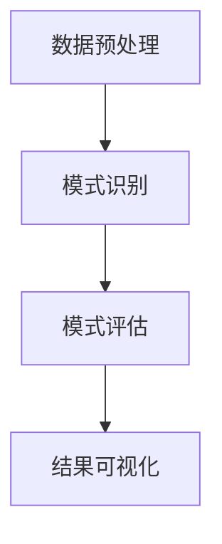

                 

关键词：知识发现、大数据分析、人工智能、机器学习、数据挖掘、洞察力

> 摘要：本文深入探讨了知识发现引擎的技术原理、核心算法、数学模型以及实际应用。通过详细阐述知识发现引擎在当前大数据和人工智能时代的角色与价值，文章为读者提供了一个全面的视角，以了解如何利用知识发现技术提升企业和组织的洞察力与竞争力。

## 1. 背景介绍

在信息技术迅猛发展的今天，数据已经成为企业和社会运作的核心资源。随着大数据时代的到来，数据量呈现出爆炸式增长，数据来源也越来越多样化，包括社交媒体、物联网、电子商务等。然而，海量的数据本身并没有直接价值，关键是如何从这些数据中提取出有价值的信息和知识，这就是知识发现（Knowledge Discovery in Databases，KDD）所要解决的问题。

知识发现是一个跨学科领域，结合了计算机科学、统计学、人工智能和领域知识等多种学科。其目标是发现数据中的隐含模式，帮助人们做出更明智的决策。知识发现引擎作为实现这一目标的关键工具，其重要性日益凸显。

知识发现引擎是大数据分析和人工智能领域的核心组成部分，它通过多种算法和技术，从大量数据中提取出潜在的模式、趋势和关联，从而为企业和组织提供深层次的洞察力。知识发现引擎不仅能够处理传统的关系型数据库，还能处理非结构化和半结构化数据，如文本、图像、音频和视频等。

本文将围绕知识发现引擎展开，首先介绍其核心概念和原理，然后深入探讨其算法、数学模型和实际应用，最后讨论其未来发展。

## 2. 核心概念与联系

### 2.1. 知识发现引擎的定义

知识发现引擎是一种软件工具，它利用先进的算法和技术，从大量数据中自动识别出潜在的、有价值的信息。这些信息可以是数据间的关联、趋势、异常点或是预测模型等。知识发现引擎的核心目标是提升数据洞察力和决策支持能力。

### 2.2. 知识发现引擎的工作流程

知识发现引擎通常包含以下几个主要步骤：

1. **数据预处理**：包括数据清洗、数据集成、数据转换和数据归一化等，目的是提高数据质量，使其适合进一步分析。

2. **模式识别**：使用机器学习和数据挖掘算法，从预处理后的数据中识别出潜在的模式。

3. **模式评估**：对识别出的模式进行评估，确定其重要性和可信度。

4. **结果可视化**：将分析结果以图表、报表等形式呈现，以便用户理解和利用。

### 2.3. 知识发现引擎的核心算法

知识发现引擎的核心算法主要包括以下几种：

1. **聚类算法**：如K-均值、层次聚类等，用于将数据集划分为若干个簇，以发现数据中的隐含结构和分布。

2. **分类算法**：如决策树、支持向量机等，用于将数据分为不同的类别，以便进行预测和分类。

3. **关联规则挖掘**：如Apriori算法、FP-Growth等，用于发现数据集中的关联关系。

4. **异常检测**：用于识别数据中的异常点或离群点，帮助发现潜在的问题或风险。

### 2.4. 知识发现引擎在人工智能中的应用

知识发现引擎在人工智能（AI）领域具有广泛的应用。通过知识发现技术，AI系统可以从大量数据中自动学习，提取出有用的模式和知识，从而实现自主决策和智能行为。例如，在金融领域，知识发现引擎可以用于信用评分、风险评估和市场趋势预测；在医疗领域，可以用于疾病诊断、治疗方案推荐和药物研发。

### 2.5. Mermaid 流程图

下面是一个简单的Mermaid流程图，展示了知识发现引擎的工作流程：



## 3. 核心算法原理 & 具体操作步骤

### 3.1. 算法原理概述

知识发现引擎的核心算法主要基于机器学习和数据挖掘技术。机器学习是一种通过数据训练模型，从而实现预测和分类的技术。数据挖掘则是从大量数据中提取出潜在的模式和知识的过程。知识发现引擎通过结合这两种技术，实现了对大规模数据的深度分析。

### 3.2. 算法步骤详解

1. **数据预处理**：

   - 数据清洗：处理缺失值、异常值和重复数据，确保数据质量。

   - 数据集成：将来自不同数据源的数据整合到一起。

   - 数据转换：将数据转换为适合分析的格式，如数值化、编码等。

   - 数据归一化：调整数据范围，消除不同特征间的尺度差异。

2. **模式识别**：

   - 聚类分析：将数据分为不同的簇，以发现数据的分布和结构。

   - 分类分析：将数据分为不同的类别，以实现预测和分类。

   - 关联规则挖掘：发现数据间的关联关系，如购买行为、用户偏好等。

   - 异常检测：识别数据中的异常点或离群点，以发现潜在问题。

3. **模式评估**：

   - 模型评估：对识别出的模式进行评估，包括准确性、召回率、F1值等指标。

   - 信任度评估：评估模式的重要性和可信度。

4. **结果可视化**：

   - 图表生成：将分析结果以图表形式展示，便于理解和解释。

   - 报表生成：生成详细的报表，记录分析过程和结果。

### 3.3. 算法优缺点

- **优点**：

  - 高效性：知识发现引擎能够快速处理大规模数据，提供实时分析。

  - 自动性：知识发现引擎自动化地识别模式和知识，减轻了人工分析的工作负担。

  - 可扩展性：知识发现引擎可以处理多种类型的数据，适用于不同的应用场景。

- **缺点**：

  - 复杂性：知识发现引擎的算法和流程较为复杂，需要专业人员进行配置和优化。

  - 数据依赖性：知识发现引擎的结果依赖于数据质量，若数据质量较差，分析结果可能不准确。

### 3.4. 算法应用领域

知识发现引擎在多个领域具有广泛的应用，包括：

- **金融领域**：用于信用评分、风险评估、市场趋势预测等。

- **医疗领域**：用于疾病诊断、治疗方案推荐、药物研发等。

- **零售领域**：用于用户行为分析、销售预测、库存管理等。

- **社交网络**：用于用户偏好分析、社区发现、广告投放等。

## 4. 数学模型和公式

### 4.1. 数学模型构建

知识发现引擎的数学模型主要包括聚类模型、分类模型、关联规则模型和异常检测模型。以下是这些模型的基本公式：

1. **聚类模型**：

   - **K-均值聚类**：

     $$ \text{centroid}(c) = \frac{1}{k} \sum_{i=1}^{k} \sum_{x \in S_c} x $$

     其中，$c$为聚类中心，$k$为簇数，$S_c$为第$c$个簇中的所有数据点。

   - **层次聚类**：

     $$ \text{dist}(x, y) = \sqrt{\sum_{i=1}^{n} (x_i - y_i)^2} $$

     其中，$x$和$y$为两个数据点，$n$为数据点的维度。

2. **分类模型**：

   - **决策树**：

     $$ \text{Gini Impurity}(S) = 1 - \sum_{v \in V} p(v) ^ 2 $$

     其中，$S$为数据集，$V$为数据集中的所有类别，$p(v)$为类别$v$在数据集$S$中的比例。

   - **支持向量机**：

     $$ \text{w}^T \text{x} + b = 0 $$

     其中，$\text{w}$为权重向量，$\text{x}$为数据点，$b$为偏置项。

3. **关联规则挖掘**：

   - **Apriori算法**：

     $$ \text{Support}(X) = \frac{|\{T \in \text{Transactions} : X \subseteq T\}|}{|\text{Transactions}|} $$

     其中，$X$为关联规则的前件，$\text{Transactions}$为事务集。

   - **FP-Growth算法**：

     $$ \text{Support}(X) = \frac{|\{T \in \text{Transactions} : X \subseteq T\}|}{|\text{Transactions}|} $$

     其中，$X$为关联规则的前件，$\text{Transactions}$为事务集。

4. **异常检测**：

   - **孤立点检测**：

     $$ \text{Local Outlier Factor}(x) = \frac{\sum_{i \in \text{Neighbors}(x)} \frac{||x - x_i||}{||x - \text{centroid}(S)||}}{||\text{centroid}(S) - \text{median}(S)||} $$

     其中，$x$为数据点，$\text{Neighbors}(x)$为$x$的邻近点，$S$为数据集的簇。

### 4.2. 公式推导过程

以下是部分公式的推导过程：

1. **K-均值聚类**：

   聚类中心的计算基于数据点的均值。对于K-均值聚类，每个簇的中心点$c$是簇内所有数据点的均值。因此，有：

   $$ \text{centroid}(c) = \frac{1}{k} \sum_{i=1}^{k} \sum_{x \in S_c} x $$

   其中，$c$为聚类中心，$k$为簇数，$S_c$为第$c$个簇中的所有数据点。

2. **决策树**：

   决策树的Gini不纯度是基于每个子节点上类别的不纯度之和。对于含有多个类别的数据集$S$，其Gini不纯度计算如下：

   $$ \text{Gini Impurity}(S) = 1 - \sum_{v \in V} p(v) ^ 2 $$

   其中，$V$为数据集中的所有类别，$p(v)$为类别$v$在数据集$S$中的比例。

### 4.3. 案例分析与讲解

以下是一个简单的案例，用于说明如何使用K-均值聚类算法进行数据分析。

**案例**：假设我们有100个数据点，维度为3，表示为$(x, y, z)$。现在我们需要将这些数据点分为10个簇。

1. **初始化聚类中心**：随机选择10个数据点作为初始聚类中心。

2. **分配数据点**：对于每个数据点，计算其与每个聚类中心的距离，并将其分配到最近的聚类中心所在的簇。

3. **更新聚类中心**：对于每个簇，计算簇内所有数据点的均值，作为新的聚类中心。

4. **重复步骤2和3**，直到聚类中心不再发生显著变化。

**结果**：经过多次迭代后，数据点被成功划分为10个簇。以下是一个简单的图表展示：


在这个例子中，我们使用了K-均值聚类算法，成功地从100个数据点中提取出了10个簇。这些簇代表了数据点在三维空间中的不同分布。

## 5. 项目实践：代码实例和详细解释说明

### 5.1. 开发环境搭建

为了演示知识发现引擎的应用，我们将使用Python编程语言和相关的数据科学库，如NumPy、Pandas、scikit-learn和Matplotlib。以下是搭建开发环境的步骤：

1. **安装Python**：确保Python 3.x版本已安装在您的计算机上。

2. **安装相关库**：通过以下命令安装所需库：

   ```bash
   pip install numpy pandas scikit-learn matplotlib
   ```

### 5.2. 源代码详细实现

以下是一个简单的Python代码实例，演示了如何使用K-均值聚类算法进行数据分析。

```python
import numpy as np
import matplotlib.pyplot as plt
from sklearn.cluster import KMeans

# 生成模拟数据
data = np.random.rand(100, 3)

# 初始化K-均值聚类模型
kmeans = KMeans(n_clusters=10, random_state=0)

# 训练模型
kmeans.fit(data)

# 分配数据点
labels = kmeans.predict(data)

# 更新聚类中心
centroids = kmeans.cluster_centers_

# 可视化结果
plt.scatter(data[:, 0], data[:, 1], c=labels, cmap='viridis')
plt.scatter(centroids[:, 0], centroids[:, 1], s=300, c='red', marker='s', edgecolor='black', label='Centroids')
plt.title('K-Means Clustering')
plt.xlabel('Feature 1')
plt.ylabel('Feature 2')
plt.legend()
plt.show()
```

### 5.3. 代码解读与分析

上述代码实现了一个简单的K-均值聚类过程，主要包括以下几个步骤：

1. **生成模拟数据**：我们使用NumPy生成100个三维数据点，模拟实际应用中的数据。

2. **初始化K-均值聚类模型**：使用scikit-learn中的KMeans类初始化聚类模型，设置簇数为10，随机种子为0以确保结果的可重复性。

3. **训练模型**：使用fit方法训练模型，模型会自动计算聚类中心。

4. **分配数据点**：使用predict方法将数据点分配到最近的聚类中心。

5. **更新聚类中心**：每次分配数据点后，聚类中心都会更新，以更好地代表簇。

6. **可视化结果**：使用Matplotlib将数据点和聚类中心可视化，以便观察聚类效果。

### 5.4. 运行结果展示

运行上述代码后，我们将看到一个散点图，其中每个点代表原始数据，颜色表示其所属的簇，红色的星形标记表示聚类中心。通过可视化结果，我们可以直观地看到K-均值聚类算法如何将数据划分为10个簇。


从这个例子中，我们可以看到K-均值聚类算法的基本流程和应用效果。在实际项目中，我们可以根据具体需求调整算法参数，如簇数、初始化方法等，以达到最佳聚类效果。

## 6. 实际应用场景

### 6.1. 金融领域

在金融领域，知识发现引擎广泛应用于信用评估、风险管理和市场分析。通过分析大量历史交易数据和客户信息，银行和金融机构可以识别潜在的高风险客户，优化信用评估模型，降低信贷风险。例如，通过聚类分析，银行可以将客户分为不同的风险类别，从而实施差异化的信贷政策和风险评估策略。

### 6.2. 零售领域

在零售领域，知识发现引擎可以帮助企业更好地理解客户行为，优化库存管理和销售策略。通过关联规则挖掘，零售商可以发现不同商品之间的购买关联，从而制定更有效的促销计划和库存管理策略。例如，一家超市可以通过分析购物车数据，发现某些商品经常一起购买，进而设计捆绑销售策略，提高销售额。

### 6.3. 医疗领域

在医疗领域，知识发现引擎可以用于疾病诊断、治疗方案推荐和药物研发。通过分析大量病患数据和医疗记录，医生可以更准确地诊断疾病，制定个性化的治疗方案。例如，通过分类算法，医疗系统可以预测某位患者的疾病风险，并推荐相应的预防措施。

### 6.4. 未来应用展望

随着人工智能和数据科学技术的不断进步，知识发现引擎的应用前景将更加广阔。未来，知识发现引擎有望在以下几个方面实现突破：

- **智能城市**：知识发现引擎可以帮助城市管理者优化交通流量、环境保护和资源分配，提高城市运行效率。

- **智能制造**：在智能制造领域，知识发现引擎可以用于设备故障预测、生产优化和质量控制，提高生产效率和产品质量。

- **智慧医疗**：通过大数据和人工智能技术，知识发现引擎可以辅助医生进行精准医疗和个性化治疗，提高医疗服务质量。

- **金融科技**：知识发现引擎可以帮助金融科技企业实现更精准的风险评估、信用评分和欺诈检测，提高金融服务水平。

## 7. 工具和资源推荐

### 7.1. 学习资源推荐

- **书籍**：《数据挖掘：概念与技术》（作者：Han, Kamber, Pei） - 详细介绍了数据挖掘的基本概念和技术。
- **在线课程**：Coursera、edX等在线教育平台提供的数据科学和机器学习课程，如《机器学习》（作者：Andrew Ng）。
- **博客和论坛**：Kaggle、Reddit等数据科学社区，提供丰富的实践案例和讨论话题。

### 7.2. 开发工具推荐

- **编程语言**：Python、R等，适用于数据分析和机器学习。
- **库和框架**：NumPy、Pandas、scikit-learn、TensorFlow、PyTorch等，提供丰富的数据科学和机器学习工具。

### 7.3. 相关论文推荐

- "Knowledge Discovery in Databases: A Survey"（作者：Fayyad, Piatetsky-Shapiro, Smyth）- 介绍了知识发现的基本原理和应用。
- "A Decision-Theoretic Approach for Automating the Design of an Analytic Algorithm"（作者：Buntine）- 探讨了决策理论在自动化算法设计中的应用。

## 8. 总结：未来发展趋势与挑战

### 8.1. 研究成果总结

知识发现引擎作为一种重要的数据分析工具，已经在多个领域取得了显著的研究成果和应用。通过结合机器学习和数据挖掘技术，知识发现引擎能够从大规模数据中提取出有价值的信息和知识，为企业和组织提供深层次的洞察力。

### 8.2. 未来发展趋势

随着大数据和人工智能技术的不断发展，知识发现引擎将在以下几个方面实现突破：

- **实时分析**：知识发现引擎将更加注重实时性，支持实时数据流分析，提供即时的决策支持。
- **多模态数据**：知识发现引擎将能够处理更多类型的数据，包括文本、图像、音频和视频等，实现跨模态的数据融合和分析。
- **自动化与智能化**：知识发现引擎将更加自动化和智能化，减少人工干预，提高分析效率和准确性。

### 8.3. 面临的挑战

尽管知识发现引擎在数据处理和模式识别方面取得了显著进展，但仍面临一些挑战：

- **数据隐私**：大规模数据处理过程中，如何保护用户隐私成为一个重要问题。
- **数据质量**：数据质量对知识发现结果具有重要影响，提高数据质量是一个长期而艰巨的任务。
- **算法可解释性**：随着算法的复杂化，如何提高算法的可解释性，使非专业人士也能理解和信任分析结果，是一个亟待解决的问题。

### 8.4. 研究展望

未来的研究应重点关注以下几个方面：

- **隐私保护技术**：研究更加有效的隐私保护方法，确保数据在分析过程中的安全性。
- **数据质量提升**：探索数据清洗、数据整合和数据质量评估的新方法，提高数据质量。
- **算法可解释性**：发展新的算法解释和可视化技术，提高算法的可解释性和透明度。

通过不断的研究和创新，知识发现引擎将在未来的数据分析和决策支持中发挥更加重要的作用，为人类社会带来更多的价值。

## 9. 附录：常见问题与解答

### 9.1. 知识发现引擎是什么？

知识发现引擎是一种用于从大量数据中提取有价值信息和知识的工具，它结合了机器学习和数据挖掘技术。

### 9.2. 知识发现引擎有哪些核心算法？

知识发现引擎的核心算法包括聚类算法、分类算法、关联规则挖掘和异常检测算法等。

### 9.3. 知识发现引擎如何工作？

知识发现引擎通过以下步骤工作：

1. 数据预处理：清洗、集成、转换和归一化数据。
2. 模式识别：使用算法从数据中识别出潜在的模式。
3. 模式评估：评估识别出的模式的重要性和可信度。
4. 结果可视化：将分析结果以图表、报表等形式呈现。

### 9.4. 知识发现引擎有哪些应用领域？

知识发现引擎在金融、医疗、零售、社交网络等多个领域具有广泛应用，如信用评估、疾病诊断、用户行为分析等。

### 9.5. 如何选择合适的知识发现算法？

选择合适的知识发现算法取决于数据类型、分析目标和问题复杂性。例如，对于分类问题，可以使用决策树或支持向量机；对于关联关系挖掘，可以使用Apriori或FP-Growth算法。在实际应用中，通常需要根据具体情况多次试验和调整算法参数。

