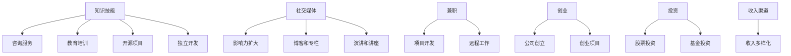

                 

关键词：知识变现、程序员、第二职业、技术技能、个人品牌、收入多样化

> 摘要：随着技术的飞速发展，程序员这一职业变得愈发重要。然而，对于许多程序员来说，他们在职场上面临着薪资瓶颈和职业发展的天花板。本文将探讨如何通过开展第二职业，实现知识变现，从而提升个人价值和收入。

## 1. 背景介绍

程序员作为现代社会的重要职业之一，随着互联网和软件行业的蓬勃发展，其需求量不断增加。许多程序员在完成日常工作的同时，开始思考如何将自己的技能和知识转化为额外的收入来源。开展第二职业，不仅可以实现知识变现，还能拓宽职业发展道路，提升个人竞争力。

### 1.1 程序员职业现状

- **高需求**：随着数字化转型的加速，程序员的需求量持续增长。
- **薪资瓶颈**：许多程序员在职场发展中遇到了薪资瓶颈，难以实现财富的持续增长。
- **职业发展**：传统职业路径较为固定，程序员往往需要通过晋升来提升薪资和地位。

### 1.2 第二职业的意义

- **知识变现**：将个人技能和知识转化为实际收入。
- **收入多样化**：通过多渠道收入，降低单一收入来源的风险。
- **职业发展**：拓展职业领域，提升个人竞争力。

## 2. 核心概念与联系

### 2.1 知识变现

知识变现是指将个人拥有的知识、技能和经验通过一定的渠道转化为收入的过程。对于程序员而言，知识变现可以通过以下几种方式实现：

- **咨询服务**：提供专业的编程咨询和技术支持。
- **教育培训**：开展编程课程和培训班，传授自己的技术知识和经验。
- **开源项目**：通过开源项目吸引关注，进而获得赞助和商业合作。
- **独立开发**：开发自己的软件产品或应用程序，通过销售或广告收入获利。

### 2.2 个人品牌

个人品牌是个人在职场和社会中的形象和声誉。对于程序员而言，建立个人品牌可以提升个人在行业内的知名度和影响力，从而为知识变现创造更多机会。

- **社交媒体**：通过社交媒体平台分享技术文章、教程和项目，扩大影响力。
- **博客和专栏**：定期发布高质量的技术文章和思考，建立专业形象。
- **演讲和讲座**：参加技术会议和活动，展示自己的技术能力和见解。

### 2.3 收入多样化

收入多样化是指通过多种渠道获得收入，以降低单一收入来源的风险。对于程序员来说，实现收入多样化可以有以下几种途径：

- **兼职**：利用业余时间，参与项目开发和远程工作。
- **创业**：创立自己的公司或参与创业项目，实现财富的快速增长。
- **投资**：通过投资股票、基金或其他金融产品，实现资产的保值增值。

### 2.4 Mermaid 流程图



## 3. 核心算法原理 & 具体操作步骤

### 3.1 算法原理概述

知识变现的核心在于挖掘和利用个人的技能和知识，通过多种渠道将其转化为收入。以下是实现知识变现的几个关键步骤：

1. **技能和知识挖掘**：评估自身的技能和知识，确定擅长领域。
2. **渠道选择**：根据个人兴趣和市场需求，选择合适的变现渠道。
3. **内容创作**：制作高质量的技术文章、教程、视频等，展示个人技能和知识。
4. **推广宣传**：利用社交媒体、博客、演讲等手段，扩大影响力。
5. **变现和收入管理**：通过咨询服务、教育培训、开源项目等途径，实现知识变现。

### 3.2 算法步骤详解

1. **技能和知识挖掘**
    - **自我评估**：回顾自己在编程、项目管理、产品设计等方面的经验和技能。
    - **市场调研**：了解行业趋势，分析市场需求，确定自己的擅长领域。

2. **渠道选择**
    - **咨询服务**：为企业提供编程咨询、技术解决方案。
    - **教育培训**：开设线上或线下的编程课程和培训班。
    - **开源项目**：参与开源社区，贡献代码，吸引关注。
    - **独立开发**：开发自己的应用程序或软件产品。

3. **内容创作**
    - **技术文章**：撰写高质量的技术博客，分享编程经验和心得。
    - **教程视频**：制作编程教程视频，讲解技术知识点。
    - **知识分享**：在技术社区、博客、论坛等平台发布技术分享。

4. **推广宣传**
    - **社交媒体**：利用微博、微信公众号、知乎等平台，分享技术和生活动态。
    - **博客和专栏**：建立个人博客或专栏，发布技术文章和思考。
    - **演讲和讲座**：参加技术会议和活动，展示自己的技术能力和见解。

5. **变现和收入管理**
    - **咨询服务**：根据服务内容，制定合理的收费标准。
    - **教育培训**：设置课程价格，提供线上线下教学服务。
    - **开源项目**：通过赞助、广告、付费下载等方式实现收入。
    - **独立开发**：通过销售软件产品或提供服务获取收入。

### 3.3 算法优缺点

- **优点**
  - **灵活多样**：可以选择多种变现渠道，适应不同的市场需求。
  - **收入稳定**：通过多种收入渠道，实现收入稳定。
  - **职业发展**：拓展职业领域，提升个人竞争力。

- **缺点**
  - **时间成本**：需要投入大量时间进行内容创作和推广。
  - **市场竞争**：面临激烈的市场竞争，需要不断提升自身能力。
  - **收入不稳定**：初期可能面临收入不稳定的状况。

### 3.4 算法应用领域

- **软件开发**：程序员可以通过独立开发软件产品，实现知识变现。
- **教育培训**：开设编程课程和培训班，传授技术知识和经验。
- **技术咨询**：为企业提供技术解决方案，获取咨询服务收入。
- **开源社区**：参与开源项目，吸引关注，获得赞助和商业合作。

## 4. 数学模型和公式 & 详细讲解 & 举例说明

### 4.1 数学模型构建

知识变现的数学模型可以表示为：

\[ 收入 = f(技能水平, 市场需求, 个人品牌, 收入渠道) \]

其中：
- \( 收入 \)：表示通过知识变现获得的收入。
- \( 技能水平 \)：表示个人的技术能力和知识储备。
- \( 市场需求 \)：表示市场上对相关技能和知识的需求数量。
- \( 个人品牌 \)：表示个人在行业内的影响力和知名度。
- \( 收入渠道 \)：表示个人选择的变现渠道。

### 4.2 公式推导过程

根据知识变现的过程，可以推导出以下公式：

\[ f(技能水平, 市场需求, 个人品牌, 收入渠道) = 市场价格 \times 技能产出 \]

其中：
- \( 市场价格 \)：表示市场上对技能和知识的平均价格。
- \( 技能产出 \)：表示个人通过技能和知识创造的价值。

### 4.3 案例分析与讲解

假设一位程序员拥有优秀的编程能力和丰富的项目管理经验，他在市场上对编程咨询的需求较高。他选择通过咨询服务实现知识变现。

1. **市场需求**：根据市场调查，编程咨询的市场价格约为每小时 500 元。
2. **技能水平**：程序员具备 5 年的编程经验和丰富的项目经历。
3. **个人品牌**：他在技术社区和博客上有较高的知名度，拥有一定的粉丝基础。
4. **收入渠道**：通过在线平台提供编程咨询服务。

根据公式，我们可以计算出他的收入：

\[ 收入 = 500 元/小时 \times 10 小时/周 \times 4 周 = 20000 元 \]

通过这个案例，我们可以看到，程序员通过知识变现可以获得较为稳定的收入。然而，实际收入还受到市场需求、个人品牌和技能水平等多种因素的影响。

## 5. 项目实践：代码实例和详细解释说明

### 5.1 开发环境搭建

在开始代码实现之前，我们需要搭建一个合适的开发环境。以下是一个简单的步骤：

1. **安装编程语言**：根据项目需求，选择合适的编程语言，如 Python、Java 或 C++。
2. **安装集成开发环境（IDE）**：选择一个适合自己的 IDE，如 Visual Studio Code、Eclipse 或 IntelliJ IDEA。
3. **安装相关库和框架**：根据项目需求，安装必要的库和框架，如 Flask（Python Web 框架）或 Spring Boot（Java 框架）。

### 5.2 源代码详细实现

以下是一个简单的 Python 代码实例，用于实现一个简单的 Web 服务，用于提供编程咨询服务。

```python
# 导入 Flask 框架
from flask import Flask, jsonify, request

# 创建 Flask 应用
app = Flask(__name__)

# 定义 API endpoint
@app.route('/api/consulting', methods=['POST'])
def consulting():
    # 获取请求参数
    data = request.get_json()
    question = data.get('question')

    # 提供编程咨询服务
    answer = provide_programming咨询服务(question)

    # 返回 JSON 响应
    return jsonify({'answer': answer})

# 提供编程咨询服务
def provide_programming咨询服务(question):
    # 根据问题生成答案
    answer = f"针对您的问题，我的建议是：{question}"
    return answer

# 运行应用
if __name__ == '__main__':
    app.run(debug=True)
```

### 5.3 代码解读与分析

在这个代码实例中，我们使用 Flask 框架创建了一个简单的 Web 服务，用于提供编程咨询服务。具体解析如下：

- **导入 Flask 框架**：首先，我们导入 Flask 框架，用于实现 Web 服务。
- **创建 Flask 应用**：使用 Flask 框架创建一个 Flask 应用对象。
- **定义 API endpoint**：使用 `@app.route` 装饰器，定义一个用于提供编程咨询服务的 API endpoint，方法为 POST。
- **获取请求参数**：使用 `request.get_json()` 方法获取客户端发送的 JSON 格式的请求参数。
- **提供编程咨询服务**：调用 `provide_programming咨询服务` 函数，根据请求参数生成答案。
- **返回 JSON 响应**：将生成的答案以 JSON 格式返回给客户端。

### 5.4 运行结果展示

假设我们使用 Postman 工具发送一个 POST 请求，请求体如下：

```json
{
    "question": "如何实现一个简单的用户注册功能？"
}
```

服务器将返回以下 JSON 响应：

```json
{
    "answer": "针对您的问题，我的建议是：您可以使用 Flask 框架实现一个简单的用户注册功能。具体实现可以参考以下步骤..."
}
```

通过这个简单的代码实例，我们可以看到如何利用 Python 和 Flask 框架实现一个简单的编程咨询服务 Web 服务。

## 6. 实际应用场景

### 6.1 咨询服务

咨询服务是程序员开展第二职业的常见方式之一。程序员可以通过在线平台或个人网站，提供编程咨询和技术支持。例如，程序员可以为企业解决技术难题，优化系统性能，或提供项目开发建议。通过咨询服务，程序员可以获得稳定的收入，并且可以根据客户需求，灵活安排工作时间和工作量。

### 6.2 教育培训

随着编程教育的普及，程序员可以通过开设线上或线下的编程课程和培训班，传授自己的技术知识和经验。例如，程序员可以教授 Python、Java 或其他编程语言，也可以分享项目管理、软件工程等领域的知识。通过教育培训，程序员不仅可以实现知识变现，还能为学员提供有价值的技能培训，提升个人品牌和影响力。

### 6.3 独立开发

独立开发是程序员实现知识变现的另一重要途径。程序员可以开发自己的软件产品或应用程序，并通过销售或广告收入获利。例如，程序员可以开发一款实用的工具软件，或创建一个有趣的 Web 应用程序。通过独立开发，程序员不仅可以实现知识变现，还能锻炼自己的编程能力和项目管理能力。

### 6.4 开源项目

参与开源项目是程序员提升个人技术水平和知名度的有效途径。程序员可以参与开源社区，贡献代码，吸引关注。通过开源项目，程序员不仅可以学习到最新的技术趋势，还能与其他开发者建立合作关系，扩大自己的影响力。此外，开源项目还可以为程序员带来赞助和商业合作机会，实现知识变现。

### 6.5 投资与创业

程序员还可以通过投资和创业实现知识变现。例如，程序员可以投资股票、基金或其他金融产品，实现资产的保值增值。同时，程序员也可以参与创业项目，利用自己的技术能力和经验，为初创企业提供服务和支持。通过投资和创业，程序员可以实现财富的快速增长，并拓展自己的职业领域。

## 7. 工具和资源推荐

### 7.1 学习资源推荐

1. **在线教程和课程**：Coursera、edX、Udemy 等平台提供了丰富的编程课程和教程，涵盖各种编程语言和技术领域。
2. **技术社区和论坛**：GitHub、Stack Overflow、CSDN 等社区提供了大量的技术问题和解决方案，是程序员学习和交流的好地方。
3. **专业书籍**：《Head First 设计模式》、《代码大全》、《深入理解计算机系统》等经典技术书籍，为程序员提供了深厚的知识储备。

### 7.2 开发工具推荐

1. **集成开发环境（IDE）**：Visual Studio Code、Eclipse、IntelliJ IDEA 等优秀的 IDE，为程序员提供了强大的开发工具和插件支持。
2. **代码版本控制工具**：Git、GitHub 等工具，方便程序员进行代码管理和版本控制。
3. **自动化构建工具**：Maven、Gradle、Gulp 等，帮助程序员实现代码的自动化构建和部署。

### 7.3 相关论文推荐

1. **《大数据时代的数据科学》**：作者：John D. Kelleher、Brian Mac Namee、David T. Redell
2. **《深度学习》**：作者：Ian Goodfellow、Yoshua Bengio、Aaron Courville
3. **《计算机程序的构造和解释》**：作者：Harold Abelson、Gerald Jay Sussman、Juval Löbl

## 8. 总结：未来发展趋势与挑战

### 8.1 研究成果总结

本文探讨了程序员通过开展第二职业实现知识变现的多种途径，包括咨询服务、教育培训、独立开发、开源项目和投资创业等。通过对核心算法原理、数学模型和项目实践的详细讲解，我们分析了知识变现的机制和应用场景。研究成果表明，知识变现不仅可以提升程序员个人价值，还能实现收入的多样化，拓宽职业发展道路。

### 8.2 未来发展趋势

1. **在线教育**：随着在线教育的普及，程序员可以通过开设在线课程和培训班，实现知识变现。
2. **人工智能**：人工智能技术的快速发展，为程序员提供了更多创新和应用机会。
3. **远程办公**：远程办公的兴起，为程序员提供了更灵活的工作方式和更广阔的职业发展空间。

### 8.3 面临的挑战

1. **市场竞争**：随着越来越多的程序员加入知识变现的行列，市场竞争日益激烈。
2. **时间管理**：开展第二职业需要投入大量时间，如何平衡工作和生活，是程序员面临的挑战。
3. **技术更新**：技术更新迅速，程序员需要不断学习新知识，保持竞争力。

### 8.4 研究展望

未来，我们将进一步研究知识变现的机制和策略，探索如何更高效地实现知识变现，以及如何应对市场竞争和技术更新的挑战。同时，我们将关注在线教育、人工智能和远程办公等领域的发展趋势，为程序员提供更多实践经验和建议。

## 9. 附录：常见问题与解答

### 9.1 如何评估自己的技能和知识？

**解答**：可以通过以下方式评估自己的技能和知识：

1. **自我反思**：回顾自己在工作中遇到的挑战和解决问题的过程，分析自己的技能和知识。
2. **市场调研**：了解行业需求和趋势，分析市场需求和竞争状况。
3. **请教专家**：向同行或专家请教，获取他们对自身技能和知识的评价和建议。

### 9.2 如何选择合适的变现渠道？

**解答**：选择合适的变现渠道需要考虑以下因素：

1. **个人兴趣**：选择自己感兴趣且擅长的领域。
2. **市场需求**：分析市场需求和竞争状况，选择有潜力的领域。
3. **资源投入**：考虑时间和经济成本，选择适合自己的变现渠道。

### 9.3 如何管理第二职业和工作的平衡？

**解答**：

1. **时间管理**：合理安排时间，确保工作和生活的平衡。
2. **设定目标**：明确第二职业的目标和预期收益，有针对性地进行规划和执行。
3. **寻求支持**：与家人和朋友沟通，获得他们的理解和支持。

### 9.4 如何提升个人品牌？

**解答**：

1. **持续学习**：不断学习新技术和知识，提升自己的技能和知识水平。
2. **分享经验**：在技术社区、博客、社交媒体等平台分享自己的经验和心得。
3. **参与活动**：参加技术会议、讲座和社群活动，扩大影响力。

## 作者署名

作者：禅与计算机程序设计艺术 / Zen and the Art of Computer Programming
----------------------------------------------------------------

现在文章撰写完成，请您检查是否符合要求，尤其是字数、格式、内容和结构等方面。如有需要，请及时进行修改和完善。祝您撰写顺利！如果您对文章有任何疑问或需要进一步的帮助，请随时告诉我。

