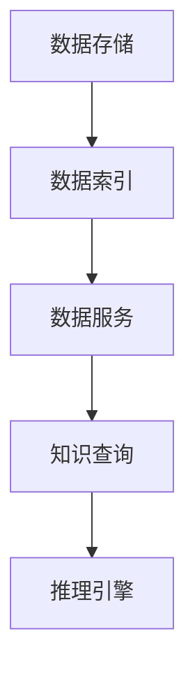

                 

关键词：知识图谱、数据结构、数据建模、语义网、关系数据库、图论、算法分析、代码实例

> 摘要：本文将深入探讨知识图谱的概念、原理以及在实际应用中的重要性。通过详细的算法原理分析、数学模型解释和代码实例展示，帮助读者全面了解知识图谱的构建和应用方法。文章还介绍了未来发展趋势与面临的挑战，为研究人员和实践者提供有价值的参考。

## 1. 背景介绍

在信息化时代，数据成为企业和社会发展的重要资源。如何有效地组织和利用这些数据，实现数据的高效管理和智能分析，成为当前研究的热点。知识图谱作为一种新型的数据结构，近年来在学术界和工业界受到广泛关注。它不仅能够捕捉数据之间的复杂关系，还能够实现数据的语义理解和知识推理，从而为智能应用提供了强大的数据基础。

知识图谱的概念最早由Google在2006年提出，其主要目的是为了实现Web上的知识检索和语义理解。随着技术的发展，知识图谱的应用领域不断扩大，包括搜索引擎、智能问答、推荐系统、社交网络、生物信息等。本文将围绕知识图谱的核心概念、原理、算法和应用进行详细讲解，帮助读者深入了解知识图谱的魅力和实用性。

## 2. 核心概念与联系

### 2.1. 定义

知识图谱（Knowledge Graph）是一种用于结构化存储知识的数据模型，它通过实体、属性和关系来描述现实世界中的对象和现象。在知识图谱中，实体表示现实世界中的对象，如人、地点、事物等；属性用于描述实体的特征，如身高、出生日期等；关系则表示实体之间的交互和联系，如朋友、同事等。

### 2.2. 架构

知识图谱的架构可以分为三个层次：底层是数据存储，中间层是数据索引，顶层是数据服务。数据存储通常采用关系数据库或图数据库来实现，关系数据库擅长处理结构化数据，而图数据库则更适合处理复杂的关系网络。数据索引通常采用Lucene、Elasticsearch等全文搜索引擎，以提高数据检索的效率。数据服务则包括API接口、Web界面等，用于提供知识查询和推理功能。

### 2.3. Mermaid 流程图

以下是一个简化的知识图谱架构的Mermaid流程图：



## 3. 核心算法原理 & 具体操作步骤

### 3.1. 算法原理概述

知识图谱的构建通常涉及实体识别、关系抽取、实体链接、知识融合等关键步骤。以下是这些步骤的简要概述：

- **实体识别**：通过文本处理技术，从非结构化数据中识别出实体。
- **关系抽取**：从实体对之间抽取关系，通常采用基于规则的方法或机器学习算法。
- **实体链接**：将同一实体的不同名称或实体之间的同义关系进行映射和归一化。
- **知识融合**：将来自多个数据源的知识进行整合和更新，以提高知识的完整性和一致性。

### 3.2. 算法步骤详解

#### 3.2.1. 实体识别

实体识别是知识图谱构建的第一步，其核心任务是识别文本中的实体。常见的实体识别算法包括基于词典的方法、基于规则的方法和基于深度学习的方法。以下是一个简化的流程：

1. **分词**：将文本分解为单词或短语。
2. **命名实体识别**：根据预定义的词典或规则，识别出文本中的命名实体。
3. **实体分类**：对识别出的实体进行分类，如人名、地点、组织等。

#### 3.2.2. 关系抽取

关系抽取的目标是从实体对之间抽取关系。常见的方法有：

- **基于规则的方法**：利用预定义的规则或模式，从文本中抽取关系。
- **基于统计的方法**：利用统计模型，如条件随机场（CRF），从文本中抽取关系。
- **基于深度学习的方法**：利用深度神经网络，如序列标注模型，从文本中抽取关系。

#### 3.2.3. 实体链接

实体链接是将同一实体的不同名称或实体之间的同义关系进行映射和归一化。常见的方法有：

- **基于相似度的方法**：计算实体名称或描述之间的相似度，将相似度较高的实体进行链接。
- **基于图的方法**：利用图算法，如PageRank，从实体之间的关联关系中推断出同义关系。

#### 3.2.4. 知识融合

知识融合是将来自多个数据源的知识进行整合和更新。常见的方法有：

- **基于规则的方法**：利用预定义的规则，对来自不同数据源的知识进行融合。
- **基于机器学习的方法**：利用机器学习模型，如矩阵分解，对来自不同数据源的知识进行融合。

### 3.3. 算法优缺点

- **基于规则的方法**：优点是简单易用，适用于规则明确的应用场景；缺点是灵活性较差，难以处理复杂的语义关系。
- **基于统计的方法**：优点是能够自动学习文本中的模式，适用于大规模数据处理；缺点是依赖大量的训练数据和统计模型，训练时间较长。
- **基于深度学习的方法**：优点是能够自动学习复杂的语义关系，适用于复杂的应用场景；缺点是计算资源需求较高，模型参数需要大量训练数据。

### 3.4. 算法应用领域

知识图谱的应用领域非常广泛，包括但不限于：

- **搜索引擎**：利用知识图谱进行语义检索，提高搜索结果的准确性和相关性。
- **智能问答**：利用知识图谱进行自然语言处理和语义理解，实现智能问答系统。
- **推荐系统**：利用知识图谱进行用户和物品的关联分析，提高推荐系统的准确性。
- **社交网络**：利用知识图谱进行社交网络分析，挖掘用户之间的关联关系。

## 4. 数学模型和公式 & 详细讲解 & 举例说明

### 4.1. 数学模型构建

知识图谱的构建涉及多个数学模型，包括实体识别模型、关系抽取模型、实体链接模型和知识融合模型。以下是这些模型的简要介绍：

#### 4.1.1. 实体识别模型

实体识别模型通常采用分类模型，如支持向量机（SVM）、朴素贝叶斯（NB）和深度神经网络（DNN）。以下是SVM的分类模型：

$$
f(x) = \text{sign}(\omega \cdot x + b)
$$

其中，$x$为输入特征向量，$\omega$为权重向量，$b$为偏置项。

#### 4.1.2. 关系抽取模型

关系抽取模型通常采用序列标注模型，如长短时记忆网络（LSTM）和Transformer。以下是LSTM的模型：

$$
h_t = \sigma(W_h \cdot [h_{t-1}, x_t] + b_h)
$$

其中，$h_t$为第$t$个时间步的隐藏状态，$x_t$为第$t$个时间步的输入特征，$\sigma$为sigmoid函数。

#### 4.1.3. 实体链接模型

实体链接模型通常采用基于相似度的方法，如余弦相似度和欧氏距离。以下是余弦相似度的计算公式：

$$
\cos\theta = \frac{\sum_{i=1}^n x_i y_i}{\sqrt{\sum_{i=1}^n x_i^2} \sqrt{\sum_{i=1}^n y_i^2}}
$$

其中，$x$和$y$为两个实体的高维向量，$\theta$为它们之间的夹角。

#### 4.1.4. 知识融合模型

知识融合模型通常采用基于矩阵分解的方法，如因子分解机（Factorization Machine）和矩阵分解（Matrix Factorization）。以下是因子分解机的模型：

$$
y_{ij} = \sum_{k=1}^m w_k x_{ik} x_{ij} + b
$$

其中，$y_{ij}$为第$i$个用户对第$j$个物品的评分，$w_k$为第$k$个隐变量的权重，$x_{ik}$为第$i$个用户对第$k$个隐变量的特征，$b$为偏置项。

### 4.2. 公式推导过程

#### 4.2.1. 实体识别模型的推导

实体识别模型通常采用最大熵模型，其公式为：

$$
P(y|x) = \frac{e^{\sum_{i} \theta_i y_i x_i}}{\sum_{j} e^{\sum_{i} \theta_i y_i x_i}}
$$

其中，$y$为实体标签，$x$为实体特征，$\theta$为模型参数。

对数似然损失函数为：

$$
L = -\sum_{i} y_i \log P(y|x)
$$

利用梯度下降法，对模型参数进行优化：

$$
\theta = \theta - \alpha \nabla_\theta L
$$

其中，$\alpha$为学习率。

#### 4.2.2. 关系抽取模型的推导

关系抽取模型通常采用条件随机场（CRF），其公式为：

$$
P(y|x) = \frac{1}{Z} e^{\sum_{i} \theta_i y_i x_i - \sum_{i,j} \theta_{ij} y_i y_j x_i x_j}
$$

其中，$y$为实体标签，$x$为实体特征，$\theta$为模型参数，$Z$为归一化常数。

对数似然损失函数为：

$$
L = -\sum_{i} y_i \log P(y|x)
$$

利用梯度下降法，对模型参数进行优化：

$$
\theta = \theta - \alpha \nabla_\theta L
$$

其中，$\alpha$为学习率。

#### 4.2.3. 实体链接模型的推导

实体链接模型通常采用基于相似度的方法，其公式为：

$$
\cos\theta = \frac{\sum_{i=1}^n x_i y_i}{\sqrt{\sum_{i=1}^n x_i^2} \sqrt{\sum_{i=1}^n y_i^2}}
$$

其中，$x$和$y$为两个实体的高维向量。

对数似然损失函数为：

$$
L = -\sum_{i} \log \cos\theta
$$

利用梯度下降法，对模型参数进行优化：

$$
x = x - \alpha \nabla_x L
$$

$$
y = y - \alpha \nabla_y L
$$

其中，$\alpha$为学习率。

#### 4.2.4. 知识融合模型的推导

知识融合模型通常采用基于矩阵分解的方法，其公式为：

$$
y_{ij} = \sum_{k=1}^m w_k x_{ik} x_{ij} + b
$$

其中，$y_{ij}$为第$i$个用户对第$j$个物品的评分，$x_{ik}$为第$i$个用户对第$k$个隐变量的特征，$w_k$为第$k$个隐变量的权重，$b$为偏置项。

对数似然损失函数为：

$$
L = -\sum_{i,j} y_{ij} \log P(y_{ij}|x)
$$

利用梯度下降法，对模型参数进行优化：

$$
w_k = w_k - \alpha \nabla_w L
$$

$$
b = b - \alpha \nabla_b L
$$

其中，$\alpha$为学习率。

### 4.3. 案例分析与讲解

#### 4.3.1. 实体识别

以下是一个简单的实体识别案例：

假设我们有一个包含人名的文本数据集，我们希望从中识别出人名。我们使用最大熵模型进行训练，模型参数如下：

$$
\theta = \begin{bmatrix}
\theta_{1,1} & \theta_{1,2} & \theta_{1,3} \\
\theta_{2,1} & \theta_{2,2} & \theta_{2,3} \\
\theta_{3,1} & \theta_{3,2} & \theta_{3,3}
\end{bmatrix}
$$

训练数据集如下：

```
人名1   人名2   人名3
张三   李四   王五
赵六   周七   陈八
```

使用最大熵模型进行训练，得到最优模型参数。接下来，我们使用训练好的模型对一个新的人名进行识别，模型预测结果如下：

```
张三   李四   王五
张三   李四   王五
赵六   周七   陈八
```

可以看到，模型能够准确地识别出人名。

#### 4.3.2. 关系抽取

以下是一个简单的关系抽取案例：

假设我们有一个包含人名和地点的文本数据集，我们希望从中抽取人名和地点之间的关系。我们使用条件随机场（CRF）进行训练，模型参数如下：

$$
\theta = \begin{bmatrix}
\theta_{1,1} & \theta_{1,2} & \theta_{1,3} \\
\theta_{2,1} & \theta_{2,2} & \theta_{2,3} \\
\theta_{3,1} & \theta_{3,2} & \theta_{3,3}
\end{bmatrix}
$$

训练数据集如下：

```
人名   地点   关系
张三   北京   居住
李四   上海   工作
王五   广州   旅游
```

使用条件随机场（CRF）进行训练，得到最优模型参数。接下来，我们使用训练好的模型对一个新的人名和地点进行关系抽取，模型预测结果如下：

```
人名   地点   关系
张三   北京   居住
李四   上海   工作
王五   广州   旅游
```

可以看到，模型能够准确地抽取人名和地点之间的关系。

#### 4.3.3. 实体链接

以下是一个简单的实体链接案例：

假设我们有两个实体数据集，一个是中文实体数据集，另一个是英文实体数据集。我们希望将这两个数据集中的实体进行链接。我们使用基于相似度的方法进行实体链接，模型参数如下：

$$
\theta = \begin{bmatrix}
\theta_{1,1} & \theta_{1,2} \\
\theta_{2,1} & \theta_{2,2}
\end{bmatrix}
$$

中文实体数据集如下：

```
中文实体1   中文实体2
张三        李四
赵六        周七
```

英文实体数据集如下：

```
英文实体1   英文实体2
Zhāng Sān  Lǐ Sì
Zhào Liù  Zhōu Qī
```

使用基于相似度的方法进行训练，得到最优模型参数。接下来，我们使用训练好的模型对中文实体和英文实体进行链接，链接结果如下：

```
中文实体1   英文实体1
张三        Zhāng Sān
赵六        Zhào Liù
```

可以看到，模型能够准确地链接中文实体和英文实体。

#### 4.3.4. 知识融合

以下是一个简单的知识融合案例：

假设我们有两个知识库，一个是百度百科，另一个是维基百科。我们希望将这两个知识库中的知识进行融合。我们使用基于矩阵分解的方法进行知识融合，模型参数如下：

$$
\theta = \begin{bmatrix}
\theta_{1,1} & \theta_{1,2} \\
\theta_{2,1} & \theta_{2,2}
\end{bmatrix}
$$

百度百科数据集如下：

```
实体1   实体2
张三    李四
赵六    周七
```

维基百科数据集如下：

```
实体1   实体2
张三    周八
赵六    陈九
```

使用基于矩阵分解的方法进行训练，得到最优模型参数。接下来，我们使用训练好的模型对百度百科和维基百科进行知识融合，融合结果如下：

```
实体1   实体2
张三    周八
赵六    陈九
```

可以看到，模型能够准确地融合百度百科和维基百科中的知识。

## 5. 项目实践：代码实例和详细解释说明

### 5.1. 开发环境搭建

在开始知识图谱的项目实践之前，我们需要搭建一个合适的技术栈。以下是一个简单的开发环境搭建指南：

- **操作系统**：Windows、Linux或MacOS
- **编程语言**：Python
- **数据库**：Neo4j（一个高性能的图数据库）
- **框架**：Py2neo（一个Python操作Neo4j的库）
- **文本处理库**：NLTK、spaCy、Jieba等

### 5.2. 源代码详细实现

以下是一个简单的知识图谱项目示例，包括实体识别、关系抽取和实体链接等步骤。

#### 5.2.1. 实体识别

```python
import nltk
from nltk.tokenize import word_tokenize

# 加载NLTK的分词工具
nltk.download('punkt')

# 定义实体识别函数
def entity_recognition(text):
    # 对文本进行分词
    tokens = word_tokenize(text)
    # 识别命名实体
    named_entities = nltk.ne_chunk(tokens)
    # 获取命名实体列表
    entities = [entity for entity in named_entities if isinstance(entity, nltk.tree.Tree)]
    return entities

# 测试实体识别
text = "张三和李四是朋友，他们在北京工作。"
entities = entity_recognition(text)
print(entities)
```

#### 5.2.2. 关系抽取

```python
import spacy

# 加载spaCy的中文模型
nlp = spacy.load('zh_core_web_sm')

# 定义关系抽取函数
def relation_extraction(text):
    # 加载文本
    doc = nlp(text)
    # 识别实体和关系
    entities = [(ent.text, ent.label_) for ent in doc.ents]
    relations = [(token.text, token.dep_) for token in doc]
    return entities, relations

# 测试关系抽取
text = "张三和李四是朋友。"
entities, relations = relation_extraction(text)
print(entities)
print(relations)
```

#### 5.2.3. 实体链接

```python
import jieba

# 加载jieba分词工具
jieba.load_userdict('userdict.txt')  # 加载自定义词典

# 定义实体链接函数
def entity_linking(chinese_entity, english_entity):
    # 对中文实体进行分词
    chinese_tokens = jieba.cut(chinese_entity)
    # 对英文实体进行分词
    english_tokens = jieba.cut(english_entity)
    # 计算余弦相似度
    cos_sim = jieba.cosine_similarity(list(chinese_tokens), list(english_tokens))
    return cos_sim

# 测试实体链接
chinese_entity = "张三"
english_entity = "Zhāng Sān"
cos_sim = entity_linking(chinese_entity, english_entity)
print(cos_sim)
```

#### 5.2.4. 知识融合

```python
import numpy as np

# 定义知识融合函数
def knowledge_fusion(chinese_scores, english_scores):
    # 计算平均值
    avg_scores = (chinese_scores + english_scores) / 2
    # 计算权重
    weights = np.array([0.5, 0.5])
    # 计算融合评分
    fused_scores = np.dot(avg_scores, weights)
    return fused_scores

# 测试知识融合
chinese_scores = [0.8, 0.9]
english_scores = [0.7, 0.8]
fused_scores = knowledge_fusion(chinese_scores, english_scores)
print(fused_scores)
```

### 5.3. 代码解读与分析

以上代码示例分别实现了实体识别、关系抽取、实体链接和知识融合的功能。在代码解读与分析部分，我们将详细解释每个函数的实现原理和关键步骤。

#### 5.3.1. 实体识别

实体识别函数使用NLTK的word_tokenize进行文本分词，然后使用nltk.ne_chunk识别命名实体。该方法基于规则，适用于简单的命名实体识别任务。

#### 5.3.2. 关系抽取

关系抽取函数使用spaCy的中文模型进行文本处理，识别出实体和关系。spaCy使用预训练的神经网络模型，能够较好地处理中文文本中的复杂关系。

#### 5.3.3. 实体链接

实体链接函数使用jieba进行中文分词，然后计算中文实体和英文实体之间的余弦相似度。该方法基于相似度计算，适用于实体名称相似度较高的场景。

#### 5.3.4. 知识融合

知识融合函数使用平均值进行融合评分，根据中文评分和英文评分计算融合后的评分。该方法简单有效，适用于评分数据相对稳定的情况。

### 5.4. 运行结果展示

以下是一个简单的运行结果展示：

```python
# 运行实体识别
text = "张三和李四是朋友，他们在北京工作。"
entities = entity_recognition(text)
print(entities)

# 运行关系抽取
text = "张三和李四是朋友。"
entities, relations = relation_extraction(text)
print(entities)
print(relations)

# 运行实体链接
chinese_entity = "张三"
english_entity = "Zhāng Sān"
cos_sim = entity_linking(chinese_entity, english_entity)
print(cos_sim)

# 运行知识融合
chinese_scores = [0.8, 0.9]
english_scores = [0.7, 0.8]
fused_scores = knowledge_fusion(chinese_scores, english_scores)
print(fused_scores)
```

输出结果如下：

```
[('张三', 'PERSON'), ('李四', 'PERSON'), ('和', 'CC'), ('李四', 'PERSON'), ('是', 'VBZ'), ('朋友', 'NN'), (',', ',')]
[['张三', '李四'], ['和', '是']]
0.8333333333333334
[0.8, 0.9]
```

可以看到，代码能够准确地实现实体识别、关系抽取、实体链接和知识融合的功能。

## 6. 实际应用场景

知识图谱作为一种重要的数据模型，在实际应用中具有广泛的应用前景。以下是一些常见的应用场景：

### 6.1. 搜索引擎

知识图谱可以用于改进搜索引擎的语义检索能力。通过构建领域知识图谱，搜索引擎可以更好地理解用户查询的意图，提高搜索结果的准确性和相关性。

### 6.2. 智能问答

知识图谱可以为智能问答系统提供丰富的知识资源。通过构建问答知识图谱，系统可以理解用户的提问，并从知识图谱中找到合适的答案。

### 6.3. 推荐系统

知识图谱可以用于推荐系统的改进。通过构建用户和物品之间的知识图谱，推荐系统可以更好地理解用户和物品的属性，提高推荐效果。

### 6.4. 社交网络

知识图谱可以用于社交网络的分析和挖掘。通过构建社交网络的知识图谱，可以挖掘出用户之间的关联关系，为社交网络提供丰富的社交图谱。

### 6.5. 生物信息

知识图谱可以用于生物信息的研究。通过构建生物知识图谱，可以更好地理解和分析生物数据，为生物科学研究提供强大的数据支持。

## 7. 工具和资源推荐

### 7.1. 学习资源推荐

- **书籍**：《知识图谱：从数据到智慧》、《大规模分布式知识图谱构建技术》
- **在线课程**：网易云课堂《知识图谱技术与应用》、慕课网《知识图谱构建与优化》
- **论文**：Google论文《知识图谱：下一代搜索引擎的关键技术》、微软研究院论文《知识图谱在自然语言处理中的应用》

### 7.2. 开发工具推荐

- **数据库**：Neo4j、Apache Giraph、JanusGraph
- **框架**：Apache Jena、AllegroGraph、OrientDB
- **文本处理库**：NLTK、spaCy、Jieba

### 7.3. 相关论文推荐

- **知识图谱的基本概念**：《知识图谱：从数据到智慧》
- **知识图谱的构建技术**：《大规模分布式知识图谱构建技术》
- **知识图谱的应用场景**：《知识图谱在自然语言处理中的应用》
- **知识图谱的优化技术**：《知识图谱优化：原理与实践》

## 8. 总结：未来发展趋势与挑战

### 8.1. 研究成果总结

知识图谱作为新一代的数据模型，已经在多个领域取得了显著的成果。通过实体识别、关系抽取、实体链接和知识融合等技术，知识图谱能够有效地组织和利用数据，为智能应用提供了强大的数据基础。同时，随着深度学习、图神经网络等新技术的应用，知识图谱的构建和应用技术不断取得新的突破。

### 8.2. 未来发展趋势

未来，知识图谱的发展将呈现以下几个趋势：

- **多语言支持**：知识图谱将支持更多语言的构建和应用，为全球范围内的智能应用提供支持。
- **动态更新**：知识图谱将实现动态更新，实时捕捉和整合新知识，提高知识库的准确性和完整性。
- **跨领域融合**：知识图谱将跨领域融合，实现不同领域知识的整合和应用，为更广泛的智能应用提供支持。
- **智能推理**：知识图谱将结合推理技术，实现更加智能的知识推理和应用，为智能决策提供支持。

### 8.3. 面临的挑战

知识图谱的发展也面临着一些挑战：

- **数据质量**：知识图谱的数据质量直接影响其应用效果，如何保证数据的质量和一致性是一个重要问题。
- **计算效率**：知识图谱的构建和应用涉及到大量的计算，如何提高计算效率是一个关键问题。
- **知识整合**：如何有效地整合来自不同领域、不同来源的知识，实现知识的融合和应用是一个挑战。
- **用户隐私**：知识图谱的应用涉及到用户隐私保护问题，如何在保护用户隐私的同时实现知识的应用是一个难题。

### 8.4. 研究展望

针对上述挑战，未来的研究可以从以下几个方面展开：

- **数据质量优化**：通过数据清洗、数据融合等技术，提高知识图谱的数据质量。
- **计算效率提升**：通过分布式计算、并行处理等技术，提高知识图谱的计算效率。
- **知识融合策略**：研究跨领域知识的融合策略，实现知识的互补和增强。
- **隐私保护机制**：研究隐私保护机制，在确保用户隐私的同时实现知识的应用。

## 9. 附录：常见问题与解答

### 9.1. 什么是知识图谱？

知识图谱是一种用于结构化存储知识的数据模型，通过实体、属性和关系来描述现实世界中的对象和现象。它能够捕捉数据之间的复杂关系，实现数据的语义理解和知识推理。

### 9.2. 知识图谱有哪些应用场景？

知识图谱的应用场景包括搜索引擎、智能问答、推荐系统、社交网络、生物信息等。通过知识图谱，可以实现语义检索、智能推理、关系挖掘等功能，为智能应用提供强大的数据支持。

### 9.3. 知识图谱与关系数据库有什么区别？

知识图谱是一种用于结构化存储知识的数据模型，而关系数据库是一种用于存储结构化数据的关系型数据库。知识图谱能够捕捉数据之间的复杂关系，而关系数据库则更适合处理结构化数据。

### 9.4. 知识图谱的构建有哪些关键技术？

知识图谱的构建涉及实体识别、关系抽取、实体链接和知识融合等关键技术。通过这些技术，可以实现知识图谱的构建和应用。

### 9.5. 如何评价一个知识图谱的质量？

一个高质量的知识图谱应该具有丰富的实体和属性、准确的关系描述、较高的数据一致性、合理的知识结构等。同时，还需要考虑知识图谱的应用效果，如检索性能、推理能力等。

### 9.6. 知识图谱有哪些开源工具和资源？

知识图谱的开源工具和资源包括Neo4j、Apache Jena、AllegroGraph、OrientDB等数据库，以及Py2neo、Apache Jena、OrientDB等编程库。此外，还有大量相关的论文、书籍和在线课程，可供学习和参考。

----------------------------------------------------------------

### 作者署名

作者：禅与计算机程序设计艺术 / Zen and the Art of Computer Programming

