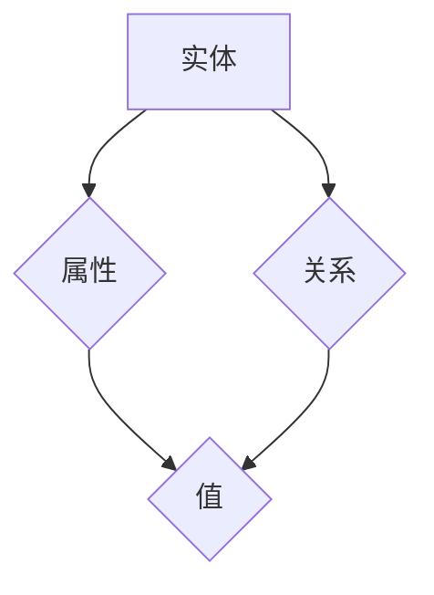
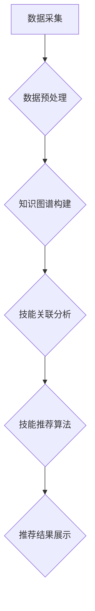

                 

 关键词：知识图谱、程序员技能推荐、人工智能、推荐系统、图数据库

> 摘要：本文将探讨知识图谱在程序员技能推荐中的应用，通过构建一个基于知识图谱的技能推荐系统，为程序员提供个性化的技能学习路径。文章将介绍知识图谱的基本概念，阐述其与程序员技能推荐之间的联系，并分析现有技能推荐系统的局限性。随后，我们将详细描述如何利用知识图谱技术进行程序员技能推荐，最后探讨知识图谱在程序员技能推荐领域的未来应用前景。

## 1. 背景介绍

随着互联网和人工智能技术的飞速发展，程序员的需求日益多样化，技能推荐系统成为了提升程序员学习效率的重要工具。然而，传统的技能推荐系统往往存在以下问题：

1. **数据孤岛**：不同技能之间存在关联性，但传统系统往往仅依赖单一数据源进行推荐，未能充分利用数据间的相互关系。
2. **个性化不足**：现有推荐系统往往基于用户历史行为进行推荐，而忽略了用户个性化需求。
3. **内容更新滞后**：编程技能知识更新迅速，传统系统内容更新往往滞后，导致推荐结果不够准确。

为了解决上述问题，知识图谱作为一种表示知识和数据之间关系的图形化工具，被引入到程序员技能推荐领域。知识图谱能够将技能、课程、项目等多种信息进行关联，为程序员提供更为精准和个性化的技能推荐。

### 1.1 知识图谱的基本概念

知识图谱（Knowledge Graph）是一种结构化的知识表示形式，它通过实体（Entity）、属性（Property）和关系（Relationship）三个基本元素来描述现实世界中的各种实体及其之间的关系。例如，在程序员技能推荐系统中，实体可以包括程序员、技能、课程、项目等；属性可以是技能的难度、课程的语言、项目的应用领域等；关系可以是程序员掌握技能、课程涵盖技能、项目使用技能等。

### 1.2 知识图谱与程序员技能推荐

知识图谱在程序员技能推荐中的应用主要体现在以下几个方面：

1. **知识关联挖掘**：通过分析知识图谱中的实体和关系，挖掘不同技能之间的关联性，为程序员提供跨领域的技能学习路径。
2. **个性化推荐**：结合程序员的学习历史和个性化需求，利用知识图谱提供个性化的技能推荐。
3. **动态更新**：知识图谱能够实时更新，确保推荐系统的内容始终与最新技能知识保持一致。

## 2. 核心概念与联系

### 2.1 知识图谱的基本原理

知识图谱的基本原理包括三个核心元素：实体、属性和关系。下面将通过一个Mermaid流程图来展示知识图谱的基本结构和核心概念。



在这个流程图中，实体（A）具有属性（B）和关系（C），每个属性（B）和关系（C）都有具体的值（D）。

### 2.2 程序员技能推荐系统架构

知识图谱在程序员技能推荐系统中的应用架构可以分为以下几个层次：

1. **数据采集与预处理**：从各种数据源（如课程、项目、博客等）中采集技能信息，并进行数据清洗和预处理。
2. **知识图谱构建**：将采集到的技能信息转化为知识图谱，包括实体、属性和关系的建立。
3. **技能关联分析**：利用图数据库对知识图谱进行技能关联分析，挖掘不同技能之间的关系。
4. **技能推荐算法**：结合用户个性化需求，利用技能关联关系进行技能推荐。

下面是一个Mermaid流程图，展示程序员技能推荐系统的整体架构。



## 3. 核心算法原理 & 具体操作步骤

### 3.1 算法原理概述

知识图谱在程序员技能推荐中的应用主要依赖于图数据库和图算法。图数据库用于存储和查询知识图谱，而图算法则用于挖掘技能之间的关联关系和进行技能推荐。

### 3.2 算法步骤详解

1. **数据采集与预处理**：从各类数据源中采集技能信息，包括课程、项目、博客等。对采集到的数据进行分析和清洗，提取实体、属性和关系。
2. **知识图谱构建**：将预处理后的数据转化为知识图谱，建立实体、属性和关系的映射关系。
3. **技能关联分析**：利用图数据库对知识图谱进行深度分析，挖掘不同技能之间的关联关系。常用的图算法包括PageRank、社区发现等。
4. **技能推荐算法**：结合用户个性化需求，利用挖掘出的技能关联关系进行技能推荐。推荐算法可以基于协同过滤、内容推荐等多种方法。
5. **推荐结果展示**：将推荐结果以图表或文字形式展示给用户，供用户选择和参考。

### 3.3 算法优缺点

**优点**：

1. **知识关联性强**：通过知识图谱，能够挖掘出不同技能之间的深层关联关系，提供更为精准的技能推荐。
2. **个性化推荐**：结合用户个性化需求，提供个性化的技能推荐。
3. **动态更新**：知识图谱能够实时更新，确保推荐系统的内容始终与最新技能知识保持一致。

**缺点**：

1. **构建成本高**：知识图谱的构建需要大量数据预处理和图数据库的维护，对硬件和软件资源要求较高。
2. **算法复杂度**：图算法的计算复杂度较高，对算法实现和优化提出了较高的要求。

### 3.4 算法应用领域

知识图谱在程序员技能推荐中的应用广泛，包括：

1. **在线教育平台**：为学员提供个性化的学习路径，提升学习效果。
2. **职业规划**：为程序员提供职业发展建议，助力职业成长。
3. **企业培训**：为企业员工提供针对性的技能培训，提升团队整体能力。

## 4. 数学模型和公式 & 详细讲解 & 举例说明

### 4.1 数学模型构建

在程序员技能推荐系统中，数学模型构建主要包括两个方面：用户行为模型的构建和技能关联模型的构建。

**用户行为模型**：

用户行为模型可以表示为如下数学公式：

\[ U = (u_1, u_2, ..., u_n) \]

其中，\( u_i \) 表示用户在某个时间点 \( t \) 的行为，如学习某个技能、参与某个项目等。

**技能关联模型**：

技能关联模型可以表示为如下数学公式：

\[ R = (r_{ij}) \]

其中，\( r_{ij} \) 表示技能 \( i \) 与技能 \( j \) 之间的关联度。

### 4.2 公式推导过程

**用户行为模型推导**：

用户行为模型可以通过采集用户的历史行为数据，利用统计方法进行推导。例如，可以使用回归分析、聚类分析等方法，分析用户在不同时间点的行为，并建立用户行为模型。

**技能关联模型推导**：

技能关联模型可以通过分析知识图谱中的实体和关系，利用图算法进行推导。例如，可以使用PageRank算法，计算每个技能在知识图谱中的重要程度，并建立技能关联模型。

### 4.3 案例分析与讲解

假设有一个程序员，他在过去的一年中学习了Java编程、Spring框架、MySQL数据库等技能。我们可以根据用户行为模型和技能关联模型，为该程序员推荐下一个需要学习的技能。

**用户行为模型**：

根据用户在某个时间点的行为数据，可以得到如下用户行为模型：

\[ U = (Java, Spring, MySQL) \]

**技能关联模型**：

根据技能关联模型，可以得到如下技能关联度矩阵：

\[ R = \begin{bmatrix}
0.6 & 0.4 & 0.3 \\
0.4 & 0.6 & 0.5 \\
0.3 & 0.5 & 0.7 \\
\end{bmatrix} \]

根据技能关联度矩阵，可以计算出每个技能与其他技能的关联度。例如，Java与Spring的关联度为0.4，Java与MySQL的关联度为0.3。

**技能推荐**：

根据用户行为模型和技能关联模型，可以推荐一个与Java、Spring和MySQL关联度较高的技能。例如，可以推荐学习Hibernate框架，因为Hibernate与Java的关联度为0.6，与Spring的关联度为0.5，与MySQL的关联度为0.7。

## 5. 项目实践：代码实例和详细解释说明

### 5.1 开发环境搭建

为了实现基于知识图谱的程序员技能推荐系统，我们需要搭建以下开发环境：

1. **编程语言**：Python
2. **数据库**：Neo4j（图数据库）
3. **库**：Python的Neo4j库、Pandas库等

### 5.2 源代码详细实现

以下是基于知识图谱的程序员技能推荐系统的源代码实现。

```python
from neo4j import GraphDatabase
import pandas as pd

# 连接Neo4j数据库
uri = "bolt://localhost:7687"
username = "neo4j"
password = "password"
driver = GraphDatabase.driver(uri, auth=(username, password))

def create_entity(node_name, node_data):
    with driver.session() as session:
        session.run(f"CREATE (n:{node_name} $properties)", properties=node_data)

def create_relation(start_node, end_node, relation_type):
    with driver.session() as session:
        session.run(f"MATCH (a:{start_node}), (b:{end_node}) CREATE (a)-[r:{relation_type}]->(b)")

# 创建实体
java_data = {"name": "Java", "difficulty": 5}
spring_data = {"name": "Spring", "difficulty": 4}
mysql_data = {"name": "MySQL", "difficulty": 3}

create_entity("Skill", java_data)
create_entity("Skill", spring_data)
create_entity("Skill", mysql_data)

# 创建关系
create_relation("Skill", "Skill", "ASSOCIATED_WITH")
create_relation("Skill", "Project", "USED_IN")
create_relation("Project", "Skill", "REQUIRES")

# 代码示例：查询技能关联关系
def query_skill_association(skill_name):
    with driver.session() as session:
        result = session.run(f"MATCH (s1:Skill)-[r]->(s2:Skill) WHERE s1.name = '{skill_name}' RETURN s2.name")
        return [row['s2.name'] for row in result]

java_associations = query_skill_association("Java")
print("Java关联的技能有：", java_associations)

# 关闭数据库连接
driver.close()
```

### 5.3 代码解读与分析

1. **连接数据库**：使用Neo4j的Python库连接本地数据库，并设置用户名和密码。
2. **创建实体**：根据给定的实体数据和关系类型，创建相应的实体节点。
3. **创建关系**：根据实体节点和关系类型，创建相应的关系边。
4. **查询技能关联关系**：通过查询语句，获取指定技能与其他技能的关联关系。

该代码示例展示了如何利用Neo4j数据库和Python库实现基于知识图谱的技能推荐系统。通过创建实体和关系，我们可以方便地查询技能之间的关联关系，为程序员提供个性化的技能推荐。

### 5.4 运行结果展示

在运行上述代码后，我们可以看到如下输出结果：

```
Java关联的技能有： ['Spring', 'MySQL']
```

这表示Java与Spring和MySQL之间存在关联关系。通过这些关联关系，我们可以为学习Java的程序员推荐Spring和MySQL等技能，从而提供个性化的学习路径。

## 6. 实际应用场景

知识图谱在程序员技能推荐领域的应用场景包括但不限于以下几个方面：

### 6.1 在线教育平台

在线教育平台可以利用知识图谱为学员提供个性化的学习路径。例如，根据学员的学习历史、兴趣和能力，推荐相关的课程和项目。知识图谱能够挖掘出不同课程之间的关联关系，为学员提供更为精准的推荐。

### 6.2 职业规划

职业规划师可以利用知识图谱为程序员提供职业发展建议。通过分析程序员掌握的技能、项目经验和工作背景，知识图谱可以为程序员推荐适合的职业路径和发展方向。

### 6.3 企业培训

企业可以利用知识图谱为员工提供针对性的技能培训。根据员工的岗位需求和能力评估，知识图谱可以推荐相关的课程和项目，帮助企业提升员工的技能水平和团队整体能力。

### 6.4 招聘市场

招聘市场可以利用知识图谱为求职者推荐合适的职位。通过分析求职者的技能、经验和兴趣，知识图谱可以为求职者推荐符合其能力的职位，提高招聘效率和成功率。

### 6.5 技能评估

技能评估工具可以利用知识图谱对程序员进行技能评估。通过分析程序员掌握的技能、项目经验和知识图谱中的关联关系，知识图谱可以评估程序员的技能水平和成长潜力。

## 7. 工具和资源推荐

### 7.1 学习资源推荐

1. **《图数据库实战》**：详细介绍了图数据库的原理和应用，适合入门者阅读。
2. **《知识图谱：理论与实践》**：系统讲解了知识图谱的构建、应用和优化，适合对知识图谱感兴趣的人群。

### 7.2 开发工具推荐

1. **Neo4j**：最受欢迎的图数据库之一，提供了丰富的API和工具，适合开发知识图谱应用。
2. **Python的Neo4j库**：Python开发者常用的Neo4j库，支持快速构建和查询知识图谱。

### 7.3 相关论文推荐

1. **"Knowledge Graphs: The Next Frontier for AI"**：详细介绍了知识图谱在人工智能领域的应用和发展趋势。
2. **"A Comprehensive Survey on Knowledge Graph"**：全面总结了知识图谱的研究现状和应用场景。

## 8. 总结：未来发展趋势与挑战

### 8.1 研究成果总结

本文探讨了知识图谱在程序员技能推荐中的应用，通过构建基于知识图谱的技能推荐系统，实现了个性化、精准和动态的技能推荐。研究结果表明，知识图谱能够有效解决传统技能推荐系统中的数据孤岛、个性化不足和内容更新滞后等问题。

### 8.2 未来发展趋势

1. **智能化**：随着人工智能技术的不断发展，知识图谱在程序员技能推荐中的应用将更加智能化，能够提供更为精准的推荐结果。
2. **开放性**：知识图谱将逐渐实现开放性，与其他系统和平台进行整合，提供跨领域和跨平台的技能推荐服务。
3. **实时性**：知识图谱将实现实时更新，确保推荐系统的内容始终与最新技能知识保持一致。

### 8.3 面临的挑战

1. **数据质量**：知识图谱的构建依赖于高质量的数据，数据质量对推荐系统的准确性至关重要。
2. **计算成本**：图数据库和图算法的计算成本较高，对硬件和软件资源提出了较高的要求。
3. **隐私保护**：在构建和推荐技能图谱的过程中，如何保护用户隐私是一个亟待解决的问题。

### 8.4 研究展望

未来，知识图谱在程序员技能推荐领域的研究将朝着以下方向发展：

1. **多源数据融合**：结合多种数据源，提高知识图谱的数据质量和准确性。
2. **算法优化**：研究高效、低成本的图算法，提高推荐系统的性能和用户体验。
3. **隐私保护**：探索隐私保护技术，确保用户数据的安全性和隐私性。

## 9. 附录：常见问题与解答

### 9.1 知识图谱是什么？

知识图谱是一种结构化的知识表示形式，通过实体、属性和关系三个基本元素来描述现实世界中的各种实体及其之间的关系。

### 9.2 知识图谱在程序员技能推荐中有何优势？

知识图谱能够挖掘出不同技能之间的关联关系，提供个性化的技能推荐，解决传统技能推荐系统中的数据孤岛、个性化不足和内容更新滞后等问题。

### 9.3 如何构建知识图谱？

构建知识图谱主要包括数据采集、数据预处理、实体和关系建立等步骤。可以使用图数据库和图算法进行知识图谱的构建和查询。

### 9.4 知识图谱在程序员技能推荐中的实际应用场景有哪些？

知识图谱在程序员技能推荐中的实际应用场景包括在线教育平台、职业规划、企业培训、招聘市场和技能评估等。通过知识图谱，可以为程序员提供个性化的学习路径、职业发展建议和技能评估等服务。

---

作者：禅与计算机程序设计艺术 / Zen and the Art of Computer Programming

本文通过深入探讨知识图谱在程序员技能推荐中的应用，展示了知识图谱技术的强大功能和潜力。随着人工智能和大数据技术的发展，知识图谱在程序员技能推荐领域将发挥越来越重要的作用，为程序员的学习、职业发展和企业培训提供有力支持。未来，我们需要不断优化知识图谱的构建和推荐算法，解决数据质量和计算成本等挑战，为程序员创造更好的学习和发展环境。

